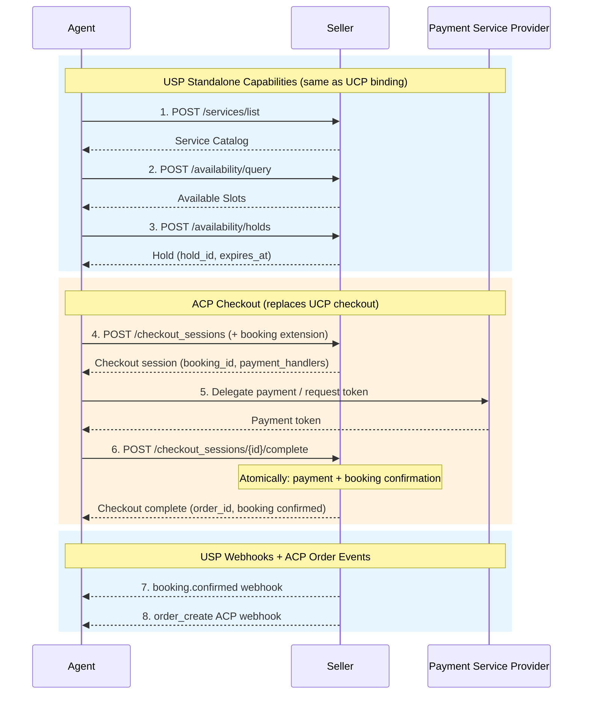

# Universal Scheduling Protocol (USP) — ACP Binding

**Version:** `2026-02-09`

**Status:** Draft

---

## Abstract

This document specifies how sellers implementing the [Agentic Commerce Protocol (ACP)][ACP] can adopt [Universal Scheduling Protocol (USP)][USP] scheduling capabilities without switching to [UCP][UCP].

USP is primarily a set of capabilities and extensions within the [Universal Commerce Protocol (UCP)][UCP] ecosystem. The [USP Specification][USP] defines the complete scheduling domain - service catalog, availability, bookings, waitlist - along with all supporting infrastructure: discovery, transport bindings, identity linking, buyer consent, embedded UI, webhook signing, versioning, and namespace governance. USP inherits this infrastructure from UCP, which means USP's maintainers can focus exclusively on the scheduling domain.

ACP is a focused agentic checkout protocol backed by OpenAI and Stripe. It provides excellent checkout, payment, and order infrastructure, but does not provide the general-purpose capability registry, transport framework, identity linking, buyer consent, or embedded UI infrastructure that UCP provides and USP relies on. This document bridges that gap by defining:

1. **Infrastructure mapping** - how ACP's infrastructure maps to the UCP infrastructure that USP expects, and what ACP sellers must additionally implement.
2. **Paid bookings via ACP checkout** - how to use ACP's extension mechanism to add a `booking` object to checkout sessions, replacing USP's `dev.usp.services.paid_bookings` UCP extension.
3. **Discovery for ACP sellers** - how ACP sellers advertise their USP scheduling capabilities.

The scheduling domain itself - service schemas, availability model, booking lifecycle, waitlist, policies, resource requirements, error codes, and all standalone operations - is **not redefined here**. It is defined once in the [USP Specification (UCP Extension)][USP] and is normative for all USP implementations regardless of the underlying commerce protocol.

## Status of This Memo

This document specifies a Draft protocol for the Internet community and requests discussion and suggestions for improvements. Distribution of this memo is unlimited.

## Copyright Notice

Copyright (c) 2026 USP Authors. This specification is released under the [Apache License, Version 2.0](https://www.apache.org/licenses/LICENSE-2.0).

---

## Table of Contents

- [1. Introduction](#1-introduction)
  - [1.1 Why a Separate Binding](#11-why-a-separate-binding)
  - [1.2 Scope of This Document](#12-scope-of-this-document)
  - [1.3 Conventions](#13-conventions)
- [2. Architectural Context](#2-architectural-context)
  - [2.1 USP as a UCP Extension](#21-usp-as-a-ucp-extension)
  - [2.2 Role of the ACP Binding](#22-role-of-the-acp-binding)
- [3. Infrastructure Mapping](#3-infrastructure-mapping)
  - [3.1 Summary Table](#31-summary-table)
  - [3.2 Discovery](#32-discovery)
  - [3.3 Authentication and Headers](#33-authentication-and-headers)
  - [3.4 Versioning](#34-versioning)
  - [3.5 Idempotency](#35-idempotency)
  - [3.6 Error Model](#36-error-model)
  - [3.7 Webhook Signing](#37-webhook-signing)
  - [3.8 Transport Bindings](#38-transport-bindings)
  - [3.9 Identity Linking](#39-identity-linking)
  - [3.10 Buyer Consent](#310-buyer-consent)
  - [3.11 Embedded UI](#311-embedded-ui)
- [4. Standalone Scheduling Capabilities](#4-standalone-scheduling-capabilities)
  - [4.1 Applicable Sections](#41-applicable-sections)
  - [4.2 Header Conventions for ACP Sellers](#42-header-conventions-for-acp-sellers)
  - [4.3 Response Metadata](#43-response-metadata)
- [5. Paid Bookings via ACP Checkout](#5-paid-bookings-via-acp-checkout)
  - [5.1 Extension Declaration](#51-extension-declaration)
  - [5.2 Booking Object in Checkout Session](#52-booking-object-in-checkout-session)
  - [5.3 Checkout Flow](#53-checkout-flow)
  - [5.4 Deposit and Refund Rules](#54-deposit-and-refund-rules)
  - [5.5 Payment Architecture](#55-payment-architecture)
- [6. End-to-End Flows](#6-end-to-end-flows)
  - [6.1 Paid Service (ACP Checkout)](#61-paid-service-acp-checkout)
  - [6.2 Free Service (No ACP Involvement)](#62-free-service-no-acp-involvement)
- [7. Post-Booking Lifecycle](#7-post-booking-lifecycle)
- [8. References](#8-references)

---

## 1. Introduction

The [Universal Scheduling Protocol (USP)][USP] enables consumer platforms, AI agents, and businesses to discover, check availability of, and book time-based services. USP is defined as a set of capabilities and extensions within the [Universal Commerce Protocol (UCP)][UCP] ecosystem. By operating within UCP, USP inherits a rich infrastructure stack - discovery, transport bindings (REST, MCP, A2A), identity linking, buyer consent, embedded UI, webhook signing, versioning, and namespace governance - allowing its maintainers to focus exclusively on the scheduling domain.

This document specifies an **ACP binding** for USP: a mapping layer that enables sellers who have implemented ACP's Agentic Checkout - but have not adopted UCP - to offer USP scheduling capabilities using ACP's infrastructure for the commerce portions of the flow.

The key words **MUST**, **MUST NOT**, **REQUIRED**, **SHALL**, **SHALL NOT**, **SHOULD**, **SHOULD NOT**, **RECOMMENDED**, **MAY**, and **OPTIONAL** in this document are to be interpreted as described in [RFC 2119] and [RFC 8174].

### 1.1 Why a Separate Binding

ACP and UCP are different commerce protocols with different architectures:

- **UCP** is a general-purpose commerce platform protocol with a rich capability registry, transport framework, identity linking, buyer consent, embedded UI (ECP), and extension architecture designed for cross-namespace capabilities. USP plugs into UCP naturally - it registers capabilities in `/.well-known/ucp`, inherits all infrastructure, and extends `dev.ucp.shopping.checkout` for paid bookings.

- **ACP** is a focused agentic checkout protocol. It provides excellent checkout sessions, payment handlers, delegate payment, and order management - but it does not provide a general-purpose capability registry, transport bindings beyond REST, identity linking, buyer consent management, or embedded UI infrastructure.

A seller that has already implemented ACP should not be forced to adopt UCP in order to offer scheduling. This binding provides a path: implement USP's scheduling endpoints using ACP's conventions, and bridge paid bookings through ACP's checkout sessions.

### 1.2 Scope of This Document

This document defines **only** what is specific to the ACP binding:

| In Scope | Out of Scope (defined in [USP Specification][USP]) |
|----------|---------------------------------------------------|
| Discovery for ACP sellers | Service catalog schema, operations, feed |
| Infrastructure mapping (ACP ↔ UCP) | Availability model, time slots, holds |
| ACP header conventions for USP endpoints | Booking lifecycle, schema, operations |
| Paid bookings via ACP checkout sessions | Waitlist extension |
| ACP-specific end-to-end flow examples | Service verticals and policies |
| Post-booking lifecycle via ACP orders | Error codes and severity model |
| | Transport bindings (REST, MCP, A2A) |
| | Identity linking, buyer consent, ESP |
| | Security model, rate limiting, hold abuse |
| | Namespace governance, versioning rules |

The [USP Specification][USP] is the **normative reference** for all scheduling domain content. This document is normative only for the ACP-specific mapping and paid bookings extension.

### 1.3 Conventions

All conventions (dates, durations, currency amounts, timezones) are defined in [USP Specification, Section 1.1][USP-1.1]. ACP-specific note: ACP uses lowercase ISO 4217 currency codes (e.g., `usd`); USP responses from ACP sellers **SHOULD** follow this convention for consistency with ACP checkout responses.

---

## 2. Architectural Context

### 2.1 USP as a UCP Extension

USP is primarily a UCP extension. The [USP Specification][USP] defines the complete protocol:

- **Scheduling domain** - Service catalog, availability, bookings, waitlist (Sections 4-6, 9)
- **Paid bookings** - Extension of `dev.ucp.shopping.checkout` (Section 7)
- **Infrastructure** - All inherited from UCP:
  - Discovery via `/.well-known/ucp` capability registry
  - Transport bindings: REST, MCP (JSON-RPC 2.0), A2A (Agent-to-Agent)
  - Identity linking via `dev.ucp.common.identity_linking`
  - Buyer consent via `dev.ucp.shopping.buyer_consent`
  - Embedded UI via ESP (extends UCP's ECP)
  - Webhook signing via detached JWS with `signing_keys` in profile
  - Date-based versioning with negotiation protocol
  - Namespace governance with reverse-domain convention

### 2.2 Role of the ACP Binding

This binding is a **compatibility layer**, not a second protocol specification. It enables the following:

```
┌──────────────────────────────────────────────────────┐
│           USP Specification (UCP Extension)           │
│                                                      │
│  Scheduling Domain    │  Infrastructure (from UCP)   │
│  ─────────────────    │  ─────────────────────────   │
│  Service Catalog      │  Discovery (/.well-known/ucp)│
│  Availability         │  Transport (REST, MCP, A2A)  │
│  Bookings             │  Identity Linking            │
│  Waitlist             │  Buyer Consent               │
│  Paid Bookings (UCP)  │  Embedded UI (ESP/ECP)       │
│                       │  Webhook Signing (JWS)       │
│                       │  Versioning, Namespaces      │
└──────────────┬───────────────────────────────────────┘
               │
               │ normative reference
               │
┌──────────────▼───────────────────────────────────────┐
│            ACP Binding (this document)                │
│                                                      │
│  Scheduling Domain:  Same — references USP Spec      │
│  Paid Bookings:      Via ACP checkout sessions       │
│  Infrastructure:     Mapped from ACP equivalents     │
│  Discovery:          /.well-known/usp (ACP sellers)  │
└──────────────────────────────────────────────────────┘
```

For a seller that has already implemented ACP's Agentic Checkout but hasn't adopted UCP, this binding provides a path to USP scheduling capabilities without switching commerce protocols. The seller:

1. Implements USP's standalone scheduling endpoints (catalog, availability, bookings) using ACP's header and authentication conventions.
2. Bridges paid bookings through ACP's checkout session extension mechanism.
3. Publishes a `/.well-known/usp` scheduling profile for discovery.

The scheduling domain logic - schemas, operations, validation rules, policies, error codes - is identical regardless of whether the seller uses UCP or ACP for commerce.

---

## 3. Infrastructure Mapping

This section maps each UCP infrastructure component that USP relies on to its ACP equivalent. Where ACP does not provide an equivalent, this section specifies the minimum adaptation for ACP sellers.

### 3.1 Summary Table

| USP/UCP Infrastructure | ACP Equivalent | Adaptation for ACP Sellers |
|---|---|---|
| `/.well-known/ucp` profile with USP capabilities | N/A | Publish `/.well-known/usp` scheduling profile ([Section 3.2](#32-discovery)) |
| `UCP-Agent` header for capability negotiation | `Authorization: Bearer` | Use `Authorization: Bearer` + `API-Version` ([Section 3.3](#33-authentication-and-headers)) |
| UCP date-based versioning with negotiation | ACP `API-Version` header | Use `API-Version` header with USP version ([Section 3.4](#34-versioning)) |
| UCP `Idempotency-Key` semantics | ACP `Idempotency-Key` semantics | **Compatible.** Use same semantics ([Section 3.5](#35-idempotency)) |
| UCP `messages[]` error model | ACP `messages[]` error model | **Structurally compatible.** Use same pattern ([Section 3.6](#36-error-model)) |
| UCP detached JWS webhook signing | ACP `Signature` + `Timestamp` headers | Use ACP's signing for consistency ([Section 3.7](#37-webhook-signing)) |
| UCP REST + MCP + A2A transport bindings | ACP REST only | REST is available; MCP/A2A per [USP Spec][USP] if desired ([Section 3.8](#38-transport-bindings)) |
| `dev.ucp.common.identity_linking` | N/A | Implement per [USP Spec, Section 11.7][USP-11.7] if needed ([Section 3.9](#39-identity-linking)) |
| `dev.ucp.shopping.buyer_consent` | N/A | Implement per [USP Spec, Section 11.8][USP-11.8] if needed ([Section 3.10](#310-buyer-consent)) |
| UCP ECP → USP ESP | N/A | Implement per [USP Spec, Section 10.5][USP-10.5] if needed ([Section 3.11](#311-embedded-ui)) |
| `dev.usp.services.paid_bookings` extends `dev.ucp.shopping.checkout` | ACP extension mechanism | ACP `scheduling` extension ([Section 5](#5-paid-bookings-via-acp-checkout)) |

### 3.2 Discovery

UCP sellers publish USP capabilities in their `/.well-known/ucp` profile. ACP does not have a general-purpose capability registry, so ACP sellers **MUST** publish a scheduling profile at `/.well-known/usp`:

```json
{
  "usp": {
    "version": "2026-02-09",
    "binding": "acp",
    "endpoint": "https://api.business.example.com/scheduling/v1",
    "capabilities": {
      "dev.usp.services.catalog": {"version": "2026-02-09"},
      "dev.usp.services.availability": {"version": "2026-02-09"},
      "dev.usp.services.bookings": {"version": "2026-02-09"},
      "dev.usp.services.paid_bookings": {
        "version": "2026-02-09",
        "extends": "acp.checkout_session"
      }
    },
    "seller": {
      "name": "Sunrise Wellness Studio",
      "timezone": "America/New_York",
      "currency": "usd"
    },
    "acp": {
      "checkout_endpoint": "https://api.business.example.com/checkout_sessions",
      "api_version": "2026-01-30"
    },
    "webhook_signing_keys": [
      {
        "kid": "usp-webhook-key-2026-02",
        "kty": "EC",
        "crv": "P-256",
        "x": "...",
        "y": "..."
      }
    ]
  }
}
```

The `binding` field indicates this seller uses the ACP binding. Agents discovering this profile know to use ACP checkout (not UCP checkout) for paid bookings.

Sellers offering only free services omit the `acp` object and the `dev.usp.services.paid_bookings` capability.

### 3.3 Authentication and Headers

USP standalone endpoints on ACP sellers use ACP-compatible headers:

| Header | Required | Description |
|--------|----------|-------------|
| `Authorization` | **Yes** | `Bearer <token>`, consistent with ACP. |
| `API-Version` | **Yes** | USP capability version (e.g., `2026-02-09`). |
| `Idempotency-Key` | **Yes** (state-modifying) | UUID v4, consistent with ACP. |
| `Content-Type` | **Yes** | `application/json`. |
| `Request-Id` | No | Optional request trace identifier. |

```
POST /scheduling/v1/services/list HTTP/1.1
Host: api.business.example.com
Authorization: Bearer sk_live_abc123
API-Version: 2026-02-09
Content-Type: application/json

{"filters": {"type": "appointment"}}
```

### 3.4 Versioning

USP capability versions use the `YYYY-MM-DD` format, consistent with both UCP and ACP. The ACP `API-Version` header is used for both ACP checkout operations and USP standalone operations.

The ACP API version and USP capability version are independent. A new USP version does not require a new ACP API version, and vice versa.

Version negotiation follows the same rules as [USP Specification, Section 3.4][USP-3.4]: if the agent's version exceeds the seller's, the seller returns a `version_unsupported` error.

### 3.5 Idempotency

ACP and UCP define compatible idempotency semantics. ACP sellers **MUST** support `Idempotency-Key` on all state-modifying USP operations with the same behavior:

- Same key + same body → replay cached result
- Same key + different body → `422 idempotency_conflict`
- In-flight duplicate → `409 idempotency_in_flight`

This is consistent with both ACP and [USP Specification, Section 10.1.1][USP-10.1.1].

### 3.6 Error Model

Both ACP and UCP use a `messages[]` array for business outcome errors. ACP sellers **MUST** use the same error pattern on USP endpoints:

- **Business outcome errors** (slot unavailable, hold expired, capacity exceeded) → HTTP 200 with `messages[]` array.
- **Protocol errors** (malformed request, auth failure) → standard HTTP status codes.

Error codes and severity values are defined in [USP Specification, Section 10.4][USP-10.4]. The `messages[]` structure is structurally compatible between ACP and UCP.

### 3.7 Webhook Signing

UCP uses detached JWS for webhook signing. ACP uses `Signature` + `Timestamp` headers. ACP sellers **SHOULD** use ACP's signing mechanism for USP booking webhooks to maintain consistency with their ACP order webhooks. Alternatively, sellers **MAY** use detached JWS as defined in [USP Specification, Section 11.3][USP-11.3].

Whichever mechanism is used, signing keys **MUST** be published in the `/.well-known/usp` profile's `webhook_signing_keys` array.

### 3.8 Transport Bindings

The [USP Specification][USP] defines REST, MCP, and A2A transport bindings (Sections 10.1-10.3). ACP natively supports only REST.

- **REST:** Available. ACP sellers implement USP REST endpoints with ACP-compatible headers ([Section 3.3](#33-authentication-and-headers)).
- **MCP:** ACP does not define an MCP binding. ACP sellers wishing to support MCP for AI agents **SHOULD** implement it per [USP Specification, Section 10.2][USP-10.2]. This is optional.
- **A2A:** ACP does not define an A2A binding. ACP sellers wishing to support A2A **SHOULD** implement it per [USP Specification, Section 10.3][USP-10.3]. This is optional.

### 3.9 Identity Linking

ACP does not provide identity linking infrastructure. ACP sellers that need identity linking for scheduling (member pricing, returning-client history, loyalty programs) **SHOULD** implement it per [USP Specification, Section 11.7][USP-11.7], which defines:

- OAuth 2.0 authorization code flow
- Scheduling-specific scopes (`usp:booking`, `usp:history`, `usp:preferences`, `usp:loyalty`)
- Token revocation per [RFC 7009]

This is the same implementation that UCP sellers use, but ACP sellers implement it independently rather than inheriting it from UCP's `dev.ucp.common.identity_linking` capability.

### 3.10 Buyer Consent

ACP does not provide a buyer consent model. ACP sellers that handle personal data in bookings (contact information, health details, location data) **SHOULD** implement buyer consent per [USP Specification, Section 11.8][USP-11.8], which defines:

- Consent categories: `analytics`, `marketing`, `data_sharing`, `health_data`
- Transmission via optional `consent` object in booking or checkout requests
- Audit requirements

### 3.11 Embedded UI

ACP does not provide an embedded UI protocol. ACP sellers that want to offer in-app booking experiences **MAY** implement the Embedded Scheduling Protocol (ESP) per [USP Specification, Section 10.5][USP-10.5]. ESP defines:

- JSON-RPC 2.0 communication model (`esp.ready`, `esp.start`, `esp.complete`, etc.)
- Delegation negotiation for slot selection, resource selection, party details, and payment
- Security requirements (iframe sandboxing, CSP headers)

For the payment credential delegation (`esp.payment.credential_request`), ACP sellers delegate to ACP's payment flow instead of UCP's.

---

## 4. Standalone Scheduling Capabilities

The standalone USP capabilities - catalog, availability, bookings, and waitlist - are **defined in the [USP Specification][USP]** and are normative for ACP sellers. The scheduling domain is commerce-protocol-independent: the same schemas, operations, validation rules, policies, and error codes apply regardless of whether the seller uses UCP or ACP.

### 4.1 Applicable Sections

ACP sellers **MUST** implement the following sections of the [USP Specification][USP]:

| USP Spec Section | Capability | Description |
|---|---|---|
| [Section 1.3][USP-1.3] | - | Service verticals (appointment, group, reservation, rental) |
| [Section 4][USP-4] | `dev.usp.services.catalog` | Service catalog: schema, feed, caching, operations (list, get) |
| [Section 5][USP-5] | `dev.usp.services.availability` | Availability: time slots, holds, query, caching strategy |
| [Section 6][USP-6] | `dev.usp.services.bookings` | Bookings: lifecycle, schema, operations (create, get, update, confirm, cancel, reschedule), webhooks |
| [Section 9][USP-9] | `dev.usp.services.waitlist` | Waitlist: schema, lifecycle, operations (optional) |
| [Section 10.4][USP-10.4] | - | Error codes and severity mapping |
| [Section 11.1-11.6][USP-11] | - | Security: TLS, rate limiting, hold abuse prevention, data privacy, authentication |

### 4.2 Header Conventions for ACP Sellers

The only difference from the USP Specification's REST binding is the header set. Where the USP Specification uses UCP's `UCP-Agent` header for capability negotiation, ACP sellers use the headers defined in [Section 3.3](#33-authentication-and-headers) of this document.

### 4.3 Response Metadata

USP responses from UCP sellers include a `ucp` metadata object. ACP sellers **MUST** include a `usp` metadata object instead, since they do not operate within UCP's profile:

```json
{
  "usp": {
    "version": "2026-02-09",
    "binding": "acp",
    "capabilities": {
      "dev.usp.services.catalog": {"version": "2026-02-09"}
    }
  },
  "services": [...]
}
```

The `binding` field indicates the commerce binding in use. Agents can use this to determine whether paid bookings use UCP checkout or ACP checkout.

---

## 5. Paid Bookings via ACP Checkout

This section replaces [USP Specification, Section 7 (Paid Bookings Extension)][USP-7] for ACP sellers. Where the USP Specification bridges paid bookings through `dev.ucp.shopping.checkout`, this binding bridges them through ACP's checkout session.

### 5.1 Extension Declaration

The paid bookings extension uses ACP's formal extension mechanism ([ACP Extensions RFC][ACP-Extensions]):

```json
{
  "name": "scheduling",
  "extends": [
    "$.CheckoutSessionCreateRequest.booking",
    "$.CheckoutSessionUpdateRequest.booking",
    "$.CheckoutSession.booking"
  ],
  "schema": "https://usp.dev/schemas/acp/scheduling.json",
  "spec": "https://usp.dev/specification/acp-binding#5-paid-bookings-via-acp-checkout"
}
```

The agent declares the `scheduling` extension in the `capabilities.extensions` field of the `POST /checkout_sessions` request. The seller responds with the active extension.

### 5.2 Booking Object in Checkout Session

The extension adds a `booking` object to ACP's checkout session. This object carries the scheduling context - the slot, service, hold, resources, and booking status. The schema is identical to the booking object defined in [USP Specification, Section 7.2][USP-7.2], with the following adaptations for ACP:

**Create checkout session request (`POST /checkout_sessions`):**

```json
{
  "line_items": [
    {
      "item": {"id": "svc_massage_001", "quantity": 1},
      "quantity": 1,
      "name": "Deep Tissue Massage",
      "unit_amount": 12000
    }
  ],
  "currency": "usd",
  "fulfillment_details": {
    "name": "Alice Williams",
    "email": "alice@example.com",
    "phone_number": "+12125551234"
  },
  "capabilities": {
    "extensions": [
      {
        "name": "scheduling",
        "spec": "https://usp.dev/specification/acp-binding#5-paid-bookings-via-acp-checkout"
      }
    ]
  },
  "booking": {
    "service_id": "svc_massage_001",
    "service_type": "appointment",
    "slot": {
      "id": "slot_20260316_1400",
      "start": "2026-03-16T14:00:00-04:00",
      "end": "2026-03-16T15:00:00-04:00",
      "duration": "PT60M"
    },
    "hold_id": "hold_xyz789",
    "resources": [{"id": "staff_jane", "type": "staff", "name": "Jane Smith"}],
    "party_size": 1,
    "confirmation_mode": "auto",
    "notes": "First time visit"
  }
}
```

**Checkout session response:**

```json
{
  "id": "cs_abc123",
  "status": "ready_for_payment",
  "line_items": [
    {
      "id": "li_1",
      "item": {"id": "svc_massage_001", "quantity": 1},
      "quantity": 1,
      "name": "Deep Tissue Massage",
      "unit_amount": 12000
    }
  ],
  "capabilities": {
    "extensions": [
      {
        "name": "scheduling",
        "extends": ["$.CheckoutSession.booking"],
        "schema": "https://usp.dev/schemas/acp/scheduling.json",
        "spec": "https://usp.dev/specification/acp-binding#5-paid-bookings-via-acp-checkout"
      }
    ],
    "payment_handlers": [
      {
        "id": "ph_stripe_card",
        "name": "dev.acp.tokenized.card",
        "version": "2026-01-30",
        "requires_delegate_payment": true,
        "psp": "stripe"
      }
    ]
  },
  "booking": {
    "booking_id": "bkg_456def",
    "service_id": "svc_massage_001",
    "service_type": "appointment",
    "slot": {
      "id": "slot_20260316_1400",
      "start": "2026-03-16T14:00:00-04:00",
      "end": "2026-03-16T15:00:00-04:00",
      "duration": "PT60M"
    },
    "hold_id": "hold_xyz789",
    "resources": [{"id": "staff_jane", "type": "staff", "name": "Jane Smith"}],
    "booking_status": "pending",
    "confirmation_mode": "auto"
  },
  "totals": [
    {"type": "subtotal", "amount": 12000},
    {"type": "total", "amount": 12000}
  ]
}
```

**Booking object fields** are defined in [USP Specification, Section 7.2][USP-7.2]. The field names, types, and semantics are identical.

### 5.3 Checkout Flow

The paid booking flow using ACP checkout:



Steps 1-3 are identical to the UCP binding ([USP Specification, Section 8.1][USP-8.1]). Steps 4-8 replace UCP's `create_checkout` / `complete_checkout` with ACP's `POST /checkout_sessions` / `POST /checkout_sessions/{id}/complete`.

**Key mapping:**

| USP/UCP Concept | ACP Equivalent |
|---|---|
| `create_checkout` | `POST /checkout_sessions` |
| `complete_checkout` | `POST /checkout_sessions/{id}/complete` |
| UCP checkout `status: incomplete` | ACP `status: incomplete` or `not_ready_for_payment` |
| UCP checkout `status: requires_escalation` | ACP `status: authentication_required` |
| UCP checkout `status: complete` | ACP `status: completed` |
| UCP `buyer` in checkout | ACP `fulfillment_details` |
| UCP `payment_handlers` | ACP `capabilities.payment_handlers` |
| UCP order ID | ACP order ID (from `POST .../complete` response) |

### 5.4 Deposit and Refund Rules

Deposit and refund rules are defined in [USP Specification, Section 7.4][USP-7.4]. For ACP sellers:

- For deposit bookings, `line_items[].unit_amount` reflects the deposit amount, consistent with USP's UCP binding.
- Refunds are processed via ACP's order management. The seller **MUST** emit both a `booking.refund_issued` USP webhook and an ACP `order_update` event.
- Cancellation fees follow the service's cancellation policy ([USP Specification, Section 4.7][USP-4.7]).

### 5.5 Payment Architecture

The ACP binding inherits ACP's payment architecture instead of UCP's:

| USP/UCP Payment Concept | ACP Equivalent |
|---|---|
| Trust triangle (business ↔ PSP ↔ platform) | Same three-party model, different handler names |
| Processor tokenizer pattern | `dev.acp.tokenized.card` |
| Platform tokenizer / encrypted credential | ACP delegate payment (`POST /agentic_commerce/delegate_payment`) |
| SCA/3DS challenge via `requires_escalation` | ACP `authentication_required` status with redirect |
| Dynamic handler filtering | Same concept; filter `capabilities.payment_handlers` based on booking context |

Scheduling-specific payment handler filtering criteria are defined in [USP Specification, Section 7.5.5][USP-7.5.5] and apply to ACP sellers as well (e.g., no BNPL for same-day appointments).

---

## 6. End-to-End Flows

### 6.1 Paid Service (ACP Checkout)

See the sequence diagram in [Section 5.3](#53-checkout-flow). A complete paid booking example with request/response payloads:

**Steps 1-3 (USP standalone):** Identical to [USP Specification, Section 8.1][USP-8.1]. Same endpoints, same schemas, same operations. The only difference is headers ([Section 3.3](#33-authentication-and-headers)) and response metadata ([Section 4.3](#43-response-metadata)).

**Step 4 (ACP checkout with booking):** See [Section 5.2](#52-booking-object-in-checkout-session) for full request/response examples.

**Step 5 (payment):** Agent acquires a payment credential using ACP's delegate payment API (`POST /agentic_commerce/delegate_payment`) per the handler configuration.

**Step 6 (complete):** Agent calls `POST /checkout_sessions/{id}/complete` with payment data. Seller atomically processes payment and confirms booking.

**Step 7-8 (webhooks):** Seller emits `booking.confirmed` USP webhook and `order_create` ACP webhook.

### 6.2 Free Service (No ACP Involvement)

For free services, the flow is **identical** to [USP Specification, Section 8.2][USP-8.2]. No ACP checkout is involved. The seller implements USP standalone capabilities (catalog, availability, bookings) and the entire flow uses USP endpoints only.

---

## 7. Post-Booking Lifecycle

Post-booking management (get, cancel, reschedule) uses USP's bookings capability as defined in [USP Specification, Section 6.3][USP-6.3]. The only ACP-specific adaptation:

- The booking object includes a `checkout_session_id` (ACP checkout session ID) instead of referencing a UCP checkout.
- Refunds and disputes for paid bookings are handled via ACP's order management. The seller emits both USP booking webhooks and ACP order event webhooks.
- The ACP order lifecycle (`created` → `confirmed` → `processing` → `shipped` → `delivered` → `canceled`) maps to service bookings as:

| ACP Order Status | Booking Context |
|---|---|
| `created` | Booking created, payment processed |
| `confirmed` | Booking confirmed |
| `completed` / `delivered` | Service delivered |
| `canceled` | Booking canceled; refund processed |

---

## 8. References

### Normative References

- **[USP]** Universal Scheduling Protocol, "USP Specification (UCP Extension)", Version 2026-02-09. [specification.md](../extension/specification.md)
- **[ACP]** Agentic Commerce Protocol, "ACP Specification", Version 2026-01-30. https://agenticcommerce.dev/
- **[ACP-Extensions]** Agentic Commerce Protocol, "Extensions RFC". https://agenticcommerce.dev/rfcs/extensions/
- **[UCP]** Universal Commerce Protocol, "UCP Specification", Version 2026-01-11. https://ucp.dev/latest/specification/overview/
- **[RFC 2119]** Bradner, S., "Key words for use in RFCs to Indicate Requirement Levels", BCP 14, RFC 2119. https://www.rfc-editor.org/rfc/rfc2119
- **[RFC 8174]** Leiba, B., "Ambiguity of Uppercase vs Lowercase in RFC 2119 Key Words", BCP 14, RFC 8174. https://www.rfc-editor.org/rfc/rfc8174
- **[RFC 7009]** Lodderstedt, T., "OAuth 2.0 Token Revocation", RFC 7009. https://www.rfc-editor.org/rfc/rfc7009

---

## Authors' Addresses

*To be determined.*

<!-- Reference link definitions -->

[ACP]: https://agenticcommerce.dev/
[ACP-Extensions]: https://agenticcommerce.dev/rfcs/extensions/
[UCP]: https://ucp.dev/latest/specification/overview/
[USP]: ../extension/specification.md
[RFC 2119]: https://www.rfc-editor.org/rfc/rfc2119
[RFC 8174]: https://www.rfc-editor.org/rfc/rfc8174
[RFC 7009]: https://www.rfc-editor.org/rfc/rfc7009

<!-- Section references into USP Specification -->

[USP-1.1]: ../extension/specification.md#11-conventions
[USP-1.3]: ../extension/specification.md#13-service-verticals
[USP-3.4]: ../extension/specification.md#34-versioning
[USP-4]: ../extension/specification.md#4-service-catalog
[USP-4.7]: ../extension/specification.md#47-service-policies
[USP-5]: ../extension/specification.md#5-availability
[USP-6]: ../extension/specification.md#6-bookings
[USP-6.3]: ../extension/specification.md#63-operations
[USP-7]: ../extension/specification.md#7-paid-bookings-extension
[USP-7.2]: ../extension/specification.md#72-booking-object-in-checkout
[USP-7.4]: ../extension/specification.md#74-deposit-and-refund-rules
[USP-7.5.5]: ../extension/specification.md#755-dynamic-payment-handler-filtering
[USP-8.1]: ../extension/specification.md#81-full-flow-paid-service
[USP-8.2]: ../extension/specification.md#82-non-commerce-flow-free-service
[USP-9]: ../extension/specification.md#9-waitlist-extension
[USP-10.1.1]: ../extension/specification.md#1011-idempotency
[USP-10.2]: ../extension/specification.md#102-mcp-binding
[USP-10.3]: ../extension/specification.md#103-a2a-binding
[USP-10.4]: ../extension/specification.md#104-error-code-mapping
[USP-10.5]: ../extension/specification.md#105-embedded-scheduling-protocol-esp
[USP-11]: ../extension/specification.md#11-security
[USP-11.3]: ../extension/specification.md#113-webhook-security
[USP-11.7]: ../extension/specification.md#117-identity-linking
[USP-11.8]: ../extension/specification.md#118-buyer-consent
