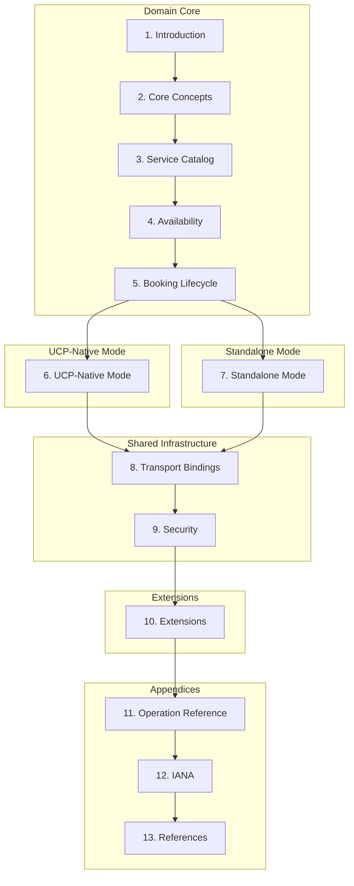

# Universal Scheduling Protocol (USP)

**Version:** `2026-02-17`

**Status:** Draft

## Overview

The Universal Scheduling Protocol (USP) is an open standard that enables consumer platforms and AI agents to **discover**, **check availability of**, and **book** time-based services from businesses. USP supports both **paid** and **free** agentic scheduling through two deployment modes.

USP defines the complete scheduling domain - service catalog, availability, holds, and bookings - as the shared core. Two deployment modes determine how discovery, payment, and infrastructure are handled:

- **UCP-Native Mode**: For platforms that already support the [Universal Commerce Protocol (UCP)](https://ucp.dev). Scheduling capabilities register directly in `/.well-known/ucp`. Paid bookings use UCP's atomic checkout. Infrastructure is inherited from UCP.
- **Standalone Mode**: For platforms that want a self-contained scheduling protocol. Businesses publish `/.well-known/usp`. Payment uses a generic `payment_context` + `confirm-payment` handoff that works with any checkout system, with a first-class [ACP](https://agenticcommerce.dev/) extension available.

Both modes share the same scheduling operations and transport bindings. The mode determines only how discovery, payment, and infrastructure are handled.

## Problem

Existing scheduling standards - iCalendar ([RFC 5545](https://www.rfc-editor.org/rfc/rfc5545)), iTIP ([RFC 5546](https://www.rfc-editor.org/rfc/rfc5546)), CalDAV Scheduling ([RFC 6638](https://www.rfc-editor.org/rfc/rfc6638)), [schema.org/Service](https://schema.org/Service), [Open Booking API](https://openactive.io/open-booking-api/EditorsDraft/1.0CR3/) - address parts of the service scheduling lifecycle but are **fragmented**, lack **native payment integration**, and were not designed for **autonomous AI agent orchestration**. No single open standard unifies:

1. **Service discovery** - types, pricing, policies, and availability hints for AI reasoning
2. **Real-time availability** - time slots, capacity, resource scheduling, and slot holds
3. **Booking lifecycle** - create, confirm, reschedule, cancel, waitlist management, and post-booking events
4. **Payment coordination** - flexible payment paths for different commerce protocols
5. **Identity and consent** - account linking, buyer consent management, and privacy compliance

in a way that is both machine-readable and interoperable with modern commerce protocols.

USP solves this with core support for **appointments**, **group sessions**, **reservations**, and **rentals**, with an extensible vertical model for additional service types.

## Specification

| Document | Description |
|----------|-------------|
| [**USP Specification**](specification.md) | Complete protocol: domain core, deployment modes, transport bindings, security, and extensions |
| [**Design Rationale**](DESIGN_RATIONALE.md) | Why this architecture, comparison with alternatives, UCP assimilation analysis |

### Implementor Quick Start

Everyone starts with the **domain core (Sections 1-5)** - these define the 
scheduling capabilities shared by both modes. After the domain core, read the 
section for your deployment mode (6 or 7) according to the following table, then 
shared infrastructure (8-9), and optionally extensions (10).

| If your platform...  | Choose              | Mode section                                    |
|----------------------|---------------------|-------------------------------------------------|
| Already supports UCP | **UCP-Native Mode** | [Section 6](specification.md#6-ucp-native-mode) |
| Does not support UCP | **Standalone Mode** | [Section 7](specification.md#7-standalone-mode) |

For detailed step-by-step implementation stages for each deployment mode, see 
[Section 1.5: Deployment Modes and Implementation Guide](specification.md#15-deployment-modes-and-implementation-guide) in the specification.

### Capabilities

USP defines three core capabilities and optional extensions:

| Capability | Namespace | Mode | Section |
|------------|-----------|------|---------|
| Service Catalog | `dev.usp.services.catalog` | Both | [Section 3](specification.md#3-service-catalog) |
| Availability | `dev.usp.services.availability` | Both | [Section 4](specification.md#4-availability) |
| Bookings | `dev.usp.services.bookings` | Both | [Section 5](specification.md#5-booking-lifecycle) |
| Paid Bookings | `dev.usp.services.paid_bookings` | UCP-Native only | [Section 6.4](specification.md#64-paid-bookings-extension-schema) |
| Waitlist | `dev.usp.services.waitlist` | Both (extension) | [Section 10.1](specification.md#101-waitlist-extension) |

**Core capabilities** (catalog, availability, bookings) handle the full scheduling lifecycle and are shared across both deployment modes.

**Paid Bookings** is a UCP-Native Mode extension that adds booking context to UCP's checkout schema using `allOf` composition.

### Transport Bindings

USP supports multiple transport bindings. See [Section 8](specification.md#8-transport-bindings) of the specification.

| Binding | Description |
|---------|-------------|
| REST | HTTP/OpenAPI 3.x transport with idempotency support (primary) |
| MCP | JSON-RPC/OpenRPC transport for AI agents |
| A2A | Agent-to-Agent protocol for autonomous agent interactions |
| ESP | Embedded Scheduling Protocol for in-app booking UIs |

### Payment Architecture

USP's payment handling depends on the deployment mode:

| Mode | Payment Mechanism | Atomicity | API Calls |
|------|-------------------|-----------|-----------|
| **UCP-Native (paid)** | UCP atomic checkout (`create_checkout` + `complete_checkout`) | Atomic (single operation) | 3 USP + 2 UCP |
| **Standalone (generic)** | `payment_context` + any checkout system + `confirm-payment` | Two-phase | 4 USP + checkout + confirm |
| **Standalone (ACP)** | ACP checkout session with `dev.usp.services.booking` extension | Two-phase | 4 USP + ACP + confirm |
| **Standalone (redirect)** | `payment_url` redirect to business payment page | Webhook-based | 4 USP + redirect + webhook |
| **Free services** | No payment | N/A | 4 USP calls |

### Machine-Readable Artifacts

| Artifact | Path | Description |
|----------|------|-------------|
| JSON Schemas | `schemas/services/` | `catalog.json`, `availability.json`, `scheduling.json`, `paid_bookings.json`, `waitlist.json` |
| OpenAPI Spec | `openapi/usp-rest.json` | OpenAPI 3.1.0 for all REST operations |
| OpenRPC Spec | `openrpc/usp-mcp.json` | OpenRPC for all MCP methods |

### Cross-Cutting Concerns (IETF Standards)

USP references IETF standards directly for all cross-cutting infrastructure:

| Concern | Standard | Section |
|---------|----------|---------|
| Discovery | RFC 8615 (Well-Known URIs) | [Section 7.2](specification.md#72-business-profile-well-knownusp) (Standalone) |
| Error model | RFC 9457 (Problem Details for HTTP APIs) | [Section 8.1](specification.md#81-rest-binding) |
| Authorization | RFC 6749 (OAuth 2.0), RFC 9449 (DPoP) | [Section 9.2.3](specification.md#923-authentication-and-authorization) (Standalone) |
| Transport security | RFC 8446 (TLS 1.3), RFC 9110 (HTTP Semantics) | [Section 8.6](specification.md#86-transport-infrastructure-for-standalone-mode) (Standalone) |
| Idempotency | draft-ietf-httpapi-idempotency-key-header | [Section 8.1.1](specification.md#811-idempotency) |
| Webhook verification | RFC 9421 (HTTP Message Signatures) | [Section 9.1.1](specification.md#911-webhook-security) |
| Rate limiting | draft-ietf-httpapi-ratelimit-headers | [Section 9.2.2](specification.md#922-rate-limiting) (Standalone) |

## Key Design Principles

1. **Deployment Mode Separation**: The spec is organized by concern. The domain core (scheduling logic) is universal. The deployment mode (UCP-native vs. standalone) determines which infrastructure and payment sections apply. Implementers read only the sections relevant to their mode.
2. **Domain-First Architecture**: Scheduling capabilities (catalog, availability, booking) are defined independently of any commerce protocol. The domain core works identically regardless of deployment mode.
3. **Payment Flexibility**: UCP-Native Mode uses atomic checkout. Standalone Mode uses a generic `payment_context` + `confirm-payment` pattern that works with any payment system. The ACP booking extension provides structured integration with ACP.
4. **IETF-native**: Cross-cutting concerns (security, auth, errors, idempotency, webhooks) reference IETF RFCs directly. USP does not inherit or redefine infrastructure from another protocol.
5. **Agent-first**: Every operation is designed for programmatic consumption, with `continue_url` escalation for human interaction and Embedded Scheduling Protocol (ESP) for in-app UIs.
6. **Extensible**: Vendors define custom capabilities under their reverse-domain namespace (e.g., `com.wix.services.courses`). Extensions use JSON Schema composition (`allOf`, `$defs`).
7. **Real-time availability**: Slot holds prevent double-booking with TTL-based automatic release. Idempotency keys prevent duplicate bookings on retry.
8. **Policy-driven**: Cancellation, rescheduling, and no-show policies are machine-readable.
9. **Versioned**: Date-based versioning (`YYYY-MM-DD`) with defined negotiation protocol and backwards-compatibility rules.
10. **Secure**: HTTP Message Signatures for webhook integrity, OAuth 2.0 identity linking, structured buyer consent, and PCI-DSS scope guidance.

## License

This specification is released under [Apache 2.0](https://www.apache.org/licenses/LICENSE-2.0).
