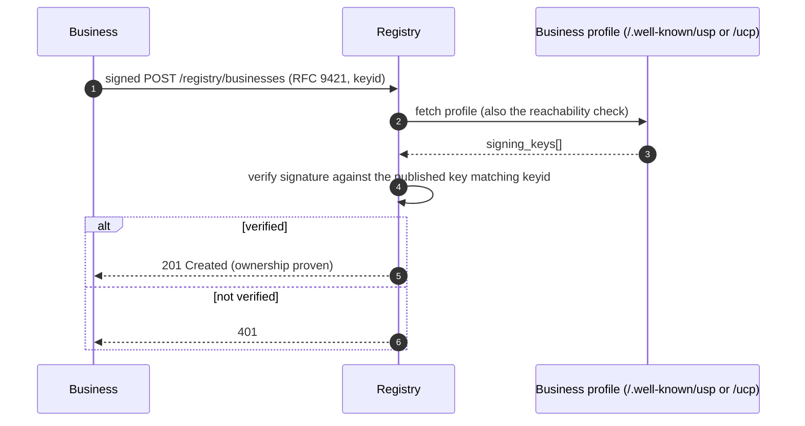
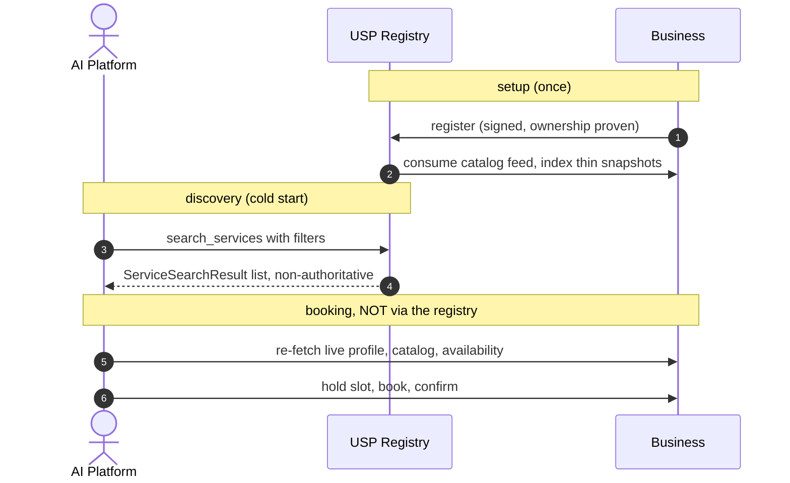
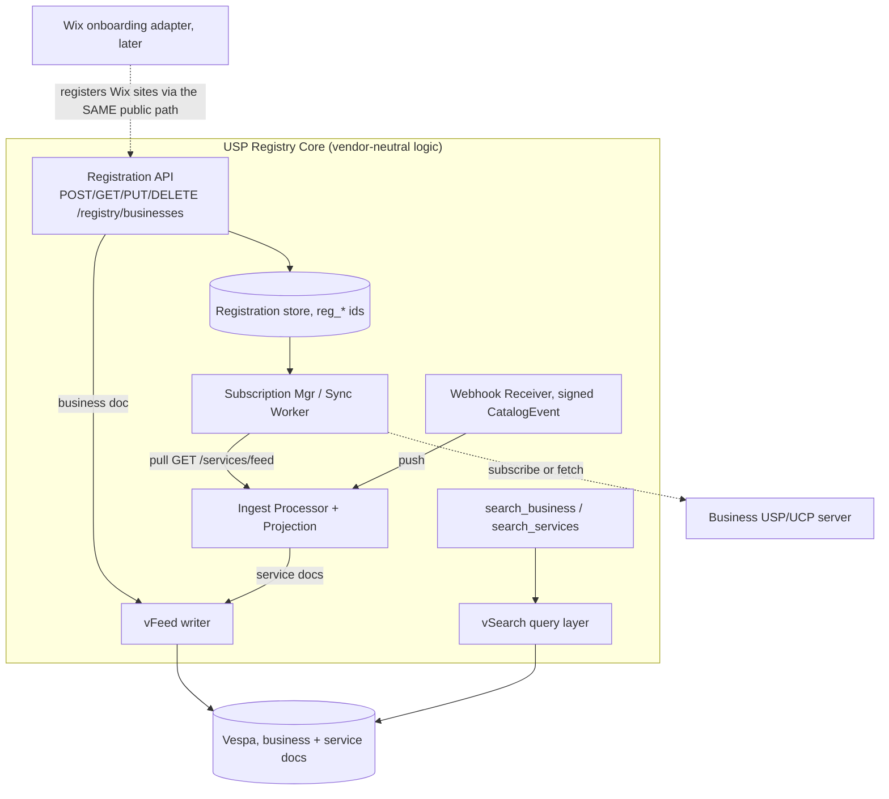
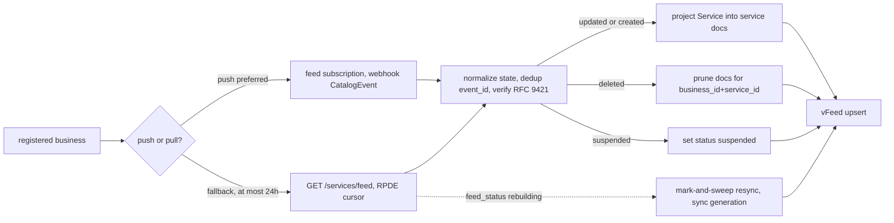
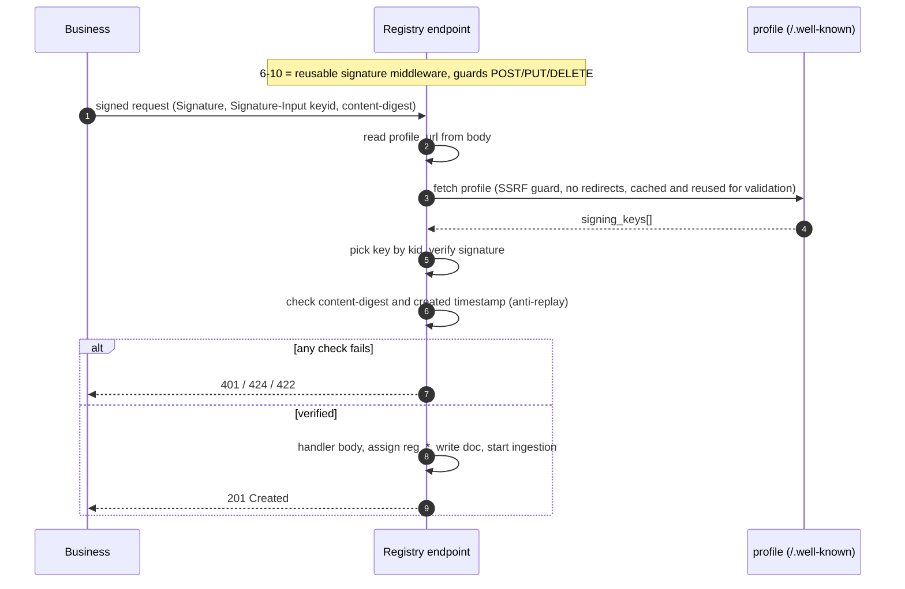
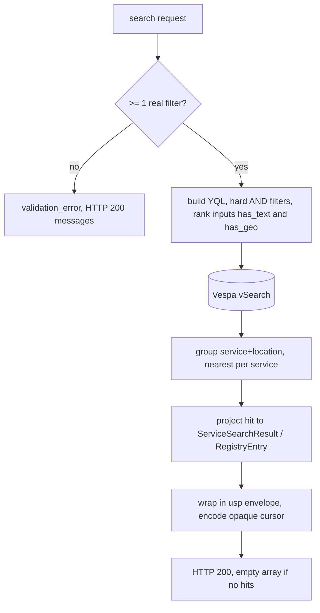

# USP Discovery Registry — Design Plan

> **Status:** design (pre-implementation).
>
> This document has three parts:
> - **Part 1 — Protocol-level design.** What *any* conformant USP registry must do. Vendor-neutral,
>   high-level, interoperability-focused. This is the part that informs the **specification** itself.
> - **Part 2 — Wix implementation design.** How *we* build it: Vespa via vFeed/vSearch, Wix Loom Prime,
>   projection rules, ranking, and internal mechanics. Other registries may do these differently.
> - **Part 3 — Phasing & test strategy.** Build order, starting with the Phase-1 demo.
>
> Spec references are to [`specification.md`](../specification.md) in this repo (§6 = Discovery Registry).
> Reference POC: `wix-vmr-repo/services-semantic-search`. The implementation will live in `wix-vmr-repo`.
>
> **The dividing line** (used throughout): a rule belongs in **Part 1 / the spec** if a *business* or a
> *client* must rely on it when talking to **any** registry. If it only affects how our registry is built
> internally, it's **Part 2**.

---

# Part 1 — Protocol-level design (vendor-neutral)

What it takes to be a conformant USP discovery registry, independent of any technology stack.

## 1.1 What a USP registry is

The optional **discovery registry** capability (`dev.usp.discovery.registry`, §6). It solves the
**business cold-start problem**: how an AI platform/agent discovers a USP business it has never heard of,
by location / vertical / category / keyword — and optionally searches across businesses' services directly.

Two invariants every registry must honor:

- **It is an index, not a source of truth.** Results are explicitly *non-authoritative snapshots* (§6.3).
  Platforms **MUST** re-fetch the business's live profile + catalog + availability before booking. The
  registry therefore may be eventually-consistent and cache aggressively.
- **It is independent and federated** (§6.7). Multiple registries may coexist; a business may register with
  several. No registry is privileged. (How clients *find* registries is an open spec gap — see §1.10 / #55.)

## 1.2 Relationship to UCP

UCP has **no** central registry — reverse-domain capability naming "eliminates the need for a central
registry"; discovery is per-merchant `/.well-known/ucp` only, and UCP leaves cold-start out of scope. USP's
registry is a deliberate net-new layer filling that gap. Consequence: there is no UCP precedent for a central
service index — holding service snapshots is USP going *further* than UCP.

## 1.3 Operations — the protocol contract

Seven operations (§6), each with a REST path and an MCP method. These shapes are fixed by the spec; every
registry exposes the same surface.

| Op | REST | MCP |
|----|------|-----|
| Register | `POST /registry/businesses` | `usp_registry_register` |
| Search businesses | `POST /registry/search_business` | `usp_registry_search_business` |
| Search services | `POST /registry/search_services` | `usp_registry_search_services` |
| Get | `GET /registry/businesses/{id}` | `usp_registry_get` |
| Update | `PUT /registry/businesses/{id}` | `usp_registry_update` |
| Delete | `DELETE /registry/businesses/{id}` | `usp_registry_delete` |

Cross-cutting (fixed by spec): the `usp` response envelope advertising `dev.usp.discovery.registry`;
business-outcome errors in `messages[]` at HTTP 200 vs protocol errors as RFC 9457 Problem Details (§9.4);
opaque cursor pagination (§9.1.2); `Idempotency-Key` on writes.

## 1.4 Wire data model

Fixed by `schemas/registry.json`. A registry stores at least enough to serve these shapes:

- **`RegistryEntry`** (business): `id` (`reg_*`), `profile_url`, `deployment_mode` {standalone|ucp_native},
  `name`, `description?`, `verticals[]`, `categories[]`, `location?` {address, coordinates}, `timezone`,
  `status` {active|inactive}, `created_at`. Source = the **registration body** (`RegistrationRequest`).
- **`ServiceSearchResult`** (service): `service_id`, `service_name`, `business{id,profile_url,deployment_mode,name}`,
  `category`, `duration_minutes?`, `pricing` (full catalog `Pricing`, by `$ref`), `location?`, `timezone`,
  `last_indexed_at?`. Source = the business's **catalog feed**, reduced to this thin shape.

The service shape is a deliberate **thin snapshot** — name/category/price/duration/location, enough to *match*
and *rank*. Everything needed to *transact* (policies, capacity, resources, live availability, current price)
stays at the business and is fetched live. That reduction is "projection" (Part 2, §2.4).

## 1.5 Registration & ownership proof (the handshake)

Registration must prove the registrant **controls** the `profile_url` it registers — otherwise anyone can
register anyone's public profile. **This is a protocol concern**: a business registers with many registries,
so the proof must be uniform across them. (Today §6.1 only mandates *reachability*, not ownership — a real
spec gap, raised as **#58**.)

Recommended mechanism — **permissionless, reusing the profile's published `signing_keys`** (the same JWK
array exists in both USP and UCP profiles), identical to how UCP does merchant identity:

The signature is **both authentication and ownership proof** — no pre-issued credential. Standalone verifies
against the USP profile's `signing_keys`; `ucp_native` against the UCP profile's. When no key is published
anywhere, fall back to a **domain-challenge** (one-time token served on the business's domain). `PUT`/`DELETE`
re-verify identically; a registrant may mutate only its own `reg_*`. Whether a key is *required* to register
is open (**#56**).

## 1.6 Read access posture

Search/Get are **public discovery of public metadata** — a registry may serve them anonymously. A registry
*may* additionally require auth (e.g. for higher rate limits); if it does, it should signal that with a
standard `401`/`WWW-Authenticate` so clients interoperate across public and gated registries (sub-point of #58).

## 1.7 Ingestion contract (what the registry consumes)

A registry keeps its service snapshots fresh by consuming each registered business's **catalog feed** — and
this side is **already standardized**, which is exactly why ingestion is interoperable across registries:

- **Pull:** `GET /services/feed` (§3.1) — RPDE incremental sync, `state` ∈ {updated, deleted}, `modified_at`
  cursor, `feed_meta.feed_status` ∈ {healthy, degraded, rebuilding}.
- **Push:** feed subscriptions (§3.12.2) — the registry registers a `callback_url`; the business POSTs signed
  `CatalogEvent`s (service.created/updated/deleted/suspended) to it. The callback_url **is** the registry's
  exposed ingest API; the subscription is the handshake. Do **not** invert this into a registry-specific
  "push to my proprietary endpoint" — that re-introduces N×N and privileges one registry.
- **Freshness:** §6.3 — prefer subscriptions; otherwise re-index ≤24h. Stamp `last_indexed_at`.
- **Outbound auth:** when the registry calls the business (fetch feed / create subscription) it authenticates
  **as a platform-client** — OAuth 2.0 Bearer (§10.2.3) and signs its own requests (RFC 9421).

*How* a given registry consumes this (push-vs-pull preference, resync strategy, dedup) is implementation —
Part 2, §2.5.

## 1.8 Search & filter semantics

Filters are **hard constraints** (a yes/no contract clients reason about); `query` drives relevance ranking
(a registry's own choice). For cross-registry consistency the *match semantics* should be defined by the spec
(today they aren't — raised as **#59**). The semantics this design assumes:

- `location.radius_km` — kilometers; businesses with no coordinates (virtual/phone) are **excluded** from any
  location filter, returned only when no geo filter is set.
- `price_range` — **within-currency only, no FX**; `context.currency` is display-only.
- `duration_range` — interval **overlap** (a range service matches if its offered interval overlaps the filter);
  duration-less services are excluded from duration filters but shown when none is set.
- `verticals[]` / `categories[]` — OR within a field (match any).
- A request **MUST** carry ≥1 real filter, else `validation_error`; zero matches → **HTTP 200 + empty array**
  (never an error).

## 1.9 End-to-end discovery flow

## 1.10 Spec items this design surfaced

Dogfooding output — building the registry against the spec revealed these protocol-level questions/gaps:

- **#54** — multi-taxonomy `categories[]` on catalog `Service`: needed, or is one flat category enough?
- **#55** — registry **discovery / federation** is undefined: how do clients find registries; one canonical vs many?
- **#56** — should registration **require** a published `signing_key`?
- **#58** — registration is **not authenticated**: §6.1 mandates reachability but not ownership proof.
- **#59** — registry search **filter-matching semantics** are unspecified (range/currency/geo/free).

---

# Part 2 — Wix implementation design (Vespa / vFeed / vSearch)

How we build the Part-1 contract. These choices are ours; other registries may differ without breaking interop.

## 2.1 Architecture

## 2.2 Tech & POC reuse

Wix Loom Prime (Java/Ninja, Bazel); Vespa via **vFeed** (write/index) + **vSearch** (query).
Reuse from the `services-semantic-search` POC: Greyhound domain-events consumer, `ProcessingCache`
(content-hash + cooldown), server-signed metasite identity, the already-USP-shaped result proto.
Replace: the POC's RetrievalService embedding-KB engine → Vespa structured search.

## 2.3 Two Vespa doc types

- **`business` doc** (← `RegistryEntry`): `id`, `profile_url`, `deployment_mode`, `name` (BM25),
  `description` (BM25), `verticals[]` (array attr), `categories[]` (array attr), `location_geo` (position;
  unset for virtual-only), `address`, `timezone`, `status`, `created_at`.
- **`service` doc** (← `ServiceSearchResult`): identity = composite `(business_id, service_id)`; one doc per
  (service, location). Output: `service_id`, `service_name`, `business{…}`, `category`, `duration_minutes`,
  `pricing_json`, `location`, `timezone`, `last_indexed_at`. Indexed-not-returned: `description` (BM25),
  `vertical` (attr), `status`. Filter attrs: `duration_min_minutes`/`duration_max_minutes`, `currency`,
  `price_min_amount`/`price_max_amount` (minor units, long), `location_geo` (position), `channel`.
  Reserved: `content_embedding` (tensor, empty in phase 1).

## 2.4 Projection rules (catalog Service → service.sd)

- **Duration**: parse ISO-8601 → minutes excluding buffers. `fixed`→min=max; `range`→[min,max], display=min;
  `undetermined`→unset. Index min/max for overlap filtering.
- **Category**: single flat string. Representative pick: merchant-taxonomy value → categories[0].value →
  category.name → type. Normalize. (Multi-taxonomy is ingestion-only; see #54.)
- **Vertical**: service `type` → single string attr.
- **Pricing**: OUTPUT = full `Pricing` pass-through. FILTER = extract `currency` + `price_min/max_amount`.
  `fixed`→min=max=amount; `variable`→price_range; `hourly`/`per_person`→price_range if present else amount;
  `free`→0. Within-currency only.
- **Multi-location**: one doc per (service, location); virtual/phone ⇒ no `location_geo`.

## 2.5 Ingestion implementation

Per-business lifecycle: register → write business doc → set up ingestion (prefer push subscription, else
≤24h pull) → **initial backfill pull** (always; subscriptions only deliver future events) → steady state →
periodic reconcile (compare `feed_meta.total_services` to indexed count) → deregister (cancel sub, purge docs).
Ordering: pull is `modified_at` asc, monotonic cursor per business; push may be out-of-order/duplicated →
dedup on `event_id`, last-writer-wins on timestamp. `rebuilding` → mark-and-sweep (never blind-delete).

## 2.6 Auth implementation

The Part-1 handshake (§1.5), implemented:

- **6-10 are reusable middleware** (guards POST/PUT/DELETE); only the final write is endpoint-specific.
- **SSRF guard** on the profile fetch: https-only, no redirects, block private/loopback/link-local/metadata
  IPs, bounded timeout + size. Reuse the fetched profile for the reachability validation (don't fetch twice).
- **Profile validation errors** (§9.4): `invalid_profile_url` 400 / `profile_unreachable` 424 /
  `profile_malformed` 422 / `validation_error`. Re-validate on `profile_url`/`deployment_mode` change.
- **Outbound (③):** the ingestion client authenticates to businesses as a platform — OAuth Bearer + signs.

## 2.7 Search implementation

- **YQL mapping:** geo→`geoLocation(location_geo,lat,lng,"Nkm")`; verticals/categories→`contains` (OR);
  price→within-currency range; duration→interval overlap; mode→equals; business always `status==active`.
- **Ranking (D19):** one `discovery` rank profile blending BM25 (when `query` present; service_name×2,
  description, category×0.5) + geo `closeness` (when location present) + small freshness/active boosts, gated
  by 0/1 `has_text`/`has_geo` inputs. No-query fallback sort: geo distance else a stable key (pagination
  stability).
- **Pagination:** opaque cursor wrapping `{offset,limit,filter_hash,issued_at}`; honor ≥60s; sort-key
  continuation fallback for deep paging.

## 2.8 Wix onboarding side-car (DEFERRED)

Later. Must integrate via the **same public USP protocol path** as any third party (dogfood). Resolves the
POC's 3 TODO gaps (business.name, timezone, usp_profile_url) from Bookings ServicesService + Site Properties.
`availability-feeds` carries no full `Service`, so this adapter sources catalog data separately, then funnels
into the same Ingest Processor → Projection → vFeed.

---

# Part 3 — Phasing & test strategy

Each phase independently shippable; TDD throughout (mirror the POC red-green-refactor + `...Test.java`).
Conformance = validate against spec §6 worked examples + `schemas/registry.json`.

## Phase 1 — Demo (no auth)

The minimum that demonstrates the end-to-end registry value. Deliberately cuts auth and the pull/feed flow.

- **No auth on any endpoint** (no RFC 9421, no profile validation, no API keys).
- **Registration flow** — `POST /registry/businesses` (+ `GET`) writing the Vespa `business` doc.
- **Push-only service ingestion** — an endpoint others call to **push their services** to the registry
  (service upserts → projection → `service` doc). **No pull / feed-polling / subscription handshake yet.**
- **Search** — `POST /registry/search_services` and `POST /registry/search_business` over Vespa (geo /
  vertical / category / price / duration / text filters + pagination).
- REST binding; Vespa `business` + `service` docs; both searches return the spec wire shapes in the `usp`
  envelope.
- *Exit:* a business can be registered and push services; an agent can search businesses and services and get
  conformant results — all without auth.

## Phase 2 — Authentication & ownership (harden the demo)

Add the §1.5 handshake: RFC 9421 signature verification against the profile's `signing_keys` (+ challenge
fallback), profile-reachability validation with the §9.4 error codes, SSRF guard, owner-scoped PUT/DELETE,
and the read-side optional API key. *Exit:* registration is authenticated and ownership-proven; only owners
mutate their `reg_*`.

## Phase 3 — Conformant ingestion (pull + subscriptions)

Add the standardized ingestion contract (§1.7): `GET /services/feed` RPDE pull with `feed_status` handling +
mark-and-sweep resync, feed-subscription handshake (registry registers its callback_url), initial backfill,
deleted/suspended propagation, periodic reconcile, and outbound platform-client auth (③). *Exit:* a registered
business's catalog stays fresh via push **or** pull without manual pushes.

## Phase 4 — MCP binding

Expose the 7 ops as `usp_registry_*` with JSON-RPC result/error mapping. *Exit:* an MCP agent runs the full
discover flow.

## Phase 5 — Wix onboarding side-car

The bridge (§2.8), via the public protocol path. *Exit:* Wix Bookings sites appear as ordinary registrants.

## Phase 6 — Hybrid (vector) ranking

Only if Phase 1–4 recall measurement on real agent queries shows BM25 misses intent. Populate the reserved
embedding field + a hybrid rank profile. *Exit:* measured recall lift over BM25.

## Test strategy

Unit (projection — pure, ideal TDD like POC `SlotSummarizer`; signature verify; cursor codec) → adapter
(vFeed/vSearch, feed client, profile fetcher incl. SSRF cases) → conformance (replay §6 example requests,
assert responses validate vs `registry.json`; empty-result=200; ≥1-filter guard; §9.4 error-code mapping) →
integration (end-to-end register → ingest → search).

---

# Appendix — Decision log

`D#` = resolved (with rationale). **Scope** = Protocol (interop; informs the spec) or Impl (ours; may differ
per registry). "Where" points to the section.

| ID | Decision | Scope | Choice + rationale | Where |
|----|----------|-------|--------------------|-------|
| D1 | Registry posture | Impl | Generic/protocol-first core; Wix is a later side-car | 2.1, 2.8 |
| D2 | Index layout | Impl | Two Vespa doc types (`business`, `service`) | 2.3 |
| D3 | Ranking (phase 1) | Impl | BM25 + hard filters; reserve embedding field for later hybrid | 2.7 |
| D4 | Availability never indexed | Protocol | Non-authoritative; availability is always live (§6.3) | 1.1 |
| D5 | Duration range → display | Impl | Output the min; index min/max for overlap | 2.4 |
| D6 | `undetermined` duration | Protocol | Unmatched by duration filters; shown when none set | 1.8, 2.4 |
| D7 | Free pricing | Protocol | price 0 ⇒ excluded from min>0 ranges, included at [0,X]/none | 1.8, 2.4 |
| D8 | Cross-currency price | Protocol | Within-currency only, no FX; `context.currency` display-only | 1.8 |
| D9 | Category model | Impl/Protocol | Single flat string on service (arrays on business); match semantics in 1.8; taxonomy ingestion-only (#54) | 1.8, 2.4 |
| D10 | Multi-location | Impl | One doc per (service, location) + Vespa grouping; virtual/phone ⇒ no geo | 2.4 |
| D11 | Push model | Protocol | Consumer-subscribes (callback_url = our API); never invert to a proprietary ingest endpoint | 1.7 |
| D12 | Push vs pull preference | Impl | Prefer subscriptions; ≤24h poll fallback | 2.5 |
| D13 | Rebuild handling | Impl | Mark-and-sweep with sync generation; never blind-delete | 2.5 |
| D14 | Pagination | Protocol/Impl | Opaque cursor (§9.1.2, ≥60s) is protocol; the `{offset,limit,filter_hash}` encoding is ours | 2.7 |
| D15 | Wix onboarding | Impl | Via the SAME public protocol path (dogfood) | 2.8 |
| D16 | SSRF guard | Impl | https-only, no redirects, block private/metadata IPs, bounded | 2.6 |
| D17 | Read auth | Protocol/Impl | Public read is the posture; a registry MAY require auth but must signal it (#58) | 1.6 |
| D18 | Write ownership proof | Protocol | Permissionless RFC 9421 vs profile `signing_keys` (+ challenge fallback). Must be uniform across registries → spec (#58); USP/UCP-consistent | 1.5 |
| D19 | Read path ranking + assembly | Impl | `discovery` rank profile (BM25 + geo + freshness, gated); group → nearest per service; envelope + cursor; empty=200 | 2.7 |

### Open (need a call later)

| ID | Decision | Scope | Leaning | Where |
|----|----------|-------|---------|-------|
| O2 | Keep `service_raw` blob? | Impl | lean v1; add later if rich result cards need it | 2.4 |
| O3 | hourly/per_person price filter | Protocol | price_range if present else amount as point; accept imprecision | 1.8, 2.4 |
| O4 | Trust signed webhook payload vs re-fetch | Impl | trust-if-signed + periodic reconcile | 2.5 |
| O5 | Suspended service: mark vs prune | Impl | mark (cheap resume) | 2.5 |
| O6 | Reconciliation cadence | Impl | daily full-cursor pass | 2.5 |
| O7 | Category representative pick | Impl | merchant → categories[0] → category.name → type | 2.4, #54 |
| O8 | UCP profile validation strictness | Impl | structural minimum v1 | 2.6 |
| O9 | Registration↔profile cross-check | Impl | warn, don't reject | 2.6 |
| O10 | No-catalog-capability routing | Impl | index business-only, not an error | 2.6 |
| O11 | Governance status-flip policy | Impl | TBD thresholds; auto-reactivate on recovery | 2.6 |
| O14 | Scale/NFR targets | Impl | TBD (needs # businesses, # services, QPS, latency SLO, vFeed/vSearch sizing) | Part 3 |
| O15 | `signing_keys` mandatory for registration? | Protocol | option (b): require on registration; not global-mandatory. Tracked as #56 | 1.5, #56 |

### Resolved during design (originally open)
- **O1** Auth model → split into **D17** (read) + **D18** (write) + ③ outbound.
- **O12** `context` locale/currency → **D8/D19**: display only, no FX, never a filter.
- **O13** Transport build order → REST → MCP; A2A out of scope; ESP N/A.
