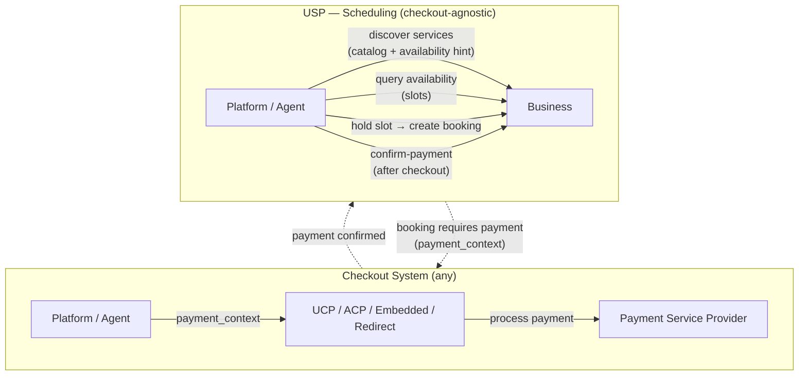
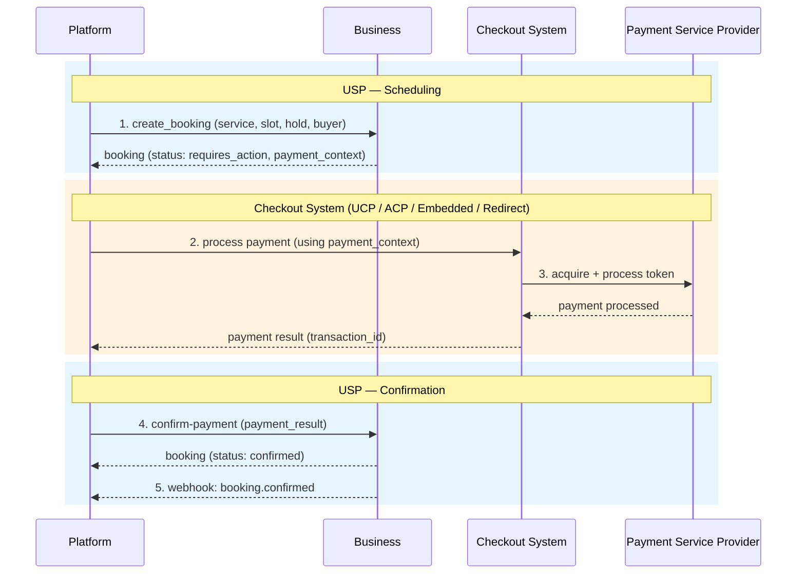
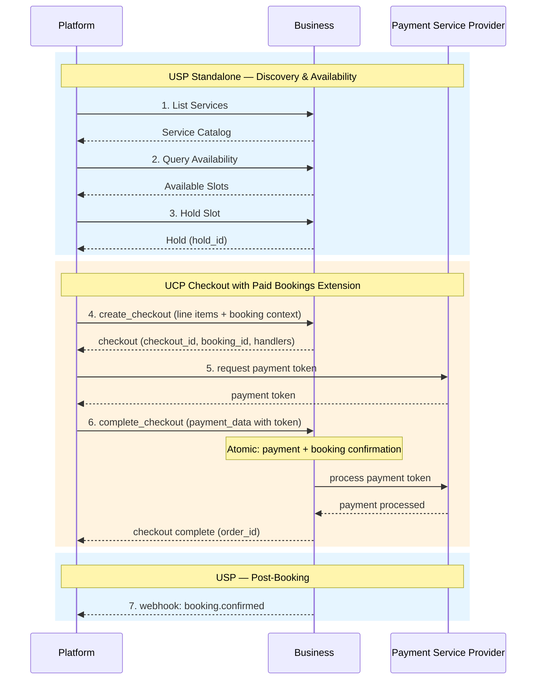
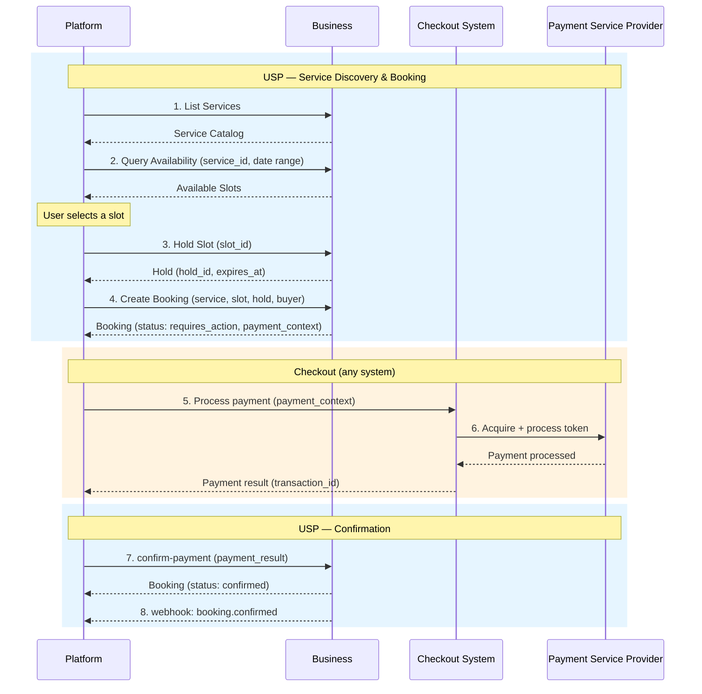
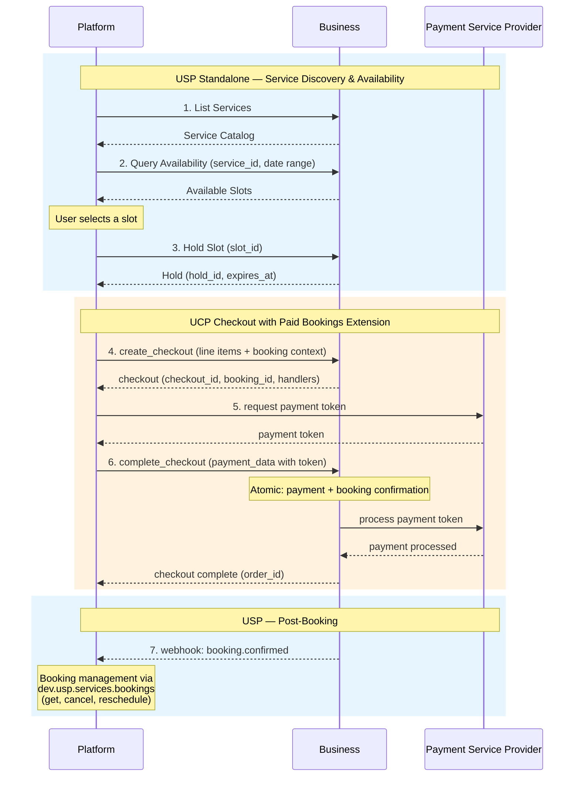
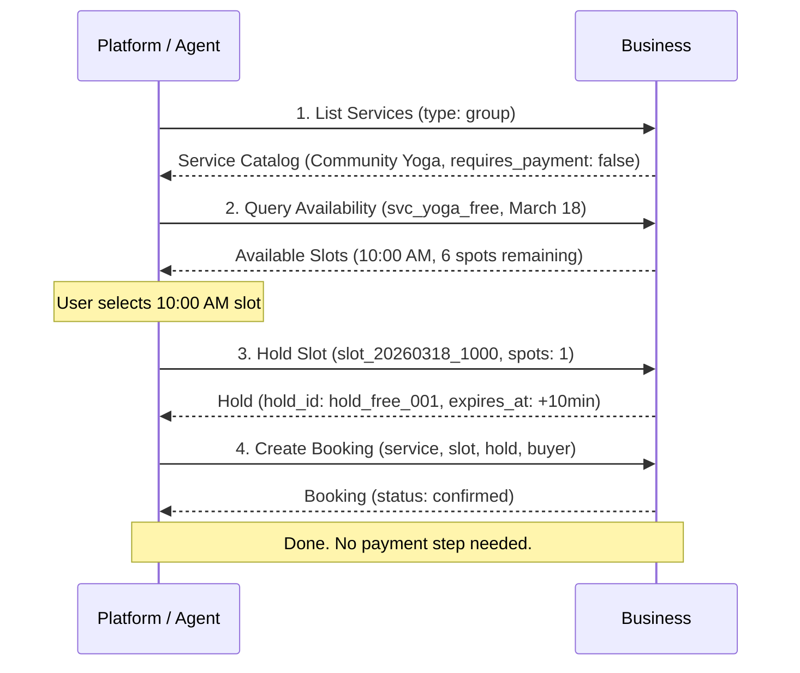

# Universal Scheduling Protocol (USP)

**Version:** `2026-02-09`

**Status:** Draft

---

## Abstract

The Universal Scheduling Protocol (USP) is an open standard that enables consumer platforms and AI agents to discover, check availability of, and book time-based services from businesses. USP is a **checkout-agnostic** scheduling protocol: it defines the complete scheduling domain -- service catalog, availability, holds, and bookings -- independently of any specific checkout or payment system.

USP defines three core capabilities -- service catalog, availability, and booking -- along with optional extensions for waitlist management. It supports REST, MCP, and A2A transport bindings and references IETF standards directly for cross-cutting concerns (security, authorization, error format, idempotency, webhook verification).

When payment is required, USP provides a **universal payment handoff**: the booking response includes a `payment_context` object that any checkout system can consume, and a `confirm-payment` callback that any checkout system can invoke upon completion. Specific checkout integrations -- UCP, ACP, embedded checkout, payment URL redirect -- are handled by the platform using whichever commerce system the business supports.

For businesses using the [Universal Commerce Protocol (UCP)][UCP], an optional `dev.usp.services.paid_bookings` extension provides a **streamlined path**: `create_checkout` carries the booking context as a first-class extension field, and `complete_checkout` atomically finalizes both payment and booking. This extension is recommended but not required.

## Status of This Memo

This document specifies a Draft protocol for the Internet community and requests discussion and suggestions for improvements. Distribution of this memo is unlimited.

This is a draft specification. It is published for examination, experimental implementation, and evaluation. It is not yet an Internet Standard.

## Copyright Notice

Copyright (c) 2026 USP Authors. This specification is released under the [Apache License, Version 2.0](https://www.apache.org/licenses/LICENSE-2.0).

---

## Table of Contents

- [1. Introduction](#1-introduction)
  - [1.1 Conventions](#11-conventions)
  - [1.2 Terminology](#12-terminology)
  - [1.3 Service Verticals](#13-service-verticals)
  - [1.4 Relationship to Other Standards](#14-relationship-to-other-standards)
- [2. Core Concepts](#2-core-concepts)
  - [2.1 Roles and Participants](#21-roles-and-participants)
  - [2.2 Commerce and Non-Commerce Services](#22-commerce-and-non-commerce-services)
  - [2.3 High-Level Architecture](#23-high-level-architecture)
  - [2.4 Core Constructs](#24-core-constructs)
  - [2.5 Key Goals](#25-key-goals)
- [3. Discovery and Negotiation](#3-discovery-and-negotiation)
  - [3.1 Business Profile](#31-business-profile)
  - [3.2 Namespace Governance](#32-namespace-governance)
  - [3.3 Capability Negotiation](#33-capability-negotiation)
  - [3.4 Versioning](#34-versioning)
- [4. Service Catalog](#4-service-catalog)
  - [4.1 Service Catalog Feed](#41-service-catalog-feed)
  - [4.2 Catalog Caching and Indexing](#42-catalog-caching-and-indexing)
  - [4.3 Service Schema](#43-service-schema)
  - [4.4 Availability Hint](#44-availability-hint)
  - [4.5 Duration](#45-duration)
  - [4.6 Pricing](#46-pricing)
  - [4.7 Service Policies](#47-service-policies)
  - [4.8 Resource Requirement](#48-resource-requirement)
  - [4.9 Validation Rules](#49-validation-rules)
  - [4.10 Operations](#410-operations)
- [5. Availability](#5-availability)
  - [5.1 Time Slot](#51-time-slot)
  - [5.2 Hold](#52-hold)
  - [5.3 Operations](#53-operations)
  - [5.4 Caching Strategy](#54-caching-strategy)
- [6. Bookings](#6-bookings)
  - [6.1 Booking Status Lifecycle](#61-booking-status-lifecycle)
  - [6.2 Booking Schema](#62-booking-schema)
  - [6.3 Operations](#63-operations)
  - [6.4 Webhooks](#64-webhooks)
  - [6.5 Post-Booking Lifecycle](#65-post-booking-lifecycle)
- [7. Payment Integration](#7-payment-integration)
  - [7.1 Booking Payment](#71-booking-payment)
  - [7.2 Payment Context](#72-payment-context)
  - [7.3 Confirm Payment](#73-confirm-payment)
  - [7.4 How Payment Works](#74-how-payment-works)
  - [7.5 Deposit and Refund Rules](#75-deposit-and-refund-rules)
  - [7.6 Checkout System Detection](#76-checkout-system-detection)
- [8. End-to-End Flows](#8-end-to-end-flows)
  - [8.1 Full Flow — Generic Path (Paid Service)](#81-full-flow--generic-path-paid-service)
  - [8.2 Full Flow — UCP Extension Path (Paid Service)](#82-full-flow--ucp-extension-path-paid-service)
  - [8.3 Non-Commerce Flow (Free Service)](#83-non-commerce-flow-free-service)
  - [8.4 Example: Booking a Massage with Deposit](#84-example-booking-a-massage-with-deposit)
- [9. Waitlist Extension](#9-waitlist-extension)
  - [9.1 WaitlistEntry Schema](#91-waitlistentry-schema)
  - [9.2 Waitlist Lifecycle](#92-waitlist-lifecycle)
  - [9.3 Operations](#93-operations)
  - [9.4 Cancellation Fee Waiver](#94-cancellation-fee-waiver)
  - [9.5 Webhooks](#95-webhooks)
- [10. Transport Bindings](#10-transport-bindings)
  - [10.1 REST Binding](#101-rest-binding)
  - [10.2 MCP Binding](#102-mcp-binding)
  - [10.3 A2A Binding](#103-a2a-binding)
  - [10.4 Error Code Mapping](#104-error-code-mapping)
  - [10.5 Embedded Scheduling Protocol (ESP)](#105-embedded-scheduling-protocol-esp)
- [11. Security](#11-security)
  - [11.1 Transport Security](#111-transport-security)
  - [11.2 Rate Limiting](#112-rate-limiting)
  - [11.3 Webhook Security](#113-webhook-security)
  - [11.4 Hold Abuse Prevention](#114-hold-abuse-prevention)
  - [11.5 Data Privacy](#115-data-privacy)
  - [11.6 Authentication and Authorization](#116-authentication-and-authorization)
  - [11.7 Identity Linking](#117-identity-linking)
  - [11.8 Buyer Consent](#118-buyer-consent)
- [12. Operation Reference](#12-operation-reference)
- [13. IANA Considerations](#13-iana-considerations)
- [14. References](#14-references)
  - [14.1 Normative References](#141-normative-references)
  - [14.2 Informative References](#142-informative-references)
- [Appendix A. UCP Binding Extension](#appendix-a-ucp-binding-extension)
  - [A.1 Extension Declaration](#a1-extension-declaration)
  - [A.2 Booking Object in Checkout](#a2-booking-object-in-checkout)
  - [A.3 Streamlined Checkout Flow](#a3-streamlined-checkout-flow)
  - [A.4 Atomicity Guarantee](#a4-atomicity-guarantee)
- [Authors' Addresses](#authors-addresses)

---

## 1. Introduction

The Universal Scheduling Protocol (USP) is an open standard that enables consumer platforms and AI agents to **discover**, **check availability of**, and **book** time-based services from businesses.

USP is **checkout-agnostic**. Unlike approaches that couple scheduling to a specific commerce protocol, USP defines the scheduling domain independently and provides a universal payment handoff mechanism that works with any checkout system -- [UCP][UCP], [ACP](https://agenticcommerce.dev/), embedded checkout, or simple payment URL redirect. Cross-cutting concerns (security, authorization, error format, idempotency, webhook verification) reference IETF standards directly rather than inheriting from a specific commerce protocol.

For businesses using UCP, an optional extension (`dev.usp.services.paid_bookings`) provides a streamlined path with atomic payment-plus-booking confirmation and fewer API round-trips. This extension is a **fast lane**, not a requirement.

The key words **MUST**, **MUST NOT**, **REQUIRED**, **SHALL**, **SHALL NOT**, **SHOULD**, **SHOULD NOT**, **RECOMMENDED**, **MAY**, and **OPTIONAL** in this document are to be interpreted as described in [RFC 2119] and [RFC 8174]. These keywords **MUST** only carry their special meaning when they appear in all capitals, as shown here.

### 1.1 Conventions

- Dates: [RFC 3339] (e.g., `2026-03-15T09:00:00-04:00`)
- Durations: [ISO 8601] (e.g., `PT60M`, `PT24H`, `P90D`)
- Currency amounts: Minor units / cents (e.g., `7500` = $75.00)
- Timezones: [IANA Time Zone Database](https://www.iana.org/time-zones) identifiers (e.g., `America/New_York`)

### 1.2 Terminology

The following terms are used throughout this document:

| Term | Definition |
|------|------------|
| **Booking** | A confirmed or pending reservation of a specific service at a specific time for a specific buyer. A booking has a lifecycle (create, confirm, reschedule, cancel, complete). |
| **Business** | The entity offering time-based services. The business owns the schedule, resources, and booking policies. For payment purposes, the business is the Merchant of Record. |
| **Buyer** | The end user receiving the service. Represented by a `buyer` object containing identity fields (name, email, phone). |
| **Capability** | A standalone feature a business supports, identified by a namespaced string (e.g., `dev.usp.services.catalog`). Each capability has a version, schema, and specification URL. |
| **Checkout System** | Any external commerce protocol or payment mechanism used to process payment for a booking. USP is checkout-agnostic; it does not prescribe which checkout system to use. |
| **Extension** | An optional module that augments a capability via the `extends` field. Extensions add functionality without modifying the base capability. |
| **Hold** | A temporary reservation of a time slot that prevents double-booking during the booking flow. Holds have a short TTL and are automatically released on expiry. |
| **Payment Context** | A universal handoff object returned by USP when a booking requires payment. Contains amount, currency, line items, and expiry -- everything a checkout system needs to process payment. |
| **Platform** | The consumer-facing application or AI agent acting on behalf of the buyer. Platforms orchestrate the scheduling journey from discovery through booking and payment. |
| **Service** | A time-based offering provided by a business (e.g., a haircut, yoga class, restaurant table, car rental). Each service has a type, duration, pricing, and policies. |
| **Slot** | A specific, bookable time window for a service. Slots are computed dynamically from the business's schedule, resources, and existing bookings. Also referred to as "time slot." |
| **Vertical** | A classification of service type that determines the scheduling semantics (e.g., `appointment`, `group`, `reservation`, `rental`). See [Section 1.3](#13-service-verticals). |

### 1.3 Service Verticals

USP defines the following core service verticals. The `type` field on a service **MUST** be set to one of these values, or to a vendor-defined vertical using reverse-domain notation (e.g., `com.wix.services.courses`).

#### 1.3.1 Core Verticals

| Vertical | Description | Examples |
|----------|-------------|----------|
| `appointment` | A 1:1 session between a single client and a provider. The booking reserves one provider for one buyer at a specific time. | Salon, dental, consulting, personal training, therapy |
| `group` | A group session with limited capacity. Multiple buyers book into the same time slot, each occupying one or more spots up to a maximum capacity. | Yoga class, workshop, group fitness, cooking class |
| `reservation` | A hold on a shared resource for a time window. The buyer reserves a specific resource (e.g., a table, a room) for a party of a given size. | Restaurant table, conference room, venue, court booking |
| `rental` | Temporary exclusive use of equipment or space for a duration. The buyer takes possession of the resource for the rental period. | Car rental, studio space, equipment hire, vacation rental |

#### 1.3.2 Extended Verticals

The following verticals address additional scheduling domains. Implementations **MAY** support these as vendor-defined capabilities or as future USP core verticals:

| Vertical | Description | Examples | Key Differences from Core |
|----------|-------------|----------|---------------------------|
| `event` | A ticketed one-time event with complex capacity models (tiers, seating maps, general admission). | Concerts, conferences, theater, sporting events | Ticket tiers, seating maps, general admission vs. reserved seating |
| `course` | A multi-session educational or training program spanning multiple dates with enrollment, progression, and completion. | University courses, certification programs, multi-week workshops | Series management, enrollment caps, session progression |
| `healthcare` | A clinical appointment with domain-specific requirements such as insurance verification, referrals, and intake forms. | Doctor visits, telehealth, lab work, dental procedures | Insurance, referrals, HIPAA compliance, intake workflows |
| `home_service` | An on-location service performed at the buyer's premises. Scheduling must account for travel time and service area. | Plumbing, cleaning, pest control, home repair, moving | Travel time, service area boundaries, on-site assessment |
| `tour` | A time-bound guided experience combining group capacity with location, route, and potentially weather-dependent availability. | City tours, wine tastings, adventure activities, museum tours | Route/location, equipment, weather dependencies |

#### 1.3.3 Custom Verticals

Vendors **MAY** define custom verticals using their reverse-domain namespace:

```
com.{vendor}.services.{vertical_name}
```

Custom verticals **MUST** publish a specification and schema that define the additional fields and semantics beyond the USP base service schema. Platforms encountering an unrecognized vertical **SHOULD** fall back to treating the service as an `appointment` type for basic scheduling operations.

### 1.4 Relationship to Other Standards

USP builds upon and complements several existing standards. This section clarifies how USP relates to each and why a new protocol is necessary.

| Standard | Relationship to USP |
|----------|-------------------|
| **RFC 5545** (iCalendar) [RFC 5545] | iCalendar defines the core data format for calendar events (`VEVENT`), free/busy information (`VFREEBUSY`), and scheduling objects. USP's booking and availability concepts are semantically related to iCalendar components. Businesses **SHOULD** support exporting confirmed bookings as iCalendar `VEVENT` objects for calendar integration. USP does not replace iCalendar but provides a higher-level commerce-aware scheduling protocol on top of similar concepts. |
| **RFC 5546** (iTIP) [RFC 5546] | iTIP defines transport-independent scheduling methods (`REQUEST`, `REPLY`, `CANCEL`, `COUNTER`). USP's booking operations (create, confirm, reschedule, cancel) are semantically equivalent to iTIP methods. USP extends beyond iTIP by adding service discovery, real-time availability queries, slot holds, payment integration, and agentic transport bindings (MCP, A2A) that iTIP does not address. |
| **RFC 6638** (CalDAV Scheduling) [RFC 6638] | CalDAV Scheduling provides server-side implicit scheduling and free/busy queries. USP's availability query serves a similar purpose but is designed for cross-organization, platform-to-business interactions rather than intra-organization calendar sharing. |
| **RFC 7986** (New iCalendar Properties) [RFC 7986] | Adds `IMAGE`, `CONFERENCE` (virtual meeting URIs), and `REFRESH-INTERVAL` to iCalendar. USP's `channel.virtual_provider` and `images` fields overlap with these properties. Implementations **SHOULD** map these fields when exporting to iCalendar. |
| **schema.org/Service** | schema.org defines structured data types for services, offers, and actions (`ReserveAction`, `BookAction`). USP's service catalog complements schema.org: businesses **SHOULD** expose service catalog data as [schema.org/Service](https://schema.org/Service) structured data on their website for search engine discoverability (see [Section 4.2](#42-catalog-caching-and-indexing)), while the USP API provides the programmatic booking flow. |
| **OpenActive Open Booking API 1.0** [OpenActive] | The Open Booking API is a W3C Community Group specification for booking physical activities, using RPDE feeds and schema.org data models. USP differs from OpenActive in three key ways: (1) USP provides a checkout-agnostic payment integration model, (2) USP is designed for agentic commerce with MCP/A2A bindings and availability hints for AI reasoning, and (3) USP covers a broader range of service verticals beyond physical activities. |
| **UCP** (Universal Commerce Protocol) [UCP] | USP is checkout-agnostic but provides an optional UCP binding extension for businesses on UCP. The extension adds a `booking` object to UCP's checkout, enabling atomic payment-plus-booking confirmation. See [Appendix A](#appendix-a-ucp-binding-extension). |
| **ACP** (Agentic Commerce Protocol) | USP's universal payment handoff (`payment_context` + `confirm-payment`) works with ACP-based businesses. See [Section 7.4.2](#742-acp-path). |
| **RFC 9457** (Problem Details) [RFC 9457] | USP uses RFC 9457 Problem Details for HTTP error responses. See [Section 10.1](#101-rest-binding). |
| **RFC 6749** (OAuth 2.0) [RFC 6749] | USP uses OAuth 2.0 for authorization and identity linking. See [Section 11.6](#116-authentication-and-authorization). |
| **RFC 9421** (HTTP Message Signatures) [RFC 9421] | USP uses HTTP Message Signatures for webhook integrity verification. See [Section 11.3](#113-webhook-security). |

---

## 2. Core Concepts

USP enables interoperability between platforms, businesses, and payment providers for service commerce. This section introduces the key roles, architectural principles, and protocol constructs.

### 2.1 Roles and Participants

USP defines interactions between four participants:

#### 2.1.1 Platform (Application / Agent)

The consumer-facing surface acting on behalf of the user. Platforms orchestrate the full journey: discovering services, presenting availability, and facilitating booking and payment.

- **Responsibilities:** Discovering business capabilities via `/.well-known/usp`, querying availability, creating bookings, processing payment through whichever checkout system is available.
- **Examples:** AI scheduling assistants, super apps, search engines, marketplace platforms.

#### 2.1.2 Business

The entity offering time-based services. In USP, the business owns the schedule, resources, and booking policies. For payment, the business remains the **Merchant of Record**.

- **Responsibilities:** Publishing a USP profile, exposing a service catalog, computing real-time availability, managing the booking lifecycle, providing `payment_context` for paid services.
- **Examples:** Salons, clinics, fitness studios, restaurants, rental companies, consultancies.

#### 2.1.3 Credential Provider (CP)

A trusted entity that securely manages user payment instruments and identity. USP does not interact with credential providers directly -- this interaction occurs within the checkout system used for payment.

- **Examples:** Google Wallet, Apple Pay, digital identity providers.

#### 2.1.4 Payment Service Provider (PSP)

The financial infrastructure that processes payments. USP delegates all payment processing to the checkout system, which in turn interacts with the PSP.

- **Examples:** Stripe, Adyen, PayPal, Braintree.

### 2.2 Commerce and Non-Commerce Services

USP supports both **paid services** that require payment integration and **free or pay-later services** that operate standalone without any payment infrastructure. This section defines the two operational modes and their implications.

#### 2.2.1 Operational Modes

| Mode | `requires_payment` | `payment_timing` | Checkout Required? | Booking Confirmation Flow |
|------|-------------------|-------------------|---------------------|---------------------------|
| **Standalone (non-commerce)** | `false` | N/A | No | `pending` → `confirmed` (auto mode) or `pending` → `confirmed` (manual mode, business approves) |
| **Standalone (pay-at-service)** | `true` | `at_service` | No | `pending` → `confirmed`. Payment is collected in person at the time of service; no upfront digital payment is required. |
| **Integrated (commerce)** | `true` | `at_booking` | Yes | `pending` → `requires_action` → (checkout) → `confirmed` |
| **Integrated (deposit)** | `true` | `deposit_required` | Yes | `pending` → `requires_action` → (checkout for deposit) → `confirmed` |

- **Standalone mode:** USP operates independently. No checkout system is needed. The business publishes only `/.well-known/usp`. This mode is appropriate for free community events, public library room reservations, government services, volunteer scheduling, and services where payment is collected in person.
- **Integrated mode:** USP and a checkout system work together. When a booking requires payment, the `create_booking` response includes a `payment_context` object. The platform processes payment through whichever checkout system is available, then calls USP's `confirm-payment` endpoint to finalize the booking. For businesses with the optional UCP extension, the platform can use the streamlined `create_checkout` → `complete_checkout` path instead.

#### 2.2.2 Payment Field Conditionality

The `payment` object on a booking is conditionally present based on the service's payment configuration:

| `requires_payment` | `payment_timing` | `payment` Object on Booking | Notes |
|--------------------|-------------------|----------------------------|-------|
| `false` | N/A | **MUST** be omitted | Free service. No payment fields. |
| `true` | `at_service` | **MAY** be present | If present: `status: not_required`, `amount_due: 0`. The `amount` field reflects the service price for informational purposes. |
| `true` | `at_booking` | **MUST** be present | `status: pending`, `amount_due` = full amount. `payment_context` is included. |
| `true` | `deposit_required` | **MUST** be present | `status: pending`, `amount_due` = deposit amount. `payment_context` is included. |

See [Section 8.3](#83-non-commerce-flow-free-service) for a complete non-commerce end-to-end example.

### 2.3 High-Level Architecture



USP operates **standalone** for the full scheduling lifecycle: service discovery, availability hints, slot queries, holds, and bookings. No checkout system is required for services with `requires_payment: false` or `payment_timing: at_service`.

When payment is required (`at_booking` or `deposit_required`), the booking response includes a `payment_context` object -- a universal handoff containing amount, currency, line items, and expiry. The platform processes payment through whatever checkout system is available and calls `confirm-payment` to finalize the booking. USP does not prescribe which checkout system to use.

For businesses with the optional UCP extension (`dev.usp.services.paid_bookings`), the platform can skip the generic path and use the streamlined `create_checkout` (with booking context) → `complete_checkout` (atomic) path. See [Appendix A](#appendix-a-ucp-binding-extension).

### 2.4 Core Constructs

USP is built on three constructs:

| Construct | Description | Examples |
|-----------|-------------|----------|
| **Capabilities** | Standalone features a business supports, declared using a registry pattern (object keyed by capability name). Each capability has a namespace, schema, and version. | `dev.usp.services.catalog`, `dev.usp.services.availability`, `dev.usp.services.bookings` |
| **Extensions** | Optional modules that augment a capability via the `extends` field. Extensions use JSON Schema composition (`allOf`, `$defs`) to layer additional fields onto base capability schemas. | Waitlist management (extends bookings), UCP paid bookings (extends `dev.ucp.shopping.checkout`), vendor-specific loyalty (extends bookings) |
| **Services** | Transport layers for exchanging data. USP is transport-agnostic with specific bindings. Each service is an array of transport objects with a `transport` discriminator field. | REST (OpenAPI 3.x), MCP (OpenRPC / JSON-RPC), A2A (Agent Card). See [Section 10](#10-transport-bindings). |

### 2.5 Key Goals

- **Checkout-Agnostic:** USP has zero dependencies on any specific checkout or payment protocol. The `payment_context` + `confirm-payment` pattern works with UCP, ACP, embedded checkout, redirect, or any future commerce system.
- **IETF-Native:** Cross-cutting concerns reference IETF RFCs directly (RFC 9457 for errors, RFC 6749 for auth, RFC 9421 for webhook signing, RFC 8615 for discovery). USP does not inherit infrastructure from another protocol.
- **Discovery:** Platforms dynamically discover what services a business offers, what availability exists, and what policies apply -- all machine-readable.
- **Agentic Scheduling:** AI agents can autonomously discover, evaluate, and book services on behalf of users, with `continue_url` handoff when human interaction is required.
- **Interoperability:** A standard language for platforms, businesses, and payment providers to transact time-based services without custom integrations.
- **Real-Time Coordination:** Slot holds prevent double-booking. Availability is computed dynamically from schedules, resources, and existing bookings.
- **Graceful Degradation:** Platforms always have a path to payment -- from the optimized UCP extension down to simple payment URL redirect -- without changing any USP scheduling calls.

---

## 3. Discovery and Negotiation

USP uses [RFC 8615] Well-Known URIs for discovery. Businesses publish a machine-readable profile; platforms discover it and negotiate capabilities.

### 3.1 Business Profile

Businesses publish their USP profile at `/.well-known/usp`:

```json
{
  "usp": {
    "version": "2026-02-09",
    "services": {
      "dev.usp.services": [
        {
          "version": "2026-02-09",
          "spec": "https://usp.dev/specification",
          "transport": "rest",
          "endpoint": "https://business.example.com/usp/v1",
          "schema": "https://usp.dev/services/rest.openapi.json"
        },
        {
          "version": "2026-02-09",
          "spec": "https://usp.dev/specification",
          "transport": "mcp",
          "endpoint": "https://business.example.com/usp/mcp",
          "schema": "https://usp.dev/services/mcp.openrpc.json"
        }
      ]
    },
    "capabilities": {
      "dev.usp.services.catalog": [{"version": "2026-02-09", "spec": "https://usp.dev/specification#4-service-catalog", "schema": "https://usp.dev/schemas/services/catalog.json"}],
      "dev.usp.services.availability": [{"version": "2026-02-09", "spec": "https://usp.dev/specification#5-availability", "schema": "https://usp.dev/schemas/services/availability.json"}],
      "dev.usp.services.bookings": [{"version": "2026-02-09", "spec": "https://usp.dev/specification#6-bookings", "schema": "https://usp.dev/schemas/services/bookings.json"}]
    },
    "checkout_systems": ["ucp", "acp", "redirect"],
    "business": {
      "name": "Sunrise Wellness Studio",
      "timezone": "America/New_York",
      "currency": "USD"
    }
  }
}
```

The `checkout_systems` field is an **OPTIONAL** array that advertises which checkout systems the business supports for paid bookings. Recognized values:

| Value | Description |
|-------|-------------|
| `ucp` | Business supports UCP checkout. Platform **SHOULD** check for `dev.usp.services.paid_bookings` in the business's UCP profile for the streamlined extension path. |
| `acp` | Business supports ACP checkout sessions. |
| `redirect` | Business provides a `payment_url` for buyer-facing payment. |
| `embedded` | Business supports platform-processed payment via `confirm-payment`. |

If `checkout_systems` is omitted, the platform **SHOULD** check for `payment_url` or `continue_url` in the booking response to determine the payment path.

A business offering only free or pay-at-service services **MAY** omit `checkout_systems` entirely.

### 3.2 Namespace Governance

USP uses reverse-domain notation for capability names:

```
{reverse-domain}.{service}.{capability}
```

The `dev.usp.*` namespace is governed by the USP body. Vendors **MUST** use their own domain (e.g., `com.wix.services.courses`).

### 3.3 Capability Negotiation

USP uses a **server-selects** negotiation model:

1. Platform advertises its profile URI via the `USP-Agent` header (REST) or `_meta.usp.profile` (MCP).
2. Business fetches the platform profile, computes the capability intersection, and responds using only shared capabilities. If a capability depends on an extension that the platform does not support, the business **MUST** prune the orphaned extension from the response.
3. Every response **MUST** include a `usp` metadata object declaring the active version and capabilities.
4. If the intersection is empty (no shared capabilities), the business **MUST** return a `version_unsupported` error.

```json
{
  "usp": {
    "version": "2026-02-09",
    "capabilities": {
      "dev.usp.services.catalog": [{"version": "2026-02-09"}],
      "dev.usp.services.availability": [{"version": "2026-02-09"}],
      "dev.usp.services.bookings": [{"version": "2026-02-09"}]
    }
  },
  ...
}
```

### 3.4 Versioning

USP uses date-based versioning.

#### 3.4.1 Version Format

USP protocol versions use the `YYYY-MM-DD` format (e.g., `2026-02-09`). This format applies to:

- The protocol version (`usp.version` in every response)
- Capability versions (the `version` field within each capability entry)
- Service transport binding versions

Protocol versions and capability versions are independent. A new capability version does not require a new protocol version, and vice versa.

#### 3.4.2 Version Negotiation

When a platform sends a request, the business **MUST** compare the platform's advertised version (from the platform profile) with its own supported version:

| Condition | Behavior |
|-----------|----------|
| Platform version ≤ Business version | Business processes the request using the platform's version semantics. |
| Platform version > Business version | Business **MUST** return a `version_unsupported` error with a `messages[]` entry indicating the latest supported version. |

Every USP response **MUST** include the `usp.version` field confirming which version was used to process the request. This allows platforms to detect version mismatches and adapt.

#### 3.4.3 Backwards Compatibility

The following changes are **non-breaking** and **MUST NOT** require a new protocol version:

- Adding new optional fields to request or response schemas
- Adding new capability namespaces
- Adding new values to open enumerations (e.g., new service verticals)
- Adding new error codes to the `messages[]` model
- Adding new webhook event types

The following changes are **breaking** and **MUST** require a new protocol version:

- Removing or renaming existing fields
- Changing the type of an existing field
- Changing the semantics of an existing field
- Removing values from enumerations
- Changing the structure of the `usp` metadata object
- Changing the capability negotiation protocol

#### 3.4.4 Capability Versioning

Capabilities are versioned independently from the protocol. A capability version indicates the schema version for that capability's operations. When a business supports multiple versions of a capability, it declares them in the capabilities registry:

```json
"capabilities": {
  "dev.usp.services.catalog": [
    {"version": "2026-02-09"},
    {"version": "2026-06-15"}
  ]
}
```

The business selects the highest mutually supported version during negotiation.

---

## 4. Service Catalog

**Capability:** `dev.usp.services.catalog`

The catalog enables platforms to **discover what services a business offers** -- types, pricing, policies, resources, and delivery channels.

> **Note:** The service catalog capability is identical across all USP models (standalone, companion, extension, hybrid). Sections 4.1 through 4.10 define the same schemas, operations, and validation rules. The catalog is a pure scheduling domain concern with no checkout system dependencies. For the complete catalog specification, see the [USP Companion Specification, Section 4](../specification.md#4-service-catalog).

### 4.1 Service Catalog Feed

Businesses **SHOULD** publish a service catalog feed for aggregators and indexing platforms. The feed enables incremental synchronization -- aggregators maintain a cursor and fetch only changed records since their last sync, rather than re-fetching the entire catalog.

**Feed Endpoint** -- `GET /services/feed`

The feed returns a paginated, chronologically ordered list of service records, sorted by `modified_at` ascending. This design follows the Realtime Paged Data Exchange (RPDE) pattern used by [OpenActive] and is analogous to product feeds in commerce protocols.

### 4.2 Catalog Caching and Indexing

Platforms **SHOULD** index service catalogs for fast retrieval and AI reasoning. Businesses **SHOULD** expose service catalog data as [schema.org/Service](https://schema.org/Service) structured data on their website for search engine discoverability.

### 4.3 Service Schema

The service object is the central domain entity in USP. It describes a bookable time-based offering with its pricing, policies, resources, and scheduling characteristics. The schema is defined in the [USP Companion Specification, Section 4.3](../specification.md#43-service-schema).

### 4.4 Availability Hint

A lightweight, cached summary of near-term availability included in the service catalog response. Availability hints enable AI agents to reason about scheduling before making full slot queries.

### 4.5 Duration

Services define duration models: `fixed` (single duration), `range` (min/max), or `custom` (buyer-selected within constraints).

### 4.6 Pricing

Services define pricing models: `fixed`, `variable` (varies by resource or time), `starting_at` (minimum price), `free`, or `custom`. Prices are in minor currency units.

### 4.7 Service Policies

Machine-readable policies for cancellation, rescheduling, no-show handling, booking windows, and confirmation mode. These policies govern the booking lifecycle and are used by AI agents for autonomous decision-making.

### 4.8 Resource Requirement

Services **MAY** declare required or optional resources (staff, rooms, equipment). Resources influence availability computation and can be requested by the buyer at booking time.

### 4.9 Validation Rules

Services **MAY** define validation rules for booking requests (e.g., minimum party size for group sessions, maximum advance booking window).

### 4.10 Operations

| Operation | Method | Path | Description |
|-----------|--------|------|-------------|
| List Services | `POST` | `/services/list` | Query the service catalog with optional filters |
| Get Service | `GET` | `/services/{service_id}` | Get a single service by ID |
| Service Feed | `GET` | `/services/feed` | Incremental sync feed for aggregators |

---

## 5. Availability

**Capability:** `dev.usp.services.availability`

The availability capability enables platforms to **query open time slots** and **hold them** to prevent double-booking during the booking flow.

> **Note:** The availability capability is identical across all USP models. Sections 5.1 through 5.4 define the same schemas, operations, and validation rules. Availability is a pure scheduling domain concern with no checkout system dependencies. For the complete availability specification, see the [USP Companion Specification, Section 5](../specification.md#5-availability).

### 5.1 Time Slot

A slot represents a specific, bookable time window for a service. Slots include `id`, `start`, `end`, `duration`, `state`, and optionally `resources` and `location`.

### 5.2 Hold

A hold temporarily reserves a slot to prevent double-booking while the buyer completes the booking flow. Holds have a short TTL (recommended: 5-10 minutes) and are automatically released on expiry.

### 5.3 Operations

| Operation | Method | Path | Description |
|-----------|--------|------|-------------|
| Query Availability | `POST` | `/availability/query` | Query time slots for a service within a date range |
| Hold Slot | `POST` | `/availability/holds` | Hold a slot to prevent double-booking |
| Release Slot | `DELETE` | `/availability/holds/{hold_id}` | Explicitly release a hold |

### 5.4 Caching Strategy

Availability data has an inverse relationship between freshness and usefulness. Platforms **SHOULD** use a tiered caching strategy:

| Tier | Source | Date Range | Recommended TTL | Use Case |
|------|--------|------------|-----------------|----------|
| **Hint** | `availability_hint` | General / near-term | 1-6 hours (cached with catalog) | Agent pre-filtering |
| **Select** | `slot` query | 1-2 specific days | 30-60 seconds | Time picker UI |
| **Commit** | Hold | Single slot | Real-time (no cache) | Slot hold before booking |

---

## 6. Bookings

**Capability:** `dev.usp.services.bookings`

The bookings capability defines the **lifecycle of a service booking** from creation through completion. In the hybrid model, the bookings capability also defines the `payment_context` for paid services and the `confirm-payment` operation for checkout-agnostic payment confirmation.

### 6.1 Booking Status Lifecycle

```
  pending ──────► confirmed ──────► in_progress ──────► completed
    │                │                    │
    │                │                    └──────────► no_show
    │                │
    ▼                ▼
  requires_action   canceled
    │
    ▼ (payment confirmed)
  confirmed
```

| Status | Description |
|--------|-------------|
| `pending` | Booking has been created and is awaiting confirmation. For `auto` confirmation mode, this state is transient -- the booking moves to `confirmed` immediately (or to `requires_action` if payment is needed). For `manual` mode, the booking remains in `pending` until the business explicitly confirms it. |
| `requires_action` | Buyer input is needed before the booking can be confirmed. Inspect the `messages` array for details (e.g., `payment_required`). The booking response includes `payment_context` for checkout-agnostic payment processing, or `continue_url` for browser-based handoff. This status is used when `payment_timing` is `at_booking` or `deposit_required`. |
| `confirmed` | The booking is confirmed and the service will proceed at the scheduled time. This is reached after auto-confirmation, manual business approval, or successful payment completion (via `confirm-payment` or webhook). |
| `in_progress` | The service is currently being delivered. Transitioned by the business when the appointment/session begins. |
| `completed` | The service has been delivered. Terminal state. |
| `no_show` | The client did not attend within the grace period defined in the no-show policy. Terminal state. Business **MAY** charge the no-show fee. |
| `canceled` | The booking has been canceled. Can be reached from `pending`, `requires_action`, or `confirmed`. Terminal state. Cancellation fees may apply per the service's cancellation policy. |

### 6.2 Booking Schema

The booking object represents a scheduled service instance for a specific buyer at a specific time.

| Field | Type | Required | Description |
|-------|------|----------|-------------|
| `id` | string | **Yes** | Unique booking identifier, generated by the business. |
| `service_id` | string | **Yes** | The booked service. |
| `service_name` | string | **Yes** | Service display name, captured at booking time. This is a snapshot -- it does not change if the service name is later updated. |
| `slot` | object | **Yes** | `{id, start, end, duration}` -- the booked time slot. |
| `buyer` | Buyer | **Yes** | `{first_name, last_name, email, phone_number}` -- the person receiving the service. |
| `party_size` | integer | **Yes** | Total number of attendees. For `appointment` types, this is typically `1`. For `group` and `reservation` types, this reflects the number of spots booked. |
| `resources` | Array\[object\] | No | `{id, type, name}` -- the specific resources assigned to this booking (e.g., which stylist, which room). |
| `location` | object | No | `{id, name}` -- the specific location for this booking. |
| `status` | string | **Yes** | Current booking status. See [Section 6.1](#61-booking-status-lifecycle). |
| `confirmation_mode` | string | **Yes** | `auto` or `manual`. Reflects the service's confirmation policy at booking time. |
| `payment` | BookingPayment | Conditional | Payment state. **MUST** be present when the service's `requires_payment` is `true` and `payment_timing` is `at_booking` or `deposit_required`. **MUST** be omitted when `requires_payment` is `false`. **MAY** be present with `status: not_required` when `payment_timing` is `at_service`. See [Section 7.1](#71-booking-payment). |
| `payment_context` | PaymentContext | Conditional | Universal payment handoff object. **MUST** be present when `status` is `requires_action` and `payment.timing` is `at_booking` or `deposit_required`. Contains everything a checkout system needs to process payment. See [Section 7.2](#72-payment-context). |
| `messages` | Array\[Message\] | No | Messages providing context about the booking state. Each message has: `type` (`error`, `warning`, `info`), `code` (machine-readable code), `content` (human-readable text), `severity` (`requires_buyer_input`, `recoverable`, `requires_buyer_review`), `path` (optional JSON Pointer). |
| `continue_url` | string | Conditional | Business UI handoff URL. **MUST** be provided when `status` is `requires_action`. The platform **SHOULD** redirect or present this URL to the buyer to complete the required action. |
| `notes` | string | No | Buyer-provided special requests or notes. |
| `cancellation` | object | No | `{reason, canceled_by, fee, refund_amount, canceled_at}` -- present when the booking has been canceled. |
| `created_at` | string | **Yes** | RFC 3339 timestamp of when the booking was created. |
| `updated_at` | string | **Yes** | RFC 3339 timestamp of the last status change or modification. |
| `expires_at` | string | No | RFC 3339 expiration time. Present for `pending` and `requires_action` bookings. If not resolved by this time, the booking transitions to `canceled`. |

### 6.3 Operations

#### 6.3.1 Create Booking -- `POST /bookings`

Creates a new booking for a service at a specific time slot. The platform **SHOULD** hold the slot before creating the booking to prevent race conditions.

Request:

```json
{
  "service_id": "svc_massage_001",
  "slot_id": "slot_20260316_1400",
  "hold_id": "hold_xyz789",
  "buyer": {
    "first_name": "Alice",
    "last_name": "Williams",
    "email": "alice@example.com",
    "phone_number": "+12125551234"
  },
  "party_size": 1,
  "resource_id": "staff_jane",
  "notes": "First time visit"
}
```

Response (paid service, `payment_timing: at_booking`):

```json
{
  "usp": {
    "version": "2026-02-09",
    "capabilities": {"dev.usp.services.bookings": [{"version": "2026-02-09"}]}
  },
  "booking": {
    "id": "bkg_456def",
    "service_id": "svc_massage_001",
    "service_name": "Deep Tissue Massage",
    "slot": {
      "id": "slot_20260316_1400",
      "start": "2026-03-16T14:00:00-04:00",
      "end": "2026-03-16T15:00:00-04:00",
      "duration": "PT60M"
    },
    "buyer": {
      "first_name": "Alice",
      "last_name": "Williams",
      "email": "alice@example.com",
      "phone_number": "+12125551234"
    },
    "party_size": 1,
    "resources": [{"id": "staff_jane", "type": "staff", "name": "Jane Smith"}],
    "status": "requires_action",
    "confirmation_mode": "auto",
    "payment": {
      "status": "pending",
      "timing": "at_booking",
      "amount": 12000,
      "currency": "USD",
      "amount_due": 12000
    },
    "payment_context": {
      "amount_due": 12000,
      "currency": "USD",
      "description": "Deep Tissue Massage – Mar 16, 2:00 PM",
      "line_items": [
        {
          "label": "Deep Tissue Massage (60 min)",
          "amount": 12000,
          "quantity": 1,
          "item_id": "svc_massage_001"
        }
      ],
      "metadata": {
        "booking_id": "bkg_456def",
        "service_id": "svc_massage_001",
        "service_type": "appointment",
        "slot_start": "2026-03-16T14:00:00-04:00"
      },
      "expires_at": "2026-03-16T13:10:00-04:00"
    },
    "continue_url": "https://business.example.com/pay/bkg_456def",
    "messages": [
      {
        "type": "info",
        "code": "payment_required",
        "content": "Payment of $120.00 is required to confirm this booking.",
        "severity": "requires_buyer_input"
      }
    ],
    "created_at": "2026-03-14T22:05:00Z",
    "updated_at": "2026-03-14T22:05:00Z",
    "expires_at": "2026-03-16T13:10:00-04:00"
  }
}
```

Response (free service, `requires_payment: false`):

```json
{
  "usp": {
    "version": "2026-02-09",
    "capabilities": {"dev.usp.services.bookings": [{"version": "2026-02-09"}]}
  },
  "booking": {
    "id": "bkg_789ghi",
    "service_id": "svc_yoga_free",
    "service_name": "Community Yoga",
    "slot": {"id": "slot_20260318_1000", "start": "2026-03-18T10:00:00-04:00", "end": "2026-03-18T11:00:00-04:00", "duration": "PT60M"},
    "buyer": {"first_name": "Alice", "last_name": "Williams", "email": "alice@example.com"},
    "party_size": 1,
    "status": "confirmed",
    "confirmation_mode": "auto",
    "created_at": "2026-03-14T22:05:00Z",
    "updated_at": "2026-03-14T22:05:00Z"
  }
}
```

#### 6.3.2 Get Booking -- `GET /bookings/{booking_id}`

Returns the current state of a booking. Same structure as the booking object above.

#### 6.3.3 Update Booking -- `PUT /bookings/{booking_id}`

Updates mutable fields on a booking. Only `buyer` and `notes` are mutable after creation.

#### 6.3.4 Confirm Booking -- `POST /bookings/{booking_id}/confirm`

Business-initiated confirmation for bookings with `confirmation_mode: manual`. Transitions the booking from `pending` to `confirmed`.

#### 6.3.5 Cancel Booking -- `POST /bookings/{booking_id}/cancel`

Cancels a booking. Cancellation fees are applied per the service's cancellation policy.

#### 6.3.6 Reschedule Booking -- `POST /bookings/{booking_id}/reschedule`

Moves a booking to a different time slot. The platform **SHOULD** hold the new slot before rescheduling. Rescheduling limits and fees are governed by the service's rescheduling policy.

#### 6.3.7 Confirm Payment -- `POST /bookings/{booking_id}/confirm-payment`

**This operation is unique to the hybrid model.** It is the universal callback that any checkout system calls after payment succeeds. This transitions the booking from `requires_action` to `confirmed`.

Request:

```json
{
  "payment_result": {
    "status": "paid",
    "provider": "stripe",
    "transaction_id": "txn_abc123",
    "amount_paid": 12000,
    "currency": "USD",
    "order_reference": "ord_xyz789"
  }
}
```

Response:

```json
{
  "usp": {
    "version": "2026-02-09",
    "capabilities": {"dev.usp.services.bookings": [{"version": "2026-02-09"}]}
  },
  "booking": {
    "id": "bkg_456def",
    "status": "confirmed",
    "payment": {
      "status": "paid",
      "timing": "at_booking",
      "amount": 12000,
      "currency": "USD",
      "amount_due": 0,
      "transaction_id": "txn_abc123",
      "order_reference": "ord_xyz789"
    },
    "updated_at": "2026-03-14T22:06:00Z"
  }
}
```

The `payment_result` fields:

| Field | Type | Required | Description |
|-------|------|----------|-------------|
| `status` | string | **Yes** | Payment outcome. `paid`: full amount collected. `deposit_paid`: deposit amount collected. |
| `provider` | string | No | Payment provider identifier (e.g., `stripe`, `adyen`, `paypal`). Informational. |
| `transaction_id` | string | **Yes** | Transaction identifier from the payment provider. Used for reconciliation and refund processing. |
| `amount_paid` | integer | **Yes** | Amount paid in minor currency units. |
| `currency` | string | **Yes** | ISO 4217 currency code. |
| `order_reference` | string | No | External order identifier from the checkout system (e.g., UCP `order_id`, ACP order reference). Used for cross-system reconciliation. |

If the booking has already been confirmed (idempotent call) or has expired, the business **MUST** return the current booking state with an appropriate `messages[]` entry.

> **Note:** When the optional UCP extension (`dev.usp.services.paid_bookings`) is used, the platform skips `create_booking` and `confirm-payment` entirely. Instead, `create_checkout` creates the pending booking and `complete_checkout` atomically confirms it. See [Appendix A](#appendix-a-ucp-binding-extension).

### 6.4 Webhooks

Businesses **SHOULD** notify platforms of state changes via webhooks. Webhook payloads **MUST** be signed (see [Section 11.3](#113-webhook-security)).

| Event | Trigger |
|-------|---------|
| `booking.confirmed` | Business confirms (manual mode) or payment completes |
| `booking.canceled` | Business or system cancels the booking |
| `booking.rescheduled` | Business reschedules the booking |
| `booking.reminder` | Upcoming appointment reminder (e.g., 24 hours before) |
| `booking.completed` | Service has been delivered |
| `booking.no_show` | Client did not attend within the grace period |
| `booking.refund_issued` | A full or partial refund has been issued |
| `booking.dispute_opened` | A dispute or chargeback has been opened for this booking |
| `booking.dispute_resolved` | A dispute has been resolved |

### 6.5 Post-Booking Lifecycle

After a booking reaches a terminal state (`completed`, `no_show`, `canceled`), additional lifecycle events may occur.

#### 6.5.1 Refund Tracking

When a refund is issued, the booking's `payment` object **MUST** be updated:

| `payment.status` | Description |
|-------------------|-------------|
| `refunded` | Full refund issued. `refund_amount` equals `amount` (or `deposit_amount` for deposit bookings). |
| `partially_refunded` | Partial refund issued. `refund_amount` is less than the collected amount (e.g., cancellation fee withheld). |

The business **MUST** send a `booking.refund_issued` webhook when a refund is processed. Refund processing is handled through the checkout system that originally processed the payment. The `order_reference` field on the booking's payment object links back to the checkout system's order for refund operations.

#### 6.5.2 Dispute Resolution

When a payment dispute (chargeback) is opened against a booking, the business **SHOULD** update the booking with dispute information and notify the platform:

| Field | Type | Description |
|-------|------|-------------|
| `dispute.status` | string | `opened`, `under_review`, `resolved_buyer`, `resolved_business` |
| `dispute.reason` | string | Machine-readable reason code (e.g., `service_not_provided`, `quality_issue`, `unauthorized`) |
| `dispute.opened_at` | string | RFC 3339 timestamp of when the dispute was opened |
| `dispute.resolved_at` | string | RFC 3339 timestamp of when the dispute was resolved |

#### 6.5.3 Service Delivery Events

For complex services (e.g., multi-step healthcare, ongoing rentals), businesses **MAY** emit intermediate delivery events:

| Event | Trigger |
|-------|---------|
| `booking.service_started` | The service delivery has begun (e.g., rental pickup, appointment check-in) |
| `booking.service_updated` | Service details changed during delivery (e.g., extended rental, additional treatment) |

These events are informational and do not change the booking's primary status.

---

## 7. Payment Integration

USP defines **when** payment is required but is **agnostic to how** payment is processed. This section defines the universal payment handoff that works with any checkout system.

This section applies only when `requires_payment` is `true` and `payment_timing` is `at_booking` or `deposit_required`. For free services and pay-at-service services, see [Section 2.2](#22-commerce-and-non-commerce-services).

### 7.1 Booking Payment

USP defines the payment state within the booking. The `payment` object tracks the lifecycle of payment for a booking, independent of which checkout system processes it.

| Field | Type | Required | Description |
|-------|------|----------|-------------|
| `status` | string | **Yes** | Payment status. `not_required`: no digital payment needed (pay-at-service or free). `pending`: payment has not yet been completed. `deposit_paid`: deposit has been collected; remainder due at service time. `paid`: full payment has been collected. `refunded`: full refund has been issued. `partially_refunded`: partial refund has been issued (e.g., cancellation fee withheld). |
| `timing` | string | **Yes** | Mirrors the service's `payment_timing` value. `at_booking`, `at_service`, `deposit_required`. |
| `amount` | integer | Conditional | Total service amount in minor currency units. **REQUIRED** when `timing` is `at_booking` or `deposit_required`. |
| `currency` | string | Conditional | ISO 4217 currency code. **REQUIRED** when `amount` is present. |
| `amount_due` | integer | Conditional | Amount due now in minor currency units. Full amount for `at_booking`, deposit amount for `deposit_required`, `0` for `at_service`. **REQUIRED** when `timing` is `at_booking` or `deposit_required`. |
| `deposit_amount` | integer | No | The deposit amount in minor currency units. Present when `timing` is `deposit_required`. |
| `transaction_id` | string | No | Transaction identifier from the payment provider. Set after payment is confirmed via `confirm-payment`. |
| `order_reference` | string | No | External order identifier from the checkout system. Set after payment is confirmed. Used for refund reconciliation. |
| `payment_url` | string | No | Fallback URL for businesses that support buyer-facing payment pages. The buyer is redirected to this URL to complete payment. |

### 7.2 Payment Context

The `payment_context` is a **universal handoff object** included in the booking response when `status` is `requires_action`. It contains everything any checkout system needs to process payment, without prescribing how.

| Field | Type | Required | Description |
|-------|------|----------|-------------|
| `amount_due` | integer | **Yes** | Amount to collect in minor currency units. |
| `currency` | string | **Yes** | ISO 4217 currency code. |
| `description` | string | **Yes** | Human-readable description of the payment (e.g., "Deep Tissue Massage – Mar 16, 2:00 PM"). |
| `line_items` | Array\[LineItem\] | **Yes** | Itemized breakdown for display and checkout integration. |
| `line_items[].label` | string | **Yes** | Display label (e.g., "Deep Tissue Massage (60 min)"). |
| `line_items[].amount` | integer | **Yes** | Line item amount in minor currency units. |
| `line_items[].quantity` | integer | **Yes** | Quantity. |
| `line_items[].item_id` | string | **Yes** | Service ID. Used for checkout system line item mapping. |
| `metadata` | object | **Yes** | Machine-readable context for the checkout system to pass back during confirmation. |
| `metadata.booking_id` | string | **Yes** | USP booking identifier. |
| `metadata.service_id` | string | **Yes** | Service identifier. |
| `metadata.service_type` | string | **Yes** | Service vertical (e.g., `appointment`, `group`). |
| `metadata.slot_start` | string | No | RFC 3339 timestamp of the booked slot start. |
| `expires_at` | string | **Yes** | RFC 3339 timestamp. Payment must be completed by this time, or the booking expires and is canceled. |

The `payment_context` is **read-only** and **ephemeral** -- it is generated at booking creation time and reflects the state of the booking at that moment. If the booking expires, the `payment_context` is no longer valid.

### 7.3 Confirm Payment

The `POST /bookings/{booking_id}/confirm-payment` endpoint (defined in [Section 6.3.7](#637-confirm-payment----post-bookingsbooking_idconfirm-payment)) is the universal callback. Any checkout system -- UCP, ACP, embedded, or custom -- calls this endpoint after successfully processing payment.

The business **MUST**:

1. Validate that the `booking_id` exists and is in `requires_action` status.
2. Validate that `amount_paid` matches `payment_context.amount_due`.
3. Validate that `currency` matches `payment_context.currency`.
4. Transition the booking from `requires_action` to `confirmed`.
5. Store the `transaction_id` and `order_reference` on the booking's `payment` object.
6. Send a `booking.confirmed` webhook to the platform.

If validation fails (e.g., amount mismatch, booking expired), the business **MUST** return HTTP 200 with a `messages[]` array describing the error.

### 7.4 How Payment Works

The payment flow has two paths: the **generic path** (checkout-agnostic) and the **UCP extension path** (streamlined). The platform selects the path based on the business's capabilities.

#### 7.4.1 Generic Path (Any Checkout System)



**Steps:**

1. **[USP] Platform calls `create_booking`.** The platform sends a booking request with the service, slot, hold, and buyer. The business returns the booking with `status: requires_action` and a `payment_context` object containing amount, currency, line items, and expiry.

2. **[Checkout] Platform processes payment.** The platform takes the `payment_context` and uses whichever checkout system is available:
   - **UCP (standard):** Maps `payment_context.line_items` to UCP line items, follows `create_checkout` → `update_checkout` → `complete_checkout`.
   - **ACP:** Maps `payment_context` to an ACP checkout session with a `booking` extension.
   - **Embedded:** Platform renders a payment UI using `payment_context.line_items` and processes payment directly with a PSP.
   - **Redirect:** Platform redirects the buyer to `continue_url` or `payment_url`. Business handles payment and calls `confirm-payment` internally.

3. **[Checkout] Payment is processed.** The checkout system acquires a payment token from the PSP and processes the payment. This step is specific to the checkout system and invisible to USP.

4. **[USP] Platform calls `confirm-payment`.** After payment succeeds, the platform calls `POST /bookings/{booking_id}/confirm-payment` with the `payment_result`. The business validates the payment, transitions the booking to `confirmed`, and stores the payment reference.

5. **[USP] Platform receives `booking.confirmed` webhook.** The business sends a webhook notification.

#### 7.4.2 UCP Extension Path (Streamlined)

When the business declares the `dev.usp.services.paid_bookings` extension, the platform skips the generic path entirely and uses UCP's checkout with the booking context baked in. See [Appendix A](#appendix-a-ucp-binding-extension) for the full specification.



No `create_booking`, no `confirm-payment`, no `update_checkout`. The UCP extension handles everything in 3 checkout calls.

#### 7.4.3 Platform Decision Tree

```
Does business declare dev.usp.services.paid_bookings?
├── YES → UCP Extension Path (Appendix A)
│         create_checkout (with booking) → token → complete_checkout
│         (5 Platform→Business calls, atomic)
│
└── NO → Generic Path
          create_booking → payment_context
          ├── Business has UCP?    → Standard UCP checkout → confirm-payment
          ├── Business has ACP?    → ACP payment flow → confirm-payment
          ├── payment_url present? → Redirect buyer → webhook
          └── Platform has PSP?    → Direct PSP integration → confirm-payment
              (6-8 calls, checkout-agnostic)
```

### 7.5 Deposit and Refund Rules

| Scenario | `amount_due` | Behavior |
|----------|-------------|----------|
| `at_booking` | Full amount | Payment must complete before booking confirms. |
| `deposit_required` | Deposit amount | Deposit collected now; remainder at service time. |
| `at_service` | 0 | No upfront payment; collected in person. |
| Cancellation (free window) | -- | Full refund of collected amount. |
| Cancellation (late) | -- | Refund = collected - cancellation fee. |
| Business-initiated cancel | -- | Full refund. No fees. |

For deposit bookings, the `payment_context.amount_due` reflects the deposit amount (not the full service price). The full service price is carried in `payment.amount` for informational purposes.

### 7.6 Checkout System Detection

The platform determines which checkout path to use based on the business's profile and booking response:

| Signal | Where Found | Meaning |
|--------|-------------|---------|
| `dev.usp.services.paid_bookings` in UCP profile | Business's `/.well-known/ucp` | Use UCP Extension Path (fastest) |
| `checkout_systems: ["ucp"]` in USP profile | Business's `/.well-known/usp` | Use UCP standard checkout + `confirm-payment` |
| `checkout_systems: ["acp"]` in USP profile | Business's `/.well-known/usp` | Use ACP checkout + `confirm-payment` |
| `payment_url` in booking response | Booking `payment` object | Redirect buyer to business's payment page |
| `continue_url` in booking response | Booking object | Redirect buyer to business UI for payment |
| None of the above | -- | Platform processes payment directly with PSP + `confirm-payment` |

---

## 8. End-to-End Flows

### 8.1 Full Flow -- Generic Path (Paid Service)

The complete booking journey for a paid service using the generic checkout-agnostic path:



**Steps:**

1. **[USP] Discover services** via `POST /services/list` using the `dev.usp.services.catalog` capability.
2. **[USP] Query availability** via `POST /availability/query` using the `dev.usp.services.availability` capability.
3. **[USP] Hold the slot** via `POST /availability/holds` to prevent double-booking during checkout.
4. **[USP] Create booking** via `POST /bookings`. The business returns the booking with `status: requires_action` and a `payment_context` object.
5. **[Checkout] Process payment.** The platform takes the `payment_context` and uses the available checkout system. The checkout system acquires a payment token from the PSP.
6. **[Checkout] Payment processed.** The PSP charges the buyer and confirms the payment. This step is internal to the checkout system.
7. **[USP] Confirm payment** via `POST /bookings/{booking_id}/confirm-payment`. The platform sends the `payment_result`. The business validates it, transitions the booking to `confirmed`, and stores the payment reference.
8. **[USP] Webhook notification.** The business sends a `booking.confirmed` webhook.

### 8.2 Full Flow -- UCP Extension Path (Paid Service)

The streamlined path for businesses that declare `dev.usp.services.paid_bookings`:



See [Appendix A](#appendix-a-ucp-binding-extension) for the full UCP extension specification.

### 8.3 Non-Commerce Flow (Free Service)

The complete flow for booking a free service. No checkout system is involved -- USP operates standalone.



**Steps:**

1. **Discover services** via `POST /services/list`. Find "Community Yoga" -- a free group class.
2. **Query availability** for March 18. Get available slots with capacity information.
3. **Hold the slot** to prevent overbooking during booking creation.
4. **Create booking** via `POST /bookings`. Since `requires_payment` is `false`, the booking is immediately `confirmed` (for `auto` confirmation mode). No `payment_context`, no `confirm-payment`, no checkout system involvement.

### 8.4 Example: Booking a Massage with Deposit

A paid booking with `deposit_required` using the generic path:

**[USP] Steps 1-3** -- Discovery, availability, hold (same as above).

**[USP] Step 4** -- Create booking. The business returns:

```json
{
  "booking": {
    "id": "bkg_deposit_001",
    "status": "requires_action",
    "payment": {
      "status": "pending",
      "timing": "deposit_required",
      "amount": 12000,
      "currency": "USD",
      "amount_due": 6000,
      "deposit_amount": 6000
    },
    "payment_context": {
      "amount_due": 6000,
      "currency": "USD",
      "description": "Deposit: Deep Tissue Massage – Mar 16, 2:00 PM",
      "line_items": [
        {"label": "Deep Tissue Massage (deposit)", "amount": 6000, "quantity": 1, "item_id": "svc_massage_001"}
      ],
      "metadata": {"booking_id": "bkg_deposit_001", "service_id": "svc_massage_001", "service_type": "appointment"},
      "expires_at": "2026-03-16T13:10:00-04:00"
    }
  }
}
```

Note: `amount_due` is `6000` (the deposit), not `12000` (the full price).

**[Checkout] Steps 5-6** -- Platform processes the $60.00 deposit through the available checkout system.

**[USP] Step 7** -- Platform calls `confirm-payment` with the deposit result:

```json
{
  "payment_result": {
    "status": "deposit_paid",
    "provider": "stripe",
    "transaction_id": "txn_dep_456",
    "amount_paid": 6000,
    "currency": "USD"
  }
}
```

Business confirms the booking. Remainder ($60.00) is due at service time.

---

### 8.5 Comparison of Paths

| | Generic Path | UCP Extension Path | Free Service |
|---|---|---|---|
| **USP calls** | 4 + confirm-payment + webhook | 3 + webhook | 4 |
| **Checkout calls** | Depends on system (1-3) | 2 (create + complete) | None |
| **Total Platform→Business** | 6-8 | 5 | 4 |
| **Atomicity** | Two-phase (checkout then confirm) | Atomic (complete_checkout) | N/A |
| **Checkout system** | Any | UCP only | None |
| **USP knows about checkout?** | No (just payment_context + confirm) | No (Appendix A handles it) | N/A |

---

## 9. Waitlist Extension

**Capability:** `dev.usp.services.waitlist` (extends `dev.usp.services.bookings`)

The waitlist extension enables buyers to join a queue when their desired time slot is fully booked. When a spot opens (due to cancellation or reschedule), the business offers it to the next eligible waitlisted buyer.

> **Note:** The waitlist extension is identical across all USP models. It is a pure scheduling domain concern with no checkout system dependencies. For the complete waitlist specification, see the [USP Companion Specification, Section 9](../specification.md#9-waitlist-extension).

### 9.1 WaitlistEntry Schema

The waitlist entry tracks a buyer's position and preferences. Key fields: `id`, `service_id`, `buyer`, `preferred_slots`, `status`, `position`, `offered_slot`, `offer_expires_at`.

### 9.2 Waitlist Lifecycle

```
  waiting ──────► offered ──────► accepted ──────► (booking created)
    │               │
    │               ▼
    │            expired / declined ──► waiting (re-queued) or removed
    ▼
  removed (buyer left)
```

### 9.3 Operations

| Operation | Method | Path | Description |
|-----------|--------|------|-------------|
| Join Waitlist | `POST` | `/waitlist` | Join the waitlist for a service/slot |
| Get Entry | `GET` | `/waitlist/{entry_id}` | Get waitlist entry status |
| Leave Waitlist | `DELETE` | `/waitlist/{entry_id}` | Leave the waitlist |
| Accept Offer | `POST` | `/waitlist/{entry_id}/accept` | Accept an offered slot |
| Decline Offer | `POST` | `/waitlist/{entry_id}/decline` | Decline an offered slot |

### 9.4 Cancellation Fee Waiver

When a waitlisted buyer accepts an offered slot for a paid service that requires cancellation of their existing booking, the business **SHOULD** waive the cancellation fee for the original booking.

### 9.5 Webhooks

| Event | Trigger |
|-------|---------|
| `waitlist.spot_offered` | A spot opened and was offered to the next waitlisted buyer |
| `waitlist.converted` | A waitlist entry was converted to a booking |
| `waitlist.expired` | An offer expired without acceptance |
| `waitlist.position_changed` | A buyer's position in the waitlist changed |

---

## 10. Transport Bindings

USP is transport-agnostic. The protocol defines operations and schemas independent of the wire format. This section specifies how USP operations map to each supported transport.

### 10.1 REST Binding

The REST binding uses HTTP/1.1 (or higher) with JSON request/response bodies. All examples in this specification use the REST binding.

- **Schema format:** OpenAPI 3.x (JSON)
- **Content type:** `application/json`
- **Capability negotiation:** Platform advertises its profile URI via the `USP-Agent` header using Dictionary Structured Field syntax ([RFC 8941]):

```
POST /services/list HTTP/1.1
Host: business.example.com
USP-Agent: profile="https://agent.example/profiles/scheduling-agent.json"
Content-Type: application/json

{"filters": {"type": "appointment"}}
```

- **Error responses:** USP uses [RFC 9457] Problem Details for HTTP API error responses. USP distinguishes between **protocol errors** and **business outcome errors**:

  **Business outcome errors** (e.g., slot unavailable, hold expired, capacity exceeded, booking not found) return **HTTP 200** with a `messages[]` array on the response object. Each message has `type` (`error`, `warning`, `info`), `code`, `content`, `severity`, and an optional `path` field.

  **Protocol errors** (e.g., malformed requests, authentication failures) use standard HTTP status codes with [RFC 9457] Problem Details:

| HTTP Status | USP Meaning |
|-------------|-------------|
| `200 OK` | Operation succeeded, or business outcome error (check `messages[]` array for errors) |
| `400 Bad Request` | Protocol error: malformed JSON, missing required fields, invalid profile URL |
| `401 Unauthorized` | Protocol error: authentication required or invalid credentials |
| `422 Unprocessable Entity` | Protocol error: request is syntactically valid but structurally invalid |
| `424 Failed Dependency` | Protocol error: business profile unreachable |
| `429 Too Many Requests` | Protocol error: rate limited; retry after `Retry-After` header |
| `500 Internal Server Error` | Protocol error: unexpected server failure |

#### 10.1.1 Idempotency

State-modifying operations (booking creation, cancellation, rescheduling, hold creation, confirm-payment) **SHOULD** support idempotency via the `Idempotency-Key` header, consistent with [draft-ietf-httpapi-idempotency-key-header]:

- The platform **SHOULD** send an `Idempotency-Key` header (UUID v4 recommended) with all state-modifying requests.
- The business **MUST** store the idempotency key with the operation result for at least 24 hours.
- If the business receives a request with a previously seen `Idempotency-Key` and the same parameters, it **MUST** return the cached result without re-executing the operation.
- If the business receives a request with a previously seen `Idempotency-Key` but different parameters, it **MUST** return `409 Conflict`.

```
POST /bookings HTTP/1.1
Host: business.example.com
USP-Agent: profile="https://agent.example/profiles/scheduling-agent.json"
Idempotency-Key: 550e8400-e29b-41d4-a716-446655440000
Content-Type: application/json

{"service_id": "svc_haircut_001", "slot_id": "slot_20260315_0900", ...}
```

Idempotency is critical for booking operations where network retries could create duplicate reservations. For read-only operations (`GET`, `POST /services/list`, `POST /availability/query`), idempotency keys are not required.

### 10.2 MCP Binding

The MCP (Model Context Protocol) binding uses JSON-RPC 2.0 over stdio or HTTP-SSE, designed for AI agents that interact with USP via tool calls.

- **Schema format:** OpenRPC (JSON)
- **Transport:** JSON-RPC 2.0

#### 10.2.1 Method Mapping

Each USP REST operation maps to a JSON-RPC method:

| REST Operation | MCP Method Name | Description |
|----------------|----------------|-------------|
| `POST /services/list` | `usp_services_list` | List services from catalog |
| `GET /services/{service_id}` | `usp_services_get` | Get a single service |
| `GET /services/feed` | `usp_services_feed` | Get service catalog feed |
| `POST /availability/query` | `usp_availability_query` | Query time slots |
| `POST /availability/holds` | `usp_availability_hold` | Hold a slot |
| `DELETE /availability/holds/{hold_id}` | `usp_availability_release` | Release a hold |
| `POST /bookings` | `usp_bookings_create` | Create a booking |
| `GET /bookings/{booking_id}` | `usp_bookings_get` | Get a booking |
| `PUT /bookings/{booking_id}` | `usp_bookings_update` | Update a booking |
| `POST /bookings/{booking_id}/confirm` | `usp_bookings_confirm` | Confirm a booking (manual mode) |
| `POST /bookings/{booking_id}/cancel` | `usp_bookings_cancel` | Cancel a booking |
| `POST /bookings/{booking_id}/reschedule` | `usp_bookings_reschedule` | Reschedule a booking |
| `POST /bookings/{booking_id}/confirm-payment` | `usp_bookings_confirm_payment` | Confirm payment for a booking |
| `POST /waitlist` | `usp_waitlist_join` | Join a waitlist |
| `GET /waitlist/{entry_id}` | `usp_waitlist_get` | Get waitlist entry |
| `DELETE /waitlist/{entry_id}` | `usp_waitlist_leave` | Leave waitlist |
| `POST /waitlist/{entry_id}/accept` | `usp_waitlist_accept` | Accept a waitlist offer |
| `POST /waitlist/{entry_id}/decline` | `usp_waitlist_decline` | Decline a waitlist offer |

#### 10.2.2 Request/Response Format

The `_meta.usp.profile` field carries the platform's profile URI, equivalent to the `USP-Agent` header in the REST binding. Responses include the `usp` metadata object in the result.

### 10.3 A2A Binding

The A2A (Agent-to-Agent) binding enables USP interactions between autonomous agents using the [A2A protocol](https://a2a-protocol.org/latest/).

- **Schema format:** Agent Card Specification
- **Transport:** A2A protocol (HTTP-based agent messaging)

Each USP operation is expressed as an A2A **task** (e.g., `usp/services/list`, `usp/availability/query`, `usp/bookings/create`). The full multi-step booking flow is supported through A2A task chaining.

### 10.4 Error Code Mapping

USP defines the following error codes, which are transport-independent:

**Business outcome errors** (returned via `messages[]` in an HTTP 200 response):

| USP Error Code | Description | REST Status | JSON-RPC Code | Severity |
|----------------|-------------|-------------|---------------|----------|
| `slot_unavailable` | The requested slot is no longer available | `200 OK` | `-32001` | `recoverable` |
| `hold_expired` | The hold has expired | `200 OK` | `-32002` | `recoverable` |
| `booking_not_found` | The booking ID does not exist | `200 OK` | `-32003` | `recoverable` |
| `validation_error` | Request fields are invalid or violate constraints | `200 OK` | `-32004` | `requires_buyer_input` |
| `booking_window_violated` | Booking is outside the allowed advance window | `200 OK` | `-32005` | `requires_buyer_input` |
| `capacity_exceeded` | Not enough capacity for the requested party size | `200 OK` | `-32006` | `recoverable` |
| `reschedule_limit_reached` | Maximum number of reschedules exceeded | `200 OK` | `-32007` | `requires_buyer_review` |
| `cancellation_not_allowed` | Cancellation is not permitted at this time | `200 OK` | `-32008` | `requires_buyer_review` |
| `payment_required` | Payment must be completed before confirmation | `200 OK` | `-32009` | `requires_buyer_input` |
| `payment_expired` | The payment context has expired; booking was canceled | `200 OK` | `-32010` | `recoverable` |
| `payment_amount_mismatch` | The `confirm-payment` amount does not match `amount_due` | `200 OK` | `-32011` | `requires_buyer_input` |

**Protocol errors** (use standard HTTP status codes):

| Protocol Error | Description | REST Status | JSON-RPC Code |
|----------------|-------------|-------------|---------------|
| `invalid_request` | Malformed JSON, missing required fields | `400 Bad Request` | `-32001` |
| `profile_unreachable` | Business profile could not be fetched | `424 Failed Dependency` | `-32001` |
| `authentication_required` | Authentication credentials are missing or invalid | `401 Unauthorized` | `-32000` |
| `rate_limited` | Too many requests | `429 Too Many Requests` | `-32000` |
| `version_unsupported` | The requested USP version is not supported | `400 Bad Request` | `-32011` |
| `server_error` | Unexpected server failure | `500 Internal Server Error` | `-32603` |

### 10.5 Embedded Scheduling Protocol (ESP)

Analogous to UCP's Embedded Checkout Protocol (ECP), the Embedded Scheduling Protocol enables a host application to embed a business's scheduling UI within its own interface while maintaining delegation control over payment, participant details, and slot selection.

ESP uses JSON-RPC 2.0 messaging over `MessageChannel` (web) or injected globals (native). Key messages:

| Message | Direction | Description |
|---------|-----------|-------------|
| `esp.ready` | Business → Host | Business signals the embedded UI is ready |
| `esp.start` | Host → Business | Host initiates the scheduling flow with context |
| `esp.slot_selection.request` | Business → Host | Business requests slot selection from host |
| `esp.slot_selection.response` | Host → Business | Host returns the selected slot |
| `esp.party_details.request` | Business → Host | Business requests participant details |
| `esp.party_details.response` | Host → Business | Host returns participant information |
| `esp.payment.credential_request` | Business → Host | Business requests payment credential |
| `esp.payment.credential_response` | Host → Business | Host returns the payment credential |
| `esp.complete` | Business → Host | Booking is complete |

ESP iframes **MUST** use the `sandbox` attribute. Business **MUST** set Content-Security-Policy headers. All ESP messages **MUST** be validated against the expected JSON-RPC schema.

---

## 11. Security

USP references IETF standards directly for all security concerns. This section defines the requirements and profiles the applicable RFCs.

### 11.1 Transport Security

All USP endpoints **MUST** be served over HTTPS using TLS 1.2 [RFC 5246] or later. Implementations **SHOULD** support TLS 1.3 [RFC 8446]. Plaintext HTTP connections **MUST** be rejected.

### 11.2 Rate Limiting

Businesses **SHOULD** implement rate limiting on all endpoints and **MUST** return `429 Too Many Requests` with a `Retry-After` header when limits are exceeded. Businesses **SHOULD** use the `RateLimit-*` headers defined in [draft-ietf-httpapi-ratelimit-headers] to communicate rate limit status.

Recommended limits:

- Catalog and feed endpoints: 100 requests/minute per platform
- Availability queries: 60 requests/minute per platform
- Hold operations: 30 requests/minute per platform per buyer
- Booking operations: 20 requests/minute per platform per buyer

### 11.3 Webhook Security

Webhook payloads **MUST** be signed to ensure integrity and authenticity. USP uses HTTP Message Signatures [RFC 9421] for webhook verification.

#### 11.3.1 Signing Requirements

Businesses **MUST** sign webhook payloads using HTTP Message Signatures [RFC 9421] with the following requirements:

- **Algorithm:** `ecdsa-p256-sha256` is **RECOMMENDED**. `rsa-pss-sha512` **MAY** be used for backwards compatibility.
- **Covered components:** The signature **MUST** cover at minimum: `content-digest`, `content-type`, and the `@method`, `@target-uri`, and `@created` derived components.
- **Content digest:** The request **MUST** include a `Content-Digest` header [RFC 9530] computed over the webhook body.
- **Key ID:** The `Signature-Input` **MUST** include a `keyid` parameter that matches a key in the business profile's `signing_keys` array.

#### 11.3.2 Signing Keys in Business Profile

The business profile **MUST** include a `signing_keys` array containing one or more public keys in JWK format [RFC 7517]:

```json
{
  "signing_keys": [
    {
      "kid": "usp-webhook-key-2026-02",
      "kty": "EC",
      "crv": "P-256",
      "x": "...",
      "y": "..."
    }
  ]
}
```

Multiple keys **MUST** be supported for key rotation. The business **SHOULD** publish the new key before transitioning to it. Old keys **SHOULD** be retained for at least 24 hours after rotation.

#### 11.3.3 Verification

Platforms **MUST** verify webhook signatures before processing events:

1. Parse the `Signature` and `Signature-Input` headers per [RFC 9421].
2. Extract the `keyid` parameter from the signature input.
3. Look up the corresponding public key from the business profile's `signing_keys` array.
4. Verify the signature over the covered components.
5. Verify the `Content-Digest` header matches the request body.
6. If verification fails, the platform **MUST** reject the webhook and **SHOULD** return `401 Unauthorized`.

### 11.4 Hold Abuse Prevention

Businesses **MUST** implement safeguards against hold abuse:

- **Concurrent hold limits:** Maximum concurrent holds per buyer per service (recommended: 1-3).
- **Short TTLs:** Hold TTL **SHOULD** be between 5 and 10 minutes.
- **Backoff for repeated hold-and-release:** Businesses **SHOULD** implement exponential backoff or temporary blocking for buyers who repeatedly acquire and release holds without completing bookings.
- **IP and buyer tracking:** Businesses **MAY** track hold patterns by buyer identity and IP address to detect automated abuse.

### 11.5 Data Privacy

- Buyer personal data (`buyer` object) **MUST** be transmitted only over encrypted connections.
- Businesses **SHOULD** minimize the buyer data returned in responses to what is necessary for the operation.
- Businesses **MUST** comply with applicable data protection regulations (GDPR, CCPA, etc.) regarding buyer data retention and deletion.

### 11.6 Authentication and Authorization

USP endpoints **MUST** support OAuth 2.0 [RFC 6749] Bearer tokens [RFC 6750] for platform-to-business authentication. Implementations **SHOULD** support DPoP [RFC 9449] for proof-of-possession where additional security is required.

Businesses and platforms **SHOULD** use one of the following authentication mechanisms:

- **OAuth 2.0 Bearer tokens:** For platform-to-business authentication. Tokens are transmitted via the `Authorization: Bearer <token>` header.
- **API keys:** For simpler integrations. Keys **SHOULD** be rotated periodically and transmitted via the `Authorization: Bearer <key>` header.
- **Mutual TLS (mTLS):** For high-security environments requiring certificate-based authentication.

### 11.7 Identity Linking

For bookings tied to user accounts (e.g., loyalty programs, member pricing, returning client history), platforms need a way to authenticate as a specific buyer at a business. USP uses OAuth 2.0 authorization code flow [RFC 6749] to establish a scoped, revocable relationship.

#### 11.7.1 Linking Flow

1. **Authorization Request:** Platform redirects the buyer to the business's authorization endpoint with `scope=usp:booking usp:history` (or other defined scopes).
2. **Buyer Consent:** The buyer authenticates at the business and grants the requested scopes.
3. **Token Exchange:** The business returns an authorization code. The platform exchanges it for an `access_token` and `refresh_token`.
4. **Authenticated Requests:** The platform includes the `access_token` in subsequent USP requests via the `Authorization: Bearer <token>` header.

#### 11.7.2 Scopes

| Scope | Description |
|-------|-------------|
| `usp:booking` | Create, view, and manage bookings on behalf of the linked buyer |
| `usp:history` | View the buyer's booking history at this business |
| `usp:preferences` | Access the buyer's saved preferences (preferred resources, times) |
| `usp:loyalty` | Access loyalty/rewards information for the linked buyer |

Businesses **MAY** define additional custom scopes using their vendor namespace.

#### 11.7.3 Revocation

Buyers **MUST** be able to revoke linked access at any time. Businesses **MUST** support token revocation per [RFC 7009].

### 11.8 Buyer Consent

For service bookings that involve personal data (contact information, health details, location data), businesses **MUST** provide a mechanism for capturing and transmitting buyer consent.

| Category | Description |
|----------|-------------|
| `analytics` | Consent for the business to use booking data for analytics and service improvement |
| `marketing` | Consent for the business to send marketing communications to the buyer |
| `data_sharing` | Consent for the business to share buyer data with third parties |
| `health_data` | Consent for processing health-related data (applicable to healthcare verticals). **MUST** comply with HIPAA/GDPR as applicable. |

Consent is transmitted in the `create_booking` request as an optional `consent` object:

```json
{
  "buyer": {"first_name": "Alice", "last_name": "Williams", "email": "alice@example.com"},
  "consent": {
    "analytics": true,
    "marketing": false,
    "data_sharing": false
  }
}
```

Businesses **MUST** respect the consent selections and **MUST NOT** assume consent for categories not explicitly granted.

---

## 12. Operation Reference

| Operation | Method | Path | Capability |
|-----------|--------|------|------------|
| List Services | `POST` | `/services/list` | catalog |
| Get Service | `GET` | `/services/{service_id}` | catalog |
| Service Feed | `GET` | `/services/feed` | catalog |
| Query Availability | `POST` | `/availability/query` | availability |
| Hold Slot | `POST` | `/availability/holds` | availability |
| Release Slot | `DELETE` | `/availability/holds/{hold_id}` | availability |
| Create Booking | `POST` | `/bookings` | bookings |
| Get Booking | `GET` | `/bookings/{booking_id}` | bookings |
| Update Booking | `PUT` | `/bookings/{booking_id}` | bookings |
| Confirm Booking | `POST` | `/bookings/{booking_id}/confirm` | bookings |
| Cancel Booking | `POST` | `/bookings/{booking_id}/cancel` | bookings |
| Reschedule Booking | `POST` | `/bookings/{booking_id}/reschedule` | bookings |
| Confirm Payment | `POST` | `/bookings/{booking_id}/confirm-payment` | bookings |
| Join Waitlist | `POST` | `/waitlist` | waitlist |
| Get Waitlist Entry | `GET` | `/waitlist/{entry_id}` | waitlist |
| Leave Waitlist | `DELETE` | `/waitlist/{entry_id}` | waitlist |
| Accept Waitlist Offer | `POST` | `/waitlist/{entry_id}/accept` | waitlist |
| Decline Waitlist Offer | `POST` | `/waitlist/{entry_id}/decline` | waitlist |

---

## 13. IANA Considerations

This document has no IANA actions at this time.

USP uses reverse-domain notation for namespace governance (see [Section 3.2](#32-namespace-governance)), which does not require IANA registry allocation. The `dev.usp.*` namespace is governed by the USP body. Vendor namespaces are self-allocated via domain ownership.

If USP advances to Standards Track, future versions may request IANA registration of:

- The `/.well-known/usp` well-known URI (per [RFC 8615])
- The `USP-Agent` HTTP header field
- A USP capability namespace registry

---

## 14. References

### 14.1 Normative References

- **[RFC 2119]** Bradner, S., "Key words for use in RFCs to Indicate Requirement Levels", BCP 14, RFC 2119, DOI 10.17487/RFC2119, March 1997. https://www.rfc-editor.org/rfc/rfc2119
- **[RFC 3339]** Klyne, G. and C. Newman, "Date and Time on the Internet: Timestamps", RFC 3339, DOI 10.17487/RFC3339, July 2002. https://www.rfc-editor.org/rfc/rfc3339
- **[RFC 5246]** Dierks, T. and E. Rescorla, "The Transport Layer Security (TLS) Protocol Version 1.2", RFC 5246, DOI 10.17487/RFC5246, August 2008. https://www.rfc-editor.org/rfc/rfc5246
- **[RFC 6749]** Hardt, D., Ed., "The OAuth 2.0 Authorization Framework", RFC 6749, DOI 10.17487/RFC6749, October 2012. https://www.rfc-editor.org/rfc/rfc6749
- **[RFC 6750]** Jones, M. and D. Hardt, "The OAuth 2.0 Authorization Framework: Bearer Token Usage", RFC 6750, DOI 10.17487/RFC6750, October 2012. https://www.rfc-editor.org/rfc/rfc6750
- **[RFC 7009]** Lodderstedt, T., Ed., Dronia, S., and M. Scurtescu, "OAuth 2.0 Token Revocation", RFC 7009, DOI 10.17487/RFC7009, August 2013. https://www.rfc-editor.org/rfc/rfc7009
- **[RFC 7517]** Jones, M., "JSON Web Key (JWK)", RFC 7517, DOI 10.17487/RFC7517, May 2015. https://www.rfc-editor.org/rfc/rfc7517
- **[RFC 8174]** Leiba, B., "Ambiguity of Uppercase vs Lowercase in RFC 2119 Key Words", BCP 14, RFC 8174, DOI 10.17487/RFC8174, May 2017. https://www.rfc-editor.org/rfc/rfc8174
- **[RFC 8446]** Rescorla, E., "The Transport Layer Security (TLS) Protocol Version 1.3", RFC 8446, DOI 10.17487/RFC8446, August 2018. https://www.rfc-editor.org/rfc/rfc8446
- **[RFC 8615]** Nottingham, M., "Well-Known Uniform Resource Identifiers (URIs)", RFC 8615, DOI 10.17487/RFC8615, May 2019. https://www.rfc-editor.org/rfc/rfc8615
- **[RFC 8941]** Nottingham, M. and P-H. Kamp, "Structured Field Values for HTTP", RFC 8941, DOI 10.17487/RFC8941, February 2021. https://www.rfc-editor.org/rfc/rfc8941
- **[RFC 9110]** Fielding, R., Ed., Nottingham, M., Ed., and J. Reschke, Ed., "HTTP Semantics", STD 97, RFC 9110, DOI 10.17487/RFC9110, June 2022. https://www.rfc-editor.org/rfc/rfc9110
- **[RFC 9421]** Backman, A., Ed., Richer, J., Ed., and M. Sporny, "HTTP Message Signatures", RFC 9421, DOI 10.17487/RFC9421, February 2024. https://www.rfc-editor.org/rfc/rfc9421
- **[RFC 9449]** Fett, D., Campbell, B., Bradley, J., Lodderstedt, T., Jones, M., and D. Waite, "OAuth 2.0 Demonstrating Proof of Possession (DPoP)", RFC 9449, DOI 10.17487/RFC9449, September 2023. https://www.rfc-editor.org/rfc/rfc9449
- **[RFC 9457]** Nottingham, M., Wilde, E., and S. Dalal, "Problem Details for HTTP APIs", RFC 9457, DOI 10.17487/RFC9457, July 2023. https://www.rfc-editor.org/rfc/rfc9457
- **[RFC 9530]** Polli, R. and L. Pardue, "Digest Fields", RFC 9530, DOI 10.17487/RFC9530, February 2024. https://www.rfc-editor.org/rfc/rfc9530
- **[ISO 8601]** International Organization for Standardization, "Date and time -- Representations for information interchange", ISO 8601:2019. https://www.iso.org/standard/70907.html
- **[draft-ietf-httpapi-idempotency-key-header]** Dalal, S. and J. Desrosiers, "The Idempotency-Key HTTP Header Field", Internet-Draft. https://datatracker.ietf.org/doc/draft-ietf-httpapi-idempotency-key-header/
- **[draft-ietf-httpapi-ratelimit-headers]** Polli, R. and A. Martinez, "RateLimit Fields for HTTP", Internet-Draft. https://datatracker.ietf.org/doc/draft-ietf-httpapi-ratelimit-headers/

### 14.2 Informative References

- **[RFC 5545]** Desruisseaux, B., Ed., "Internet Calendaring and Scheduling Core Object Specification (iCalendar)", RFC 5545, DOI 10.17487/RFC5545, September 2009. https://www.rfc-editor.org/rfc/rfc5545
- **[RFC 5546]** Daboo, C., Ed., "iCalendar Transport-Independent Interoperability Protocol (iTIP)", RFC 5546, DOI 10.17487/RFC5546, December 2009. https://www.rfc-editor.org/rfc/rfc5546
- **[RFC 6638]** Daboo, C. and B. Desruisseaux, "Scheduling Extensions to CalDAV", RFC 6638, DOI 10.17487/RFC6638, June 2012. https://www.rfc-editor.org/rfc/rfc6638
- **[RFC 7986]** Daboo, C., "New Properties for iCalendar", RFC 7986, DOI 10.17487/RFC7986, October 2016. https://www.rfc-editor.org/rfc/rfc7986
- **[OpenActive]** OpenActive Community Group, "Open Booking API 1.0 CR3", W3C Community Group Report. https://openactive.io/open-booking-api/EditorsDraft/1.0CR3/
- **[A2A]** Agent-to-Agent Protocol. https://a2a-protocol.org/latest/
- **[MCP]** Model Context Protocol. https://modelcontextprotocol.io/docs/getting-started/intro
- **[schema.org/Service]** schema.org, "Service Type". https://schema.org/Service
- **[UCP]** Universal Commerce Protocol, "UCP Specification", Version 2026-01-11. https://ucp.dev/latest/specification/overview/

---

## Appendix A. UCP Binding Extension

**Capability:** `dev.usp.services.paid_bookings` (extends `dev.ucp.shopping.checkout`)

This appendix defines an **optional** extension that provides a streamlined checkout path for businesses using [UCP][UCP]. When this extension is declared, the platform bypasses the generic path (`create_booking` + `confirm-payment`) and uses UCP's checkout with the booking context as a first-class extension field.

This appendix is **informative** with respect to USP core and **normative** for implementations that declare support for `dev.usp.services.paid_bookings`.

### A.1 Extension Declaration

The paid bookings extension is declared in the business's UCP profile capabilities:

```json
{
  "dev.usp.services.paid_bookings": [{
    "version": "2026-02-09",
    "spec": "https://usp.dev/specification#appendix-a-ucp-binding-extension",
    "schema": "https://usp.dev/schemas/services/paid_bookings.json",
    "extends": "dev.ucp.shopping.checkout"
  }]
}
```

The extension schema uses `allOf` composition with `$defs` keyed by `dev.ucp.shopping.checkout`, consistent with UCP's schema composition model.

### A.2 Booking Object in Checkout

The extension adds a `booking` object to the UCP checkout. This object carries the scheduling context -- the slot, service, hold, resources, and booking status -- as a first-class, schema-validated extension field.

The `create_checkout` request with the paid bookings extension:

```json
{
  "line_items": [
    {
      "id": "li_1",
      "item": {"id": "svc_massage_001", "title": "Deep Tissue Massage", "price": 12000},
      "quantity": 1
    }
  ],
  "currency": "USD",
  "buyer": {"email": "alice@example.com", "first_name": "Alice", "last_name": "Williams"},
  "booking": {
    "service_id": "svc_massage_001",
    "service_type": "appointment",
    "slot": {
      "id": "slot_20260316_1400",
      "start": "2026-03-16T14:00:00-04:00",
      "end": "2026-03-16T15:00:00-04:00",
      "duration": "PT60M"
    },
    "hold_id": "hold_xyz789",
    "resources": [{"id": "staff_jane", "type": "staff", "name": "Jane Smith"}],
    "party_size": 1,
    "confirmation_mode": "auto",
    "notes": "First time visit"
  }
}
```

The checkout response with the paid bookings extension:

```json
{
  "ucp": {
    "version": "2026-01-11",
    "capabilities": {
      "dev.ucp.shopping.checkout": [{"version": "2026-01-11"}],
      "dev.usp.services.paid_bookings": [{"version": "2026-02-09"}]
    },
    "payment_handlers": {
      "stripe_card": {
        "type": "processor_tokenizer",
        "endpoint": "https://api.stripe.com/v1/tokens",
        "schema": "https://ucp.dev/schemas/handlers/stripe.json"
      }
    }
  },
  "id": "chk_abc123",
  "status": "incomplete",
  "line_items": [
    {
      "id": "li_1",
      "item": {"id": "svc_massage_001", "title": "Deep Tissue Massage", "price": 12000},
      "quantity": 1
    }
  ],
  "booking": {
    "booking_id": "bkg_456def",
    "service_id": "svc_massage_001",
    "service_type": "appointment",
    "slot": {
      "id": "slot_20260316_1400",
      "start": "2026-03-16T14:00:00-04:00",
      "end": "2026-03-16T15:00:00-04:00",
      "duration": "PT60M"
    },
    "hold_id": "hold_xyz789",
    "resources": [{"id": "staff_jane", "type": "staff", "name": "Jane Smith"}],
    "booking_status": "pending",
    "confirmation_mode": "auto"
  },
  "totals": {
    "subtotal": 12000,
    "total": 12000,
    "currency": "USD"
  }
}
```

**Booking object fields within checkout:**

| Field | Type | Required | Description |
|-------|------|----------|-------------|
| `booking_id` | string | **Yes** (response only) | Unique booking identifier, generated by the business when the checkout is created. |
| `service_id` | string | **Yes** | The service being booked. |
| `service_type` | string | **Yes** | The service vertical (e.g., `appointment`, `group`, `reservation`, `rental`). |
| `slot` | object | **Yes** | `{id, start, end, duration}` -- the booked time slot. |
| `hold_id` | string | No | The hold ID if a slot was held. |
| `resources` | Array\[object\] | No | `{id, type, name}` -- requested resources. |
| `party_size` | integer | No | Number of participants. Default: 1. |
| `confirmation_mode` | string | No | `auto` or `manual`. |
| `booking_status` | string | **Yes** (response only) | `pending` while checkout is incomplete; `confirmed` when `complete_checkout` succeeds. |
| `notes` | string | No | Buyer-provided special requests. |

### A.3 Streamlined Checkout Flow

When the platform detects `dev.usp.services.paid_bookings` in the business's UCP profile, it uses this flow:

1. **[USP] Discover services** via `POST /services/list`.
2. **[USP] Query availability** via `POST /availability/query`.
3. **[USP] Hold the slot** via `POST /availability/holds`.
4. **[UCP] Create checkout** with the booking extension. The business validates the booking context, creates a pending booking, and returns the checkout with payment handlers. No separate `create_booking` call. No `update_checkout` round-trip.
5. **[UCP] Acquire payment token** from the PSP using handler configuration from the checkout response.
6. **[UCP] Complete checkout** with the payment token. The business atomically: (a) processes the payment with the PSP, (b) transitions the booking from `pending` to `confirmed`, and (c) returns the completed checkout with the `order_id` and confirmed `booking_status`.
7. **[USP] Webhook notification.** The business sends a `booking.confirmed` webhook.

**Comparison with generic path:**

| Aspect | Generic Path | UCP Extension Path |
|--------|-------------|-------------------|
| **API calls (Platform→Business)** | 6-8 across USP + checkout system | 5 (3 USP + 2 UCP) |
| **Booking creation** | Separate `create_booking` call | Built into `create_checkout` |
| **Fulfillment update** | Required by some checkout systems (e.g., UCP `update_checkout`) | Not needed — booking context is the fulfillment |
| **Payment confirmation** | Separate `confirm-payment` callback | Built into `complete_checkout` |
| **Atomicity** | Two-phase (checkout then confirm-payment) | Atomic (`complete_checkout` does both) |
| **Buyer data** | Sent in `create_booking` and again in checkout | Sent once in `create_checkout` |

### A.4 Atomicity Guarantee

When `complete_checkout` succeeds, the business **MUST** have atomically:

1. Processed the payment with the PSP.
2. Transitioned the booking from `pending` to `confirmed`.
3. Released the slot hold (if any).

If payment processing fails, the booking **MUST** remain in `pending` status and the checkout **MUST** return an appropriate error. No partial state changes are permitted.

If the booking cannot be confirmed (e.g., hold expired between `create_checkout` and `complete_checkout`), the business **MUST NOT** process the payment and **MUST** return a `slot_unavailable` error.

---

## Authors' Addresses

*To be determined.*

[UCP]: https://ucp.dev/latest/specification/overview/
[RFC 2119]: https://www.rfc-editor.org/rfc/rfc2119
[RFC 3339]: https://www.rfc-editor.org/rfc/rfc3339
[RFC 5246]: https://www.rfc-editor.org/rfc/rfc5246
[RFC 6749]: https://www.rfc-editor.org/rfc/rfc6749
[RFC 6750]: https://www.rfc-editor.org/rfc/rfc6750
[RFC 7009]: https://www.rfc-editor.org/rfc/rfc7009
[RFC 7517]: https://www.rfc-editor.org/rfc/rfc7517
[RFC 8174]: https://www.rfc-editor.org/rfc/rfc8174
[RFC 8446]: https://www.rfc-editor.org/rfc/rfc8446
[RFC 8615]: https://www.rfc-editor.org/rfc/rfc8615
[RFC 8941]: https://www.rfc-editor.org/rfc/rfc8941
[RFC 9110]: https://www.rfc-editor.org/rfc/rfc9110
[RFC 9421]: https://www.rfc-editor.org/rfc/rfc9421
[RFC 9449]: https://www.rfc-editor.org/rfc/rfc9449
[RFC 9457]: https://www.rfc-editor.org/rfc/rfc9457
[RFC 9530]: https://www.rfc-editor.org/rfc/rfc9530
[ISO 8601]: https://www.iso.org/standard/70907.html
