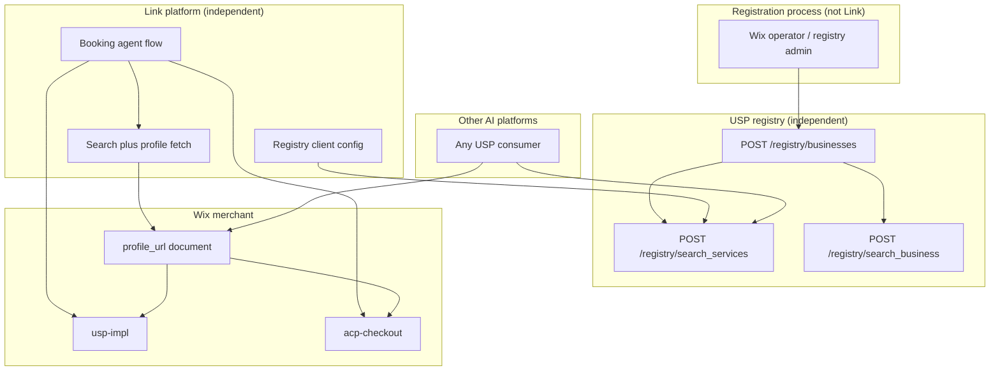
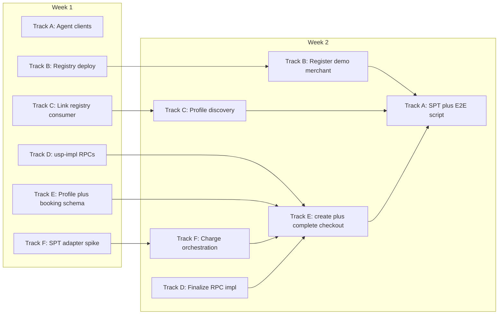

# USP + UCP + SPT Demo Implementation Plan

**Date:** 2026-06-10 (rev. spec-aligned)  
**Goal:** Deliver a **UCP-Native Mode** demo in **one 2-week sprint** where a Link agent discovers a Wix Bookings merchant **already listed in a USP registry**, consumes that merchant's `**profile_url`** per [USP §6](../specification.md#6-discovery-registry-optional), fetches the **UCP business profile** per [USP §7.2](../specification.md#72-profile-registration-in-well-knownucp) and [UCP Profile](https://ucp.dev/latest/specification/overview/), runs the [USP §7.5](../specification.md#75-checkout-flow-and-atomicity-guarantee) paid flow (UCP `create_checkout` + `complete_checkout` with `dev.usp.services.paid_bookings` + Stripe SPT), receives `**booking.confirmed`** webhook with correlated `**order_id`** ([§7.5 step 8](../specification.md#75-checkout-flow-and-atomicity-guarantee), [§5.4.1](../specification.md#541-booking-webhooks)), and ends with `**status: completed`**, `**order_id`**, and `**booking.booking_status: confirmed**` — with **no Standalone Mode**, **no `checkout_systems` redirect**, and **no migration** from prior deployments.

**Normative references:** [USP `specification.md](../specification.md)` §6 (registry), §7 (UCP-Native), `[schemas/paid_bookings.json](../schemas/paid_bookings.json)`, `[schemas/registry.json](../schemas/registry.json)`; [UCP checkout](https://ucp.dev/latest/specification/checkout/), [UCP payment architecture](https://ucp.dev/latest/specification/overview/#payment-architecture), [Stripe UCP/SPT](https://docs.stripe.com/agentic-commerce/protocol).

**Assumptions:**

- Greenfield: nothing in production; no dual-publish, no Standalone profile, no legacy clients to support.
- **One developer per task**; unlimited developers; work proceeds in **parallel tracks** wherever dependencies allow.
- Demo scope excludes **holds**, **mixed cart**, and `**dev.ucp.shopping.order`**.
- **Link platform and USP registry are independent ecosystem components** (see [§2.1](#21-usp-ecosystem-link-platform-vs-registry)).

**Repos:**


| Repo                                                     | Module                                | Track |
| -------------------------------------------------------- | ------------------------------------- | ----- |
| [linkusp-cli](https://github.com/yahalomran/linkusp-cli) | Link agent USP client                 | A     |
| `universal-scheduling-protocol`                          | USP registry (spec + reference impl)  | B     |
| Link platform                                            | Registry consumer + profile discovery | C     |
| `wix-vmr-repo`                                           | `usp-impl`                            | D     |
| `ecom`                                                   | `acp-checkout`                        | E, F  |


---

## 1. Target Demo Flow

```mermaid
sequenceDiagram
    participant Agent as Link agent linkusp-cli
    participant Registry as USP registry
    participant UCP as Wix acp-checkout
    participant USP as Wix usp-impl
    participant Stripe as Stripe SPT

    Agent->>Registry: 1. POST search_services query filter
    Registry-->>Agent: 2. ServiceSearchResult service_id plus business profile_url
    Agent->>UCP: 3. GET profile_url
    Note over Agent,UCP: profile_url is the UCP profile document URL per USP 6.1
    UCP-->>Agent: 4. capabilities services payment_handlers
    Agent->>USP: 5. GET /services/service_id
    Note over Agent,USP: live catalog per USP 6.3 before booking-time decisions
    USP-->>Agent: 6. Service type pricing policies
    Agent->>USP: 7. POST availability query for service_id
    USP-->>Agent: 8. Available slots
    Agent->>UCP: 9. POST create_checkout with booking extension
    UCP->>USP: 10. CreatePendingBooking RPC
    UCP-->>Agent: 11. checkout ready_for_complete plus booking_id
    Agent->>Stripe: 12. Acquire shared payment token
    Stripe-->>Agent: 13. SPT credential
    Agent->>UCP: 14. POST complete_checkout with SPT
    UCP->>Stripe: 15. Charge via StripeSptProviderAdapter
    UCP->>USP: 16. FinalizeBookingOnPayment RPC
    UCP-->>Agent: 17. completed plus order_id plus booking_status confirmed
    USP-->>Agent: 18. POST booking.confirmed webhook with order_id
    Note over Agent,USP: async best-effort per 7.5 step 8; agent verifies signature
```


### Step-by-step flow

Field names below refer to [`paid_bookings.json`](../schemas/paid_bookings.json) `BookingContext`, UCP checkout request fields from [USP §7.4](../specification.md#74-paid-bookings-extension-schema), and upstream schemas [`registry.json`](../schemas/registry.json), [`catalog.json`](../schemas/catalog.json), [`availability.json`](../schemas/availability.json). **Registry snapshot fields are discovery hints only** unless marked authoritative; live catalog from step 6 is authoritative for checkout per [§6.3](../specification.md#63-service-search---post-registrysearch_services).

1. **Registry service search** (`Agent` → `Registry`): The Link agent calls `POST /registry/search_services` with at least one filter (e.g. `query` plus optional `verticals`/`categories`) per [USP §6.3](../specification.md#63-service-search---post-registrysearch_services).

   **Why:** Cold-start discovery must not rely on a hardcoded merchant URL; the registry is the federated entry point that returns candidate services and enough business metadata to continue.

   **Fields consumed (this request):** `USP_REGISTRY_URL` (agent config); search filters (`query`, `verticals`, `categories`, etc.) from demo command or user intent.

   **Fields obtained:** none (request only; response fields arrive in step 2).

2. **Search results** (`Registry` → `Agent`): The registry returns one or more [`ServiceSearchResult`](../schemas/registry.json) hits.

   **Why:** The agent needs a stable service identifier and the full profile document URL before it can evaluate capabilities or talk to the merchant. Filtering by `deployment_mode`, payment handlers, or other USP/UCP capabilities belongs in registry search ([GH-055](#gh-055-registry-capability-and-payment-search-filters)); the demo does not implement client-side post-filters.

   **Fields obtained → later use:**

   | Field obtained | Used in step(s) | Required for |
   |----------------|-----------------|--------------|
   | `service_id` | 5 (path), 7 (`availability.query.service_id`), 9 (`booking.service_id`, `line_items[].item.id`) | Catalog fetch, availability, `create_checkout` |
   | `business.profile_url` | 3 (`GET {profile_url}`) | UCP profile fetch |
   | `business.deployment_mode` | (discovery / GH-055 only; demo does not client-filter) | Merchant mode validation when registry supports it |
   | `business.name` | (display / logging only) | Not sent on `create_checkout` |
   | `service_name` | (discovery ranking / display only) | Checkout title uses live `Service.name` from step 6 |
   | `pricing` | (discovery hint only; **not** used on `create_checkout`) | Superseded by step 6 live `Service.pricing` |
   | `timezone` | 7 (optional default on `availability.query.timezone`) | Availability query; may also come from step 6 / profile |
   | `category`, `duration_minutes`, `location` | (discovery / filtering only) | Not required on `create_checkout` |

3. **Fetch UCP business profile** (`Agent` → `UCP`): The agent issues `GET {profile_url}` using the **full profile document URL** from the registry hit (e.g. `https://{host}/.well-known/ucp`), not site origin plus an appended path.

   **Why:** Per [USP §6.1](../specification.md#61-business-registration---post-registrybusinesses) and [§7.2](../specification.md#72-profile-registration-in-well-knownucp), merchant capabilities, REST endpoints, and payment handlers are advertised in the UCP profile; the agent must load that document before any booking-time calls.

   **Fields consumed (this request):** `business.profile_url` from step 2.

   **Fields obtained:** none (request only; response fields arrive in step 4).

4. **Profile document** (`UCP` → `Agent`): `acp-checkout` serves the UCP profile with required capabilities (`dev.ucp.shopping.checkout`, `dev.usp.services.*`), `ucp.services` endpoint map, and `payment_handlers` (including Stripe SPT).

   **Why:** The agent validates that `paid_bookings` **extends** `checkout` per [§2.4](#24-what-paid_bookings-extends-checkout-means), resolves USP and UCP base URLs, and selects the correct payment handler before mutating checkout.

   **Fields obtained → later use:**

   | Field obtained | Used in step(s) | Required for |
   |----------------|-----------------|--------------|
   | `capabilities` (`dev.ucp.shopping.checkout`, `dev.usp.services.paid_bookings` with `extends: dev.ucp.shopping.checkout`, `catalog`, `availability`, `bookings`) | 9 (precondition) | Confirm UCP-Native paid path before `create_checkout` |
   | `ucp.services["dev.ucp.shopping"]` (REST base URL) | 9 (`POST create_checkout`), 14 (`POST complete_checkout`) | UCP checkout REST |
   | `ucp.services["dev.usp.services"]` (or catalog capability endpoint) | 5 (`GET /services/{id}`), 7 (`POST /availability/query`) | USP catalog + availability |
   | `payment_handlers` (e.g. Stripe SPT handler id, `type`, `endpoint`, `schema`) | 12 (SPT acquisition); 11 (may repeat on checkout response) | Platform-side token acquisition per [UCP payment architecture](https://ucp.dev/latest/specification/overview/#payment-architecture) |
   | `business.currency` (when present on profile) | 9 (fallback for `currency` if not taken from step 6) | Top-level checkout `currency` |
   | `availability` capability config (e.g. `holds: false`) | 9 (confirm demo path skips `hold_id`) | Hold-free demo scope |

5. **Live catalog fetch** (`Agent` → `USP`): The agent calls `GET /services/{service_id}` on the merchant USP catalog endpoint resolved from the profile.

   **Why:** [USP §6.3](../specification.md#63-service-search---post-registrysearch_services) requires live catalog at booking time; the registry snapshot is non-authoritative for price, `service_type`, and policies used in checkout.

   **Fields consumed (this request):** `service_id` from step 2; USP base URL from step 4.

   **Fields obtained:** none (request only; response fields arrive in step 6).

6. **Service record** (`USP` → `Agent`): `usp-impl` returns the current [`Service`](../schemas/catalog.json).

   **Why:** Availability queries and `create_checkout` must reflect server-side catalog state; the merchant re-validates price at create and returns `price_mismatch` if the agent sends a stale amount ([§7.4](../specification.md#74-paid-bookings-extension-schema)).

   **Fields obtained → later use:**

   | Field obtained | Used in step(s) | Maps to on `create_checkout` (step 9) |
   |----------------|-----------------|---------------------------------------|
   | `id` | 7, 9 | `booking.service_id`; `line_items[].item.id` (must match per [§7.4](../specification.md#74-paid-bookings-extension-schema)) |
   | `name` | 9 | `line_items[].item.title` |
   | `type` | 9 | `booking.service_type` (required on `BookingContext`) |
   | `pricing.amount` | 9 | `line_items[].item.price` when `pricing.model` is `fixed`, `hourly`, or `per_person` (demo uses `fixed`) |
   | `pricing.currency` | 9 | top-level `currency` |
   | `pricing.model` | 8, 9 | If `variable`, step 8 `TimeSlot.pricing.amount` replaces catalog amount on `line_items[].item.price` |
   | `policies.confirmation_mode` | 9 (optional echo), 16-17 (behavior) | May omit on request (business authoritative); demo expects `auto` so step 17 yields `booking.booking_status: confirmed` |
   | `policies.requires_payment`, `policies.payment_timing` | 9 (precondition) | Validates paid-at-booking UCP path (`at_booking` for demo) |
   | `resources[]` (`selectable`, `options`) | 7 (optional `resource_id` filter), 9 (optional `booking.resources`) | Only when buyer selects a specific staff/room before query |
   | `duration` | (scheduling context; slot duration comes from step 8) | Not copied directly to `booking.slot.duration` |

7. **Availability query** (`Agent` → `USP`): The agent calls `POST /availability/query` for the chosen `service_id` and time window.

   **Why:** [USP §7.5](../specification.md#75-checkout-flow-and-atomicity-guarantee) step 2 requires confirming bookable slots before checkout; this selects a concrete slot for the `paid_bookings` extension.

   **Fields consumed (this request):** `service_id` from step 2 / confirmed by step 6 `Service.id`; USP endpoint from step 4; optional `timezone` from step 2 or step 6; optional `resource_id` when step 6 `resources[].selectable` is true; `start_date` / `end_date` from agent time window.

   **Fields obtained:** none (request only; response fields arrive in step 8).

8. **Available slots** (`USP` → `Agent`): `usp-impl` returns matching [`TimeSlot`](../schemas/availability.json) entries; the agent picks one slot.

   **Why:** Checkout requires a schema-valid `SlotReference` tied to real capacity; without this response the agent cannot build a valid `booking` object on `create_checkout`.

   **Fields obtained → later use** (from the **selected** slot):

   | Field obtained | Used in step(s) | Maps to on `create_checkout` (step 9) |
   |----------------|-----------------|---------------------------------------|
   | `id` | 9 | `booking.slot.id` |
   | `start` | 9 | `booking.slot.start` |
   | `end` | 9 | `booking.slot.end` |
   | `duration` | 9 | `booking.slot.duration` (ISO 8601, e.g. `PT60M`) |
   | `resources[]` (`id`, `type`, `name`) | 9 (optional) | `booking.resources[]` when copying staff/room assignment from the slot |
   | `pricing.amount`, `pricing.currency` | 9 | `line_items[].item.price` and `currency` **only when** step 6 `pricing.model == variable` |
   | `state`, `capacity`, `location`, `service_id` | (validation / UX only) | Not sent on `SlotReference`; agent must pick `state: available` (or acceptable) slot |

9. **Create checkout** (`Agent` → `UCP`): The agent calls UCP `POST create_checkout` with the `dev.usp.services.paid_bookings` extension.

   **Why:** UCP-Native paid booking starts as a standard UCP checkout session extended for scheduling; this is [USP §7.5](../specification.md#75-checkout-flow-and-atomicity-guarantee) step 4, not Standalone `confirm-payment`.

   **Fields consumed (assembled into this request):**

   | Request field | Source step(s) | Notes |
   |---------------|----------------|-------|
   | `line_items[].id` | Agent-generated | e.g. `li_1` |
   | `line_items[].item.id` | 2, 6 | Must equal `booking.service_id` |
   | `line_items[].item.title` | 6 (`Service.name`) | |
   | `line_items[].item.price` | 6 (`Service.pricing.amount`) or 8 (`TimeSlot.pricing` if variable) | Must match live catalog ([§7.4](../specification.md#74-paid-bookings-extension-schema)) |
   | `line_items[].quantity` | Agent | Demo: `1` |
   | `currency` | 6 (`Service.pricing.currency`) or 4 (profile fallback) | |
   | `buyer.email`, `buyer.first_name`, `buyer.last_name` | Link account (platform; not a numbered diagram step) | Required for `ready_for_complete` ([§7.5 step 4](../specification.md#75-checkout-flow-and-atomicity-guarantee)) |
   | `booking.service_id` | 2, 6 | Required on `BookingContext` |
   | `booking.service_type` | 6 (`Service.type`) | Required on `BookingContext`; **not** on registry snapshot |
   | `booking.slot` | 8 (selected slot) | Required; all four `SlotReference` fields |
   | `booking.resources` | 8 (optional) | Omit when business auto-assigns |
   | `booking.party_size` | Agent | Demo appointment: omit (default `1`) |
   | `booking.confirmation_mode` | 6 (optional echo) | May omit; business uses `Service.policies.confirmation_mode` |
   | `booking.notes`, `booking.recipient` | Agent / buyer (optional) | Out of demo scope |
   | `booking.hold_id` | — | **Not used** (demo `holds: false`) |
   | `Idempotency-Key` (header) | Agent-generated | [§7.3](../specification.md#73-inherited-infrastructure) / UCP idempotency |
   | UCP REST base URL | 4 | Target for this request |

   **Fields obtained:** none synchronously from merchant on this sub-step (response in step 11).

10. **Pending booking** (`UCP` → `USP`): `acp-checkout` invokes internal `CreatePendingBooking` gRPC on `usp-impl`, reserving the slot in `pending` state.

    **Why:** Scheduling state must be created atomically with the checkout session so payment completion can confirm the booking without a separate agent-side `POST /bookings`.

    **Fields consumed (internal):** `booking.service_id`, `booking.service_type`, `booking.slot`, optional `booking.resources`, `buyer` from step 9 request; line item price for server-side catalog validation.

    **Fields obtained (agent-visible):** deferred to step 11 response.

11. **Checkout ready** (`UCP` → `Agent`): UCP returns checkout `status: ready_for_complete` plus booking and payment metadata.

    **Why:** The agent needs the checkout session handle, correlated booking id, and payment handler binding before acquiring SPT and calling `complete_checkout`.

    **Fields obtained → later use:**

    | Field obtained | Used in step(s) | Required for |
    |----------------|-----------------|--------------|
    | `id` (checkout session id) | 14 | `complete_checkout` path/body reference |
    | `status: ready_for_complete` | 12-14 (gate) | Proceed to SPT + complete without `update_checkout` |
    | `booking.booking_id` | 14, 17, 18 | Correlation; webhook match |
    | `booking.booking_status: pending` | 17 (before complete) | Expected post-create state |
    | `payment_handlers` | 12 | SPT acquisition when not already cached from step 4 |
    | `booking.actions[]` (if present) | — | **Demo avoids:** would require [§7.5 step 5](../specification.md#75-checkout-flow-and-atomicity-guarantee) before payment |

12. **Acquire SPT** (`Agent` → `Stripe`): The Link platform obtains a Shared Payment Token via Stripe's UCP/SPT flow.

    **Why:** UCP-Native completion uses platform-acquired SPT on `complete_checkout`; the agent does not collect card data directly.

    **Fields consumed (this request):** `payment_handlers` config from step 4 and/or step 11; checkout context from step 11.

    **Fields obtained:** none (request only; credential in step 13).

13. **SPT credential** (`Stripe` → `Agent`): Stripe returns the SPT credential bound to the checkout context.

    **Why:** `complete_checkout` must present a valid, scoped payment token for `StripeSptProviderAdapter`.

    **Fields obtained → later use:**

    | Field obtained | Used in step(s) | Required for |
    |----------------|-----------------|--------------|
    | SPT `credential.token` (instrument shape per handler `schema`) | 14 | `complete_checkout` `payment.instruments[].credential` |

14. **Complete checkout** (`Agent` → `UCP`): The agent calls UCP `POST complete_checkout` with the SPT and checkout session reference.

    **Why:** Atomic payment-plus-confirmation gate per [USP §7.5](../specification.md#75-checkout-flow-and-atomicity-guarantee) steps 6-7.

    **Fields consumed (this request):** checkout `id` from step 11; SPT credential from step 13; UCP REST base URL from step 4; `Idempotency-Key` (header, agent-generated).

    **Fields obtained:** none synchronously on agent leg (response in step 17).

15. **Charge payment** (`UCP` → `Stripe`): `acp-checkout` charges via `StripeSptProviderAdapter`.

    **Why:** Funds must be captured (or authorized per handler config) before the merchant commits the booking.

    **Fields consumed (internal):** SPT from step 13; handler id from step 4 / 11; checkout + booking state from steps 9-11.

    **Fields obtained (agent-visible):** deferred to step 17.

16. **Finalize booking** (`UCP` → `USP`): On successful charge, `acp-checkout` calls `FinalizeBookingOnPayment` gRPC.

    **Why:** Scheduling confirmation must follow payment success; uses `confirmation_mode` from step 6 policies (`auto` in demo).

    **Fields consumed (internal):** `booking.booking_id` from step 11; `Service.policies.confirmation_mode` from step 6 (authoritative).

    **Fields obtained (agent-visible):** deferred to step 17.

17. **Checkout completed** (`UCP` → `Agent`): UCP returns terminal checkout state.

    **Why:** Synchronous success signal for demo assertions per [USP §7.5](../specification.md#75-checkout-flow-and-atomicity-guarantee) atomicity guarantees.

    **Fields obtained → later use:**

    | Field obtained | Used in step(s) | Required for |
    |----------------|-----------------|--------------|
    | `status: completed` | Demo assertions | End-to-end success |
    | `order_id` | 18 (webhook correlation) | Must match `booking.confirmed` payload |
    | `booking.booking_status: confirmed` | Demo assertions | When step 6 `confirmation_mode` is `auto` |
    | `booking.booking_id` | 18 | Must match webhook `booking_id` |

18. **Booking webhook** (`USP` → `Agent`): `usp-impl` asynchronously `POST`s `booking.confirmed`.

    **Why:** [USP §7.5 step 8](../specification.md#75-checkout-flow-and-atomicity-guarantee) and [§5.4.1](../specification.md#541-booking-webhooks) durable notification; signature verified per [§10.1.1](../specification.md#1011-webhook-security).

    **Fields obtained → later use:**

    | Field obtained | Used in step(s) | Required for |
    |----------------|-----------------|--------------|
    | `booking_id` | Demo assertions | Must equal step 11 / 17 `booking.booking_id` |
    | `order_id` | Demo assertions | Must equal step 17 `order_id` |
    | Webhook signature headers | Agent verification | [§10.1.1](../specification.md#1011-webhook-security) authenticity |

**Demo success criteria (day 10):**

- [ ] Link agent completes the flow above against one **registry-listed** Wix demo merchant end-to-end.
- [ ] Link discovers the service and merchant via `**POST /registry/search_services` only** (no hardcoded merchant URL in agent config; no `search_business` in demo path); then `**GET /services/{service_id}`** for live catalog per [§6.3](../specification.md#63-service-search---post-registrysearch_services) before availability and checkout.
- [ ] Service search uses at least one filter per [USP §6.3](../specification.md#63-service-search---post-registrysearch_services) (e.g. `query` plus optional `verticals`/`categories`); no client-side post-filter by `deployment_mode` or payment handlers in the demo ([GH-055](#gh-055-registry-capability-and-payment-search-filters) is the correct solution when agents need those filters).
- [ ] Link fetches business profile via `GET {profile_url}` where `profile_url` is the **full profile document URL** (e.g. `https://{host}/.well-known/ucp`), not site origin + appended path.
- [ ] UCP-Native profile includes required capabilities per [USP §7.2](../specification.md#72-profile-registration-in-well-knownucp); `dev.usp.services.paid_bookings` declares `"extends": "dev.ucp.shopping.checkout"` ([§2.4](#24-what-paid_bookings-extends-checkout-means)); no `checkout_systems` field ([USP §7.1](../specification.md#71-overview-and-when-to-use)).
- [ ] Payment uses UCP `complete_checkout` with platform-acquired SPT per [UCP payment handlers](https://ucp.dev/latest/specification/overview/#payment-architecture) (not Standalone `confirm-payment`).
- [ ] Atomic completion per [USP §7.5](../specification.md#75-checkout-flow-and-atomicity-guarantee): `booking.booking_status: confirmed` when `confirmation_mode` is `auto` and checkout `status: completed`.
- [ ] `**booking.confirmed` webhook** received with `booking_id` and `order_id` matching the completed checkout ([§5.4.1](../specification.md#541-booking-webhooks), `[schemas/webhook_event.json](../schemas/webhook_event.json)`); signature verified per [§10.1.1](../specification.md#1011-webhook-security).

---

## 2. Architecture

### 2.1 USP ecosystem: Link platform vs registry

The **USP registry** and the **Link platform** are separate components. Either can be replaced without coupling to the other.


| Component                     | Role                                                                                                   | Owns registration?                                               | Demo repo                       |
| ----------------------------- | ------------------------------------------------------------------------------------------------------ | ---------------------------------------------------------------- | ------------------------------- |
| **USP registry**              | Federated directory; `POST /registry/businesses`, search APIs; returns `profile_url` per entry         | **Yes** — business registration is a registry-side process       | `universal-scheduling-protocol` |
| **Link platform** (`linkusp`) | One USP-enabled AI platform; cold-start discovery via **any** configured registry; profile consumption | **No** — Link never calls `POST /registry/businesses`            | `linkusp-cli` + Link services   |
| **Other AI platforms**        | Same consumer role as Link; may use the same or a different registry                                   | **No**                                                           | Out of demo scope               |
| **Wix business**              | Publishes `/.well-known/ucp`; operates scheduling + checkout                                           | N/A (business is the subject of registration, not the registrar) | `usp-impl`, `acp-checkout`      |


**Registration (out of Link scope):** Per [USP §6.1](../specification.md#61-business-registration---post-registrybusinesses), a registrar (registry operator, business SaaS, or partner — **not** a consumer platform) calls `POST /registry/businesses` with a `[RegistrationRequest](../schemas/registry.json)` body including:

- `profile_url` — **full URL of the profile document** (for UCP-Native: `https://{host}/.well-known/ucp`)
- `deployment_mode: "ucp_native"`
- `name`, `verticals`, `categories`, `timezone`, and `location` when required

The registry **MUST** validate that `GET profile_url` returns a valid UCP profile ([§6.1](../specification.md#61-business-registration---post-registrybusinesses)). Authoritative business capabilities live in that profile, not in the registration payload. Link is not involved in registration.

**Discovery (Link / any platform scope):** Per [USP §6.3](../specification.md#63-service-search---post-registrysearch_services) and [§6.7](../specification.md#67-registry-governance), once registered:

1. `**POST /registry/search_services`** with at least one search filter (demo: `query` plus optional `verticals`/`categories`). Demo does **not** call `search_business`.
2. Select a `[ServiceSearchResult](../schemas/registry.json)`; read `service_id` and `business.profile_url` (registry pricing is a discovery hint only; checkout uses live catalog).
3. `GET profile_url` — fetch UCP business profile ([USP §7.2](../specification.md#72-profile-registration-in-well-knownucp); discovery inherited from UCP per [§7.3](../specification.md#73-inherited-infrastructure)).
4. Match required capabilities and versions; verify `paid_bookings` **extends** `checkout` per [§2.4](#24-what-paid_bookings-extends-checkout-means) (both capabilities present; `extends` field equals `dev.ucp.shopping.checkout`).
5. Read `payment_handlers` from profile (UCP); there is **no** `checkout_systems` in UCP-Native mode.
6. Resolve `dev.usp.services` and `dev.ucp.shopping` REST endpoints from `ucp.services`.
7. `**GET /services/{service_id}`** on the merchant USP catalog endpoint ([§3.12.3](../specification.md#3123-get-service---get-servicesservice_id)) — live catalog for booking-time decisions per [§6.3](../specification.md#63-service-search---post-registrysearch_services) (registry hit is a non-authoritative snapshot).
8. Perform UCP auth, consent, and identity linking per [§7.3](../specification.md#73-inherited-infrastructure) before mutating checkout.
9. Use the live `Service` object (`type` → `booking.service_type`, `pricing`, `policies`) plus registry `service_id` for availability and checkout (`create_checkout` re-validates catalog price server-side).




### 2.2 Wix implementation architecture

**Orchestrator:** `acp-checkout` (`UcpHttpAdapter`) owns UCP profile, checkout lifecycle, and SPT payment.  
**Scheduling adapter:** `usp-impl` owns catalog, availability, and booking lifecycle via **internal gRPC RPCs** called by `acp-checkout`.

```
Link Agent (consumer only)
    |
    +-- Configured USP registry URL --> search_services (demo path only)
    |       |
    |       +-- ServiceSearchResult: service_id + business.profile_url
    |
    +-- GET profile_url ... UCP business profile (full URL from registry)
    |
    +-- GET /services/{service_id} ... usp-impl (REST, live catalog per §6.3)
    |
    +-- POST /ucp/{site_id}/checkout-sessions ... acp-checkout
    |       +-- CreatePendingBooking -----> usp-impl (gRPC)
    |       +-- FinalizeBookingOnPayment --> usp-impl (gRPC)
    |
    +-- POST /usp/v1/availability/query ... usp-impl (REST, from profile)
```

Profile advertises `holds: false` on availability (holds out of demo scope).

### 2.3 Normative protocol alignment map

This table is the conformance contract for the demo. Implementation tasks **MUST** satisfy these normative requirements.

#### USP registry ([§6](../specification.md#6-discovery-registry-optional))


| Requirement                                                              | Spec                        | Plan enforcement                                                     |
| ------------------------------------------------------------------------ | --------------------------- | -------------------------------------------------------------------- |
| Registry optional; cold-start only                                       | §6 intro                    | Demo uses registry; direct `profile_url` also valid but not used     |
| `profile_url` is full profile document URL                               | §6.1, `RegistrationRequest` | GH-012, GH-013, GH-021, GH-022                                       |
| `deployment_mode: ucp_native` on register                                | §6.1                        | GH-013                                                               |
| Demo discovery via service search only                                   | §6.3                        | GH-021, GH-005, GH-024                                               |
| `deployment_mode` on service search hits (`RegistryBusinessRef`)         | §6.3 response               | GH-021 returns metadata; GH-055 registry request filters when needed |
| Registry validates reachable profile before accept                       | §6.1 MUST                   | GH-012                                                               |
| Service search requires ≥1 filter                                        | §6.3 MUST                   | GH-011, GH-021                                                       |
| Fetch live catalog at booking time (registry snapshot non-authoritative) | §6.3 MUST                   | GH-003 `GET /services/{service_id}` after profile                    |
| Registry `usp` envelope describes **registry**, not business             | §6.1                        | GH-010 implementers note                                             |
| Federated registries; business may register with multiple                | §6.7                        | Link uses configurable `USP_REGISTRY_URL` (GH-020)                   |
| Platforms search only; never register                                    | §6.2–6.3 (consumer ops)     | Track C; no `POST /registry/businesses` in Link                      |


#### USP UCP-Native business profile ([§7.2](../specification.md#72-profile-registration-in-well-knownucp))


| Requirement                                                                              | Spec                                                              | Plan enforcement        |
| ---------------------------------------------------------------------------------------- | ----------------------------------------------------------------- | ----------------------- |
| Single `/.well-known/ucp`; no `/.well-known/usp`                                         | §7.1                                                              | GH-040; greenfield demo |
| No `checkout_systems` in profile                                                         | §7.2, §7.1                                                        | GH-040, GH-022          |
| `dev.usp.services` service entry with REST endpoint                                      | §7.2                                                              | GH-040                  |
| Capabilities: `catalog`, `availability`, `bookings`, `paid_bookings`                     | §7.2                                                              | GH-040                  |
| `paid_bookings` extends `dev.ucp.shopping.checkout` (profile `extends` field + protocol) | §7.2, §7.4, [§2.4](#24-what-paid_bookings-extends-checkout-means) | GH-022, GH-040, GH-041  |
| `dev.ucp.shopping.checkout` capability present                                           | §7.2                                                              | GH-040, GH-022          |
| `availability` may declare `holds: false`                                                | §4, demo scope                                                    | GH-040                  |


#### USP + UCP paid booking flow ([§7.5](../specification.md#75-checkout-flow-and-atomicity-guarantee))


| Step | Normative action                                           | Plan task                                                                                                                                                                                                                                                                     |
| ---- | ---------------------------------------------------------- | ----------------------------------------------------------------------------------------------------------------------------------------------------------------------------------------------------------------------------------------------------------------------------- |
| 1    | `POST /services/list`                                      | Out of scope — demo uses registry `search_services` for cold-start, then `GET /services/{service_id}` for live catalog ([§6.3](../specification.md#63-service-search---post-registrysearch_services); [merchant-direct list](#merchant-direct-catalog-discovery) remains future) |
| 1b   | `GET /services/{service_id}`                               | GH-003 — booking-time catalog hydration per [§3.12.3](../specification.md#3123-get-service---get-servicesservice_id)                                                                                                                                                             |
| 2    | `POST /availability/query`                                 | GH-003, GH-021                                                                                                                                                                                                                                                                |
| 3    | Hold slot (if `holds: true`)                               | Out of scope                                                                                                                                                                                                                                                                  |
| 4    | UCP `create_checkout` + `booking`; **no** `POST /bookings` | GH-002, GH-042                                                                                                                                                                                                                                                                |
| 4a   | Return `ready_for_complete` when complete                  | GH-042                                                                                                                                                                                                                                                                        |
| 4b   | `price_mismatch` recoverable message                       | GH-042                                                                                                                                                                                                                                                                        |
| 5    | Non-payment `booking.actions` before payment               | GH-043 (`actions_pending`)                                                                                                                                                                                                                                                    |
| 6    | Acquire payment token from `payment_handlers`              | GH-004, GH-052                                                                                                                                                                                                                                                                |
| 7    | UCP `complete_checkout`; atomic payment + booking          | GH-044, GH-032, GH-053                                                                                                                                                                                                                                                        |
| 7a   | `booking_status` derivation from checkout `status`         | GH-043                                                                                                                                                                                                                                                                        |
| 7b   | On payment failure: booking stays `pending`                | GH-044, GH-053                                                                                                                                                                                                                                                                |
| 8    | Webhook `booking.confirmed` with `order_id`                | [§7.5](../specification.md#75-checkout-flow-and-atomicity-guarantee) step 8                                                                                                                                                                                                      |


#### UCP checkout binding ([ucp.dev](https://ucp.dev/latest/specification/checkout/))


| Requirement                                                                                      | UCP spec                                | Plan enforcement              |
| ------------------------------------------------------------------------------------------------ | --------------------------------------- | ----------------------------- |
| Checkout lifecycle: `incomplete`, `ready_for_complete`, `completed`, …                           | UCP status values                       | GH-043, GH-042                |
| `create_checkout` / `get_checkout` / `update_checkout` / `complete_checkout` / `cancel_checkout` | UCP REST                                | GH-002, Wix `UcpHttpAdapter`  |
| `Idempotency-Key` on create (and complete)                                                       | UCP idempotency, USP §7.3               | GH-046, existing create guard |
| `payment.instruments[]` + `credential` on `complete_checkout`                                    | UCP complete checkout                   | GH-002, GH-004                |
| `payment_handlers` on profile and checkout response                                              | UCP payment architecture                | GH-052, GH-022                |
| Extension field `booking` on checkout object                                                     | USP `paid_bookings.json` ⊂ UCP checkout | GH-041                        |
| Line item `item.price` in minor units; MUST match catalog                                        | USP §7.4                                | GH-042                        |
| `continue_url` + `get_checkout` poll on 3DS / `complete_in_progress`                             | UCP + USP §7.5                          | GH-054 (best-effort)          |
| Error `messages[]` with severity (recoverable, error)                                            | UCP error handling                      | GH-042, GH-044                |
| Cancel atomicity: checkout `canceled`, booking `canceled`                                        | USP §7.5                                | GH-045                        |


#### Inherited from UCP only (USP §7.3 — do not reimplement in Standalone layers)

Discovery after `profile_url` fetch, capability negotiation, versioning, RFC 9457 errors, idempotency, webhooks, identity, consent, OAuth, TLS — **use UCP bindings**, not `/.well-known/usp` or Standalone `USP-Agent` negotiation.

### 2.4 What "`paid_bookings` extends `checkout`" means

This phrase appears throughout capability negotiation ([GH-022](#gh-022-link-platform-profile-capability-negotiation)). It has a **profile declaration** meaning and a **protocol** meaning. Implementers must satisfy both.

#### Profile declaration (what linkusp verifies)

In `GET {profile_url}` → `ucp.capabilities`, a paid UCP-Native demo merchant **MUST** declare **both**:


| Capability                       | Role                                                                                          |
| -------------------------------- | --------------------------------------------------------------------------------------------- |
| `dev.ucp.shopping.checkout`      | Base UCP checkout (create/get/update/complete/cancel, `line_items`, `payment_handlers`, etc.) |
| `dev.usp.services.paid_bookings` | USP **extension** that augments checkout with scheduling                                      |


The `paid_bookings` entry **MUST** include `"extends": "dev.ucp.shopping.checkout"` per [USP §7.2](../specification.md#72-profile-registration-in-well-knownucp):

```json
"dev.ucp.shopping.checkout": [{ "version": "2026-01-11" }],
"dev.usp.services.paid_bookings": [{
  "version": "2026-02-09",
  "schema": "https://usp.dev/schemas/services/paid_bookings.json",
  "extends": "dev.ucp.shopping.checkout"
}]
```

**Verification steps** (fail fast if any check fails):

1. `dev.ucp.shopping.checkout` is present with a supported `version`.
2. `dev.usp.services.paid_bookings` is present with a supported `version`.
3. `paid_bookings[0].extends == "dev.ucp.shopping.checkout"` (exact string).
4. Demo also requires `catalog`, `availability`, and `bookings` USP capabilities per §7.2.

**Not sufficient:** `bookings` alone, or `paid_bookings` without the base `checkout` capability, or `paid_bookings` whose `extends` points at a different capability. Free-only merchants correctly omit **both** `checkout` and `paid_bookings` ([§7.2](../specification.md#72-profile-registration-in-well-knownucp)); they are out of demo scope.

#### Protocol meaning (what the agent does after verification)

Per [USP §2.4](../specification.md#24-core-constructs), an **extension** layers extra fields onto a base capability schema. `[paid_bookings.json](../schemas/paid_bookings.json)` uses UCP schema composition (`allOf` + `$defs` keyed by `dev.ucp.shopping.checkout`) to add a `booking` object to the checkout payload ([§7.4](../specification.md#74-paid-bookings-extension-schema)).

Therefore, after verification, linkusp **MUST**:

- Use **UCP shopping REST** (`create_checkout`, `complete_checkout`, …) from `ucp.services["dev.ucp.shopping"]`, not Standalone `POST /bookings` + `confirm-payment`.
- Send `booking` on `create_checkout` and read `booking.booking_id` / `booking.booking_status` from checkout responses.
- Acquire SPT from `payment_handlers` and pass it on `complete_checkout` for atomic payment + booking per [§7.5](../specification.md#75-checkout-flow-and-atomicity-guarantee).

**Not required for demo:** runtime JSON Schema `allOf` validation of every checkout body against `paid_bookings.json` (optional for strict conformance tooling).

#### Wix publisher obligation (Track E)

`acp-checkout` profile merge ([GH-040](#gh-040-ucp-profile-merge-usp-capabilities)) **MUST** emit the `extends` field on the `paid_bookings` capability entry so linkusp verification succeeds.

---

## 3. Sprint Timeline (2 Weeks)

### 3.1 Parallel workstreams




### 3.2 Calendar


| Day  | Track A Link agent                                                                                                        | Track B USP registry                                                                                  | Track C Link platform                                                                                                 | Track D usp-impl                                                                                                              | Track E UCP+USP                                                                                                                 | Track F Stripe SPT                                      |
| ---- | ------------------------------------------------------------------------------------------------------------------------- | ----------------------------------------------------------------------------------------------------- | --------------------------------------------------------------------------------------------------------------------- | ----------------------------------------------------------------------------------------------------------------------------- | ------------------------------------------------------------------------------------------------------------------------------- | ------------------------------------------------------- |
| 1-2  | [GH-001](#gh-001-link-agent-ucp-native-profile-discovery) + [GH-002](#gh-002-link-agent-ucp-checkout-client) **parallel** | [GH-010](#gh-010-registry-minimal-deploy)                                                             | [GH-020](#gh-020-link-platform-configurable-registry-client)                                                          | [GH-030](#gh-030-usp-impl-internal-orchestration-rpc-proto)                                                                   | [GH-040](#gh-040-ucp-profile-merge-usp-capabilities) **parallel** with [GH-041](#gh-041-paid_bookings-booking-extension-schema) | [GH-050](#gh-050-payments-platform-spt-charge-contract) |
| 3-4  | [GH-003](#gh-003-link-agent-usp-catalog-and-scheduling-client)                                                            | [GH-011](#gh-011-registry-search-apis)                                                                | [GH-021](#gh-021-link-platform-registry-search-and-profile-resolution)                                                | [GH-031](#gh-031-usp-impl-creatependingbooking-rpc) **parallel** with [GH-032](#gh-032-usp-impl-finalizebookingonpayment-rpc) | [GH-042](#gh-042-ucpcreatecheckout-wire-to-usp-impl)                                                                            | [GH-051](#gh-051-stripe-spt-provider-adapter)           |
| 5    | Integration stub tests                                                                                                    | [GH-012](#gh-012-registry-profile-url-validation)                                                     | [GH-022](#gh-022-link-platform-profile-capability-negotiation)                                                        | [GH-033](#gh-033-usp-impl-cancelpendingbooking-rpc)                                                                           | [GH-043](#gh-043-booking-status-mapping-on-checkout)                                                                            | [GH-052](#gh-052-register-spt-handler-in-profile)       |
| 6-7  | [GH-004](#gh-004-link-agent-stripe-spt-acquisition)                                                                       | [GH-013](#gh-013-register-demo-wix-merchant) + [GH-014](#gh-014-demo-merchant-readiness-prerequisite) | [GH-023](#gh-023-link-platform-auth-consent-handshake)                                                                | Unit tests for RPCs                                                                                                           | [GH-044](#gh-044-atomic-ucpcompletecheckout-with-booking) depends D2,F2                                                         | [GH-053](#gh-053-booking-aware-payment-orchestration)   |
| 8    | [GH-005](#gh-005-link-agent-demo-e2e-command)                                                                             | Registry smoke test                                                                                   | [GH-024](#gh-024-link-platform-discovery-integration-test) + [GH-057](#gh-057-link-platform-booking-webhook-receiver) | [GH-056](#gh-056-usp-impl-booking-confirmed-webhook)                                                                          | [GH-045](#gh-045-atomic-ucpcancelcheckout-with-booking)                                                                         | SPT integration tests                                   |
| 9-10 | **Cross-track demo rehearsal** (incl. webhook)                                                                            |                                                                                                       |                                                                                                                       |                                                                                                                               | **Bug fix buffer**                                                                                                              |                                                         |


**Critical path:** GH-030 → GH-031/032 → GH-044 ← GH-051/053 ← GH-050 → GH-056 (webhook emit) → GH-057 (webhook receive) → GH-013 (registry listing + service index) → GH-021/022 (Link service search discovery) → GH-005 demo.

**Note:** [GH-013](#gh-013-register-demo-wix-merchant) and [GH-014](#gh-014-demo-merchant-readiness-prerequisite) run on **Track B / Wix ops**, not Link. Link work ([Track C](#7-track-c--link-platform-registry-consumer)) assumes the demo merchant is already registered before day 8 E2E.

---

## 4. Gap-to-Workstream Matrix

In-scope gaps only. Excluded work (holds, Standalone, mixed cart, MCP, registry capability filters, etc.) is listed in [Out of scope — future version](#out-of-scope-future-version) without matrix IDs.


| ID   | Gap                                         | Demo priority | Track   | GitHub issue                                                                                                                                                  |
| ---- | ------------------------------------------- | ------------- | ------- | ------------------------------------------------------------------------------------------------------------------------------------------------------------- |
| G-01 | No USP in `/.well-known/ucp`                | **P0**        | E       | [GH-040](#gh-040-ucp-profile-merge-usp-capabilities)                                                                                                          |
| G-02 | No `paid_bookings` extension                | **P0**        | E       | [GH-041](#gh-041-paid_bookings-booking-extension-schema), [GH-042](#gh-042-ucpcreatecheckout-wire-to-usp-impl)                                                |
| G-03 | No atomic `complete_checkout`               | **P0**        | E, D    | [GH-044](#gh-044-atomic-ucpcompletecheckout-with-booking), [GH-032](#gh-032-usp-impl-finalizebookingonpayment-rpc)                                            |
| G-04 | No Stripe UCP payment handler               | **P0**        | F       | [GH-051](#gh-051-stripe-spt-provider-adapter), [GH-052](#gh-052-register-spt-handler-in-profile)                                                              |
| G-10 | Site feature gating                         | **P0**        | B, D    | [GH-014](#gh-014-demo-merchant-readiness-prerequisite) (Wix prereq before registry registration)                                                              |
| G-12 | Webhook `booking.confirmed` with `order_id` | **P0**        | D, C, A | [GH-056](#gh-056-usp-impl-booking-confirmed-webhook), [GH-057](#gh-057-link-platform-booking-webhook-receiver), [GH-005](#gh-005-link-agent-demo-e2e-command) |
| G-15 | Registry / cold-start                       | **P0**        | B       | [GH-010](#gh-010-registry-minimal-deploy) through [GH-013](#gh-013-register-demo-wix-merchant)                                                                |
| G-26 | Link registry consumer                      | **P0**        | C       | [GH-020](#gh-020-link-platform-configurable-registry-client) through [GH-024](#gh-024-link-platform-discovery-integration-test)                               |
| G-09 | No idempotency on `complete_checkout`       | **P1**        | E       | [GH-046](#gh-046-execution-guard-on-complete_checkout)                                                                                                        |
| G-20 | Price mismatch handling                     | **P1**        | E       | [GH-042](#gh-042-ucpcreatecheckout-wire-to-usp-impl)                                                                                                          |
| G-21 | 3DS / `continue_url` on SPT                 | **P1**        | F       | [GH-054](#gh-054-spt-3ds-continue_url-handling) (best-effort for demo)                                                                                        |


---

## 5. Track A — Link Agent USP (`linkusp-cli`)

**Team:** Link / agent platform  
**Timeline:** Days 1-8 (E2E on days 9-10)

### Task A1 — UCP-Native profile wire models


|                   |                                                           |
| ----------------- | --------------------------------------------------------- |
| **Issue**         | [GH-001](#gh-001-link-agent-ucp-native-profile-discovery) |
| **Depends on**    | None (unit-test with fixture JSON until GH-040 lands)     |
| **Parallel with** | GH-002, GH-020, GH-030, GH-040                            |


**Why:** Booking/scheduling clients need typed models for the UCP profile document. **Registry search and profile consumption orchestration** live in [Track C](#7-track-c--link-platform-registry-consumer) (GH-021, GH-022); Track A provides shared wire types used by both discovery and checkout flows.

**What:**

1. Add `UcpNativeProfile` / `UcpNativeContext` models for the UCP profile document returned by `GET {profile_url}` ([USP §7.2](../specification.md#72-profile-registration-in-well-knownucp)).
2. Parse `ucp.services`, `ucp.capabilities`, `ucp.payment_handlers`, `business`.
3. Expose helpers: `usp_rest_endpoint()`, `ucp_rest_endpoint()`, `requires_paid_bookings()`.
4. **Do not** implement registry registration or embed a registry URL as a Link-owned service.

**Note:** `discover_service_via_registry()` + `consume_profile()` are implemented under Track C (GH-021, GH-022). Track A imports that module in GH-005 E2E.

---

### Task A2 — UCP checkout client with `booking` extension


|                   |                                                  |
| ----------------- | ------------------------------------------------ |
| **Issue**         | [GH-002](#gh-002-link-agent-ucp-checkout-client) |
| **Depends on**    | GH-001                                           |
| **Parallel with** | GH-003                                           |


**Why:** [USP §7.7.2](../specification.md#772-paid-service-flow-ucp-checkout) creates a pending booking via UCP `create_checkout` with the `paid_bookings` extension, not `POST /bookings`.

**What:**

1. Target UCP shopping REST base from profile `services.dev.ucp.shopping[0].endpoint` (Wix: `POST .../checkout-sessions` per `UcpHttpAdapter`).
2. Implement `create_checkout(line_items, buyer, booking)` with `Idempotency-Key` header per [UCP idempotency](https://ucp.dev/latest/specification/overview/) and [USP §7.3](../specification.md#73-inherited-infrastructure).
3. Implement `get_checkout`, `update_checkout` (for recoverable `messages`), `complete_checkout`, `cancel_checkout` per [UCP checkout REST](https://ucp.dev/latest/specification/checkout-rest/).
4. `complete_checkout`: send `payment.instruments[]` with `handler_id` and `credential.token` (SPT) per [UCP complete checkout](https://ucp.dev/latest/specification/checkout/#complete-checkout).
5. Validate response includes `booking.booking_id`, `booking.booking_status`, checkout `status`, and `payment_handlers` when present.

---

### Task A3 — USP catalog + scheduling client


|                   |                                                                |
| ----------------- | -------------------------------------------------------------- |
| **Issue**         | [GH-003](#gh-003-link-agent-usp-catalog-and-scheduling-client) |
| **Depends on**    | GH-001                                                         |
| **Parallel with** | GH-002                                                         |


**Why:** After registry `search_services` yields `service_id` and profile fetch resolves the USP endpoint, the agent **MUST** load live catalog per [§6.3](../specification.md#63-service-search---post-registrysearch_services) via `GET /services/{service_id}` before availability and checkout (replaces normative §7.5.1 list for the known id).

**What:**

1. Implement `get_service(service_id)` → `GET /services/{service_id}` per [§3.12.3](../specification.md#3123-get-service---get-servicesservice_id); parse full `[Service](../schemas/catalog.json)` (`type`, `pricing`, `policies`, `duration`).
2. Reuse or refactor existing `linkusp-cli` wire models for `POST /availability/query`.
3. Map slot response to `paid_bookings` `SlotReference` shape (`id`, `start`, `end`, `duration`).
4. Build checkout `line_items` and `booking` extension from live `Service` (`name`, `pricing`, `type` → `service_type`, optional `policies.confirmation_mode`); rely on merchant `price_mismatch` if line item diverges from server catalog at create time.
5. **Do not** call `POST /services/list` or `POST /availability/holds` (out of scope).

**Order:** registry hit → profile → `**GET /services/{service_id}`** → `POST /availability/query` → checkout.

---

### Task A4 — Stripe SPT acquisition


|                   |                                                     |
| ----------------- | --------------------------------------------------- |
| **Issue**         | [GH-004](#gh-004-link-agent-stripe-spt-acquisition) |
| **Depends on**    | GH-002, GH-052 (handler config shape)               |
| **Parallel with** | GH-044                                              |


**Why:** Platform must acquire an SPT from Stripe using handler config from the checkout response before `complete_checkout`.

**What:**

1. Read Stripe handler `config` / instrument schema from checkout `payment_handlers`.
2. Call Stripe tokenizer flow per [Stripe SPT docs](https://docs.stripe.com/agentic-commerce/concepts/shared-payment-tokens).
3. Build `CompleteCheckoutRequest.payment.instruments[].credential.token`.
4. Handle test-mode credentials for demo merchant.

---

### Task A5 — Demo E2E command


|                |                                                                                       |
| -------------- | ------------------------------------------------------------------------------------- |
| **Issue**      | [GH-005](#gh-005-link-agent-demo-e2e-command)                                         |
| **Depends on** | GH-001–004, GH-013 (merchant already in registry), GH-021–024, GH-044, GH-056, GH-057 |
| **Timeline**   | Days 7-10                                                                             |


**Why:** Repeatable demo script for sprint review and regression.

**What:**

1. Add `linkusp demo ucp-native --registry URL --query "demo service name"` command (service search query; optional `--verticals`).
2. E2E steps mapped to [USP §7.5](../specification.md#75-checkout-flow-and-atomicity-guarantee) / [§7.7.2](../specification.md#772-paid-service-flow-ucp-checkout):

  | Step     | Action                                                                                                                                                                                  |
  | -------- | --------------------------------------------------------------------------------------------------------------------------------------------------------------------------------------- |
  | Registry | `POST /registry/search_services` with `query` (+ optional `verticals`/`categories`)                                                                                                     |
  | Profile  | `GET {business.profile_url}` from selected `ServiceSearchResult`                                                                                                                        |
  | Catalog  | `GET /services/{service_id}` — live `[Service](../schemas/catalog.json)` per [§6.3](../specification.md#63-service-search---post-registrysearch_services) (replaces §7.5.1 list for known id) |
  | §7.5.2   | `POST /availability/query` for that `service_id`                                                                                                                                        |
  | §7.5.4   | UCP `create_checkout` + `booking` extension                                                                                                                                             |
  | §7.5.6   | Acquire SPT from `payment_handlers`                                                                                                                                                     |
  | §7.5.7   | UCP `complete_checkout`                                                                                                                                                                 |
  | §7.5.8   | Await `booking.confirmed` webhook ([GH-057](#gh-057-link-platform-booking-webhook-receiver)); assert `order_id` + `booking_id` match checkout                                           |

   Skip §7.5.3 (holds) and §7.5.5 (non-payment actions) for demo. Demo does **not** call `search_business`.
3. Start webhook receiver before checkout; register callback URL on merchant via `USP_DEMO_PLATFORM_WEBHOOK_URL` ([GH-014](#gh-014-demo-merchant-readiness-prerequisite)).
4. Demo must **not** hardcode Wix merchant URL; discovery goes through service search + `business.profile_url` only.
5. Exit non-zero on any step failure with structured log output; assert `checkout.status == completed`, `booking.booking_status == confirmed`, `order_id` present, and webhook `order_id` correlation.

---

## 6. Track B — USP Registry

**Team:** USP spec / platform  
**Timeline:** Days 1-7

### Task B1 — Minimal registry deploy


|                   |                                           |
| ----------------- | ----------------------------------------- |
| **Issue**         | [GH-010](#gh-010-registry-minimal-deploy) |
| **Depends on**    | None                                      |
| **Parallel with** | All Week 1 track starts                   |


**Why:** Demo cold-start: agent discovers the Wix merchant without a hardcoded URL ([USP §6](../specification.md#6-discovery-registry-optional)).

**What:**

1. Deploy reference registry implementing `POST /registry/businesses`, `POST /registry/search_business`, `POST /registry/search_services` per `[schemas/registry.json](../schemas/registry.json)`.
2. HTTPS endpoint reachable by Link agent.
3. Return standard USP envelope on responses.

---

### Task B2 — Search APIs


|                   |                                        |
| ----------------- | -------------------------------------- |
| **Issue**         | [GH-011](#gh-011-registry-search-apis) |
| **Depends on**    | GH-010                                 |
| **Parallel with** | GH-012                                 |


**Why:** Demo cold-start uses `**search_services` only** ([§6.3](../specification.md#63-service-search---post-registrysearch_services)); registry must index catalog services from registered UCP-Native merchants so Link can find a bookable service by query.

**What:**

1. Implement `BusinessSearchRequest` / `ServiceSearchRequest` per `[schemas/registry.json](../schemas/registry.json)`; reject requests with no search filter (pagination/context alone).
2. Index services per business: `service_id`, `service_name`, `category`, `pricing`, `duration_minutes`, embedded `business` ref (`profile_url`, `deployment_mode`, `name`) per `[ServiceSearchResult](../schemas/registry.json)`.
3. Index business metadata from `RegistrationRequest` / `RegistryEntry` for business search (implemented but **not** used in demo path).
4. Service search returns `business.deployment_mode` on each hit as discovery metadata (registry-side filtering by `deployment_mode`, capabilities, or payment handlers is [GH-055](#gh-055-registry-capability-and-payment-search-filters)).

---

### Task B3 — Profile URL validation


|                |                                                   |
| -------------- | ------------------------------------------------- |
| **Issue**      | [GH-012](#gh-012-registry-profile-url-validation) |
| **Depends on** | GH-010                                            |


**Why:** Registry spec requires reachable `profile_url` returning valid UCP profile.

**What:**

1. On register/update: `GET {profile_url}` with 10s timeout (URL is already the profile document per [§6.1](../specification.md#61-business-registration---post-registrybusinesses)).
2. Validate response is a valid profile for declared `deployment_mode`:
  - `ucp_native`: parse UCP profile; require `dev.ucp.shopping.checkout` and `dev.usp.services.paid_bookings` for demo merchants
  - `standalone`: parse USP `/.well-known/usp` profile (not used in demo)
3. Return `profile_unreachable` or `validation_error` per [USP §9.4](../specification.md#94-error-code-mapping) on failure.
4. Registry response `usp` envelope describes **registry** capabilities (`dev.usp.discovery.registry`), not the business ([§6.1](../specification.md#61-business-registration---post-registrybusinesses)).

---

### Task B4 — Demo merchant readiness (registration prerequisite)


|                   |                                                        |
| ----------------- | ------------------------------------------------------ |
| **Issue**         | [GH-014](#gh-014-demo-merchant-readiness-prerequisite) |
| **Depends on**    | GH-040 (UCP profile live on demo site)                 |
| **Parallel with** | GH-012                                                 |
| **Timeline**      | Days 5-6                                               |


**Why:** Registry registration must only index merchants whose Wix site is ready. This is a **Wix operator / registry admin** prerequisite, not a Link platform responsibility ([G-10](#4-gap-to-workstream-matrix)).

**What:**

1. Document and automate checks: Bookings installed, paid service exists, Stripe connected, UCP+USP demo flags on, `GET https://{demo-site}/.well-known/ucp` returns merged profile with `dev.ucp.shopping.checkout`, `dev.usp.services.paid_bookings`, Stripe `payment_handlers`, and `signing_keys` (for webhook verification).
2. Record the **exact** `profile_url` value to use in GH-013 (full URL including `/.well-known/ucp` path).
3. Document `USP_DEMO_PLATFORM_WEBHOOK_URL` wiring: Wix demo merchant reads this env/config so [GH-056](#gh-056-usp-impl-booking-confirmed-webhook) can POST `booking.confirmed` to the Link agent callback during E2E.
4. Script run by registry operator or Wix ops before `POST /registry/businesses`.
5. **Link platform does not run this checklist** (but provides webhook URL value when ops run E2E rehearsal).

---

### Task B5 — Register demo Wix merchant


|                |                                              |
| -------------- | -------------------------------------------- |
| **Issue**      | [GH-013](#gh-013-register-demo-wix-merchant) |
| **Depends on** | GH-012, GH-014                               |
| **Timeline**   | Day 6-7                                      |


**Why:** Demo needs one registry entry any USP consumer (Link or otherwise) can discover. Registration uses the registry API directly — **not** Link.

**What:**

1. Registry operator calls `POST /registry/businesses` with a `[RegistrationRequest](../schemas/registry.json)` body; `profile_url` is the **full** UCP profile URL (not site origin).
2. Search metadata comes from `name`, `verticals`, `categories` on the registration — not from a capabilities snapshot.
3. Verify demo service discoverable via `POST /registry/search_services` with `query` matching the registered paid service name; assert hit has `business.deployment_mode: ucp_native` and correct `profile_url` (smoke test independent of Link).

```bash
# Example: registry-side registration (operator / registry admin tooling)
curl -X POST "$REGISTRY_URL/registry/businesses" \
  -H "Content-Type: application/json" \
  -d '{
    "profile_url": "https://demo-merchant.example.com/.well-known/ucp",
    "deployment_mode": "ucp_native",
    "name": "Demo Wellness Studio",
    "description": "Wix Bookings UCP-Native demo merchant",
    "verticals": ["appointment"],
    "categories": ["wellness", "beauty"],
    "location": {
      "address": "123 Demo St, New York, NY 10001",
      "coordinates": { "lat": 40.7484, "lng": -73.9967 }
    },
    "timezone": "America/New_York"
  }'
```

---

## 7. Track C — Link Platform (Registry Consumer)

**Team:** Link platform (`linkusp-cli` + Link services)  
**Timeline:** Days 1-8

Link is a **consumer** of the USP ecosystem. It configures which registry to query but does **not** register businesses. Other AI platforms can use the same registry with the same discovery flow.

### Task C1 — Configurable registry client


|                   |                                                              |
| ----------------- | ------------------------------------------------------------ |
| **Issue**         | [GH-020](#gh-020-link-platform-configurable-registry-client) |
| **Depends on**    | None (stub registry URL until GH-010 lands)                  |
| **Parallel with** | GH-001, GH-010                                               |


**Why:** Link must work with **any** USP registry endpoint, not an embedded or Link-owned registry.

**What:**

1. Add config: `USP_REGISTRY_URL` (env / CLI flag / Link platform settings).
2. Implement thin registry HTTP client for `search_business`, `search_services`, `GET /registry/businesses/{id}` per `[schemas/registry.json](../schemas/registry.json)`.
3. No `POST /registry/businesses` in Link codebase.

```python
# linkusp/config.py
REGISTRY_URL = os.environ["USP_REGISTRY_URL"]  # e.g. https://registry.usp.dev

# linkusp/registry_client.py — consumer only (demo uses search_services)
def search_services(query: str, verticals: list[str] | None = None) -> list[ServiceSearchResult]:
    # ServiceSearchRequest: at least one filter required (§6.3)
    body = {"query": query}
    if verticals:
        body["verticals"] = verticals
    return POST(f"{REGISTRY_URL}/registry/search_services", body)
```

---

### Task C2 — Service search and profile URL resolution


|                   |                                                                        |
| ----------------- | ---------------------------------------------------------------------- |
| **Issue**         | [GH-021](#gh-021-link-platform-registry-search-and-profile-resolution) |
| **Depends on**    | GH-020, GH-011                                                         |
| **Parallel with** | GH-003                                                                 |


**Why:** Cold-start discovery: agent finds a **service** in the registry and obtains `service_id` plus `business.profile_url` before any direct merchant API calls. Demo uses **service search only**.

**What:**

1. `discover_service_via_registry(query, verticals=None)` → `POST /registry/search_services` with `query` and/or `verticals`/`categories` per [§6.3](../specification.md#63-service-search---post-registrysearch_services).
2. Pick best `ServiceSearchResult`; extract `service_id` and `business.profile_url` for downstream profile fetch and catalog get.
3. Return `DiscoveredService` (or extend `UcpNativeContext`) for downstream profile fetch and scheduling.
4. Handle zero results and ambiguous matches with clear errors.
5. Unit tests against registry fixture; no merchant URL in agent config. **Do not** call `search_business` in demo code paths.

```python
def discover_service_via_registry(query: str) -> DiscoveredService:
    hits = search_services(query, verticals=["appointment"])
    hit = pick_best(hits)
    return DiscoveredService(
        service_id=hit.service_id,
        profile_url=hit.business.profile_url,
        business_name=hit.business.name,
    )
```

---

### Task C3 — Profile fetch and capability negotiation


|                |                                                                |
| -------------- | -------------------------------------------------------------- |
| **Issue**      | [GH-022](#gh-022-link-platform-profile-capability-negotiation) |
| **Depends on** | GH-021, GH-001                                                 |
| **Timeline**   | Days 5-6                                                       |


**Why:** Per USP §7, after registry returns `profile_url`, the platform fetches the profile and determines what the business supports ([discovery](#21-usp-ecosystem-link-platform-vs-registry) steps 4-7). Paid demo path requires explicit `**paid_bookings` extends `checkout`** verification ([§2.4](#24-what-paid_bookings-extends-checkout-means)).

**What:**

1. `GET {profile_url}` — `profile_url` from registry **is** the profile document URL ([§6.1](../specification.md#61-business-registration---post-registrybusinesses)); do not append `/.well-known/ucp`.
2. Match required capabilities per [§7.2](../specification.md#72-profile-registration-in-well-knownucp): `dev.ucp.shopping.checkout`, `dev.usp.services.catalog`, `availability`, `bookings`, `paid_bookings`.
3. **Verify extension relationship** per [§2.4](#24-what-paid_bookings-extends-checkout-means):
  - `paid_bookings` capability entry exists.
  - `paid_bookings[0]["extends"] == "dev.ucp.shopping.checkout"`.
  - Base `dev.ucp.shopping.checkout` is also declared (extension is not standalone).
4. Read `payment_handlers` from profile (UCP); UCP-Native has **no** `checkout_systems` ([§7.1](../specification.md#71-overview-and-when-to-use)).
5. Extract `dev.usp.services` and `dev.ucp.shopping` REST endpoints from `ucp.services`.
6. Fail fast with structured error naming the failed check (missing capability, wrong `extends`, version mismatch).
7. Set `UcpNativeContext.checkout_mode = "ucp_paid_bookings"` so downstream code uses UCP checkout + `booking` extension, not Standalone booking APIs.

```python
CHECKOUT_CAP = "dev.ucp.shopping.checkout"
PAID_BOOKINGS_CAP = "dev.usp.services.paid_bookings"
REQUIRED_USP = ["dev.usp.services.catalog", "dev.usp.services.availability", "dev.usp.services.bookings"]

def verify_paid_bookings_extends_checkout(caps: dict) -> None:
    if CHECKOUT_CAP not in caps:
        raise ProfileError(f"missing base capability {CHECKOUT_CAP}")
    if PAID_BOOKINGS_CAP not in caps:
        raise ProfileError(f"missing extension capability {PAID_BOOKINGS_CAP}")
    extends = caps[PAID_BOOKINGS_CAP][0].get("extends")
    if extends != CHECKOUT_CAP:
        raise ProfileError(f"{PAID_BOOKINGS_CAP}.extends must be {CHECKOUT_CAP!r}, got {extends!r}")

def consume_profile(profile_url: str) -> UcpNativeContext:
    doc = GET(profile_url)
    caps = doc.ucp.capabilities
    for name in REQUIRED_USP:
        require_capability(caps, name)
    verify_paid_bookings_extends_checkout(caps)
    return UcpNativeContext(
        usp_endpoint=doc.ucp.services["dev.usp.services"][0].endpoint,
        ucp_endpoint=doc.ucp.services["dev.ucp.shopping"][0].endpoint,
        payment_handlers=doc.ucp.payment_handlers,
        checkout_mode="ucp_paid_bookings",
    )
```

---

### Task C4 — Auth and consent handshake


|                |                                                        |
| -------------- | ------------------------------------------------------ |
| **Issue**      | [GH-023](#gh-023-link-platform-auth-consent-handshake) |
| **Depends on** | GH-022                                                 |
| **Timeline**   | Days 6-7                                               |


**Why:** UCP-Native mode inherits UCP auth, consent, and identity linking ([USP §7.3](../specification.md#73-inherited-infrastructure)). Link must perform whatever token exchange the demo merchant profile requires before scheduling/checkout calls.

**What:**

1. Read auth requirements from UCP profile / capability config.
2. Implement minimal demo path (e.g. service-to-service or buyer consent stub documented for demo).
3. Attach tokens to downstream USP/UCP requests per binding.
4. If demo merchant requires no auth for read-only catalog/availability, document explicit demo exception.

---

### Task C5 — Discovery integration test


|                |                                                            |
| -------------- | ---------------------------------------------------------- |
| **Issue**      | [GH-024](#gh-024-link-platform-discovery-integration-test) |
| **Depends on** | GH-021, GH-022, GH-013                                     |
| **Timeline**   | Day 8                                                      |


**Why:** Prove Link discovers an **already-registered** demo service without hardcoded URLs, before full booking E2E (GH-005).

**What:**

1. Test: `search_services` → profile fetch → capability match → endpoint extraction → `**GET /services/{service_id}`** returns live `Service` with `type` and `pricing`; assert `service_id` present.
2. Uses live or staging registry with GH-013 demo entry and indexed demo service.
3. **Does not** register the merchant or call `search_business` (registration is GH-013, Track B).

---

### Task C6 — Booking webhook receiver


|                |                                                          |
| -------------- | -------------------------------------------------------- |
| **Issue**      | [GH-057](#gh-057-link-platform-booking-webhook-receiver) |
| **Depends on** | GH-022, GH-056                                           |
| **Timeline**   | Days 7-8                                                 |


**Why:** Demo must complete [USP §7.5 step 8](../specification.md#75-checkout-flow-and-atomicity-guarantee): platform receives `booking.confirmed` and correlates `order_id` with the UCP checkout ([G-12](#4-gap-to-workstream-matrix)).

**What:**

1. Minimal HTTPS (or HTTP for local demo) webhook server in linkusp / Link platform; expose URL via `--webhook-callback` or ephemeral port.
2. Document callback URL in GH-014 readiness as `USP_DEMO_PLATFORM_WEBHOOK_URL` for Wix demo merchant.
3. Verify inbound webhook signature using `signing_keys` from business UCP profile ([§10.1.1](../specification.md#1011-webhook-security)).
4. Parse `[BookingEvent](../schemas/webhook_event.json)`; idempotent handling on `event_id` per [§9.2.3](../specification.md#923-webhook-notifications).
5. Expose `wait_for_booking_confirmed(booking_id, order_id, timeout)` for GH-005 E2E.
6. Respond `2xx` within 10 seconds to acknowledge receipt.

---

## 8. Track D — Wix Business USP (`usp-impl`)

**Team:** USP / Bookings (`wix-vmr-repo`)  
**Timeline:** Days 1-8

### Task D1 — Internal orchestration RPC proto


|                   |                                                             |
| ----------------- | ----------------------------------------------------------- |
| **Issue**         | [GH-030](#gh-030-usp-impl-internal-orchestration-rpc-proto) |
| **Depends on**    | None                                                        |
| **Parallel with** | GH-040, GH-050                                              |


**Why:** `acp-checkout` (Scala) must call booking logic without cross-repo Java coupling. Internal gRPC keeps REST surface unchanged.

**What:**

1. Add to `usp_impl.proto` (no public REST binding):

```protobuf
rpc ValidateBookingExtension(ValidateBookingExtensionRequest) returns (ValidateBookingExtensionResponse);
rpc CreatePendingBooking(CreatePendingBookingRequest) returns (CreatePendingBookingResponse);
rpc FinalizeBookingOnPayment(FinalizeBookingOnPaymentRequest) returns (FinalizeBookingOnPaymentResponse);
rpc CancelPendingBooking(CancelPendingBookingRequest) returns (CancelPendingBookingResponse);
```

1. Messages carry `booking` extension fields aligned with `[paid_bookings.json](../schemas/paid_bookings.json)`.
2. Generate stubs; handlers return `UNIMPLEMENTED` until D2-D4.

---

### Task D2 — `CreatePendingBooking` RPC


|                   |                                                     |
| ----------------- | --------------------------------------------------- |
| **Issue**         | [GH-031](#gh-031-usp-impl-creatependingbooking-rpc) |
| **Depends on**    | GH-030                                              |
| **Parallel with** | GH-032                                              |


**Why:** UCP `create_checkout` must create a Wix booking in `pending` state without starting redirect checkout.

**What:**

1. Validate slot still available (AvailabilityCalendar query for slot id).
2. Create booking via Bookings RPC with buyer/recipient from request.
3. Return `booking_id` (`uspbk_...`), `confirmation_mode`, pending `actions` (non-payment only).
4. **Do not** call `createCheckoutUrl` / `RedirectSessionService`.
5. Set ecom line item metadata for later checkout correlation.

```java
// BookingOrchestrator.java (new or extracted from BookingHandler)
PendingBooking createPending(CreatePendingBookingRequest req) {
  Slot slot = slotMapper.decode(req.getSlot().getId());
  assertSlotAvailable(slot);
  Booking b = bookingsApi.create(buildCreateRequest(req, slot));
  return toPendingBooking(b); // status pending, no payment actions
}
```

---

### Task D3 — `FinalizeBookingOnPayment` RPC


|                   |                                                         |
| ----------------- | ------------------------------------------------------- |
| **Issue**         | [GH-032](#gh-032-usp-impl-finalizebookingonpayment-rpc) |
| **Depends on**    | GH-030                                                  |
| **Parallel with** | GH-031                                                  |


**Why:** Atomic `complete_checkout` must confirm booking only after successful SPT charge ([USP §7.5](../specification.md#75-checkout-flow-and-atomicity-guarantee)).

**What:**

1. Input: `booking_id`, `checkout_id`, `order_id`, charged `amount`, `currency`.
2. Validate amount matches booking/catalog price.
3. Call Confirmator / mark booking paid per Wix Bookings flow.
4. If `confirmation_mode == auto`: set booking confirmed.
5. Return final `booking_status` for checkout response mapping.
6. **Do not** release hold (holds out of scope).
7. On confirmed: enqueue `**booking.confirmed` webhook** dispatch ([GH-056](#gh-056-usp-impl-booking-confirmed-webhook)) with `order_id` in payload.

---

### Task D4 — `CancelPendingBooking` RPC


|                |                                                     |
| -------------- | --------------------------------------------------- |
| **Issue**      | [GH-033](#gh-033-usp-impl-cancelpendingbooking-rpc) |
| **Depends on** | GH-030                                              |
| **Timeline**   | Day 5                                               |


**Why:** UCP `cancel_checkout` must cancel the pending booking ([USP §7.5 cancel](../specification.md#75-checkout-flow-and-atomicity-guarantee)).

**What:**

1. Cancel booking via Bookings RPC if still pending.
2. Idempotent if already canceled.

---

### Task D5 — `booking.confirmed` webhook emission


|                |                                                      |
| -------------- | ---------------------------------------------------- |
| **Issue**      | [GH-056](#gh-056-usp-impl-booking-confirmed-webhook) |
| **Depends on** | GH-032                                               |
| **Timeline**   | Days 7-8                                             |


**Why:** [USP §7.5 step 8](../specification.md#75-checkout-flow-and-atomicity-guarantee) and [§5.4.1](../specification.md#541-booking-webhooks) require the business to notify the platform when a booking becomes confirmed after UCP-Native paid checkout; payload **SHOULD** include UCP `order_id` for correlation ([G-12](#4-gap-to-workstream-matrix)).

**What:**

1. After `FinalizeBookingOnPayment` confirms booking (`confirmation_mode: auto`), POST `booking.confirmed` to platform `webhook_url` per `[schemas/webhook_event.json](../schemas/webhook_event.json)` (`$defs/BookingEvent`).
2. Payload **MUST** include: `event`, `event_id`, `booking_id`, `order_id`, `timestamp`; **SHOULD** include `data` (full booking).
3. Sign payload per [§10.1.1](../specification.md#1011-webhook-security) (RFC 9421); publish `signing_keys` on business UCP profile ([GH-040](#gh-040-ucp-profile-merge-usp-capabilities) or this task).
4. Resolve callback URL from demo config `USP_DEMO_PLATFORM_WEBHOOK_URL` (set in [GH-014](#gh-014-demo-merchant-readiness-prerequisite)); production path uses platform profile `webhook_url` (`[schemas/profile.json](../schemas/profile.json)`).
5. Delivery is **async best-effort** (not part of atomic `complete_checkout`); retry per [§9.2.3](../specification.md#923-webhook-notifications).
6. Idempotent on `event_id` per booking confirmation.

---

## 9. Track E — Core UCP + USP Extension (`acp-checkout`)

**Team:** Commerce / UCP (`ecom`)  
**Timeline:** Days 1-8

### Task E1 — UCP profile merge with USP capabilities


|                   |                                                      |
| ----------------- | ---------------------------------------------------- |
| **Issue**         | [GH-040](#gh-040-ucp-profile-merge-usp-capabilities) |
| **Depends on**    | None                                                 |
| **Parallel with** | GH-030, GH-041                                       |


**Why:** Single `/.well-known/ucp` is the only discovery endpoint for UCP-Native demo ([G-01](#4-gap-to-workstream-matrix)).

**What:**

1. Extend `UcpCapabilities.scala`: add `dev.usp.services.catalog`, `availability`, `bookings`, `paid_bookings` (with `extends: dev.ucp.shopping.checkout` per [§7.2](../specification.md#72-profile-registration-in-well-knownucp)).
2. Ensure `dev.ucp.shopping.checkout` capability remains present (required for paid demo).
3. Extend `UcpServices.scala`: add `dev.usp.services` endpoint (site-domain `/_api/usp-impl/v1` or gateway URL).
4. Set `availability` capability config `{ "holds": false }` for demo scope.
5. Merge `business` block (`name`, `timezone`, `currency`) from site properties per UCP profile shape.
6. Emit only when Bookings app installed and demo flag on; **no** `checkout_systems` field.
7. **Remove** any Standalone `/.well-known/usp` publishing from demo path (greenfield).

---

### Task E2 — `paid_bookings` booking extension schema


|                   |                                                          |
| ----------------- | -------------------------------------------------------- |
| **Issue**         | [GH-041](#gh-041-paid_bookings-booking-extension-schema) |
| **Depends on**    | None                                                     |
| **Parallel with** | GH-040                                                   |


**Why:** Checkout request/response must carry `booking` per `[paid_bookings.json](../schemas/paid_bookings.json)` ([G-02](#4-gap-to-workstream-matrix)).

**What:**

1. Extend `ucp_http_adapter.proto` / Jackson models with `BookingContext` on create/update/response.
2. Add `BookingExtensionMutator.scala` for create/update field masks.
3. Include `dev.usp.services.paid_bookings` in per-checkout `ucp.capabilities` when `booking` present.

---

### Task E3 — Wire `ucpCreateCheckout` to `usp-impl`


|                |                                                      |
| -------------- | ---------------------------------------------------- |
| **Issue**      | [GH-042](#gh-042-ucpcreatecheckout-wire-to-usp-impl) |
| **Depends on** | GH-031, GH-041                                       |
| **Timeline**   | Days 3-6                                             |


**Why:** Creating checkout must create pending booking and attach `booking_id` to response.

**What:**

1. In `executeCreateCheckout`: if `booking` extension present, call `UspImpl.CreatePendingBooking`.
2. Build ecom `CreateCheckoutRequest` with Bookings line item; `ChannelType.STRIPE_AGENTIC_CHECKOUT`.
3. Compare line item price to catalog; emit `price_mismatch` recoverable message if diverged ([G-20](#4-gap-to-workstream-matrix)).
4. Map response: `status: ready_for_complete` when buyer + booking + line items complete.
5. Attach `booking.booking_id`, `booking_status: pending`.

---

### Task E4 — Booking status mapping


|                   |                                                      |
| ----------------- | ---------------------------------------------------- |
| **Issue**         | [GH-043](#gh-043-booking-status-mapping-on-checkout) |
| **Depends on**    | GH-041                                               |
| **Parallel with** | GH-042                                               |


**Why:** USP §7.5 defines derivation from UCP checkout status to `booking.booking_status`.

**What:**

1. In `UcpMappers.mapEcomCheckoutToUcp`: implement derivation rules (`completed` → `confirmed` if auto; `canceled` → `canceled`; else `pending`).
2. Block `ready_for_complete` when non-payment `booking.actions` pending (`actions_pending`).

---

### Task E5 — Atomic `ucpCompleteCheckout` with booking


|                |                                                           |
| -------------- | --------------------------------------------------------- |
| **Issue**      | [GH-044](#gh-044-atomic-ucpcompletecheckout-with-booking) |
| **Depends on** | GH-032, GH-053, GH-042                                    |
| **Timeline**   | Days 6-8                                                  |


**Why:** Core demo requirement ([G-03](#4-gap-to-workstream-matrix)): one call charges SPT and confirms booking.

**What:**

1. Detect booking checkout in `ucpCompleteCheckout`.
2. Call booking-aware payment flow (Track F GH-053):
  - Re-validate slot via `ValidateBookingExtension`
  - Charge SPT
  - On success: `markCheckoutAsCompleted` + `FinalizeBookingOnPayment`
  - On failure: no booking confirm, checkout stays incomplete
3. Return `status: completed`, `order_id`, `booking.booking_status: confirmed`.

```scala
// PaidBookingCheckoutService.scala
def complete(checkoutId, payment, bookingId)(cs: CallScope): Future[CheckoutResponse] = for {
  _ <- uspClient.validateBookingExtension(bookingId, checkoutId)
  charge <- stripeSptAdapter.chargeForOrder(...)
  _ <- checkoutService.markCheckoutAsCompleted(...)
  fin <- uspClient.finalizeBookingOnPayment(bookingId, orderId, amount, currency)
} yield mapToUcp(..., bookingStatus = fin.status)
```

---

### Task E6 — Atomic `ucpCancelCheckout` with booking


|                |                                                         |
| -------------- | ------------------------------------------------------- |
| **Issue**      | [GH-045](#gh-045-atomic-ucpcancelcheckout-with-booking) |
| **Depends on** | GH-033, GH-042                                          |
| **Timeline**   | Day 8                                                   |


**Why:** Demo cleanup and spec cancel atomicity (booking canceled with checkout).

**What:**

1. On cancel: delete ecom checkout + `CancelPendingBooking` RPC.
2. Set `booking.booking_status: canceled` on response.

---

### Task E7 — Execution guard on `complete_checkout`


|                |                                                        |
| -------------- | ------------------------------------------------------ |
| **Issue**      | [GH-046](#gh-046-execution-guard-on-complete_checkout) |
| **Depends on** | GH-044                                                 |
| **Timeline**   | Day 8                                                  |


**Why:** Prevent double SPT charge on agent retry ([G-09](#4-gap-to-workstream-matrix) partial).

**What:**

1. Add `ExecutionGuard` keyed by `(siteId, checkoutId, Idempotency-Key)`.
2. Return cached completed checkout on duplicate complete.

---

## 10. Track F — Payment with Stripe SPT

**Team:** Commerce / Payments (`ecom` + Payments platform)  
**Timeline:** Days 1-8

### Task F1 — Payments platform SPT charge contract


|                   |                                                         |
| ----------------- | ------------------------------------------------------- |
| **Issue**         | [GH-050](#gh-050-payments-platform-spt-charge-contract) |
| **Depends on**    | None                                                    |
| **Timeline**      | Days 1-2 (**blocker**)                                  |
| **Parallel with** | GH-030, GH-040                                          |


**Why:** Must confirm how SPT token reaches `chargeForOrder` (or alternate API) before adapter implementation ([G-04](#4-gap-to-workstream-matrix)).

**What:**

1. Spike with Payments platform: SPT in `PaymentCredential` → Cashier → Stripe PaymentIntent with `shared_payment_granted_token`.
2. Document proto fields and test merchant requirements.
3. **Fallback for demo:** direct Stripe API via `StripePayUS` secret (same pattern as `StripeAcpHooksService`) if Cashier not ready in 2 weeks.

---

### Task F2 — `StripeSptProviderAdapter`


|                   |                                               |
| ----------------- | --------------------------------------------- |
| **Issue**         | [GH-051](#gh-051-stripe-spt-provider-adapter) |
| **Depends on**    | GH-050                                        |
| **Parallel with** | GH-031                                        |


**Why:** `PaymentHandlerService` today only registers Google Pay; demo requires Stripe SPT handler.

**What:**

1. New `payment/StripeSptProviderAdapter.scala` implementing `PaymentProviderAdapter`.
2. `handlerId` per Stripe UCP registration.
3. `buildHandler`: return Stripe config struct from Cashier or static test config.
4. `chargeForOrder`: map SPT credential to charge request per GH-050 contract.

---

### Task F3 — Register SPT handler in profile


|                |                                                   |
| -------------- | ------------------------------------------------- |
| **Issue**      | [GH-052](#gh-052-register-spt-handler-in-profile) |
| **Depends on** | GH-051, GH-040                                    |
| **Timeline**   | Days 5-6                                          |


**Why:** Agent acquires SPT using handler config from profile `payment_handlers` and checkout response `payment_handlers` per [UCP payment architecture](https://ucp.dev/latest/specification/overview/#payment-architecture) ([G-04](#4-gap-to-workstream-matrix)).

**What:**

1. Register adapter in `AcpCheckoutService`: `Seq(googlePayAdapter, stripeSptAdapter)` (Google Pay optional for demo).
2. `resolvePaymentHandlers`: include Stripe when merchant has Stripe connected + demo flag.
3. `getCapabilities`: include Stripe entry in `payment_handlers`.

---

### Task F4 — Booking-aware payment orchestration


|                |                                                       |
| -------------- | ----------------------------------------------------- |
| **Issue**      | [GH-053](#gh-053-booking-aware-payment-orchestration) |
| **Depends on** | GH-051, GH-032                                        |
| **Timeline**   | Days 6-8                                              |


**Why:** Default `createCashierOrder` marks checkout completed before charge; booking flow requires charge-then-complete ([G-03](#4-gap-to-workstream-matrix)).

**What:**

1. New `PaidBookingCheckoutService` or extend `PaymentHandlerService` with `completeBookingCheckout(...)`.
2. Order: validate slot → charge SPT → mark completed → finalize booking.
3. On charge failure: return UCP `payment_declined`; booking stays pending.

---

### Task F5 — SPT 3DS / `continue_url` (best-effort)


|                |                                                 |
| -------------- | ----------------------------------------------- |
| **Issue**      | [GH-054](#gh-054-spt-3ds-continue_url-handling) |
| **Depends on** | GH-053                                          |
| **Timeline**   | Days 8-10 if time                               |


**Why:** Some test cards require 3DS; demo should not silently fail ([G-21](#4-gap-to-workstream-matrix)).

**What:**

1. Map Stripe `requires_action` to checkout `complete_in_progress` + `continue_url`.
2. Agent polls `get_checkout` after buyer completes 3DS.
3. If not complete by day 8, document demo uses non-3DS test card only.

---

## 11. Cross-Track Integration (Days 9-10)


| Activity                                          | Owner                            | Depends on                                     |
| ------------------------------------------------- | -------------------------------- | ---------------------------------------------- |
| Registry lists demo merchant (operator process)   | Track B                          | GH-013, GH-014                                 |
| Link discovery against registry (no registration) | Track C                          | GH-021, GH-022, GH-024                         |
| First full E2E on registry-discovered merchant    | Track A + all                    | GH-005, GH-013, GH-044, GH-052, GH-056, GH-057 |
| Fix integration defects                           | Whichever track owns the failure | —                                              |
| Demo rehearsal + recording                        | PM / all leads                   | Green E2E                                      |


---

## 12. Definition of Done

1. **GH-005** passes using registry discovery only (no hardcoded merchant URL in Link); demo flow: registry service search → profile → `**GET /services/{service_id}`** (§6.3 live catalog) → §7.5.2 availability → steps 4, 6, 7, **8** (webhook `order_id` correlation).
2. **GH-013** registry entry created via `RegistrationRequest` with full `profile_url` and `deployment_mode: ucp_native` (Link not involved).
3. **GH-024** Link discovery: `search_services` + `GET profile_url` + capability match + `**GET /services/{service_id}`** verified independently of booking E2E.
4. **GH-044** atomic complete per [§7.5](../specification.md#75-checkout-flow-and-atomicity-guarantee): failed charge never confirms booking.
5. No Standalone endpoints required for demo (`/.well-known/usp`, `checkout_systems`, `confirm-payment` not used).
6. Link codebase contains **no** `POST /registry/businesses` call.
7. UCP checkout uses `Idempotency-Key` on create/complete; `payment_handlers` on profile and checkout; `booking` extension per `[paid_bookings.json](../schemas/paid_bookings.json)`.
8. All in-scope tasks linked to filed GitHub issues (see [Missing GitHub issues](#missing-github-issues) until filed).

---

## Out of scope — future version

The following are **explicitly excluded** from the 2-week UCP-Native demo:

### Merchant-direct catalog discovery

- `POST /services/list` per [USP §7.5.1 / §3.12.1](../specification.md#3121-list-services---post-serviceslist) when the platform discovers services **from the merchant profile** without registry `search_services` (normative merchant-direct path; e.g. `linkusp flow business use` then catalog browse)
- Full catalog browse and catalog free-text search via list (demo uses registry search for cold-start, then a single `**GET /services/{service_id}`** per selected hit — in demo scope)

### Holds

- `POST /availability/holds`, `DELETE /availability/holds/{id}`
- Hold create/release in `usp-impl` (`UspHoldOrchestrator`)
- Hold-based idempotency on create
- Checkout `expires_at` tied to hold expiry
- **Profile:** demo advertises `holds: false` only

### Mixed cart (product + service)

- [Task 6.2](#out-of-scope-future-version) from prior plan: multiple product line items plus one `booking`
- Demo uses **single service line item** only

### `dev.ucp.shopping.order` capability

- Order read API and profile capability
- Demo verifies `order_id` via checkout response and `booking.confirmed` webhook only (no order read API)

### Standalone Mode and redirect checkout

- `/.well-known/usp` profile publishing
- Redirect checkout via `RedirectSessionService` / `ChannelType.WEB`
- `POST /bookings/{id}/confirm-payment`
- Checkout return relay ([GH-099](#gh-099-usp-impl-merchant-checkout-return-relay-standalone-only) — Standalone-only)
- `checkout_systems: ["redirect"]`

### Registry search filters for business capabilities and payment readiness

- Extend registry so AI platforms can filter `**POST /registry/search_business`** and `**POST /registry/search_services`** by business-specific aspects derived from the live profile, not only registration metadata ([§6.1](../specification.md#61-business-registration---post-registrybusinesses) today indexes `name`, `verticals`, `categories`; `[ServiceSearchRequest](../schemas/registry.json)` lacks `deployment_mode` unlike `[BusinessSearchRequest](../schemas/registry.json)`).
- **Indexed fields (examples):** `deployment_mode`, declared USP/UCP capability IDs and versions, `payment_handlers` handler IDs (e.g. Stripe SPT), derived flags such as `supports_spt`, `supports_paid_bookings`, `holds`, checkout channel hints where applicable.
- **Population:** snapshot from `GET {profile_url}` at register/update and on periodic re-index (catalog feed or poll per [§6.3](../specification.md#63-service-search---post-registrysearch_services)); store `profile_indexed_at` / `last_validated_at` on `RegistryEntry` and service hits.
- **Staleness:** search results remain non-authoritative; platforms **MUST** still fetch live profile at booking time per [§6.3](../specification.md#63-service-search---post-registrysearch_services). Document max index age and when filters are best-effort vs strict.
- **Re-validation:** on `POST`/`PUT /registry/businesses`, re-fetch profile and refresh index; reject or flag registration when indexed payment/capability claims diverge from reachable profile.
- **Schema/spec:** extend `[schemas/registry.json](../schemas/registry.json)` (`RegistrationRequest`, `RegistryEntry`, `BusinessSearchRequest`, `ServiceSearchRequest`) and USP §6; linkusp consumer updates in a follow-on sprint ([GH-055](#gh-055-registry-capability-and-payment-search-filters)).
- Demo uses `**search_services` only** with profile fetch for capability and Stripe/SPT negotiation; no registry capability/payment request filters and no client-side post-filters in the 2-week sprint ([GH-055](#gh-055-registry-capability-and-payment-search-filters) is the correct solution when agents need those filters).

### Conformance and polish (non-blocking for demo)

- `GET /bookings/{id}` empty query fix (demo uses `get_checkout` + webhook)
- HTTP 200 error bodies, camelCase cleanup, pagination, availability quirk (minor `usp-impl` conformance)
- USP MCP binding, OAuth discovery
- ACP adapter stubs (`AcpHttpAdapter` `???` methods)
- Full idempotency on all USP REST endpoints (demo covers `complete_checkout` only via [GH-046](#gh-046-execution-guard-on-complete_checkout))
- Manual `confirmation_mode: manual` UCP flow (demo uses `confirmation_mode: auto` only)
- Load testing, observability runbooks, GA hardening

---

## Missing GitHub issues

File these in `[kobym707/universal-scheduling-protocol](https://github.com/kobym707/universal-scheduling-protocol)` (or the owning repo per track). After filing, replace `#GH-NNN` anchors below with live issue URLs.

---

### GH-001: Link agent UCP-Native profile wire models

**Repo:** `yahalomran/linkusp-cli`  
**Labels:** `track-a`, `ucp-native`

**Description:**

Typed models for the UCP profile document JSON (`ucp.capabilities`, `ucp.services`, `ucp.payment_handlers`, `business`) returned by `GET {profile_url}`. Registry search and profile fetch orchestration are **Track C** (GH-021, GH-022), not this issue.

**Acceptance criteria:**

- [ ] `UcpNativeContext` parses Wix demo profile fixture.
- [ ] Helper methods extract USP and UCP REST endpoints.
- [ ] No registry registration code.

---

### GH-002: Link agent UCP checkout client

**Repo:** `yahalomran/linkusp-cli`  
**Labels:** `track-a`, `ucp-native`, `paid_bookings`

**Description:**

Add UCP checkout client methods: `create_checkout`, `get_checkout`, `update_checkout`, `complete_checkout`, `cancel_checkout` with `booking` extension on create per `[schemas/paid_bookings.json](https://github.com/kobym707/universal-scheduling-protocol/blob/main/schemas/paid_bookings.json)` and [UCP checkout REST](https://ucp.dev/latest/specification/checkout-rest/).

**Acceptance criteria:**

- [ ] Create sends `booking` + matching service `line_item` (`item.price` in minor units per [§7.4](../specification.md#74-paid-bookings-extension-schema)).
- [ ] Create/complete send `Idempotency-Key` header per UCP idempotency.
- [ ] Complete sends `payment.instruments[].credential.token` (SPT) with correct `handler_id`.
- [ ] Parses `booking.booking_id`, `booking.booking_status`, and checkout `status` from responses.

---

### GH-003: Link agent USP catalog and scheduling client

**Repo:** `yahalomran/linkusp-cli`  
**Labels:** `track-a`, `usp`

**Description:**

Implement `GET /services/{service_id}` ([§3.12.3](../specification.md#3123-get-service---get-servicesservice_id)) after profile fetch for live catalog per [§6.3](../specification.md#63-service-search---post-registrysearch_services); refactor existing Wix USP adapter for `POST /availability/query`; map slots to `paid_bookings` `SlotReference`. Cold-start `service_id` comes from registry `search_services` (no `POST /services/list`). No hold APIs.

**Acceptance criteria:**

- [ ] `get_service(service_id)` returns full `[Service](../schemas/catalog.json)` from merchant USP endpoint (including `type`, `pricing`, `policies`).
- [ ] `query_availability` runs after `get_service`, using `service_id` from registry hit.
- [ ] Slot mapper produces `id`, `start`, `end`, `duration` for checkout `booking.slot`.
- [ ] Checkout builder maps `Service.type` → `booking.service_type` and live `pricing` → line item `item.price`.
- [ ] Demo path does not call `POST /services/list`.

---

### GH-004: Link agent Stripe SPT acquisition

**Repo:** `yahalomran/linkusp-cli`  
**Labels:** `track-a`, `stripe`, `spt`

**Description:**

Implement platform-side SPT acquisition using handler config from checkout response; build credential for `complete_checkout`.

**Acceptance criteria:**

- [ ] Test-mode SPT acquired for demo Stripe connected account.
- [ ] Token passed to `complete_checkout` in correct instrument/handler shape.

---

### GH-005: Link agent demo E2E command

**Repo:** `yahalomran/linkusp-cli`  
**Labels:** `track-a`, `demo`, `e2e`

**Description:**

Add `linkusp demo ucp-native --registry URL --query "service name"` running [USP §7.7.2](../specification.md#772-paid-service-flow-ucp-checkout) / [§7.5](../specification.md#75-checkout-flow-and-atomicity-guarantee): registry service search → profile → `**GET /services/{service_id}`** → §7.5.2 availability → steps 4, 6, 7, **8**. Discovery: `**search_services` only** → `GET profile_url` → live catalog get — demo service must already be indexed (GH-013 + GH-011).

**Acceptance criteria:**

- [ ] Single command completes paid booking demo with exit code 0.
- [ ] No hardcoded Wix merchant URL; uses `search_services` + `GET profile_url` only (no `search_business`).
- [ ] Calls `**GET /services/{service_id}`** after profile and before availability per [§6.3](../specification.md#63-service-search---post-registrysearch_services).
- [ ] Uses live `Service` from catalog get for `booking.service_type`, line item price, and availability `service_id`.
- [ ] Asserts `checkout.status == completed`, `booking.booking_status == confirmed`, and `order_id` present.
- [ ] Receives `booking.confirmed` webhook ([GH-057](#gh-057-link-platform-booking-webhook-receiver)) with `order_id` matching checkout and `booking_id` matching `booking.booking_id`.
- [ ] Documented in README for sprint demo.

---

### GH-010: Registry minimal deploy

**Repo:** `kobym707/universal-scheduling-protocol`  
**Labels:** `track-b`, `registry`

**Description:**

Deploy minimal USP registry with `POST /registry/businesses` and storage for demo.

**Acceptance criteria:**

- [ ] HTTPS endpoint live.
- [ ] Register and retrieve business entry.
- [ ] Conforms to `[schemas/registry.json](../schemas/registry.json)` `$defs/RegistrationRequest`.

---

### GH-011: Registry search APIs

**Repo:** `kobym707/universal-scheduling-protocol`  
**Labels:** `track-b`, `registry`

**Description:**

Implement `POST /registry/search_business` and `POST /registry/search_services` per `[BusinessSearchRequest](../schemas/registry.json)` / `[ServiceSearchRequest](../schemas/registry.json)`.

**Acceptance criteria:**

- [ ] Rejects business search with no filter (pagination/context only) per [§6.2](../specification.md#62-business-search---post-registrysearch_business).
- [ ] Rejects service search with no filter per [§6.3](../specification.md#63-service-search---post-registrysearch_services).
- [ ] `deployment_mode: ucp_native` filter on **business search** returns only UCP-Native entries (API completeness; demo does not use this path).
- [ ] **Service search** returns demo paid service with `service_id`, pricing, and `business.profile_url` + `business.deployment_mode: ucp_native` (primary demo discovery path).
- [ ] Service index refreshed when merchant registered or catalog changes.

---

### GH-012: Registry profile URL validation

**Repo:** `kobym707/universal-scheduling-protocol`  
**Labels:** `track-b`, `registry`

**Description:**

On registration, `GET {profile_url}` and validate profile for declared `deployment_mode` per [§6.1](../specification.md#61-business-registration---post-registrybusinesses). For `ucp_native`, require `dev.ucp.shopping.checkout` and `dev.usp.services.paid_bookings`.

**Acceptance criteria:**

- [ ] Invalid or unreachable profile rejected with `profile_unreachable` / `validation_error`.
- [ ] Valid Wix demo profile accepted when `profile_url` is full `https://{host}/.well-known/ucp` URL.
- [ ] Registry response `usp` envelope describes registry, not business capabilities.

---

### GH-013: Register demo Wix merchant

**Repo:** `kobym707/universal-scheduling-protocol` (registry)  
**Labels:** `track-b`, `demo`, `registration`

**Description:**

Register designated Wix Bookings demo site in the USP registry via `POST /registry/businesses`. This is a **registry operator process** — not implemented in Link platform.

**Acceptance criteria:**

- [ ] Entry created via registry API (admin tooling or documented curl), not via Link.
- [ ] `RegistrationRequest` includes `deployment_mode: ucp_native`, `verticals`, `categories`, `timezone`, and `location` when in-person.
- [ ] Demo paid service discoverable via `search_services` with `query`; hit includes `business.deployment_mode: ucp_native` and `business.profile_url`.
- [ ] `GET profile_url` returns merged UCP profile with USP capabilities + Stripe `payment_handlers`.

---

### GH-014: Demo merchant readiness prerequisite

**Repo:** Wix ops / registry operator docs  
**Labels:** `track-b`, `demo`, `prerequisite`

**Description:**

Checklist run **before** GH-013 registry registration: Bookings installed, paid service exists, Stripe connected, UCP+USP demo flags on, profile validates, `signing_keys` present for webhooks, `USP_DEMO_PLATFORM_WEBHOOK_URL` documented for E2E.

**Acceptance criteria:**

- [ ] Script or runbook owned by registry operator / Wix ops, not Link.
- [ ] Documented as prerequisite to `POST /registry/businesses`.
- [ ] Documents how Wix demo merchant receives platform webhook URL for [GH-056](#gh-056-usp-impl-booking-confirmed-webhook).
- [ ] Exits non-zero if Wix site not ready.

---

### GH-020: Link platform configurable registry client

**Repo:** `yahalomran/linkusp-cli` / Link platform  
**Labels:** `track-c`, `registry-consumer`

**Description:**

Configurable `USP_REGISTRY_URL`; HTTP client for registry **read/search** APIs only. Link must not implement business registration.

**Acceptance criteria:**

- [ ] Registry URL is configuration, not hardcoded to a Link-owned service.
- [ ] Client implements search/get registration endpoints.
- [ ] No `POST /registry/businesses` in Link codebase.

---

### GH-021: Link platform service search and profile resolution

**Repo:** `yahalomran/linkusp-cli`  
**Labels:** `track-c`, `discovery`

**Description:**

Cold-start: `**POST /registry/search_services`** with `query` (and optional `verticals`/`categories`), select hit, extract `service_id` and `business.profile_url` for downstream profile fetch. Demo does **not** use `search_business` or client-side post-filters; registry-side capability/payment filters are [GH-055](#gh-055-registry-capability-and-payment-search-filters).

**Acceptance criteria:**

- [ ] `discover_service_via_registry(query)` returns `service_id` and `profile_url` from `ServiceSearchResult`.
- [ ] Search request satisfies [§6.3](../specification.md#63-service-search---post-registrysearch_services) filter requirement.
- [ ] No client-side post-filter by `deployment_mode` or payment handlers (use [GH-055](#gh-055-registry-capability-and-payment-search-filters) when those filters are needed).
- [ ] Agent config has no hardcoded merchant URL.
- [ ] Demo code paths do not call `search_business`.

---

### GH-022: Link platform profile capability negotiation

**Repo:** `yahalomran/linkusp-cli`  
**Labels:** `track-c`, `ucp-native`, `discovery`

**Description:**

After registry returns `profile_url`, `GET profile_url` (full document URL), match capabilities per [§7.2](../specification.md#72-profile-registration-in-well-knownucp), **verify `paid_bookings` extends `checkout`** per [plan §2.4](#24-what-paid_bookings-extends-checkout-means), read `payment_handlers`, extract service endpoints.

`**paid_bookings` extends `checkout` — implementer checklist:**

1. Both `dev.ucp.shopping.checkout` and `dev.usp.services.paid_bookings` exist in `ucp.capabilities`.
2. `paid_bookings[0].extends == "dev.ucp.shopping.checkout"` (profile declaration).
3. Downstream agent uses UCP `create_checkout` / `complete_checkout` with `booking` extension, not Standalone `POST /bookings` (protocol behavior).

**Acceptance criteria:**

- [ ] Does not append `/.well-known/ucp` to `profile_url`.
- [ ] Fails if `dev.ucp.shopping.checkout` or `dev.usp.services.paid_bookings` missing.
- [ ] Fails if `paid_bookings` present but `extends` is missing or not `dev.ucp.shopping.checkout`.
- [ ] Unit test: fixture with wrong `extends` value is rejected with clear error.
- [ ] Extracts USP and UCP REST endpoints from `ucp.services`.
- [ ] Parses `payment_handlers` for Stripe SPT acquisition; no `checkout_systems` expected.
- [ ] `UcpNativeContext` signals paid-bookings-via-UCP-checkout mode to GH-002 checkout client.

---

### GH-023: Link platform auth consent handshake

**Repo:** Link platform  
**Labels:** `track-c`, `auth`

**Description:**

Implement UCP-inherited auth/consent/token exchange required by demo merchant profile before checkout calls.

**Acceptance criteria:**

- [ ] Tokens attached to USP/UCP requests per profile requirements.
- [ ] Demo exception documented if auth not required for catalog step.

---

### GH-024: Link platform discovery integration test

**Repo:** `yahalomran/linkusp-cli`  
**Labels:** `track-c`, `demo`, `integration`

**Description:**

Integration test: `search_services` → `GET profile_url` → capability match → `**GET /services/{service_id}`** returns live catalog, using GH-013 demo service index. Does not register merchants.

**Acceptance criteria:**

- [ ] Passes against staging registry with pre-registered demo service.
- [ ] Asserts `ServiceSearchResult.business.deployment_mode == ucp_native` and `service_id` present.
- [ ] Asserts live `Service.type` and `pricing` from catalog get (not registry snapshot alone).
- [ ] No `search_business` or registration calls in test suite.

---

### GH-030: usp-impl internal orchestration RPC proto

**Repo:** `wix-private/wix-vmr-repo` (private)  
**Labels:** `track-d`, `usp-impl`

**Description:**

Add internal gRPC RPCs: `ValidateBookingExtension`, `CreatePendingBooking`, `FinalizeBookingOnPayment`, `CancelPendingBooking` to `usp_impl.proto`.

**Acceptance criteria:**

- [ ] Proto compiles and generates Java/Scala clients.
- [ ] No public REST exposure required for demo.

---

### GH-031: usp-impl CreatePendingBooking RPC

**Repo:** `wix-private/wix-vmr-repo`  
**Labels:** `track-d`, `usp-impl`

**Description:**

Implement pending booking creation without redirect checkout; validate slot; return `booking_id`.

**Acceptance criteria:**

- [ ] RPC creates Wix booking in pending state.
- [ ] Does not invoke `RedirectSessionService`.
- [ ] Unit tests with mocked Bookings API.

---

### GH-032: usp-impl FinalizeBookingOnPayment RPC

**Repo:** `wix-private/wix-vmr-repo`  
**Labels:** `track-d`, `usp-impl`

**Description:**

Confirm booking after successful payment with amount/currency validation; auto-confirm when mode is auto.

**Acceptance criteria:**

- [ ] Rejects amount mismatch.
- [ ] Returns `booking_status: confirmed` for auto mode.
- [ ] Associates `order_id` from checkout.
- [ ] Triggers async `booking.confirmed` webhook dispatch ([GH-056](#gh-056-usp-impl-booking-confirmed-webhook)) on auto confirm.

---

### GH-033: usp-impl CancelPendingBooking RPC

**Repo:** `wix-private/wix-vmr-repo`  
**Labels:** `track-d`, `usp-impl`

**Description:**

Cancel pending booking for UCP `cancel_checkout` integration.

**Acceptance criteria:**

- [ ] Idempotent cancel.
- [ ] Pending booking transitions to canceled.

---

### GH-040: UCP profile merge USP capabilities

**Repo:** `wix-private/ecom`  
**Labels:** `track-e`, `acp-checkout`

**Description:**

Extend `UcpCapabilities` and `UcpServices` to publish USP capabilities on `GET /.well-known/ucp` per [USP §7.2](../specification.md#72-profile-registration-in-well-knownucp); `holds: false`; no `checkout_systems`.

**Acceptance criteria:**

- [ ] Single profile contains `dev.ucp.shopping.checkout` + `dev.usp.services.`* including `paid_bookings` with `"extends": "dev.ucp.shopping.checkout"` ([§2.4](#24-what-paid_bookings-extends-checkout-means)).
- [ ] `dev.usp.services` endpoint points to usp-impl REST base.
- [ ] Profile is valid at the `profile_url` registered in GH-013.

---

### GH-041: paid_bookings booking extension schema

**Repo:** `wix-private/ecom`  
**Labels:** `track-e`, `paid_bookings`

**Description:**

Add `booking` object to UCP checkout proto, mappers, and mutators per `paid_bookings.json`.

**Acceptance criteria:**

- [ ] Create/update/get checkout round-trip `booking` fields.
- [ ] JSON matches canonical schema field names (snake_case).

---

### GH-042: ucpCreateCheckout wire to usp-impl

**Repo:** `wix-private/ecom`  
**Labels:** `track-e`, `paid_bookings`

**Description:**

On create with `booking` extension per [§7.5 step 4](../specification.md#75-checkout-flow-and-atomicity-guarantee): call `CreatePendingBooking`, build Bookings ecom line item, return `ready_for_complete` with `booking_id` and `payment_handlers`. No separate `POST /bookings`.

**Acceptance criteria:**

- [ ] End-to-end create returns `status: ready_for_complete`, `booking.booking_status: pending`, `booking_id`.
- [ ] `price_mismatch` recoverable message when catalog price diverges per [§7.4](../specification.md#74-paid-bookings-extension-schema).
- [ ] Line item `item.price` matches catalog minor units.
- [ ] Uses `STRIPE_AGENTIC_CHECKOUT` channel.

---

### GH-043: Booking status mapping on checkout

**Repo:** `wix-private/ecom`  
**Labels:** `track-e`, `paid_bookings`

**Description:**

Implement USP §7.5 derivation rules in `UcpMappers`; block ready when `actions_pending`.

**Acceptance criteria:**

- [ ] Status mapping unit tests for completed/canceled/in-progress cases.

---

### GH-044: Atomic ucpCompleteCheckout with booking

**Repo:** `wix-private/ecom`  
**Labels:** `track-e`, `demo`, `p0`

**Description:**

Booking-aware [§7.5 step 7](../specification.md#75-checkout-flow-and-atomicity-guarantee) `complete_checkout`: validate slot, charge SPT via `payment_handlers`, atomically mark checkout completed and finalize booking per atomicity guarantee.

**Acceptance criteria:**

- [ ] Success: `status: completed`, `order_id`, `booking.booking_status: confirmed` when `confirmation_mode: auto`.
- [ ] Charge failure: booking stays `pending`; checkout returns UCP payment error; no partial confirm per [§7.5](../specification.md#75-checkout-flow-and-atomicity-guarantee).
- [ ] `slot_unavailable` if slot invalid at complete time; payment not processed.
- [ ] Integration test with mocked usp-impl + Stripe.

---

### GH-045: Atomic ucpCancelCheckout with booking

**Repo:** `wix-private/ecom`  
**Labels:** `track-e`

**Description:**

Cancel checkout and pending booking together.

**Acceptance criteria:**

- [ ] After cancel, `booking_status: canceled`.

---

### GH-046: Execution guard on complete_checkout

**Repo:** `wix-private/ecom`  
**Labels:** `track-e`, `idempotency`

**Description:**

Prevent double charge on retried `complete_checkout` with same idempotency key.

**Acceptance criteria:**

- [ ] Duplicate complete returns same completed checkout without second charge.

---

### GH-050: Payments platform SPT charge contract

**Repo:** Wix Payments platform + `ecom`  
**Labels:** `track-f`, `blocker`

**Description:**

Document and implement (or stub) API path for charging Stripe SPT via Cashier/PaymentService.

**Acceptance criteria:**

- [ ] Written contract with example `ChargeForOrderRequest`.
- [ ] Test charge succeeds in Stripe test mode OR documented fallback approved.

---

### GH-051: Stripe SptProviderAdapter

**Repo:** `wix-private/ecom`  
**Labels:** `track-f`, `stripe`

**Description:**

New `PaymentProviderAdapter` for Stripe SPT following `GooglePayProviderAdapter` pattern.

**Acceptance criteria:**

- [ ] `canHandle`, `buildHandler`, `chargeForOrder` implemented.
- [ ] Unit tests with mock PaymentService.

---

### GH-052: Register SPT handler in profile

**Repo:** `wix-private/ecom`  
**Labels:** `track-f`, `stripe`

**Description:**

Expose Stripe handler in `getCapabilities` and per-checkout `payment_handlers` for connected demo merchants.

**Acceptance criteria:**

- [ ] Demo merchant profile includes Stripe handler entry.
- [ ] `resolvePaymentHandlers` returns handler on create/get checkout.

---

### GH-053: Booking-aware payment orchestration

**Repo:** `wix-private/ecom`  
**Labels:** `track-f`, `track-e`, `p0`

**Description:**

Reorder payment flow for bookings: validate, charge, then mark completed and finalize booking.

**Acceptance criteria:**

- [ ] No `ChargeFailedAfterCompletionException` with confirmed booking.
- [ ] Documented sequence diagram in PR.

---

### GH-054: SPT 3DS continue_url handling

**Repo:** `wix-private/ecom`  
**Labels:** `track-f`, `nice-to-have`

**Description:**

Map Stripe `requires_action` to UCP `complete_in_progress` + `continue_url`; agent polls `get_checkout`.

**Acceptance criteria:**

- [ ] Documented test card for 3DS path OR explicit demo uses non-3DS card.

---

### GH-055: Registry capability and payment search filters

**Repo:** `kobym707/universal-scheduling-protocol` (spec + reference registry); `yahalomran/linkusp-cli` (consumer)  
**Labels:** `track-b`, `track-c`, `registry`, `future`, `out-of-scope`

**Description:**

Allow AI platforms to filter registry **business** and **service** search by indexed business-specific aspects from the live UCP/USP profile, so consumers can narrow results before per-merchant `GET {profile_url}` (e.g. UCP-Native only, `paid_bookings` present, Stripe SPT via `payment_handlers` / `supports_spt`).

**Scope:**

1. **Spec and schema** — Extend USP §6 and `[schemas/registry.json](../schemas/registry.json)`:
  - Add searchable/indexed fields on `RegistryEntry` (and optionally on `ServiceSearchResult.business`): capability IDs, `payment_handlers` handler IDs, derived booleans (`supports_spt`, `supports_paid_bookings`, etc.).
  - Add matching filters to `BusinessSearchRequest` and `ServiceSearchRequest` (including `deployment_mode` on service search for parity with business search).
  - Document staleness: indexed data is a snapshot; booking-time decisions still require live profile per §6.3.
2. **Registry implementation** — On register/update and scheduled re-index:
  - `GET {profile_url}` and extract capabilities + `payment_handlers`.
  - Persist `profile_indexed_at` / `last_validated_at`; refresh on catalog feed or poll.
  - Re-validate on registration when indexed claims must match reachable profile.
3. **Platform consumer (linkusp)** — Query parameters / client helpers to pass new filters on `search_business` and `search_services` when [GH-055](#gh-055-registry-capability-and-payment-search-filters) is implemented (no client-side post-filter fallback).

**Acceptance criteria:**

- [ ] `search_business` and `search_services` accept filters for `deployment_mode`, at least one capability ID, and `supports_spt` (or equivalent `payment_handlers` handler ID).
- [ ] Registration with `deployment_mode: ucp_native` indexes Stripe handler when present in profile `payment_handlers`.
- [ ] Service search returns only hits whose indexed business satisfies filters (or documents best-effort semantics).
- [ ] Spec states indexed fields are non-authoritative; live `GET profile_url` required before checkout.
- [ ] Integration test: register UCP-Native merchant with Stripe handler; `search_services` with `supports_spt: true` returns demo service; standalone-only merchant excluded.

**Depends on:** GH-010, GH-011, GH-012 (baseline registry). **Out of scope for 2-week UCP-Native demo.**

---

### GH-056: usp-impl booking.confirmed webhook

**Repo:** `wix-private/wix-vmr-repo`  
**Labels:** `track-d`, `usp-impl`, `webhooks`, `demo`

**Description:**

After UCP-Native paid checkout confirms a booking ([GH-032](#gh-032-usp-impl-finalizebookingonpayment-rpc)), emit `**booking.confirmed`** per [USP §7.5 step 8](../specification.md#75-checkout-flow-and-atomicity-guarantee) and [§5.4.1](../specification.md#541-booking-webhooks). Payload per `[schemas/webhook_event.json](../schemas/webhook_event.json)`; **SHOULD** include `order_id` for UCP correlation.

**Acceptance criteria:**

- [ ] POST signed webhook to `USP_DEMO_PLATFORM_WEBHOOK_URL` (demo) after auto-confirm.
- [ ] Payload includes `event`, `event_id`, `booking_id`, `order_id`, `timestamp`.
- [ ] RFC 9421 signature; business UCP profile exposes `signing_keys`.
- [ ] Async delivery (not blocking `complete_checkout` response); retry per [§9.2.3](../specification.md#923-webhook-notifications).
- [ ] Unit/integration test with mock HTTP callback.

---

### GH-057: Link platform booking webhook receiver

**Repo:** `yahalomran/linkusp-cli` / Link platform  
**Labels:** `track-c`, `track-a`, `webhooks`, `demo`

**Description:**

Platform-side receiver for `**booking.confirmed`** per [§7.5 step 8](../specification.md#75-checkout-flow-and-atomicity-guarantee). Verifies signature, correlates `order_id` with completed checkout, supports GH-005 E2E.

**Acceptance criteria:**

- [ ] Minimal webhook HTTP server; `--webhook-callback` or auto-bound local URL.
- [ ] Verifies RFC 9421 signature using business profile `signing_keys`.
- [ ] Idempotent on `event_id`; returns 2xx within 10 seconds.
- [ ] `wait_for_booking_confirmed(booking_id, order_id, timeout)` API for E2E.
- [ ] Integration test with GH-056 mock/staging merchant.

---

### GH-099: usp-impl merchant checkout return relay (Standalone only)

**Repo:** `wix-private/wix-vmr-repo`  
**Labels:** `standalone`, `out-of-scope`

**Description:**

Standalone redirect checkout return relay for arbitrary agent domains. Draft body: `[.github/issue-drafts/usp-impl-checkout-return-relay-body.md](../.github/issue-drafts/usp-impl-checkout-return-relay-body.md)`.

**Note:** **Not required for UCP-Native demo.** File only if Standalone redirect work resumes.

---

## References

- `[USP+UCP_readiness.md](../USP+UCP_readiness.md)`
- [USP §6 — Discovery Registry](../specification.md#6-discovery-registry-optional) · `[schemas/registry.json](../schemas/registry.json)`
- [USP §7 — UCP-Native Mode](../specification.md#7-ucp-native-mode) · [§7.2 Profile](../specification.md#72-profile-registration-in-well-knownucp) · [§7.5 Checkout flow](../specification.md#75-checkout-flow-and-atomicity-guarantee) · [§7.7.2 Paid service flow](../specification.md#772-paid-service-flow-ucp-checkout)
- `[schemas/paid_bookings.json](../schemas/paid_bookings.json)`
- [UCP overview](https://ucp.dev/latest/specification/overview/) · [UCP checkout](https://ucp.dev/latest/specification/checkout/) · [UCP checkout REST](https://ucp.dev/latest/specification/checkout-rest/) · [UCP payment architecture](https://ucp.dev/latest/specification/overview/#payment-architecture)
- [linkusp-cli](https://github.com/yahalomran/linkusp-cli)
- [Stripe UCP](https://docs.stripe.com/agentic-commerce/protocol) · [SPT](https://docs.stripe.com/agentic-commerce/concepts/shared-payment-tokens)

