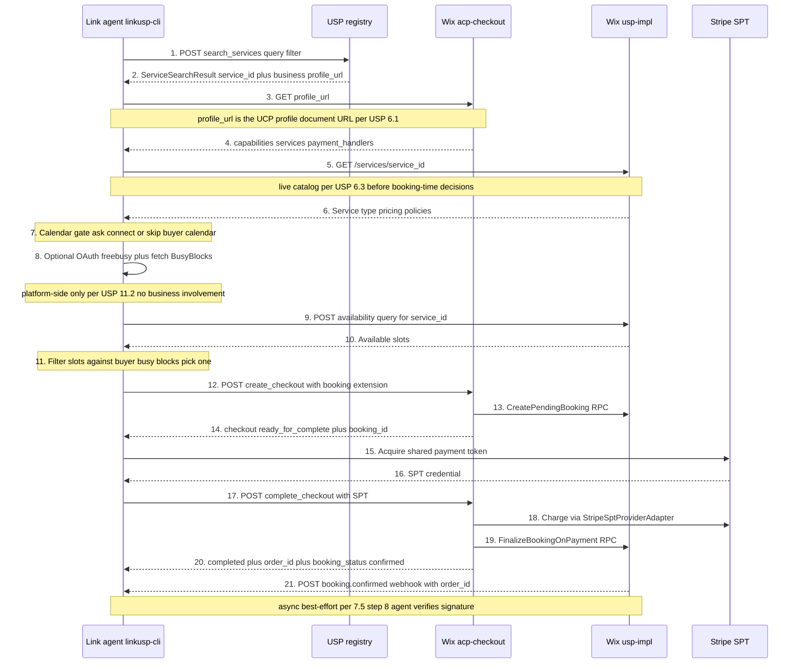
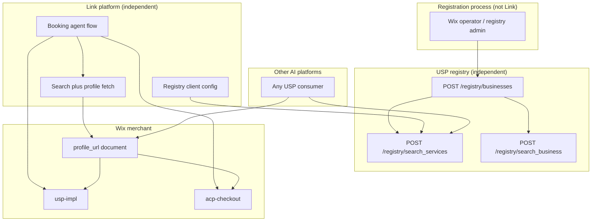
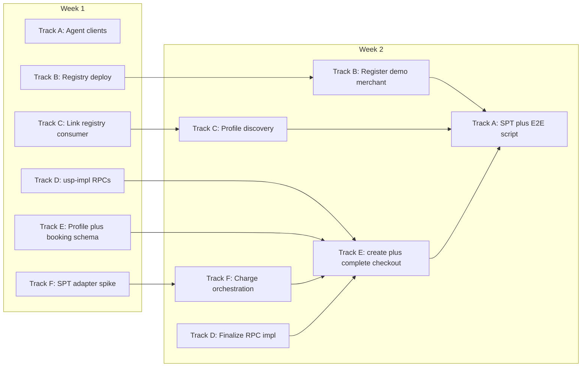

# USP + UCP + SPT Demo Implementation Plan

**Date:** 2026-06-10 (rev. spec-aligned)  
**Goal:** Deliver a **UCP-Native Mode** demo in **one 2-week sprint** where a Link agent discovers a Wix Bookings merchant **already listed in a USP registry**, consumes that merchant's `**profile_url`** per [USP §6](../specification.md#6-discovery-registry-optional), fetches the **UCP business profile** per [USP §7.2](../specification.md#72-profile-registration-in-well-knownucp) and [UCP Profile](https://ucp.dev/latest/specification/overview/), optionally **connects the buyer's calendar** and **filters availability slots** against personal busy times per [USP §11.2](../specification.md#112-buyer-calendar-freebusy-extension) (platform-side only; no business changes), runs the [USP §7.5](../specification.md#75-checkout-flow-and-atomicity-guarantee) paid flow (UCP `create_checkout` + `complete_checkout` with `dev.usp.services.paid_bookings` + Stripe SPT), receives `**booking.confirmed`** webhook with correlated `**order_id`** ([§7.5 step 8](../specification.md#75-checkout-flow-and-atomicity-guarantee), [§5.4.1](../specification.md#541-booking-webhooks)), and ends with `**status: completed`**, `**order_id`**, and `**booking.booking_status: confirmed**` — with **no Standalone Mode**, **no `checkout_systems` redirect**, and **no migration** from prior deployments.

**Normative references:** [USP `specification.md](../specification.md)` §6 (registry), §7 (UCP-Native), `[schemas/paid_bookings.json](../schemas/paid_bookings.json)`, `[schemas/registry.json](../schemas/registry.json)`; [UCP checkout](https://ucp.dev/latest/specification/checkout/), [UCP payment architecture](https://ucp.dev/latest/specification/overview/#payment-architecture), [Stripe UCP/SPT](https://docs.stripe.com/agentic-commerce/protocol).

**Assumptions:**

- Greenfield: nothing in production; no dual-publish, no Standalone profile, no legacy clients to support.
- **One developer per task**; unlimited developers; work proceeds in **parallel tracks** wherever dependencies allow.
- Demo scope excludes **holds**, **mixed cart**, and `**dev.ucp.shopping.order`**.
- **Link platform and USP registry are independent ecosystem components** (see [§2.1](#21-usp-ecosystem-link-platform-vs-registry)).
- **Central issue tracking:** All sprint work items are filed in [wix-private/universal-scheduling-protocol-spec](https://github.com/wix-private/universal-scheduling-protocol-spec) (label `v1` = in-scope demo; label `v > 1` = post-demo). Implementation may land in other repos per issue body.

**Repos:**


| Repo                                                     | Module                                | Track |
| -------------------------------------------------------- | ------------------------------------- | ----- |
| [linkusp-cli](https://github.com/yahalomran/linkusp-cli) | Link agent USP client                 | A     |
| `universal-scheduling-protocol`                          | USP registry (spec + reference impl)  | B     |
| Link platform                                            | Registry consumer + profile discovery | C     |
| `wix-vmr-repo`                                           | `usp-impl`                            | D     |
| `ecom`                                                   | `acp-checkout`                        | E, F  |


---

# Table of contents

- [1. Target Demo Flow](#1-target-demo-flow)
  - [Step-by-step flow](#step-by-step-flow)
- [2. Architecture](#2-architecture)
  - [2.1 USP ecosystem: Link platform vs registry](#21-usp-ecosystem-link-platform-vs-registry)
  - [2.2 Wix implementation architecture](#22-wix-implementation-architecture)
  - [2.3 Normative protocol alignment map](#23-normative-protocol-alignment-map)
    - [USP registry (§6)](#usp-registry-6)
    - [USP UCP-Native business profile (§7.2)](#usp-ucp-native-business-profile-72)
    - [USP + UCP paid booking flow (§7.5)](#usp--ucp-paid-booking-flow-75)
    - [UCP checkout binding (ucp.dev)](#ucp-checkout-binding-ucpdev)
    - [Inherited from UCP only (USP §7.3 — do not reimplement in Standalone layers)](#inherited-from-ucp-only-usp-73--do-not-reimplement-in-standalone-layers)
  - [2.4 What "`paid_bookings` extends `checkout`" means](#24-what-paid_bookings-extends-checkout-means)
    - [Profile declaration (what linkusp verifies)](#profile-declaration-what-linkusp-verifies)
    - [Protocol meaning (what the agent does after verification)](#protocol-meaning-what-the-agent-does-after-verification)
    - [Wix publisher obligation (Track E)](#wix-publisher-obligation-track-e)
- [3. Sprint Timeline (2 Weeks)](#3-sprint-timeline-2-weeks)
  - [3.1 Parallel workstreams](#31-parallel-workstreams)
  - [3.2 Calendar](#32-calendar)
- [4. Gap-to-Workstream Matrix](#4-gap-to-workstream-matrix)
- [5. Track A — Link Agent USP (`linkusp-cli`)](#5-track-a--link-agent-usp-linkusp-cli)
  - [GH-001: Link agent UCP-Native profile wire models](https://github.com/wix-private/universal-scheduling-protocol-spec/issues/60)
  - [GH-002: Link agent UCP checkout client](https://github.com/wix-private/universal-scheduling-protocol-spec/issues/61)
  - [GH-003: Link agent USP catalog and scheduling client](https://github.com/wix-private/universal-scheduling-protocol-spec/issues/62)
  - [GH-003b: Buyer calendar free/busy gate](https://github.com/wix-private/universal-scheduling-protocol-spec/issues/63)
  - [GH-004: Stripe SPT acquisition](https://github.com/wix-private/universal-scheduling-protocol-spec/issues/64)
  - [GH-005: Demo E2E command](https://github.com/wix-private/universal-scheduling-protocol-spec/issues/65)
  - [GH-058: Platform UCP profile and UCP-Agent negotiation](https://github.com/wix-private/universal-scheduling-protocol-spec/issues/95)
  - [GH-059: Complete checkout signals](https://github.com/wix-private/universal-scheduling-protocol-spec/issues/96)
  - [GH-060: Checkout totals and links validation](https://github.com/wix-private/universal-scheduling-protocol-spec/issues/97)
- [6. Track B — USP Registry](#6-track-b--usp-registry)
  - [GH-010 through GH-014](https://github.com/wix-private/universal-scheduling-protocol-spec/issues/66)
- [7. Track C — Link Platform (Registry Consumer)](#7-track-c--link-platform-registry-consumer)
  - [GH-020 through GH-024](https://github.com/wix-private/universal-scheduling-protocol-spec/issues/71)
  - [GH-057: Booking webhook receiver](https://github.com/wix-private/universal-scheduling-protocol-spec/issues/92)
  - [GH-064: UCP version negotiation](https://github.com/wix-private/universal-scheduling-protocol-spec/issues/101)
- [8. Track D — Wix Business USP (`usp-impl`)](#8-track-d--wix-business-usp-usp-impl)
  - [GH-030 through GH-033](https://github.com/wix-private/universal-scheduling-protocol-spec/issues/76)
  - [GH-056: booking.confirmed webhook](https://github.com/wix-private/universal-scheduling-protocol-spec/issues/91)
- [9. Track E — Core UCP + USP Extension (`acp-checkout`)](#9-track-e--core-ucp--usp-extension-acp-checkout)
  - [GH-040 through GH-046](https://github.com/wix-private/universal-scheduling-protocol-spec/issues/80)
  - [GH-061: Spec order.id vs order_id](https://github.com/wix-private/universal-scheduling-protocol-spec/issues/98)
  - [GH-063: Profile capability spec/schema](https://github.com/wix-private/universal-scheduling-protocol-spec/issues/100)
- [10. Track F — Payment with Stripe SPT](#10-track-f--payment-with-stripe-spt)
  - [GH-050 through GH-053](https://github.com/wix-private/universal-scheduling-protocol-spec/issues/87)
  - [GH-054 / GH-098 (out of scope)](https://github.com/wix-private/universal-scheduling-protocol-spec/issues/93)
- [11. Cross-Track Integration (Days 9-10)](#11-cross-track-integration-days-9-10)
- [12. Definition of Done](#12-definition-of-done)
- [GitHub issues](#github-issues)
- [Out of scope — future version](#out-of-scope--future-version)
  - [Merchant-direct catalog discovery](#merchant-direct-catalog-discovery)
  - [Holds](#holds)
  - [Mixed cart (product + service)](#mixed-cart-product--service)
  - `[dev.ucp.shopping.order` capability](#devucpshoppingorder-capability)
  - [Standalone Mode and redirect checkout](#standalone-mode-and-redirect-checkout)
  - [Registry search filters for business capabilities and payment readiness](#registry-search-filters-for-business-capabilities-and-payment-readiness)
  - [Conformance and polish (non-blocking for demo)](#conformance-and-polish-non-blocking-for-demo)
- [References](#references)

---

## 1. Target Demo Flow




## Detailed Steps

Field names in the following detailed steps description refer to  `[paid_bookings.json](../schemas/paid_bookings.json)` `BookingContext`, UCP checkout request fields from [USP §7.4](../specification.md#74-paid-bookings-extension-schema), and upstream schemas `[registry.json](../schemas/registry.json)`, `[catalog.json](../schemas/catalog.json)`, `[availability.json](../schemas/availability.json)`. **Registry snapshot fields are discovery hints only** unless marked authoritative; live catalog from step 6 is authoritative for checkout per [§6.3](../specification.md#63-service-search---post-registrysearch_services).

1. **Registry service search** (`Agent` → `Registry`): The Link agent calls
  `POST /registry/search_services` with at least one filter (e.g. `query` plus optional `location`/`verticals`/`categories`) per [USP §6.3](../specification.md#63-service-search---post-registrysearch_services).  
  **Why:** Cold-start discovery must not rely on a hardcoded merchant URL; the registry is the federated entry point that returns candidate services and enough business metadata to continue.  
   **Fields consumed (this request):** `USP_REGISTRY_URL` (agent config); search filters (`query`, `location`, `verticals`, `categories`, etc.) from  user intent.  
   **Fields obtained:** none (request only; response fields arrive in step 2).
2. **Search results** (`Registry` → `Agent`): The registry returns one or more `[ServiceSearchResult](../schemas/registry.json)` hits.
  **Why:** The agent needs a stable service identifier and the full profile document URL before it can evaluate capabilities or talk to the merchant. Note that filtering by `deployment_mode`, payment handlers, or other USP/UCP capabilities (e.g. a Stripe Link USP agent needs only services offered by business with UCP checkout setup and a Stripe account) should be a future USP registry search feature ([GH-055](https://github.com/wix-private/universal-scheduling-protocol-spec/issues/94)) but it is out of the scope for the demo.
   **Fields obtained → later use:**

  | Field obtained                             | Used in step(s)                                                                                 | Required for                                            |
  | ------------------------------------------ | ----------------------------------------------------------------------------------------------- | ------------------------------------------------------- |
  | `service_id`                               | 5 (path), 9 (`availability.query.service_id`), 12 (`booking.service_id`, `line_items[].item.id`) | Catalog fetch, availability, `create_checkout`          |
  | `business.profile_url`                     | 3 (`GET {profile_url}`)                                                                         | UCP profile fetch                                       |
  | `business.deployment_mode`                 | (discovery / [GH-055](https://github.com/wix-private/universal-scheduling-protocol-spec/issues/94) only; demo does not client-filter)                                          | Merchant mode validation when registry supports it      |
  | `business.name`                            | (display / logging only)                                                                        | Not sent on `create_checkout`                           |
  | `service_name`                             | (discovery ranking / display only)                                                              | Checkout title uses live `Service.name` from step 6     |
  | `pricing`                                  | (discovery hint only; **not** used on `create_checkout`)                                        | Superseded by step 6 live `Service.pricing`             |
  | `timezone`                                 | 9 (optional default on `availability.query.timezone`)                                           | Availability query; may also come from step 6 / profile |
  | `category`, `duration_minutes`, `location` | (discovery / filtering only)                                                                    | Not required on `create_checkout`                       |

3. **Fetch UCP business profile** (`Agent` → `UCP`): The agent issues `GET {profile_url}` using the **full profile document URL** from the registry hit (e.g. `https://{host}/.well-known/ucp`), not site origin plus an appended path.
  **Why:** Per [USP §6.1](../specification.md#61-business-registration---post-registrybusinesses) and [§7.2](../specification.md#72-profile-registration-in-well-knownucp), merchant capabilities, REST endpoints, and payment handlers are advertised in the UCP profile; the agent must load that document before any booking-time calls.
   **Fields consumed (this request):** `business.profile_url` from step 2.
   **Fields obtained:** none (request only; response fields arrive in step 4).
4. **Profile document** (`UCP` → `Agent`): `acp-checkout` serves the UCP profile with required capabilities (`dev.ucp.shopping.checkout`, `dev.usp.services.`*), `ucp.services` endpoint map, and `payment_handlers` (including Stripe SPT).
  **Why:** The agent validates that `paid_bookings` **extends** `checkout` per [§2.4](#24-what-paid_bookings-extends-checkout-means), resolves USP and UCP base URLs, and selects the correct payment handler before mutating checkout.
   **Fields obtained → later use:**

  | Field obtained                                                                                                                                                  | Used in step(s)                                            | Required for                                                                                                                        |
  | --------------------------------------------------------------------------------------------------------------------------------------------------------------- | ---------------------------------------------------------- | ----------------------------------------------------------------------------------------------------------------------------------- |
  | `capabilities` (`dev.ucp.shopping.checkout`, `dev.usp.services.paid_bookings` with `extends: dev.ucp.shopping.checkout`, `catalog`, `availability`, `bookings`) | 12 (precondition)                                          | Confirm UCP-Native paid path before `create_checkout`                                                                               |
  | `ucp.services["dev.ucp.shopping"]` (REST base URL)                                                                                                              | 12 (`POST create_checkout`), 17 (`POST complete_checkout`) | UCP checkout REST                                                                                                                   |
  | `ucp.services["dev.usp.services"]` (or catalog capability endpoint)                                                                                             | 5 (`GET /services/{id}`), 9 (`POST /availability/query`)  | USP catalog + availability                                                                                                          |
  | `payment_handlers` (e.g. Stripe SPT handler `id`, `config`, `available_instruments`)                                                                            | 15 (SPT acquisition); 14 (may repeat on checkout response) | Platform-side token acquisition per [UCP payment architecture](https://ucp.dev/latest/specification/overview/#payment-architecture) |
  | `business.currency` (when present on profile)                                                                                                                   | 12 (fallback for `currency` if not taken from step 6)      | Top-level checkout `currency`                                                                                                       |
  | `availability` capability config (e.g. `holds: false`)                                                                                                          | 12 (confirm demo path skips `hold_id`)                     | Hold-free demo scope                                                                                                                |

5. **Live catalog fetch** (`Agent` → `USP`): The agent calls `GET /services/{service_id}` on the merchant USP catalog endpoint resolved from the profile.
  **Why:** [USP §6.3](../specification.md#63-service-search---post-registrysearch_services) requires live catalog at booking time; the registry snapshot is non-authoritative for price, `service_type`, and policies used in checkout.
   **Fields consumed (this request):** `service_id` from step 2; USP base URL from step 4.
   **Fields obtained:** none (request only; response fields arrive in step 6).
6. **Service record** (`USP` → `Agent`): `usp-impl` returns the current `[Service](../schemas/catalog.json)`.
  **Why:** Availability queries and `create_checkout` must reflect server-side catalog state; the merchant re-validates price at create and returns `price_mismatch` if the agent sends a stale amount ([§7.4](../specification.md#74-paid-bookings-extension-schema)).
   **Fields obtained → later use:**

  | Field obtained                                         | Used in step(s)                                                      | Maps to on `create_checkout` (step 12)                                                                                      |
  | ------------------------------------------------------ | -------------------------------------------------------------------- | --------------------------------------------------------------------------------------------------------------------------- |
  | `id`                                                   | 9, 12                                                                | `booking.service_id`; `line_items[].item.id` (must match per [§7.4](../specification.md#74-paid-bookings-extension-schema)) |
  | `name`                                                 | 12                                                                   | `line_items[].item.title`                                                                                                   |
  | `type`                                                 | 12                                                                   | `booking.service_type` (required on `BookingContext`)                                                                       |
  | `pricing.amount`                                       | 12                                                                   | `line_items[].item.price` when `pricing.model` is `fixed`, `hourly`, or `per_person` (demo uses `fixed`)                    |
  | `pricing.currency`                                     | 12                                                                   | top-level `currency`                                                                                                        |
  | `pricing.model`                                        | 10, 12                                                               | If `variable`, step 10 `TimeSlot.pricing.amount` replaces catalog amount on `line_items[].item.price`                       |
  | `policies.confirmation_mode`                           | 12 (optional echo), 19-20 (behavior)                                 | May omit on request (business authoritative); demo expects `auto` so step 20 yields `booking.booking_status: confirmed`     |
  | `policies.requires_payment`, `policies.payment_timing` | 12 (precondition)                                                    | Validates paid-at-booking UCP path (`at_booking` for demo)                                                                  |
  | `resources[]` (`selectable`, `options`)                | 9 (optional `resource_id` filter), 12 (optional `booking.resources`) | Only when buyer selects a specific staff/room before query                                                                  |
  | `duration`                                             | (scheduling context; slot duration comes from step 10)               | Not copied directly to `booking.slot.duration`                                                                              |

7. **Buyer calendar gate** (`Agent` internal, platform-only): Before querying business availability, the agent asks the buyer whether to check their personal calendar for conflicts, then completes the calendar gate.
  **Why:** [USP §11.2](../specification.md#112-buyer-calendar-freebusy-extension) enables platform-side free/busy cross-referencing so buyers only see mutually free times; the business is not involved and never receives calendar data. Matches `linkusp flow calendar ask|connect|skip` hard gate and the ds-general USP subagent Scenario 2 Step 1 (`customer_calendar_connected` / `customer_calendar_skipped`).
   **Fields consumed (this request):** buyer consent (human gate); optional `GOOGLE_CALENDAR_CLIENT_ID` in demo mode for local OAuth.
   **Fields obtained → later use:**

  | Field obtained / state set              | Used in step(s) | Required for                                                                     |
  | --------------------------------------- | --------------- | -------------------------------------------------------------------------------- |
  | `calendar_gate_completed: true`         | 9               | Gate before `POST /availability/query` (`calendar_gate_not_completed` if absent) |
  | `calendar_state: connected`             | 8, 11           | Enables busy fetch + slot filter                                                 |
  | `calendar_state: skipped`               | 9-11            | Proceed without filter (`skip_calendar_filter=True` equivalent)                  |
  | OAuth access/refresh token (if connect) | 8               | Google Calendar FreeBusy API (`calendar.freebusy` scope only)                    |

   **Demo path:** `linkusp flow calendar ask` → user chooses → `calendar connect` (local Google OAuth; agent relays `auth_url`, does not open browser) or `calendar skip`. **Production path:** `link-cli calendar connect` via Link-hosted calendar service ([linkusp-cli DESIGN §3](https://github.com/yahalomran/linkusp-cli/blob/main/DESIGN.md#3-linkusp-as-google-calendar-client)).
8. **Fetch buyer busy blocks** (`Agent` → calendar provider, optional): When `calendar_state: connected`, the platform fetches opaque `[BusyBlock](../schemas/calendar_freebusy.json)` intervals for the availability time window.
  **Why:** §11.2.6 filtering requires `{start, end}` pairs only; no event titles, attendees, or locations. Overlap rule: `slot.start < block.end AND block.start < slot.end` (touching boundaries do not overlap).
   **Fields consumed (this request):** OAuth token from step 7; `start_date` / `end_date` aligned with step 9 availability window.
   **Fields obtained → later use:**

  | Field obtained                 | Used in step(s) | Required for                                                     |
  | ------------------------------ | --------------- | ---------------------------------------------------------------- |
  | `busy_blocks[]` `{start, end}` | 11              | Platform-side slot filter; optional UX summary of removed ranges |

9. **Availability query** (`Agent` → `USP`): The agent calls `POST /availability/query` for the chosen `service_id` and time window.
  **Why:** [USP §7.5](../specification.md#75-checkout-flow-and-atomicity-guarantee) step 2 requires confirming bookable slots before checkout; this selects a concrete slot for the `paid_bookings` extension. **No changes to the business request** when calendar is connected ([§11.2.6](../specification.md#1126-integration-with-availability-query)).
   **Fields consumed (this request):**

  | Field / request input       | Source step(s)              | Notes                                                                                          |
  | --------------------------- | --------------------------- | ---------------------------------------------------------------------------------------------- |
  | `availability.query.service_id` | 2, 6                    | Must equal live `Service.id` from step 6                                                       |
  | USP REST base URL           | 4                           | From `ucp.services["dev.usp.services"]` (or catalog capability endpoint)                      |
  | `timezone`                  | 2, 6, 4 (optional)          | Optional on `availability.query`; may default from registry hit, service, or profile           |
  | `resource_id`               | 6, 11 (optional)            | Only when step 6 `resources[].selectable` is true and buyer selected a resource before query    |
  | `start_date` / `end_date`   | Agent (buyer intent)        | RFC 3339 window; aligned with step 8 busy fetch when calendar connected                        |
  | `calendar_gate_completed`   | 7 (precondition)            | Platform gate only; **not** sent on `POST /availability/query`                               |

   **Fields obtained:** none (request only; response fields arrive in step 10).
10. **Available slots** (`USP` → `Agent`): `usp-impl` returns matching `[TimeSlot](../schemas/availability.json)` entries.
  **Why:** Checkout requires a schema-valid `SlotReference` tied to real capacity; without this response the agent cannot build a valid `booking` object on `create_checkout`.
   **Fields obtained → later use** (from business response, before platform filter):

  | Field obtained                                | Used in step(s)        | Maps to on `create_checkout` (step 12)                                                    |
  | --------------------------------------------- | ---------------------- | ----------------------------------------------------------------------------------------- |
  | `id`                                          | 12                     | `booking.slot.id`                                                                         |
  | `start`                                       | 12                     | `booking.slot.start`                                                                      |
  | `end`                                         | 12                     | `booking.slot.end`                                                                        |
  | `duration`                                    | 12                     | `booking.slot.duration` (ISO 8601, e.g. `PT60M`)                                          |
  | `resources[]` (`id`, `type`, `name`)          | 12 (optional)          | `booking.resources[]` when copying staff/room assignment from the slot                    |
  | `pricing.amount`, `pricing.currency`          | 12                     | `line_items[].item.price` and `currency` **only when** step 6 `pricing.model == variable` |
  | `state`, `capacity`, `location`, `service_id` | (validation / UX only) | Not sent on `SlotReference`; agent must pick `state: available` (or acceptable) slot      |

11. **Platform slot filter and selection** (`Agent` internal): When `calendar_state: connected`, the agent removes slots overlapping step 8 `busy_blocks` per §11.2.6, then the buyer picks one remaining slot (human gate; never auto-pick).
  **Why:** Presents only mutually free times; surfaces filtered-out ranges in agent UX so the buyer can adjust their calendar if needed (linkusp `calendar_filtered` + `slots_filtered` in flow JSON).
   **Fields obtained → later use:** selected slot fields from step 10 (post-filter) feed step 12 `booking.slot`.
12. **Create checkout** (`Agent` → `UCP`): The agent calls UCP `POST create_checkout` with the `dev.usp.services.paid_bookings` extension.
  **Why:** UCP-Native paid booking starts as a standard UCP checkout session extended for scheduling; this is [USP §7.5](../specification.md#75-checkout-flow-and-atomicity-guarantee) step 4.
   **Fields consumed (assembled into this request):**

  | Request field                                        | Source step(s)                                                      | Notes                                                                                                           |
  | ---------------------------------------------------- | ------------------------------------------------------------------- | --------------------------------------------------------------------------------------------------------------- |
  | `line_items[].id`                                    | Agent-generated                                                     | e.g. `li_1`                                                                                                     |
  | `line_items[].item.id`                               | 2, 6                                                                | Must equal `booking.service_id`                                                                                 |
  | `line_items[].item.title`                            | 6 (`Service.name`)                                                  |                                                                                                                 |
  | `line_items[].item.price`                            | 6 (`Service.pricing.amount`) or 10 (`TimeSlot.pricing` if variable) | Must match live catalog ([§7.4](../specification.md#74-paid-bookings-extension-schema))                         |
  | `line_items[].quantity`                              | Agent                                                               | Demo: `1`                                                                                                       |
  | `currency`                                           | 6 (`Service.pricing.currency`) or 4 (profile fallback)              |                                                                                                                 |
  | `buyer.email`, `buyer.first_name`, `buyer.last_name` | Link account (platform; not a numbered diagram step)                | Required for `ready_for_complete` ([§7.5 step 4](../specification.md#75-checkout-flow-and-atomicity-guarantee)) |
  | `booking.service_id`                                 | 2, 6                                                                | Required on `BookingContext`                                                                                    |
  | `booking.service_type`                               | 6 (`Service.type`)                                                  | Required on `BookingContext`; **not** on registry snapshot                                                      |
  | `booking.slot`                                       | 11 (selected slot, post calendar filter)                            | Required; all four `SlotReference` fields                                                                       |
  | `booking.resources`                                  | 11 (optional)                                                       | Omit when business auto-assigns                                                                                 |
  | `booking.party_size`                                 | Agent                                                               | Demo appointment: omit (default `1`)                                                                            |
  | `booking.confirmation_mode`                          | 6 (optional echo)                                                   | May omit; business uses `Service.policies.confirmation_mode`                                                    |
  | `booking.notes`, `booking.recipient`                 | Agent / buyer (optional)                                            | Out of demo scope                                                                                               |
  | `booking.hold_id`                                    | —                                                                   | **Not used** (demo `holds: false`)                                                                              |
  | `Idempotency-Key` (header)                           | Agent-generated                                                     | [§7.3](../specification.md#73-inherited-infrastructure) / UCP idempotency                                       |
  | UCP REST base URL                                    | 4                                                                   | Target for this request                                                                                         |

   **Fields obtained:** none synchronously from merchant on this sub-step (response in step 14).
13. **Pending booking** (`UCP` → `USP`): `acp-checkout` invokes internal `CreatePendingBooking` gRPC on `usp-impl`, reserving the slot in `pending` state.
  **Why:** Scheduling state must be created atomically with the checkout session so payment completion can confirm the booking without a separate agent-side `POST /bookings`.
    **Fields consumed (internal):** `booking.service_id`, `booking.service_type`, `booking.slot`, optional `booking.resources`, `buyer` from step 12 request; line item price for server-side catalog validation.
    **Fields obtained (agent-visible):** deferred to step 14 response.
14. **Checkout ready** (`UCP` → `Agent`): UCP returns checkout `status: ready_for_complete` plus booking and payment metadata.
  **Why:** The agent needs the checkout session handle, correlated booking id, and payment handler binding before acquiring SPT and calling `complete_checkout`.
    **Fields obtained → later use:**

  | Field obtained                    | Used in step(s)      | Required for                                                                                                              |
  | --------------------------------- | -------------------- | ------------------------------------------------------------------------------------------------------------------------- |
  | `id` (checkout session id)        | 17                   | `complete_checkout` path/body reference                                                                                   |
  | `status: ready_for_complete`      | 15-17 (gate)         | Proceed to SPT + complete without `update_checkout`                                                                       |
  | `booking.booking_id`              | 17, 20, 21           | Correlation; webhook match                                                                                                |
  | `booking.booking_status: pending` | 20 (before complete) | Expected post-create state                                                                                                |
  | `payment_handlers`                | 15                   | SPT acquisition when not already cached from step 4                                                                       |
  | `booking.actions[]` (if present)  | —                    | **Demo avoids:** would require [§7.5 step 5](../specification.md#75-checkout-flow-and-atomicity-guarantee) before payment |

15. **Acquire SPT** (`Agent` → `Stripe`): The Link platform obtains a Shared Payment Token via Stripe's UCP/SPT flow.
  **Why:** UCP-Native completion uses platform-acquired SPT on `complete_checkout`; the agent does not collect card data directly.
    **Fields consumed (this request):** `payment_handlers` config from step 4 and/or step 14; checkout context from step 14.
    **Fields obtained:** none (request only; credential in step 16).
16. **SPT credential** (`Stripe` → `Agent`): Stripe returns the SPT credential bound to the checkout context.
  **Why:** `complete_checkout` must present a valid, scoped payment token for `StripeSptProviderAdapter`.
    **Fields obtained → later use:**

  | Field obtained                                                 | Used in step(s) | Required for                                           |
  | -------------------------------------------------------------- | --------------- | ------------------------------------------------------ |
  | SPT `credential.token` (instrument shape per handler `schema`) | 17              | `complete_checkout` `payment.instruments[].credential` |

17. **Complete checkout** (`Agent` → `UCP`): The agent calls UCP `POST complete_checkout` with the SPT and checkout session reference.
  **Why:** Atomic payment-plus-confirmation gate per [USP §7.5](../specification.md#75-checkout-flow-and-atomicity-guarantee) steps 6-7.
    **Fields consumed (this request):**

  | Field / request input              | Source step(s)     | Notes                                                                                    |
  | ---------------------------------- | ------------------ | ---------------------------------------------------------------------------------------- |
  | Checkout session `id`              | 14                 | Path/body reference for `complete_checkout`                                              |
  | `payment.instruments[]` + SPT      | 15-16              | `handler_id` from step 14 `payment_handlers`; `credential.token` from Stripe           |
  | UCP REST base URL                  | 4                  | From `ucp.services["dev.ucp.shopping"]`                                                  |
  | `Idempotency-Key` (header)         | Agent-generated    | UCP idempotency per [§7.3](../specification.md#73-inherited-infrastructure)              |
  | `signals` (e.g. `dev.ucp.buyer_ip`) | Agent environment | Optional on UCP schema; send when available ([GH-059](https://github.com/wix-private/universal-scheduling-protocol-spec/issues/96)) |

    **Fields obtained:** none synchronously on agent leg (response in step 20).
18. **Charge payment** (`UCP` → `Stripe`): `acp-checkout` charges via `StripeSptProviderAdapter`.
  **Why:** Funds must be captured (or authorized per handler config) before the merchant commits the booking.
    **Fields consumed (internal):** SPT from step 16; handler id from step 4 / 14; checkout + booking state from steps 12-14.
    **Fields obtained (agent-visible):** deferred to step 20.
19. **Finalize booking** (`UCP` → `USP`): On successful charge, `acp-checkout` calls `FinalizeBookingOnPayment` gRPC.
  **Why:** Scheduling confirmation must follow payment success; uses `confirmation_mode` from step 6 policies (`auto` in demo).
    **Fields consumed (internal):** `booking.booking_id` from step 14; `Service.policies.confirmation_mode` from step 6 (authoritative).
    **Fields obtained (agent-visible):** deferred to step 20.
20. **Checkout completed** (`UCP` → `Agent`): UCP returns terminal checkout state.
  **Why:** Synchronous success signal for demo assertions per [USP §7.5](../specification.md#75-checkout-flow-and-atomicity-guarantee) atomicity guarantees.
    **Fields obtained → later use:**

  | Field obtained                      | Used in step(s)          | Required for                                                                                    |
  | ----------------------------------- | ------------------------ | ----------------------------------------------------------------------------------------------- |
  | `status: completed`                 | Demo assertions          | End-to-end success                                                                              |
  | `order.id` (UCP) / `order_id` (USP) | 21 (webhook correlation) | UCP native field is `order.id`; USP/webhook use `order_id` alias per [GH-061](https://github.com/wix-private/universal-scheduling-protocol-spec/issues/98) |
  | `totals`, `links`                   | Agent UX (optional)      | UCP-required on checkout object; validate present per [GH-060](https://github.com/wix-private/universal-scheduling-protocol-spec/issues/97) |
  | `booking.booking_status: confirmed` | Demo assertions          | When step 6 `confirmation_mode` is `auto`                                                     |
  | `booking.booking_id`                | 21                       | Must match webhook `booking_id`                                                                 |

21. **Booking webhook** (`USP` → `Agent`): `usp-impl` asynchronously `POST`s `booking.confirmed`.
  **Why:** [USP §7.5 step 8](../specification.md#75-checkout-flow-and-atomicity-guarantee) and [§5.4.1](../specification.md#541-booking-webhooks) durable notification; signature verified per [§10.1.1](../specification.md#1011-webhook-security).
    **Fields obtained → later use:**

  | Field obtained            | Used in step(s)    | Required for                                                      |
  | ------------------------- | ------------------ | ----------------------------------------------------------------- |
  | `booking_id`              | Demo assertions    | Must equal step 14 / 20 `booking.booking_id`                      |
  | `order_id`                | Demo assertions    | Must equal step 20 `order_id`                                     |
  | Webhook signature headers | Agent verification | [§10.1.1](../specification.md#1011-webhook-security) authenticity |


## Why are the last two steps **BOTH** needed?

### When the synchronous response is not enough

The clearest normative example is `**confirmation_mode: manual` with paid-at-booking**.

After `complete_checkout` succeeds, step 20 returns something like:

- `checkout.status: completed` (payment succeeded)
- `booking.booking_status: pending` (not confirmed yet)

The spec is explicit that manual mode keeps the booking pending even after payment:

```3751:3753:specification.md
1. When the checkout reaches **`completed`**: `booking_status` becomes `confirmed`
   when `confirmation_mode` is `auto`, or remains `pending` awaiting business
   approval when `confirmation_mode` is `manual`.
```

The salon owner approves hours later via `POST /bookings/{booking_id}/confirm`. There is no second `complete_checkout` call. The platform learns the booking is actually confirmed from:

- `booking.confirmed` webhook (step 21), or
- polling `GET /bookings/{booking_id}`

The sync checkout response told you "paid," not "appointment confirmed."

**Other concrete cases:**


| Scenario                                                                     | Why step 20 is insufficient                                                                                                                                                                                                                  |
| ---------------------------------------------------------------------------- | -------------------------------------------------------------------------------------------------------------------------------------------------------------------------------------------------------------------------------------------- |
| **Agent loses the HTTP response** (timeout, app killed, mobile network drop) | Server may have charged and finalized; the client never got the response body. Webhook or `get_checkout` is how the platform recovers.                                                                                                       |
| **3DS / `continue_url` escalation**                                          | First `complete_checkout` can return non-terminal state (`requires_escalation`, `continue_url`). You must poll `get_checkout` after the buyer finishes the bank step; the initial response is not a final outcome.                           |
| **Business cancels or reschedules later**                                    | No checkout API is involved. Only USP webhooks (`booking.canceled`, `booking.rescheduled`) notify the platform.                                                                                                                              |
| **Different backend consumer**                                               | Step 20 goes to whoever called `complete_checkout` (the agent session). Step 21 goes to the platform's registered `webhook_url`, which may be a separate service (CRM, notifications, ledger) that was never part of that HTTP conversation. |


The spec's own guidance: platforms **SHOULD** treat `get_checkout` or `GET /bookings/{booking_id}` as source of truth, and **not rely solely on webhooks**. That implies all three channels (sync response, webhook, poll) can matter in different situations.

---

### What if the webhook arrives before the sync response?

**That can happen, and nothing in the spec forbids it.**

Step 21 is async and outside the `complete_checkout` transaction:

```3808:3812:specification.md
   Webhook delivery is best-effort and asynchronous; it is **not** part of the
   atomic `complete_checkout` transaction. Platforms **SHOULD** use
   `[get_checkout](https://ucp.dev/latest/specification/checkout/#get-checkout)`
   or `GET /bookings/{booking_id}` as the source of truth rather than relying
   solely on webhooks.
```

In the Wix architecture, `usp-impl` can fire the webhook right after `FinalizeBookingOnPayment` (step 19) while `acp-checkout` is still finishing the UCP HTTP response (step 20). If the webhook endpoint is fast and the checkout response path is slow (gRPC chain, proxies), step 21 can win the race.

**What should the platform do?**

Treat both as correlating signals, not as a strict sequence:

1. **Webhook first:** Process `booking.confirmed` idempotently (dedupe on `event_id` per §9.2.3). The payload already carries `booking_id` and `order_id`, so you do not need step 20 to arrive first. The agent already had `booking_id` from step 14 (`create_checkout`).
2. **Response arrives later:** Reconcile: same `booking_id`, same `order_id`, same terminal state. This should be a no-op merge, not a state conflict.
3. **Demo E2E ([GH-005](https://github.com/wix-private/universal-scheduling-protocol-spec/issues/65)):** The test asserts both step 20 fields and step 21 correlation. `wait_for_booking_confirmed(booking_id, order_id)` can return before `complete_checkout` returns to the caller. That is fine as long as both eventually agree.

**What the spec does *not* guarantee:**

- Webhook-before-response ordering (or the reverse) is not specified.
- §9.2.3 only guarantees **causal order among events for the same booking** (e.g. `booking.confirmed` before `booking.canceled`), not ordering relative to the checkout HTTP response.

**Practical implication:** A well-built platform handles either order. If the webhook says confirmed but the HTTP call is still in flight, trust the webhook for booking state (after signature verification) and treat the late response as confirmation. If the response returns but the webhook is slow or never arrives, do not block the user: you already have the sync result, and you can poll `get_checkout` / `GET /bookings` as backup. The dangerous pattern is requiring webhook-before-response or response-before-webhook as a hard gate; the safe pattern is idempotent merge on `(booking_id, order_id)`.

## Demo success criteria (day 10)

- [ ] Link agent completes the flow above against one **registry-listed** Wix demo merchant end-to-end.
- [ ] Link discovers the service and merchant via `**POST /registry/search_services` only** (no hardcoded merchant URL in agent config; no `search_business` in demo path); then `**GET /services/{service_id}`** for live catalog per [§6.3](../specification.md#63-service-search---post-registrysearch_services) before availability and checkout.
- [ ] **Buyer calendar gate** completes before availability (`calendar connect` or `calendar skip` per [§11.2](../specification.md#112-buyer-calendar-freebusy-extension)); when connected, slots are filtered platform-side against opaque busy blocks and conflicting times are not offered.
- [ ] Service search uses at least one filter per [USP §6.3](../specification.md#63-service-search---post-registrysearch_services) (e.g. `query` plus optional `verticals`/`categories`); no client-side post-filter by `deployment_mode` or payment handlers in the demo ([GH-055](https://github.com/wix-private/universal-scheduling-protocol-spec/issues/94) is the correct solution when agents need those filters).
- [ ] Link fetches business profile via `GET {profile_url}` where `profile_url` is the **full profile document URL** (e.g. `https://{host}/.well-known/ucp`), not site origin + appended path.
- [ ] UCP-Native profile includes required capabilities per [USP §7.2](../specification.md#72-profile-registration-in-well-knownucp); `dev.usp.services.paid_bookings` declares `"extends": "dev.ucp.shopping.checkout"` ([§2.4](#24-what-paid_bookings-extends-checkout-means)); no `checkout_systems` field ([USP §7.1](../specification.md#71-overview-and-when-to-use)).
- [ ] Payment uses UCP `complete_checkout` with platform-acquired SPT per [UCP payment handlers](https://ucp.dev/latest/specification/overview/#payment-architecture) (not Standalone `confirm-payment`).
- [ ] Atomic completion per [USP §7.5](../specification.md#75-checkout-flow-and-atomicity-guarantee): `booking.booking_status: confirmed` when `confirmation_mode` is `auto` and checkout `status: completed`.
- [ ] `**booking.confirmed` webhook** received with `booking_id` and `order_id` matching the completed checkout ([§5.4.1](../specification.md#541-booking-webhooks), `[schemas/webhook_event.json](../schemas/webhook_event.json)`); signature verified per [§10.1.1](../specification.md#1011-webhook-security).

---

## 2. Architecture

### 2.1 USP ecosystem: Link platform vs registry

The **USP registry** and the **Link platform** are separate components. Either can be replaced without coupling to the other.


| Component                     | Role                                                                                                   | Owns registration?                                               | Demo repo                       |
| ----------------------------- | ------------------------------------------------------------------------------------------------------ | ---------------------------------------------------------------- | ------------------------------- |
| **USP registry**              | Federated directory; `POST /registry/businesses`, search APIs; returns `profile_url` per entry         | **Yes** — business registration is a registry-side process       | `universal-scheduling-protocol` |
| **Link platform** (`linkusp`) | One USP-enabled AI platform; cold-start discovery via **any** configured registry; profile consumption | **No** — Link never calls `POST /registry/businesses`            | `linkusp-cli` + Link services   |
| **Other AI platforms**        | Same consumer role as Link; may use the same or a different registry                                   | **No**                                                           | Out of demo scope               |
| **Wix business**              | Publishes `/.well-known/ucp`; operates scheduling + checkout                                           | N/A (business is the subject of registration, not the registrar) | `usp-impl`, `acp-checkout`      |


**Registration (out of Link scope):** Per [USP §6.1](../specification.md#61-business-registration---post-registrybusinesses), a registrar (registry operator, business SaaS, or partner — **not** a consumer platform) calls `POST /registry/businesses` with a `[RegistrationRequest](../schemas/registry.json)` body including:

- `profile_url` — **full URL of the profile document** (for UCP-Native: `https://{host}/.well-known/ucp`)
- `deployment_mode: "ucp_native"`
- `name`, `verticals`, `categories`, `timezone`, and `location` when required

The registry **MUST** validate that `GET profile_url` returns a valid UCP profile ([§6.1](../specification.md#61-business-registration---post-registrybusinesses)). Authoritative business capabilities live in that profile, not in the registration payload. Link is not involved in registration.

**Discovery (Link / any platform scope):** Per [USP §6.3](../specification.md#63-service-search---post-registrysearch_services) and [§6.7](../specification.md#67-registry-governance), once registered:

1. `**POST /registry/search_services`** with at least one search filter (demo: `query` plus optional `verticals`/`categories`). Demo does **not** call `search_business`.
2. Select a `[ServiceSearchResult](../schemas/registry.json)`; read `service_id` and `business.profile_url` (registry pricing is a discovery hint only; checkout uses live catalog).
3. `GET profile_url` — fetch UCP business profile ([USP §7.2](../specification.md#72-profile-registration-in-well-knownucp); discovery inherited from UCP per [§7.3](../specification.md#73-inherited-infrastructure)).
4. Match required capabilities and versions; verify `paid_bookings` **extends** `checkout` per [§2.4](#24-what-paid_bookings-extends-checkout-means) (both capabilities present; `extends` field equals `dev.ucp.shopping.checkout`).
5. Read `payment_handlers` from profile (UCP); there is **no** `checkout_systems` in UCP-Native mode.
6. Resolve `dev.usp.services` and `dev.ucp.shopping` REST endpoints from `ucp.services`.
7. `**GET /services/{service_id}`** on the merchant USP catalog endpoint ([§3.12.3](../specification.md#3123-get-service---get-servicesservice_id)) — live catalog for booking-time decisions per [§6.3](../specification.md#63-service-search---post-registrysearch_services) (registry hit is a non-authoritative snapshot).
8. **Buyer calendar gate** (platform-only, [§11.2](../specification.md#112-buyer-calendar-freebusy-extension)): ask buyer to connect personal calendar for conflict checking or skip; hard gate before availability (`linkusp flow calendar ask|connect|skip`; ds-general USP subagent Scenario 2 Step 1).
9. Use the live `Service` object (`type` → `booking.service_type`, `pricing`, `policies`) plus registry `service_id` for availability and checkout (`create_checkout` re-validates catalog price server-side).
10. Perform UCP auth, consent, and identity linking per [§7.3](../specification.md#73-inherited-infrastructure) before mutating checkout.




### 2.2 Wix implementation architecture

**Orchestrator:** `acp-checkout` (`UcpHttpAdapter`) owns UCP profile, checkout lifecycle, and SPT payment.  
**Scheduling adapter:** `usp-impl` owns catalog, availability, and booking lifecycle via **internal gRPC RPCs** called by `acp-checkout`.

```
Link Agent (consumer only)
    |
    +-- Configured USP registry URL --> search_services (demo path only)
    |       |
    |       +-- ServiceSearchResult: service_id + business.profile_url
    |
    +-- GET profile_url ... UCP business profile (full URL from registry)
    |
    +-- GET /services/{service_id} ... usp-impl (REST, live catalog per §6.3)
    |
    +-- [platform] calendar gate + free/busy filter (§11.2; no business call)
    |
    +-- POST /usp/v1/availability/query ... usp-impl (REST, from profile)
    |
    +-- POST /ucp/{site_id}/checkout-sessions ... acp-checkout
    |       +-- CreatePendingBooking -----> usp-impl (gRPC)
    |       +-- FinalizeBookingOnPayment --> usp-impl (gRPC)
```

Profile advertises `holds: false` on availability (holds out of demo scope).

### 2.3 Normative protocol alignment map

This table is the conformance contract for the demo. Implementation tasks **MUST** satisfy these normative requirements.

#### USP registry ([§6](../specification.md#6-discovery-registry-optional))


| Requirement                                                              | Spec                        | Plan enforcement                                                               |
| ------------------------------------------------------------------------ | --------------------------- | ------------------------------------------------------------------------------ |
| Registry optional; cold-start only                                       | §6 intro                    | Demo uses registry; direct `profile_url` also valid but not used               |
| `profile_url` is full profile document URL                               | §6.1, `RegistrationRequest` | [GH-012](https://github.com/wix-private/universal-scheduling-protocol-spec/issues/68), [GH-013](https://github.com/wix-private/universal-scheduling-protocol-spec/issues/69), [GH-021](https://github.com/wix-private/universal-scheduling-protocol-spec/issues/72), [GH-022](https://github.com/wix-private/universal-scheduling-protocol-spec/issues/73)                                                 |
| `deployment_mode: ucp_native` on register                                | §6.1                        | [GH-013](https://github.com/wix-private/universal-scheduling-protocol-spec/issues/69)                                                                         |
| Demo discovery via service search only                                   | §6.3                        | [GH-021](https://github.com/wix-private/universal-scheduling-protocol-spec/issues/72), [GH-005](https://github.com/wix-private/universal-scheduling-protocol-spec/issues/65), [GH-024](https://github.com/wix-private/universal-scheduling-protocol-spec/issues/75)                                                         |
| `deployment_mode` on service search hits (`RegistryBusinessRef`)         | §6.3 response               | [GH-021](https://github.com/wix-private/universal-scheduling-protocol-spec/issues/72) returns metadata; [GH-055](https://github.com/wix-private/universal-scheduling-protocol-spec/issues/94) registry request filters when needed           |
| Registry validates reachable profile before accept                       | §6.1 MUST                   | [GH-012](https://github.com/wix-private/universal-scheduling-protocol-spec/issues/68)                                                                         |
| Service search requires ≥1 filter                                        | §6.3 MUST                   | [GH-011](https://github.com/wix-private/universal-scheduling-protocol-spec/issues/67), [GH-021](https://github.com/wix-private/universal-scheduling-protocol-spec/issues/72)                                                                 |
| Fetch live catalog at booking time (registry snapshot non-authoritative) | §6.3 MUST                   | [GH-003](https://github.com/wix-private/universal-scheduling-protocol-spec/issues/62) `GET /services/{service_id}` after profile                              |
| Platform calendar free/busy filter before slot selection                 | §11.2                       | [GH-003b](https://github.com/wix-private/universal-scheduling-protocol-spec/issues/63) |
| Registry `usp` envelope describes **registry**, not business             | §6.1                        | [GH-010](https://github.com/wix-private/universal-scheduling-protocol-spec/issues/66) implementers note                                                       |
| Federated registries; business may register with multiple                | §6.7                        | Link uses configurable `USP_REGISTRY_URL` ([GH-020](https://github.com/wix-private/universal-scheduling-protocol-spec/issues/71))                             |
| Platforms search only; never register                                    | §6.2–6.3 (consumer ops)     | Track C; no `POST /registry/businesses` in Link                                |


#### USP UCP-Native business profile ([§7.2](../specification.md#72-profile-registration-in-well-knownucp))


| Requirement                                                                              | Spec                                                              | Plan enforcement        |
| ---------------------------------------------------------------------------------------- | ----------------------------------------------------------------- | ----------------------- |
| Single `/.well-known/ucp`; no `/.well-known/usp`                                         | §7.1                                                              | [GH-040](https://github.com/wix-private/universal-scheduling-protocol-spec/issues/80); greenfield demo |
| No `checkout_systems` in profile                                                         | §7.2, §7.1                                                        | [GH-040](https://github.com/wix-private/universal-scheduling-protocol-spec/issues/80), [GH-022](https://github.com/wix-private/universal-scheduling-protocol-spec/issues/73)          |
| `dev.usp.services` service entry with REST endpoint                                      | §7.2                                                              | [GH-040](https://github.com/wix-private/universal-scheduling-protocol-spec/issues/80)                  |
| Capabilities: `catalog`, `availability`, `bookings`, `paid_bookings`                     | §7.2                                                              | [GH-040](https://github.com/wix-private/universal-scheduling-protocol-spec/issues/80)                  |
| `paid_bookings` extends `dev.ucp.shopping.checkout` (profile `extends` field + protocol) | §7.2, §7.4, [§2.4](#24-what-paid_bookings-extends-checkout-means) | [GH-022](https://github.com/wix-private/universal-scheduling-protocol-spec/issues/73), [GH-040](https://github.com/wix-private/universal-scheduling-protocol-spec/issues/80), [GH-041](https://github.com/wix-private/universal-scheduling-protocol-spec/issues/81)  |
| `dev.ucp.shopping.checkout` capability present                                           | §7.2                                                              | [GH-040](https://github.com/wix-private/universal-scheduling-protocol-spec/issues/80), [GH-022](https://github.com/wix-private/universal-scheduling-protocol-spec/issues/73)          |
| `availability` may declare `holds: false`                                                | §4, demo scope                                                    | [GH-040](https://github.com/wix-private/universal-scheduling-protocol-spec/issues/80)                  |


#### USP + UCP paid booking flow ([§7.5](../specification.md#75-checkout-flow-and-atomicity-guarantee))


| Step | Normative action                                           | Plan task                                                                                                                                                                                                                                                                        |
| ---- | ---------------------------------------------------------- | -------------------------------------------------------------------------------------------------------------------------------------------------------------------------------------------------------------------------------------------------------------------------------- |
| 1    | `POST /services/list`                                      | Out of scope — demo uses registry `search_services` for cold-start, then `GET /services/{service_id}` for live catalog ([§6.3](../specification.md#63-service-search---post-registrysearch_services); [merchant-direct list](#merchant-direct-catalog-discovery) remains future) |
| 1b   | `GET /services/{service_id}`                               | [GH-003](https://github.com/wix-private/universal-scheduling-protocol-spec/issues/62) — booking-time catalog hydration per [§3.12.3](../specification.md#3123-get-service---get-servicesservice_id)                                                                                                                                                             |
| 1c   | Buyer calendar gate + platform free/busy filter            | [GH-003b](https://github.com/wix-private/universal-scheduling-protocol-spec/issues/63) — [§11.2](../specification.md#112-buyer-calendar-freebusy-extension); no change to `POST /availability/query`                                                                                     |
| 2    | `POST /availability/query`                                 | [GH-003](https://github.com/wix-private/universal-scheduling-protocol-spec/issues/62), [GH-021](https://github.com/wix-private/universal-scheduling-protocol-spec/issues/72)                                                                                                                                                                                                                                                                   |
| 3    | Hold slot (if `holds: true`)                               | Out of scope                                                                                                                                                                                                                                                                     |
| 4    | UCP `create_checkout` + `booking`; **no** `POST /bookings` | [GH-002](https://github.com/wix-private/universal-scheduling-protocol-spec/issues/61), [GH-042](https://github.com/wix-private/universal-scheduling-protocol-spec/issues/82)                                                                                                                                                                                                                                                                   |
| 4a   | Return `ready_for_complete` when complete                  | [GH-042](https://github.com/wix-private/universal-scheduling-protocol-spec/issues/82)                                                                                                                                                                                                                                                                           |
| 4b   | `price_mismatch` recoverable message                       | [GH-042](https://github.com/wix-private/universal-scheduling-protocol-spec/issues/82)                                                                                                                                                                                                                                                                           |
| 5    | Non-payment `booking.actions` before payment               | [GH-043](https://github.com/wix-private/universal-scheduling-protocol-spec/issues/83) (`actions_pending`)                                                                                                                                                                                                                                                       |
| 6    | Acquire payment token from `payment_handlers`              | [GH-004](https://github.com/wix-private/universal-scheduling-protocol-spec/issues/64), [GH-052](https://github.com/wix-private/universal-scheduling-protocol-spec/issues/89)                                                                                                                                                                                                                                                                   |
| 7    | UCP `complete_checkout`; atomic payment + booking          | [GH-044](https://github.com/wix-private/universal-scheduling-protocol-spec/issues/84), [GH-032](https://github.com/wix-private/universal-scheduling-protocol-spec/issues/78), [GH-053](https://github.com/wix-private/universal-scheduling-protocol-spec/issues/90)                                                                                                                                                                                                                                                           |
| 7a   | `booking_status` derivation from checkout `status`         | [GH-043](https://github.com/wix-private/universal-scheduling-protocol-spec/issues/83)                                                                                                                                                                                                                                                                           |
| 7b   | On payment failure: booking stays `pending`                | [GH-044](https://github.com/wix-private/universal-scheduling-protocol-spec/issues/84), [GH-053](https://github.com/wix-private/universal-scheduling-protocol-spec/issues/90)                                                                                                                                                                                                                                                                   |
| 8    | Webhook `booking.confirmed` with `order_id`                | [§7.5](../specification.md#75-checkout-flow-and-atomicity-guarantee) step 8                                                                                                                                                                                                      |


#### UCP checkout binding ([ucp.dev](https://ucp.dev/latest/specification/checkout/))


| Requirement                                                                                      | UCP spec                                | Plan enforcement              |
| ------------------------------------------------------------------------------------------------ | --------------------------------------- | ----------------------------- |
| Checkout lifecycle: `incomplete`, `ready_for_complete`, `completed`, …                           | UCP status values                       | [GH-043](https://github.com/wix-private/universal-scheduling-protocol-spec/issues/83), [GH-042](https://github.com/wix-private/universal-scheduling-protocol-spec/issues/82)                |
| `create_checkout` / `get_checkout` / `update_checkout` / `complete_checkout` / `cancel_checkout` | UCP REST                                | [GH-002](https://github.com/wix-private/universal-scheduling-protocol-spec/issues/61), Wix `UcpHttpAdapter`  |
| `Idempotency-Key` on create (and complete)                                                       | UCP idempotency, USP §7.3               | [GH-046](https://github.com/wix-private/universal-scheduling-protocol-spec/issues/86), existing create guard |
| `payment.instruments[]` + `credential` on `complete_checkout`                                    | UCP complete checkout                   | [GH-002](https://github.com/wix-private/universal-scheduling-protocol-spec/issues/61), [GH-004](https://github.com/wix-private/universal-scheduling-protocol-spec/issues/64)                |
| `payment_handlers` on profile and checkout response                                              | UCP payment architecture                | [GH-052](https://github.com/wix-private/universal-scheduling-protocol-spec/issues/89), [GH-022](https://github.com/wix-private/universal-scheduling-protocol-spec/issues/73)                |
| Extension field `booking` on checkout object                                                     | USP `paid_bookings.json` ⊂ UCP checkout | [GH-041](https://github.com/wix-private/universal-scheduling-protocol-spec/issues/81)                        |
| Line item `item.price` in minor units; MUST match catalog                                        | USP §7.4                                | [GH-042](https://github.com/wix-private/universal-scheduling-protocol-spec/issues/82)                        |
| `continue_url` + `get_checkout` poll on 3DS / `complete_in_progress`                             | UCP + USP §7.5                          | [GH-098](https://github.com/wix-private/universal-scheduling-protocol-spec/issues/102) (out of demo scope) |
| `UCP-Agent` header + platform profile on every UCP request                                         | UCP negotiation                         | [GH-058](https://github.com/wix-private/universal-scheduling-protocol-spec/issues/95)        |
| `signals` on `complete_checkout` (e.g. `dev.ucp.buyer_ip`)                                       | UCP checkout + payment                  | [GH-059](https://github.com/wix-private/universal-scheduling-protocol-spec/issues/96)                             |
| Checkout response includes `totals` and `links`                                                  | UCP checkout schema                     | [GH-060](https://github.com/wix-private/universal-scheduling-protocol-spec/issues/97)                  |
| `order.id` (UCP) mapped to USP `order_id` / webhook correlation                                  | UCP complete checkout + USP §5.4.1      | [GH-061](https://github.com/wix-private/universal-scheduling-protocol-spec/issues/98)                      |
| `payment_handlers` reverse-domain arrays + `available_instruments` resolution                      | UCP payment architecture                | [GH-062](https://github.com/wix-private/universal-scheduling-protocol-spec/issues/99), [GH-052](https://github.com/wix-private/universal-scheduling-protocol-spec/issues/89) |
| Profile capabilities declare `spec` + `schema` URLs                                                | UCP profile                             | [GH-063](https://github.com/wix-private/universal-scheduling-protocol-spec/issues/100), [GH-040](https://github.com/wix-private/universal-scheduling-protocol-spec/issues/80) |
| Protocol + capability version intersection (not fixed date literals)                               | UCP versioning                          | [GH-064](https://github.com/wix-private/universal-scheduling-protocol-spec/issues/101)       |
| Error `messages[]` with severity (recoverable, error)                                            | UCP error handling                      | [GH-042](https://github.com/wix-private/universal-scheduling-protocol-spec/issues/82), [GH-044](https://github.com/wix-private/universal-scheduling-protocol-spec/issues/84)                |
| Cancel atomicity: checkout `canceled`, booking `canceled`                                        | USP §7.5                                | [GH-045](https://github.com/wix-private/universal-scheduling-protocol-spec/issues/85)                        |


#### Inherited from UCP only (USP §7.3 — do not reimplement in Standalone layers)

Discovery after `profile_url` fetch, capability negotiation, versioning, RFC 9457 errors, idempotency, webhooks, identity, consent, OAuth, TLS — **use UCP bindings**, not `/.well-known/usp` or Standalone `USP-Agent` negotiation.

### 2.4 What "`paid_bookings` extends `checkout`" means

This phrase appears throughout capability negotiation ([GH-022](https://github.com/wix-private/universal-scheduling-protocol-spec/issues/73)). It has a **profile declaration** meaning and a **protocol** meaning. Implementers must satisfy both.

#### Profile declaration (what linkusp verifies)

In `GET {profile_url}` → `ucp.capabilities`, a paid UCP-Native demo merchant **MUST** declare **both**:


| Capability                       | Role                                                                                          |
| -------------------------------- | --------------------------------------------------------------------------------------------- |
| `dev.ucp.shopping.checkout`      | Base UCP checkout (create/get/update/complete/cancel, `line_items`, `payment_handlers`, etc.) |
| `dev.usp.services.paid_bookings` | USP **extension** that augments checkout with scheduling                                      |


The `paid_bookings` entry **MUST** include `"extends": "dev.ucp.shopping.checkout"` per [USP §7.2](../specification.md#72-profile-registration-in-well-knownucp):

```json
"dev.ucp.shopping.checkout": [{ "version": "2026-01-11" }],
"dev.usp.services.paid_bookings": [{
  "version": "2026-02-09",
  "schema": "https://usp.dev/schemas/services/paid_bookings.json",
  "extends": "dev.ucp.shopping.checkout"
}]
```

**Verification steps** (fail fast if any check fails):

1. `dev.ucp.shopping.checkout` is present with a supported `version`.
2. `dev.usp.services.paid_bookings` is present with a supported `version`.
3. `paid_bookings[0].extends == "dev.ucp.shopping.checkout"` (exact string).
4. Demo also requires `catalog`, `availability`, and `bookings` USP capabilities per §7.2.

**Not sufficient:** `bookings` alone, or `paid_bookings` without the base `checkout` capability, or `paid_bookings` whose `extends` points at a different capability. Free-only merchants correctly omit **both** `checkout` and `paid_bookings` ([§7.2](../specification.md#72-profile-registration-in-well-knownucp)); they are out of demo scope.

#### Protocol meaning (what the agent does after verification)

Per [USP §2.4](../specification.md#24-core-constructs), an **extension** layers extra fields onto a base capability schema. `[paid_bookings.json](../schemas/paid_bookings.json)` uses UCP schema composition (`allOf` + `$defs` keyed by `dev.ucp.shopping.checkout`) to add a `booking` object to the checkout payload ([§7.4](../specification.md#74-paid-bookings-extension-schema)).

Therefore, after verification, linkusp **MUST**:

- Use **UCP shopping REST** (`create_checkout`, `complete_checkout`, …) from `ucp.services["dev.ucp.shopping"]`, not Standalone `POST /bookings` + `confirm-payment`.
- Send `booking` on `create_checkout` and read `booking.booking_id` / `booking.booking_status` from checkout responses.
- Acquire SPT from `payment_handlers` and pass it on `complete_checkout` for atomic payment + booking per [§7.5](../specification.md#75-checkout-flow-and-atomicity-guarantee).

**Not required for demo:** runtime JSON Schema `allOf` validation of every checkout body against `paid_bookings.json` (optional for strict conformance tooling).

#### Wix publisher obligation (Track E)

`acp-checkout` profile merge ([GH-040](https://github.com/wix-private/universal-scheduling-protocol-spec/issues/80)) **MUST** emit the `extends` field on the `paid_bookings` capability entry so linkusp verification succeeds.

---

## 3. Sprint Timeline (2 Weeks)

### 3.1 Parallel workstreams




### 3.2 Calendar

Buyer calendar conflict checking is **in demo scope** as a platform-side showcase of [USP §11.2](../specification.md#112-buyer-calendar-freebusy-extension) (`dev.usp.platform.calendar_freebusy`). No registry, business, or `usp-impl` changes are required: the agent obtains opaque busy blocks via OAuth, queries business availability unchanged, then filters slots locally.

**Reference implementations (already built):**


| Component                   | Calendar behavior                                                                                                                                                                                                     |
| --------------------------- | --------------------------------------------------------------------------------------------------------------------------------------------------------------------------------------------------------------------- |
| **linkusp-cli**             | Hard gate: `flow calendar ask\|connect\|skip` before `flow availability`; demo uses local Google OAuth; production uses Link-hosted calendar. Filter: `linkusp.calendar.filter.filter_slots_by_busy_times`. |
| **ds-general USP subagent** | Scenario 2 Step 1: ask buyer to "check your personal calendar" before `query_availability`; `connect_customer_calendar` / `skip_calendar_filter`; inline filter in `query_availability` with `filtered_out_slots` UX. |


**Demo vs production OAuth:**


| Mode                                  | Calendar connect                                              | Busy fetch                                              |
| ------------------------------------- | ------------------------------------------------------------- | ------------------------------------------------------- |
| Demo (`--secrets-mode demo`)          | `linkusp flow calendar connect` (local Google OAuth callback) | Google Calendar FreeBusy API, `calendar.freebusy` scope |
| Production (`--secrets-mode linkusp`) | `link-cli calendar connect` (Link-hosted)                     | Link calendar service `POST /calendar/busy`             |


**Sprint placement:** [GH-003b](https://github.com/wix-private/universal-scheduling-protocol-spec/issues/63) on Track A days 3-5 (parallel with [GH-003](https://github.com/wix-private/universal-scheduling-protocol-spec/issues/62)); wired into agent skill ([usp-platform-link/SKILL.md](https://github.com/yahalomran/linkusp-cli/blob/main/skills/usp-platform-link/SKILL.md)) and [GH-005](https://github.com/wix-private/universal-scheduling-protocol-spec/issues/65) E2E (`--calendar-skip` for headless CI; interactive demo uses connect).


| Day  | Track A Link agent                                                                                                                              | Track B USP registry                                                                                  | Track C Link platform                                                                                                 | Track D usp-impl                                                                                                              | Track E UCP+USP                                                                                                                 | Track F Stripe SPT                                      |
| ---- | ----------------------------------------------------------------------------------------------------------------------------------------------- | ----------------------------------------------------------------------------------------------------- | --------------------------------------------------------------------------------------------------------------------- | ----------------------------------------------------------------------------------------------------------------------------- | ------------------------------------------------------------------------------------------------------------------------------- | ------------------------------------------------------- |
| 1-2  | [GH-001](https://github.com/wix-private/universal-scheduling-protocol-spec/issues/60) + [GH-002](https://github.com/wix-private/universal-scheduling-protocol-spec/issues/61) **parallel**                       | [GH-010](https://github.com/wix-private/universal-scheduling-protocol-spec/issues/66)                                                             | [GH-020](https://github.com/wix-private/universal-scheduling-protocol-spec/issues/71)                                                          | [GH-030](https://github.com/wix-private/universal-scheduling-protocol-spec/issues/76)                                                                   | [GH-040](https://github.com/wix-private/universal-scheduling-protocol-spec/issues/80) **parallel** with [GH-041](https://github.com/wix-private/universal-scheduling-protocol-spec/issues/81) | [GH-050](https://github.com/wix-private/universal-scheduling-protocol-spec/issues/87) |
| 3-4  | [GH-003](https://github.com/wix-private/universal-scheduling-protocol-spec/issues/62) + [GH-003b](https://github.com/wix-private/universal-scheduling-protocol-spec/issues/63) | [GH-011](https://github.com/wix-private/universal-scheduling-protocol-spec/issues/67)                                                                | [GH-021](https://github.com/wix-private/universal-scheduling-protocol-spec/issues/72)                                                | [GH-031](https://github.com/wix-private/universal-scheduling-protocol-spec/issues/77) **parallel** with [GH-032](https://github.com/wix-private/universal-scheduling-protocol-spec/issues/78) | [GH-042](https://github.com/wix-private/universal-scheduling-protocol-spec/issues/82)                                                                            | [GH-051](https://github.com/wix-private/universal-scheduling-protocol-spec/issues/88)           |
| 5    | Integration stub tests + [GH-058](https://github.com/wix-private/universal-scheduling-protocol-spec/issues/95)                                                       | [GH-012](https://github.com/wix-private/universal-scheduling-protocol-spec/issues/68)                                                     | [GH-022](https://github.com/wix-private/universal-scheduling-protocol-spec/issues/73) + [GH-064](https://github.com/wix-private/universal-scheduling-protocol-spec/issues/101) | [GH-033](https://github.com/wix-private/universal-scheduling-protocol-spec/issues/79)                                                                           | [GH-043](https://github.com/wix-private/universal-scheduling-protocol-spec/issues/83) + [GH-063](https://github.com/wix-private/universal-scheduling-protocol-spec/issues/100)    | [GH-052](https://github.com/wix-private/universal-scheduling-protocol-spec/issues/89) + [GH-062](https://github.com/wix-private/universal-scheduling-protocol-spec/issues/99) |
| 6-7  | [GH-004](https://github.com/wix-private/universal-scheduling-protocol-spec/issues/64) + [GH-059](https://github.com/wix-private/universal-scheduling-protocol-spec/issues/96) + [GH-060](https://github.com/wix-private/universal-scheduling-protocol-spec/issues/97) | [GH-013](https://github.com/wix-private/universal-scheduling-protocol-spec/issues/69) + [GH-014](https://github.com/wix-private/universal-scheduling-protocol-spec/issues/70) | [GH-023](https://github.com/wix-private/universal-scheduling-protocol-spec/issues/74) (stub; full auth in [GH-098](https://github.com/wix-private/universal-scheduling-protocol-spec/issues/102)) | Unit tests for RPCs                                                                                                           | [GH-044](https://github.com/wix-private/universal-scheduling-protocol-spec/issues/84) depends D2,F2 + [GH-061](https://github.com/wix-private/universal-scheduling-protocol-spec/issues/98) | [GH-053](https://github.com/wix-private/universal-scheduling-protocol-spec/issues/90)   |
| 8    | [GH-005](https://github.com/wix-private/universal-scheduling-protocol-spec/issues/65)                                                                                                   | Registry smoke test                                                                                   | [GH-024](https://github.com/wix-private/universal-scheduling-protocol-spec/issues/75) + [GH-057](https://github.com/wix-private/universal-scheduling-protocol-spec/issues/92) | [GH-056](https://github.com/wix-private/universal-scheduling-protocol-spec/issues/91)                                                                          | [GH-045](https://github.com/wix-private/universal-scheduling-protocol-spec/issues/85)                                                                         | SPT integration tests                                   |
| 9-10 | **Cross-track demo rehearsal** (incl. webhook)                                                                                                  |                                                                                                       |                                                                                                                       |                                                                                                                               | **Bug fix buffer**                                                                                                              |                                                         |


**Critical path:** [GH-030](https://github.com/wix-private/universal-scheduling-protocol-spec/issues/76) → [GH-031](https://github.com/wix-private/universal-scheduling-protocol-spec/issues/77)/032 → [GH-044](https://github.com/wix-private/universal-scheduling-protocol-spec/issues/84) ← [GH-051](https://github.com/wix-private/universal-scheduling-protocol-spec/issues/88)/053 ← [GH-050](https://github.com/wix-private/universal-scheduling-protocol-spec/issues/87) → [GH-056](https://github.com/wix-private/universal-scheduling-protocol-spec/issues/91) (webhook emit) → [GH-057](https://github.com/wix-private/universal-scheduling-protocol-spec/issues/92) (webhook receive) → [GH-013](https://github.com/wix-private/universal-scheduling-protocol-spec/issues/69) (registry listing + service index) → [GH-021](https://github.com/wix-private/universal-scheduling-protocol-spec/issues/72)/022 (Link service search discovery) → [GH-005](https://github.com/wix-private/universal-scheduling-protocol-spec/issues/65) demo.

**Note:** [GH-013](https://github.com/wix-private/universal-scheduling-protocol-spec/issues/69) and [GH-014](https://github.com/wix-private/universal-scheduling-protocol-spec/issues/70) run on **Track B / Wix ops**, not Link. Link work ([Track C](#7-track-c--link-platform-registry-consumer)) assumes the demo merchant is already registered before day 8 E2E.

---

## 4. Gap-to-Workstream Matrix

In-scope gaps only. Excluded work (holds, Standalone, mixed cart, MCP, registry capability filters, etc.) is listed in [Out of scope — future version](#out-of-scope-future-version) without matrix IDs.


| ID   | Gap                                         | Demo priority | Track   | GitHub issue                                                                                                                                                  |
| ---- | ------------------------------------------- | ------------- | ------- | ------------------------------------------------------------------------------------------------------------------------------------------------------------- |
| G-01 | No USP in `/.well-known/ucp`                | **P0**        | E       | [GH-040](https://github.com/wix-private/universal-scheduling-protocol-spec/issues/80)                                                                                                          |
| G-02 | No `paid_bookings` extension                | **P0**        | E       | [GH-041](https://github.com/wix-private/universal-scheduling-protocol-spec/issues/81), [GH-042](https://github.com/wix-private/universal-scheduling-protocol-spec/issues/82)                                                |
| G-03 | No atomic `complete_checkout`               | **P0**        | E, D    | [GH-044](https://github.com/wix-private/universal-scheduling-protocol-spec/issues/84), [GH-032](https://github.com/wix-private/universal-scheduling-protocol-spec/issues/78)                                            |
| G-04 | No Stripe UCP payment handler               | **P0**        | F       | [GH-051](https://github.com/wix-private/universal-scheduling-protocol-spec/issues/88), [GH-052](https://github.com/wix-private/universal-scheduling-protocol-spec/issues/89)                                                              |
| G-10 | Site feature gating                         | **P0**        | B, D    | [GH-014](https://github.com/wix-private/universal-scheduling-protocol-spec/issues/70) (Wix prereq before registry registration)                                                              |
| G-12 | Webhook `booking.confirmed` with `order_id` | **P0**        | D, C, A | [GH-056](https://github.com/wix-private/universal-scheduling-protocol-spec/issues/91), [GH-057](https://github.com/wix-private/universal-scheduling-protocol-spec/issues/92), [GH-005](https://github.com/wix-private/universal-scheduling-protocol-spec/issues/65) |
| G-15 | Registry / cold-start                       | **P0**        | B       | [GH-010](https://github.com/wix-private/universal-scheduling-protocol-spec/issues/66) through [GH-013](https://github.com/wix-private/universal-scheduling-protocol-spec/issues/69)                                                                |
| G-26 | Link registry consumer                      | **P0**        | C       | [GH-020](https://github.com/wix-private/universal-scheduling-protocol-spec/issues/71) through [GH-024](https://github.com/wix-private/universal-scheduling-protocol-spec/issues/75)                               |
| G-27 | Buyer calendar free/busy slot filtering     | **P1**        | A       | [GH-003b](https://github.com/wix-private/universal-scheduling-protocol-spec/issues/63), [GH-005](https://github.com/wix-private/universal-scheduling-protocol-spec/issues/65)                                 |
| G-28 | Platform UCP profile / `UCP-Agent` / negotiation | **P1** | C, A    | [GH-058](https://github.com/wix-private/universal-scheduling-protocol-spec/issues/95)                                                                                               |
| G-29 | `signals` on `complete_checkout`            | **P1**        | A       | [GH-059](https://github.com/wix-private/universal-scheduling-protocol-spec/issues/96)                                                                                                                      |
| G-30 | Checkout `totals` / `links` not validated     | **P1**        | A, E    | [GH-060](https://github.com/wix-private/universal-scheduling-protocol-spec/issues/97)                                                                                                           |
| G-31 | `order.id` vs USP `order_id` undocumented   | **P1**        | Spec    | [GH-061](https://github.com/wix-private/universal-scheduling-protocol-spec/issues/98)                                                                                                               |
| G-32 | `payment_handlers` / `available_instruments` spec drift | **P1** | Spec, F | [GH-062](https://github.com/wix-private/universal-scheduling-protocol-spec/issues/99), [GH-052](https://github.com/wix-private/universal-scheduling-protocol-spec/issues/89)                                             |
| G-33 | Profile capability `spec` / `schema` incomplete | **P1**    | Spec, E | [GH-063](https://github.com/wix-private/universal-scheduling-protocol-spec/issues/100), [GH-040](https://github.com/wix-private/universal-scheduling-protocol-spec/issues/80)                                      |
| G-34 | UCP protocol/capability version negotiation | **P1**        | C, A    | [GH-064](https://github.com/wix-private/universal-scheduling-protocol-spec/issues/101)                                                                                                |
| G-09 | No idempotency on `complete_checkout`       | **P1**        | E       | [GH-046](https://github.com/wix-private/universal-scheduling-protocol-spec/issues/86)                                                                                                        |
| G-20 | Price mismatch handling                     | **P1**        | E       | [GH-042](https://github.com/wix-private/universal-scheduling-protocol-spec/issues/82)                                                                                                          |


**Out of scope (no matrix ID):** UCP auth/identity, trusted UI, 3DS escalation, full UCP commerce surface, and other non-demo conformance items are tracked in [GH-098](https://github.com/wix-private/universal-scheduling-protocol-spec/issues/102) under [Out of scope — future version](#out-of-scope--future-version).

---

## 5. Track A — Link Agent USP (`linkusp-cli`)

**Team:** Link / agent platform  
**Timeline:** Days 1-8 (E2E on days 9-10)

### [GH-001: Link agent UCP-Native profile wire models](https://github.com/wix-private/universal-scheduling-protocol-spec/issues/60)


|                   |                                                           |
| ----------------- | --------------------------------------------------------- |
| **Depends on**    | None (unit-test with fixture JSON until [GH-040](https://github.com/wix-private/universal-scheduling-protocol-spec/issues/80) lands)     |
| **Parallel with** | [GH-002](https://github.com/wix-private/universal-scheduling-protocol-spec/issues/61), [GH-020](https://github.com/wix-private/universal-scheduling-protocol-spec/issues/71), [GH-030](https://github.com/wix-private/universal-scheduling-protocol-spec/issues/76), [GH-040](https://github.com/wix-private/universal-scheduling-protocol-spec/issues/80)                            |


**Why:** Booking/scheduling clients need typed models for the UCP profile document. **Registry search and profile consumption orchestration** live in [Track C](#7-track-c--link-platform-registry-consumer) ([GH-021](https://github.com/wix-private/universal-scheduling-protocol-spec/issues/72), [GH-022](https://github.com/wix-private/universal-scheduling-protocol-spec/issues/73)); Track A provides shared wire types used by both discovery and checkout flows.

**What:**

1. Add `UcpNativeProfile` / `UcpNativeContext` models for the UCP profile document returned by `GET {profile_url}` ([USP §7.2](../specification.md#72-profile-registration-in-well-knownucp)).
2. Parse `ucp.services`, `ucp.capabilities`, `ucp.payment_handlers`, `business`.
3. Expose helpers: `usp_rest_endpoint()`, `ucp_rest_endpoint()`, `requires_paid_bookings()`.
4. **Do not** implement registry registration or embed a registry URL as a Link-owned service.

**Note:** `discover_service_via_registry()` + `consume_profile()` are implemented under Track C ([GH-021](https://github.com/wix-private/universal-scheduling-protocol-spec/issues/72), [GH-022](https://github.com/wix-private/universal-scheduling-protocol-spec/issues/73)). Track A imports that module in [GH-005](https://github.com/wix-private/universal-scheduling-protocol-spec/issues/65) E2E.

---

### [GH-002: Link agent UCP checkout client](https://github.com/wix-private/universal-scheduling-protocol-spec/issues/61)


|                   |                                                  |
| ----------------- | ------------------------------------------------ |
| **Depends on**    | [GH-001](https://github.com/wix-private/universal-scheduling-protocol-spec/issues/60)                                           |
| **Parallel with** | [GH-003](https://github.com/wix-private/universal-scheduling-protocol-spec/issues/62)                                           |


**Why:** [USP §7.7.2](../specification.md#772-paid-service-flow-ucp-checkout) creates a pending booking via UCP `create_checkout` with the `paid_bookings` extension, not `POST /bookings`.

**What:**

1. Target UCP shopping REST base from profile `services.dev.ucp.shopping[0].endpoint` (Wix: `POST .../checkout-sessions` per `UcpHttpAdapter`).
2. Implement `create_checkout(line_items, buyer, booking)` with `Idempotency-Key` header per [UCP idempotency](https://ucp.dev/latest/specification/overview/) and [USP §7.3](../specification.md#73-inherited-infrastructure).
3. Implement `get_checkout`, `update_checkout` (for recoverable `messages`), `complete_checkout`, `cancel_checkout` per [UCP checkout REST](https://ucp.dev/latest/specification/checkout-rest/).
4. `complete_checkout`: send `payment.instruments[]` with `handler_id` and `credential.token` (SPT) per [UCP complete checkout](https://ucp.dev/latest/specification/checkout/#complete-checkout).
5. Validate response includes `booking.booking_id`, `booking.booking_status`, checkout `status`, and `payment_handlers` when present.

---

### [GH-003: Link agent USP catalog and scheduling client](https://github.com/wix-private/universal-scheduling-protocol-spec/issues/62)


|                   |                                                                |
| ----------------- | -------------------------------------------------------------- |
| **Depends on**    | [GH-001](https://github.com/wix-private/universal-scheduling-protocol-spec/issues/60)                                                         |
| **Parallel with** | [GH-002](https://github.com/wix-private/universal-scheduling-protocol-spec/issues/61)                                                         |


**Why:** After registry `search_services` yields `service_id` and profile fetch resolves the USP endpoint, the agent **MUST** load live catalog per [§6.3](../specification.md#63-service-search---post-registrysearch_services) via `GET /services/{service_id}` before availability and checkout (replaces normative §7.5.1 list for the known id).

**What:**

1. Implement `get_service(service_id)` → `GET /services/{service_id}` per [§3.12.3](../specification.md#3123-get-service---get-servicesservice_id); parse full `[Service](../schemas/catalog.json)` (`type`, `pricing`, `policies`, `duration`).
2. Reuse or refactor existing `linkusp-cli` wire models for `POST /availability/query`.
3. Map slot response to `paid_bookings` `SlotReference` shape (`id`, `start`, `end`, `duration`).
4. Build checkout `line_items` and `booking` extension from live `Service` (`name`, `pricing`, `type` → `service_type`, optional `policies.confirmation_mode`); rely on merchant `price_mismatch` if line item diverges from server catalog at create time.
5. **Do not** call `POST /services/list` or `POST /availability/holds` (out of scope).

**Order:** registry hit → profile → `**GET /services/{service_id}`** → calendar gate → `POST /availability/query` (+ platform filter if connected) → checkout.

---

### [GH-003b: Link agent buyer calendar free/busy gate and slot filtering](https://github.com/wix-private/universal-scheduling-protocol-spec/issues/63)


|                   |                                                                                |
| ----------------- | ------------------------------------------------------------------------------ |
| **Depends on**    | [GH-003](https://github.com/wix-private/universal-scheduling-protocol-spec/issues/62) (availability client)                                                   |
| **Parallel with** | [GH-004](https://github.com/wix-private/universal-scheduling-protocol-spec/issues/64)                                                                         |


**Why:** [USP §11.2](../specification.md#112-buyer-calendar-freebusy-extension) lets platforms cross-reference buyer busy times with business availability entirely on the platform side. The demo must show the agent asking for calendar consent, optionally connecting via OAuth, and filtering slots before the buyer picks a time. Matches existing `linkusp flow calendar` gates and ds-general USP subagent Scenario 2.

**What:**

1. Wire calendar gate into the booking state machine: `calendar_gate_completed` required before `POST /availability/query` (`calendar_gate_not_completed` error if skipped).
2. Implement or reuse `linkusp flow calendar ask|skip|connect` with machine-readable `AWAITING_USER` output for agents (skill Step 3).
3. **Demo mode:** local Google Calendar OAuth (`calendar.freebusy` scope) when `GOOGLE_CALENDAR_CLIENT_ID` is set; `calendar skip` satisfies gate without secrets.
4. **Production mode (stub OK for sprint):** delegate to `link-cli calendar connect` / Link calendar service per linkusp-cli DESIGN §3.
5. After business availability returns, when connected: fetch `[BusyBlock](../schemas/calendar_freebusy.json)` for the query window and apply `filter_slots_by_busy_times` (overlap: `slot.start < block.end AND block.start < slot.end`; touching boundaries do not overlap).
6. Expose filter metadata in flow JSON (`calendar_filtered`, `slots_filtered`) and agent UX (summarize removed slot ranges when non-zero).
7. **MUST NOT** send buyer calendar data to the business ([§11.2.6](../specification.md#1126-integration-with-availability-query)).

**Reference code:** `linkusp-cli` `packages/usp-core/linkusp/calendar/`, `packages/cli/src/linkusp_cli/commands/flow.py`; ds-general `shopping_agent/subagents/usp/tools.py` (`_filter_slots_by_busy_times`, `connect_customer_calendar`).

---

### [GH-004: Link agent Stripe SPT acquisition](https://github.com/wix-private/universal-scheduling-protocol-spec/issues/64)


|                   |                                                     |
| ----------------- | --------------------------------------------------- |
| **Depends on**    | [GH-002](https://github.com/wix-private/universal-scheduling-protocol-spec/issues/61), [GH-052](https://github.com/wix-private/universal-scheduling-protocol-spec/issues/89) (handler config shape)               |
| **Parallel with** | [GH-044](https://github.com/wix-private/universal-scheduling-protocol-spec/issues/84)                                              |


**Why:** Platform must acquire an SPT from Stripe using handler config from the checkout response before `complete_checkout`.

**What:**

1. Read Stripe handler `config` / instrument schema from checkout `payment_handlers`.
2. Call Stripe tokenizer flow per [Stripe SPT docs](https://docs.stripe.com/agentic-commerce/concepts/shared-payment-tokens).
3. Build `CompleteCheckoutRequest.payment.instruments[].credential.token`.
4. Handle test-mode credentials for demo merchant.

---

### [GH-005: Link agent demo E2E command](https://github.com/wix-private/universal-scheduling-protocol-spec/issues/65)


|                |                                                                                                |
| -------------- | ---------------------------------------------------------------------------------------------- |
| **Depends on** | [GH-001](https://github.com/wix-private/universal-scheduling-protocol-spec/issues/60)–004, [GH-003b](https://github.com/wix-private/universal-scheduling-protocol-spec/issues/63), [GH-013](https://github.com/wix-private/universal-scheduling-protocol-spec/issues/69) (merchant already in registry), [GH-021](https://github.com/wix-private/universal-scheduling-protocol-spec/issues/72)–024, [GH-044](https://github.com/wix-private/universal-scheduling-protocol-spec/issues/84), [GH-056](https://github.com/wix-private/universal-scheduling-protocol-spec/issues/91), [GH-057](https://github.com/wix-private/universal-scheduling-protocol-spec/issues/92) |
| **Timeline**   | Days 7-10                                                                                      |


**Why:** Repeatable demo script for sprint review and regression.

**What:**

1. Add `linkusp demo ucp-native --registry URL --query "demo service name"` command (service search query; optional `--verticals`).
2. E2E steps mapped to [USP §7.5](../specification.md#75-checkout-flow-and-atomicity-guarantee) / [§7.7.2](../specification.md#772-paid-service-flow-ucp-checkout):

  | Step     | Action                                                                                                                                                                                          |
  | -------- | ----------------------------------------------------------------------------------------------------------------------------------------------------------------------------------------------- |
  | Registry | `POST /registry/search_services` with `query` (+ optional `verticals`/`categories`)                                                                                                             |
  | Profile  | `GET {business.profile_url}` from selected `ServiceSearchResult`                                                                                                                                |
  | Catalog  | `GET /services/{service_id}` — live `[Service](../schemas/catalog.json)` per [§6.3](../specification.md#63-service-search---post-registrysearch_services) (replaces §7.5.1 list for known id)   |
  | Calendar | `flow calendar skip` (headless CI via `--calendar-skip`) or `flow calendar connect` (interactive demo with Google OAuth) per [§11.2](../specification.md#112-buyer-calendar-freebusy-extension) |
  | §7.5.2   | `POST /availability/query` for that `service_id`; platform filters slots when calendar connected                                                                                                |
  | §7.5.4   | UCP `create_checkout` + `booking` extension                                                                                                                                                     |
  | §7.5.6   | Acquire SPT from `payment_handlers`                                                                                                                                                             |
  | §7.5.7   | UCP `complete_checkout`                                                                                                                                                                         |
  | §7.5.8   | Await `booking.confirmed` webhook ([GH-057](https://github.com/wix-private/universal-scheduling-protocol-spec/issues/92)); assert `order_id` + `booking_id` match checkout                                                   |

   Skip §7.5.3 (holds) and §7.5.5 (non-payment actions) for demo. Demo does **not** call `search_business`.
3. Start webhook receiver before checkout; register callback URL on merchant via `USP_DEMO_PLATFORM_WEBHOOK_URL` ([GH-014](https://github.com/wix-private/universal-scheduling-protocol-spec/issues/70)).
4. Demo must **not** hardcode Wix merchant URL; discovery goes through service search + `business.profile_url` only.
5. Exit non-zero on any step failure with structured log output; assert `checkout.status == completed`, `booking.booking_status == confirmed`, `order_id` present, and webhook `order_id` correlation.

---

### [GH-058: Platform UCP profile and UCP-Agent negotiation](https://github.com/wix-private/universal-scheduling-protocol-spec/issues/95) (Track A)

**Track A scope:** Platform-side `UCP-Agent` header on every UCP REST call; capability intersection against business profile before `create_checkout`. See issue for acceptance criteria and dependency on [GH-001](https://github.com/wix-private/universal-scheduling-protocol-spec/issues/60) and [GH-022](https://github.com/wix-private/universal-scheduling-protocol-spec/issues/73).

---

### [GH-059: Complete checkout signals](https://github.com/wix-private/universal-scheduling-protocol-spec/issues/96) (Track A)

**Track A scope:** Populate optional `signals` (e.g. `dev.ucp.buyer_ip`) on `complete_checkout` when agent environment provides values; handle recoverable messages requesting missing signals. Wired into [GH-005](https://github.com/wix-private/universal-scheduling-protocol-spec/issues/65) E2E.

---

### [GH-060: Checkout totals and links validation](https://github.com/wix-private/universal-scheduling-protocol-spec/issues/97) (Track A + E)

**Track A scope:** Agent validates `totals` and `links` on checkout responses when `status` is `ready_for_complete` or `completed`; [GH-005](https://github.com/wix-private/universal-scheduling-protocol-spec/issues/65) assertions fail clearly if missing. Merchant-side response shape is Track E ([GH-042](https://github.com/wix-private/universal-scheduling-protocol-spec/issues/82)).

---

## 6. Track B — USP Registry

**Team:** USP spec / platform  
**Timeline:** Days 1-7

### [GH-010: Registry minimal deploy](https://github.com/wix-private/universal-scheduling-protocol-spec/issues/66)


|                   |                                           |
| ----------------- | ----------------------------------------- |
| **Depends on**    | None                                      |
| **Parallel with** | All Week 1 track starts                   |


**Why:** Demo cold-start: agent discovers the Wix merchant without a hardcoded URL ([USP §6](../specification.md#6-discovery-registry-optional)).

**What:**

1. Deploy reference registry implementing `POST /registry/businesses`, `POST /registry/search_business`, `POST /registry/search_services` per `[schemas/registry.json](../schemas/registry.json)`.
2. HTTPS endpoint reachable by Link agent.
3. Return standard USP envelope on responses.

---

### [GH-011: Registry search APIs](https://github.com/wix-private/universal-scheduling-protocol-spec/issues/67)


|                   |                                        |
| ----------------- | -------------------------------------- |
| **Depends on**    | [GH-010](https://github.com/wix-private/universal-scheduling-protocol-spec/issues/66)                                 |
| **Parallel with** | [GH-012](https://github.com/wix-private/universal-scheduling-protocol-spec/issues/68)                                 |


**Why:** Demo cold-start uses `**search_services` only** ([§6.3](../specification.md#63-service-search---post-registrysearch_services)); registry must index catalog services from registered UCP-Native merchants so Link can find a bookable service by query.

**What:**

1. Implement `BusinessSearchRequest` / `ServiceSearchRequest` per `[schemas/registry.json](../schemas/registry.json)`; reject requests with no search filter (pagination/context alone).
2. Index services per business: `service_id`, `service_name`, `category`, `pricing`, `duration_minutes`, embedded `business` ref (`profile_url`, `deployment_mode`, `name`) per `[ServiceSearchResult](../schemas/registry.json)`.
3. Index business metadata from `RegistrationRequest` / `RegistryEntry` for business search (implemented but **not** used in demo path).
4. Service search returns `business.deployment_mode` on each hit as discovery metadata (registry-side filtering by `deployment_mode`, capabilities, or payment handlers is [GH-055](https://github.com/wix-private/universal-scheduling-protocol-spec/issues/94)).

---

### [GH-012: Registry profile URL validation](https://github.com/wix-private/universal-scheduling-protocol-spec/issues/68)


|                |                                                   |
| -------------- | ------------------------------------------------- |
| **Depends on** | [GH-010](https://github.com/wix-private/universal-scheduling-protocol-spec/issues/66)                                            |


**Why:** Registry spec requires reachable `profile_url` returning valid UCP profile.

**What:**

1. On register/update: `GET {profile_url}` with 10s timeout (URL is already the profile document per [§6.1](../specification.md#61-business-registration---post-registrybusinesses)).
2. Validate response is a valid profile for declared `deployment_mode`:
  - `ucp_native`: parse UCP profile; require `dev.ucp.shopping.checkout` and `dev.usp.services.paid_bookings` for demo merchants
  - `standalone`: parse USP `/.well-known/usp` profile (not used in demo)
3. Return `profile_unreachable` or `validation_error` per [USP §9.4](../specification.md#94-error-code-mapping) on failure.
4. Registry response `usp` envelope describes **registry** capabilities (`dev.usp.discovery.registry`), not the business ([§6.1](../specification.md#61-business-registration---post-registrybusinesses)).

---

### [GH-014: Demo merchant readiness prerequisite](https://github.com/wix-private/universal-scheduling-protocol-spec/issues/70)


|                   |                                                        |
| ----------------- | ------------------------------------------------------ |
| **Depends on**    | [GH-040](https://github.com/wix-private/universal-scheduling-protocol-spec/issues/80) (UCP profile live on demo site)                 |
| **Parallel with** | [GH-012](https://github.com/wix-private/universal-scheduling-protocol-spec/issues/68)                                                 |
| **Timeline**      | Days 5-6                                               |


**Why:** Registry registration must only index merchants whose Wix site is ready. This is a **Wix operator / registry admin** prerequisite, not a Link platform responsibility ([G-10](#4-gap-to-workstream-matrix)).

**What:**

1. Document and automate checks: Bookings installed, paid service exists, Stripe connected, UCP+USP demo flags on, `GET https://{demo-site}/.well-known/ucp` returns merged profile with `dev.ucp.shopping.checkout`, `dev.usp.services.paid_bookings`, Stripe `payment_handlers`, and `signing_keys` (for webhook verification).
2. Record the **exact** `profile_url` value to use in [GH-013](https://github.com/wix-private/universal-scheduling-protocol-spec/issues/69) (full URL including `/.well-known/ucp` path).
3. Document `USP_DEMO_PLATFORM_WEBHOOK_URL` wiring: Wix demo merchant reads this env/config so [GH-056](https://github.com/wix-private/universal-scheduling-protocol-spec/issues/91) can POST `booking.confirmed` to the Link agent callback during E2E.
4. Script run by registry operator or Wix ops before `POST /registry/businesses`.
5. **Link platform does not run this checklist** (but provides webhook URL value when ops run E2E rehearsal).

---

### [GH-013: Register demo Wix merchant](https://github.com/wix-private/universal-scheduling-protocol-spec/issues/69)


|                |                                              |
| -------------- | -------------------------------------------- |
| **Depends on** | [GH-012](https://github.com/wix-private/universal-scheduling-protocol-spec/issues/68), [GH-014](https://github.com/wix-private/universal-scheduling-protocol-spec/issues/70)                               |
| **Timeline**   | Day 6-7                                      |


**Why:** Demo needs one registry entry any USP consumer (Link or otherwise) can discover. Registration uses the registry API directly — **not** Link.

**What:**

1. Registry operator calls `POST /registry/businesses` with a `[RegistrationRequest](../schemas/registry.json)` body; `profile_url` is the **full** UCP profile URL (not site origin).
2. Search metadata comes from `name`, `verticals`, `categories` on the registration — not from a capabilities snapshot.
3. Verify demo service discoverable via `POST /registry/search_services` with `query` matching the registered paid service name; assert hit has `business.deployment_mode: ucp_native` and correct `profile_url` (smoke test independent of Link).

```bash
# Example: registry-side registration (operator / registry admin tooling)
curl -X POST "$REGISTRY_URL/registry/businesses" \
  -H "Content-Type: application/json" \
  -d '{
    "profile_url": "https://demo-merchant.example.com/.well-known/ucp",
    "deployment_mode": "ucp_native",
    "name": "Demo Wellness Studio",
    "description": "Wix Bookings UCP-Native demo merchant",
    "verticals": ["appointment"],
    "categories": ["wellness", "beauty"],
    "location": {
      "address": "123 Demo St, New York, NY 10001",
      "coordinates": { "lat": 40.7484, "lng": -73.9967 }
    },
    "timezone": "America/New_York"
  }'
```

---

## 7. Track C — Link Platform (Registry Consumer)

**Team:** Link platform (`linkusp-cli` + Link services)  
**Timeline:** Days 1-8

Link is a **consumer** of the USP ecosystem. It configures which registry to query but does **not** register businesses. Other AI platforms can use the same registry with the same discovery flow.

### [GH-020: Link platform configurable registry client](https://github.com/wix-private/universal-scheduling-protocol-spec/issues/71)


|                   |                                                              |
| ----------------- | ------------------------------------------------------------ |
| **Depends on**    | None (stub registry URL until [GH-010](https://github.com/wix-private/universal-scheduling-protocol-spec/issues/66) lands)                  |
| **Parallel with** | [GH-001](https://github.com/wix-private/universal-scheduling-protocol-spec/issues/60), [GH-010](https://github.com/wix-private/universal-scheduling-protocol-spec/issues/66)                                               |


**Why:** Link must work with **any** USP registry endpoint, not an embedded or Link-owned registry.

**What:**

1. Add config: `USP_REGISTRY_URL` (env / CLI flag / Link platform settings).
2. Implement thin registry HTTP client for `search_business`, `search_services`, `GET /registry/businesses/{id}` per `[schemas/registry.json](../schemas/registry.json)`.
3. No `POST /registry/businesses` in Link codebase.

```python
# linkusp/config.py
REGISTRY_URL = os.environ["USP_REGISTRY_URL"]  # e.g. https://registry.usp.dev

# linkusp/registry_client.py — consumer only (demo uses search_services)
def search_services(query: str, verticals: list[str] | None = None) -> list[ServiceSearchResult]:
    # ServiceSearchRequest: at least one filter required (§6.3)
    body = {"query": query}
    if verticals:
        body["verticals"] = verticals
    return POST(f"{REGISTRY_URL}/registry/search_services", body)
```

---

### [GH-021: Link platform service search and profile resolution](https://github.com/wix-private/universal-scheduling-protocol-spec/issues/72)


|                   |                                                                        |
| ----------------- | ---------------------------------------------------------------------- |
| **Depends on**    | [GH-020](https://github.com/wix-private/universal-scheduling-protocol-spec/issues/71), [GH-011](https://github.com/wix-private/universal-scheduling-protocol-spec/issues/67)                                                         |
| **Parallel with** | [GH-003](https://github.com/wix-private/universal-scheduling-protocol-spec/issues/62)                                                                 |


**Why:** Cold-start discovery: agent finds a **service** in the registry and obtains `service_id` plus `business.profile_url` before any direct merchant API calls. Demo uses **service search only**.

**What:**

1. `discover_service_via_registry(query, verticals=None)` → `POST /registry/search_services` with `query` and/or `verticals`/`categories` per [§6.3](../specification.md#63-service-search---post-registrysearch_services).
2. Pick best `ServiceSearchResult`; extract `service_id` and `business.profile_url` for downstream profile fetch and catalog get.
3. Return `DiscoveredService` (or extend `UcpNativeContext`) for downstream profile fetch and scheduling.
4. Handle zero results and ambiguous matches with clear errors.
5. Unit tests against registry fixture; no merchant URL in agent config. **Do not** call `search_business` in demo code paths.

```python
def discover_service_via_registry(query: str) -> DiscoveredService:
    hits = search_services(query, verticals=["appointment"])
    hit = pick_best(hits)
    return DiscoveredService(
        service_id=hit.service_id,
        profile_url=hit.business.profile_url,
        business_name=hit.business.name,
    )
```

---

### [GH-022: Link platform profile capability negotiation](https://github.com/wix-private/universal-scheduling-protocol-spec/issues/73)


|                |                                                                |
| -------------- | -------------------------------------------------------------- |
| **Depends on** | [GH-021](https://github.com/wix-private/universal-scheduling-protocol-spec/issues/72), [GH-001](https://github.com/wix-private/universal-scheduling-protocol-spec/issues/60)                                                 |
| **Timeline**   | Days 5-6                                                       |


**Why:** Per USP §7, after registry returns `profile_url`, the platform fetches the profile and determines what the business supports ([discovery](#21-usp-ecosystem-link-platform-vs-registry) steps 4-7). Paid demo path requires explicit `**paid_bookings` extends `checkout`** verification ([§2.4](#24-what-paid_bookings-extends-checkout-means)).

**What:**

1. `GET {profile_url}` — `profile_url` from registry **is** the profile document URL ([§6.1](../specification.md#61-business-registration---post-registrybusinesses)); do not append `/.well-known/ucp`.
2. Match required capabilities per [§7.2](../specification.md#72-profile-registration-in-well-knownucp): `dev.ucp.shopping.checkout`, `dev.usp.services.catalog`, `availability`, `bookings`, `paid_bookings`.
3. **Verify extension relationship** per [§2.4](#24-what-paid_bookings-extends-checkout-means):
  - `paid_bookings` capability entry exists.
  - `paid_bookings[0]["extends"] == "dev.ucp.shopping.checkout"`.
  - Base `dev.ucp.shopping.checkout` is also declared (extension is not standalone).
4. Read `payment_handlers` from profile (UCP); UCP-Native has **no** `checkout_systems` ([§7.1](../specification.md#71-overview-and-when-to-use)).
5. Extract `dev.usp.services` and `dev.ucp.shopping` REST endpoints from `ucp.services`.
6. Fail fast with structured error naming the failed check (missing capability, wrong `extends`, version mismatch).
7. Set `UcpNativeContext.checkout_mode = "ucp_paid_bookings"` so downstream code uses UCP checkout + `booking` extension, not Standalone booking APIs.

```python
CHECKOUT_CAP = "dev.ucp.shopping.checkout"
PAID_BOOKINGS_CAP = "dev.usp.services.paid_bookings"
REQUIRED_USP = ["dev.usp.services.catalog", "dev.usp.services.availability", "dev.usp.services.bookings"]

def verify_paid_bookings_extends_checkout(caps: dict) -> None:
    if CHECKOUT_CAP not in caps:
        raise ProfileError(f"missing base capability {CHECKOUT_CAP}")
    if PAID_BOOKINGS_CAP not in caps:
        raise ProfileError(f"missing extension capability {PAID_BOOKINGS_CAP}")
    extends = caps[PAID_BOOKINGS_CAP][0].get("extends")
    if extends != CHECKOUT_CAP:
        raise ProfileError(f"{PAID_BOOKINGS_CAP}.extends must be {CHECKOUT_CAP!r}, got {extends!r}")

def consume_profile(profile_url: str) -> UcpNativeContext:
    doc = GET(profile_url)
    caps = doc.ucp.capabilities
    for name in REQUIRED_USP:
        require_capability(caps, name)
    verify_paid_bookings_extends_checkout(caps)
    return UcpNativeContext(
        usp_endpoint=doc.ucp.services["dev.usp.services"][0].endpoint,
        ucp_endpoint=doc.ucp.services["dev.ucp.shopping"][0].endpoint,
        payment_handlers=doc.ucp.payment_handlers,
        checkout_mode="ucp_paid_bookings",
    )
```

---

### [GH-023: Link platform auth consent handshake](https://github.com/wix-private/universal-scheduling-protocol-spec/issues/74)


|                |                                                        |
| -------------- | ------------------------------------------------------ |
| **Depends on** | [GH-022](https://github.com/wix-private/universal-scheduling-protocol-spec/issues/73)                                                 |
| **Timeline**   | Days 6-7                                               |


**Why:** UCP-Native mode inherits UCP auth, consent, and identity linking ([USP §7.3](../specification.md#73-inherited-infrastructure)). Link must perform whatever token exchange the demo merchant profile requires before scheduling/checkout calls.

**What:**

1. Read auth requirements from UCP profile / capability config.
2. Implement minimal demo path (e.g. service-to-service or buyer consent stub documented for demo).
3. Attach tokens to downstream USP/UCP requests per binding.
4. If demo merchant requires no auth for read-only catalog/availability, document explicit demo exception.

---

### [GH-024: Link platform discovery integration test](https://github.com/wix-private/universal-scheduling-protocol-spec/issues/75)


|                |                                                            |
| -------------- | ---------------------------------------------------------- |
| **Depends on** | [GH-021](https://github.com/wix-private/universal-scheduling-protocol-spec/issues/72), [GH-022](https://github.com/wix-private/universal-scheduling-protocol-spec/issues/73), [GH-013](https://github.com/wix-private/universal-scheduling-protocol-spec/issues/69)                                     |
| **Timeline**   | Day 8                                                      |


**Why:** Prove Link discovers an **already-registered** demo service without hardcoded URLs, before full booking E2E ([GH-005](https://github.com/wix-private/universal-scheduling-protocol-spec/issues/65)).

**What:**

1. Test: `search_services` → profile fetch → capability match → endpoint extraction → `**GET /services/{service_id}`** returns live `Service` with `type` and `pricing`; assert `service_id` present.
2. Uses live or staging registry with [GH-013](https://github.com/wix-private/universal-scheduling-protocol-spec/issues/69) demo entry and indexed demo service.
3. **Does not** register the merchant or call `search_business` (registration is [GH-013](https://github.com/wix-private/universal-scheduling-protocol-spec/issues/69), Track B).

---

### [GH-057: Link platform booking webhook receiver](https://github.com/wix-private/universal-scheduling-protocol-spec/issues/92)


|                |                                                          |
| -------------- | -------------------------------------------------------- |
| **Depends on** | [GH-022](https://github.com/wix-private/universal-scheduling-protocol-spec/issues/73), [GH-056](https://github.com/wix-private/universal-scheduling-protocol-spec/issues/91)                                           |
| **Timeline**   | Days 7-8                                                 |


**Why:** Demo must complete [USP §7.5 step 8](../specification.md#75-checkout-flow-and-atomicity-guarantee): platform receives `booking.confirmed` and correlates `order_id` with the UCP checkout ([G-12](#4-gap-to-workstream-matrix)).

**What:**

1. Minimal HTTPS (or HTTP for local demo) webhook server in linkusp / Link platform; expose URL via `--webhook-callback` or ephemeral port.
2. Document callback URL in [GH-014](https://github.com/wix-private/universal-scheduling-protocol-spec/issues/70) readiness as `USP_DEMO_PLATFORM_WEBHOOK_URL` for Wix demo merchant.
3. Verify inbound webhook signature using `signing_keys` from business UCP profile ([§10.1.1](../specification.md#1011-webhook-security)).
4. Parse `[BookingEvent](../schemas/webhook_event.json)`; idempotent handling on `event_id` per [§9.2.3](../specification.md#923-webhook-notifications).
5. Expose `wait_for_booking_confirmed(booking_id, order_id, timeout)` for [GH-005](https://github.com/wix-private/universal-scheduling-protocol-spec/issues/65) E2E.
6. Respond `2xx` within 10 seconds to acknowledge receipt.

---

### [GH-064: UCP protocol and capability version negotiation](https://github.com/wix-private/universal-scheduling-protocol-spec/issues/101) (Track C)

**Track C scope:** Runtime version intersection between platform and business profiles; negotiated version on UCP REST requests (not hardcoded demo dates). Depends on [GH-058](https://github.com/wix-private/universal-scheduling-protocol-spec/issues/95) and [GH-022](https://github.com/wix-private/universal-scheduling-protocol-spec/issues/73). See issue for acceptance criteria.

---

## 8. Track D — Wix Business USP (`usp-impl`)

**Team:** USP / Bookings (`wix-vmr-repo`)  
**Timeline:** Days 1-8

### [GH-030: usp-impl internal orchestration RPC proto](https://github.com/wix-private/universal-scheduling-protocol-spec/issues/76)


|                   |                                                             |
| ----------------- | ----------------------------------------------------------- |
| **Depends on**    | None                                                        |
| **Parallel with** | [GH-040](https://github.com/wix-private/universal-scheduling-protocol-spec/issues/80), [GH-050](https://github.com/wix-private/universal-scheduling-protocol-spec/issues/87)                                              |


**Why:** `acp-checkout` (Scala) must call booking logic without cross-repo Java coupling. Internal gRPC keeps REST surface unchanged.

**What:**

1. Add to `usp_impl.proto` (no public REST binding):

```protobuf
rpc ValidateBookingExtension(ValidateBookingExtensionRequest) returns (ValidateBookingExtensionResponse);
rpc CreatePendingBooking(CreatePendingBookingRequest) returns (CreatePendingBookingResponse);
rpc FinalizeBookingOnPayment(FinalizeBookingOnPaymentRequest) returns (FinalizeBookingOnPaymentResponse);
rpc CancelPendingBooking(CancelPendingBookingRequest) returns (CancelPendingBookingResponse);
```

1. Messages carry `booking` extension fields aligned with `[paid_bookings.json](../schemas/paid_bookings.json)`.
2. Generate stubs; handlers return `UNIMPLEMENTED` until D2-D4.

---

### [GH-031: usp-impl CreatePendingBooking RPC](https://github.com/wix-private/universal-scheduling-protocol-spec/issues/77)


|                   |                                                     |
| ----------------- | --------------------------------------------------- |
| **Depends on**    | [GH-030](https://github.com/wix-private/universal-scheduling-protocol-spec/issues/76)                                              |
| **Parallel with** | [GH-032](https://github.com/wix-private/universal-scheduling-protocol-spec/issues/78)                                              |


**Why:** UCP `create_checkout` must create a Wix booking in `pending` state without starting redirect checkout.

**What:**

1. Validate slot still available (AvailabilityCalendar query for slot id).
2. Create booking via Bookings RPC with buyer/recipient from request.
3. Return `booking_id` (`uspbk_...`), `confirmation_mode`, pending `actions` (non-payment only).
4. **Do not** call `createCheckoutUrl` / `RedirectSessionService`.
5. Set ecom line item metadata for later checkout correlation.

```java
// BookingOrchestrator.java (new or extracted from BookingHandler)
PendingBooking createPending(CreatePendingBookingRequest req) {
  Slot slot = slotMapper.decode(req.getSlot().getId());
  assertSlotAvailable(slot);
  Booking b = bookingsApi.create(buildCreateRequest(req, slot));
  return toPendingBooking(b); // status pending, no payment actions
}
```

---

### [GH-032: usp-impl FinalizeBookingOnPayment RPC](https://github.com/wix-private/universal-scheduling-protocol-spec/issues/78)


|                   |                                                         |
| ----------------- | ------------------------------------------------------- |
| **Depends on**    | [GH-030](https://github.com/wix-private/universal-scheduling-protocol-spec/issues/76)                                                  |
| **Parallel with** | [GH-031](https://github.com/wix-private/universal-scheduling-protocol-spec/issues/77)                                                  |


**Why:** Atomic `complete_checkout` must confirm booking only after successful SPT charge ([USP §7.5](../specification.md#75-checkout-flow-and-atomicity-guarantee)).

**What:**

1. Input: `booking_id`, `checkout_id`, `order_id`, charged `amount`, `currency`.
2. Validate amount matches booking/catalog price.
3. Call Confirmator / mark booking paid per Wix Bookings flow.
4. If `confirmation_mode == auto`: set booking confirmed.
5. Return final `booking_status` for checkout response mapping.
6. **Do not** release hold (holds out of scope).
7. On confirmed: enqueue `**booking.confirmed` webhook** dispatch ([GH-056](https://github.com/wix-private/universal-scheduling-protocol-spec/issues/91)) with `order_id` in payload.

---

### [GH-033: usp-impl CancelPendingBooking RPC](https://github.com/wix-private/universal-scheduling-protocol-spec/issues/79)


|                |                                                     |
| -------------- | --------------------------------------------------- |
| **Depends on** | [GH-030](https://github.com/wix-private/universal-scheduling-protocol-spec/issues/76)                                              |
| **Timeline**   | Day 5                                               |


**Why:** UCP `cancel_checkout` must cancel the pending booking ([USP §7.5 cancel](../specification.md#75-checkout-flow-and-atomicity-guarantee)).

**What:**

1. Cancel booking via Bookings RPC if still pending.
2. Idempotent if already canceled.

---

### [GH-056: usp-impl booking.confirmed webhook](https://github.com/wix-private/universal-scheduling-protocol-spec/issues/91)


|                |                                                      |
| -------------- | ---------------------------------------------------- |
| **Depends on** | [GH-032](https://github.com/wix-private/universal-scheduling-protocol-spec/issues/78)                                               |
| **Timeline**   | Days 7-8                                             |


**Why:** [USP §7.5 step 8](../specification.md#75-checkout-flow-and-atomicity-guarantee) and [§5.4.1](../specification.md#541-booking-webhooks) require the business to notify the platform when a booking becomes confirmed after UCP-Native paid checkout; payload **SHOULD** include UCP `order_id` for correlation ([G-12](#4-gap-to-workstream-matrix)).

**What:**

1. After `FinalizeBookingOnPayment` confirms booking (`confirmation_mode: auto`), POST `booking.confirmed` to platform `webhook_url` per `[schemas/webhook_event.json](../schemas/webhook_event.json)` (`$defs/BookingEvent`).
2. Payload **MUST** include: `event`, `event_id`, `booking_id`, `order_id`, `timestamp`; **SHOULD** include `data` (full booking).
3. Sign payload per [§10.1.1](../specification.md#1011-webhook-security) (RFC 9421); publish `signing_keys` on business UCP profile ([GH-040](https://github.com/wix-private/universal-scheduling-protocol-spec/issues/80) or this task).
4. Resolve callback URL from demo config `USP_DEMO_PLATFORM_WEBHOOK_URL` (set in [GH-014](https://github.com/wix-private/universal-scheduling-protocol-spec/issues/70)); production path uses platform profile `webhook_url` (`[schemas/profile.json](../schemas/profile.json)`).
5. Delivery is **async best-effort** (not part of atomic `complete_checkout`); retry per [§9.2.3](../specification.md#923-webhook-notifications).
6. Idempotent on `event_id` per booking confirmation.

---

## 9. Track E — Core UCP + USP Extension (`acp-checkout`)

**Team:** Commerce / UCP (`ecom`)  
**Timeline:** Days 1-8

### [GH-040: UCP profile merge USP capabilities](https://github.com/wix-private/universal-scheduling-protocol-spec/issues/80)


|                   |                                                      |
| ----------------- | ---------------------------------------------------- |
| **Depends on**    | None                                                 |
| **Parallel with** | [GH-030](https://github.com/wix-private/universal-scheduling-protocol-spec/issues/76), [GH-041](https://github.com/wix-private/universal-scheduling-protocol-spec/issues/81)                                       |


**Why:** Single `/.well-known/ucp` is the only discovery endpoint for UCP-Native demo ([G-01](#4-gap-to-workstream-matrix)).

**What:**

1. Extend `UcpCapabilities.scala`: add `dev.usp.services.catalog`, `availability`, `bookings`, `paid_bookings` (with `extends: dev.ucp.shopping.checkout` per [§7.2](../specification.md#72-profile-registration-in-well-knownucp)).
2. Ensure `dev.ucp.shopping.checkout` capability remains present (required for paid demo).
3. Extend `UcpServices.scala`: add `dev.usp.services` endpoint (site-domain `/_api/usp-impl/v1` or gateway URL).
4. Set `availability` capability config `{ "holds": false }` for demo scope.
5. Merge `business` block (`name`, `timezone`, `currency`) from site properties per UCP profile shape.
6. Emit only when Bookings app installed and demo flag on; **no** `checkout_systems` field.
7. **Remove** any Standalone `/.well-known/usp` publishing from demo path (greenfield).

---

### [GH-041: paid_bookings booking extension schema](https://github.com/wix-private/universal-scheduling-protocol-spec/issues/81)


|                   |                                                          |
| ----------------- | -------------------------------------------------------- |
| **Depends on**    | None                                                     |
| **Parallel with** | [GH-040](https://github.com/wix-private/universal-scheduling-protocol-spec/issues/80)                                                   |


**Why:** Checkout request/response must carry `booking` per `[paid_bookings.json](../schemas/paid_bookings.json)` ([G-02](#4-gap-to-workstream-matrix)).

**What:**

1. Extend `ucp_http_adapter.proto` / Jackson models with `BookingContext` on create/update/response.
2. Add `BookingExtensionMutator.scala` for create/update field masks.
3. Include `dev.usp.services.paid_bookings` in per-checkout `ucp.capabilities` when `booking` present.

---

### [GH-042: ucpCreateCheckout wire to usp-impl](https://github.com/wix-private/universal-scheduling-protocol-spec/issues/82)


|                |                                                      |
| -------------- | ---------------------------------------------------- |
| **Depends on** | [GH-031](https://github.com/wix-private/universal-scheduling-protocol-spec/issues/77), [GH-041](https://github.com/wix-private/universal-scheduling-protocol-spec/issues/81)                                       |
| **Timeline**   | Days 3-6                                             |


**Why:** Creating checkout must create pending booking and attach `booking_id` to response.

**What:**

1. In `executeCreateCheckout`: if `booking` extension present, call `UspImpl.CreatePendingBooking`.
2. Build ecom `CreateCheckoutRequest` with Bookings line item; `ChannelType.STRIPE_AGENTIC_CHECKOUT`.
3. Compare line item price to catalog; emit `price_mismatch` recoverable message if diverged ([G-20](#4-gap-to-workstream-matrix)).
4. Map response: `status: ready_for_complete` when buyer + booking + line items complete.
5. Attach `booking.booking_id`, `booking_status: pending`.

---

### [GH-043: Booking status mapping on checkout](https://github.com/wix-private/universal-scheduling-protocol-spec/issues/83)


|                   |                                                      |
| ----------------- | ---------------------------------------------------- |
| **Depends on**    | [GH-041](https://github.com/wix-private/universal-scheduling-protocol-spec/issues/81)                                               |
| **Parallel with** | [GH-042](https://github.com/wix-private/universal-scheduling-protocol-spec/issues/82)                                               |


**Why:** USP §7.5 defines derivation from UCP checkout status to `booking.booking_status`.

**What:**

1. In `UcpMappers.mapEcomCheckoutToUcp`: implement derivation rules (`completed` → `confirmed` if auto; `canceled` → `canceled`; else `pending`).
2. Block `ready_for_complete` when non-payment `booking.actions` pending (`actions_pending`).

---

### [GH-044: Atomic ucpCompleteCheckout with booking](https://github.com/wix-private/universal-scheduling-protocol-spec/issues/84)


|                |                                                           |
| -------------- | --------------------------------------------------------- |
| **Depends on** | [GH-032](https://github.com/wix-private/universal-scheduling-protocol-spec/issues/78), [GH-053](https://github.com/wix-private/universal-scheduling-protocol-spec/issues/90), [GH-042](https://github.com/wix-private/universal-scheduling-protocol-spec/issues/82)                                    |
| **Timeline**   | Days 6-8                                                  |


**Why:** Core demo requirement ([G-03](#4-gap-to-workstream-matrix)): one call charges SPT and confirms booking.

**What:**

1. Detect booking checkout in `ucpCompleteCheckout`.
2. Call booking-aware payment flow (Track F [GH-053](https://github.com/wix-private/universal-scheduling-protocol-spec/issues/90)):
  - Re-validate slot via `ValidateBookingExtension`
  - Charge SPT
  - On success: `markCheckoutAsCompleted` + `FinalizeBookingOnPayment`
  - On failure: no booking confirm, checkout stays incomplete
3. Return `status: completed`, `order_id`, `booking.booking_status: confirmed`.

```scala
// PaidBookingCheckoutService.scala
def complete(checkoutId, payment, bookingId)(cs: CallScope): Future[CheckoutResponse] = for {
  _ <- uspClient.validateBookingExtension(bookingId, checkoutId)
  charge <- stripeSptAdapter.chargeForOrder(...)
  _ <- checkoutService.markCheckoutAsCompleted(...)
  fin <- uspClient.finalizeBookingOnPayment(bookingId, orderId, amount, currency)
} yield mapToUcp(..., bookingStatus = fin.status)
```

---

### [GH-045: Atomic ucpCancelCheckout with booking](https://github.com/wix-private/universal-scheduling-protocol-spec/issues/85)


|                |                                                         |
| -------------- | ------------------------------------------------------- |
| **Depends on** | [GH-033](https://github.com/wix-private/universal-scheduling-protocol-spec/issues/79), [GH-042](https://github.com/wix-private/universal-scheduling-protocol-spec/issues/82)                                          |
| **Timeline**   | Day 8                                                   |


**Why:** Demo cleanup and spec cancel atomicity (booking canceled with checkout).

**What:**

1. On cancel: delete ecom checkout + `CancelPendingBooking` RPC.
2. Set `booking.booking_status: canceled` on response.

---

### [GH-046: Execution guard on complete_checkout](https://github.com/wix-private/universal-scheduling-protocol-spec/issues/86)


|                |                                                        |
| -------------- | ------------------------------------------------------ |
| **Depends on** | [GH-044](https://github.com/wix-private/universal-scheduling-protocol-spec/issues/84)                                                 |
| **Timeline**   | Day 8                                                  |


**Why:** Prevent double SPT charge on agent retry ([G-09](#4-gap-to-workstream-matrix) partial).

**What:**

1. Add `ExecutionGuard` keyed by `(siteId, checkoutId, Idempotency-Key)`.
2. Return cached completed checkout on duplicate complete.

---

### [GH-061: Spec order.id vs order_id alignment](https://github.com/wix-private/universal-scheduling-protocol-spec/issues/98) (Track E / spec)

**Track E scope:** Implementers and adapters must map UCP `order.id` to USP/webhook `order_id`; update spec §7.5 / §5.4.1 normative text and examples. See issue for acceptance criteria.

---

### [GH-063: Spec UCP profile capability spec/schema requirements](https://github.com/wix-private/universal-scheduling-protocol-spec/issues/100) (Track E / spec)

**Track E scope:** Demo merchant profile from [GH-040](https://github.com/wix-private/universal-scheduling-protocol-spec/issues/80) must include `spec` + `schema` URLs on every capability per UCP profile rules; spec §7.2 updated accordingly.

---

## 10. Track F — Payment with Stripe SPT

**Team:** Commerce / Payments (`ecom` + Payments platform)  
**Timeline:** Days 1-8

### [GH-050: Payments platform SPT charge contract](https://github.com/wix-private/universal-scheduling-protocol-spec/issues/87)


|                   |                                                         |
| ----------------- | ------------------------------------------------------- |
| **Depends on**    | None                                                    |
| **Timeline**      | Days 1-2 (**blocker**)                                  |
| **Parallel with** | [GH-030](https://github.com/wix-private/universal-scheduling-protocol-spec/issues/76), [GH-040](https://github.com/wix-private/universal-scheduling-protocol-spec/issues/80)                                          |


**Why:** Must confirm how SPT token reaches `chargeForOrder` (or alternate API) before adapter implementation ([G-04](#4-gap-to-workstream-matrix)).

**What:**

1. Spike with Payments platform: SPT in `PaymentCredential` → Cashier → Stripe PaymentIntent with `shared_payment_granted_token`.
2. Document proto fields and test merchant requirements.
3. **Fallback for demo:** direct Stripe API via `StripePayUS` secret (same pattern as `StripeAcpHooksService`) if Cashier not ready in 2 weeks.

---

### [GH-051: Stripe SptProviderAdapter](https://github.com/wix-private/universal-scheduling-protocol-spec/issues/88)


|                   |                                               |
| ----------------- | --------------------------------------------- |
| **Depends on**    | [GH-050](https://github.com/wix-private/universal-scheduling-protocol-spec/issues/87)                                        |
| **Parallel with** | [GH-031](https://github.com/wix-private/universal-scheduling-protocol-spec/issues/77)                                        |


**Why:** `PaymentHandlerService` today only registers Google Pay; demo requires Stripe SPT handler.

**What:**

1. New `payment/StripeSptProviderAdapter.scala` implementing `PaymentProviderAdapter`.
2. `handlerId` per Stripe UCP registration.
3. `buildHandler`: return Stripe config struct from Cashier or static test config.
4. `chargeForOrder`: map SPT credential to charge request per [GH-050](https://github.com/wix-private/universal-scheduling-protocol-spec/issues/87) contract.

---

### [GH-052: Register SPT handler in profile](https://github.com/wix-private/universal-scheduling-protocol-spec/issues/89)


|                |                                                   |
| -------------- | ------------------------------------------------- |
| **Depends on** | [GH-051](https://github.com/wix-private/universal-scheduling-protocol-spec/issues/88), [GH-040](https://github.com/wix-private/universal-scheduling-protocol-spec/issues/80)                                    |
| **Timeline**   | Days 5-6                                          |


**Why:** Agent acquires SPT using handler config from profile `payment_handlers` and checkout response `payment_handlers` per [UCP payment architecture](https://ucp.dev/latest/specification/overview/#payment-architecture) ([G-04](#4-gap-to-workstream-matrix)).

**What:**

1. Register adapter in `AcpCheckoutService`: `Seq(googlePayAdapter, stripeSptAdapter)` (Google Pay optional for demo).
2. `resolvePaymentHandlers`: include Stripe when merchant has Stripe connected + demo flag.
3. `getCapabilities`: include Stripe entry in `payment_handlers`.

---

### [GH-062: Spec payment_handlers and available_instruments](https://github.com/wix-private/universal-scheduling-protocol-spec/issues/99) (Track F / spec)

**Track F scope:** Demo merchant profile and checkout `payment_handlers` from [GH-052](https://github.com/wix-private/universal-scheduling-protocol-spec/issues/89) must match UCP-conformant handler shape; spec §7.2 / §7.4 aligned with [UCP payment architecture](https://ucp.dev/latest/specification/overview/#payment-architecture).

---

### [GH-053: Booking-aware payment orchestration](https://github.com/wix-private/universal-scheduling-protocol-spec/issues/90)


|                |                                                       |
| -------------- | ----------------------------------------------------- |
| **Depends on** | [GH-051](https://github.com/wix-private/universal-scheduling-protocol-spec/issues/88), [GH-032](https://github.com/wix-private/universal-scheduling-protocol-spec/issues/78)                                        |
| **Timeline**   | Days 6-8                                              |


**Why:** Default `createCashierOrder` marks checkout completed before charge; booking flow requires charge-then-complete ([G-03](#4-gap-to-workstream-matrix)).

**What:**

1. New `PaidBookingCheckoutService` or extend `PaymentHandlerService` with `completeBookingCheckout(...)`.
2. Order: validate slot → charge SPT → mark completed → finalize booking.
3. On charge failure: return UCP `payment_declined`; booking stays pending.

---

### [GH-054: SPT 3DS continue_url handling](https://github.com/wix-private/universal-scheduling-protocol-spec/issues/93) / [GH-098: UCP conformance gaps (out of scope)](https://github.com/wix-private/universal-scheduling-protocol-spec/issues/102) (Track F, out of scope)


|                |                                                                 |
| -------------- | --------------------------------------------------------------- |
| **Depends on** | [GH-053](https://github.com/wix-private/universal-scheduling-protocol-spec/issues/90)                                                          |
| **Timeline**   | Future sprint                                                   |


**Why:** Some test cards require 3DS; full UCP maps this to `requires_escalation` + buyer handoff. **Not in the 2-week demo** — demo uses non-3DS test cards only.

**What (future):**

1. Map Stripe `requires_action` to checkout `requires_escalation` + `continue_url`.
2. Agent polls `get_checkout` after buyer completes 3DS.
3. Document trusted-UI requirements per UCP platform guidelines.

---

## 11. Cross-Track Integration (Days 9-10)


| Activity                                          | Owner                            | Depends on                                     |
| ------------------------------------------------- | -------------------------------- | ---------------------------------------------- |
| Registry lists demo merchant (operator process)   | Track B                          | [GH-013](https://github.com/wix-private/universal-scheduling-protocol-spec/issues/69), [GH-014](https://github.com/wix-private/universal-scheduling-protocol-spec/issues/70)                                 |
| Link discovery against registry (no registration) | Track C                          | [GH-021](https://github.com/wix-private/universal-scheduling-protocol-spec/issues/72), [GH-022](https://github.com/wix-private/universal-scheduling-protocol-spec/issues/73), [GH-024](https://github.com/wix-private/universal-scheduling-protocol-spec/issues/75)                         |
| First full E2E on registry-discovered merchant    | Track A + all                    | [GH-005](https://github.com/wix-private/universal-scheduling-protocol-spec/issues/65), [GH-013](https://github.com/wix-private/universal-scheduling-protocol-spec/issues/69), [GH-044](https://github.com/wix-private/universal-scheduling-protocol-spec/issues/84), [GH-052](https://github.com/wix-private/universal-scheduling-protocol-spec/issues/89), [GH-056](https://github.com/wix-private/universal-scheduling-protocol-spec/issues/91), [GH-057](https://github.com/wix-private/universal-scheduling-protocol-spec/issues/92), [GH-058](https://github.com/wix-private/universal-scheduling-protocol-spec/issues/95)–[GH-064](https://github.com/wix-private/universal-scheduling-protocol-spec/issues/101) |
| Fix integration defects                           | Whichever track owns the failure | —                                              |
| Demo rehearsal + recording                        | PM / all leads                   | Green E2E                                      |


---

## 12. Definition of Done

1. **[GH-005](https://github.com/wix-private/universal-scheduling-protocol-spec/issues/65)** passes using registry discovery only (no hardcoded merchant URL in Link); demo flow: registry service search → profile → `**GET /services/{service_id}`** (§6.3 live catalog) → calendar gate → §7.5.2 availability (+ platform filter when connected) → steps 4, 6, 7, **8** (webhook `order_id` correlation).
2. **[GH-003b](https://github.com/wix-private/universal-scheduling-protocol-spec/issues/63)** calendar gate and slot filtering verified in flow tests and interactive demo path (`calendar connect` or `calendar skip`).
3. **[GH-013](https://github.com/wix-private/universal-scheduling-protocol-spec/issues/69)** registry entry created via `RegistrationRequest` with full `profile_url` and `deployment_mode: ucp_native` (Link not involved).
4. **[GH-024](https://github.com/wix-private/universal-scheduling-protocol-spec/issues/75)** Link discovery: `search_services` + `GET profile_url` + capability match + `**GET /services/{service_id}`** verified independently of booking E2E.
5. **[GH-044](https://github.com/wix-private/universal-scheduling-protocol-spec/issues/84)** atomic complete per [§7.5](../specification.md#75-checkout-flow-and-atomicity-guarantee): failed charge never confirms booking.
6. No Standalone endpoints required for demo (`/.well-known/usp`, `checkout_systems`, `confirm-payment` not used).
7. Link codebase contains **no** `POST /registry/businesses` call.
8. UCP checkout uses `Idempotency-Key` on create/complete; `payment_handlers` on profile and checkout; `booking` extension per `[paid_bookings.json](../schemas/paid_bookings.json)`.
9. **[GH-058](https://github.com/wix-private/universal-scheduling-protocol-spec/issues/95)** through **[GH-064](https://github.com/wix-private/universal-scheduling-protocol-spec/issues/101)** closed or verified: platform `UCP-Agent`, `signals`, `totals`/`links`, spec alignment ([GH-061](https://github.com/wix-private/universal-scheduling-protocol-spec/issues/98)–[GH-063](https://github.com/wix-private/universal-scheduling-protocol-spec/issues/100)), version negotiation.
10. All in-scope tasks linked to filed GitHub issues in [wix-private/universal-scheduling-protocol-spec](https://github.com/wix-private/universal-scheduling-protocol-spec) (label `v1`).

---

## Out of scope — future version

The following are **explicitly excluded** from the 2-week UCP-Native demo:

### Merchant-direct catalog discovery

- `POST /services/list` per [USP §7.5.1 / §3.12.1](../specification.md#3121-list-services---post-serviceslist) when the platform discovers services **from the merchant profile** without registry `search_services` (normative merchant-direct path; e.g. `linkusp flow business use` then catalog browse)
- Full catalog browse and catalog free-text search via list (demo uses registry search for cold-start, then a single `**GET /services/{service_id}`** per selected hit — in demo scope)

### Holds

- `POST /availability/holds`, `DELETE /availability/holds/{id}`
- Hold create/release in `usp-impl` (`UspHoldOrchestrator`)
- Hold-based idempotency on create
- Checkout `expires_at` tied to hold expiry
- **Profile:** demo advertises `holds: false` only

### Mixed cart (product + service)

- [Task 6.2](#out-of-scope-future-version) from prior plan: multiple product line items plus one `booking`
- Demo uses **single service line item** only

### `dev.ucp.shopping.order` capability

- Order read API and profile capability
- Demo verifies `order_id` via checkout response and `booking.confirmed` webhook only (no order read API)

### Standalone Mode and redirect checkout

- `/.well-known/usp` profile publishing
- Redirect checkout via `RedirectSessionService` / `ChannelType.WEB`
- `POST /bookings/{id}/confirm-payment`
- Checkout return relay ([GH-099](https://github.com/wix-private/universal-scheduling-protocol-spec/issues/103) — Standalone-only)
- `checkout_systems: ["redirect"]`

### Registry search filters for business capabilities and payment readiness

- Extend registry so AI platforms can filter `**POST /registry/search_business`** and `**POST /registry/search_services`** by business-specific aspects derived from the live profile, not only registration metadata ([§6.1](../specification.md#61-business-registration---post-registrybusinesses) today indexes `name`, `verticals`, `categories`; `[ServiceSearchRequest](../schemas/registry.json)` lacks `deployment_mode` unlike `[BusinessSearchRequest](../schemas/registry.json)`).
- **Indexed fields (examples):** `deployment_mode`, declared USP/UCP capability IDs and versions, `payment_handlers` handler IDs (e.g. Stripe SPT), derived flags such as `supports_spt`, `supports_paid_bookings`, `holds`, checkout channel hints where applicable.
- **Population:** snapshot from `GET {profile_url}` at register/update and on periodic re-index (catalog feed or poll per [§6.3](../specification.md#63-service-search---post-registrysearch_services)); store `profile_indexed_at` / `last_validated_at` on `RegistryEntry` and service hits.
- **Staleness:** search results remain non-authoritative; platforms **MUST** still fetch live profile at booking time per [§6.3](../specification.md#63-service-search---post-registrysearch_services). Document max index age and when filters are best-effort vs strict.
- **Re-validation:** on `POST`/`PUT /registry/businesses`, re-fetch profile and refresh index; reject or flag registration when indexed payment/capability claims diverge from reachable profile.
- **Schema/spec:** extend `[schemas/registry.json](../schemas/registry.json)` (`RegistrationRequest`, `RegistryEntry`, `BusinessSearchRequest`, `ServiceSearchRequest`) and USP §6; linkusp consumer updates in a follow-on sprint ([GH-055](https://github.com/wix-private/universal-scheduling-protocol-spec/issues/94)).
- Demo uses `**search_services` only** with profile fetch for capability and Stripe/SPT negotiation; no registry capability/payment request filters and no client-side post-filters in the 2-week sprint ([GH-055](https://github.com/wix-private/universal-scheduling-protocol-spec/issues/94) is the correct solution when agents need those filters).

### UCP conformance gaps (future)

Full UCP agent-commerce conformance beyond the UCP-Native paid booking demo path. Tracked in rollup issue [GH-098](https://github.com/wix-private/universal-scheduling-protocol-spec/issues/102).

Includes (non-exhaustive):

- **Auth, identity, consent** — OAuth, identity linking, checkout scopes ([GH-023](https://github.com/wix-private/universal-scheduling-protocol-spec/issues/74) demo stub only)
- **Trusted UI / agent handoff** — UCP platform guideline that checkout finalization uses a trusted, deterministic UI (unless AP2 mandates apply); demo is fully agent-driven via `linkusp demo ucp-native`
- **3DS / payment escalation** — `requires_escalation`, `continue_url`, buyer handoff ([GH-054](https://github.com/wix-private/universal-scheduling-protocol-spec/issues/93) deferred)
- **Full UCP commerce surface** — `dev.ucp.shopping.order`, fulfillment extension, mixed cart, AP2 mandates, MCP/A2A/embedded transports
- **HTTP message signatures** on UCP REST (when profile declares signing requirements beyond demo webhook path)
- **Eligibility / mandate extensions** not required for single-service paid bookings demo

### Conformance and polish (non-blocking for demo)

- Link-hosted calendar OAuth service (`calendar.link.com`) and LPOS token vault ([linkusp-cli #4](https://github.com/yahalomran/linkusp-cli/issues/4)) — demo uses local Google OAuth or `calendar skip`
- `GET /bookings/{id}` empty query fix (demo uses `get_checkout` + webhook)
- HTTP 200 error bodies, camelCase cleanup, pagination, availability quirk (minor `usp-impl` conformance)
- USP MCP binding, OAuth discovery
- ACP adapter stubs (`AcpHttpAdapter` `???` methods)
- Full idempotency on all USP REST endpoints (demo covers `complete_checkout` only via [GH-046](https://github.com/wix-private/universal-scheduling-protocol-spec/issues/86))
- Manual `confirmation_mode: manual` UCP flow (demo uses `confirmation_mode: auto` only)
- Load testing, observability runbooks, GA hardening

---

## GitHub issues

All work items are tracked in [wix-private/universal-scheduling-protocol-spec](https://github.com/wix-private/universal-scheduling-protocol-spec). In-scope demo issues carry label `v1`; post-demo issues carry `v > 1`.

| Plan ID | Issue | Scope |
| ------- | ----- | ----- |
| [GH-001](https://github.com/wix-private/universal-scheduling-protocol-spec/issues/60) | [#60 Link agent UCP-Native profile wire models](https://github.com/wix-private/universal-scheduling-protocol-spec/issues/60) | v1 |
| [GH-002](https://github.com/wix-private/universal-scheduling-protocol-spec/issues/61) | [#61 Link agent UCP checkout client](https://github.com/wix-private/universal-scheduling-protocol-spec/issues/61) | v1 |
| [GH-003](https://github.com/wix-private/universal-scheduling-protocol-spec/issues/62) | [#62 Link agent USP catalog and scheduling client](https://github.com/wix-private/universal-scheduling-protocol-spec/issues/62) | v1 |
| [GH-003b](https://github.com/wix-private/universal-scheduling-protocol-spec/issues/63) | [#63 Link agent buyer calendar free/busy gate and slot filtering](https://github.com/wix-private/universal-scheduling-protocol-spec/issues/63) | v1 |
| [GH-004](https://github.com/wix-private/universal-scheduling-protocol-spec/issues/64) | [#64 Link agent Stripe SPT acquisition](https://github.com/wix-private/universal-scheduling-protocol-spec/issues/64) | v1 |
| [GH-005](https://github.com/wix-private/universal-scheduling-protocol-spec/issues/65) | [#65 Link agent demo E2E command](https://github.com/wix-private/universal-scheduling-protocol-spec/issues/65) | v1 |
| [GH-010](https://github.com/wix-private/universal-scheduling-protocol-spec/issues/66) | [#66 Registry minimal deploy](https://github.com/wix-private/universal-scheduling-protocol-spec/issues/66) | v1 |
| [GH-011](https://github.com/wix-private/universal-scheduling-protocol-spec/issues/67) | [#67 Registry search APIs](https://github.com/wix-private/universal-scheduling-protocol-spec/issues/67) | v1 |
| [GH-012](https://github.com/wix-private/universal-scheduling-protocol-spec/issues/68) | [#68 Registry profile URL validation](https://github.com/wix-private/universal-scheduling-protocol-spec/issues/68) | v1 |
| [GH-013](https://github.com/wix-private/universal-scheduling-protocol-spec/issues/69) | [#69 Register demo Wix merchant](https://github.com/wix-private/universal-scheduling-protocol-spec/issues/69) | v1 |
| [GH-014](https://github.com/wix-private/universal-scheduling-protocol-spec/issues/70) | [#70 Demo merchant readiness prerequisite](https://github.com/wix-private/universal-scheduling-protocol-spec/issues/70) | v1 |
| [GH-020](https://github.com/wix-private/universal-scheduling-protocol-spec/issues/71) | [#71 Link platform configurable registry client](https://github.com/wix-private/universal-scheduling-protocol-spec/issues/71) | v1 |
| [GH-021](https://github.com/wix-private/universal-scheduling-protocol-spec/issues/72) | [#72 Link platform service search and profile resolution](https://github.com/wix-private/universal-scheduling-protocol-spec/issues/72) | v1 |
| [GH-022](https://github.com/wix-private/universal-scheduling-protocol-spec/issues/73) | [#73 Link platform profile capability negotiation](https://github.com/wix-private/universal-scheduling-protocol-spec/issues/73) | v1 |
| [GH-023](https://github.com/wix-private/universal-scheduling-protocol-spec/issues/74) | [#74 Link platform auth consent handshake](https://github.com/wix-private/universal-scheduling-protocol-spec/issues/74) | v1 |
| [GH-024](https://github.com/wix-private/universal-scheduling-protocol-spec/issues/75) | [#75 Link platform discovery integration test](https://github.com/wix-private/universal-scheduling-protocol-spec/issues/75) | v1 |
| [GH-030](https://github.com/wix-private/universal-scheduling-protocol-spec/issues/76) | [#76 usp-impl internal orchestration RPC proto](https://github.com/wix-private/universal-scheduling-protocol-spec/issues/76) | v1 |
| [GH-031](https://github.com/wix-private/universal-scheduling-protocol-spec/issues/77) | [#77 usp-impl CreatePendingBooking RPC](https://github.com/wix-private/universal-scheduling-protocol-spec/issues/77) | v1 |
| [GH-032](https://github.com/wix-private/universal-scheduling-protocol-spec/issues/78) | [#78 usp-impl FinalizeBookingOnPayment RPC](https://github.com/wix-private/universal-scheduling-protocol-spec/issues/78) | v1 |
| [GH-033](https://github.com/wix-private/universal-scheduling-protocol-spec/issues/79) | [#79 usp-impl CancelPendingBooking RPC](https://github.com/wix-private/universal-scheduling-protocol-spec/issues/79) | v1 |
| [GH-040](https://github.com/wix-private/universal-scheduling-protocol-spec/issues/80) | [#80 UCP profile merge USP capabilities](https://github.com/wix-private/universal-scheduling-protocol-spec/issues/80) | v1 |
| [GH-041](https://github.com/wix-private/universal-scheduling-protocol-spec/issues/81) | [#81 paid_bookings booking extension schema](https://github.com/wix-private/universal-scheduling-protocol-spec/issues/81) | v1 |
| [GH-042](https://github.com/wix-private/universal-scheduling-protocol-spec/issues/82) | [#82 ucpCreateCheckout wire to usp-impl](https://github.com/wix-private/universal-scheduling-protocol-spec/issues/82) | v1 |
| [GH-043](https://github.com/wix-private/universal-scheduling-protocol-spec/issues/83) | [#83 Booking status mapping on checkout](https://github.com/wix-private/universal-scheduling-protocol-spec/issues/83) | v1 |
| [GH-044](https://github.com/wix-private/universal-scheduling-protocol-spec/issues/84) | [#84 Atomic ucpCompleteCheckout with booking](https://github.com/wix-private/universal-scheduling-protocol-spec/issues/84) | v1 |
| [GH-045](https://github.com/wix-private/universal-scheduling-protocol-spec/issues/85) | [#85 Atomic ucpCancelCheckout with booking](https://github.com/wix-private/universal-scheduling-protocol-spec/issues/85) | v1 |
| [GH-046](https://github.com/wix-private/universal-scheduling-protocol-spec/issues/86) | [#86 Execution guard on complete_checkout](https://github.com/wix-private/universal-scheduling-protocol-spec/issues/86) | v1 |
| [GH-050](https://github.com/wix-private/universal-scheduling-protocol-spec/issues/87) | [#87 Payments platform SPT charge contract](https://github.com/wix-private/universal-scheduling-protocol-spec/issues/87) | v1 |
| [GH-051](https://github.com/wix-private/universal-scheduling-protocol-spec/issues/88) | [#88 Stripe SptProviderAdapter](https://github.com/wix-private/universal-scheduling-protocol-spec/issues/88) | v1 |
| [GH-052](https://github.com/wix-private/universal-scheduling-protocol-spec/issues/89) | [#89 Register SPT handler in profile](https://github.com/wix-private/universal-scheduling-protocol-spec/issues/89) | v1 |
| [GH-053](https://github.com/wix-private/universal-scheduling-protocol-spec/issues/90) | [#90 Booking-aware payment orchestration](https://github.com/wix-private/universal-scheduling-protocol-spec/issues/90) | v1 |
| [GH-054](https://github.com/wix-private/universal-scheduling-protocol-spec/issues/93) | [#93 SPT 3DS continue_url handling](https://github.com/wix-private/universal-scheduling-protocol-spec/issues/93) | v > 1 |
| [GH-055](https://github.com/wix-private/universal-scheduling-protocol-spec/issues/94) | [#94 Registry capability and payment search filters](https://github.com/wix-private/universal-scheduling-protocol-spec/issues/94) | v > 1 |
| [GH-056](https://github.com/wix-private/universal-scheduling-protocol-spec/issues/91) | [#91 usp-impl booking.confirmed webhook](https://github.com/wix-private/universal-scheduling-protocol-spec/issues/91) | v1 |
| [GH-057](https://github.com/wix-private/universal-scheduling-protocol-spec/issues/92) | [#92 Link platform booking webhook receiver](https://github.com/wix-private/universal-scheduling-protocol-spec/issues/92) | v1 |
| [GH-058](https://github.com/wix-private/universal-scheduling-protocol-spec/issues/95) | [#95 Platform UCP profile and UCP-Agent negotiation](https://github.com/wix-private/universal-scheduling-protocol-spec/issues/95) | v1 |
| [GH-059](https://github.com/wix-private/universal-scheduling-protocol-spec/issues/96) | [#96 Complete checkout signals](https://github.com/wix-private/universal-scheduling-protocol-spec/issues/96) | v1 |
| [GH-060](https://github.com/wix-private/universal-scheduling-protocol-spec/issues/97) | [#97 Checkout totals and links validation](https://github.com/wix-private/universal-scheduling-protocol-spec/issues/97) | v1 |
| [GH-061](https://github.com/wix-private/universal-scheduling-protocol-spec/issues/98) | [#98 Spec order.id vs order_id alignment](https://github.com/wix-private/universal-scheduling-protocol-spec/issues/98) | v1 |
| [GH-062](https://github.com/wix-private/universal-scheduling-protocol-spec/issues/99) | [#99 Spec payment_handlers and available_instruments](https://github.com/wix-private/universal-scheduling-protocol-spec/issues/99) | v1 |
| [GH-063](https://github.com/wix-private/universal-scheduling-protocol-spec/issues/100) | [#100 Spec UCP profile capability spec/schema requirements](https://github.com/wix-private/universal-scheduling-protocol-spec/issues/100) | v1 |
| [GH-064](https://github.com/wix-private/universal-scheduling-protocol-spec/issues/101) | [#101 UCP protocol and capability version negotiation](https://github.com/wix-private/universal-scheduling-protocol-spec/issues/101) | v1 |
| [GH-098](https://github.com/wix-private/universal-scheduling-protocol-spec/issues/102) | [#102 UCP conformance gaps (out of scope)](https://github.com/wix-private/universal-scheduling-protocol-spec/issues/102) | v > 1 |
| [GH-099](https://github.com/wix-private/universal-scheduling-protocol-spec/issues/103) | [#103 usp-impl merchant checkout return relay (Standalone only)](https://github.com/wix-private/universal-scheduling-protocol-spec/issues/103) | v > 1 |


## References

- `[USP+UCP_readiness.md](../USP+UCP_readiness.md)`
- [USP §6 — Discovery Registry](../specification.md#6-discovery-registry-optional) · `[schemas/registry.json](../schemas/registry.json)`
- [USP §7 — UCP-Native Mode](../specification.md#7-ucp-native-mode) · [§7.2 Profile](../specification.md#72-profile-registration-in-well-knownucp) · [§7.5 Checkout flow](../specification.md#75-checkout-flow-and-atomicity-guarantee) · [§7.7.2 Paid service flow](../specification.md#772-paid-service-flow-ucp-checkout)
- `[schemas/paid_bookings.json](../schemas/paid_bookings.json)`
- [UCP overview](https://ucp.dev/latest/specification/overview/) · [UCP checkout](https://ucp.dev/latest/specification/checkout/) · [UCP checkout REST](https://ucp.dev/latest/specification/checkout-rest/) · [UCP payment architecture](https://ucp.dev/latest/specification/overview/#payment-architecture)
- [linkusp-cli](https://github.com/yahalomran/linkusp-cli)
- [Stripe UCP](https://docs.stripe.com/agentic-commerce/protocol) · [SPT](https://docs.stripe.com/agentic-commerce/concepts/shared-payment-tokens)

