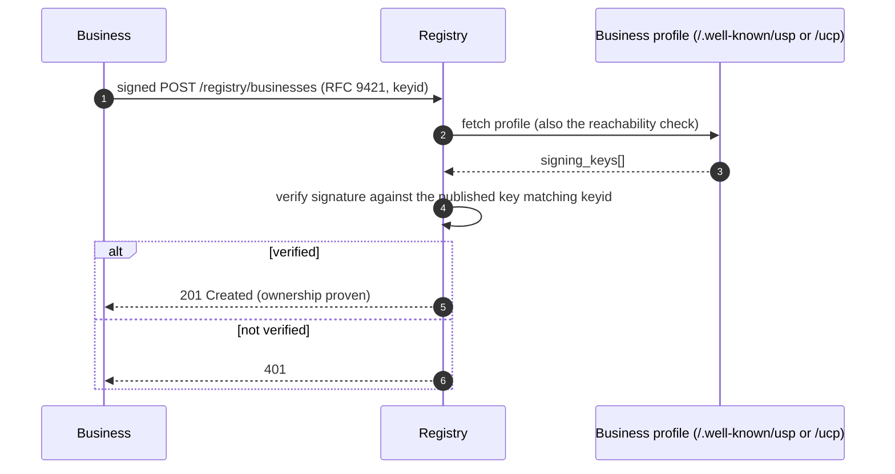
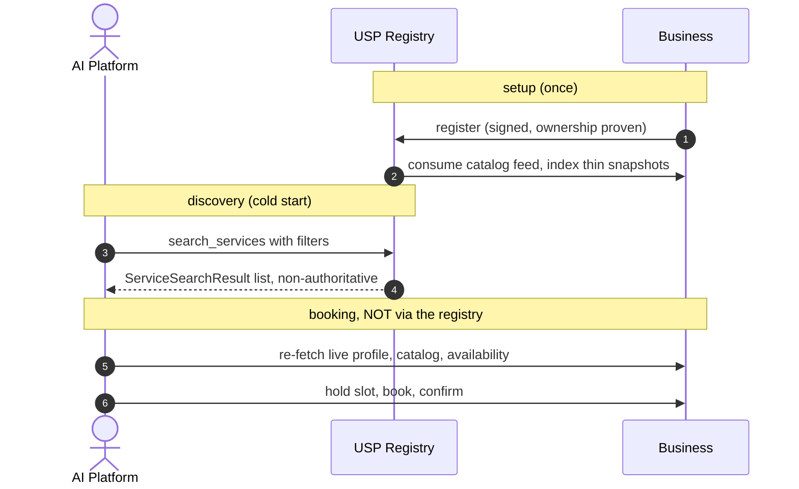
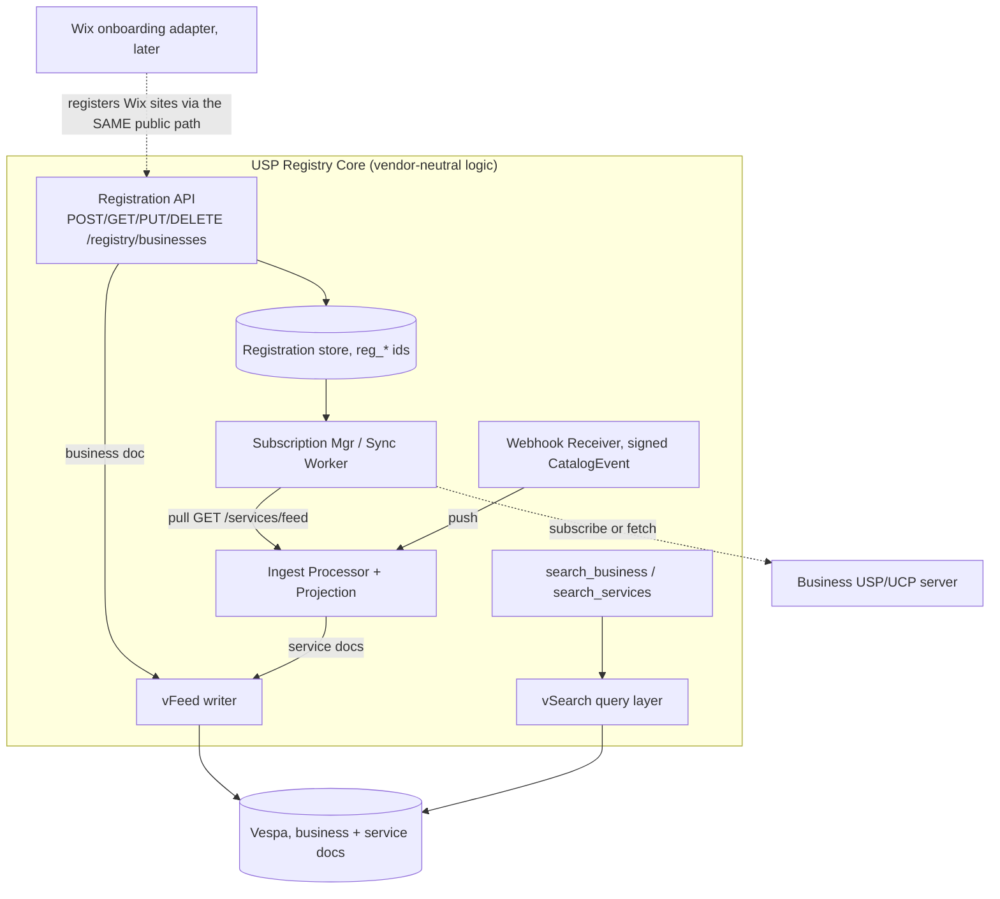
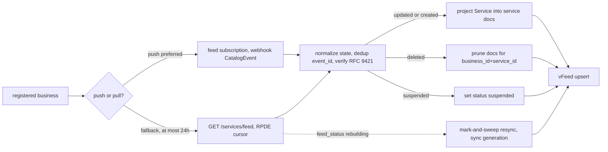
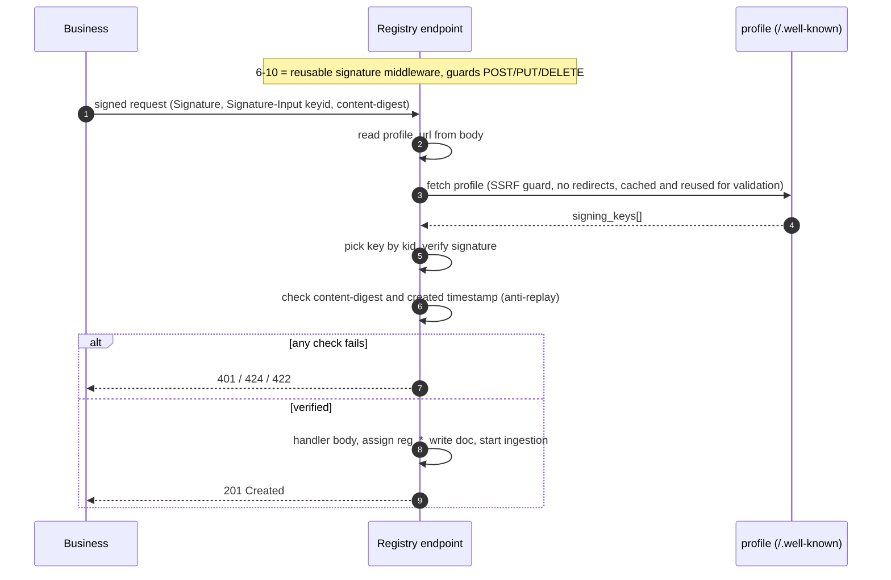
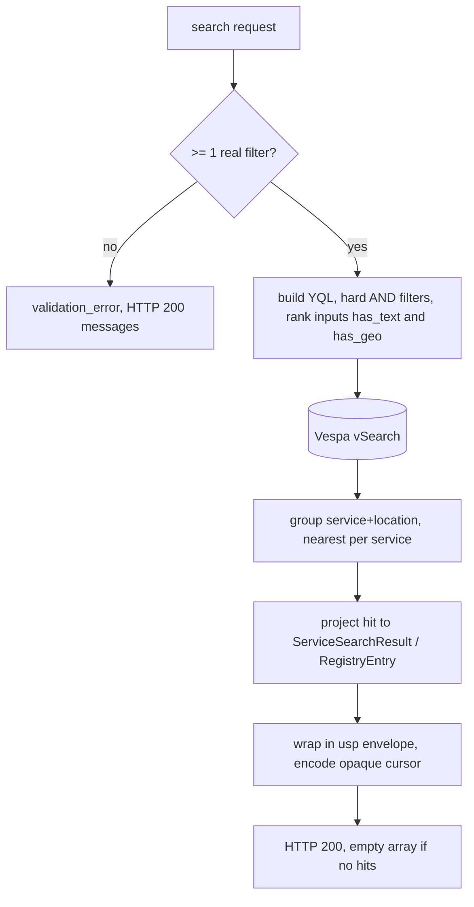

# USP Discovery Registry — Design Plan

> **Status:** design (pre-implementation).
>
> This document has three parts:
> - **[Part 1](#part-1-protocol-level-design-vendor-neutral) — Protocol-level design.** What *any* conformant USP registry must do. Vendor-neutral,
>   high-level, interoperability-focused. This is the part that informs the **[specification](../specification.md)** itself.
> - **[Part 2](#part-2-wix-implementation-design-vespa-vfeed-vsearch) — Wix implementation design.** How *we* build it: Vespa via vFeed/vSearch, Wix Loom Prime,
>   projection rules, ranking, and internal mechanics. Other registries may do these differently.
> - **[Part 3](#part-3-phasing-test-strategy) — Phasing & test strategy.** Build order, starting with the [Phase 1 demo](#phase-1-demo-no-auth).
>
> **Normative spec:** [USP `specification.md`](../specification.md) — especially [§6 Discovery Registry](../specification.md#6-discovery-registry-optional), [§3 Service Catalog](../specification.md#3-service-catalog) (ingestion), [§9 Transport Bindings](../specification.md#9-transport-bindings), and [§10 Security](../specification.md#10-security). **Schemas:** [`schemas/registry.json`](../schemas/registry.json). **Bindings:** [REST registry paths](../openapi/usp-rest.json) and [MCP `usp_registry_*` methods](../openrpc/usp-mcp.json). **Site docs:** [Discovery Registry](../site-docs/specification/discovery-registry.md). **Sprint context:** [USP+UCP implementation plan — Track B](../plans/USP+UCP_implementation_plan.md#6-track-b--usp-registry).
>
> Reference POC: `wix-vmr-repo/services-semantic-search`. The implementation will live in `wix-vmr-repo`.
>
> **The dividing line** (used throughout): a rule belongs in **Part 1 / the spec** if a *business* or a
> *client* must rely on it when talking to **any** registry. If it only affects how our registry is built
> internally, it's **Part 2**.

---

## Table of contents
<!-- TOC -->
* [USP Discovery Registry — Design Plan](#usp-discovery-registry--design-plan)
  * [Table of contents](#table-of-contents)
* [Part 1 — Protocol-level design (vendor-neutral)](#part-1--protocol-level-design-vendor-neutral)
  * [1.1 What a USP registry is](#11-what-a-usp-registry-is)
  * [1.2 Relationship to UCP](#12-relationship-to-ucp)
  * [1.3 Operations — the protocol contract](#13-operations--the-protocol-contract)
  * [1.4 Wire data model](#14-wire-data-model)
  * [1.5 Registration & ownership proof (the handshake)](#15-registration--ownership-proof-the-handshake)
  * [1.6 Read access posture](#16-read-access-posture)
  * [1.7 Ingestion contract (what the registry consumes)](#17-ingestion-contract-what-the-registry-consumes)
  * [1.8 Search & filter semantics](#18-search--filter-semantics)
  * [1.9 End-to-end discovery flow](#19-end-to-end-discovery-flow)
  * [1.10 Spec items this design surfaced](#110-spec-items-this-design-surfaced)
* [Part 2 — Wix implementation design (Vespa / vFeed / vSearch)](#part-2--wix-implementation-design-vespa--vfeed--vsearch)
  * [2.1 Architecture](#21-architecture)
  * [2.2 Tech & POC reuse](#22-tech--poc-reuse)
  * [2.3 Two Vespa doc types](#23-two-vespa-doc-types)
  * [2.4 Projection rules (catalog Service → service.sd)](#24-projection-rules-catalog-service--servicesd)
  * [2.5 Ingestion implementation](#25-ingestion-implementation)
  * [2.6 Auth implementation](#26-auth-implementation)
  * [2.7 Search implementation](#27-search-implementation)
  * [2.8 Wix onboarding side-car (DEFERRED)](#28-wix-onboarding-side-car-deferred)
* [Part 3 — Phasing & test strategy](#part-3--phasing--test-strategy)
  * [Phase 1 — Demo (no auth)](#phase-1--demo-no-auth)
  * [Phase 2 — Authentication & ownership (harden the demo)](#phase-2--authentication--ownership-harden-the-demo)
  * [Phase 3 — Conformant ingestion (pull + subscriptions)](#phase-3--conformant-ingestion-pull--subscriptions)
  * [Phase 4 — MCP binding](#phase-4--mcp-binding)
  * [Phase 5 — Wix onboarding side-car](#phase-5--wix-onboarding-side-car)
  * [Phase 6 — Hybrid (vector) ranking](#phase-6--hybrid-vector-ranking)
  * [Test strategy](#test-strategy)
* [Appendix — Decision log](#appendix--decision-log)
    * [Open (need a call later)](#open-need-a-call-later)
    * [Resolved during design (originally open)](#resolved-during-design-originally-open)
<!-- TOC -->
---

# Part 1 — Protocol-level design (vendor-neutral)

What it takes to be a conformant USP discovery registry, independent of any technology stack. See also [USP §6](../specification.md#6-discovery-registry-optional) and the [decision log](#appendix-decision-log) for resolved protocol-vs-implementation choices.

## 1.1 What a USP registry is

The optional **discovery registry** capability ([`dev.usp.discovery.registry`](../specification.md#6-discovery-registry-optional), [USP §6](../specification.md#6-discovery-registry-optional)). It solves the
**business cold-start problem**: how an AI platform/agent discovers a USP business it has never heard of,
by location / vertical / category / keyword — and optionally searches across businesses' services directly.

Two invariants every registry must honor:

- **It is an index, not a source of truth.** Results are explicitly *non-authoritative snapshots* ([USP §6.3](../specification.md#63-service-search---post-registrysearch_services)). Platforms **MUST** re-fetch the business's live profile + catalog + availability before booking. The
  registry therefore may be eventually-consistent and cache aggressively.
- **It is independent and federated** ([USP §6.7](../specification.md#67-registry-governance)). Multiple registries may coexist; a business may register with
  several. No registry is privileged. (How clients *find* registries is an open spec gap — see [§1.10](#110-spec-items-this-design-surfaced) / [#55](https://github.com/wix-private/universal-scheduling-protocol-spec/issues/55).)

## 1.2 Relationship to UCP

UCP has **no** central registry — reverse-domain capability naming "eliminates the need for a central
registry"; discovery is per-merchant [`/.well-known/ucp`](https://ucp.dev/latest/specification/overview/) only, and UCP leaves cold-start out of scope. USP's
registry is a deliberate net-new layer filling that gap ([USP §1.4](../specification.md#14-relationship-to-other-standards)). Consequence: there is no UCP precedent for a central
service index — holding service snapshots is USP going *further* than UCP.

## 1.3 Operations — the protocol contract

Seven operations ([USP §6](../specification.md#6-discovery-registry-optional)), each with a REST path ([`openapi/usp-rest.json`](../openapi/usp-rest.json)) and an MCP method ([`openrpc/usp-mcp.json`](../openrpc/usp-mcp.json)). These shapes are fixed by the spec; every
registry exposes the same surface.

| Op | REST | MCP |
|----|------|-----|
| Register | `POST /registry/businesses` | `usp_registry_register` |
| Search businesses | `POST /registry/search_business` | `usp_registry_search_business` |
| Search services | `POST /registry/search_services` | `usp_registry_search_services` |
| Get | `GET /registry/businesses/{id}` | `usp_registry_get` |
| Update | `PUT /registry/businesses/{id}` | `usp_registry_update` |
| Delete | `DELETE /registry/businesses/{id}` | `usp_registry_delete` |

Cross-cutting (fixed by spec): the [`usp` response envelope](../schemas/usp.json) advertising `dev.usp.discovery.registry`;
business-outcome errors in `messages[]` at HTTP 200 vs protocol errors as [RFC 9457](https://www.rfc-editor.org/rfc/rfc9457) Problem Details ([USP §9.4](../specification.md#94-error-code-mapping));
opaque cursor pagination ([USP §9.1.2](../specification.md#912-pagination)); `Idempotency-Key` on writes ([USP §9.1.1](../specification.md#911-idempotency)).

## 1.4 Wire data model

Fixed by [`schemas/registry.json`](../schemas/registry.json). A registry stores at least enough to serve these shapes:

- **[`RegistryEntry`](../schemas/registry.json#/$defs/RegistryEntry)** (business): `id` (`reg_*`), `profile_url`, `deployment_mode` {standalone|ucp_native},
  `name`, `description?`, `verticals[]`, `categories[]`, `location?` {address, coordinates}, `timezone`,
  `status` {active|inactive}, `created_at`. Source = the **registration body** ([`RegistrationRequest`](../schemas/registry.json#/$defs/RegistrationRequest)).
- **[`ServiceSearchResult`](../schemas/registry.json#/$defs/ServiceSearchResult)** (service): `service_id`, `service_name`, `business{id,profile_url,deployment_mode,name}`,
  `category`, `duration_minutes?`, `pricing` (full catalog [`Pricing`](../schemas/catalog.json#/$defs/Pricing), by `$ref`), `location?`, `timezone`,
  `last_indexed_at?`. Source = the business's **catalog feed**, reduced to this thin shape. (The wire shape is
  unchanged — no spec/schema change. The catalog's `availability_hint` is *indexed and searched against* by our
  registry but is **not** returned in `ServiceSearchResult`; see Part 2 [§2.3](#23-two-vespa-doc-types)/[§2.4](#24-projection-rules-catalog-service-servicesd).)

The service shape is a deliberate **thin snapshot** — name/category/price/duration/location, enough to *match*
and *rank*. Everything needed to *transact* (policies, capacity, resources, live availability, current price)
stays at the business and is fetched live. That reduction is "projection" ([Part 2, §2.4](#24-projection-rules-catalog-service-servicesd)).

## 1.5 Registration & ownership proof (the handshake)

Registration must prove the registrant **controls** the `profile_url` it registers — otherwise anyone can
register anyone's public profile. **This is a protocol concern**: a business registers with many registries,
so the proof must be uniform across them. (Today [USP §6.1](../specification.md#61-business-registration---post-registrybusinesses) only mandates *reachability*, not ownership — a real
spec gap, raised as **[#58](https://github.com/wix-private/universal-scheduling-protocol-spec/issues/58)**; see also [D18](#appendix-decision-log).)

Recommended mechanism — **permissionless, reusing the profile's published `signing_keys`** (the same JWK
array exists in both [USP](../specification.md#82-business-profile-well-knownusp) and [UCP profiles](https://ucp.dev/latest/specification/overview/)), identical to how UCP does merchant identity:

The signature is **both authentication and ownership proof** — no pre-issued credential. Standalone verifies
against the USP profile's `signing_keys`; `ucp_native` against the UCP profile's. When no key is published
anywhere, fall back to a **domain-challenge** (one-time token served on the business's domain). `PUT`/`DELETE`
re-verify identically; a registrant may mutate only its own `reg_*`. Whether a key is *required* to register
is open (**[#56](https://github.com/wix-private/universal-scheduling-protocol-spec/issues/56)**; see [O15](#open-need-a-call-later)).

Implemented in [§2.6](#26-auth-implementation). Signing details: [USP §9.1.4](../specification.md#914-request-signing), [RFC 9421](https://www.rfc-editor.org/rfc/rfc9421).

## 1.6 Read access posture

Search/Get are **public discovery of public metadata** — a registry may serve them anonymously. A registry
*may* additionally require auth (e.g. for higher rate limits); if it does, it should signal that with a
standard `401`/`WWW-Authenticate` so clients interoperate across public and gated registries (sub-point of [#58](https://github.com/wix-private/universal-scheduling-protocol-spec/issues/58); see [D17](#appendix-decision-log)).

## 1.7 Ingestion contract (what the registry consumes)

A registry keeps its service snapshots fresh by consuming each registered business's **catalog feed** — and
this side is **already standardized**, which is exactly why ingestion is interoperable across registries:

- **Pull:** `GET /services/feed` ([USP §3.1](../specification.md#31-service-catalog-feed)) — RPDE incremental sync, `state` ∈ {updated, deleted}, `modified_at`
  cursor, `feed_meta.feed_status` ∈ {healthy, degraded, rebuilding}.
- **Push:** feed subscriptions ([USP §3.12.2](../specification.md#3122-feed-subscriptions---post-servicesfeedsubscriptions)) — the registry registers a `callback_url`; the business POSTs signed
  `CatalogEvent`s (service.created/updated/deleted/suspended) to it. The callback_url **is** the registry's
  exposed ingest API; the subscription is the handshake. Do **not** invert this into a registry-specific
  "push to my proprietary endpoint" — that re-introduces N×N and privileges one registry (see [D11](#appendix-decision-log)).
- **Freshness:** [USP §6.3](../specification.md#63-service-search---post-registrysearch_services) — prefer subscriptions; otherwise re-index ≤24h. Stamp `last_indexed_at`.
- **Outbound auth:** when the registry calls the business (fetch feed / create subscription) it authenticates
  **as a platform-client** — OAuth 2.0 Bearer ([USP §10.2.3](../specification.md#1023-authentication-and-authorization)) and signs its own requests ([RFC 9421](https://www.rfc-editor.org/rfc/rfc9421)).

*How* a given registry consumes this (push-vs-pull preference, resync strategy, dedup) is implementation —
[Part 2, §2.5](#25-ingestion-implementation).

## 1.8 Search & filter semantics

Filters are **hard constraints** (a yes/no contract clients reason about); `query` drives relevance ranking
(a registry's own choice). For cross-registry consistency the *match semantics* should be defined by the spec
(today they aren't — raised as **[#59](https://github.com/wix-private/universal-scheduling-protocol-spec/issues/59)**). The semantics this design assumes:

- `location.radius_km` — kilometers; businesses with no coordinates (virtual/phone) are **excluded** from any
  location filter, returned only when no geo filter is set.
- `price_range` — **within-currency only, no FX**; `context.currency` is display-only ([D8](#appendix-decision-log)).
- `duration_range` — interval **overlap** (a range service matches if its offered interval overlaps the filter);
  duration-less services are excluded from duration filters but shown when none is set ([D6](#appendix-decision-log)).
- `verticals[]` / `categories[]` — OR within a field (match any).
- **Availability is deliberately NOT a filter.** `ServiceSearchRequest` has no time-window field, and the
  projected `availability_hint` is approximate + time-decaying — using it to exclude results would false-negative
  (hide services that still have slots). It is a **ranking/recall signal only** (semantic match on `summary`,
  soft nudge on `next_available_date`); real availability is narrowed live at booking.
- A request **MUST** carry ≥1 real filter, else `validation_error`; zero matches → **HTTP 200 + empty array**
  (never an error).

Search operations: [USP §6.2](../specification.md#62-business-search---post-registrysearch_business), [USP §6.3](../specification.md#63-service-search---post-registrysearch_services). Wix ranking and YQL mapping: [§2.7](#27-search-implementation).

## 1.9 End-to-end discovery flow

Post-discovery booking uses [USP §4 Availability](../specification.md#4-availability) and [USP §5 Booking Lifecycle](../specification.md#5-booking-lifecycle), not the registry.

## 1.10 Spec items this design surfaced

Dogfooding output — building the registry against the spec revealed these protocol-level questions/gaps:

- **[#54](https://github.com/wix-private/universal-scheduling-protocol-spec/issues/54)** — multi-taxonomy `categories[]` on catalog [`Service`](../schemas/catalog.json#/$defs/Service): needed, or is one flat category enough? (See [§2.4](#24-projection-rules-catalog-service-servicesd), [D9](#appendix-decision-log), [O7](#open-need-a-call-later).)
- **[#55](https://github.com/wix-private/universal-scheduling-protocol-spec/issues/55)** — registry **discovery / federation** is undefined: how do clients find registries; one canonical vs many? (Relates to [USP §6.7](../specification.md#67-registry-governance).) Includes the **marketplace/aggregator relay** case — a SaaS platform registers once and the registry fans out / merges its hosted catalog rather than indexing each provider.
- **[#56](https://github.com/wix-private/universal-scheduling-protocol-spec/issues/56)** — should registration **require** a published `signing_key`? (See [§1.5](#15-registration-ownership-proof-the-handshake), [O15](#open-need-a-call-later).)
- **[#58](https://github.com/wix-private/universal-scheduling-protocol-spec/issues/58)** — registration is **not authenticated**: [USP §6.1](../specification.md#61-business-registration---post-registrybusinesses) mandates reachability but not ownership proof. (See [§1.5](#15-registration-ownership-proof-the-handshake), [§1.6](#16-read-access-posture), [D17](#appendix-decision-log), [D18](#appendix-decision-log).)
- **[#59](https://github.com/wix-private/universal-scheduling-protocol-spec/issues/59)** — registry search **filter-matching semantics** are unspecified (range/currency/geo/free). (See [§1.8](#18-search-filter-semantics).)
- **[#106](https://github.com/wix-private/universal-scheduling-protocol-spec/issues/106)** — registry **trust & anti-abuse**: ownership ≠ legitimacy (CA-style verification?) and Sybil / registry-pollution prevention. Hardening layer above the index; not Phase 1.

Note: the registry **indexes and searches against** the catalog's `availability_hint` ([USP §3.6](../specification.md#36-availability-hint)) as a ranking/recall signal, but does **not** return it in `ServiceSearchResult` — so this is an implementation choice only, requiring **no spec/schema change** (the source field already exists on catalog `Service`).

---

# Part 2 — Wix implementation design (Vespa / vFeed / vSearch)

How we build the [Part 1](#part-1-protocol-level-design-vendor-neutral) contract. These choices are ours; other registries may differ without breaking interop. Sprint tasks: [Track B in the implementation plan](../plans/USP+UCP_implementation_plan.md#6-track-b--usp-registry).

## 2.1 Architecture

Maps to [§1.3 operations](#13-operations-the-protocol-contract), [§1.7 ingestion](#17-ingestion-contract-what-the-registry-consumes), and [§2.3 doc types](#23-two-vespa-doc-types).

## 2.2 Tech & POC reuse

Wix Loom Prime (Java/Ninja, Bazel); Vespa via **vFeed** (write/index) + **vSearch** (query).
Reuse from the `services-semantic-search` POC: Greyhound domain-events consumer, `ProcessingCache`
(content-hash + cooldown), server-signed metasite identity, the already-USP-shaped result proto.
Replace: the POC's RetrievalService embedding-KB engine → Vespa structured search. Hybrid ranking deferred to [Phase 6](#phase-6-hybrid-vector-ranking).

## 2.3 Two Vespa doc types

- **`business` doc** (← [`RegistryEntry`](../schemas/registry.json#/$defs/RegistryEntry)): `id`, `profile_url`, `deployment_mode`, `name` (BM25),
  `description` (BM25), `verticals[]` (array attr), `categories[]` (array attr), `location_geo` (position;
  unset for virtual-only), `address`, `timezone`, `status`, `created_at`.
- **`service` doc** (← [`ServiceSearchResult`](../schemas/registry.json#/$defs/ServiceSearchResult)): identity = composite `(business_id, service_id)`; one doc per
  (service, location). Output: `service_id`, `service_name`, `business{…}`, `category`, `duration_minutes`,
  `pricing_json`, `location`, `timezone`, `last_indexed_at`. Indexed-not-returned: `description` (BM25),
  `vertical` (attr), `status`. Filter attrs: `duration_min_minutes`/`duration_max_minutes`, `currency`,
  `price_min_amount`/`price_max_amount` (minor units, long), `location_geo` (position), `channel`.
  Availability: `availability_summary` (text, for semantic/recall — fed to the embedding in the hybrid phase),
  `availability_next_date` (date attr, for a soft "soonest"/"not-before" ranking nudge), `availability_generated_at`.
  Reserved: `content_embedding` (tensor, empty in [phase 1](#phase-1-demo-no-auth)).

## 2.4 Projection rules (catalog Service → service.sd)

Source: catalog [`Service`](../schemas/catalog.json#/$defs/Service) from [§3.1 feed](../specification.md#31-service-catalog-feed) or [§3.12.2 subscriptions](../specification.md#3122-feed-subscriptions---post-servicesfeedsubscriptions). Target wire shape: [§1.4](#14-wire-data-model).

- **Duration**: parse [ISO-8601 duration](../specification.md#37-duration) → minutes excluding buffers. `fixed`→min=max; `range`→[min,max], display=min;
  `undetermined`→unset. Index min/max for overlap filtering ([D5](#appendix-decision-log), [D6](#appendix-decision-log)).
- **Category**: single flat string. Representative pick: merchant-taxonomy value → categories[0].value →
  category.name → type. Normalize. (Multi-taxonomy is ingestion-only; see [#54](https://github.com/wix-private/universal-scheduling-protocol-spec/issues/54).)
- **Vertical**: service `type` → single string attr.
- **Pricing**: OUTPUT = full [`Pricing`](../schemas/catalog.json#/$defs/Pricing) pass-through. FILTER = extract `currency` + `price_min/max_amount`.
  `fixed`→min=max=amount; `variable`→price_range; `hourly`/`per_person`→price_range if present else amount;
  `free`→0. Within-currency only ([D7](#appendix-decision-log), [D8](#appendix-decision-log), [O3](#open-need-a-call-later)).
- **Multi-location**: one doc per (service, location); virtual/phone ⇒ no `location_geo` ([USP §2.6](../specification.md#26-multi-location-businesses), [D10](#appendix-decision-log)).
- **Availability hint**: pass `summary`→`availability_summary` (semantic field, embedded in the hybrid phase),
  `next_available_date`→`availability_next_date` (date attr), `generated_at`→`availability_generated_at`.
  **Index-only — not returned in `ServiceSearchResult`** and not a spec/schema change. **Not a hard filter**
  either — it informs ranking/recall only (semantic match on the summary; soft "soonest"/"not-before" nudge on
  the date). Stale + approximate, so it can never exclude a result.

## 2.5 Ingestion implementation

Implements [§1.7 ingestion contract](#17-ingestion-contract-what-the-registry-consumes).

Per-business lifecycle: register → write business doc → set up ingestion (prefer push subscription, else
≤24h pull) → **initial backfill pull** (always; subscriptions only deliver future events) → steady state →
periodic reconcile (compare `feed_meta.total_services` to indexed count) → deregister (cancel sub, purge docs).
Ordering: pull is `modified_at` asc, monotonic cursor per business; push may be out-of-order/duplicated →
dedup on `event_id`, last-writer-wins on timestamp. `rebuilding` → mark-and-sweep ([D12](#appendix-decision-log), [D13](#appendix-decision-log); never blind-delete).

Phase 1 uses push-only without the full subscription handshake; see [Phase 1](#phase-1-demo-no-auth) vs [Phase 3](#phase-3-conformant-ingestion-pull-subscriptions).

## 2.6 Auth implementation

The [Part 1 handshake (§1.5)](#15-registration-ownership-proof-the-handshake), implemented:

- **6-10 are reusable middleware** (guards POST/PUT/DELETE); only the final write is endpoint-specific.
- **SSRF guard** on the profile fetch: https-only, no redirects, block private/loopback/link-local/metadata
  IPs, bounded timeout + size ([D16](#appendix-decision-log)). Reuse the fetched profile for the reachability validation (don't fetch twice).
- **Profile validation errors** ([USP §9.4](../specification.md#94-error-code-mapping)): `invalid_profile_url` 400 / `profile_unreachable` 424 /
  `profile_malformed` 422 / `validation_error`. Re-validate on `profile_url`/`deployment_mode` change.
- **Outbound (③):** the ingestion client authenticates to businesses as a platform — OAuth Bearer + signs ([§1.7](#17-ingestion-contract-what-the-registry-consumes)).

Deferred until [Phase 2](#phase-2-authentication-ownership-harden-the-demo).

## 2.7 Search implementation

Implements [§1.8 filter semantics](#18-search-filter-semantics) and [USP §6.2](../specification.md#62-business-search---post-registrysearch_business) / [§6.3](../specification.md#63-service-search---post-registrysearch_services).

- **YQL mapping:** geo→`geoLocation(location_geo,lat,lng,"Nkm")`; verticals/categories→`contains` (OR);
  price→within-currency range; duration→interval overlap; mode→equals; business always `status==active`.
- **Ranking ([D19](#appendix-decision-log)):** one `discovery` rank profile blending BM25 (when `query` present; service_name×2,
  description, category×0.5) + geo `closeness` (when location present) + small freshness/active boosts, gated
  by 0/1 `has_text`/`has_geo` inputs. No-query fallback sort: geo distance else a stable key (pagination
  stability).
- **Pagination:** opaque cursor wrapping `{offset,limit,filter_hash,issued_at}` ([USP §9.1.2](../specification.md#912-pagination), [D14](#appendix-decision-log)); honor ≥60s; sort-key
  continuation fallback for deep paging.

## 2.8 Wix onboarding side-car (DEFERRED)

Later ([Phase 5](#phase-5-wix-onboarding-side-car)). Must integrate via the **same public USP protocol path** as any third party (dogfood; [D15](#appendix-decision-log)). Resolves the
POC's 3 TODO gaps (business.name, timezone, usp_profile_url) from Bookings ServicesService + Site Properties.
`availability-feeds` carries no full `Service`, so this adapter sources catalog data separately, then funnels
into the same Ingest Processor → Projection → vFeed ([§2.5](#25-ingestion-implementation)).

---

# Part 3 — Phasing & test strategy

Each phase independently shippable; TDD throughout (mirror the POC red-green-refactor + `...Test.java`).
Conformance = validate against [USP §6](../specification.md#6-discovery-registry-optional) worked examples + [`schemas/registry.json`](../schemas/registry.json).

## Phase 1 — Demo (no auth)

The minimum that demonstrates the end-to-end registry value. Deliberately cuts auth and the pull/feed flow.

- **No auth on any endpoint** (no RFC 9421, no profile validation, no API keys).
- **Registration flow** — `POST /registry/businesses` (+ `GET`) writing the Vespa `business` doc ([§2.3](#23-two-vespa-doc-types)).
- **Push-only service ingestion** — an endpoint others call to **push their services** to the registry
  (service upserts → [projection](#24-projection-rules-catalog-service-servicesd) → `service` doc). **No pull / feed-polling / subscription handshake yet.**
- **Search** — `POST /registry/search_services` and `POST /registry/search_business` over Vespa ([§2.7](#27-search-implementation); geo /
  vertical / category / price / duration / text filters + pagination).
- REST binding; Vespa `business` + `service` docs; both searches return the spec wire shapes in the [`usp` envelope](../schemas/usp.json).
- *Exit:* a business can be registered and push services; an agent can search businesses and services and get
  conformant results — all without auth.

## Phase 2 — Authentication & ownership (harden the demo)

Add the [§1.5 handshake](#15-registration-ownership-proof-the-handshake): [RFC 9421](https://www.rfc-editor.org/rfc/rfc9421) signature verification against the profile's `signing_keys` (+ challenge
fallback), profile-reachability validation with the [§9.4 error codes](../specification.md#94-error-code-mapping), SSRF guard ([§2.6](#26-auth-implementation)), owner-scoped PUT/DELETE,
and the read-side optional API key ([§1.6](#16-read-access-posture)). *Exit:* registration is authenticated and ownership-proven; only owners
mutate their `reg_*`.

## Phase 3 — Conformant ingestion (pull + subscriptions)

Add the standardized [ingestion contract (§1.7)](#17-ingestion-contract-what-the-registry-consumes): `GET /services/feed` RPDE pull with `feed_status` handling +
mark-and-sweep resync ([§2.5](#25-ingestion-implementation)), feed-subscription handshake (registry registers its callback_url), initial backfill,
deleted/suspended propagation, periodic reconcile, and outbound platform-client auth (③). *Exit:* a registered
business's catalog stays fresh via push **or** pull without manual pushes.

## Phase 4 — MCP binding

Expose the [7 ops](#13-operations-the-protocol-contract) as `usp_registry_*` ([`openrpc/usp-mcp.json`](../openrpc/usp-mcp.json)) with JSON-RPC result/error mapping ([USP §9.2](../specification.md#92-mcp-binding)). *Exit:* an MCP agent runs the full
[discover flow](#19-end-to-end-discovery-flow).

## Phase 5 — Wix onboarding side-car

The [§2.8 bridge](#28-wix-onboarding-side-car-deferred), via the public protocol path. *Exit:* Wix Bookings sites appear as ordinary registrants.

## Phase 6 — Hybrid (vector) ranking

Only if Phase 1–4 recall measurement on real agent queries shows BM25 misses intent. Populate the reserved
embedding field ([§2.3](#23-two-vespa-doc-types)) + a hybrid rank profile ([D3](#appendix-decision-log)). *Exit:* measured recall lift over BM25.

## Test strategy

Unit ([projection](#24-projection-rules-catalog-service-servicesd) — pure, ideal TDD like POC `SlotSummarizer`; signature verify; cursor codec) → adapter
(vFeed/vSearch, feed client, profile fetcher incl. SSRF cases) → conformance (replay [§6 example requests](../specification.md#6-discovery-registry-optional),
assert responses validate vs [`registry.json`](../schemas/registry.json); empty-result=200; ≥1-filter guard; [§9.4](../specification.md#94-error-code-mapping) error-code mapping) →
integration (end-to-end [register → ingest → search](#19-end-to-end-discovery-flow)).

---

# Appendix — Decision log

`D#` = resolved (with rationale). **Scope** = Protocol (interop; informs the spec) or Impl (ours; may differ
per registry). "Where" points to the section.

| ID | Decision | Scope | Choice + rationale | Where |
|----|----------|-------|--------------------|-------|
| D1 | Registry posture | Impl | Generic/protocol-first core; Wix is a later side-car | [2.1](#21-architecture), [2.8](#28-wix-onboarding-side-car-deferred) |
| D2 | Index layout | Impl | Two Vespa doc types (`business`, `service`) | [2.3](#23-two-vespa-doc-types) |
| D3 | Ranking (phase 1) | Impl | BM25 + hard filters; reserve embedding field for later hybrid | [2.7](#27-search-implementation), [Phase 6](#phase-6-hybrid-vector-ranking) |
| D4 | Availability never indexed | Protocol | Non-authoritative; availability is always live ([USP §6.3](../specification.md#63-service-search---post-registrysearch_services)) | [1.1](#11-what-a-usp-registry-is) |
| D5 | Duration range → display | Impl | Output the min; index min/max for overlap | [2.4](#24-projection-rules-catalog-service-servicesd) |
| D6 | `undetermined` duration | Protocol | Unmatched by duration filters; shown when none set | [1.8](#18-search-filter-semantics), [2.4](#24-projection-rules-catalog-service-servicesd) |
| D7 | Free pricing | Protocol | price 0 ⇒ excluded from min>0 ranges, included at [0,X]/none | [1.8](#18-search-filter-semantics), [2.4](#24-projection-rules-catalog-service-servicesd) |
| D8 | Cross-currency price | Protocol | Within-currency only, no FX; `context.currency` display-only | [1.8](#18-search-filter-semantics) |
| D9 | Category model | Impl/Protocol | Single flat string on service (arrays on business); match semantics in 1.8; taxonomy ingestion-only ([#54](https://github.com/wix-private/universal-scheduling-protocol-spec/issues/54)) | [1.8](#18-search-filter-semantics), [2.4](#24-projection-rules-catalog-service-servicesd) |
| D10 | Multi-location | Impl | One doc per (service, location) + Vespa grouping; virtual/phone ⇒ no geo | [2.4](#24-projection-rules-catalog-service-servicesd) |
| D11 | Push model | Protocol | Consumer-subscribes (callback_url = our API); never invert to a proprietary ingest endpoint | [1.7](#17-ingestion-contract-what-the-registry-consumes) |
| D12 | Push vs pull preference | Impl | Prefer subscriptions; ≤24h poll fallback | [2.5](#25-ingestion-implementation) |
| D13 | Rebuild handling | Impl | Mark-and-sweep with sync generation; never blind-delete | [2.5](#25-ingestion-implementation) |
| D14 | Pagination | Protocol/Impl | Opaque cursor ([USP §9.1.2](../specification.md#912-pagination), ≥60s) is protocol; the `{offset,limit,filter_hash}` encoding is ours | [2.7](#27-search-implementation) |
| D15 | Wix onboarding | Impl | Via the SAME public protocol path (dogfood) | [2.8](#28-wix-onboarding-side-car-deferred) |
| D16 | SSRF guard | Impl | https-only, no redirects, block private/metadata IPs, bounded | [2.6](#26-auth-implementation) |
| D17 | Read auth | Protocol/Impl | Public read is the posture; a registry MAY require auth but must signal it ([#58](https://github.com/wix-private/universal-scheduling-protocol-spec/issues/58)) | [1.6](#16-read-access-posture) |
| D18 | Write ownership proof | Protocol | Permissionless RFC 9421 vs profile `signing_keys` (+ challenge fallback). Must be uniform across registries → spec ([#58](https://github.com/wix-private/universal-scheduling-protocol-spec/issues/58)); USP/UCP-consistent | [1.5](#15-registration-ownership-proof-the-handshake) |
| D19 | Read path ranking + assembly | Impl | `discovery` rank profile (BM25 + geo + freshness, gated); group → nearest per service; envelope + cursor; empty=200 | [2.7](#27-search-implementation) |

### Open (need a call later)

| ID | Decision | Scope | Leaning | Where |
|----|----------|-------|---------|-------|
| O2 | Keep `service_raw` blob? | Impl | lean v1; add later if rich result cards need it | [2.4](#24-projection-rules-catalog-service-servicesd) |
| O3 | hourly/per_person price filter | Protocol | price_range if present else amount as point; accept imprecision | [1.8](#18-search-filter-semantics), [2.4](#24-projection-rules-catalog-service-servicesd) |
| O4 | Trust signed webhook payload vs re-fetch | Impl | trust-if-signed + periodic reconcile | [2.5](#25-ingestion-implementation) |
| O5 | Suspended service: mark vs prune | Impl | mark (cheap resume) | [2.5](#25-ingestion-implementation) |
| O6 | Reconciliation cadence | Impl | daily full-cursor pass | [2.5](#25-ingestion-implementation) |
| O7 | Category representative pick | Impl | merchant → categories[0] → category.name → type | [2.4](#24-projection-rules-catalog-service-servicesd), [#54](https://github.com/wix-private/universal-scheduling-protocol-spec/issues/54) |
| O8 | UCP profile validation strictness | Impl | structural minimum v1 | [2.6](#26-auth-implementation) |
| O9 | Registration↔profile cross-check | Impl | warn, don't reject | [2.6](#26-auth-implementation) |
| O10 | No-catalog-capability routing | Impl | index business-only, not an error | [2.6](#26-auth-implementation) |
| O11 | Governance status-flip policy | Impl | TBD thresholds; auto-reactivate on recovery | [2.6](#26-auth-implementation) |
| O14 | Scale/NFR targets | Impl | TBD (needs # businesses, # services, QPS, latency SLO, vFeed/vSearch sizing) | [Part 3](#part-3-phasing-test-strategy) |
| O15 | `signing_keys` mandatory for registration? | Protocol | option (b): require on registration; not global-mandatory. Tracked as [#56](https://github.com/wix-private/universal-scheduling-protocol-spec/issues/56) | [1.5](#15-registration-ownership-proof-the-handshake) |
| O16 | `availability_hint` use in search | Impl | **Index-only**: ingested from catalog [§3.6](../specification.md#36-availability-hint), indexed + searched against, **not** returned in `ServiceSearchResult` and **no spec/schema change**. Ranking/recall signal only, **never a hard filter** (stale + approximate). Semantic match on `summary` (hybrid phase) + soft `next_available_date` nudge; deeper use evaluated in Phase 6. | [1.8](#18-search-filter-semantics), [2.4](#24-projection-rules-catalog-service-servicesd) |
| O17 | Registry trust & anti-abuse | Protocol | Legitimacy verification (CA-style?) + Sybil/pollution prevention — hardening layer, not Phase 1. Tracked as [#106](https://github.com/wix-private/universal-scheduling-protocol-spec/issues/106) | [1.10](#110-spec-items-this-design-surfaced) |
| O18 | Marketplace/aggregator relay | Protocol | A marketplace registers once; registry fans out / merges its hosted catalog instead of indexing each provider. Federation case — tracked under [#55](https://github.com/wix-private/universal-scheduling-protocol-spec/issues/55) | [1.10](#110-spec-items-this-design-surfaced) |

### Resolved during design (originally open)

- **O1** Auth model → split into **[D17](#appendix-decision-log)** (read) + **[D18](#appendix-decision-log)** (write) + ③ outbound ([§1.7](#17-ingestion-contract-what-the-registry-consumes)).
- **O12** `context` locale/currency → **[D8](#appendix-decision-log)**/**[D19](#appendix-decision-log)**: display only, no FX, never a filter.
- **O13** Transport build order → REST ([Phase 1](#phase-1-demo-no-auth)) → MCP ([Phase 4](#phase-4-mcp-binding)); A2A out of scope; ESP N/A.
