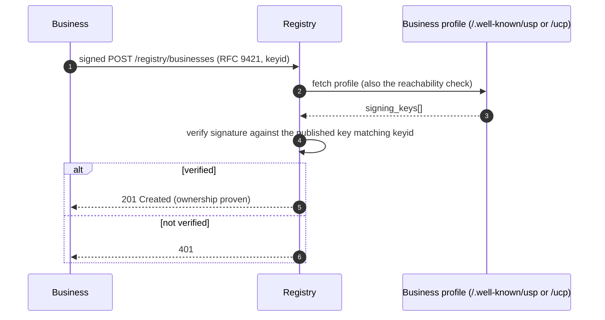
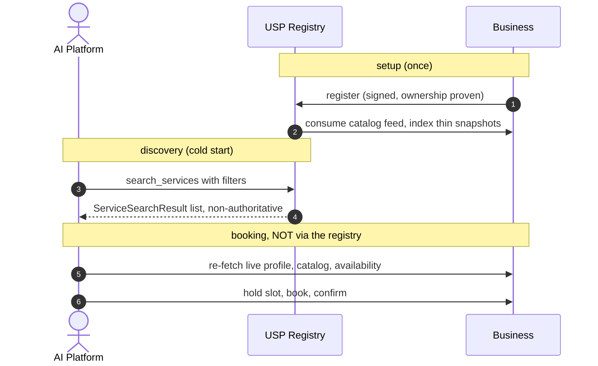
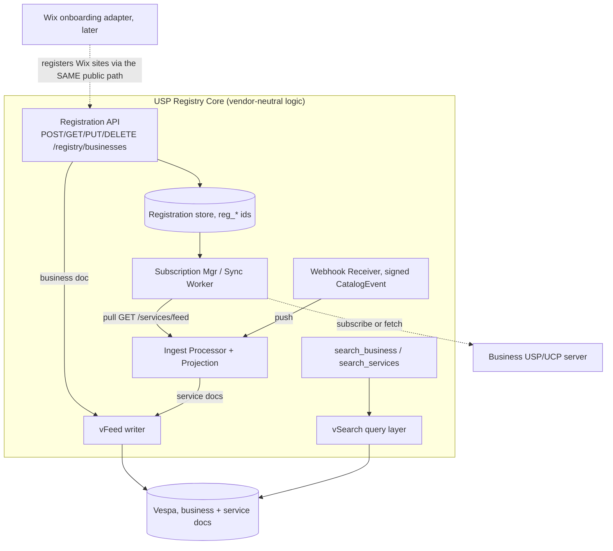

# USP Discovery Registry — Design Plan

> **Status:** design (pre-implementation).
>
> This document has three parts:
>
> - **[Part 1](#part-1-protocol-level-design-vendor-neutral) — Protocol-level design.** What *any* conformant USP registry must do. Vendor-neutral,
> high-level, interoperability-focused. This is the part that informs the **[specification](../specification.md)** itself.
> - **[Part 2](#part-2-wix-implementation-design-vespa-vfeed-vsearch) — Wix implementation design.** How *we* build it: Vespa via vFeed/vSearch, Wix Loom Prime,
> projection rules, ranking, and internal mechanics. Other registries may do these differently.
> - **[Part 3](#part-3-phasing-test-strategy) — Phasing & test strategy.** Build order, starting with the [Phase 1 demo](#phase-1-demo-no-auth).
>
> **Normative spec:** [USP](../specification.md) `specification.md` — especially [§6 Discovery Registry](../specification.md#6-discovery-registry-optional), [§3 Service Catalog](../specification.md#3-service-catalog) (ingestion), [§9 Transport Bindings](../specification.md#9-transport-bindings), and [§10 Security](../specification.md#10-security). **Schemas:** `[schemas/registry.json](../schemas/registry.json)`. **Bindings:** [REST registry paths](../openapi/usp-rest.json) and [MCP](../openrpc/usp-mcp.json) `usp_registry_`* [methods](../openrpc/usp-mcp.json). **Site docs:** [Discovery Registry](../site-docs/specification/discovery-registry.md). **Sprint context:** [USP+UCP implementation plan — Track B](../plans/USP+UCP_implementation_plan.md#6-track-b--usp-registry).
>
> Reference POC: `wix-vmr-repo/services-semantic-search`. The implementation will live in `wix-vmr-repo`.
>
> **The dividing line** (used throughout): a rule belongs in **Part 1 / the spec** if a *business* or a
> *client* must rely on it when talking to **any** registry. If it only affects how our registry is built
> internally, it's **Part 2**.

---

## Table of contents

- [USP Discovery Registry — Design Plan](#usp-discovery-registry--design-plan)
  - [Table of contents](#table-of-contents)
- [Part 1 — Protocol-level design (vendor-neutral)](#part-1--protocol-level-design-vendor-neutral)
  - [1.1 What a USP registry is](#11-what-a-usp-registry-is)
  - [1.2 Relationship to UCP](#12-relationship-to-ucp)
  - [1.3 Operations — the protocol contract](#13-operations--the-protocol-contract)
  - [1.4 Wire data model](#14-wire-data-model)
  - [1.5 Registration & ownership proof (the handshake)](#15-registration--ownership-proof-the-handshake)
  - [1.6 Read access posture](#16-read-access-posture)
  - [1.7 Ingestion contract (what the registry consumes)](#17-ingestion-contract-what-the-registry-consumes)
  - [1.8 Search & filter semantics](#18-search--filter-semantics)
  - [1.9 End-to-end discovery flow](#19-end-to-end-discovery-flow)
  - [1.10 Spec items this design surfaced](#110-spec-items-this-design-surfaced)
- [Part 2 — Wix implementation design (Vespa / vFeed / vSearch)](#part-2--wix-implementation-design-vespa--vfeed--vsearch)
  - [2.1 Architecture](#21-architecture)
  - [2.2 Tech & POC reuse](#22-tech--poc-reuse)
  - [2.3 Two Vespa doc types](#23-two-vespa-doc-types)
  - [2.4 Projection rules (catalog Service → service.sd)](#24-projection-rules-catalog-service--servicesd)
  - [2.5 Ingestion implementation](#25-ingestion-implementation)
  - [2.6 Auth implementation](#26-auth-implementation)
  - [2.7 Search implementation](#27-search-implementation)
  - [2.8 Wix onboarding side-car (DEFERRED)](#28-wix-onboarding-side-car-deferred)
- [Part 3 — Phasing & test strategy](#part-3--phasing--test-strategy)
  - [Phase 1 — Demo (no auth)](#phase-1--demo-no-auth)
  - [Phase 2 — Authentication & ownership (harden the demo)](#phase-2--authentication--ownership-harden-the-demo)
  - [Phase 3 — Conformant ingestion (pull + subscriptions)](#phase-3--conformant-ingestion-pull--subscriptions)
  - [Phase 4 — MCP binding](#phase-4--mcp-binding)
  - [Phase 5 — Wix onboarding side-car](#phase-5--wix-onboarding-side-car)
  - [Phase 6 — Hybrid (vector) ranking](#phase-6--hybrid-vector-ranking)
  - [Test strategy](#test-strategy)
- [Appendix — Decision log](#appendix--decision-log)
  - [Open (need a call later)](#open-need-a-call-later)
  - [Resolved during design (originally open)](#resolved-during-design-originally-open)

---

# Part 1 — Protocol-level design (vendor-neutral)

What it takes to be a conformant USP discovery registry, independent of any technology stack. See also [USP §6](../specification.md#6-discovery-registry-optional) and the [decision log](#appendix-decision-log) for resolved protocol-vs-implementation choices.

## 1.1 What a USP registry is

The optional **discovery registry** capability (`[dev.usp.discovery.registry](../specification.md#6-discovery-registry-optional)`, [USP §6](../specification.md#6-discovery-registry-optional)). It solves the
**business cold-start problem**: how an AI platform/agent discovers a USP business it has never heard of,
by location / vertical / category / keyword — and optionally searches across businesses' services directly.

Two invariants every registry must honor:

- **It is an index, not a source of truth.** Results are explicitly *non-authoritative snapshots* ([USP §6.3](../specification.md#63-service-search---post-registrysearch_services)). Platforms **MUST** re-fetch the business's live profile + catalog + availability before booking. The
registry therefore may be eventually-consistent and cache aggressively.
- **It is independent and federated** ([USP §6.7](../specification.md#67-registry-governance)). Multiple registries may coexist; a business may register with
several. No registry is privileged. (How clients *find* registries is an open spec gap — see [§1.10](#110-spec-items-this-design-surfaced) / [#55](https://github.com/wix-private/universal-scheduling-protocol-spec/issues/55).)

## 1.2 Relationship to UCP

UCP has **no** central registry — reverse-domain capability naming "eliminates the need for a central
registry"; discovery is per-merchant `[/.well-known/ucp](https://ucp.dev/latest/specification/overview/)` only, and UCP leaves cold-start out of scope. USP's
registry is a deliberate net-new layer filling that gap ([USP §1.4](../specification.md#14-relationship-to-other-standards)). Consequence: there is no UCP precedent for a central
service index — holding service snapshots is USP going *further* than UCP.

## 1.3 Operations — the protocol contract

Seven operations ([USP §6](../specification.md#6-discovery-registry-optional)), each with a REST path (`[openapi/usp-rest.json](../openapi/usp-rest.json)`) and an MCP method (`[openrpc/usp-mcp.json](../openrpc/usp-mcp.json)`). These shapes are fixed by the spec; every
registry exposes the same surface.

| Op                | REST                               | MCP                            |
| ----------------- | ---------------------------------- | ------------------------------ |
| Register          | `POST /registry/businesses`        | `usp_registry_register`        |
| Search businesses | `POST /registry/search_business`   | `usp_registry_search_business` |
| Search services   | `POST /registry/search_services`   | `usp_registry_search_services` |
| Get               | `GET /registry/businesses/{id}`    | `usp_registry_get`             |
| Update            | `PUT /registry/businesses/{id}`    | `usp_registry_update`          |
| Delete            | `DELETE /registry/businesses/{id}` | `usp_registry_delete`          |

Cross-cutting (fixed by spec): the `usp` [response envelope](../schemas/usp.json) advertising `dev.usp.discovery.registry`;
business-outcome errors in `messages[]` at HTTP 200 vs protocol errors as [RFC 9457](https://www.rfc-editor.org/rfc/rfc9457) Problem Details ([USP §9.4](../specification.md#94-error-code-mapping));
opaque cursor pagination ([USP §9.1.2](../specification.md#912-pagination)); `Idempotency-Key` on writes ([USP §9.1.1](../specification.md#911-idempotency)).

## 1.4 Wire data model

Fixed by `[schemas/registry.json](../schemas/registry.json)`. A registry stores at least enough to serve these shapes:

- `[RegistryEntry](../schemas/registry.json#/$defs/RegistryEntry)` (business): `id` (`reg_*`), `profile_url`, `deployment_mode` {standalone|ucp_native},
`name`, `description?`, `verticals[]`, `categories[]`, `location?` {address, coordinates}, `timezone`,
`status` {active|inactive}, `created_at`. Source = the **registration body** (`[RegistrationRequest](../schemas/registry.json#/$defs/RegistrationRequest)`).
- `[ServiceSearchResult](../schemas/registry.json#/$defs/ServiceSearchResult)` (service): `service_id`, `service_name`, `business{id,profile_url,deployment_mode,name}`,
`category`, `duration_minutes?`, `pricing` (full catalog `[Pricing](../schemas/catalog.json#/$defs/Pricing)`, by `$ref`), `location?`, `timezone`,
`last_indexed_at?`, `availability_hint?` (catalog `[AvailabilityHint](../schemas/catalog.json#/$defs/AvailabilityHint)`, by `$ref`, when present at index time). Source = the business's **catalog feed**, reduced to this thin shape. The flat `category` string is projected from the catalog primary `categories[]` entry (pick order: primary `name`, else primary `value`, else primary `id`, else first entry `value`, else service `type`). The catalog's `availability_hint` is also *indexed and searched against* as a ranking/recall signal ([Part 2 §2.3](#23-two-vespa-doc-types)).

The service shape is a deliberate **thin snapshot** — name/category/price/duration/location/availability hint, enough to *match*
and *rank*. Everything needed to *transact* (policies, capacity, resources, live availability, current price)
stays at the business and is fetched live. That reduction is "projection" ([Part 2, §2.4](#24-projection-rules-catalog-service-servicesd)).

## 1.5 Registration & ownership proof (the handshake)

Registration must prove the registrant **controls** the `profile_url` it registers — otherwise anyone can
register anyone's public profile. **This is a protocol concern**: a business registers with many registries,
so the proof must be uniform across them. (Today [USP §6.1](../specification.md#61-business-registration---post-registrybusinesses) only mandates *reachability*, not ownership — a real
spec gap, raised as **[#58](https://github.com/wix-private/universal-scheduling-protocol-spec/issues/58)**; see also [D18](#appendix-decision-log).)

Recommended mechanism — **permissionless, reusing the profile's published** `signing_keys` (the same JWK
array exists in both [USP](../specification.md#82-business-profile-well-knownusp) and [UCP profiles](https://ucp.dev/latest/specification/overview/)), identical to how UCP does merchant identity:

The signature is **both authentication and ownership proof** — no pre-issued credential. Standalone verifies
against the USP profile's `signing_keys`; `ucp_native` against the UCP profile's. When no key is published
anywhere, fall back to a **domain-challenge** (one-time token served on the business's domain). `PUT`/`DELETE`
re-verify identically; a registrant may mutate only its own `reg_*`. Whether a key is *required* to register
is open (**[#56](https://github.com/wix-private/universal-scheduling-protocol-spec/issues/56)**; see [O15](#open-need-a-call-later)).

Implemented in [§2.6](#26-auth-implementation). Signing details: [USP §9.1.4](../specification.md#914-request-signing), [RFC 9421](https://www.rfc-editor.org/rfc/rfc9421).

## 1.6 Read access posture

Search/Get are **public discovery of public metadata** — a registry may serve them anonymously. A registry
*may* additionally require auth (e.g. for higher rate limits); if it does, it should signal that with a
standard `401`/`WWW-Authenticate` so clients interoperate across public and gated registries (sub-point of [#58](https://github.com/wix-private/universal-scheduling-protocol-spec/issues/58); see [D17](#appendix-decision-log)).

## 1.7 Ingestion contract (what the registry consumes)

A registry keeps its service snapshots fresh by consuming each registered business's **catalog feed** — and
this side is **already standardized**, which is exactly why ingestion is interoperable across registries:

- **Pull:** `GET /services/feed` ([USP §3.1](../specification.md#31-service-catalog-feed)) — RPDE incremental sync, `state` ∈ {updated, deleted}, `modified_at`
cursor, `feed_meta.feed_status` ∈ {healthy, degraded, rebuilding}.
- **Push:** feed subscriptions ([USP §3.12.2](../specification.md#3122-feed-subscriptions---post-servicesfeedsubscriptions)) — the registry registers a `callback_url`; the business POSTs signed
`CatalogEvent`s (service.created/updated/deleted/suspended) to it. The callback_url **is** the registry's
exposed ingest API; the subscription is the handshake. Do **not** invert this into a registry-specific
"push to my proprietary endpoint" — that re-introduces N×N and privileges one registry (see [D11](#appendix-decision-log)).
- **Freshness:** [USP §6.3](../specification.md#63-service-search---post-registrysearch_services) — prefer subscriptions; otherwise re-index ≤24h. Stamp `last_indexed_at`.
- **Outbound auth:** when the registry calls the business (fetch feed / create subscription) it authenticates
**as a platform-client** — OAuth 2.0 Bearer ([USP §10.2.3](../specification.md#1023-authentication-and-authorization)) and signs its own requests ([RFC 9421](https://www.rfc-editor.org/rfc/rfc9421)).

*How* a given registry consumes this (push-vs-pull preference, resync strategy, dedup) is implementation —
[Part 2, §2.5](#25-ingestion-implementation).

## 1.8 Search & filter semantics

Filters are **hard constraints** (a yes/no contract clients reason about); `query` drives relevance ranking
(a registry's own choice). For cross-registry consistency the *match semantics* should be defined by the spec
(today they aren't — raised as **[#59](https://github.com/wix-private/universal-scheduling-protocol-spec/issues/59)**). The semantics this design assumes:

- `location.radius_km` — kilometers; businesses with no coordinates (virtual/phone) are **excluded** from any
location filter, returned only when no geo filter is set.
- `price_range` — **within-currency only, no FX**; `context.currency` is display-only ([D8](#appendix-decision-log)).
- `duration_range` — interval **overlap** (a range service matches if its offered interval overlaps the filter);
duration-less services are excluded from duration filters but shown when none is set ([D6](#appendix-decision-log)).
- `verticals[]` / `categories[]` — OR within a field (match any).
- **Availability is deliberately NOT a filter.** `ServiceSearchRequest` has no time-window field, and the
projected `availability_hint` is approximate + time-decaying — using it to exclude results would false-negative
(hide services that still have slots). It is a **ranking/recall signal only** (semantic match on `summary`,
soft nudge on `next_available_date`); real availability is narrowed live at booking.
- A request **MUST** carry ≥1 real filter, else `validation_error`; zero matches → **HTTP 200 + empty array**
(never an error).

Search operations: [USP §6.2](../specification.md#62-business-search---post-registrysearch_business), [USP §6.3](../specification.md#63-service-search---post-registrysearch_services). Wix ranking and YQL mapping: [§2.7](#27-search-implementation).

## 1.9 End-to-end discovery flow

Post-discovery booking uses [USP §4 Availability](../specification.md#4-availability) and [USP §5 Booking Lifecycle](../specification.md#5-booking-lifecycle), not the registry.

## 1.10 Spec items this design surfaced

Dogfooding output — building the registry against the spec revealed these protocol-level questions/gaps:

- **[#54](https://github.com/wix-private/universal-scheduling-protocol-spec/issues/54)** - **Resolved:** singular catalog `category` removed; enriched multi-taxonomy `categories[]` (`[ServiceCategory](../schemas/catalog.json#/$defs/ServiceCategory)`) is canonical, with an explicit primary rule. Registry `ServiceSearchResult.category` stays a flat string projected from the primary entry (see [§1.4](#14-wire-data-model)).
- **[#55](https://github.com/wix-private/universal-scheduling-protocol-spec/issues/55)** — registry **discovery / federation** is undefined: how do clients find registries; one canonical vs many? (Relates to [USP §6.7](../specification.md#67-registry-governance).) Includes the **marketplace/aggregator relay** case — a SaaS platform registers once and the registry fans out / merges its hosted catalog rather than indexing each provider.
- **[#56](https://github.com/wix-private/universal-scheduling-protocol-spec/issues/56)** — should registration **require** a published `signing_key`? (See [§1.5](#15-registration-ownership-proof-the-handshake), [O15](#open-need-a-call-later).)
- **[#58](https://github.com/wix-private/universal-scheduling-protocol-spec/issues/58)** — registration is **not authenticated**: [USP §6.1](../specification.md#61-business-registration---post-registrybusinesses) mandates reachability but not ownership proof. (See [§1.5](#15-registration-ownership-proof-the-handshake), [§1.6](#16-read-access-posture), [D17](#appendix-decision-log), [D18](#appendix-decision-log).)
- **[#59](https://github.com/wix-private/universal-scheduling-protocol-spec/issues/59)** — registry search **filter-matching semantics** are unspecified (range/currency/geo/free). (See [§1.8](#18-search-filter-semantics).)
- **[#106](https://github.com/wix-private/universal-scheduling-protocol-spec/issues/106)** — registry **trust & anti-abuse**: ownership ≠ legitimacy (CA-style verification?) and Sybil / registry-pollution prevention. Hardening layer above the index; not Phase 1.

Note: the registry **indexes and searches against** the catalog's `availability_hint` ([USP §3.6](../specification.md#36-availability-hint)) as a ranking/recall signal and **SHOULD pass it through** on `ServiceSearchResult` when present at index time.

---

# Part 2 — Wix implementation design (Vespa / vFeed / vSearch)

How we build the [Part 1](#part-1-protocol-level-design-vendor-neutral) contract. These choices are ours; other registries may differ without breaking interop. Sprint tasks: [Track B in the implementation plan](../plans/USP+UCP_implementation_plan.md#6-track-b--usp-registry).

## 2.1 Architecture

Maps to [§1.3 operations](#13-operations-the-protocol-contract), [§1.7 ingestion](#17-ingestion-contract-what-the-registry-consumes), and [§2.3 doc types](#23-two-vespa-doc-types).

## 2.2 Tech & POC reuse

Wix Loom Prime (Java/Ninja, Bazel); Vespa via **vFeed** (write/index) + **vSearch** (query).
Reuse from the `services-semantic-search` POC: Greyhound domain-events consumer, `ProcessingCache`
(content-hash + cooldown), server-signed metasite identity, the already-USP-shaped result proto.
Replace: the POC's RetrievalService embedding-KB engine → Vespa structured search. Hybrid ranking deferred to [Phase 6](#phase-6-hybrid-vector-ranking).

## 2.3 Two Vespa doc types

- `business` **doc** (← `[RegistryEntry](../schemas/registry.json#/$defs/RegistryEntry)`): `id`, `profile_url`, `deployment_mode`, `name` (BM25),
`description` (BM25), `verticals[]` (array attr), `categories[]` (array attr), `location_geo` (position;
unset for virtual-only), `address`, `timezone`, `status`, `created_at`.
- `service` **doc** (← `[ServiceSearchResult](../schemas/registry.json#/$defs/ServiceSearchResult)`): identity = composite `(business_id, service_id)`; one doc per
  (service, location). Output: `service_id`, `service_name`, `business{…}`, `category`, `duration_minutes`,
  `pricing_json`, `location`, `timezone`, `last_indexed_at`, `availability_hint` (when present). Indexed-not-returned: `description` (BM25),
`vertical` (attr), `status`. Filter attrs: `duration_min_minutes`/`duration_max_minutes`, `currency`,
`price_min_amount`/`price_max_amount` (minor units, long), `location_geo` (position), `channel`.
Availability: `availability_summary` (text, for semantic/recall — fed to the embedding in the hybrid phase),
`availability_next_date` (date attr, for a soft "soonest"/"not-before" ranking nudge), `availability_generated_at`.
Reserved: `content_embedding` (tensor, empty in [phase 1](#phase-1-demo-no-auth)).

