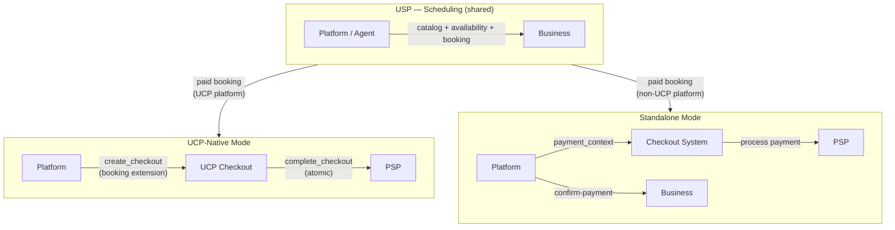

# Core Concepts

USP enables interoperability between platforms, businesses, and payment
providers for service commerce. This page introduces the key roles,
architectural principles, and protocol constructs.

---

## Roles and Participants

USP defines interactions between four participants:

### Platform (Application / Agent)

The consumer-facing surface acting on behalf of the user. Platforms orchestrate
the full journey: catalog discovery, profile discovery, presenting availability,
and facilitating booking and payment.

- **Responsibilities:** Profile discovery via `/.well-known/usp`
  or `/.well-known/ucp`, querying availability, creating bookings, processing
  payment through whichever checkout system is available.
- **Examples:** AI scheduling assistants, super apps, search engines,
  marketplace platforms.

### Business

The entity offering time-based services. The business owns the schedule,
resources, and booking policies. For payment, the business remains the
**Merchant of Record**.

- **Responsibilities:** Publishing a USP profile, exposing a service catalog,
  computing real-time availability, managing the booking lifecycle, providing
  payment actions with `payment_context` for paid services.
- **Examples:** Salons, clinics, fitness studios, restaurants, rental companies,
  consultancies.

### Credential Provider (CP)

A trusted entity that securely manages user payment instruments and identity.
When buyers pay with a wallet or tokenized instrument, the credential
provider — not the platform or business — often holds the sensitive payment
credentials.

- **Examples:** Google Wallet, Apple Pay, digital identity providers.

### Payment Service Provider (PSP)

The financial infrastructure that processes payments. USP delegates all payment
processing to the checkout system, which in turn interacts with the PSP.

- **Examples:** Stripe, Adyen, PayPal, Braintree.

!!! info "Expected Deployment Topology"

    In practice, the business-side USP implementation is almost always provided
    by a **SaaS platform** (e.g., Wix, Square, Mindbody, Booksy) rather than by
    the individual business itself. The salon owner doesn't implement USP
    endpoints — their SaaS platform does, once, on behalf of all its merchants.

    | Side | Who implements | Scale |
    |------|---------------|-------|
    | **Business (server)** | SaaS scheduling platforms | One implementation serves thousands of merchants |
    | **Platform (client)** | Aggregators, AI agents, marketplaces | One integration consumes services across many SaaS providers |

---

## High-Level Architecture

USP supports two deployment modes. Both share the same scheduling layer
(catalog, availability, booking). The payment path diverges based on the
deployment mode:



**[UCP-Native Mode](deployment-modes/ucp-native.md):** Platforms that already
support UCP register USP scheduling capabilities directly in their
`/.well-known/ucp` profile. Paid bookings use UCP's atomic checkout.

**[Standalone Mode](deployment-modes/standalone.md):** Platforms that do not use
UCP discover businesses via `/.well-known/usp`. For paid bookings, the business
returns a `payment_context` that any checkout system can process.

Both modes share the same scheduling operations and transport bindings. For free
services, no checkout system is needed in either mode.

---

## Commerce and Non-Commerce Services

USP supports both **paid services** that require payment integration and **free
or pay-later services** that operate without any payment infrastructure.

| Mode | `requires_payment` | `payment_timing` | Checkout Required? | Booking Flow |
|------|--------------------|------------------|--------------------|--------------|
| **Free** | `false` | N/A | No | `pending` → `confirmed` |
| **Pay at service** | `true` | `at_service` | No | `pending` → `confirmed` (payment collected in person) |
| **Pay at booking** | `true` | `at_booking` | Yes | `pending` → `requires_action` → checkout → `confirmed` |
| **Deposit** | `true` | `deposit_required` | Yes | `pending` → `requires_action` → checkout → `confirmed` |

---

## Core Constructs

USP is built on three constructs:

| Construct | Description | Examples |
|-----------|-------------|----------|
| **Capabilities** | Standalone features a business supports, declared using a registry pattern. Each capability has a namespace, schema, and version. | `dev.usp-protocol.services.catalog`, `dev.usp-protocol.services.availability`, `dev.usp-protocol.services.bookings` |
| **Extensions** | Optional modules that augment a capability via the `extends` field. Extensions use JSON Schema composition (`allOf`, `$defs`). | Waitlist (extends bookings), Paid bookings (extends UCP checkout) |
| **Transport Bindings** | Declarations of how USP traffic is carried. The profile maps service names to arrays of transport-specific bindings. | [REST](transport/rest.md), [MCP](transport/mcp.md), [A2A](transport/a2a.md), [ESP](transport/esp.md) |

---

## Namespace Governance

USP uses reverse-domain notation for capability names:

```
{reverse-domain}.{service}.{capability}
```

| Namespace | Authority | Governance |
|-----------|-----------|------------|
| `dev.usp-protocol.*` | usp.dev | USP governing body |
| `com.{vendor}.*` | {vendor}.com | Vendor organization |
| `org.{org}.*` | {org}.org | Organization |

The `spec` and `schema` URLs on each capability entry **MUST** use origins that
match the reverse-domain namespace authority. For example, `dev.usp-protocol.*`
capabilities must reference `https://usp-protocol.dev/...`.

Within the `dev.usp-protocol.*` namespace:

- `dev.usp-protocol.services.*` — Business-facing capabilities (catalog, availability, bookings)
- `dev.usp-protocol.platform.*` — Platform-scoped capabilities (e.g., calendar free/busy)

---

## Multi-Location Businesses

For businesses with multiple locations, a single USP endpoint **MAY** serve all
locations through a unified profile:

```json
{
  "usp": {
    "version": "2026-08-20",
    "business": {
      "name": "Sunrise Wellness Studio",
      "timezone": "America/New_York",
      "currency": "USD",
      "locations": [
        { "id": "loc_nyc", "name": "NYC Downtown",
          "address": "123 Main St, New York, NY 10001" },
        { "id": "loc_la", "name": "LA West",
          "address": "456 Sunset Blvd, Los Angeles, CA 90028" }
      ]
    }
  }
}
```

Operations accept an optional `location_id` filter to scope requests.
Alternatively, each location **MAY** publish its own independent
`/.well-known/usp` profile.

---

## Error Handling

USP separates **business outcome** feedback from **protocol** failures:

- **Business outcomes:** Successful HTTP exchanges where the business reports a
  scheduling or policy result using a `messages[]` array. Each message uses
  `type`, `code`, `content`, and optional `severity`.
- **Protocol errors:** HTTP status codes with [RFC 9457](https://www.rfc-editor.org/rfc/rfc9457)
  Problem Details (REST) or JSON-RPC `error` objects (MCP).

State-changing operations **SHOULD** use an idempotency key to prevent
duplicate bookings on retry. See [Transport Bindings](transport/index.md) for details.
