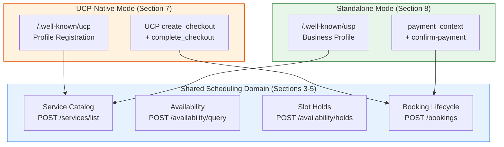

# Deployment Modes

USP supports two deployment modes that share the **same scheduling domain core** (service catalog, availability, and booking lifecycle defined in Sections 3--5 of the specification). The modes differ only in how businesses are **discovered** and how **payments** are processed.

Both modes use identical APIs for listing services, querying availability, holding slots, and managing bookings. Choosing a deployment mode determines the discovery endpoint, the payment flow, and which infrastructure (negotiation, versioning, security) your platform relies on.

---

## Choosing a Mode

!!! tip "Decision Guide"

    The right mode depends on your existing platform infrastructure. If you already use UCP for commerce, UCP-Native gives you single-endpoint discovery and atomic checkout. If you operate independently, Standalone gives you full control.

| If your platform...                                  | Choose this mode                                  |
|-------------------------------------------------------|---------------------------------------------------|
| Already supports the Universal Commerce Protocol (UCP) | **[UCP-Native Mode](ucp-native.md)**             |
| Wants single-endpoint discovery via `/.well-known/ucp` | **[UCP-Native Mode](ucp-native.md)**             |
| Needs atomic payment-plus-booking in one transaction  | **[UCP-Native Mode](ucp-native.md)**             |
| Does not use UCP                                      | **[Standalone Mode](standalone.md)**              |
| Wants a self-contained scheduling protocol            | **[Standalone Mode](standalone.md)**              |
| Wants to support any checkout system (embedded, redirect, ACP) | **[Standalone Mode](standalone.md)** |
| Wants independence from any specific commerce protocol | **[Standalone Mode](standalone.md)**             |

---

## Mode Comparison

| Aspect                     | UCP-Native Mode                                              | Standalone Mode                                               |
|----------------------------|--------------------------------------------------------------|---------------------------------------------------------------|
| **Discovery endpoint**     | `/.well-known/ucp`                                           | `/.well-known/usp`                                            |
| **Profile registration**   | USP capabilities registered inside the UCP profile           | Dedicated USP business profile                                |
| **Scheduling APIs**        | Identical (Sections 3--5)                                    | Identical (Sections 3--5)                                     |
| **Payment mechanism**      | UCP `create_checkout` + `complete_checkout` (atomic)         | `payment_context` on actions + `confirm-payment` (two-phase)  |
| **Atomicity**              | Single transaction at `complete_checkout`                    | Two-phase: pay then confirm                                   |
| **Checkout systems**       | UCP payment handlers                                         | `embedded`, `redirect`, `acp` (declared in profile)           |
| **Capability negotiation** | Inherited from UCP                                           | USP server-selects model (profile-based intersection)         |
| **Versioning**             | Inherited from UCP                                           | USP date-based versioning (`YYYY-MM-DD`)                      |
| **Error model**            | UCP error handling + RFC 9457                                | USP error codes + RFC 9457 Problem Details                    |
| **Security infrastructure**| Inherited from UCP (TLS, OAuth 2.0, webhook signing)         | USP-defined (Sections 9.6, 10.2)                              |
| **Free services**          | `POST /bookings` directly (no checkout)                      | `POST /bookings` directly (no checkout)                       |
| **Identity & consent**     | UCP identity linking and consent                             | Platform-managed                                              |

---

## How the Modes Share the Domain Core

!!! note "Transport bindings are also shared"

    Both modes support the same [transport bindings](../transport/index.md) (REST, MCP, A2A, ESP). The transport layer is independent of the deployment mode.

---

## Next Steps

-   :material-link-variant:{ .lg .middle } **[UCP-Native Mode](ucp-native.md)**

    ---

    For platforms already using UCP. Single discovery endpoint, atomic checkout, inherited infrastructure.

-   :material-puzzle-outline:{ .lg .middle } **[Standalone Mode](standalone.md)**

    ---

    For independent platforms. Dedicated USP profile, flexible checkout systems, self-contained protocol.

