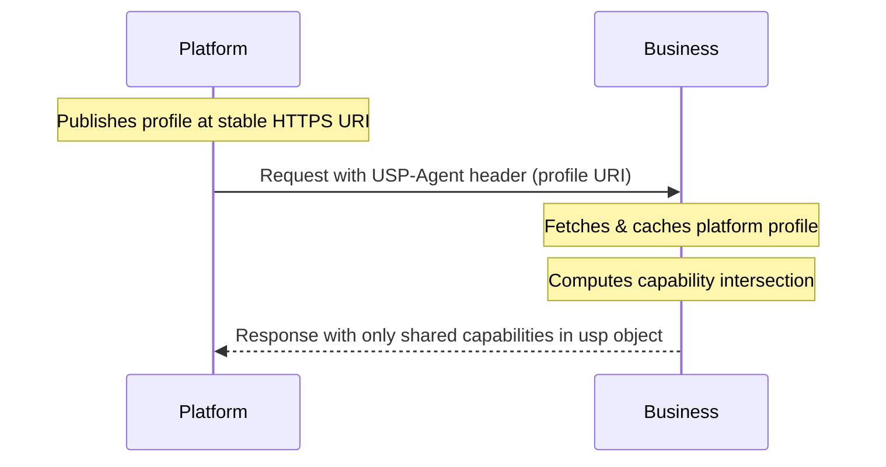
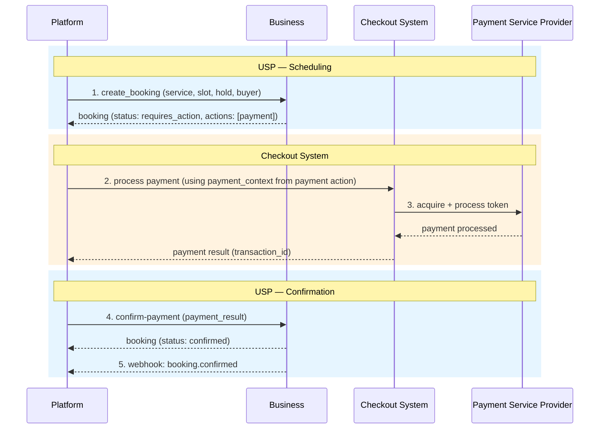
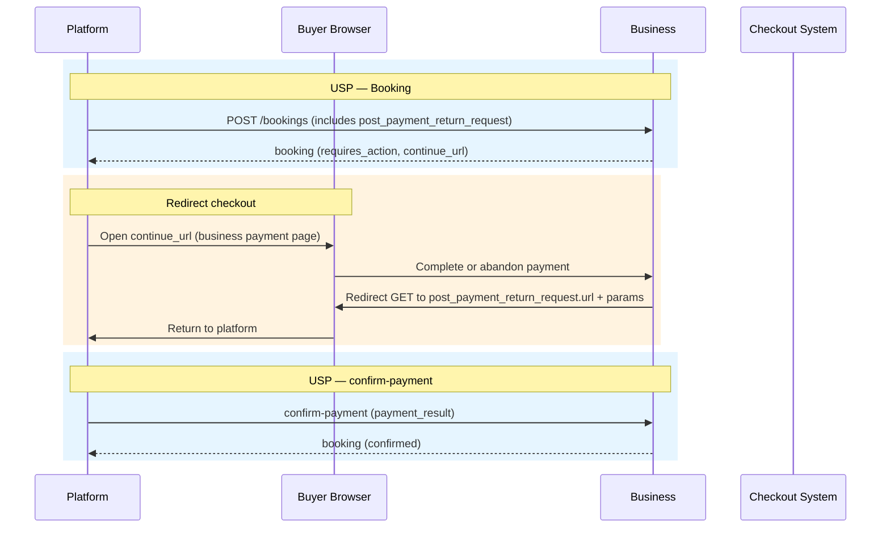
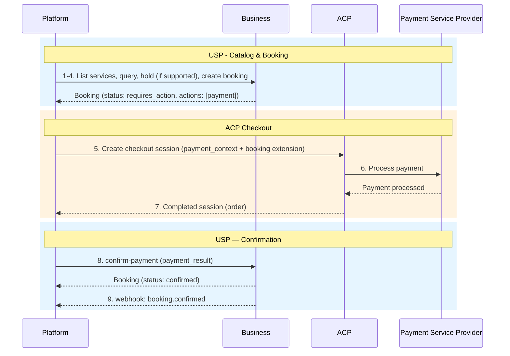
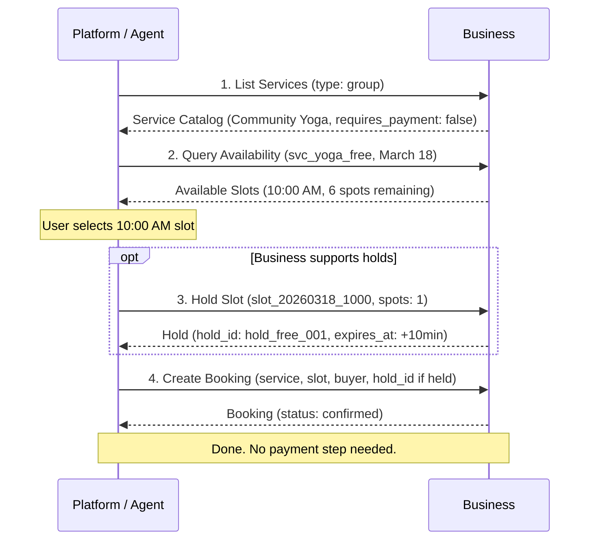
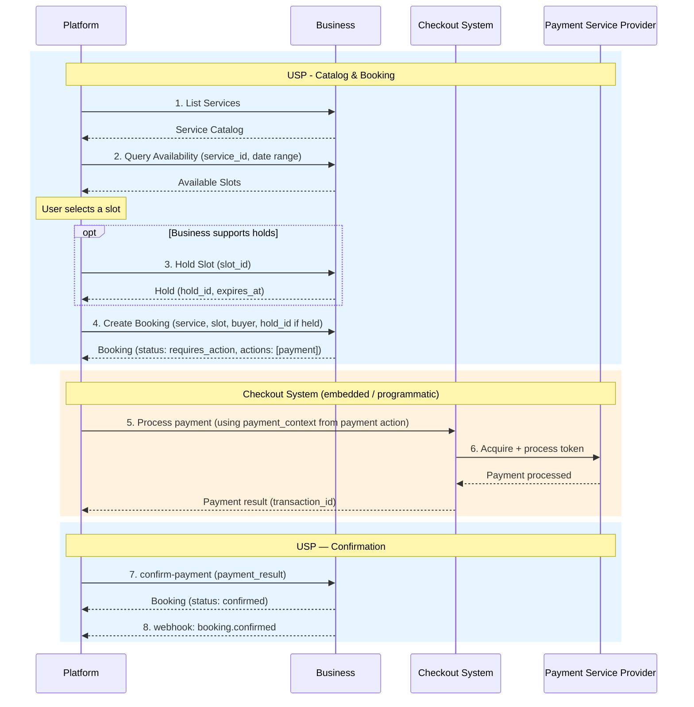
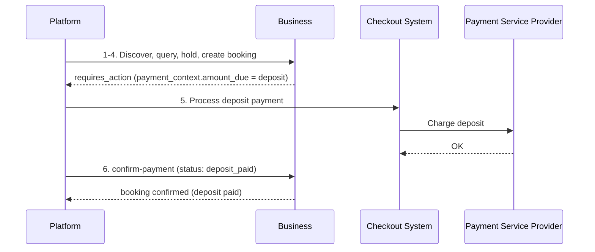

# Standalone Mode

Standalone Mode is the deployment option for platforms that do not use the Universal Commerce Protocol (UCP). In this mode, USP operates as an **independent protocol** with its own discovery, negotiation, and payment infrastructure. Businesses publish a `/.well-known/usp` profile, and payment is handled via the payment action's `payment_context` + `confirm-payment` pattern.

---

## When to Use

!!! success "Choose Standalone Mode when"

    - Your platform does not support UCP
    - You want a self-contained scheduling protocol
    - You want to support any checkout system via generic payment handoff
    - You want independence from any specific commerce protocol

In this mode, the business publishes a `/.well-known/usp` profile and implements USP's own infrastructure for negotiation, versioning, and security (Sections 9.6 and 10.2).

---

## Business Profile (`/.well-known/usp`)

Businesses publish their USP profile at `/.well-known/usp`. This document is the **single source of truth** for **profile discovery** (endpoint and capability resolution), capability negotiation, and webhook verification key distribution. Platforms fetch this document to determine which transports, capabilities, and checkout systems the business supports before initiating any scheduling interactions.

### Full Profile Example

```json
{
  "usp": {
    "version": "2026-02-09",
    "services": {
      "dev.usp.services": [
        {
          "version": "2026-02-09",
          "spec": "https://usp.dev/specification",
          "transport": "rest",
          "endpoint": "https://business.example.com/usp/v1",
          "schema": "https://usp.dev/services/rest.openapi.json"
        },
        {
          "version": "2026-02-09",
          "spec": "https://usp.dev/specification",
          "transport": "mcp",
          "endpoint": "https://business.example.com/usp/mcp",
          "schema": "https://usp.dev/services/mcp.openrpc.json"
        }
      ]
    },
    "capabilities": {
      "dev.usp.services.catalog": [
        {
          "version": "2026-02-09",
          "spec": "https://usp.dev/specification#3-service-catalog",
          "schema": "https://usp.dev/schemas/services/catalog.json"
        }
      ],
      "dev.usp.services.availability": [
        {
          "version": "2026-02-09",
          "holds": true,
          "spec": "https://usp.dev/specification#4-availability",
          "schema": "https://usp.dev/schemas/services/availability.json"
        }
      ],
      "dev.usp.services.bookings": [
        {
          "version": "2026-02-09",
          "spec": "https://usp.dev/specification#5-booking-lifecycle",
          "schema": "https://usp.dev/schemas/services/booking.json"
        }
      ]
    },
    "checkout_systems": [
      "acp",
      "redirect"
    ],
    "business": {
      "name": "Sunrise Wellness Studio",
      "timezone": "America/New_York",
      "currency": "USD"
    }
  },
  "signing_keys": [
    {
      "kid": "usp-webhook-key-2026-02",
      "kty": "EC",
      "crv": "P-256",
      "x": "...",
      "y": "...",
      "use": "sig",
      "alg": "ES256"
    }
  ]
}
```

### Profile Fields

The `usp` object contains:

| Field               | Type   | Required | Description                                                                                   |
|---------------------|--------|----------|-----------------------------------------------------------------------------------------------|
| `version`           | string | **Yes**  | USP protocol version implemented (`YYYY-MM-DD`).                                             |
| `services`          | object | **Yes**  | Service endpoint registry. Keys are reverse-domain service names; values are arrays of **ServiceBinding** objects. |
| `capabilities`      | object | **Yes**  | Capability registry. Keys are reverse-domain capability names; values are arrays of **ProfileCapabilityEntry** objects. |
| `checkout_systems`  | array  | No       | Checkout systems for paid bookings: `acp`, `redirect`, `embedded`. Omit for free-only services. |
| `business`          | object | **Yes**  | Business identity: `name`, `timezone` (IANA), `currency` (ISO 4217), optional `locations`.   |
| `supported_versions`| object | No       | Backward-compatibility map. Keys are older versions; values are URIs to version-specific profiles. |

Each **ServiceBinding** entry:

| Field      | Type       | Required    | Description                                                    |
|------------|------------|-------------|----------------------------------------------------------------|
| `version`  | string     | **Yes**     | Protocol version at this endpoint (`YYYY-MM-DD`).             |
| `transport`| string     | **Yes**     | Transport protocol: `rest`, `mcp`, `a2a`, or `embedded`.      |
| `endpoint` | string URI | Conditional | Base URL. **Required** for `rest`, `mcp`, and `a2a`.          |
| `spec`     | string URI | No          | URL to the human-readable specification. Recommended.         |
| `schema`   | string URI | No          | URL to the machine-readable schema. Recommended.              |

### Profile Hosting Requirements

| Requirement       | Rule                                                                                     |
|--------------------|------------------------------------------------------------------------------------------|
| **Transport**      | **MUST** be served over HTTPS. Plaintext HTTP **MUST** be rejected.                      |
| **Redirects**      | **MUST NOT** issue HTTP 3xx redirects on the profile URL.                                |
| **Cache-Control**  | **MUST** include `Cache-Control: public, max-age=<N>` where N >= 60.                    |
| **Content-Type**   | **MUST** return `Content-Type: application/json`.                                         |
| **Schema**         | **MUST** conform to `schemas/profile.json` (`$defs/BusinessProfile`).                    |

### Checkout Systems

The `checkout_systems` field declares which checkout paths the business supports for paid bookings. Platforms use this field during **profile discovery** or **platform onboarding** to determine compatibility - it is not consulted per-transaction. See [Specification Overview - Terminology](../specification/index.md#terminology).

| Value      | Description                                                                              |
|------------|------------------------------------------------------------------------------------------|
| `embedded` | Platform processes payment programmatically using `payment_context` + `confirm-payment`. |
| `redirect` | Business provides a `continue_url` on the payment action for buyer-facing payment.       |
| `acp`      | Business supports ACP checkout sessions with the USP booking extension.                  |

!!! info "Free services"

    A business offering only free or pay-at-service services **MAY** omit `checkout_systems` entirely.

!!! note "Platform onboarding is out-of-band"

    USP does not define how a platform-business relationship is established. The `checkout_systems` field and `/.well-known/usp` profile provide the information needed for compatibility assessment during profile discovery, but **platform onboarding** (OAuth, DCR, credential storage, and related integration) occurs out-of-band.

---

## Capability Negotiation

USP uses a **server-selects** negotiation model. There is no handshake -- the business computes the intersection of its own capabilities and the platform's capabilities, activating only shared capabilities on every response.



**Algorithm:**

1. **Platform advertises its profile URI** on every request via `USP-Agent` header (REST) or `_meta.usp.profile` field (MCP).
2. **Business fetches and caches** the platform profile lazily on first contact, then refreshes per `Cache-Control` TTL (minimum 60 seconds).
3. **Business computes the intersection**: capability keys present in both profiles. For each shared key, the highest mutually supported version is selected.
4. **Business responds using only intersection capabilities.** Orphaned extensions are pruned.
5. **Every response includes a `usp` object** declaring the active version and negotiated capabilities.
6. **If the intersection is empty**, the business returns a `capabilities_incompatible` error.

**Example response `usp` object** (negotiated intersection):

```json
{
  "usp": {
    "version": "2026-02-09",
    "capabilities": {
      "dev.usp.services.catalog": [
        { "version": "2026-02-09" }
      ],
      "dev.usp.services.availability": [
        { "version": "2026-02-09" }
      ],
      "dev.usp.services.bookings": [
        { "version": "2026-02-09" }
      ]
    }
  }
}
```

---

## Versioning

USP uses **date-based versioning** (`YYYY-MM-DD` format) for protocol versions, capability versions, and transport binding versions.

| Condition                           | Behavior                                                                    |
|-------------------------------------|-----------------------------------------------------------------------------|
| Platform version <= Business version | Business processes the request using the platform's version semantics.     |
| Platform version > Business version  | Business **MUST** return a `version_unsupported` error with the latest supported version. |

**Backwards compatibility rules:**

- :material-check-circle:{ .green } **Non-breaking:** Adding optional fields, new capabilities, new enum values, new error codes
- :material-close-circle:{ .red } **Breaking:** Removing fields, changing types, changing semantics

Capabilities are versioned independently. A business supporting multiple versions declares them in the capabilities registry:

```json
"capabilities": {
  "dev.usp.services.catalog": [
    { "version": "2026-02-09" },
    { "version": "2026-06-15" }
  ]
}
```

### Backward Compatibility

The optional `supported_versions` field enables businesses to continue serving older platforms:

```json
{
  "usp": {
    "version": "2026-06-01",
    "supported_versions": {
      "2026-02-09": "https://business.example.com/.well-known/usp-2026-02-09"
    }
  }
}
```

!!! tip

    Businesses that upgrade to a new USP version **SHOULD** advertise prior supported versions for at least 90 days.

---

## Payment Integration

USP defines **when** payment is required and provides a universal payment handoff mechanism. This section applies when `requires_payment: true` and `payment_timing` is `at_booking` or `deposit_required`.

### Payment Schema

The `payment` object on the booking tracks the lifecycle of payment:

| Field             | Type    | Required    | Description                                                      |
|-------------------|---------|-------------|------------------------------------------------------------------|
| `status`          | string  | **Yes**     | `not_required`, `pending`, `deposit_paid`, `paid`, `refunded`, `partially_refunded` |
| `timing`          | string  | **Yes**     | Mirrors the service's `payment_timing`: `at_booking`, `at_service`, `deposit_required` |
| `amount`          | integer | Conditional | Service fee in minor currency units, **before tax**. Required when `timing` is `at_booking` or `deposit_required`. |
| `currency`        | string  | Conditional | ISO 4217 currency code. Required when `amount` is present.       |
| `amount_due`      | integer | Conditional | Amount due now in minor currency units. Required when `timing` is `at_booking` or `deposit_required`. |
| `tax_amount`      | integer | No          | Tax in minor currency units. Total charged = `amount + tax_amount`. |
| `deposit_amount`  | integer | No          | Deposit amount when `timing` is `deposit_required`.               |
| `transaction_id`  | string  | No          | Transaction ID from the payment provider, set after `confirm-payment`. |
| `order_reference` | string  | No          | External order ID from the checkout system.                       |

### Payment Context

The `PaymentContext` is a **handoff object** nested inside a payment action in the booking's `actions` array. It contains everything a checkout system needs to process payment:

| Field         | Type              | Required | Description                                                |
|---------------|-------------------|----------|------------------------------------------------------------|
| `amount_due`  | integer           | **Yes**  | Amount to collect in minor currency units.                 |
| `currency`    | string            | **Yes**  | ISO 4217 currency code.                                    |
| `description` | string            | **Yes**  | Human-readable description of the payment.                 |
| `line_items`  | Array\[LineItem\] | **Yes**  | Itemized breakdown: `label`, `amount`, `quantity`, `item_id`. |
| `tax_amount`  | integer           | No       | Tax portion of `amount_due` in minor units.                |
| `metadata`    | object            | **Yes**  | Machine-readable context: `booking_id`, `service_id`, `service_type`, optional `slot_start`. |

### Confirm Payment

The `POST /bookings/{booking_id}/confirm-payment` endpoint is called by the platform after successfully processing payment. The business validates the booking, amount, and currency, then completes the payment action. If no pending actions remain, the booking transitions to `confirmed`.

!!! warning "Payment expiry"

    When a payment action's `expires_at` passes without `confirm-payment`, the business **SHOULD** set the action status to `expired`. If no other pending actions remain, the booking **MUST** transition to `canceled`. A late `confirm-payment` **MUST** return the canceled booking with code `payment_expired`.

### Embedded / Generic Payment Flow

When `checkout_systems` includes `embedded`, the platform processes payment **programmatically** using the `payment_context` from the payment action.



### Redirect Payment Flow

When `checkout_systems` includes `redirect`, the buyer completes payment on the business-hosted page at the payment action's `continue_url`. The platform sends `post_payment_return_request` so the business can return the buyer afterward.



!!! info "Post-payment return"

    The platform **SHOULD** include a `post_payment_return_request` in the `POST /bookings` request when using the redirect path. Without it, the platform has no way to control where the buyer's browser lands after payment.

    | Field    | Type   | Required | Description                                          |
    |----------|--------|----------|------------------------------------------------------|
    | `url`    | string | **Yes**  | The platform's return URL.                           |
    | `params` | object | No       | Query parameters appended verbatim to `url` on redirect. Opaque to the business. |

### ACP Payment Flow

When `checkout_systems` includes `acp`, the platform maps the USP payment action to an [ACP](https://agenticcommerce.dev/) checkout session, then confirms via USP `confirm-payment`.

USP defines `dev.usp.services.booking` as a proper ACP extension using ACP's `capabilities.extensions` mechanism:

```json
{
  "capabilities": {
    "extensions": [
      {
        "name": "dev.usp.services.booking",
        "extends": ["$.CheckoutSession.booking"],
        "spec": "https://usp.dev/specification#856-acp-booking-extension",
        "schema": "https://usp.dev/schemas/acp_booking_extension.json"
      }
    ]
  }
}
```



**ACP line item mapping:**

| USP `payment_context` Field         | ACP Checkout Session Field           |
|--------------------------------------|--------------------------------------|
| `line_items[].item_id`              | `line_items[].item.id`              |
| `line_items[].label`                | `line_items[].item.name`            |
| `line_items[].amount`               | `line_items[].item.unit_amount`     |
| `line_items[].quantity`             | `line_items[].quantity`             |
| `amount_due`                        | `totals` entry with `type: "total"` |
| `currency`                          | `currency` (lowercase per ACP)      |
| `metadata.booking_id`              | `booking.booking_id`                |
| `metadata.service_id`              | `booking.service_id`                |
| `metadata.service_type`            | `booking.service_type`              |
| `metadata.slot_start`              | `booking.slot.start`                |

!!! note "Currency convention"

    ACP uses lowercase ISO 4217 codes (e.g., `"usd"`). Platforms **MUST** normalize USP's uppercase currency values when constructing the ACP session.

### Deposit and Refund Rules

| Scenario                   | `amount_due`   | Behavior                                          |
|----------------------------|----------------|---------------------------------------------------|
| `at_booking`               | Full amount    | Payment must complete before booking confirms.    |
| `deposit_required`         | Deposit amount | Deposit collected now; remainder at service time. |
| `at_service`               | 0              | No upfront payment; collected in person.          |
| Cancellation (free window) | --             | Full refund of collected amount.                  |
| Cancellation (late)        | --             | Refund = collected - cancellation fee.            |
| Business-initiated cancel  | --             | Full refund. No fees.                             |

---

## End-to-End Flows

### Free Service Flow

Same scheduling path as the UCP-Native free service flow; only discovery uses `/.well-known/usp` instead of UCP.



=== "Request"

    ```json
    {
      "service_id": "svc_yoga_free",
      "slot_id": "slot_20260318_1000",
      "hold_id": "hold_free_001",
      "buyer": {
        "first_name": "Alice",
        "last_name": "Williams",
        "email": "alice@example.com",
        "phone_number": "+12125551234"
      },
      "party_size": 1
    }
    ```

=== "Response"

    ```json
    {
      "booking": {
        "id": "bkg_789ghi",
        "service_id": "svc_yoga_free",
        "status": "confirmed",
        "confirmation_mode": "auto"
      }
    }
    ```

### Embedded Payment Flow (Paid Service)

When `checkout_systems` includes `embedded`, the platform charges the buyer using the `payment_context`, then calls `confirm-payment`.

!!! example "Applies when"

    - Deployment mode: **Standalone**
    - `checkout_systems` includes `"embedded"`
    - Service: `requires_payment: true`, `payment_timing: at_booking`, `confirmation_mode: auto`



=== "Create Booking Request"

    ```json
    {
      "service_id": "svc_massage_001",
      "slot_id": "slot_20260316_1400",
      "hold_id": "hold_xyz789",
      "buyer": {
        "first_name": "Alice",
        "last_name": "Williams",
        "email": "alice@example.com",
        "phone_number": "+12125551234"
      },
      "party_size": 1
    }
    ```

=== "Confirm Payment Request"

    ```json
    {
      "payment_result": {
        "status": "paid",
        "provider": "stripe",
        "transaction_id": "txn_abc123",
        "amount_paid": 12000,
        "currency": "USD",
        "order_reference": "ord_xyz789"
      }
    }
    ```

=== "Confirm Payment Response"

    ```json
    {
      "booking": {
        "id": "bkg_456def",
        "status": "confirmed",
        "payment": {
          "status": "paid",
          "timing": "at_booking",
          "amount": 12000,
          "currency": "USD",
          "amount_due": 0,
          "transaction_id": "txn_abc123"
        }
      }
    }
    ```

### Redirect Payment Flow (Paid Service)

When `checkout_systems` includes `redirect`, the buyer completes payment on the business-hosted page.

=== "Create Booking Request (with return URL)"

    ```json
    {
      "service_id": "svc_massage_001",
      "slot_id": "slot_20260316_1400",
      "hold_id": "hold_xyz789",
      "buyer": {
        "first_name": "Alice",
        "last_name": "Williams",
        "email": "alice@example.com"
      },
      "party_size": 1,
      "post_payment_return_request": {
        "url": "https://platform.example.com/booking/return",
        "params": { "session_id": "plat-sess-abc123" }
      }
    }
    ```

### ACP Payment Flow (Paid Service)

When `checkout_systems` includes `acp`, the platform maps the USP payment action to an ACP checkout session, then confirms via USP `confirm-payment`.

**ACP checkout session (with USP booking extension):**

```json
{
  "id": "cs_usp_001",
  "status": "ready_for_payment",
  "currency": "usd",
  "line_items": [
    {
      "id": "li_001",
      "item": {
        "id": "svc_massage_001",
        "name": "Deep Tissue Massage",
        "unit_amount": 12000
      },
      "quantity": 1,
      "totals": [
        { "type": "subtotal", "display_text": "Subtotal", "amount": 12000 },
        { "type": "total", "display_text": "Total", "amount": 12000 }
      ]
    }
  ],
  "totals": [
    { "type": "subtotal", "display_text": "Subtotal", "amount": 12000 },
    { "type": "total", "display_text": "Total", "amount": 12000 }
  ],
  "fulfillment_options": [],
  "capabilities": {
    "extensions": [
      {
        "name": "dev.usp.services.booking",
        "extends": ["$.CheckoutSession.booking"]
      }
    ]
  },
  "booking": {
    "booking_id": "bkg_456def",
    "service_id": "svc_massage_001",
    "service_type": "appointment",
    "slot": {
      "start": "2026-03-16T14:00:00-04:00",
      "end": "2026-03-16T15:00:00-04:00"
    }
  }
}
```

### Deposit Flow (Paid Service)

A paid booking with `payment_timing: deposit_required`. The payment action's `payment_context.amount_due` is the deposit; `payment.amount` carries the full service price.



=== "Booking Response (deposit)"

    ```json
    {
      "booking": {
        "id": "bkg_deposit_001",
        "status": "requires_action",
        "payment": {
          "status": "pending",
          "timing": "deposit_required",
          "amount": 12000,
          "currency": "USD",
          "amount_due": 6000,
          "deposit_amount": 6000
        },
        "actions": [
          {
            "type": "payment",
            "status": "pending",
            "continue_url": "https://business.example.com/pay/bkg_deposit_001",
            "expires_at": "2026-03-16T13:10:00-04:00",
            "payment_context": {
              "amount_due": 6000,
              "currency": "USD",
              "description": "Deposit: Deep Tissue Massage - Mar 16, 2:00 PM",
              "line_items": [
                {
                  "label": "Deep Tissue Massage (deposit)",
                  "amount": 6000,
                  "quantity": 1,
                  "item_id": "svc_massage_001"
                }
              ],
              "metadata": {
                "booking_id": "bkg_deposit_001",
                "service_id": "svc_massage_001",
                "service_type": "appointment",
                "slot_start": "2026-03-16T14:00:00-04:00"
              }
            }
          }
        ]
      }
    }
    ```

=== "Confirm Payment (deposit)"

    ```json
    {
      "payment_result": {
        "status": "deposit_paid",
        "provider": "stripe",
        "transaction_id": "txn_dep_001",
        "amount_paid": 6000,
        "currency": "USD",
        "order_reference": "ord_dep_001"
      }
    }
    ```

---

## Payment Path Comparison

This table compares **all** payment paths across both [UCP-Native Mode](ucp-native.md) and Standalone Mode.

| Aspect                   | Free Service | UCP Checkout | Embedded  | Redirect  | ACP       | Deposit   |
|--------------------------|:---:|:---:|:---:|:---:|:---:|:---:|
| **Deployment mode**      | Both | UCP-Native | Standalone | Standalone | Standalone | Standalone |
| **USP scheduling steps** | List / query / hold / create booking | List / query / hold / (checkout replaces create booking) | List / query / hold / create booking | Same as Embedded | Same as Embedded | Same as Embedded |
| **Payment mechanism**    | None | UCP `create_checkout` + `complete_checkout` | `payment_context` + `confirm-payment` | Same + browser `continue_url` + `post_payment_return_request` | ACP session + `confirm-payment` | `confirm-payment` with `deposit_paid` |
| **Checkout calls**       | None | UCP | Platform PSP | Business page + PSP | ACP + PSP | Platform or redirect PSP |
| **Atomicity**            | N/A | Single UCP transaction | Two-phase (pay then confirm) | Two-phase | Two-phase | Two-phase (deposit now) |
| **Buyer redirect**       | No | Per UCP escalation | Optional (`continue_url`) | Yes (payment or return URL) | Per ACP | Optional |
