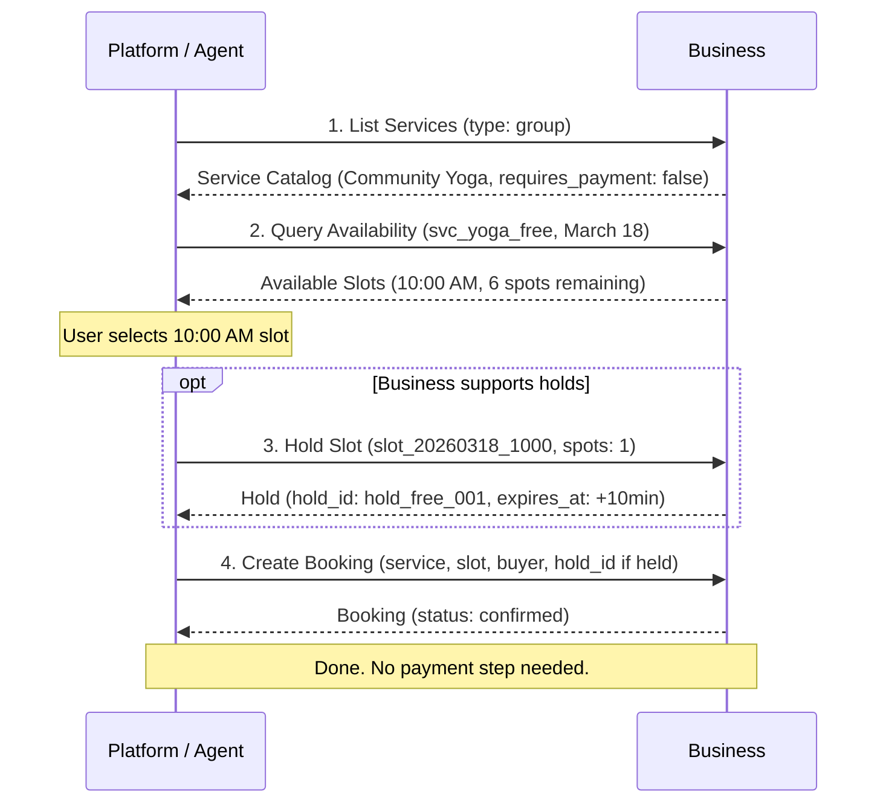
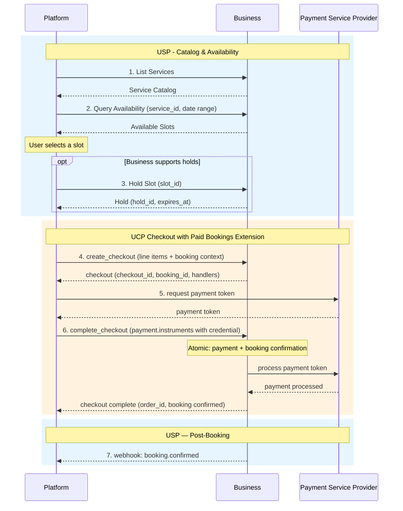

# UCP-Native Mode

UCP-Native Mode is the deployment option for platforms that already support the [Universal Commerce Protocol (UCP)](https://ucp.dev). In this mode, USP scheduling capabilities register directly in the UCP profile, giving agents a **single profile-discovery endpoint** for everything -- shopping, services, and scheduling. Paid bookings use UCP's **atomic checkout**, eliminating the two-phase `confirm-payment` pattern.

---

## When to Use

!!! success "Choose UCP-Native Mode when"

    - Your platform already supports UCP for commerce
    - You want single-endpoint profile discovery via `/.well-known/ucp`
    - You want atomic payment-plus-booking confirmation (no two-phase `confirm-payment`)
    - You want to inherit UCP's infrastructure (negotiation, versioning, error model, security)

!!! info "No separate USP profile"

    In UCP-Native Mode, there is **no** `/.well-known/usp` profile. All capabilities -- shopping, services, scheduling -- are registered in the UCP profile. The scheduling domain (Sections 3--5) works identically; only the profile discovery and payment paths differ from [Standalone Mode](standalone.md).

---

## Profile Registration in `/.well-known/ucp`

Businesses register USP scheduling capabilities in their UCP profile alongside other UCP capabilities. The profile declares both UCP and USP services and capabilities in a single document.

### Full Profile (Paid + Free Services)

```json
{
  "ucp": {
    "version": "2026-01-11",
    "services": {
      "dev.ucp.shopping": [
        {
          "version": "2026-01-11",
          "spec": "https://ucp.dev/latest/specification/overview/",
          "transport": "rest",
          "endpoint": "https://business.example.com/ucp/v1",
          "schema": "https://ucp.dev/schemas/shopping/rest.openapi.json"
        }
      ],
      "dev.usp.services": [
        {
          "version": "2026-02-09",
          "spec": "https://usp.dev/specification",
          "transport": "rest",
          "endpoint": "https://business.example.com/usp/v1",
          "schema": "https://usp.dev/services/rest.openapi.json",
          "config": {
            "authorization": {
              "privileged_operations_require_authentication": true,
              "accepted_mechanisms": [
                "http_message_signature",
                "booking_scoped_credential"
              ]
            }
          }
        }
      ]
    },
    "capabilities": {
      "dev.ucp.shopping.checkout": [
        {
          "version": "2026-01-11"
        }
      ],
      "dev.usp.services.catalog": [
        {
          "version": "2026-02-09",
          "spec": "https://usp.dev/specification#3-service-catalog",
          "schema": "https://usp.dev/schemas/services/catalog.json"
        }
      ],
      "dev.usp.services.availability": [
        {
          "version": "2026-02-09",
          "holds": true,
          "spec": "https://usp.dev/specification#4-availability",
          "schema": "https://usp.dev/schemas/services/availability.json"
        }
      ],
      "dev.usp.services.bookings": [
        {
          "version": "2026-02-09",
          "spec": "https://usp.dev/specification#5-booking-lifecycle",
          "schema": "https://usp.dev/schemas/services/booking.json"
        }
      ],
      "dev.usp.services.paid_bookings": [
        {
          "version": "2026-02-09",
          "spec": "https://usp.dev/specification#7-ucp-native-mode",
          "schema": "https://usp.dev/schemas/services/paid_bookings.json",
          "extends": "dev.ucp.shopping.checkout"
        }
      ]
    },
    "business": {
      "name": "Sunrise Wellness Studio",
      "timezone": "America/New_York",
      "currency": "USD"
    }
  }
}
```

### Free-Service-Only Profile

Businesses offering only free services omit `dev.ucp.shopping.checkout` and `dev.usp.services.paid_bookings`:

```json
{
  "ucp": {
    "version": "2026-01-11",
    "services": {
      "dev.usp.services": [
        {
          "version": "2026-02-09",
          "spec": "https://usp.dev/specification",
          "transport": "rest",
          "endpoint": "https://business.example.com/usp/v1",
          "schema": "https://usp.dev/services/rest.openapi.json",
          "config": {
            "authorization": {
              "privileged_operations_require_authentication": true,
              "accepted_mechanisms": ["http_message_signature"]
            }
          }
        }
      ]
    },
    "capabilities": {
      "dev.usp.services.catalog": [
        {
          "version": "2026-02-09"
        }
      ],
      "dev.usp.services.availability": [
        {
          "version": "2026-02-09"
        }
      ],
      "dev.usp.services.bookings": [
        {
          "version": "2026-02-09"
        }
      ]
    }
  }
}
```

!!! note "Mixed carts"

    A single UCP checkout session may contain additional product-only `line_items` (UCP shopping) alongside the service line item. The service line item in `line_items` **MUST** match `booking.service_id`. This supports mixed carts (e.g., a retail product plus a scheduled service).

---

## Inherited Infrastructure

In UCP-Native Mode, the following infrastructure is inherited from UCP. USP does not redefine these concerns:

| Concern                | Provided By                        | UCP Reference             |
|------------------------|------------------------------------|---------------------------|
| Discovery              | `/.well-known/ucp`                 | UCP Profile Specification |
| Capability Negotiation | UCP negotiation protocol           | UCP Negotiation           |
| Versioning             | UCP version format and negotiation | UCP Versioning            |
| Error Model            | UCP error handling + RFC 9457      | UCP Error Handling        |
| Idempotency            | UCP idempotency key support        | UCP Idempotency           |
| Webhook Signing        | UCP webhook infrastructure         | UCP Webhooks              |
| Identity Linking       | UCP identity linking               | UCP Identity              |
| Buyer Consent          | UCP consent mechanism              | UCP Consent               |
| Transport Security     | UCP TLS requirements               | UCP Security              |
| Authentication         | UCP OAuth 2.0 support              | UCP Auth                  |
| Rate Limiting          | UCP rate limiting framework        | UCP Rate Limiting         |

!!! tip "Reading guidance"

    In UCP-Native Mode, read Sections 9.1--9.5 and 10.1 for USP-specific details (error codes, method mappings, webhook payload schemas). **Skip Sections 9.6 and 10.2** -- those are infrastructure requirements for Standalone Mode that UCP already provides.

---

## Paid Bookings Extension Schema

**Capability:** `dev.usp.services.paid_bookings` (extends `dev.ucp.shopping.checkout`)

The paid bookings extension adds a `booking` object to the UCP checkout. This object carries the scheduling context -- the slot, service, hold, resources, and booking status -- as a first-class, schema-validated extension field.

The extension schema uses `allOf` composition with `$defs` keyed by `dev.ucp.shopping.checkout`, consistent with UCP's schema composition model.

### Create Checkout Request

```json
{
  "line_items": [
    {
      "id": "li_1",
      "item": {
        "id": "svc_massage_001",
        "title": "Deep Tissue Massage",
        "price": 12000
      },
      "quantity": 1
    }
  ],
  "currency": "USD",
  "buyer": {
    "email": "alice@example.com",
    "first_name": "Alice",
    "last_name": "Williams"
  },
  "booking": {
    "service_id": "svc_massage_001",
    "service_type": "appointment",
    "slot": {
      "id": "slot_20260316_1400",
      "start": "2026-03-16T14:00:00-04:00",
      "end": "2026-03-16T15:00:00-04:00",
      "duration": "PT60M"
    },
    "hold_id": "hold_xyz789",
    "resources": [
      {
        "id": "staff_jane",
        "type": "staff",
        "name": "Jane Smith"
      }
    ],
    "party_size": 1,
    "confirmation_mode": "auto",
    "notes": "First time visit"
  }
}
```

### Checkout Response

```json
{
  "ucp": {
    "version": "2026-01-11",
    "capabilities": {
      "dev.ucp.shopping.checkout": [
        { "version": "2026-01-11" }
      ],
      "dev.usp.services.paid_bookings": [
        { "version": "2026-02-09" }
      ]
    },
    "payment_handlers": {
      "com.stripe.agentic_commerce.shared_payment_token": [
        {
          "id": "stripe_spt_demo_h1",
          "version": "2026-01-11",
          "spec": "https://docs.stripe.com/agentic-commerce/protocol",
          "schema": "https://docs.stripe.com/agentic-commerce/concepts/shared-payment-tokens",
          "available_instruments": [
            { "type": "shared_payment_token" }
          ],
          "config": {
            "publishable_key": "pk_test_ExampleNotForProduction"
          }
        }
      ]
    }
  },
  "id": "chk_abc123",
  "status": "ready_for_complete",
  "line_items": [
    {
      "id": "li_1",
      "item": {
        "id": "svc_massage_001",
        "title": "Deep Tissue Massage",
        "price": 12000
      },
      "quantity": 1
    }
  ],
  "links": [
    {
      "type": "cancellation_policy",
      "url": "https://business.example.com/cancellation-policy"
    },
    {
      "type": "terms_of_service",
      "url": "https://business.example.com/terms"
    }
  ],
  "booking": {
    "booking_id": "bkg_456def",
    "service_id": "svc_massage_001",
    "service_type": "appointment",
    "slot": {
      "id": "slot_20260316_1400",
      "start": "2026-03-16T14:00:00-04:00",
      "end": "2026-03-16T15:00:00-04:00",
      "duration": "PT60M"
    },
    "hold_id": "hold_xyz789",
    "resources": [
      {
        "id": "staff_jane",
        "type": "staff",
        "name": "Jane Smith"
      }
    ],
    "booking_status": "pending",
    "confirmation_mode": "auto"
  },
  "totals": [
    { "type": "subtotal", "amount": 12000 },
    { "type": "total", "amount": 12000 }
  ]
}
```

### Booking Object Fields

| Field               | Type            | Required                | Description                                                                            |
|---------------------|-----------------|-------------------------|----------------------------------------------------------------------------------------|
| `booking_id`        | string          | **Yes** (response only) | Unique booking identifier, generated by the business when the checkout is created.     |
| `service_id`        | string          | **Yes**                 | The service being booked.                                                              |
| `service_type`      | string          | **Yes**                 | The service vertical (e.g., `appointment`, `group`, `reservation`, `rental`, `field_service`). |
| `slot`              | object          | **Yes**                 | `{id, start, end, duration}` -- the booked time slot.                                  |
| `hold_id`           | string          | No                      | The hold ID if a slot was held.                                                        |
| `resources`         | Array\[object\] | No                      | `{id, type, name}` -- requested resources.                                             |
| `party_size`        | integer         | No                      | Number of participants. Default: 1.                                                    |
| `confirmation_mode` | string          | No                      | `auto` or `manual`.                                                                    |
| `booking_status`    | string          | **Yes** (response only) | Checkout-scoped status: `pending`, `confirmed`, or `canceled`. Derived from UCP checkout status. Not the same as the full `Booking.status` lifecycle. |
| `actions`           | Array\[Action\] | No                      | Non-payment actions (e.g., waiver). **MAY** appear when `create_checkout` requires buyer steps before payment. |
| `notes`             | string          | No                      | Buyer-provided special requests.                                                       |

!!! warning "Price consistency"

    `line_items[].item.price` **MUST** match the service's current catalog price. If the business detects a mismatch at `create_checkout` or `update_checkout`, it **MUST** return a business outcome message with code `price_mismatch` and severity `recoverable`.

### Payment handlers (UCP)

`ucp.payment_handlers` uses **reverse-domain keys** mapping to **arrays** of handler instances (`id`, `version`, optional `spec`, `schema`, `config`, `available_instruments`) per the [UCP payment architecture](https://ucp.dev/latest/specification/overview/#payment-architecture). Profile handlers are indicative; **`available_instruments` on the checkout response is authoritative** when present. On `complete_checkout`, each `payment.instruments[].handler_id` **MUST** match the handler instance `id` from that checkout (see [Paid Bookings Extension Schema](#paid-bookings-extension-schema) on this page).

---

## Checkout Flow and Atomicity Guarantee

### Booking Status Derivation

The `BookingContext.booking_status` inside the checkout is a **checkout-scoped** summary -- not the same as the full `Booking.status` lifecycle (`pending`, `requires_action`, `confirmed`, `in_progress`, `completed`, `no_show`, `canceled`).

It is derived from the UCP checkout status:

| UCP Checkout Status | `booking_status` Result |
|---------------------|-------------------------|
| `completed`         | `confirmed` (when `confirmation_mode: auto`) or `pending` (when `manual`) |
| `canceled`          | `canceled`              |
| Any other status    | `pending`               |

### Checkout Steps

When the platform detects `dev.usp.services.paid_bookings` in the UCP profile, it uses this flow:

1. **[USP] Discover services** via `POST /services/list`
2. **[USP] Query availability** via `POST /availability/query`
3. *(If business supports holds)* **[USP] Hold the slot** via `POST /availability/holds`
4. **[UCP] Create checkout** with the booking extension (including `hold_id` if step 3 was performed). No separate `create_booking` call is needed.
5. *(If non-payment actions are present)* **[USP] Complete non-payment actions.** Present actions to the buyer in array order. Non-payment actions **SHOULD** be resolved before payment.
6. **[UCP] Acquire payment token** from the PSP using handler instances and resolved `available_instruments` from the **checkout response** (profile handlers are not authoritative for instruments when checkout supplies `available_instruments`).
7. **[UCP] Complete checkout** with the payment token. The business atomically processes payment and transitions the booking.
8. **[USP] Webhook notification.** The business sends a `booking.confirmed` webhook.

### Atomicity Guarantee

!!! abstract "What `complete_checkout` guarantees"

    When `complete_checkout` succeeds, the business **MUST** have atomically:

    1. **Processed the payment** with the PSP
    2. **Updated `booking_status`** -- to `confirmed` (when `confirmation_mode: auto` and no pending actions) or retained `pending` with payment collected (when `confirmation_mode: manual`)
    3. **Released the slot hold** (if any)

    If payment processing fails, the booking **MUST** remain in `pending` status and no partial state changes are permitted. If the booking cannot be confirmed (e.g., hold expired), the business **MUST NOT** process the payment and **MUST** return a `slot_unavailable` error.

!!! info "Checkout expiry and holds"

    The checkout session's `expires_at` **SHOULD** be no later than the slot hold's `expires_at`. If the hold expires before checkout completes, the business **MUST** return `slot_unavailable` from `complete_checkout` and **MUST NOT** process payment.

### Action Ordering

Non-payment actions are placed **before** payment by design. Actions may cause the buyer to decide not to proceed -- for example, a spa's liability waiver. Placing non-payment actions before payment ensures the buyer has full information and has consented to all requirements before committing financially.

The business **MAY** reject `complete_checkout` if non-payment actions are still pending, returning a business outcome error with code `actions_pending`.

---

## Free Services in UCP-Native Mode

For businesses that only offer free services (`requires_payment: false`), the UCP profile omits `dev.ucp.shopping.checkout` and `dev.usp.services.paid_bookings`. Bookings are created via `POST /bookings` and are immediately confirmed (for `auto` confirmation mode) without any checkout involvement.

---

## End-to-End Flows

### Free Service Flow

This flow applies when the booked service has `requires_payment: false` and the business profile does not require UCP checkout for scheduling.



=== "Request"

    ```json
    {
      "service_id": "svc_yoga_free",
      "slot_id": "slot_20260318_1000",
      "hold_id": "hold_free_001",
      "buyer": {
        "first_name": "Alice",
        "last_name": "Williams",
        "email": "alice@example.com",
        "phone_number": "+12125551234"
      },
      "party_size": 1
    }
    ```

=== "Response"

    ```json
    {
      "usp": {
        "version": "2026-02-09",
        "capabilities": {
          "dev.usp.services.bookings": [{ "version": "2026-02-09" }]
        }
      },
      "booking": {
        "id": "bkg_789ghi",
        "service_id": "svc_yoga_free",
        "service_name": "Community Yoga",
        "slot": {
          "id": "slot_20260318_1000",
          "start": "2026-03-18T10:00:00-04:00",
          "end": "2026-03-18T11:00:00-04:00",
          "duration": "PT60M"
        },
        "buyer": {
          "first_name": "Alice",
          "last_name": "Williams",
          "email": "alice@example.com"
        },
        "party_size": 1,
        "status": "confirmed",
        "confirmation_mode": "auto",
        "created_at": "2026-03-14T22:05:00Z",
        "updated_at": "2026-03-14T22:05:00Z"
      }
    }
    ```

### Paid Service Flow (UCP Checkout)

This flow applies when the business advertises UCP checkout with the paid bookings extension. The platform uses UCP `create_checkout` and `complete_checkout` instead of Standalone `POST /bookings` + `confirm-payment`.

!!! example "Applies when"

    - Deployment mode: **UCP-Native**
    - Service: `requires_payment: true`, `payment_timing: at_booking`, `confirmation_mode: auto`
    - Business UCP profile includes `dev.ucp.shopping.checkout` and `dev.usp.services.paid_bookings`



=== "create_checkout Request"

    ```json
    {
      "line_items": [
        {
          "id": "li_1",
          "item": {
            "id": "svc_massage_001",
            "title": "Deep Tissue Massage",
            "price": 12000
          },
          "quantity": 1
        }
      ],
      "currency": "USD",
      "buyer": {
        "email": "alice@example.com",
        "first_name": "Alice",
        "last_name": "Williams"
      },
      "booking": {
        "service_id": "svc_massage_001",
        "service_type": "appointment",
        "slot": {
          "id": "slot_20260316_1400",
          "start": "2026-03-16T14:00:00-04:00",
          "end": "2026-03-16T15:00:00-04:00",
          "duration": "PT60M"
        },
        "hold_id": "hold_xyz789",
        "party_size": 1,
        "confirmation_mode": "auto"
      }
    }
    ```

=== "create_checkout Response"

    ```json
    {
      "id": "chk_abc123",
      "status": "ready_for_complete",
      "booking": {
        "booking_id": "bkg_456def",
        "service_id": "svc_massage_001",
        "service_type": "appointment",
        "booking_status": "pending",
        "confirmation_mode": "auto"
      },
      "ucp": {
        "payment_handlers": {
          "com.stripe.agentic_commerce.shared_payment_token": [
            {
              "id": "stripe_spt_demo_h1",
              "version": "2026-01-11",
              "available_instruments": [
                { "type": "shared_payment_token" }
              ],
              "config": {
                "publishable_key": "pk_test_ExampleNotForProduction"
              }
            }
          ]
        }
      }
    }
    ```

=== "complete_checkout Request"

    ```json
    {
      "payment": {
        "instruments": [
          {
            "handler_id": "stripe_spt_demo_h1",
            "credential": {
              "type": "shared_payment_token",
              "token": "spt_ExampleOpaqueTokenNotForProduction"
            }
          }
        ]
      }
    }
    ```

=== "complete_checkout Response"

    ```json
    {
      "id": "chk_abc123",
      "status": "completed",
      "order_id": "ord_ucp_001",
      "booking": {
        "booking_id": "bkg_456def",
        "booking_status": "confirmed",
        "confirmation_mode": "auto"
      }
    }
    ```

After checkout completes, the business **MAY** send a `booking.confirmed` webhook. The payload **SHOULD** include `order_id` alongside `booking_id` so platforms can correlate USP bookings with UCP orders.

---

## Payment Path Comparison

For a comparison of all payment paths across both deployment modes (Free, UCP Checkout, Embedded, Redirect, ACP, and Deposit), see the [Payment Path Comparison](standalone.md#payment-path-comparison) table.
