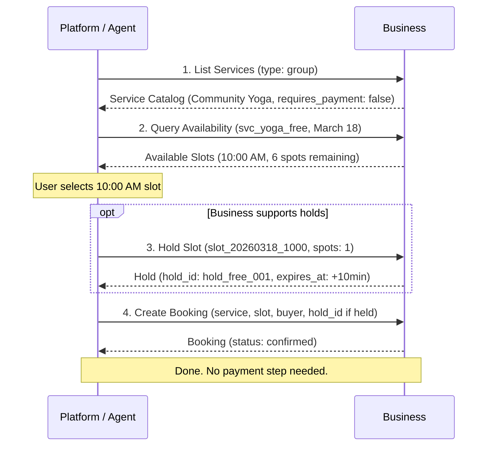
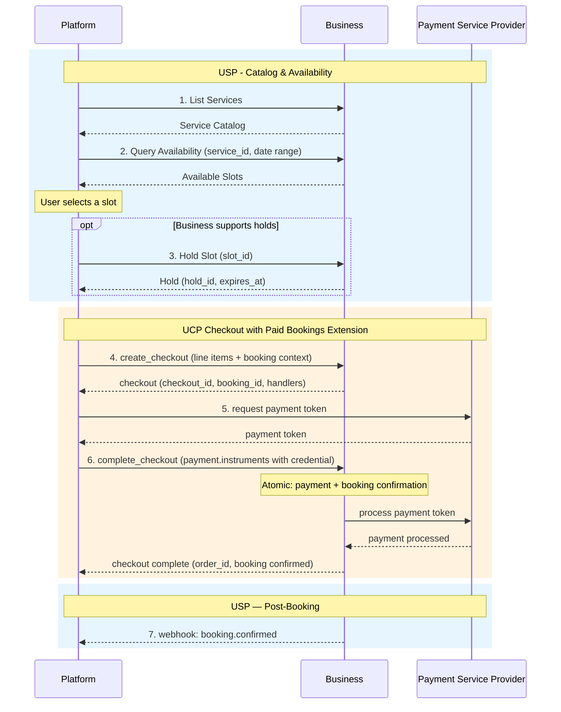

# UCP-Native Mode

UCP-Native Mode is the deployment option for platforms that already support the [Universal Commerce Protocol (UCP)](https://ucp.dev). In this mode, USP scheduling capabilities register directly in the UCP profile, giving agents a **single profile-discovery endpoint** for everything -- shopping, services, and scheduling. Paid bookings use UCP's **atomic checkout**, eliminating the two-phase `confirm-payment` pattern.

---

## When to Use

!!! success "Choose UCP-Native Mode when"

    - Your platform already supports UCP for commerce
    - You want single-endpoint profile discovery via `/.well-known/ucp`
    - You want atomic payment-plus-booking confirmation (no two-phase `confirm-payment`)
    - You want to inherit UCP's infrastructure (negotiation, versioning, error model, security)

!!! info "No separate USP profile"

    In UCP-Native Mode, there is **no** `/.well-known/usp` profile. All capabilities -- shopping, services, scheduling -- are registered in the UCP profile. The scheduling domain (Sections 3--5) works identically; only the profile discovery and payment paths differ from [Standalone Mode](standalone.md).

---

## Profile Registration in `/.well-known/ucp`

Businesses register USP scheduling capabilities in their UCP profile alongside other UCP capabilities. The profile declares both UCP and USP services and capabilities in a single document.

!!! info "What USP requires, and what it does not"

    Every `dev.usp-protocol.services.*` capability entry (and the `dev.usp-protocol.services` service entry) **MUST** carry `version`, `spec`, and `schema`. A USP entry missing any of the three is malformed and **MUST** be rejected on its own, without rejecting the rest of the profile.

    USP does **not** define what makes a UCP profile valid overall, and a USP consumer **MUST NOT** treat a `dev.ucp.*` entry as malformed just because it lacks `spec` or `schema`. USP depends on `dev.ucp.shopping.checkout` being present and usable, not on its metadata. A consumer that cannot run a checkout **MUST** fail closed for checkout-backed services and **MAY** still book checkout-free services from the same profile.

### Full Profile (Paid + Free Services)

```json
{
  "ucp": {
    "version": "2026-08-25",
    "services": {
      "dev.ucp.shopping": [
        {
          "version": "2026-08-25",
          "spec": "https://ucp.dev/latest/specification/overview/",
          "transport": "rest",
          "endpoint": "https://business.example.com/ucp/v1",
          "schema": "https://ucp.dev/latest/services/shopping/rest.openapi.json"
        }
      ],
      "dev.usp-protocol.services": [
        {
          "version": "2026-08-20",
          "spec": "https://usp-protocol.dev/specification",
          "transport": "rest",
          "endpoint": "https://business.example.com/usp/v1",
          "schema": "https://usp-protocol.dev/schemas/openapi/usp-rest.json",
          "config": {
            "authorization": {
              "privileged_operations_require_authentication": true,
              "accepted_mechanisms": [
                "http_message_signature",
                "booking_scoped_credential"
              ]
            }
          }
        }
      ]
    },
    "capabilities": {
      "dev.ucp.shopping.checkout": [
        {
          "version": "2026-08-25",
          "spec": "https://ucp.dev/latest/specification/shopping/checkout/",
          "schema": "https://ucp.dev/latest/schemas/shopping/checkout.json"
        }
      ],
      "dev.usp-protocol.services.catalog": [
        {
          "version": "2026-08-20",
          "spec": "https://usp-protocol.dev/specification#3-service-catalog",
          "schema": "https://usp-protocol.dev/schemas/services/catalog.json"
        }
      ],
      "dev.usp-protocol.services.availability": [
        {
          "version": "2026-08-20",
          "holds": true,
          "spec": "https://usp-protocol.dev/specification#4-availability",
          "schema": "https://usp-protocol.dev/schemas/services/availability.json"
        }
      ],
      "dev.usp-protocol.services.bookings": [
        {
          "version": "2026-08-20",
          "spec": "https://usp-protocol.dev/specification#5-booking-lifecycle",
          "schema": "https://usp-protocol.dev/schemas/services/booking.json"
        }
      ],
      "dev.usp-protocol.services.paid_bookings": [
        {
          "version": "2026-08-20",
          "spec": "https://usp-protocol.dev/specification#7-ucp-native-mode",
          "schema": "https://usp-protocol.dev/schemas/services/paid_bookings.json",
          "extends": "dev.ucp.shopping.checkout"
        }
      ],
      "dev.ucp.common.payment.terms": [
        {
          "version": "2026-08-25",
          "extends": ["dev.ucp.shopping.checkout", "dev.ucp.shopping.order"],
          "spec": "https://ucp.dev/latest/specification/payment/extensions/terms/",
          "schema": "https://ucp.dev/2026-08-25/schemas/common/payment_terms.json"
        }
      ],
      "dev.usp-protocol.services.pay_at_service": [
        {
          "version": "2026-08-20",
          "spec": "https://usp-protocol.dev/specification#pay-at-service-settlement-extension",
          "schema": "https://usp-protocol.dev/schemas/services/pay_at_service.json",
          "extends": "dev.ucp.shopping.checkout"
        }
      ]
    },
    "payment_handlers": {
      "com.stripe.payments": [
        {
          "id": "stripe_payments",
          "version": "2026-06-25",
          "spec": "https://docs.stripe.com/agentic-commerce/ucp/stripe-payments-handler",
          "schema": "https://ucp.stripe.com/payments/2026-06-25/schema.json",
          "available_instruments": [
            {
              "type": "link",
              "config": {
                "network_id": "profile_demo_not_for_production"
              }
            }
          ],
          "config": {
            "environment": "sandbox",
            "merchant_id": "acct_demo_not_for_production",
            "publishable_key": "pk_test_demo_not_for_production"
          }
        }
      ]
    },
    "business": {
      "name": "Sunrise Wellness Studio",
      "timezone": "America/New_York",
      "currency": "USD"
    }
  }
}
```

### Free-Service-Only Profile

Businesses offering only free services omit `dev.ucp.shopping.checkout` and `dev.usp-protocol.services.paid_bookings`:

```json
{
  "ucp": {
    "version": "2026-08-25",
    "services": {
      "dev.usp-protocol.services": [
        {
          "version": "2026-08-20",
          "spec": "https://usp-protocol.dev/specification",
          "transport": "rest",
          "endpoint": "https://business.example.com/usp/v1",
          "schema": "https://usp-protocol.dev/schemas/openapi/usp-rest.json",
          "config": {
            "authorization": {
              "privileged_operations_require_authentication": true,
              "accepted_mechanisms": ["http_message_signature"]
            }
          }
        }
      ]
    },
    "capabilities": {
      "dev.usp-protocol.services.catalog": [
        {
          "version": "2026-08-20",
          "spec": "https://usp-protocol.dev/specification#3-service-catalog",
          "schema": "https://usp-protocol.dev/schemas/services/catalog.json"
        }
      ],
      "dev.usp-protocol.services.availability": [
        {
          "version": "2026-08-20",
          "spec": "https://usp-protocol.dev/specification#4-availability",
          "schema": "https://usp-protocol.dev/schemas/services/availability.json"
        }
      ],
      "dev.usp-protocol.services.bookings": [
        {
          "version": "2026-08-20",
          "spec": "https://usp-protocol.dev/specification#5-booking-lifecycle",
          "schema": "https://usp-protocol.dev/schemas/services/booking.json"
        }
      ]
    },
    "business": {
      "name": "Sunrise Wellness Studio",
      "timezone": "America/New_York",
      "currency": "USD"
    }
  }
}
```

!!! note "Mixed carts"

    A single UCP checkout session may contain additional product-only `line_items` (UCP shopping) alongside the service line item. The service line item in `line_items` **MUST** match `booking.service_id`. This supports mixed carts (e.g., a retail product plus a scheduled service).

---

## Inherited Infrastructure

In UCP-Native Mode, the following infrastructure is inherited from UCP. USP does not redefine these concerns:

| Concern                | Provided By                        | UCP Reference             |
|------------------------|------------------------------------|---------------------------|
| Discovery              | `/.well-known/ucp`                 | UCP Profile Specification |
| Capability Negotiation | UCP negotiation protocol           | UCP Negotiation           |
| Versioning             | UCP version format and negotiation | UCP Versioning            |
| Error Model            | UCP error handling + RFC 9457      | UCP Error Handling        |
| Idempotency            | UCP idempotency key support        | UCP Idempotency           |
| Webhook Signing        | UCP webhook infrastructure         | UCP Webhooks              |
| Identity Linking       | UCP identity linking               | UCP Identity              |
| Buyer Consent          | UCP consent mechanism              | UCP Consent               |
| Transport Security     | UCP TLS requirements               | UCP Security              |
| Authentication (transport mechanics) | UCP OAuth 2.0 / signature support | UCP Auth     |
| Rate Limiting          | UCP rate limiting framework        | UCP Rate Limiting         |

!!! tip "Reading guidance"

    In UCP-Native Mode, read Sections 9.1--9.5 and 10.1 for USP-specific details (error codes, method mappings, webhook payload schemas). **Skip Sections 9.6 and 10.2** -- those are infrastructure requirements for Standalone Mode that UCP already provides.

!!! warning "Do not skip Section 10.1.6"

    The skip list above stops at Section 10.2. **Section 10.1.6 still applies in full.**

    UCP supplies transport mechanics -- how a token or signature is carried -- but USP's requirement that privileged operations **MUST** be authenticated is a USP-level floor layered on top of UCP, not something UCP-Native Mode provides on its own: UCP's own posture on platform authentication is optional (`SHOULD`). Section 10.1.6 applies to UCP-Native checkout and booking-extension operations exactly as it does in Standalone Mode.

    In UCP-Native Mode the authorization policy is published as **`config.authorization` on the `dev.usp-protocol.services` service binding** in `/.well-known/ucp`, **not** as a top-level member of the UCP profile: USP declares only under its own `dev.usp-protocol.*` namespace authority, and `config` is the member UCP reserves for entity-specific settings.

    See [Section 10.1.6](https://github.com/wix/universal-scheduling-protocol/blob/master/specification.md#1016-platform-authentication-for-privileged-operations).

---

## Paid Bookings Extension Schema

**Capability:** `dev.usp-protocol.services.paid_bookings` (extends `dev.ucp.shopping.checkout`)

The paid bookings extension adds a `booking` object to the UCP checkout. This object carries the scheduling context -- the slot, service, hold, resources, and booking status -- as a first-class, schema-validated extension field.

The extension schema uses `allOf` composition with `$defs` keyed by `dev.ucp.shopping.checkout`, consistent with UCP's schema composition model.

### Create Checkout Request

```json
{
  "line_items": [
    {
      "id": "li_1",
      "item": {
        "id": "svc_massage_001",
        "title": "Deep Tissue Massage",
        "price": 12000
      },
      "quantity": 1
    }
  ],
  "currency": "USD",
  "buyer": {
    "email": "alice@example.com",
    "first_name": "Alice",
    "last_name": "Williams"
  },
  "booking": {
    "service_id": "svc_massage_001",
    "service_type": "appointment",
    "slot": {
      "id": "slot_20260316_1400",
      "start": "2026-03-16T14:00:00-04:00",
      "end": "2026-03-16T15:00:00-04:00",
      "duration": "PT60M"
    },
    "hold_id": "hold_xyz789",
    "resources": [
      {
        "id": "staff_jane",
        "type": "staff",
        "name": "Jane Smith"
      }
    ],
    "party_size": 1,
    "confirmation_mode": "auto",
    "notes": "First time visit"
  }
}
```

### Checkout Response

```json
{
  "ucp": {
    "version": "2026-08-25",
    "capabilities": {
      "dev.ucp.shopping.checkout": [
        { "version": "2026-08-25" }
      ],
      "dev.usp-protocol.services.paid_bookings": [
        { "version": "2026-08-20" }
      ]
    },
    "payment_handlers": {
      "com.stripe.payments": [
        {
          "id": "stripe_payments",
          "version": "2026-06-25",
          "spec": "https://docs.stripe.com/agentic-commerce/ucp/stripe-payments-handler",
          "schema": "https://ucp.stripe.com/payments/2026-06-25/schema.json",
          "available_instruments": [
            {
              "type": "link",
              "config": {
                "network_id": "profile_demo_not_for_production"
              }
            }
          ],
          "config": {
            "environment": "sandbox",
            "merchant_id": "acct_demo_not_for_production"
          }
        }
      ]
    }
  },
  "id": "chk_abc123",
  "status": "ready_for_complete",
  "line_items": [
    {
      "id": "li_1",
      "item": {
        "id": "svc_massage_001",
        "title": "Deep Tissue Massage",
        "price": 12000
      },
      "quantity": 1
    }
  ],
  "links": [
    {
      "type": "cancellation_policy",
      "url": "https://business.example.com/cancellation-policy"
    },
    {
      "type": "terms_of_service",
      "url": "https://business.example.com/terms"
    }
  ],
  "booking": {
    "booking_id": "bkg_456def",
    "service_id": "svc_massage_001",
    "service_type": "appointment",
    "slot": {
      "id": "slot_20260316_1400",
      "start": "2026-03-16T14:00:00-04:00",
      "end": "2026-03-16T15:00:00-04:00",
      "duration": "PT60M"
    },
    "hold_id": "hold_xyz789",
    "resources": [
      {
        "id": "staff_jane",
        "type": "staff",
        "name": "Jane Smith"
      }
    ],
    "booking_status": "pending",
    "confirmation_mode": "auto"
  },
  "totals": [
    { "type": "subtotal", "amount": 12000 },
    { "type": "total", "amount": 12000 }
  ]
}
```

### Booking Object Fields

| Field               | Type            | Required                | Description                                                                            |
|---------------------|-----------------|-------------------------|----------------------------------------------------------------------------------------|
| `booking_id`        | string          | **Yes** (response only) | Unique booking identifier, generated by the business when the checkout is created.     |
| `service_id`        | string          | **Yes**                 | The service being booked.                                                              |
| `service_type`      | string          | **Yes**                 | The service vertical (e.g., `appointment`, `group`, `reservation`, `rental`, `field_service`). |
| `slot`              | object          | **Yes**                 | `{id, start, end, duration}` -- the booked time slot.                                  |
| `hold_id`           | string          | No                      | The hold ID if a slot was held.                                                        |
| `resources`         | Array\[object\] | No                      | `{id, type, name}` -- requested resources.                                             |
| `party_size`        | integer         | No                      | Number of participants. Default: 1.                                                    |
| `recipient`         | object          | No                      | The person receiving the service, when different from the buyer.                       |
| `delivery_address`  | DeliveryAddress | Conditional             | The buyer's service delivery address. **MUST** be present when the service's `channel.type` is `at_buyer_location`. Same shape as `Booking.delivery_address`, so a UCP-Native checkout can carry the address that Standalone `create_booking` carries. |
| `confirmation_mode` | string          | No                      | `auto` or `manual`.                                                                    |
| `booking_status`    | string          | **Yes** (response only) | Checkout-scoped status: `pending`, `confirmed`, or `canceled`. Derived from UCP checkout status. Not the same as the full `Booking.status` lifecycle. |
| `actions`           | Array\[Action\] | No                      | Non-payment actions (e.g., waiver). **MAY** appear when `create_checkout` requires buyer steps before payment. |
| `notes`             | string          | No                      | Buyer-provided special requests.                                                       |

!!! warning "Price consistency"

    `line_items[].item.price` **MUST** match the service's current catalog price. If the business detects a mismatch at `create_checkout` or `update_checkout`, it **MUST** return a business outcome message with code `price_mismatch` and severity `recoverable`.

### Payment handlers (UCP)

`ucp.payment_handlers` uses **reverse-domain keys** mapping to **arrays** of handler instances (`id`, `version`, optional `spec`, `schema`, `config`, `available_instruments`) per the [UCP payment architecture](https://ucp.dev/latest/specification/overview/#payment-architecture). Profile handlers are indicative; **`available_instruments` on the checkout response is authoritative** when present. On `complete_checkout`, each `payment.instruments[].handler_id` **MUST** match the handler instance `id` from that checkout (see [Paid Bookings Extension Schema](#paid-bookings-extension-schema) on this page). Processor-specific handler keys, instrument types, config fields, and credential types are defined by the handler in use. The JSON examples on this page illustrate one published handler; they are not extra USP requirements.

When a handler specification places acquisition inputs on an instrument `config` object, platforms **MUST** read those inputs from the checkout `available_instruments` entry, not from profile-only handler `config`. Credential `type` and token fields on `complete_checkout` **MUST** match the selected instrument as defined by that handler.

---

## Checkout Flow and Atomicity Guarantee

### Booking Status Derivation

The `BookingContext.booking_status` inside the checkout is a **checkout-scoped** summary -- not the same as the full `Booking.status` lifecycle (`pending`, `requires_action`, `confirmed`, `in_progress`, `completed`, `no_show`, `canceled`).

It is derived from the UCP checkout status:

| UCP Checkout Status | `booking_status` Result |
|---------------------|-------------------------|
| `completed`         | `confirmed` (when `confirmation_mode: auto`) or `pending` (when `manual`) |
| `canceled`          | `canceled`              |
| Any other status    | `pending`               |

### Checkout Steps

When the platform detects `dev.usp-protocol.services.paid_bookings` in the UCP profile, it uses this flow:

1. **[USP] Discover services** via `POST /services/list`
2. **[USP] Query availability** via `POST /availability/query`
3. *(If business supports holds)* **[USP] Hold the slot** via `POST /availability/holds`
4. **[UCP] Create checkout** with the booking extension (including `hold_id` if step 3 was performed). No separate `create_booking` call is needed.
5. *(If non-payment actions are present)* **[USP] Complete non-payment actions.** Present actions to the buyer in array order. Non-payment actions **SHOULD** be resolved before payment.
6. **[UCP] Acquire payment token** from the PSP using handler instances and resolved `available_instruments` from the **checkout response** (profile handlers are not authoritative for instruments when checkout supplies `available_instruments`).
7. **[UCP] Complete checkout** with the payment token. The business atomically processes payment and transitions the booking.
8. **[USP] Webhook notification.** The business sends a `booking.confirmed` webhook.

### Atomicity Guarantee

!!! abstract "What `complete_checkout` guarantees"

    When `complete_checkout` succeeds, the business **MUST** have atomically:

    1. **Processed the payment** with the PSP
    2. **Updated `booking_status`** -- to `confirmed` (when `confirmation_mode: auto` and no pending actions) or retained `pending` with payment collected (when `confirmation_mode: manual`)
    3. **Released the slot hold** (if any)

### Making the Guarantee Operable

A PSP charge and a booking write live in different systems, so a business cannot literally commit both in one transaction. "Atomic" is a statement about what a platform may **observe**, not about the business's transaction manager. These six rules define that contract and are testable from the platform side.

| Rule | Requirement |
|---|---|
| **A1. Check before charge** | Re-validate slot availability, hold validity, capacity, and booking window **before** initiating the charge. On failure, **MUST NOT** charge; return `slot_unavailable`, `hold_expired`, `capacity_exceeded`, or `booking_window_violated`. |
| **A2. Never leave a charge without a booking** | If the charge succeeds but the booking cannot be durably recorded, the business **MUST** either retry the write until it succeeds or reverse the charge, and **MUST NOT** report the checkout `completed` until one of those settles. Charging without reversing and then failing is non-conformant. |
| **A3. Failure leaves no partial state** | After any in-flight compensation settles, a failed `complete_checkout` means no charge and no confirmed booking. While compensation is in flight, `booking_status` stays `pending`. |
| **A4. Unknown outcomes are retryable and idempotent** | On timeout or 5xx the platform **MUST NOT** assume failure; retry with the **same** idempotency key or call `get_checkout`. A settled key replays the original outcome and **MUST NOT** charge or book twice. A key replayed with a different body gets `idempotency_conflict`. |
| **A5. Hold disposition on failure** | A failed `complete_checkout` **MUST NOT** release a still-valid hold, so the buyer can retry or change instrument within the hold window. |
| **A6. Reconciliation** | The business **MUST** be able to resolve a charge with no confirmed booking, and **SHOULD** refund it. `order_id` is the correlation key. |

!!! warning "Why A4 exists"

    A timeout on `complete_checkout` is the single most common real-world failure on the one call that moves money. Without idempotent replay it is unrecoverable: the platform cannot tell a charged buyer from an uncharged one.

!!! info "Checkout expiry and holds"

    The checkout session's `expires_at` **SHOULD** be no later than the slot hold's `expires_at`, so the checkout cannot outlive the reservation it depends on.

    If the hold expires before `complete_checkout` settles, the business **MUST NOT** process payment and **MUST** return:

    | Situation after the hold lapses | Code | Why it matters |
    |---|---|---|
    | Slot still has capacity; only the reservation lapsed | `hold_expired` | Platform can re-hold the same slot and retry without re-querying availability. |
    | Slot was taken or is no longer bookable | `slot_unavailable` | Platform must return the buyer to slot selection. |

    Earlier drafts required `slot_unavailable` in both cases, which told the platform to discard a slot that was still free.

### Action Ordering

Non-payment actions are placed **before** payment by design. Actions may cause the buyer to decide not to proceed -- for example, a spa's liability waiver. Placing non-payment actions before payment ensures the buyer has full information and has consented to all requirements before committing financially.

The business **MAY** reject `complete_checkout` if non-payment actions are still pending, returning a business outcome error with code `actions_pending`.

---

## Merchant Policy Parity and Eligibility (UCP Overlay)

When a business requires policy display, mandatory notices, or affirmative
acceptance before confirmation, UCP-Native deployments **SHOULD** use
[UCP checkout](https://ucp.dev/latest/specification/shopping/checkout/) and
[UCP overview](https://ucp.dev/latest/specification/overview/) mechanisms rather
than parallel USP fields. USP does not define merchant-mandated checkboxes,
minimum age, audience tiers, or recurring enrollment in this version.

**Mandatory acceptance (paid path):**

1. Policy URLs on checkout `links[]` (and service `links[]`, including `waiver`).
2. Structured terms in UCP `policies[]` when needed.
3. Must-show notices via warning `messages[]` with `presentation: "disclosure"`.
4. Affirmative acceptance the API cannot collect: keep checkout out of
   `ready_for_complete`; use `requires_escalation` with
   `requires_buyer_review` or `requires_buyer_input` plus `continue_url`, or an
   outstanding checkout `actions` entry. Platforms **MUST NOT** accept on the
   buyer's behalf.
5. Fail closed: reject create/complete if acceptance was skipped; no trusted
   in-band `"accepted": true` flag.

**Standalone / free paths:** use booking `requires_action` and
`actions[].continue_url` per the [booking schema](../specification/booking.md).

**Not Buyer Consent:** privacy categories only; not merchant checkboxes or waivers.
See [Security](../security.md) for privacy consent transmission.

**Eligibility:** no `min_age` or audience catalog fields. Enforce at
booking/checkout; use `locations[]` / `service_area` for geography. Platforms
**MUST NOT** fabricate eligibility.

**Recurring enrollment:** out of scope for this version; one-shot bookings and
`cancel_booking` only. See [Roadmap](../roadmap.md).

---

## Payment Timings Other Than `at_booking`

All three payment timings are specified for UCP-Native Mode. Only `at_booking` is settled by base UCP checkout alone. The other two require additional capabilities, and a business **MUST** declare them before offering a service with that timing.

| `payment_timing` | Standalone Mode | UCP-Native Mode | Capabilities required beyond base checkout |
|---|---|---|---|
| `at_booking` | Specified | Specified | None |
| `deposit_required` | Specified | Specified | `dev.ucp.common.payment.terms` |
| `at_service` | Specified | Specified | None on the direct path; `dev.ucp.common.payment.terms` and `dev.usp-protocol.services.pay_at_service` on the checkout path |

Where a checkout is involved, both non-`at_booking` timings are statements about *when* money is due, and UCP has a capability for that: the [payment terms extension](https://ucp.dev/latest/specification/payment/extensions/terms/). It models a term as a set of *schedules*, each one payment with an amount, a timing class, an optional `due_at`, and a buyer-facing description. The selected term's schedules sum to the checkout total, and the accepted term is carried onto the order, so the outstanding amount survives checkout as machine-readable state rather than as prose in a confirmation email.

### `deposit_required`

Expressible in base UCP plus the payment terms extension, with no USP-specific machinery. The business offers a term with two schedules: an `immediate` schedule for the deposit, charged when the checkout completes, and a later schedule for the balance, whose `due_at` is the start of the booked slot. The instrument the buyer supplies funds both, which is why UCP requires that instrument to be capable of every schedule on the selected term.

A business offering `deposit_required` **MUST** declare `dev.ucp.common.payment.terms` in its profile, **MUST** set the balance schedule's `due_at` to the slot start, and **MUST** carry the accepted term onto the order. Deposit amount and refundability are business policy, surfaced through the cancellation policy and UCP's disclosure mechanism, not through new USP fields.

### `at_service`

Collects no money digitally, so it has two conforming paths. A business **MUST** use one of them.

**The direct path.** No checkout at all. The booking is created with `POST /bookings` and confirmed exactly as a free service is, with the price carried in the catalog and presented as due at the appointment. A business whose services are all free or all `at_service` **MAY** declare no checkout capability whatsoever. This is the path most independent businesses want: nothing about a cash transaction at a counter requires a checkout system.

**The checkout path.** A business already running UCP checkout **MAY** route `at_service` through it, and **MUST** do so when the service shares a checkout with something charged, such as a product line item in a mixed cart. This also puts the obligation on the resulting order, where an agent can read what the buyer will owe rather than inferring it from a catalog price.

The checkout path is the one UCP does not reach on its own, and the gap is narrow. Payment terms can *disclose* that the whole price falls due after completion. What it assumes is that a stored instrument will eventually be charged: UCP requires the funding instrument to be capable of every schedule of the selected term, and forbids advertising one that is not. A buyer paying cash at the counter supplies no instrument, so a checkout that will never charge anything has no specified way to complete.

USP closes that gap with the [pay-at-service settlement extension](../extensions.md#pay-at-service-settlement-extension). It adds one thing: a declaration that a named term is settled offline, which lets a business offer the term with no payment handler and lets a platform complete the checkout with no instrument. The amount, the due time, and the buyer-facing statement of the obligation all come from the UCP payment term.

!!! danger "Fail closed"

    A business **MUST NOT** advertise a `deposit_required` service, or an `at_service` service it intends to route through a checkout, unless it declares every capability that path requires. A platform **MUST NOT** route an `at_service` service through a checkout when the business has not declared the pay-at-service extension; it uses the direct path instead. A platform encountering a `deposit_required` service without `dev.ucp.common.payment.terms` **MUST NOT** attempt to book it. Surface the reason to the operator: this is a business configuration error, not a buyer error.

    The alternative, letting a platform improvise, produces the worst outcome in scheduling: a booking that looks confirmed to the buyer while the business has no record of how it will be paid.

**Standalone Mode remains available.** A business that does not want the UCP payment terms dependency can operate in [Standalone Mode](standalone.md), where all three timings are specified without it, or offer those services only through a Standalone catalog while using UCP-Native Mode for its `at_booking` and free services.

---

## Free Services in UCP-Native Mode

For businesses that only offer free services (`requires_payment: false`), the UCP profile omits `dev.ucp.shopping.checkout` and `dev.usp-protocol.services.paid_bookings`. Bookings are created via `POST /bookings` and are immediately confirmed (for `auto` confirmation mode) without any checkout involvement.

---

## End-to-End Flows

### Free Service Flow

This flow applies when the booked service has `requires_payment: false` and the business profile does not require UCP checkout for scheduling.



=== "Request"

    ```json
    {
      "service_id": "svc_yoga_free",
      "slot_id": "slot_20260318_1000",
      "hold_id": "hold_free_001",
      "buyer": {
        "first_name": "Alice",
        "last_name": "Williams",
        "email": "alice@example.com",
        "phone_number": "+12125551234"
      },
      "party_size": 1
    }
    ```

=== "Response"

    ```json
    {
      "usp": {
        "version": "2026-08-20",
        "capabilities": {
          "dev.usp-protocol.services.bookings": [{ "version": "2026-08-20" }]
        }
      },
      "booking": {
        "id": "bkg_789ghi",
        "service_id": "svc_yoga_free",
        "service_name": "Community Yoga",
        "slot": {
          "id": "slot_20260318_1000",
          "start": "2026-03-18T10:00:00-04:00",
          "end": "2026-03-18T11:00:00-04:00",
          "duration": "PT60M"
        },
        "buyer": {
          "first_name": "Alice",
          "last_name": "Williams",
          "email": "alice@example.com"
        },
        "party_size": 1,
        "status": "confirmed",
        "confirmation_mode": "auto",
        "created_at": "2026-03-14T22:05:00Z",
        "updated_at": "2026-03-14T22:05:00Z"
      }
    }
    ```

### Paid Service Flow (UCP Checkout)

This flow applies when the business advertises UCP checkout with the paid bookings extension. The platform uses UCP `create_checkout` and `complete_checkout` instead of Standalone `POST /bookings` + `confirm-payment`.

!!! example "Applies when"

    - Deployment mode: **UCP-Native**
    - Service: `requires_payment: true`, `payment_timing: at_booking`, `confirmation_mode: auto`
    - Business UCP profile includes `dev.ucp.shopping.checkout` and `dev.usp-protocol.services.paid_bookings`



=== "create_checkout Request"

    ```json
    {
      "line_items": [
        {
          "id": "li_1",
          "item": {
            "id": "svc_massage_001",
            "title": "Deep Tissue Massage",
            "price": 12000
          },
          "quantity": 1
        }
      ],
      "currency": "USD",
      "buyer": {
        "email": "alice@example.com",
        "first_name": "Alice",
        "last_name": "Williams"
      },
      "booking": {
        "service_id": "svc_massage_001",
        "service_type": "appointment",
        "slot": {
          "id": "slot_20260316_1400",
          "start": "2026-03-16T14:00:00-04:00",
          "end": "2026-03-16T15:00:00-04:00",
          "duration": "PT60M"
        },
        "hold_id": "hold_xyz789",
        "party_size": 1,
        "confirmation_mode": "auto"
      }
    }
    ```

=== "create_checkout Response"

    ```json
    {
      "id": "chk_abc123",
      "status": "ready_for_complete",
      "booking": {
        "booking_id": "bkg_456def",
        "service_id": "svc_massage_001",
        "service_type": "appointment",
        "booking_status": "pending",
        "confirmation_mode": "auto"
      },
      "ucp": {
        "payment_handlers": {
          "com.stripe.payments": [
            {
              "id": "stripe_payments",
              "version": "2026-06-25",
              "available_instruments": [
                {
                  "type": "link",
                  "config": {
                    "network_id": "profile_demo_not_for_production"
                  }
                }
              ],
              "config": {
                "environment": "sandbox",
                "merchant_id": "acct_demo_not_for_production"
              }
            }
          ]
        }
      }
    }
    ```

=== "complete_checkout Request"

    ```json
    {
      "payment": {
        "instruments": [
          {
            "id": "instr_1",
            "handler_id": "stripe_payments",
            "type": "link",
            "selected": true,
            "credential": {
              "type": "stripe_payment_token",
              "token": "spt_demo_not_for_production"
            }
          }
        ]
      }
    }
    ```

=== "complete_checkout Response"

    ```json
    {
      "id": "chk_abc123",
      "status": "completed",
      "order": { "id": "ord_ucp_001" },
      "booking": {
        "booking_id": "bkg_456def",
        "booking_status": "confirmed",
        "confirmation_mode": "auto"
      }
    }
    ```

After checkout completes, the business **MAY** send a `booking.confirmed` webhook. The payload **SHOULD** include `order_id` alongside `booking_id` so platforms can correlate USP bookings with UCP orders.

!!! warning "`order.id` on the checkout, `order_id` on the webhook"

    The UCP `complete_checkout` and `get_checkout` responses expose the order identifier as **`order.id`** inside an `order` object. USP correlation, including the `booking.confirmed` webhook, uses a top-level **`order_id`** which **SHOULD** equal that `order.id`.

    Adapters bridging UCP and USP **MUST** map between the two. Agents **MUST NOT** assume a root-level `order_id` on a UCP checkout response unless the binding documents one.

    ```json
    // UCP checkout response
    "order": { "id": "ord_ucp_001" }

    // USP booking.confirmed webhook
    "order_id": "ord_ucp_001"
    ```

---

## Payment Path Comparison

For a comparison of all payment paths across both deployment modes (Free, UCP Checkout, Embedded, Redirect, ACP, and Deposit), see the [Payment Path Comparison](standalone.md#payment-path-comparison) table.
