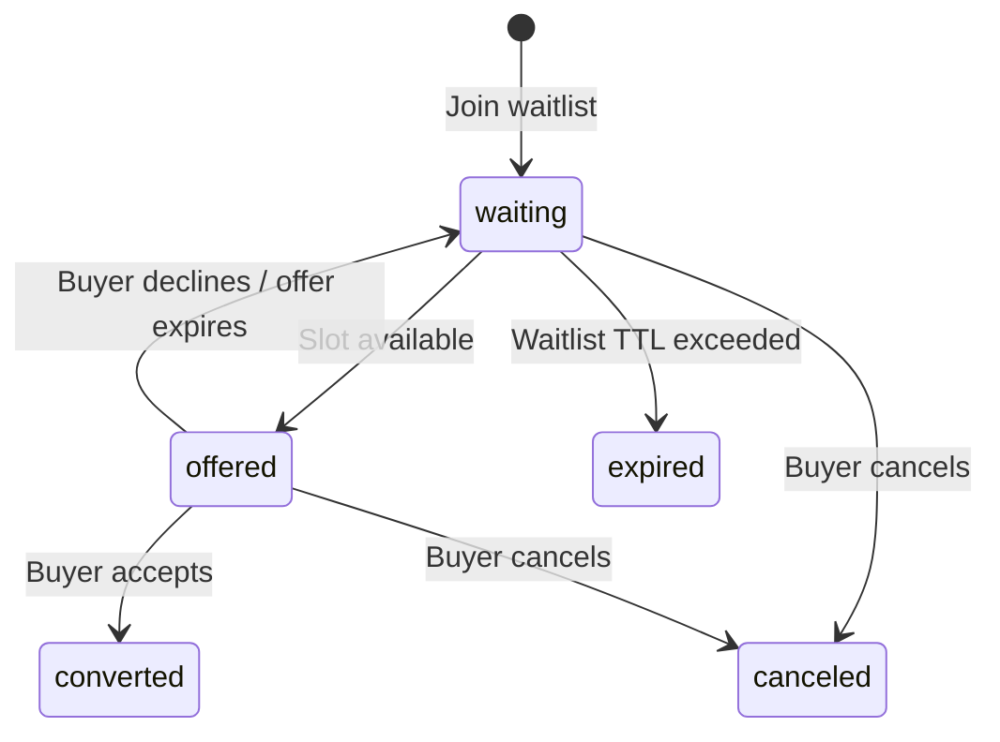

# Extensions

USP is designed to be extensible. Extensions augment core capabilities via
the `extends` field, using JSON Schema composition (`allOf`, `$defs`) to
layer additional fields onto base capability schemas.

---

## How Extensions Work

Extensions follow three rules:

1. **Declared via `extends`** — Each extension capability declares which
   base capability it augments.
2. **JSON Schema composition** — Extensions use `allOf` to add fields to
   base schemas without modifying them.
3. **Versioned independently** — Extensions have their own version
   (`YYYY-MM-DD`) and may declare version requirements on the base
   capability.

```json
{
  "name": "dev.usp.services.waitlist",
  "version": "2026-02-21",
  "extends": "dev.usp.services.bookings",
  "spec": "https://usp.dev/specification#waitlist-extension",
  "schema": "https://usp.dev/schemas/services/waitlist.json"
}
```

### Version Requirements

Extension schemas **SHOULD** declare a `requires` object specifying
minimum protocol and capability versions:

```json
{
  "$schema": "https://json-schema.org/draft/2020-12/schema",
  "$id": "https://usp.dev/schemas/services/waitlist.json",
  "requires": {
    "protocol": { "min": "2026-02-21" },
    "capabilities": {
      "dev.usp.services.bookings": { "min": "2026-02-21" }
    }
  }
}
```

---

## Waitlist Extension

**Capability:** `dev.usp.services.waitlist`  
**Extends:** `dev.usp.services.bookings`

The waitlist extension enables platforms to join a waitlist when a desired
time slot or service is fully booked, and receive notifications when spots
open up.

### Waitlist Entry Schema

| Field | Type | Required | Description |
|-------|------|----------|-------------|
| `id` | string | Yes | Unique waitlist entry identifier |
| `service_id` | string | Yes | The service being waited for |
| `buyer` | Buyer | Yes | `{first_name, last_name, email, phone_number}` |
| `preferences` | object | No | Preferred dates, times, resources |
| `party_size` | integer | No | Number of spots needed (default: 1) |
| `status` | string | Yes | `waiting`, `offered`, `converted`, `expired`, `canceled` |
| `position` | integer | No | Position in the waitlist queue |
| `offered_slot` | object | No | Slot offered when one becomes available |
| `offer_expires_at` | string | No | RFC 3339 expiry for the offered slot |
| `created_at` | string | Yes | RFC 3339 |
| `updated_at` | string | Yes | RFC 3339 |

### Waitlist Status Lifecycle



### Operations

| Operation | Method | Path |
|-----------|--------|------|
| Join Waitlist | POST | `/waitlist` |
| Get Waitlist Entry | GET | `/waitlist/{entry_id}` |
| Cancel Waitlist Entry | DELETE | `/waitlist/{entry_id}` |
| Accept Offered Slot | POST | `/waitlist/{entry_id}/accept` |
| Decline Offered Slot | POST | `/waitlist/{entry_id}/decline` |

### Webhooks

| Event | Trigger |
|-------|---------|
| `waitlist.offered` | A slot became available and was offered |
| `waitlist.converted` | Buyer accepted the offered slot |
| `waitlist.expired` | Offer or waitlist entry expired |

---

## Vendor Extensions

Vendors define custom capabilities under their reverse-domain namespace:

```
com.{vendor}.services.{capability_name}
```

### Example: Custom Courses Capability

```json
{
  "name": "com.wix.services.courses",
  "version": "2026-03-01",
  "extends": "dev.usp.services.bookings",
  "spec": "https://wix.com/services/courses/spec",
  "schema": "https://wix.com/services/courses/schema.json"
}
```

### Requirements for Vendor Extensions

1. **Must use vendor's reverse-domain namespace** — Never use `dev.usp.*`.
2. **Must publish a specification** (`spec` URL) and schema (`schema` URL)
   that define the additional fields and semantics.
3. **URLs must match namespace authority** — `com.wix.*` capabilities must
   reference `https://wix.com/...`.
4. **Should declare version requirements** on parent capabilities.

!!! tip "Graceful Degradation"

    Platforms encountering an unrecognized extension **SHOULD** ignore it
    and continue using the base capability. This ensures forward
    compatibility as new extensions are introduced.
