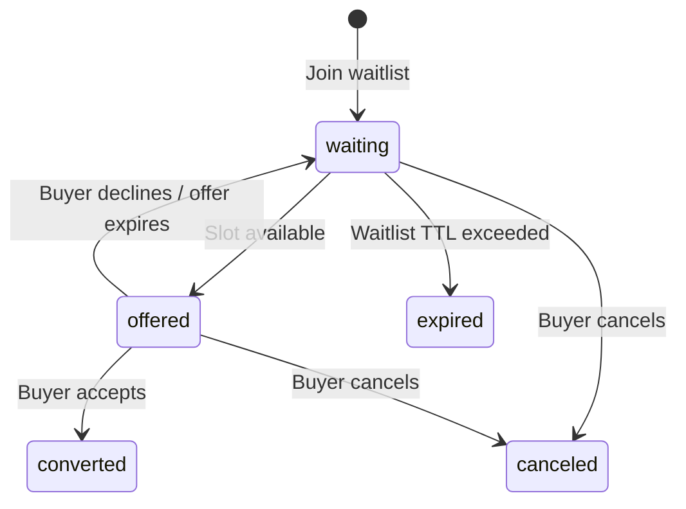

# Extensions

USP is designed to be extensible. Extensions augment core capabilities via
the `extends` field, using JSON Schema composition (`allOf`, `$defs`) to
layer additional fields onto base capability schemas.

---

## How Extensions Work

Extensions follow three rules:

1. **Declared via `extends`** — Each extension capability declares which
   base capability it augments.
2. **JSON Schema composition** — Extensions use `allOf` to add fields to
   base schemas without modifying them.
3. **Versioned independently** — Extensions have their own version
   (`YYYY-MM-DD`) and may declare version requirements on the base
   capability.

```json
{
  "name": "dev.usp-protocol.services.waitlist",
  "version": "2026-08-20",
  "extends": "dev.usp-protocol.services.bookings",
  "spec": "https://usp-protocol.dev/specification#waitlist-extension",
  "schema": "https://usp-protocol.dev/schemas/services/waitlist.json"
}
```

### Version Requirements

Extension schemas **SHOULD** declare a `requires` object specifying
minimum protocol and capability versions:

```json
{
  "$schema": "https://json-schema.org/draft/2020-12/schema",
  "$id": "https://usp-protocol.dev/schemas/services/waitlist.json",
  "requires": {
    "protocol": { "min": "2026-08-20" },
    "capabilities": {
      "dev.usp-protocol.services.bookings": { "min": "2026-08-20" }
    }
  }
}
```

---

## Waitlist Extension

**Capability:** `dev.usp-protocol.services.waitlist`  
**Extends:** `dev.usp-protocol.services.bookings`

The waitlist extension enables platforms to join a waitlist when a desired
time slot or service is fully booked, and receive notifications when spots
open up.

### Waitlist Entry Schema

| Field | Type | Required | Description |
|-------|------|----------|-------------|
| `id` | string | Yes | Unique waitlist entry identifier |
| `service_id` | string | Yes | The service being waited for |
| `buyer` | Buyer | Yes | `{first_name, last_name, email, phone_number}` |
| `preferences` | object | No | Preferred dates, times, resources |
| `party_size` | integer | No | Number of spots needed (default: 1) |
| `status` | string | Yes | `waiting`, `offered`, `converted`, `expired`, `canceled` |
| `position` | integer | No | Position in the waitlist queue |
| `offered_slot` | object | No | Slot offered when one becomes available |
| `offer_expires_at` | string | No | RFC 3339 expiry for the offered slot |
| `created_at` | string | Yes | RFC 3339 |
| `updated_at` | string | Yes | RFC 3339 |

### Waitlist Status Lifecycle



### Operations

| Operation | Method | Path |
|-----------|--------|------|
| Join Waitlist | POST | `/waitlist` |
| Get Waitlist Entry | GET | `/waitlist/{entry_id}` |
| Cancel Waitlist Entry | DELETE | `/waitlist/{entry_id}` |
| Accept Offered Slot | POST | `/waitlist/{entry_id}/accept` |
| Decline Offered Slot | POST | `/waitlist/{entry_id}/decline` |

### Webhooks

| Event | Trigger |
|-------|---------|
| `waitlist.offered` | A slot became available and was offered |
| `waitlist.converted` | Buyer accepted the offered slot |
| `waitlist.expired` | Offer or waitlist entry expired |

---

## Pay-at-Service Settlement Extension

**Capability:** `dev.usp-protocol.services.pay_at_service` (extends `dev.ucp.shopping.checkout`)

Lets a UCP checkout complete when the buyer owes money that is settled in person rather than through the protocol. Required for `payment_timing: at_service` in [UCP-Native Mode](deployment-modes/ucp-native.md#payment-timings-other-than-at_booking).

### Why it exists

UCP's [payment terms extension](https://ucp.dev/latest/specification/payment/extensions/terms/) already expresses an obligation falling due after checkout completes, and carries it onto the order so it stays machine-readable. What it assumes is that an instrument will eventually be charged: UCP requires the instrument funding a term to be capable of every schedule on it, and forbids advertising one that is not.

That assumption holds for trade credit and installments. It does not hold for the ordinary case in local time-based services, where the buyer books now and pays cash or taps a terminal at the counter. There the obligation is real and disclosed at checkout, but it is discharged by a channel the protocol does not model.

This extension adds exactly one thing: a declaration that a named payment term is settled outside UCP. The amount, the due time, and the buyer-facing statement of the obligation all remain the payment term's, so they cannot drift.

!!! tip "When you need it"

    Only when a pay-at-service booking goes through a UCP checkout. `at_service` also has a [direct path](deployment-modes/ucp-native.md#at_service) that uses no checkout at all, and a business whose services are all free or all `at_service` should prefer it. The checkout path exists for the cases the direct path cannot serve: a mixed cart where a charged line item and a pay-at-service booking settle together, and any business that wants the obligation recorded on a UCP order rather than implied by a catalog price.

### Settlement Declaration

`settlement` is a member of the checkout root, a sibling of `payment` rather than a member of it, because it does not describe a payment being taken.

| Field | Type | Required | Description |
|---|---|---|---|
| `mode` | string | **Yes** | Fixed value `offline`. A single-valued enum rather than a boolean, so an unrecognized value fails closed instead of reading as false. |
| `term_id` | string | **Yes** | The `payment.terms[].id` this declaration applies to. |
| `accepted_methods` | Array\[string\] | No | Display-only hint about what the business accepts in person (e.g. `cash`, `card_in_person`). Informative only. |

### Pay-at-Service Term

Every schedule on a pay-at-service term carries `type: "at_service"` and a `due_at` equal to the start of the booked slot. USP requires `due_at` even though UCP makes it optional: a booked slot is a known time, which is the whole point of scheduling, so a platform can set a reminder rather than parse prose.

```json
{
  "totals": [
    { "type": "subtotal", "amount": 7500 },
    { "type": "total", "display_text": "Due at your appointment", "amount": 7500 }
  ],
  "payment": {
    "selected_term_id": "pt_at_service",
    "terms": [
      {
        "id": "pt_at_service",
        "title": "Pay at your appointment",
        "schedules": [
          {
            "id": "sched_at_service",
            "type": "at_service",
            "description": { "plain": "Due at your appointment on 14 October 2026 at 10:00 AM EDT." },
            "due_at": "2026-10-14T10:00:00-04:00",
            "amount": 7500
          }
        ]
      }
    ]
  },
  "settlement": {
    "mode": "offline",
    "term_id": "pt_at_service",
    "accepted_methods": ["cash", "card_in_person"]
  }
}
```

The checkout total is the full price, because UCP requires the selected term's schedules to sum to it. The amount collected at completion is zero.

### Rules

| Rule | Requirement |
|---|---|
| Both capabilities, or neither | A business **MUST NOT** return `settlement` on a checkout without `payment.terms` and `payment.selected_term_id`. |
| One offline term per checkout | A checkout **MUST NOT** offer more than one pay-at-service term, so `settlement.term_id` resolves unambiguously. An instrument-funded term **MAY** be offered alongside it. |
| `due_at` is the slot start | Every schedule **MUST** set `due_at` to the start of the slot the checkout books, as an instant. |
| Completion without an instrument | The business **MUST** accept a `complete_checkout` whose `payment` is absent or whose `instruments` is empty, and **SHOULD** return an empty payment handler set. |
| Platforms do not collect | A platform **MUST NOT** present instrument collection or submit instruments. A business receiving them **MUST** reject with `validation_error` rather than charging. |
| Confirmation is not contingent on payment | The booking **MUST** be confirmed on completion exactly as a free-service booking is. |
| The obligation survives onto the order | The business **MUST** carry the accepted term onto the order and return `settlement` naming it. |
| Disclosure | Jurisdictional or policy notices **MUST** travel through UCP's disclosure mechanism, not through `accepted_methods`, which platforms may ignore. |

!!! info "Safe to ignore"

    A platform that does not recognize this capability still behaves correctly, because UCP already defines an unrecognized timing class as *not due at completion*. Such a platform reads the schedule description, presents what is owed and when, and declines to complete only because it cannot supply an instrument. It never concludes the payment was taken.

### Out of scope

- **Amounts not determinable at checkout.** A tip or an add-on chosen in the chair is an order adjustment, not a schedule.
- **Payment execution and proof.** No capture, no confirmation call, no receipt. A platform **MUST NOT** infer that an offline obligation can be inspected, settled, or cancelled through USP.
- **Enforcement.** A buyer who does not show is a `no_show`, handled by the business's cancellation and no-show policy.

---

## Vendor Extensions

Vendors define custom capabilities under their reverse-domain namespace:

```
com.{vendor}.services.{capability_name}
```

### Example: Custom Courses Capability

```json
{
  "name": "com.wix.services.courses",
  "version": "2026-03-01",
  "extends": "dev.usp-protocol.services.bookings",
  "spec": "https://wix.com/services/courses/spec",
  "schema": "https://wix.com/services/courses/schema.json"
}
```

### Requirements for Vendor Extensions

1. **Must use vendor's reverse-domain namespace** — Never use `dev.usp-protocol.*`.
2. **Must publish a specification** (`spec` URL) and schema (`schema` URL)
   that define the additional fields and semantics.
3. **URLs must match namespace authority** — `com.wix.*` capabilities must
   reference `https://wix.com/...`.
4. **Should declare version requirements** on parent capabilities.

!!! tip "Graceful Degradation"

    Platforms encountering an unrecognized extension **SHOULD** ignore it
    and continue using the base capability. This ensures forward
    compatibility as new extensions are introduced.
