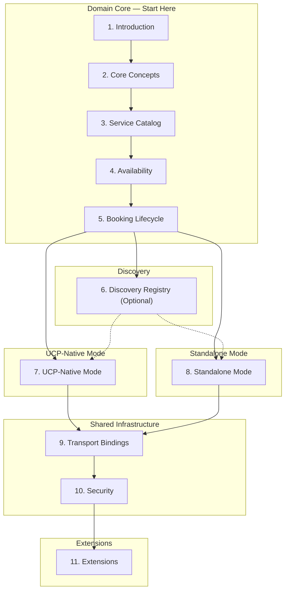

# Getting Started

This guide walks you through implementing USP. Everyone starts with the
**domain core** (service catalog, availability, booking), then reads the section
for their deployment mode.

---

## Choose Your Deployment Mode

| If your platform... | Choose | Read |
|---------------------|--------|------|
| Already supports [UCP](https://ucp.dev) | **[UCP-Native Mode](deployment-modes/ucp-native.md)** | Sections 1-5, 7, 9.1-9.5, 10.1 |
| Does not support UCP | **[Standalone Mode](deployment-modes/standalone.md)** | Sections 1-6, 8, 9 (all), 10 (all) |
| Only offers free services | Either mode | Domain core + mode section (skip payment parts) |

---

## UCP-Native Implementation Stages

If your platform supports UCP, follow these steps:

1. **Register capabilities.** Declare `dev.usp.services.catalog`,
   `dev.usp.services.availability`, `dev.usp.services.bookings`, and optionally
   `dev.usp.services.paid_bookings` in your `/.well-known/ucp` profile.

2. **Implement service catalog.** Expose the service catalog API (list services,
   get service, feed). See [Service Catalog](specification/service-catalog.md).

3. **Implement availability.** Expose availability query and optional hold
   mechanism. See [Availability](specification/availability.md).

4. **Implement booking lifecycle.** Expose create, get, update, confirm, cancel,
   and reschedule booking operations. See [Booking](specification/booking.md).

5. **If offering paid services:** Add the `paid_bookings` extension to your UCP
   checkout schema and implement the checkout flow.

6. **If offering free services only:** No checkout integration needed.

7. **Implement transport binding** for your chosen transport (REST, MCP, A2A, or ESP).
   Skip Standalone-only transport infrastructure.

8. **Implement USP-specific security requirements.** Skip Standalone-only
   security infrastructure — UCP provides it.

9. **Optional:** Implement the [waitlist extension](extensions.md).

10. **Optional:** Register in a [discovery registry](specification/discovery-registry.md).

---

## Standalone Implementation Stages

If your platform does not use UCP:

1. **Create your business profile.** Publish a `/.well-known/usp` profile
   declaring capabilities, transport endpoints, and optional checkout systems.

2. **Implement capability negotiation.** Support the `USP-Agent` header and
   server-selects negotiation model.

3. **Implement service catalog.** See [Service Catalog](specification/service-catalog.md).

4. **Implement availability.** See [Availability](specification/availability.md).

5. **Implement booking lifecycle.** See [Booking](specification/booking.md).

6. **If offering paid services:** Implement payment integration — choose the
   generic payment flow and/or the ACP booking extension.

7. **If offering free services only:** Skip payment integration entirely.

8. **Implement transport binding** for your chosen transport **and** transport
   infrastructure (TLS, CORS, rate limiting).

9. **Implement security** — both USP-specific requirements and standalone
   security infrastructure (OAuth 2.0, webhook signatures).

10. **Optional:** Implement the [waitlist extension](extensions.md).

11. **Optional:** Register in a [discovery registry](specification/discovery-registry.md).

---

## Capabilities

USP defines three core capabilities and optional extensions:

| Capability | Namespace | Mode | Description |
|------------|-----------|------|-------------|
| Service Catalog | `dev.usp.services.catalog` | Both | [What services a business offers](specification/service-catalog.md) |
| Availability | `dev.usp.services.availability` | Both | [When services are available](specification/availability.md) |
| Bookings | `dev.usp.services.bookings` | Both | [Booking lifecycle management](specification/booking.md) |
| Paid Bookings | `dev.usp.services.paid_bookings` | UCP-Native only | Booking context in UCP checkout |
| Waitlist | `dev.usp.services.waitlist` | Both (extension) | [Waitlist management](extensions.md) |

---

## Transport Bindings

| Binding | Description | Best For |
|---------|-------------|----------|
| [REST](transport/rest.md) | HTTP/OpenAPI 3.x with idempotency | Primary transport, web platforms |
| [MCP](transport/mcp.md) | JSON-RPC via Model Context Protocol | AI agent tool use |
| [A2A](transport/a2a.md) | Agent-to-Agent protocol | Autonomous multi-agent systems |
| [ESP](transport/esp.md) | Embedded Scheduling Protocol | In-app booking UIs via iframe |

---

## Machine-Readable Artifacts

| Artifact | Path | Description |
|----------|------|-------------|
| JSON Schemas | `schemas/` | `catalog.json`, `availability.json`, `booking.json`, `paid_bookings.json`, `waitlist.json` |
| OpenAPI Spec | `openapi/usp-rest.json` | OpenAPI 3.1.0 for all REST operations |
| OpenRPC Spec | `openrpc/usp-mcp.json` | OpenRPC for all MCP methods |

---

## Cross-Cutting Concerns

USP references IETF standards directly:

| Concern | Standard | Description |
|---------|----------|-------------|
| Discovery | RFC 8615 | Well-Known URIs |
| Error model | RFC 9457 | Problem Details for HTTP APIs |
| Authorization | RFC 6749 / RFC 9449 | OAuth 2.0 with DPoP |
| Transport security | RFC 8446 / RFC 9110 | TLS 1.3 and HTTP Semantics |
| Idempotency | draft-ietf-httpapi-idempotency-key-header | Idempotency key header |
| Webhook verification | RFC 9421 | HTTP Message Signatures |
| Rate limiting | draft-ietf-httpapi-ratelimit-headers | Rate limit headers |
