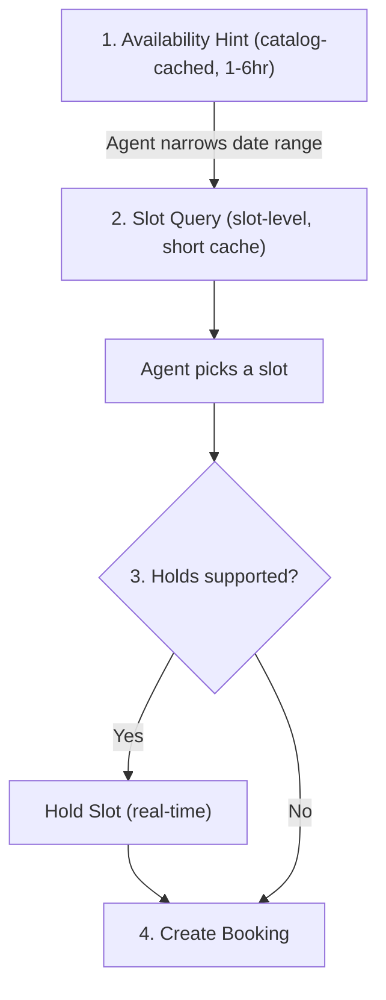

# Availability

**Capability:** `dev.usp.services.availability`

The availability capability lets platforms **query when services are available** and, optionally, **hold slots** to prevent double-booking during the booking flow.

## Feature Flags

| Flag | Type | Default | Description |
|------|------|---------|-------------|
| `holds` | boolean | `false` | When `true`, the business supports Hold Slot and Release Slot operations. Platforms **MUST NOT** call hold/release endpoints unless the business advertises `"holds": true`. |

Businesses declare feature flags inside the capability entry in their profile:

```json
"dev.usp.services.availability": [
  {
    "version": "2026-02-09",
    "holds": true
  }
]
```

When `holds` is `false` or absent, the [booking](booking.md) flow proceeds directly from slot query to booking creation without an intermediate hold step.

---

## Time Slot

A time slot represents a specific, bookable combination of a time window and assigned resources, computed dynamically by the business from schedules, resource calendars, and existing bookings.

!!! note "One Slot Per Resource Combination"
    If the same time window is available with multiple resource options (e.g., three stylists are all free at 3 pm), the business **MUST** return a separate slot for each option. Each slot's `resources` array carries exactly the resources assigned to that slot. Picking a slot is equivalent to picking both the time **and** the resource.

!!! warning "Non-transactional"
    Availability responses are **not** transactional commitments. A slot returned as `available` reflects the business's state at query time; by the time `create_booking` is called the slot may have been taken. Platforms **MUST NOT** assume that an `available` slot will remain bookable. The optional hold mechanism provides a short-lived, best-effort reservation to reduce this race window.

### Time Slot Schema

| Field | Type | Required | Description |
|-------|------|----------|-------------|
| `id` | string | **Yes** | Unique slot identifier, opaque to the platform. |
| `service_id` | string | **Yes** | The service this slot belongs to. |
| `start` | string | **Yes** | RFC 3339 start time of the slot. |
| `end` | string | **Yes** | RFC 3339 end time of the slot. |
| `duration` | string | **Yes** | ISO 8601 duration of the slot (e.g., `PT60M`). |
| `state` | string | **Yes** | Availability state. See state values below. |
| `capacity` | object | No | `{total, remaining, held}` -- present for `group` and `reservation` types. |
| `resources` | Array[object] | No | `{id, type, name}` -- the specific resources assigned to this slot. |
| `location` | object | No | `{id, name}` -- the specific location for this slot. |
| `pricing` | object | No | `{amount, currency, label}` -- slot-specific pricing that overrides service-level pricing. |

### Slot State Values

| State | Description |
|-------|-------------|
| `available` | The slot has capacity for new bookings. For `appointment` types, the slot is open. For `group`/`reservation` types, `capacity.remaining > 0`. |
| `limited` | Low remaining capacity. Businesses **SHOULD** return `limited` when remaining capacity drops below 20% of total or fewer than 3 spots remain. |
| `waitlist` | Fully booked but waitlist is enabled. Platform **MAY** allow the buyer to join the waitlist. Businesses **MUST NOT** return `waitlist` unless the `dev.usp.services.waitlist` capability is supported. |

---

## Hold

!!! note "Feature Flag Required"
    This section applies only when the business advertises `"holds": true` in its `dev.usp.services.availability` capability entry.

A hold is a temporary reservation of a time slot that prevents double-booking during the booking flow. Holds have a short TTL and are automatically released when they expire, are explicitly released, or are converted to a booking.

### Hold Schema

| Field | Type | Required | Description |
|-------|------|----------|-------------|
| `id` | string | **Yes** | Unique hold identifier. |
| `slot_id` | string | **Yes** | The held slot. |
| `service_id` | string | **Yes** | The service. |
| `spots` | integer | No | Number of spots held. Default: 1. |
| `expires_at` | string | **Yes** | RFC 3339 expiration time. Businesses **SHOULD** set hold TTL between 5 and 10 minutes. |
| `status` | string | **Yes** | `active`, `expired`, `released`, or `converted`. |

### Concurrent Hold Rules

The business **MUST** enforce hold concurrency rules matching the service's capacity model:

| Service Type | Concurrency Rule |
|-------------|-----------------|
| `appointment` | **MUST NOT** accept more than one active hold per slot. Second request returns `slot_unavailable`. |
| `group` / `reservation` | Multiple concurrent holds permitted up to remaining capacity. Exceeding capacity returns `slot_unavailable`. |
| `rental` | Overlapping time holds on the same resource **MUST** be rejected with `slot_unavailable`. |

---

## Operations

### Query Availability -- `POST /availability/query`

Returns available time slots for a service within a date range. Use the [Availability Hint](service-catalog.md#availability-hint) on the service entity to narrow the date range before querying.

**Request Fields:**

| Field | Type | Required | Description |
|-------|------|----------|-------------|
| `service_id` | string | **Yes** | The service to query. |
| `start_date` | string | **Yes** | Start of range (RFC 3339 date or datetime). |
| `end_date` | string | **Yes** | End of range (RFC 3339 date or datetime). |
| `timezone` | string | No | IANA timezone. Defaults to business timezone. |
| `resource_id` | string | No | Preferred resource. Only matching slots are returned. |
| `party_size` | integer | No | Number of participants. Default: 1. |
| `location_id` | string | No | Location filter for multi-location businesses. |
| `locale` | string | No | BCP 47 language tag for localized content. |
| `cursor` | string | No | Opaque pagination cursor from a previous response. |

!!! tip "Date Range Guidance"
    Platforms **SHOULD** query at most 7 calendar days per request. Businesses **MAY** reject queries spanning more than their configured maximum by returning HTTP 422 with error code `range_too_wide`.

!!! note "Single-Service Design"
    Each query targets exactly one service. For multi-service scenarios, platforms **SHOULD** issue separate queries per service and correlate results client-side.

=== "Request"

    ```json
    {
      "service_id": "svc_haircut_001",
      "start_date": "2026-03-15",
      "end_date": "2026-03-21",
      "timezone": "America/New_York",
      "resource_id": "staff_jane",
      "location_id": "loc_main",
      "locale": "en-US"
    }
    ```

=== "Response"

    ```json
    {
      "usp": {
        "version": "2026-02-09",
        "capabilities": {
          "dev.usp.services.availability": [
            { "version": "2026-02-09" }
          ]
        }
      },
      "service_id": "svc_haircut_001",
      "slots": [
        {
          "id": "slot_20260315_0900",
          "service_id": "svc_haircut_001",
          "start": "2026-03-15T09:00:00-04:00",
          "end": "2026-03-15T10:00:00-04:00",
          "duration": "PT60M",
          "state": "available",
          "resources": [
            { "id": "staff_jane", "type": "staff", "name": "Jane Smith" }
          ],
          "location": { "id": "loc_main", "name": "Downtown Studio" }
        },
        {
          "id": "slot_20260315_1030",
          "service_id": "svc_haircut_001",
          "start": "2026-03-15T10:30:00-04:00",
          "end": "2026-03-15T11:30:00-04:00",
          "duration": "PT60M",
          "state": "available",
          "resources": [
            { "id": "staff_jane", "type": "staff", "name": "Jane Smith" }
          ],
          "location": { "id": "loc_main", "name": "Downtown Studio" }
        }
      ],
      "opening_hours": [
        {
          "day_of_week": ["monday", "tuesday", "wednesday", "thursday", "friday"],
          "opens": "09:00",
          "closes": "18:00"
        },
        {
          "day_of_week": ["saturday"],
          "opens": "10:00",
          "closes": "16:00"
        }
      ],
      "pagination": { "cursor": null, "has_more": false }
    }
    ```

**Response Fields:**

| Field | Type | Required | Description |
|-------|------|----------|-------------|
| `service_id` | string | **Yes** | Echoes the queried service identifier. |
| `slots` | array | **Yes** | List of available time slots. Empty array when no slots match. |
| `opening_hours` | array | No | Regular business hours for the queried period. |
| `messages` | array | No | Optional informational or warning messages about the result set. |
| `pagination` | object | No | Pagination state: `cursor` and `has_more`. |

**`opening_hours[]` Fields:**

| Field | Type | Required | Description |
|-------|------|----------|-------------|
| `day_of_week` | Array[string] | **Yes** | Days this entry applies to (lowercase English day names). |
| `opens` | string | **Yes** | Opening time in `HH:MM` 24-hour format (local business time). |
| `closes` | string | **Yes** | Closing time in `HH:MM` 24-hour format. |

Slots are returned in ascending `start` order.

---

### Hold Slot -- `POST /availability/holds`

!!! warning "Requires Feature Flag"
    Platforms **MUST NOT** call this endpoint unless the business profile advertises `"holds": true`.

Creates a temporary hold on a time slot to prevent double-booking while the buyer completes the [booking](booking.md) flow.

=== "Request"

    ```json
    {
      "slot_id": "slot_20260315_0900",
      "service_id": "svc_haircut_001",
      "spots": 1
    }
    ```

=== "Response (success)"

    ```json
    {
      "usp": {
        "version": "2026-02-09",
        "capabilities": {
          "dev.usp.services.availability": [
            { "version": "2026-02-09" }
          ]
        }
      },
      "hold": {
        "id": "hold_abc123",
        "slot_id": "slot_20260315_0900",
        "service_id": "svc_haircut_001",
        "spots": 1,
        "expires_at": "2026-03-15T08:10:00-04:00",
        "status": "active"
      }
    }
    ```

=== "Response (slot unavailable)"

    ```json
    {
      "usp": {
        "version": "2026-02-09",
        "capabilities": {}
      },
      "messages": [
        {
          "type": "error",
          "code": "slot_unavailable",
          "content": "The requested slot is no longer available.",
          "severity": "recoverable"
        }
      ]
    }
    ```

---

### Release Slot -- `DELETE /availability/holds/{hold_id}`

!!! warning "Requires Feature Flag"
    Requires `"holds": true` on the `dev.usp.services.availability` capability.

Explicitly releases a hold before it expires, freeing the slot for other buyers.

=== "Request"

    ```
    DELETE /availability/holds/hold_abc123
    ```

=== "Response"

    ```json
    {
      "usp": {
        "version": "2026-02-09",
        "capabilities": {
          "dev.usp.services.availability": [
            { "version": "2026-02-09" }
          ]
        }
      },
      "hold": {
        "id": "hold_abc123",
        "slot_id": "slot_20260315_0900",
        "service_id": "svc_haircut_001",
        "spots": 1,
        "expires_at": "2026-03-15T08:10:00-04:00",
        "status": "released"
      }
    }
    ```

---

## Caching Strategy

Availability data has an inverse relationship between freshness and usefulness: near-term slots are the most actionable but change the fastest, while far-out availability is stable but less immediately useful. Platforms **SHOULD** use a tiered caching strategy:

| Tier | Source | Date Range | Recommended TTL | Use Case |
|------|--------|------------|-----------------|----------|
| **Hint** | `availability_hint` | General / near-term | 1-6 hours (cached with catalog) | Agent pre-filtering: "which date range should I even query?" |
| **Select** | `slot` query | 1-2 specific days | 30-60 seconds | Time picker: "what times are available on Tuesday?" |
| **Commit** *(optional)* | Hold | Single slot | Real-time (no cache) | Slot hold before booking. Only when `"holds": true`. |

This creates a natural funnel that balances user experience with data freshness:



!!! tip "When Holds Are Not Supported"
    When holds are not supported, the flow skips directly from slot selection to [booking creation](booking.md#create-booking----post-bookings). The platform should handle the possibility of the slot being taken between query and booking.
