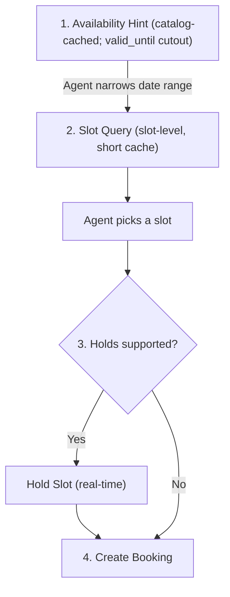

# Availability

**Capability:** `dev.usp-protocol.services.availability`

The availability capability lets platforms **query when services are available** and, optionally, **hold slots** to prevent double-booking during the booking flow.

## Feature Flags

| Flag | Type | Default | Description |
|------|------|---------|-------------|
| `holds` | boolean | `false` | When `true`, the business supports Hold Slot and Release Slot operations. Platforms **MUST NOT** call hold/release endpoints unless the business advertises `"holds": true`. |

Businesses declare feature flags inside the capability entry in their profile:

```json
"dev.usp-protocol.services.availability": [
  {
    "version": "2026-08-20",
    "holds": true
  }
]
```

When `holds` is `false` or absent, the [booking](booking.md) flow proceeds directly from slot query to booking creation without an intermediate hold step.

---

## Time Slot

A time slot represents a specific, bookable combination of a time window and assigned resources, computed dynamically by the business from schedules, resource calendars, and existing bookings.

!!! note "One Slot Per Resource Combination"
    If the same time window is available with multiple resource options (e.g., three stylists are all free at 3 pm), the business **MUST** return a separate slot for each option. Each slot's `resources` array carries exactly the resources assigned to that slot. Picking a slot is equivalent to picking both the time **and** the resource.

!!! warning "Non-transactional"
    Availability responses are **not** transactional commitments. A slot returned as `available` reflects the business's state at query time; by the time `create_booking` is called the slot may have been taken. Platforms **MUST NOT** assume that an `available` slot will remain bookable. The optional hold mechanism provides a short-lived, best-effort reservation to reduce this race window.

### Time Slot Schema

| Field | Type | Required | Description |
|-------|------|----------|-------------|
| `id` | string | **Yes** | Unique slot identifier, opaque to the platform. |
| `service_id` | string | **Yes** | The service this slot belongs to. |
| `start` | string | **Yes** | RFC 3339 start time of the slot. |
| `end` | string | **Yes** | RFC 3339 end time of the slot. |
| `duration` | string | **Yes** | ISO 8601 duration of the slot (e.g., `PT60M`). |
| `state` | string | **Yes** | Availability state. See state values below. |
| `capacity` | object | No | `{total, remaining, held, waitlist}` -- present for `group` and `reservation` types. `waitlist` is a boolean; a slot **MUST NOT** carry state `waitlist` unless it is `true`. |
| `resources` | Array[object] | No | `{id, type, name}` -- the specific resources assigned to this slot. |
| `location` | object | No | `{id, name}` -- the specific location for this slot. |
| `pricing` | object | No | `{amount, currency, label}` -- slot-specific pricing that overrides service-level pricing. |

### Slot State Values

| State | Description |
|-------|-------------|
| `available` | The slot has capacity for new bookings. For `appointment` types, the slot is open. For `group`/`reservation` types, `capacity.remaining > 0`. |
| `limited` | Low remaining capacity. Businesses **SHOULD** return `limited` when remaining capacity drops below 20% of total or fewer than 3 spots remain. |
| `waitlist` | Fully booked but the service has waitlist enabled (`capacity.waitlist: true`). Platform **MAY** allow the buyer to join the waitlist. Businesses **MUST NOT** return `waitlist` unless the `dev.usp-protocol.services.waitlist` capability is supported. |

---

## Hold

!!! note "Feature Flag Required"
    This section applies only when the business advertises `"holds": true` in its `dev.usp-protocol.services.availability` capability entry.

A hold is a temporary reservation of a time slot that prevents double-booking during the booking flow. Holds have a short TTL and are automatically released when they expire, are explicitly released, or are converted to a booking.

### Hold Schema

| Field | Type | Required | Description |
|-------|------|----------|-------------|
| `id` | string | **Yes** | Unique hold identifier. |
| `slot_id` | string | **Yes** | The held slot. |
| `service_id` | string | **Yes** | The service. |
| `spots` | integer | No | Number of spots held. Default: 1. |
| `expires_at` | string | **Yes** | RFC 3339 expiration time. Businesses **SHOULD** set hold TTL between 5 and 10 minutes. |
| `status` | string | **Yes** | `active`, `expired`, `released`, or `converted`. |

### Concurrent Hold Rules

The business **MUST** enforce hold concurrency rules matching the service's capacity model:

| Service Type | Concurrency Rule |
|-------------|-----------------|
| `appointment` | **MUST NOT** accept more than one active hold per slot. Second request returns `slot_unavailable`. |
| `group` / `reservation` | Multiple concurrent holds permitted up to remaining capacity. Exceeding capacity returns `slot_unavailable`. |
| `rental` | Overlapping time holds on the same resource **MUST** be rejected with `slot_unavailable`. |

### Hold Conversion

A hold exists to make the gap between slot selection and booking safe. That is only true if converting it cannot lose the reservation, so conversion is specified rather than left to each implementation.

**Capacity accounting.** `Hold.spots` and the booking request's `party_size` count the same capacity units from opposite ends of the flow: `spots` is what was reserved, `party_size` is what is being booked.

- With a `hold_id`, `party_size` (default 1) **MUST NOT** exceed the hold's `spots` (default 1). Exceeding it returns `capacity_exceeded`, because the surplus was never reserved and another buyer may hold it.
- A `party_size` **lower** than `spots` is allowed; unused spots **MUST** return to `capacity.remaining` on conversion.
- Without a `hold_id`, `party_size` is checked directly against `capacity.remaining` at booking time.

**Conversion is atomic.** Either the booking is created and the hold moves to `converted`, or neither happens. A hold **MUST NOT** be left `converted` with no booking, and a booking **MUST NOT** be created from a hold left `active` where it could convert again.

| Hold state at conversion | Slot still bookable? | Code | Hold outcome |
|---|---|---|---|
| `active` | Yes | (success) | `converted` |
| `expired` | Yes | `hold_expired` | stays `expired` |
| `expired` | No | `slot_unavailable` | stays `expired` |
| `released` | Yes | `hold_expired` | stays `released` |
| `released` | No | `slot_unavailable` | stays `released` |
| `converted` | n/a | (success, idempotent replay) | stays `converted` |
| `active`, `party_size` exceeds `spots` | n/a | `capacity_exceeded` | stays `active` |

Two rows are deliberate. A `converted` hold replayed with the same request returns the **existing** booking rather than an error, which is what makes `hold_id` usable as an idempotency key. And `capacity_exceeded` leaves the hold `active`, so the platform can retry with a `party_size` that fits instead of losing the reservation.

An unrecognized `hold_id` returns `validation_error`, not `hold_expired`: the platform needs to tell a bad identifier from a lapsed reservation.

---

## Operations

### Query Availability -- `POST /availability/query`

Returns available time slots for a service within a date range. Use the [Availability Hint](service-catalog.md#availability-hint) on the service entity to narrow the date range before querying.

**Request Fields:**

| Field | Type | Required | Description |
|-------|------|----------|-------------|
| `service_id` | string | **Yes** | The service to query. |
| `start_date` | string | **Yes** | Start of range: an RFC 3339 full-date (`2026-03-15`) or date-time with offset (`2026-03-15T13:00:00Z`). A date means 00:00 on that day in the applied date-bounds timezone. |
| `end_date` | string | **Yes** | End of range, in the same forms as `start_date`. A date includes that whole day in the applied date-bounds timezone. |
| `date_bounds_timezone` | string | No | IANA timezone whose calendar the business uses to turn date-only bounds into instants. Send it to ask for days as someone other than the business counts them (typically the buyer). Omit it to get the business's own days, including when you do not know the business timezone. Defaults to the business timezone. Has no effect on date-time bounds. See [Query Timezones](#query-timezones). |
| `resource_id` | string | No | Preferred resource. Only matching slots are returned. |
| `party_size` | integer | No | Number of participants. Default: 1. |
| `location_id` | string | No | Location filter for multi-location businesses. |
| `locale` | string | No | BCP 47 language tag for localized content. |
| `cursor` | string | No | Opaque pagination cursor from a previous response. |

!!! tip "Date Range Guidance"
    Platforms **SHOULD** query at most 7 calendar days per request. Businesses **MAY** reject queries spanning more than their configured maximum by returning HTTP 422 with error code `range_too_wide`.

!!! note "Single-Service Design"
    Each query targets exactly one service. For multi-service scenarios, platforms **SHOULD** issue separate queries per service and correlate results client-side.

#### Query Timezones

An availability query involves up to three zones, and a slot offset such as `-04:00` names none of them: an offset identifies an instant, not a clock, and it cannot be used to find the next local day across a daylight-saving transition. A platform may also reach this operation without having read the USP profile (for example, after UCP discovery), so it cannot rely on `business.timezone` from the [business profile](../deployment-modes/standalone.md#profile-fields). The query therefore uses three fields, each named for its one meaning:

| Field | Where | Required | What it represents | What to use it for |
|---|---|---|---|---|
| `date_bounds_timezone` | Request | No | The zone whose calendar the platform wants date-only bounds read in. | Ask for "March 15" as the buyer counts it, rather than as the business does. Omit it to get the business's own days. |
| `applied_date_bounds_timezone` | Response | **Yes** | The zone the business actually applied to date-only bounds: the request `date_bounds_timezone` when sent, otherwise `business_timezone`. | Confirm how the range was read, and request the adjacent window in the same zone. |
| `business_timezone` | Response | **Yes** | The business's own zone, whatever the request carried. Equal to `business.timezone` on the USP profile. | Show slot times on the business's clock, compare that clock with the buyer's, and read `opening_hours`. |

All three are IANA Time Zone Database identifiers.

**Resolving the range.**

- A date-only `start_date` resolves to 00:00 on that day in the applied date-bounds timezone. A date-only `end_date` includes that whole day: the range ends at 00:00 on the following day in that timezone. Days are resolved on the local calendar, so a day containing a daylight-saving transition is 23 or 25 hours long.
- A date-time bound carries an offset and is already an instant. `date_bounds_timezone` **MUST NOT** change its meaning. When both bounds are date-times, `date_bounds_timezone` has no effect on the range; `applied_date_bounds_timezone` still reports the zone the business would have applied to a date-only bound.
- `date_bounds_timezone` is optional. A platform that does not know the business timezone **SHOULD** omit it and send date-only bounds, so the business reads the requested days in its own zone.

**What the business returns.**

- The response **MUST** carry `applied_date_bounds_timezone`: the request `date_bounds_timezone` when the request carried one, otherwise the business timezone.
- The response **MUST** carry `business_timezone`: the business's own zone, equal to `business.timezone` in its USP profile. It does not change with `date_bounds_timezone`. When the request omits `date_bounds_timezone`, the two response fields are equal.
- Slot `start` and `end` remain RFC 3339 instants that carry an offset. Neither response field replaces or corrects that offset, and platforms **MUST NOT** infer a timezone from it.
- `opening_hours` are local times in `business_timezone`, whatever the request `date_bounds_timezone`.

**What the platform does with them.**

- To show a slot, convert its `start` and `end` instants into the zone being shown: `business_timezone` for the business's clock, the buyer's own zone for the buyer's clock. Platforms **SHOULD** use `business_timezone`, not `applied_date_bounds_timezone`, to name the business's clock and to compare it with the buyer's.
- To fetch the next window, send the next date-only range with the same `date_bounds_timezone` (or none). Do not add 24 hours to a slot offset.
- A platform that receives a response without a valid `business_timezone` **SHOULD** show slot times using each slot's own offset, **SHOULD** tell the user that the business did not name its timezone, and **SHOULD NOT** abandon the query on that basis alone.

!!! example "Worked example: one day, two calendars"
    A business in `America/New_York` offers virtual consultations. A buyer in `Europe/London` wants slots on 15 March 2026. On that date New York is on `-04:00` (daylight time started on 8 March) and London on `+00:00` (summer time starts on 29 March), four hours apart.

    | | Query A: request omits `date_bounds_timezone` | Query B: request sends `"date_bounds_timezone": "Europe/London"` |
    |---|---|---|
    | Request bounds | `start_date` and `end_date` both `2026-03-15` | `start_date` and `end_date` both `2026-03-15` |
    | Resolved range | `2026-03-15T00:00:00-04:00` to `2026-03-16T00:00:00-04:00` | `2026-03-15T00:00:00Z` to `2026-03-16T00:00:00Z`, which is `2026-03-14T20:00:00-04:00` to `2026-03-15T20:00:00-04:00` |
    | Response `applied_date_bounds_timezone` | `America/New_York` | `Europe/London` |
    | Response `business_timezone` | `America/New_York` | `America/New_York` |
    | Slot `2026-03-14T21:00:00-04:00` (01:00 on the 15th in London) | Not returned: the 14th in New York | Returned: the 15th in London |
    | Slot `2026-03-15T09:00:00-04:00` | Returned. Shown as 09:00 New York, 13:00 London | Returned. Shown the same way |
    | Slot `2026-03-15T21:00:00-04:00` (01:00 on the 16th in London) | Returned: the 15th in New York | Not returned: the 16th in London |
    | Next day | `start_date` and `end_date` `2026-03-16`, no `date_bounds_timezone` | `start_date` and `end_date` `2026-03-16`, `"date_bounds_timezone": "Europe/London"` |

    In both queries the platform names the business's clock from `business_timezone`. In query B, `applied_date_bounds_timezone` only confirms that the buyer's calendar was used. A platform that had relied on it to name the business's clock would have shown London as the business's zone.

=== "Request"

    ```json
    {
      "service_id": "svc_haircut_001",
      "start_date": "2026-03-15",
      "end_date": "2026-03-21",
      "date_bounds_timezone": "America/New_York",
      "resource_id": "staff_jane",
      "location_id": "loc_main",
      "locale": "en-US"
    }
    ```

=== "Response"

    ```json
    {
      "usp": {
        "version": "2026-08-20",
        "capabilities": {
          "dev.usp-protocol.services.availability": [
            { "version": "2026-08-20" }
          ]
        }
      },
      "service_id": "svc_haircut_001",
      "applied_date_bounds_timezone": "America/New_York",
      "business_timezone": "America/New_York",
      "slots": [
        {
          "id": "slot_20260315_0900",
          "service_id": "svc_haircut_001",
          "start": "2026-03-15T09:00:00-04:00",
          "end": "2026-03-15T10:00:00-04:00",
          "duration": "PT60M",
          "state": "available",
          "resources": [
            { "id": "staff_jane", "type": "staff", "name": "Jane Smith" }
          ],
          "location": { "id": "loc_main", "name": "Downtown Studio" }
        },
        {
          "id": "slot_20260315_1030",
          "service_id": "svc_haircut_001",
          "start": "2026-03-15T10:30:00-04:00",
          "end": "2026-03-15T11:30:00-04:00",
          "duration": "PT60M",
          "state": "available",
          "resources": [
            { "id": "staff_jane", "type": "staff", "name": "Jane Smith" }
          ],
          "location": { "id": "loc_main", "name": "Downtown Studio" }
        }
      ],
      "opening_hours": [
        {
          "day_of_week": ["monday", "tuesday", "wednesday", "thursday", "friday"],
          "opens": "09:00",
          "closes": "18:00"
        },
        {
          "day_of_week": ["saturday"],
          "opens": "10:00",
          "closes": "16:00"
        }
      ],
      "pagination": { "cursor": null, "has_more": false }
    }
    ```

**Response Fields:**

| Field | Type | Required | Description |
|-------|------|----------|-------------|
| `service_id` | string | **Yes** | Echoes the queried service identifier. |
| `applied_date_bounds_timezone` | string | **Yes** | IANA timezone the business applied to date-only bounds: the request `date_bounds_timezone` when sent, otherwise `business_timezone`. Use it to confirm how date-only bounds were read and to request the adjacent window in the same zone. Do not use it to name the business's clock. |
| `business_timezone` | string | **Yes** | The business's own IANA timezone, equal to `business.timezone` on its USP profile, whatever the request carried. Use it to show slot times on the business's clock, to compare that clock with the buyer's, and to read `opening_hours`. |
| `slots` | array | **Yes** | List of available time slots. Empty array when no slots match. |
| `opening_hours` | array | No | Regular business hours for the queried period. |
| `messages` | array | No | Optional informational or warning messages about the result set. |
| `pagination` | object | No | Pagination state: `cursor` and `has_more`. |

**`opening_hours[]` Fields:**

| Field | Type | Required | Description |
|-------|------|----------|-------------|
| `day_of_week` | Array[string] | **Yes** | Days this entry applies to (lowercase English day names). |
| `opens` | string | **Yes** | Opening time in `HH:MM` 24-hour format, local time in `business_timezone`. |
| `closes` | string | **Yes** | Closing time in `HH:MM` 24-hour format, local time in `business_timezone`. |

Slots are returned in ascending `start` order.

---

### Hold Slot -- `POST /availability/holds`

!!! warning "Requires Feature Flag"
    Platforms **MUST NOT** call this endpoint unless the business profile advertises `"holds": true`.

Creates a temporary hold on a time slot to prevent double-booking while the buyer completes the [booking](booking.md) flow.

=== "Request"

    ```json
    {
      "slot_id": "slot_20260315_0900",
      "service_id": "svc_haircut_001",
      "spots": 1
    }
    ```

=== "Response (success)"

    ```json
    {
      "usp": {
        "version": "2026-08-20",
        "capabilities": {
          "dev.usp-protocol.services.availability": [
            { "version": "2026-08-20" }
          ]
        }
      },
      "hold": {
        "id": "hold_abc123",
        "slot_id": "slot_20260315_0900",
        "service_id": "svc_haircut_001",
        "spots": 1,
        "expires_at": "2026-03-15T08:10:00-04:00",
        "status": "active"
      }
    }
    ```

=== "Response (slot unavailable)"

    ```json
    {
      "usp": {
        "version": "2026-08-20",
        "capabilities": {}
      },
      "messages": [
        {
          "type": "error",
          "code": "slot_unavailable",
          "content": "The requested slot is no longer available.",
          "severity": "recoverable"
        }
      ]
    }
    ```

---

### Release Slot -- `DELETE /availability/holds/{hold_id}`

!!! warning "Requires Feature Flag"
    Requires `"holds": true` on the `dev.usp-protocol.services.availability` capability.

Explicitly releases a hold before it expires, freeing the slot for other buyers.

=== "Request"

    ```
    DELETE /availability/holds/hold_abc123
    ```

=== "Response"

    ```json
    {
      "usp": {
        "version": "2026-08-20",
        "capabilities": {
          "dev.usp-protocol.services.availability": [
            { "version": "2026-08-20" }
          ]
        }
      },
      "hold": {
        "id": "hold_abc123",
        "slot_id": "slot_20260315_0900",
        "service_id": "svc_haircut_001",
        "spots": 1,
        "expires_at": "2026-03-15T08:10:00-04:00",
        "status": "released"
      }
    }
    ```

---

## Caching Strategy

Availability data has an inverse relationship between freshness and usefulness: near-term slots are the most actionable but change the fastest, while far-out availability is stable but less immediately useful. Platforms **SHOULD** use a tiered caching strategy:

| Tier | Source | Date Range | Recommended TTL | Use Case |
|------|--------|------------|-----------------|----------|
| **Hint** | `availability_hint` (including `slot_bitmaps` when published) | General / near-term | Cached with catalog; honor producer `valid_until` or registry validity policy | Agent pre-filtering: "which date range should I even query?" |
| **Select** | `slot` query | 1-2 specific days | 30-60 seconds | Time picker: "what times are available on Tuesday?" |
| **Commit** *(optional)* | Hold | Single slot | Real-time (no cache) | Slot hold before booking. Only when `"holds": true`. |

This creates a natural funnel that balances user experience with data freshness:


```mermaid
graph TD
    H["1. Availability Hint (catalog-cached; valid_until cutout)"] -- "Agent narrows date range" --> S
    S["2. Slot Query (slot-level, short cache)"] --> D["Agent picks a slot"]
    D --> E{"3. Holds supported?"}
    E -- "Yes" --> F["Hold Slot (real-time)"]
    F --> G["4. Create Booking"]
    E -- "No" --> G
```

!!! tip "When Holds Are Not Supported"
    When holds are not supported, the flow skips directly from slot selection to [booking creation](booking.md#create-booking-post-bookings). The platform should handle the possibility of the slot being taken between query and booking.
