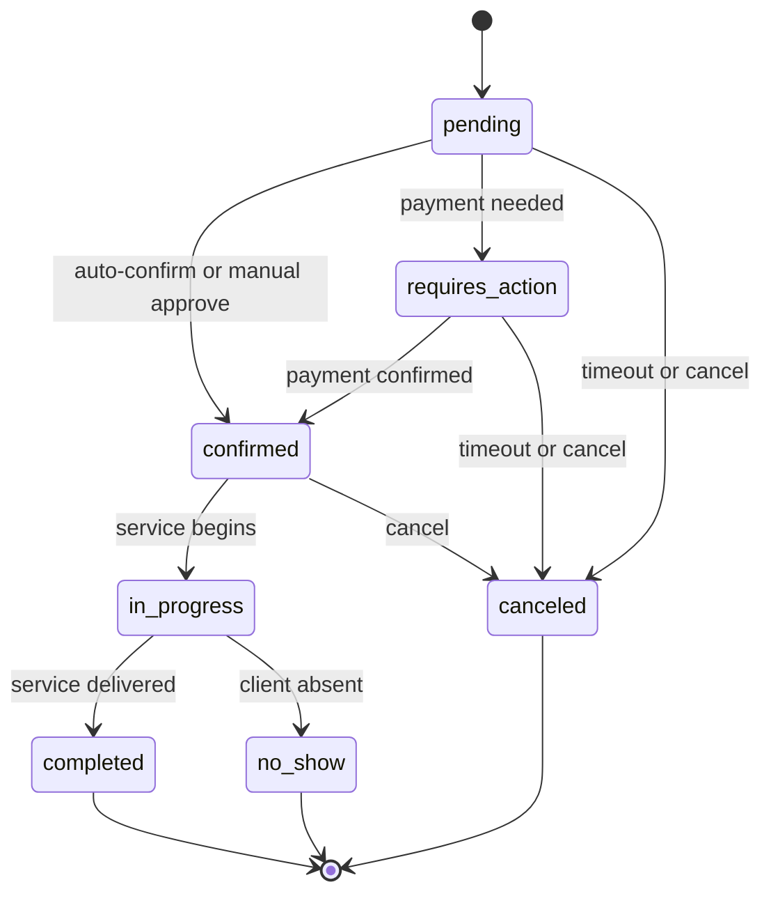

# Booking Lifecycle

**Capability:** `dev.usp.services.bookings`

The bookings capability defines the **lifecycle of a service booking** from creation through completion. For paid services, it also defines the `actions` array (including payment actions with `payment_context`) and the `confirm-payment` operation.

!!! note "Single-Service Design"
    USP bookings are single-service by design. Each `POST /bookings` creates exactly one booking for one service at one time slot. Multi-service coordination (e.g., a haircut followed by a color treatment) is handled by the platform issuing separate bookings.

---

## Booking Status Lifecycle



### Status Descriptions

| Status | Description |
|--------|-------------|
| `pending` | Booking created, awaiting confirmation. For `auto` mode, this is transient -- moves to `confirmed` immediately (or `requires_action` if payment is needed). For `manual` mode, remains until business confirms. |
| `requires_action` | One or more actions in the `actions` array have `status: pending`. Inspect `actions[]` for required tasks (e.g., payment, waiver signing). |
| `confirmed` | Booking is confirmed and service will proceed at the scheduled time. |
| `in_progress` | Service is currently being delivered. Transitioned by the business. |
| `completed` | Service has been delivered. Terminal state. |
| `no_show` | Client did not attend within the grace period. Terminal state. Business **MAY** charge the no-show fee. |
| `canceled` | Booking has been canceled. Can be reached from `pending`, `requires_action`, or `confirmed`. Terminal state. |

---

## Booking Schema

The booking object represents a scheduled service instance for a specific buyer at a specific time.

!!! tip "Deployment Mode Differences"
    In **UCP-Native Mode**, the `payment` field is not present on the booking (payment state is managed by the UCP checkout object). In **Standalone Mode**, the `payment` field is present and `actions` may contain payment action types.

| Field | Type | Required | Description |
|-------|------|----------|-------------|
| `id` | string | **Yes** | Unique booking identifier, generated by the business. |
| `service_id` | string | **Yes** | The booked service. |
| `service_name` | string | **Yes** | Service display name, captured at booking time (snapshot). |
| `slot` | object | **Yes** | `{id, start, end, duration}` -- the booked time slot. |
| `buyer` | Buyer | **Yes** | `{first_name, last_name, email, phone_number}` -- the person making and paying for the booking. |
| `recipient` | Buyer | No | `{first_name, last_name, email, phone_number}` -- the person receiving the service, when different from the buyer. |
| `party_size` | integer | **Yes** | Total number of attendees. |
| `resources` | Array[object] | No | `{id, type, name}` -- specific resources assigned to this booking. |
| `location` | object | No | `{id, name}` -- specific location for this booking. |
| `status` | string | **Yes** | Current booking status. See [Status Lifecycle](#booking-status-lifecycle). |
| `confirmation_mode` | string | **Yes** | `auto` or `manual`. |
| `payment` | BookingPayment | Conditional | Payment state. **MUST** be present when `requires_payment` is `true` and `payment_timing` is `at_booking` or `deposit_required`. **MUST** be omitted when `requires_payment` is `false`. |
| `actions` | Array[Action] | Conditional | Ordered array of pending tasks. **MUST** be present and non-empty when `status` is `requires_action`; **MUST** be absent or empty otherwise. |
| `notes` | string | No | Buyer-provided special requests or notes. |
| `booking_url` | string | No | Stable URL where the buyer can view and manage this booking. |
| `messages` | Array[Message] | No | Soft messages from the business providing context about the booking state. |
| `dispute` | Dispute | No | Present when a payment dispute has been opened. |
| `cancellation` | object | No | `{reason, canceled_by, fee, refund_amount, canceled_at}` -- present when canceled. |
| `created_at` | string | **Yes** | RFC 3339 timestamp of creation. |
| `updated_at` | string | **Yes** | RFC 3339 timestamp of last modification. |
| `expires_at` | string | No | RFC 3339 expiration time for `pending` and `requires_action` bookings. |

### Booking Expiry

When a `pending` or `requires_action` booking reaches its `expires_at` deadline:

1. The business **MUST** transition the booking to `status: canceled`.
2. The business **SHOULD** send a `booking.canceled` webhook.
3. The expired booking **MUST** remain retrievable via `GET /bookings/{booking_id}` with `status: canceled`.
4. The business **MUST** release the underlying slot hold.

!!! warning "Hold Alignment"
    For hold-backed bookings, the hold's `expires_at` **SHOULD** be aligned with or earlier than the booking's `expires_at` to prevent a race condition where the slot is released but the booking has not yet expired.

---

## Operations

### Create Booking -- `POST /bookings`

Creates a new booking for a service at a specific time slot. Resource selection is encoded in the `slot_id` -- the platform selects resources by choosing the appropriate slot at [availability query](availability.md#query-availability----post-availabilityquery) time.

**Request Fields:**

| Field | Type | Required | Description |
|-------|------|----------|-------------|
| `service_id` | string | **Yes** | The service to book. |
| `slot_id` | string | **Yes** | The selected time slot. |
| `hold_id` | string | No | Hold ID from a prior [hold operation](availability.md#hold-slot----post-availabilityholds). |
| `buyer` | object | **Yes** | Buyer contact information. |
| `recipient` | object | No | The person receiving the service, when different from the buyer. |
| `party_size` | integer | No | Number of participants. Default: 1. |
| `notes` | string | No | Free-text notes for the business. |
| `post_payment_return_request` | object | No | Platform's return instruction for redirect-based checkout flows. |

!!! tip "Idempotency"
    - **With a hold:** The business **SHOULD** treat `hold_id` as a natural idempotency key. A second `POST /bookings` with the same `hold_id` **MUST** return the existing booking.
    - **Without a hold:** Platforms **SHOULD** send an `Idempotency-Key` header. The business **MUST** honor it.

=== "Request (with hold)"

    ```json
    {
      "service_id": "svc_massage_001",
      "slot_id": "slot_20260316_1400",
      "hold_id": "hold_xyz789",
      "buyer": {
        "first_name": "Alice",
        "last_name": "Williams",
        "email": "alice@example.com",
        "phone_number": "+12125551234"
      },
      "party_size": 1,
      "notes": "First time visit"
    }
    ```

=== "Request (without hold)"

    ```json
    {
      "service_id": "svc_massage_001",
      "slot_id": "slot_20260316_1400",
      "buyer": {
        "first_name": "Alice",
        "last_name": "Williams",
        "email": "alice@example.com",
        "phone_number": "+12125551234"
      },
      "party_size": 1,
      "notes": "First time visit"
    }
    ```

=== "Request (booking on behalf of another person)"

    ```json
    {
      "service_id": "svc_haircut_kids",
      "slot_id": "slot_20260316_1600",
      "hold_id": "hold_abc456",
      "buyer": {
        "first_name": "Alice",
        "last_name": "Williams",
        "email": "alice@example.com",
        "phone_number": "+12125551234"
      },
      "recipient": {
        "first_name": "Max",
        "last_name": "Williams"
      },
      "party_size": 1,
      "notes": "He is 7 years old"
    }
    ```

=== "Response (paid service, `at_booking`)"

    ```json
    {
      "usp": {
        "version": "2026-02-09",
        "capabilities": {
          "dev.usp.services.bookings": [
            { "version": "2026-02-09" }
          ]
        }
      },
      "booking": {
        "id": "bkg_456def",
        "service_id": "svc_massage_001",
        "service_name": "Deep Tissue Massage",
        "slot": {
          "id": "slot_20260316_1400",
          "start": "2026-03-16T14:00:00-04:00",
          "end": "2026-03-16T15:00:00-04:00",
          "duration": "PT60M"
        },
        "buyer": {
          "first_name": "Alice",
          "last_name": "Williams",
          "email": "alice@example.com",
          "phone_number": "+12125551234"
        },
        "party_size": 1,
        "resources": [
          { "id": "staff_jane", "type": "staff", "name": "Jane Smith" }
        ],
        "status": "requires_action",
        "confirmation_mode": "auto",
        "payment": {
          "status": "pending",
          "timing": "at_booking",
          "amount": 12000,
          "currency": "USD",
          "amount_due": 12000
        },
        "actions": [
          {
            "type": "payment",
            "status": "pending",
            "continue_url": "https://business.example.com/pay/bkg_456def",
            "expires_at": "2026-03-16T13:10:00-04:00",
            "message": {
              "type": "info",
              "code": "payment_required",
              "content": "Payment of $120.00 is required to confirm this booking.",
              "severity": "requires_buyer_input"
            },
            "payment_context": {
              "amount_due": 12000,
              "currency": "USD",
              "description": "Deep Tissue Massage - Mar 16, 2:00 PM",
              "line_items": [
                {
                  "label": "Deep Tissue Massage (60 min)",
                  "amount": 12000,
                  "quantity": 1,
                  "item_id": "svc_massage_001"
                }
              ],
              "metadata": {
                "booking_id": "bkg_456def",
                "service_id": "svc_massage_001",
                "service_type": "appointment",
                "slot_start": "2026-03-16T14:00:00-04:00"
              }
            }
          }
        ],
        "created_at": "2026-03-14T22:05:00Z",
        "updated_at": "2026-03-14T22:05:00Z",
        "expires_at": "2026-03-16T13:10:00-04:00"
      }
    }
    ```

=== "Response (free service)"

    ```json
    {
      "usp": {
        "version": "2026-02-09",
        "capabilities": {
          "dev.usp.services.bookings": [
            { "version": "2026-02-09" }
          ]
        }
      },
      "booking": {
        "id": "bkg_789ghi",
        "service_id": "svc_yoga_free",
        "service_name": "Community Yoga",
        "slot": {
          "id": "slot_20260318_1000",
          "start": "2026-03-18T10:00:00-04:00",
          "end": "2026-03-18T11:00:00-04:00",
          "duration": "PT60M"
        },
        "buyer": {
          "first_name": "Alice",
          "last_name": "Williams",
          "email": "alice@example.com"
        },
        "party_size": 1,
        "status": "confirmed",
        "confirmation_mode": "auto",
        "created_at": "2026-03-14T22:05:00Z",
        "updated_at": "2026-03-14T22:05:00Z"
      }
    }
    ```

---

### Get Booking -- `GET /bookings/{booking_id}`

Returns the current state of a booking. Same structure as the booking object above.

---

### Update Booking -- `PUT /bookings/{booking_id}`

Updates mutable fields on a booking. Only `buyer`, `recipient`, and `notes` are mutable after creation. Omitted fields are left unchanged (partial update semantics).

| Field | Type | Required | Description |
|-------|------|----------|-------------|
| `buyer` | object | No | Updated buyer contact information. |
| `recipient` | object | No | Updated recipient information. |
| `notes` | string | No | Updated special requests or notes. |

```json
{
  "booking": {
    "id": "bkg_456def",
    "notes": "Please use hypoallergenic products",
    "buyer": {
      "first_name": "Alice",
      "last_name": "Williams",
      "email": "alice.new@example.com",
      "phone_number": "+12125551234"
    },
    "updated_at": "2026-03-15T10:00:00Z"
  }
}
```

---

### Confirm Booking -- `POST /bookings/{booking_id}/confirm`

Business-initiated confirmation for bookings with `confirmation_mode: manual`. Transitions from `pending` to `confirmed`. Calling this on an `auto`-mode booking that is already `confirmed` **MUST** return the current booking state (idempotent).

| Field | Type | Required | Description |
|-------|------|----------|-------------|
| `notes` | string | No | Optional message from the business to the buyer. |

```json
{
  "booking": {
    "id": "bkg_456def",
    "status": "confirmed",
    "confirmation_mode": "manual",
    "updated_at": "2026-03-15T09:00:00Z"
  }
}
```

---

### Cancel Booking -- `POST /bookings/{booking_id}/cancel`

Cancels a booking. Eligible from `pending`, `requires_action`, or `confirmed` status. Cancellation fees are applied per the service's [cancellation policy](service-catalog.md#service-policies).

| Field | Type | Required | Description |
|-------|------|----------|-------------|
| `reason` | string | No | Human-readable cancellation reason. |
| `canceled_by` | string | No | Who initiated: `buyer`, `business`, or `system`. Default: `buyer`. |

```json
{
  "booking": {
    "id": "bkg_456def",
    "status": "canceled",
    "cancellation": {
      "reason": "Schedule conflict",
      "canceled_by": "buyer",
      "fee": 0,
      "refund_amount": 12000,
      "canceled_at": "2026-03-15T08:30:00Z"
    },
    "payment": {
      "status": "refunded",
      "timing": "at_booking",
      "amount": 12000,
      "currency": "USD",
      "amount_due": 0,
      "transaction_id": "txn_abc123"
    },
    "updated_at": "2026-03-15T08:30:00Z"
  }
}
```

---

### Reschedule Booking -- `POST /bookings/{booking_id}/reschedule`

Moves a booking to a different time slot. Rescheduling preserves the booking `id` -- this is not a cancel + rebook. The original slot is released and the new slot is occupied.

**Eligible statuses:** `confirmed` (**MUST** be supported). `pending` **SHOULD** be allowed. `requires_action` is at the business's discretion. Rescheduling a `canceled` or terminal-state booking **MUST** return a 409 error.

| Field | Type | Required | Description |
|-------|------|----------|-------------|
| `slot_id` | string | **Yes** | The new slot to reschedule to. |
| `hold_id` | string | No | Hold ID for the new slot, when business supports holds. |

!!! note "Price Changes on Reschedule"
    When slot-level pricing differs between the original and new slot (e.g., rescheduling from off-peak to peak), the business **SHOULD** update `payment.amount`. If additional payment is required, the business **MUST** add a new `payment`-type action to `actions[]`, transitioning the booking to `requires_action`.

---

### Confirm Payment -- `POST /bookings/{booking_id}/confirm-payment`

The universal callback the platform calls after payment succeeds. This completes the payment action in the booking's `actions` array. If no pending actions remain, the booking transitions to `confirmed`.

=== "Request"

    ```json
    {
      "payment_result": {
        "status": "paid",
        "provider": "stripe",
        "transaction_id": "txn_abc123",
        "amount_paid": 12000,
        "currency": "USD",
        "order_reference": "ord_xyz789"
      }
    }
    ```

=== "Response"

    ```json
    {
      "usp": {
        "version": "2026-02-09",
        "capabilities": {
          "dev.usp.services.bookings": [
            { "version": "2026-02-09" }
          ]
        }
      },
      "booking": {
        "id": "bkg_456def",
        "status": "confirmed",
        "payment": {
          "status": "paid",
          "timing": "at_booking",
          "amount": 12000,
          "currency": "USD",
          "amount_due": 0,
          "transaction_id": "txn_abc123",
          "order_reference": "ord_xyz789"
        },
        "updated_at": "2026-03-14T22:06:00Z"
      }
    }
    ```

**`payment_result` Fields:**

| Field | Type | Required | Description |
|-------|------|----------|-------------|
| `status` | string | **Yes** | `paid` (full amount) or `deposit_paid` (deposit amount). |
| `provider` | string | No | Payment provider identifier (e.g., `stripe`, `adyen`). Informational. |
| `transaction_id` | string | **Yes** | Transaction identifier for reconciliation and refund processing. |
| `amount_paid` | integer | **Yes** | Amount paid in minor currency units. |
| `currency` | string | **Yes** | ISO 4217 currency code. |
| `order_reference` | string | No | External order identifier for cross-system reconciliation. |

---

## Webhooks

Businesses **SHOULD** notify platforms of state changes via webhooks. Webhook payloads **MUST** be signed.

### Booking Webhooks

| Event | Trigger |
|-------|---------|
| `booking.confirmed` | Business confirms (manual mode) or payment completes |
| `booking.canceled` | Business or system cancels the booking |
| `booking.rescheduled` | Business reschedules the booking |
| `booking.reminder` | Upcoming appointment reminder (e.g., 24 hours before) |
| `booking.completed` | Service has been delivered |
| `booking.no_show` | Client did not attend within the grace period |
| `booking.refund_issued` | A full or partial refund has been issued |
| `booking.dispute_opened` | A dispute or chargeback has been opened |
| `booking.dispute_resolved` | A dispute has been resolved |
| `booking.service_started` | Service delivery has begun |
| `booking.service_updated` | Service details changed during delivery |

**Webhook Payload Schema:**

| Field | Type | Required | Description |
|-------|------|----------|-------------|
| `event` | string | **Yes** | Event type (e.g., `booking.confirmed`). |
| `event_id` | string | **Yes** | Unique event identifier for idempotent processing. |
| `booking_id` | string | **Yes** | The booking this event relates to. |
| `order_id` | string | No | UCP order ID. **SHOULD** be included for UCP-Native Mode bookings. |
| `timestamp` | string | **Yes** | RFC 3339 timestamp of when the event occurred. |
| `data` | object | No | Full booking object. **SHOULD** be included for most events. **MAY** be omitted for `reminder` events. |

```json
{
  "event": "booking.confirmed",
  "event_id": "evt_789abc",
  "booking_id": "bkg_456def",
  "order_id": "ord_ucp_001",
  "timestamp": "2026-03-15T09:00:00Z",
  "data": {
    "id": "bkg_456def",
    "service_id": "svc_massage_001",
    "service_name": "Deep Tissue Massage",
    "slot": {
      "id": "slot_20260316_1400",
      "start": "2026-03-16T14:00:00-04:00",
      "end": "2026-03-16T15:00:00-04:00",
      "duration": "PT60M"
    },
    "buyer": {
      "first_name": "Alice",
      "last_name": "Williams",
      "email": "alice@example.com"
    },
    "party_size": 1,
    "status": "confirmed",
    "confirmation_mode": "manual",
    "created_at": "2026-03-14T22:05:00Z",
    "updated_at": "2026-03-15T09:00:00Z"
  }
}
```

### Catalog Change Webhooks

Businesses **SHOULD** notify platforms of catalog changes via webhooks. This provides a push-based complement to the pull-based [service catalog feed](service-catalog.md#catalog-feed).

| Event | Trigger |
|-------|---------|
| `service.created` | A new service has been added to the catalog |
| `service.updated` | Service details have changed |
| `service.deleted` | A service has been permanently removed |
| `service.suspended` | A service is temporarily unavailable |

| Field | Type | Required | Description |
|-------|------|----------|-------------|
| `event` | string | **Yes** | Event type. |
| `event_id` | string | **Yes** | Unique event identifier. |
| `service_id` | string | **Yes** | The service this event relates to. |
| `subscription_id` | string | **Yes** | The subscription that triggered this notification. |
| `timestamp` | string | **Yes** | RFC 3339 timestamp. |
| `data` | object | No | Full service object for `created` and `updated` events. |

---

## Post-Booking Lifecycle

After a booking reaches a terminal state (`completed`, `no_show`, `canceled`), additional lifecycle events may occur.

### Refund Tracking

When a refund is issued, the booking's `payment` object **MUST** be updated:

| `payment.status` | Description |
|-------------------|-------------|
| `refunded` | Full refund issued. |
| `partially_refunded` | Partial refund issued (e.g., cancellation fee withheld). |

The business **MUST** send a `booking.refund_issued` webhook when a refund is processed.

### Dispute Resolution

When a payment dispute (chargeback) is opened, the business **SHOULD** update the booking with dispute information and send a `booking.dispute_opened` webhook.

**Dispute Object:**

| Field | Type | Required | Description |
|-------|------|----------|-------------|
| `status` | string | **Yes** | `opened`, `under_review`, `resolved_buyer`, or `resolved_business`. |
| `reason` | string | **Yes** | Machine-readable reason: `service_not_provided`, `quality_issue`, `unauthorized`, `duplicate`. |
| `opened_at` | string | **Yes** | RFC 3339 timestamp. |
| `resolved_at` | string | No | Present only when resolved. |

!!! warning "Payment Status During Disputes"
    Opening a dispute does **NOT** change `payment.status` -- the payment remains `paid` while the dispute is under review. `payment.status` **MAY** change to `refunded` or `partially_refunded` only if the dispute resolves in the buyer's favor.

### Service Delivery Events

For complex services (e.g., multi-step healthcare, ongoing rentals), businesses **MAY** emit intermediate delivery events:

| Event | Trigger |
|-------|---------|
| `booking.service_started` | Service delivery has begun (e.g., rental pickup, appointment check-in) |
| `booking.service_updated` | Service details changed during delivery (e.g., extended rental, additional treatment) |

These events are informational and do not change the booking's primary status.
