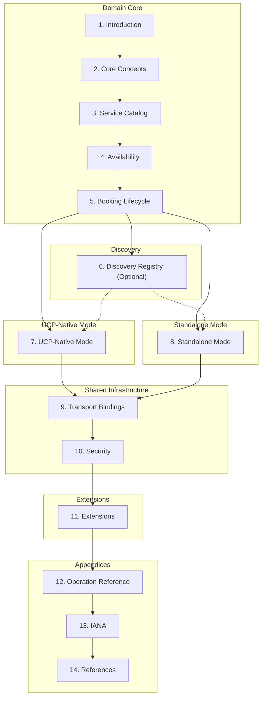

# Specification Overview

**Protocol Version:** `2026-02-21` | **Status:** Draft

The Universal Scheduling Protocol (USP) is an open standard that enables
consumer platforms and AI agents to discover, check availability of, and book
time-based services from businesses. USP supports both **paid** and **free**
agentic scheduling through two deployment modes.

USP defines three core capabilities -- service catalog, availability, and
booking -- along with optional extensions for waitlist management. It supports
REST, MCP, A2A, and ESP transport bindings and references IETF standards
directly for cross-cutting concerns (security, authorization, error format,
idempotency, webhook verification).

!!! note "Deployment Modes"
    USP offers two deployment modes: **UCP-Native Mode** for platforms that already
    support the Universal Commerce Protocol (UCP), where scheduling
    capabilities register directly in the UCP profile and paid bookings use atomic
    checkout; and **Standalone Mode** for platforms that want a self-contained
    scheduling protocol with generic payment handoff. Both modes share the same
    domain core and the same transport bindings. The mode determines only how
    discovery, payment, and infrastructure are handled.

---

## Specification Contents

| Section | Page | Description |
|---------|------|-------------|
| **Service Catalog** | [service-catalog.md](service-catalog.md) | Service discovery, catalog feed, schemas (Service, Duration, Pricing, Policies, Resources), and operations |
| **Availability** | [availability.md](availability.md) | Time slots, holds, availability queries (slot and day granularity), caching strategy |
| **Booking Lifecycle** | [booking.md](booking.md) | Booking status lifecycle, schema, CRUD operations, webhooks, post-booking events |
| **Discovery Registry** | [discovery-registry.md](discovery-registry.md) | Optional registry for cold-start business discovery, search operations, governance |

---

## Conventions

The keywords **MUST**, **MUST NOT**, **REQUIRED**, **SHALL**, **SHALL NOT**, **SHOULD**, **SHOULD NOT**, **RECOMMENDED**, **MAY**, and **OPTIONAL** in this
specification are to be interpreted as described in [RFC 2119](https://www.rfc-editor.org/rfc/rfc2119) and [RFC 8174](https://www.rfc-editor.org/rfc/rfc8174). These
keywords only carry their special meaning when they appear in all capitals.

| Convention | Format | Example |
|-----------|--------|---------|
| **Dates** | [RFC 3339](https://www.rfc-editor.org/rfc/rfc3339) | `2026-03-15T09:00:00-04:00` |
| **Durations** | [ISO 8601](https://en.wikipedia.org/wiki/ISO_8601#Durations) | `PT60M`, `PT24H`, `P90D` |
| **Currency amounts** | Minor units / cents | `7500` = $75.00 |
| **Timezones** | [IANA Time Zone Database](https://www.iana.org/time-zones) | `America/New_York` |

---

## Terminology

| Term | Definition |
|------|-----------|
| **Booking** | A confirmed or pending reservation of a specific service at a specific time for a specific buyer. A booking has a lifecycle (create, confirm, reschedule, cancel, complete). |
| **Business** | The entity offering time-based services. The business owns the schedule, resources, and booking policies. For payment purposes, the business is the Merchant of Record. |
| **Buyer** | The person making and paying for the booking. Represented by a `buyer` object containing identity fields (name, email, phone). When no separate `recipient` is specified, the buyer is also the person receiving the service. |
| **Capability** | A standalone feature a business supports, identified by a namespaced string (e.g., `dev.usp.services.catalog`). Each capability has a version, schema, and specification URL. |
| **Action** | A pending task the buyer must complete before a booking can be confirmed. Each action has a type, status, continue URL, and expiry. Actions are returned in the ordered `actions` array on the booking when `status` is `requires_action`. |
| **Checkout System** | Any external commerce protocol or payment mechanism used to process payment for a booking. USP does not prescribe which checkout system to use. |
| **Extension** | An optional module that augments a capability via the `extends` field. Extensions add functionality without modifying the base capability. |
| **Hold** | A temporary reservation of a time slot that prevents double-booking during the booking flow. Holds have a short TTL and are automatically released on expiry. |
| **Payment Context** | A universal handoff object containing amount, currency, line items, and metadata -- everything a checkout system needs to process payment. |
| **Platform** | The consumer-facing application or AI agent acting on behalf of the buyer. Platforms orchestrate the scheduling journey from discovery through booking and payment. |
| **Recipient** | The person receiving the service, when different from the buyer. Represented by an optional `recipient` object on the booking with the same identity fields as `buyer`. |
| **Service** | A time-based offering provided by a business (e.g., a haircut, yoga class, restaurant table, car rental). Each service has a type, duration, pricing, and policies. |
| **Slot** | A specific, bookable time window for a service. Slots are computed dynamically from the business's schedule, resources, and existing bookings. |
| **Vertical** | A classification of service type that determines the scheduling semantics (e.g., `appointment`, `group`, `reservation`, `rental`). |
| **BusyBlock** | An opaque time block (`{start, end}`) from a buyer's calendar indicating the buyer is unavailable. Contains no event details. |
| **BuyerFreeBusy** | Aggregated free/busy data for a buyer, containing an array of `BusyBlock` entries merged across connected calendar providers. Used by platforms to filter business availability. |

---

## Service Verticals

USP defines four core service verticals. The `type` field on a service **MUST** be set to one of these values, or to a vendor-defined vertical using reverse-domain notation (e.g., `com.wix.services.courses`).

| Vertical | Description | Examples |
|----------|-------------|----------|
| `appointment` | A 1:1 session between a single client and a provider. | Salon, dental, consulting, personal training, therapy |
| `group` | A group session with limited capacity. Multiple buyers book into the same time slot. | Yoga class, workshop, group fitness, cooking class |
| `reservation` | A hold on a shared resource for a time window. | Restaurant table, conference room, venue, court booking |
| `rental` | Temporary exclusive use of equipment or space for a duration. | Car rental, studio space, equipment hire, vacation rental |

!!! tip "Custom Verticals"
    Vendors **MAY** define custom verticals using their reverse-domain namespace: `com.{vendor}.services.{vertical_name}`. Custom verticals **MUST** publish a specification and schema. Platforms encountering an unrecognized vertical **SHOULD** fall back to treating the service as an `appointment` type.

---

## Choosing a Deployment Mode

| If your platform... | Choose | Read |
|---------------------|--------|------|
| Already supports UCP | **UCP-Native Mode** | Sections 1-5, optionally 6, 7, 9.1-9.5, 10.1, optionally 11, 12-14 |
| Does not support UCP, or wants a standalone scheduling protocol | **Standalone Mode** | Sections 1-6, 8, 9 (all), 10 (all), optionally 11, 12-14 |
| Only offers free services | Either mode (for discovery only) | Sections 1-5, optionally 6, chosen mode section (without payment), 9-10, 12-14 |

### Reading Path by Implementer Type

| Implementer Type | Sections to Read | Skip Rules |
|-----------------|------------------|------------|
| **UCP-Native (paid + free)** | 1-5, optionally 6, 7, 9-10, optionally 11, 12-14 | Skip Sections 9.6 and 10.2 (UCP provides infrastructure) |
| **Standalone (paid + free)** | 1-6, 8, 9-10 (all), optionally 11, 12-14 | Read all subsections |
| **Free services only** | 1-5, optionally 6, mode section (7 or 8), 9-10, 12-14 | Skip payment subsections in mode section |
| **Minimal v1** | 1-5, mode section, 9-10 | Skip extensions (Section 11) entirely |

---

## Reading Flow

The following diagram shows how the specification sections connect and flow between deployment modes:

---

## Relationship to Other Standards

| Standard | Relationship to USP |
|----------|-------------------|
| **RFC 5545** (iCalendar) | USP's booking and availability concepts are semantically related to iCalendar components. Businesses **SHOULD** support exporting confirmed bookings as iCalendar `VEVENT` objects. |
| **RFC 5546** (iTIP) | USP's booking operations (create, confirm, reschedule, cancel) are semantically equivalent to iTIP methods. USP extends beyond iTIP by adding service discovery, real-time availability, slot holds, payment integration, and agentic transport bindings. |
| **RFC 6638** (CalDAV Scheduling) | USP's availability query serves a similar purpose but is designed for cross-organization, platform-to-business interactions. |
| **schema.org/Service** | USP's service catalog complements schema.org -- businesses **SHOULD** expose service catalog data as schema.org structured data for search engine discoverability. |
| **OpenActive** | USP differs from OpenActive in three key ways: (1) flexible payment integration, (2) agentic commerce with MCP/A2A bindings, and (3) broader range of service verticals. |
| **UCP** | USP includes a UCP-Native Mode where scheduling capabilities register directly in the UCP profile. |
| **RFC 9457** (Problem Details) | USP uses RFC 9457 Problem Details for HTTP error responses. |
| **RFC 6749** (OAuth 2.0) | USP uses OAuth 2.0 for authorization and identity linking. |
| **RFC 9421** (HTTP Message Signatures) | USP uses HTTP Message Signatures for webhook integrity verification. |

---

## Core Constructs

USP is built on three constructs:

| Construct | Description | Examples |
|-----------|-------------|----------|
| **Capabilities** | Standalone features a business supports, declared using a registry pattern. Each capability has a namespace, schema, and version. | `dev.usp.services.catalog`, `dev.usp.services.availability`, `dev.usp.services.bookings` |
| **Extensions** | Optional modules that augment a capability via the `extends` field. Extensions use JSON Schema composition (`allOf`, `$defs`) to layer additional fields onto base schemas. | Waitlist management, paid bookings, vendor-specific loyalty |
| **Transport Bindings** | Declarations of how USP traffic is carried (REST, MCP, A2A, embedded). | REST (OpenAPI 3.x), MCP (OpenRPC / JSON-RPC), A2A (Agent Card) |

### Namespace Governance

USP uses reverse-domain notation for capability names: `{reverse-domain}.{service}.{capability}`

| Namespace pattern | Authority | Governance |
|-------------------|-----------|------------|
| `dev.usp.*` | usp.dev | USP governing body |
| `com.{vendor}.*` | {vendor}.com | Vendor organization |
| `org.{org}.*` | {org}.org | Organization |

!!! warning "Spec URL Binding"
    The `spec` and `schema` URLs on each capability entry **MUST** use origins that match the reverse-domain namespace authority of the capability name. Platforms **MUST** validate this binding when processing profiles.
