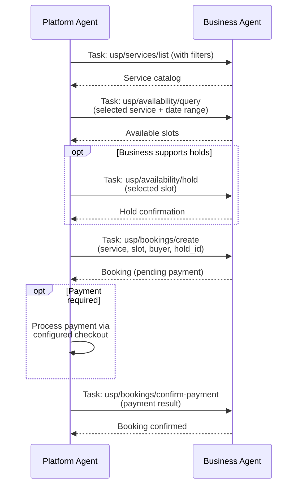
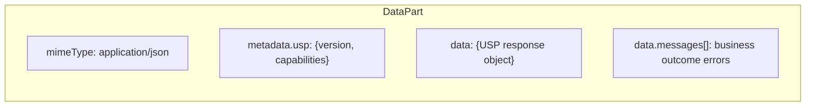
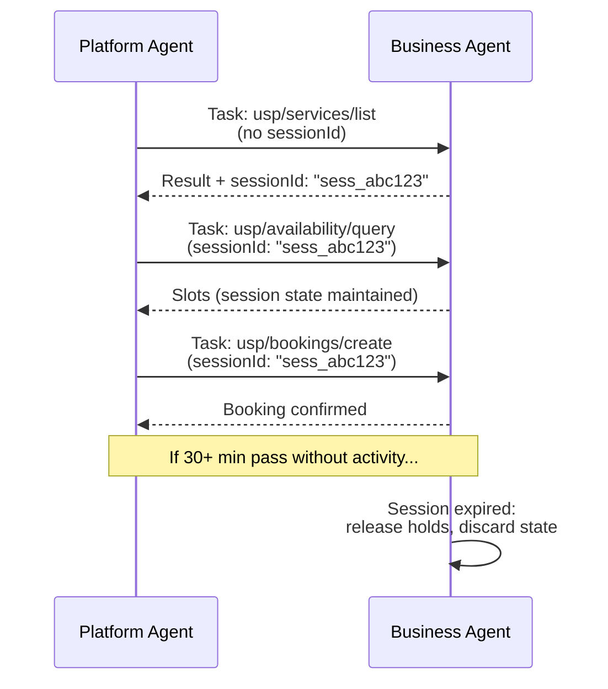

# A2A Binding

The A2A (Agent-to-Agent) binding enables USP interactions between autonomous agents using the [A2A protocol](https://a2a-protocol.org/latest/).

| Property | Value |
|----------|-------|
| **Schema format** | Agent Card Specification |
| **Transport** | A2A protocol (HTTP-based agent messaging) |

Each USP operation is expressed as an A2A **task**. The full multi-step booking flow is supported through A2A task chaining.

## Task-Type Mapping

| USP Operation | A2A Task Type | Description |
|---------------|---------------|-------------|
| List Services | `usp/services/list` | Discovery task |
| Get Service | `usp/services/get` | Get single service |
| Service Feed | `usp/services/feed` | Feed sync task |
| Query Availability | `usp/availability/query` | Availability task |
| Hold Slot | `usp/availability/hold` | Hold task (requires `holds: true`) |
| Release Slot | `usp/availability/release` | Release task (requires `holds: true`) |
| Create Booking | `usp/bookings/create` | Booking task |
| Get Booking | `usp/bookings/get` | Booking status |
| Cancel Booking | `usp/bookings/cancel` | Cancellation task |
| Reschedule Booking | `usp/bookings/reschedule` | Reschedule task |
| Confirm Payment | `usp/bookings/confirm-payment` | Payment confirmation |
| Join Waitlist | `usp/waitlist/join` | Waitlist task |

## End-to-End Booking Flow via A2A

The following shows a complete booking flow through A2A task chaining between a scheduling agent and a business agent:



### Step-by-Step

1. **Platform agent sends `usp/services/list`** with filters. Business agent returns the service catalog.
2. **Platform agent sends `usp/availability/query`** with the selected service and date range. Business agent returns available slots.
3. *(If business supports holds)* **Platform agent sends `usp/availability/hold`** with the selected slot. Business agent returns the hold.
4. **Platform agent sends `usp/bookings/create`** with service, slot, buyer, optional recipient, and `hold_id` (if step 3 was performed). Business agent returns the booking.
5. *(If payment required)* Platform agent processes payment through the configured checkout system.
6. **Platform agent sends `usp/bookings/confirm-payment`** with the payment result.

Each task in the chain carries the A2A conversation context, enabling the business agent to maintain state across the multi-step flow.

## Agent Card

A USP-enabled business agent **MUST** publish an [Agent Card](https://a2a-protocol.org/latest/#agent-card) advertising its USP capabilities. The Agent Card SHOULD include the supported USP task types and authentication requirements.

### Example Agent Card

```json
{
  "name": "Glamour Salon Scheduling Agent",
  "description": "Handles appointment booking for Glamour Salon via USP.",
  "url": "https://salon.example.com/a2a",
  "capabilities": {
    "tasks": [
      "usp/services/list",
      "usp/availability/query",
      "usp/bookings/create",
      "usp/bookings/cancel",
      "usp/bookings/reschedule"
    ]
  },
  "authentication": {
    "schemes": ["bearer"]
  },
  "usp_profile": "https://salon.example.com/.well-known/usp"
}
```

!!! info "`usp_profile` extension"

    The `usp_profile` field is a USP extension that points to the business's `/.well-known/usp` profile, enabling platform agents to perform capability negotiation.

## DataPart Conventions

USP data maps to A2A [DataPart](https://a2a-protocol.org/latest/#data-parts) objects as follows:

- Each USP response is carried as a DataPart with `mimeType: "application/json"` and `data` containing the USP response object.
- The USP metadata (`usp` envelope with `version` and `capabilities`) is carried in the DataPart's `metadata` field.
- Business outcome errors are carried in `data.messages[]`, consistent with the REST and MCP bindings.

### Example DataPart

**Availability response as a DataPart:**

```json
{
  "mimeType": "application/json",
  "metadata": {
    "usp": {
      "version": "2026-08-14"
    }
  },
  "data": {
    "service_id": "svc_haircut_001",
    "slots": [
      {
        "id": "slot_20260315_0900",
        "start": "2026-03-15T09:00:00-04:00",
        "end": "2026-03-15T10:00:00-04:00",
        "state": "available"
      }
    ],
    "messages": []
  }
}
```



## Session Management

A2A tasks within the same booking flow **SHOULD** share a session context (`sessionId`). The session enables the business agent to maintain state (e.g., held slots, partial booking data) across multi-step task chains.

### Rules

| Rule | Requirement |
|------|-------------|
| Platform sends `sessionId` | SHOULD include on all tasks after the first in a booking flow |
| Business returns `sessionId` | MUST return in the response to the first task if session continuity is required |
| Session timeout | SHOULD be at least 30 minutes for multi-step flows |
| Session expiry behavior | Any associated holds are released and partial booking state is discarded |



## Conformance Requirements

### MUST

A conforming A2A binding implementation **MUST:**

1. Publish an Agent Card advertising supported USP task types.
2. Use task types from the task-type mapping table above.
3. Carry USP data as DataParts with `mimeType: "application/json"`.
4. Return business outcome errors in `data.messages[]`, consistent with REST and MCP bindings.

### SHOULD

A conforming A2A binding implementation **SHOULD:**

1. Maintain session context (`sessionId`) across multi-step booking flows.
2. Include the `usp_profile` field in the Agent Card pointing to `/.well-known/usp`.
