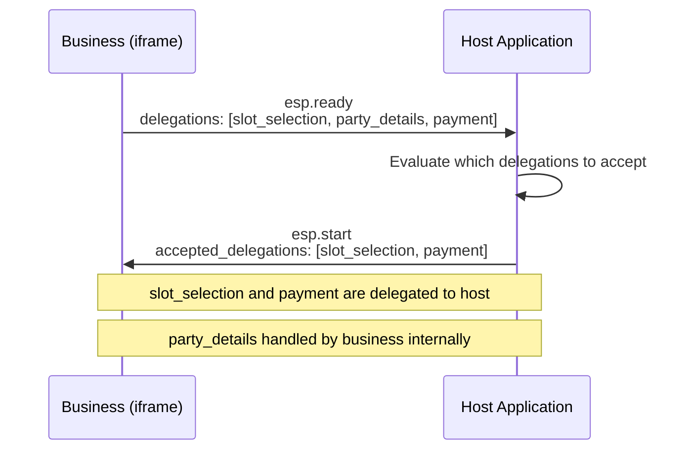
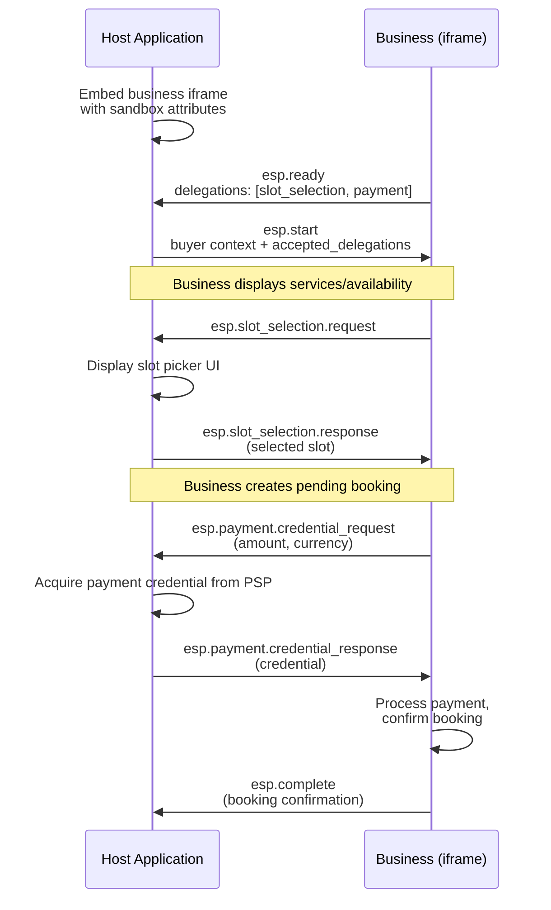
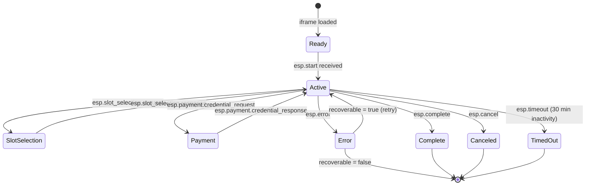

# Embedded Scheduling Protocol (ESP)

The Embedded Scheduling Protocol enables a host application to embed a business's scheduling UI within its own interface while maintaining delegation control over payment, participant details, and slot selection.

!!! note "UCP-Native Mode"

    In UCP-Native Mode, ESP extends UCP's Embedded Checkout Protocol (ECP). The foundational protocol (communication channel, security model, ready/start/complete lifecycle) is inherited from ECP. ESP adds the scheduling-specific delegation messages defined in this section.

## Message Schemas

ESP uses JSON-RPC 2.0 messaging over `MessageChannel` (web) or injected globals (native):

| Message | Direction | Description |
|---------|-----------|-------------|
| `esp.ready` | Business :material-arrow-right: Host | Business signals the embedded UI is ready |
| `esp.start` | Host :material-arrow-right: Business | Host initiates the scheduling flow with context |
| `esp.slot_selection.request` | Business :material-arrow-right: Host | Business requests slot selection from host |
| `esp.slot_selection.response` | Host :material-arrow-right: Business | Host returns the selected slot |
| `esp.party_details.request` | Business :material-arrow-right: Host | Business requests participant details |
| `esp.party_details.response` | Host :material-arrow-right: Business | Host returns participant information |
| `esp.payment.credential_request` | Business :material-arrow-right: Host | Business requests payment credential |
| `esp.payment.credential_response` | Host :material-arrow-right: Business | Host returns the payment credential |
| `esp.complete` | Business :material-arrow-right: Host | Booking is complete |
| `esp.error` | Business :material-arrow-right: Host | Business signals an error during the flow |
| `esp.cancel` | Host :material-arrow-right: Business | Host requests cancellation of the in-progress flow |
| `esp.timeout` | Business :material-arrow-right: Host | Business signals the session has timed out |

### `esp.ready`

Sent by the business when the embedded UI is loaded and ready. Declares which delegations the business supports.

```json
{
  "jsonrpc": "2.0",
  "method": "esp.ready",
  "params": {
    "delegations": [
      "slot_selection",
      "party_details",
      "payment"
    ],
    "service_id": "svc_massage_001",
    "version": "2026-08-20"
  }
}
```

### `esp.start`

Sent by the host to initiate the scheduling flow. Includes buyer context, optional recipient, preferences, and which delegations the host accepts.

```json
{
  "jsonrpc": "2.0",
  "method": "esp.start",
  "params": {
    "buyer": {
      "first_name": "Alice",
      "email": "alice@example.com"
    },
    "recipient": {
      "first_name": "Max",
      "last_name": "Williams"
    },
    "preferences": {
      "date": "2026-03-16",
      "time_of_day": "afternoon"
    },
    "accepted_delegations": [
      "slot_selection",
      "payment"
    ]
  }
}
```

## Delegation Negotiation

When the business sends `esp.ready`, it declares which delegations it supports via the `delegations` array. The host responds with `esp.start`, specifying which delegations it accepts via `accepted_delegations`. Only accepted delegations are active for the session.

| Delegation | Description |
|------------|-------------|
| `slot_selection` | Host provides the time slot picker UI. Business requests slot via `esp.slot_selection.request`. |
| `party_details` | Host provides participant details, including buyer and optional recipient information. Business requests via `esp.party_details.request`. |
| `payment` | Host handles payment credential acquisition. Business requests via `esp.payment.credential_request`. |

If a delegation is not accepted, the business handles that step internally within its embedded UI.



## Iframe Security

ESP iframes **MUST** use the `sandbox` attribute with the following minimum values:

```html
<iframe
    src="https://business.example.com/esp/svc_massage_001"
    sandbox="allow-scripts allow-same-origin allow-forms"
    referrerpolicy="no-referrer"
></iframe>
```

### Security Requirements

| Requirement | Details |
|-------------|---------|
| **Content-Security-Policy** | Business MUST set CSP headers restricting the embedded page's capabilities |
| **Communication channel** | Host MUST use `MessageChannel` -- direct `postMessage` to `window.parent` is not permitted |
| **Message validation** | All ESP messages MUST be validated against the expected JSON-RPC schema before processing |
| **Sandbox attribute** | MUST include `allow-scripts allow-same-origin allow-forms` at minimum |
| **Referrer policy** | SHOULD use `no-referrer` |

!!! danger "Security note"

    Direct `postMessage` to `window.parent` is **not permitted**. Always use `MessageChannel` for ESP communication. This prevents message spoofing from other frames on the page.

## Example Flow

A complete ESP scheduling flow with slot selection and payment delegation:



### Step-by-Step

1. **Host** embeds the business scheduling iframe with `sandbox` attributes.
2. **Business** sends `esp.ready` with `delegations: ["slot_selection", "payment"]`.
3. **Host** sends `esp.start` with buyer context, optional recipient, and `accepted_delegations: ["slot_selection", "payment"]`.
4. **Business** displays services/availability. When the buyer selects a service, business sends `esp.slot_selection.request`.
5. **Host** displays its own slot picker UI. User selects a slot. Host sends `esp.slot_selection.response` with the selected slot.
6. **Business** creates a pending booking. Business sends `esp.payment.credential_request` with amount and currency.
7. **Host** acquires payment credential from its PSP. Host sends `esp.payment.credential_response` with the credential.
8. **Business** processes payment, confirms booking, sends `esp.complete` with the booking confirmation.

## Error Handling and Timeouts

### `esp.error`

If the business encounters an error during any delegation step, it **MUST** send `esp.error` with a machine-readable code, human-readable message, and a `recoverable` flag indicating whether the host can retry.

```json
{
  "jsonrpc": "2.0",
  "method": "esp.error",
  "params": {
    "code": "payment_failed",
    "message": "The payment credential was declined by the processor.",
    "recoverable": true
  }
}
```

### Well-Known Error Codes

| Code | Description | Recoverable |
|------|-------------|-------------|
| `canceled` | The flow was canceled by the host via `esp.cancel` | No |
| `payment_failed` | Payment credential was declined | Yes |
| `slot_unavailable` | The selected slot became unavailable during the flow | Yes |
| `internal_error` | Unexpected business-side failure | No |

### `esp.cancel`

If the host wants to cancel the in-progress scheduling flow (e.g., user navigated away), it sends `esp.cancel`. The business **MUST** release any held slots and respond with either `esp.error` (code: `"canceled"`) or `esp.complete` with a cancellation status.

```json
{
  "jsonrpc": "2.0",
  "method": "esp.cancel",
  "params": {}
}
```

### Session Timeout

ESP sessions **SHOULD** have a configurable timeout with a default of **30 minutes**. If the session times out (no messages exchanged within the timeout window), the business sends `esp.timeout`. Any pending holds are released and partial booking state is discarded.

```json
{
  "jsonrpc": "2.0",
  "method": "esp.timeout",
  "params": {
    "message": "The scheduling session has timed out after 30 minutes of inactivity."
  }
}
```



## Observability Join

Participating ESP hosts and businesses **MAY** carry an optional `correlation_id` on `esp.start`, `esp.complete`, and `esp.error`. See [Section 9.7](https://github.com/wix/universal-scheduling-protocol/blob/master/specification.md#97-observability-join-non-normative-recommendation). Omitting it is conformant USP.

## Conformance Requirements

### MUST

A conforming ESP implementation **MUST:**

1. Use the `sandbox` attribute on iframes with the minimum values `allow-scripts allow-same-origin allow-forms`.
2. Validate all ESP messages against the expected JSON-RPC schema before processing.
3. Support the `esp.error` message for error signaling.
4. Release any held slots when the session times out or is canceled.
5. Use `MessageChannel` for communication -- direct `postMessage` to `window.parent` is not permitted.

### SHOULD

A conforming ESP implementation **SHOULD:**

1. Support delegation negotiation via `esp.ready` and `esp.start`.
2. Implement a session timeout of at least 30 minutes.
3. Support the `esp.cancel` message from the host.
