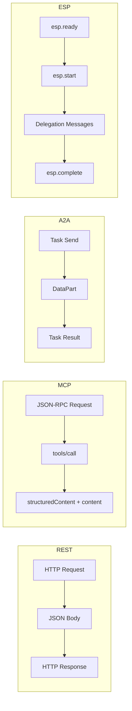

# Transport Bindings

USP is **transport-agnostic**. The protocol defines operations and schemas independent of the wire format, allowing businesses and platforms to communicate over whichever transport best fits their architecture.

This section specifies how USP operations map to each supported transport. A business may support one or more bindings simultaneously; a platform selects a binding based on the business profile advertised at `/.well-known/usp`.

## Supported Bindings

USP defines four transport bindings:

| Binding | Wire Format | Primary Use Case | Schema Format | Discovery |
|---------|------------|------------------|---------------|-----------|
| [**REST**](rest.md) | HTTP/1.1+ with JSON | Web apps, server-to-server integrations | OpenAPI 3.x | `/.well-known/usp` profile |
| [**MCP**](mcp.md) | JSON-RPC 2.0 (stdio / HTTP-SSE) | AI agents via tool calls | OpenRPC | `_meta.usp.profile` field |
| [**A2A**](a2a.md) | A2A protocol (HTTP-based agent messaging) | Autonomous agent-to-agent workflows | Agent Card Specification | Agent Card with `usp_profile` |
| [**ESP**](esp.md) | JSON-RPC 2.0 over `MessageChannel` | Embedded scheduling UI within a host app | JSON-RPC message schemas | Iframe embedding |

## Choosing a Binding

!!! tip "Decision Guide"

    - **Building a web or mobile application?** Use the [REST binding](rest.md). It is the most widely supported and all specification examples use REST.
    - **Building an AI agent or LLM tool integration?** Use the [MCP binding](mcp.md). It maps USP operations to JSON-RPC tool calls consumable by any MCP-compatible agent.
    - **Building autonomous agent-to-agent workflows?** Use the [A2A binding](a2a.md). It supports multi-step task chaining with session management.
    - **Embedding a business's scheduling UI inside your own app?** Use the [ESP binding](esp.md). It provides delegation negotiation for slot selection, payment, and participant details.

## Error Handling Across Transports

USP distinguishes between two categories of errors, regardless of transport:

**Business outcome errors** (e.g., slot unavailable, hold expired, capacity exceeded) are returned as part of a successful response with a `messages[]` array. In REST this means HTTP 200; in MCP it means a JSON-RPC `result` (not `error`); in A2A it means the task completes with `data.messages[]`.

**Protocol errors** (e.g., malformed requests, authentication failures) use transport-native error mechanisms: HTTP status codes for REST, JSON-RPC `error` objects for MCP.

### Message Fields

Each message in the `messages[]` array carries:

| Field | Type | Required | Description |
|-------|------|----------|-------------|
| `type` | string | **Yes** | Message type: `error`, `warning`, or `info` |
| `code` | string | No | Machine-readable code (e.g., `slot_unavailable`) |
| `content` | string | **Yes** | Human-readable message text |
| `content_type` | string | No | `plain` (default) or `markdown` |
| `severity` | string | No | `recoverable`, `requires_buyer_input`, `requires_buyer_review`, or `unrecoverable` |
| `path` | string | No | RFC 9535 JSONPath to the relevant field |

### Severity Levels

| Severity | Description |
|----------|-------------|
| `recoverable` | Platform can resolve by modifying inputs and retrying |
| `requires_buyer_input` | Buyer must provide information before proceeding |
| `requires_buyer_review` | Buyer must authorize before proceeding due to policy or regulatory rules |
| `unrecoverable` | No valid resource exists to act on; retry with new resource or inputs |

## Error Code Mapping

### Business Outcome Errors

These errors are returned via `messages[]` in the response body (HTTP 200 in REST, `result` in MCP, `data` in A2A):

| USP Error Code | Description | Severity |
|----------------|-------------|----------|
| `slot_unavailable` | The requested slot is no longer available | `recoverable` |
| `hold_expired` | The hold has expired | `recoverable` |
| `booking_not_found` | The booking ID does not exist | `recoverable` |
| `validation_error` | Request fields are invalid or violate constraints | `requires_buyer_input` |
| `booking_window_violated` | Booking is outside the allowed advance window | `requires_buyer_input` |
| `capacity_exceeded` | Not enough capacity for the requested party size | `recoverable` |
| `reschedule_limit_reached` | Maximum number of reschedules exceeded | `requires_buyer_review` |
| `cancellation_not_allowed` | Cancellation is not permitted at this time | `requires_buyer_review` |
| `payment_required` | Payment must be completed before confirmation | `requires_buyer_input` |
| `payment_expired` | The payment context has expired; booking was canceled | `recoverable` |
| `payment_amount_mismatch` | The `confirm-payment` amount does not match `amount_due` | `requires_buyer_input` |
| `actions_pending` | Non-payment actions must be completed before payment can proceed | `requires_buyer_input` |
| `price_mismatch` | Line item price does not match the service's current catalog price | `recoverable` |
| `waitlist_full` | The waitlist has reached its maximum capacity | `recoverable` |
| `offer_expired` | The offered slot's acceptance window has passed | `recoverable` |
| `entry_not_found` | The waitlist entry ID does not exist | `recoverable` |
| `offer_already_accepted` | The offer has already been accepted | `recoverable` |

### Protocol Errors

Protocol errors use transport-native error mechanisms. The mapping across transports:

| Protocol Error | Description | REST Status | JSON-RPC Code |
|----------------|-------------|-------------|---------------|
| `invalid_request` | Malformed JSON, missing required fields | `400 Bad Request` | `-32600` |
| `invalid_profile_url` | Profile URL is malformed or unresolvable | `400 Bad Request` | `-32602` |
| `profile_unreachable` | Profile fetch failed (timeout, DNS, non-2xx) | `424 Failed Dependency` | `-32003` |
| `profile_malformed` | Profile document fails schema validation | `422 Unprocessable Entity` | `-32004` |
| `capabilities_incompatible` | No shared capabilities between business and platform | `200 OK` | result (not error) |
| `profile_not_trusted` | Platform profile not in business allowlist | `403 Forbidden` | `-32005` |
| `authentication_required` | Missing or invalid credentials | `401 Unauthorized` | `-32006` |
| `rate_limited` | Too many requests | `429 Too Many Requests` | `-32007` |
| `version_unsupported` | Requested USP version not supported | `400 Bad Request` | `-32008` |
| `service_unavailable` | Business temporarily unable to handle requests | `503 Service Unavailable` | `-32009` |
| `server_error` | Unexpected server failure | `500 Internal Server Error` | `-32603` |

!!! note "`capabilities_incompatible` is a business outcome"

    `capabilities_incompatible` is returned with HTTP 200 and a `messages[]` entry rather than as a protocol error, because the request itself was valid -- the business and platform simply have no capabilities in common. The platform should surface this as a configuration incompatibility.

## Transport Flow Comparison

| `payment_failed` | Payment processing failed | `-32001` |

## Observability Join (Non-Normative Recommendation)

USP does not require any metric system, log product, or alert route. For implementers who choose to join money-path logs across vendors, the specification recommends a single opaque correlation id per booking flow. **Not implementing this recommendation is conformant USP.**

- **Join key:** one opaque, non-PII token per booking flow (a UUID is sufficient).
- **Clients (if participating):** **SHOULD** send on money-path operations: registry search, booking, and checkout complete.
- **Recipients (if participating):** **SHOULD** propagate on outbound calls (including across bindings), generate when absent, **SHOULD NOT** overwrite inbound, and **SHOULD** echo on errors via the binding's carriage mechanism.
- **All recipients:** **SHOULD NOT** fail a conformant request because the join id is absent or unrecognized.
- **`traceparent`:** **MAY** be sent on HTTP hops in addition; it is not a second USP join key.

| Binding | Carriage | Details |
|---------|----------|---------|
| [REST](rest.md) | `USP-Correlation-Id` header | Request and error response header |
| [MCP](mcp.md) | `_meta.usp.correlation_id` | **MAY** also send `USP-Correlation-Id` when MCP runs over HTTP |
| [A2A](a2a.md) | `USP-Correlation-Id` header | On A2A HTTP messages |
| [ESP](esp.md) | `correlation_id` field | Optional on `esp.start`, `esp.complete`, `esp.error` |

See [specification.md Section 9.7](https://github.com/wix/universal-scheduling-protocol/blob/master/specification.md#97-observability-join-non-normative-recommendation) for the full recommendation.

## Binding Pages

-   :material-api:{ .lg .middle } **[REST Binding](rest.md)**

    ---

    HTTP/JSON binding with OpenAPI schema, idempotency keys, pagination, request signing, and discovery via `/.well-known/usp`.

-   :material-robot:{ .lg .middle } **[MCP Binding](mcp.md)**

    ---

    JSON-RPC binding for AI agents with tool call mapping, structured responses, and webhook notifications.

-   :material-account-group:{ .lg .middle } **[A2A Binding](a2a.md)**

    ---

    Agent-to-agent binding with task chaining, Agent Cards, DataPart conventions, and session management.

-   :material-application-brackets:{ .lg .middle } **[ESP Binding](esp.md)**

    ---

    Embedded scheduling protocol for iframe-based UI embedding with delegation negotiation for slots, payment, and participant details.

