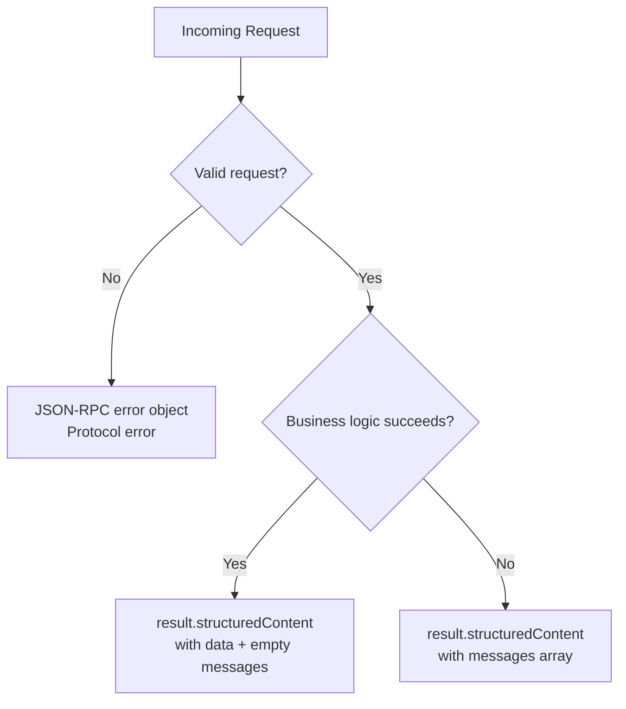
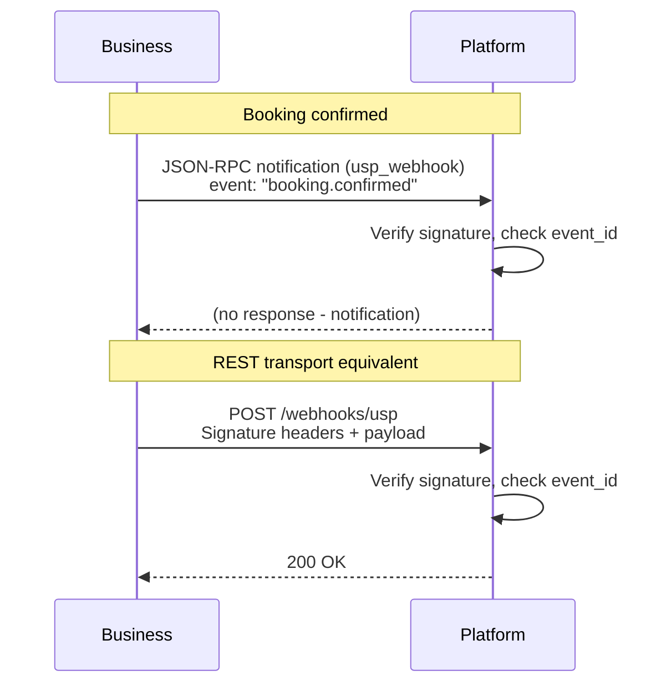

# MCP Binding

The MCP (Model Context Protocol) binding uses JSON-RPC 2.0 over stdio or HTTP-SSE, designed for AI agents that interact with USP via tool calls.

| Property | Value |
|----------|-------|
| **Schema format** | OpenRPC (JSON) |
| **Transport** | JSON-RPC 2.0 |
| **Schema reference** | `openrpc/usp-mcp.json` |
| **Data shapes** | Domain types defined under `schemas/`; `openrpc/usp-mcp.json` uses relative `$ref`s |

## Method Mapping

Each USP REST operation maps to a JSON-RPC method name used as the tool name in `params.name`:

| REST Operation | MCP Method Name | Description |
|----------------|-----------------|-------------|
| `POST /services/list` | `usp_services_list` | List services from catalog |
| `GET /services/{service_id}` | `usp_services_get` | Get a single service |
| `GET /services/feed` | `usp_services_feed` | Get service catalog feed |
| `POST /services/feed/subscriptions` | `usp_services_feed_subscribe` | Create a feed subscription |
| `POST /availability/query` | `usp_availability_query` | Query time slots |
| `POST /availability/holds` | `usp_availability_hold` | Hold a slot (requires `holds: true`) |
| `DELETE /availability/holds/{hold_id}` | `usp_availability_release` | Release a hold (requires `holds: true`) |
| `POST /bookings` | `usp_bookings_create` | Create a booking |
| `GET /bookings/{booking_id}` | `usp_bookings_get` | Get a booking |
| `PUT /bookings/{booking_id}` | `usp_bookings_update` | Update a booking |
| `POST /bookings/{booking_id}/confirm` | `usp_bookings_confirm` | Confirm a booking (manual mode) |
| `POST /bookings/{booking_id}/cancel` | `usp_bookings_cancel` | Cancel a booking |
| `POST /bookings/{booking_id}/reschedule` | `usp_bookings_reschedule` | Reschedule a booking |
| `POST /bookings/{booking_id}/confirm-payment` | `usp_bookings_confirm_payment` | Confirm payment for a booking |
| `POST /waitlist` | `usp_waitlist_join` | Join a waitlist |
| `POST /waitlist/list` | `usp_waitlist_list` | List waitlist entries |
| `GET /waitlist/{entry_id}` | `usp_waitlist_get` | Get waitlist entry |
| `DELETE /waitlist/{entry_id}` | `usp_waitlist_leave` | Leave waitlist |
| `POST /waitlist/{entry_id}/accept` | `usp_waitlist_accept` | Accept a waitlist offer |
| `POST /waitlist/{entry_id}/decline` | `usp_waitlist_decline` | Decline a waitlist offer |
| `POST /registry/businesses` | `usp_registry_register` | Register business (discovery registry) |
| `POST /registry/search_business` | `usp_registry_search_business` | Search businesses (discovery registry) |
| `POST /registry/search_services` | `usp_registry_search_services` | Search services (discovery registry) |
| `GET /registry/businesses/{id}` | `usp_registry_get` | Get registration by ID |
| `PUT /registry/businesses/{id}` | `usp_registry_update` | Update registration |
| `DELETE /registry/businesses/{id}` | `usp_registry_delete` | Delete registration |

## Request/Response Format

MCP clients invoke USP operations via the standard MCP `tools/call` method, with `params.name` set to the method name and `params.arguments` containing the operation parameters.

### Platform Identification

The `_meta.usp.profile` field inside `arguments` carries the platform's profile URI, equivalent to the `USP-Agent` header in the REST binding. For privileged methods it is the identity-binding input from Section 10.1.6: the business records principal-to-URI on first contact and **MUST** reject a later request where that principal presents a different URI. A shared platform profile URI presented by many principals is the normal case, not a required rejection.

For state-modifying operations, the platform **SHOULD** include `_meta.usp.idempotency_key` (UUID v4), equivalent to the REST `Idempotency-Key` header.

Participating MCP clients and servers carry the optional join id in `_meta.usp.correlation_id` on both stdio and HTTP-SSE transports. When MCP runs over HTTP, participants **MAY** also send `USP-Correlation-Id`; when both are present they **SHOULD** be the same value. See [Section 9.7](https://github.com/wix/universal-scheduling-protocol/blob/master/specification.md#97-observability-join-non-normative-recommendation). Omitting it is conformant USP.

### Request Examples

**Availability query:**

```json
{
  "jsonrpc": "2.0",
  "method": "tools/call",
  "params": {
    "name": "usp_availability_query",
    "arguments": {
      "service_id": "svc_haircut_001",
      "start_date": "2026-03-15",
      "end_date": "2026-03-16",
      "_meta": {
        "usp": {
          "profile": "https://agent.example/profiles/scheduling-agent.json"
        }
      }
    }
  },
  "id": 1
}
```

**Booking creation (with idempotency key):**

```json
{
  "jsonrpc": "2.0",
  "method": "tools/call",
  "params": {
    "name": "usp_bookings_create",
    "arguments": {
      "service_id": "svc_haircut_001",
      "slot_id": "slot_20260315_0900",
      "buyer": {
        "first_name": "Alice",
        "email": "alice@example.com"
      },
      "_meta": {
        "usp": {
          "profile": "https://agent.example/profiles/scheduling-agent.json",
          "idempotency_key": "550e8400-e29b-41d4-a716-446655440000"
        }
      }
    }
  },
  "id": 2
}
```

### Response Format

Responses use the **`structuredContent` / `content` dual-envelope** pattern:

- `structuredContent` carries typed USP response data (including the `usp` metadata and optional `messages[]` array)
- `content` provides a human-readable text summary for MCP clients that render text

```json
{
  "jsonrpc": "2.0",
  "result": {
    "structuredContent": {
      "usp": {
        "version": "2026-08-20",
        "capabilities": {
          "dev.usp-protocol.services.availability": [
            {
              "version": "2026-08-20"
            }
          ]
        }
      },
      "service_id": "svc_haircut_001",
      "slots": [
        {
          "id": "slot_20260315_0900",
          "service_id": "svc_haircut_001",
          "start": "2026-03-15T09:00:00-04:00",
          "end": "2026-03-15T10:00:00-04:00",
          "duration": "PT60M",
          "state": "available"
        }
      ],
      "messages": []
    },
    "content": [
      {
        "type": "text",
        "text": "Found 1 available slot for svc_haircut_001 on 2026-03-15: 09:00-10:00 ET."
      }
    ]
  },
  "id": 1
}
```

## Error Handling

### Business Outcome Errors

Business outcome errors are returned inside the JSON-RPC `result` object within the `structuredContent` envelope, with a `messages[]` array -- **not** as a JSON-RPC `error`. This mirrors the REST binding where business outcome errors return HTTP 200 with `messages[]`.

```json
{
  "jsonrpc": "2.0",
  "result": {
    "structuredContent": {
      "usp": {
        "version": "2026-08-20"
      },
      "messages": [
        {
          "type": "error",
          "code": "slot_unavailable",
          "content": "The requested slot is no longer available.",
          "severity": "recoverable"
        }
      ]
    },
    "content": [
      {
        "type": "text",
        "text": "Error: The requested slot is no longer available."
      }
    ]
  },
  "id": 2
}
```

### Protocol Errors

Protocol errors (e.g., malformed requests, authentication failures) use the JSON-RPC `error` object. Only protocol-level failures use this mechanism.

```json
{
  "jsonrpc": "2.0",
  "error": {
    "code": -32600,
    "message": "invalid_request",
    "data": {
      "content": "Missing required field: service_id"
    }
  },
  "id": 3
}
```

!!! warning "Error routing rule"

    Business outcome errors go in `result.structuredContent.messages[]`. Protocol errors go in the JSON-RPC `error` object. Never mix the two.



## Webhook Notifications

Booking, catalog, and waitlist lifecycle events are delivered as webhook notifications.

### Delivery Semantics

| Property | Value |
|----------|-------|
| **Delivery guarantee** | At-least-once |
| **Deduplication** | Platforms MUST handle duplicates idempotently (track `event_id`) |
| **Retry behavior** | Exponential backoff: 30s initial, max 3 retries, max 15 min total |
| **Acknowledgment** | HTTP 2xx within 10 seconds |
| **Event ordering** | Causal order per booking; no cross-booking ordering guarantee |

### MCP Transport

In the MCP binding, webhooks are delivered as JSON-RPC **notifications** (messages without an `id` field):

```json
{
  "jsonrpc": "2.0",
  "method": "usp_webhook",
  "params": {
    "event": "booking.confirmed",
    "event_id": "evt_789abc",
    "booking_id": "bkg_456def",
    "order_id": "ord_ucp_001",
    "timestamp": "2026-03-14T22:06:00Z",
    "data": { "...": "full booking object per schemas/webhook_event.json" }
  }
}
```

### REST Transport

Webhook notifications are delivered as HTTP POST requests to the registered `webhook_url`:

```http
POST /webhooks/usp HTTP/1.1
Host: platform.example.com
Content-Type: application/json
Content-Digest: sha-256=:X48E9qOokqqrvdts8nOJRJN3OWDUoyWxBf7kbu9DBPE=:
Signature-Input: sig1=("@method" "@authority" "@path" "content-digest" "content-type");keyid="biz-webhook-2026";created=1711036800
Signature: sig1=:MEUCIQDTxNq8h7LGHpvVZQp1iHkFp9...:

{
  "event": "booking.confirmed",
  "event_id": "evt_789abc",
  "booking_id": "bkg_456def",
  "order_id": "ord_ucp_001",
  "timestamp": "2026-03-14T22:06:00Z",
  "data": { "..." : "full booking object" }
}
```

### URL Registration

Webhook callback URLs are registered via:

- The platform profile's `webhook_url` field, or
- Per-subscription via `POST /services/feed/subscriptions`

All webhook payloads MUST be signed. Platforms MUST verify signatures before processing events.



## Conformance Requirements

### MUST

A conforming MCP binding implementation **MUST:**

1. Use the `tools/call` envelope with `params.name` set to the method name and `params.arguments` containing operation parameters.
2. Wrap results in the `structuredContent` / `content` dual-envelope pattern.
3. Return business outcome errors in `result.structuredContent.messages[]`, not as JSON-RPC `error`.
4. Use JSON-RPC `error` only for protocol errors ([Section 9.4](https://github.com/wix/universal-scheduling-protocol/blob/master/specification.md#94-error-code-mapping)).
5. Include `_meta.usp.profile` on every privileged method (`x-usp-access` of `privileged_platform` or `privileged_scoped`) and bind any presented credential to that profile per [Section 10.1.6](https://github.com/wix/universal-scheduling-protocol/blob/master/specification.md#1016-platform-authentication-for-privileged-operations).
6. Authenticate privileged methods with at least one mechanism declared in the business's `AuthorizationPolicy` (the same mechanism set as the REST binding); reject unauthenticated privileged calls when the business requires authentication.
7. When the implementation emits webhook notifications or advertises outbound webhook delivery, deliver them as JSON-RPC notifications (no `id` field). Implementations that do neither satisfy this item without delivering webhook notifications.
8. Reject a presented `booking_scoped_credential` whose issued form carried `cnf` unless it is accompanied by a valid `platform_key_pop` proof binding to that `cnf.jkt`. Such a credential presented without a proof **MUST** be treated as absent, not as a bearer token, whatever `mechanism` the caller declares ([Section 10.1.6](https://github.com/wix/universal-scheduling-protocol/blob/master/specification.md#1016-platform-authentication-for-privileged-operations)).

### SHOULD

A conforming MCP binding implementation **SHOULD:**

1. Include `_meta.usp.idempotency_key` on state-modifying operations.
2. Provide a human-readable text summary in `result.content[]`.
3. Prefer HTTP-layer credentials (Authorization / Signature / mTLS) when MCP runs over HTTP, and use `_meta.usp.authorization` for stdio sessions and for `booking_scoped_credential`.
4. Prefer a retained `booking_scoped_credential` on privileged_scoped get/cancel/reschedule/PII-bearing calls when the business accepts that mechanism.
5. Compute the `usp_p` digest of a `platform_key_pop` proof over JCS-canonicalized params as specified in [Section 9.2.2](https://github.com/wix/universal-scheduling-protocol/blob/master/specification.md#922-requestresponse-format), and avoid non-integer JSON numbers in canonicalized params so that JCS number serialization is never ambiguous.
