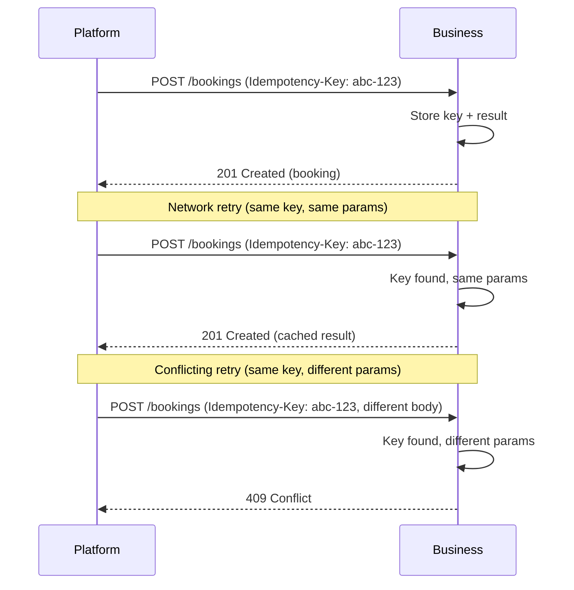
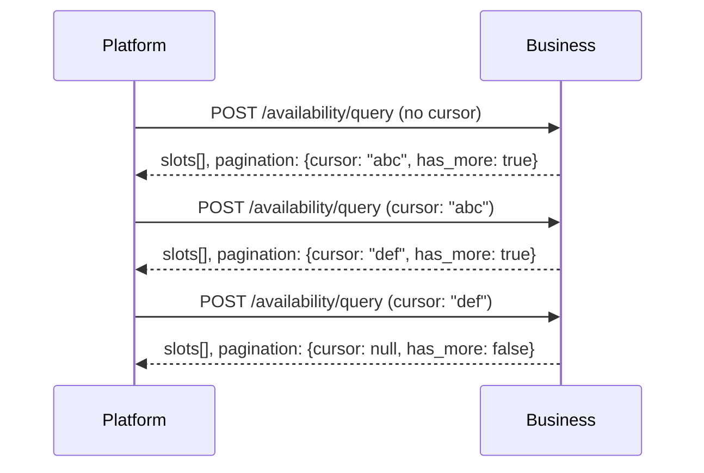
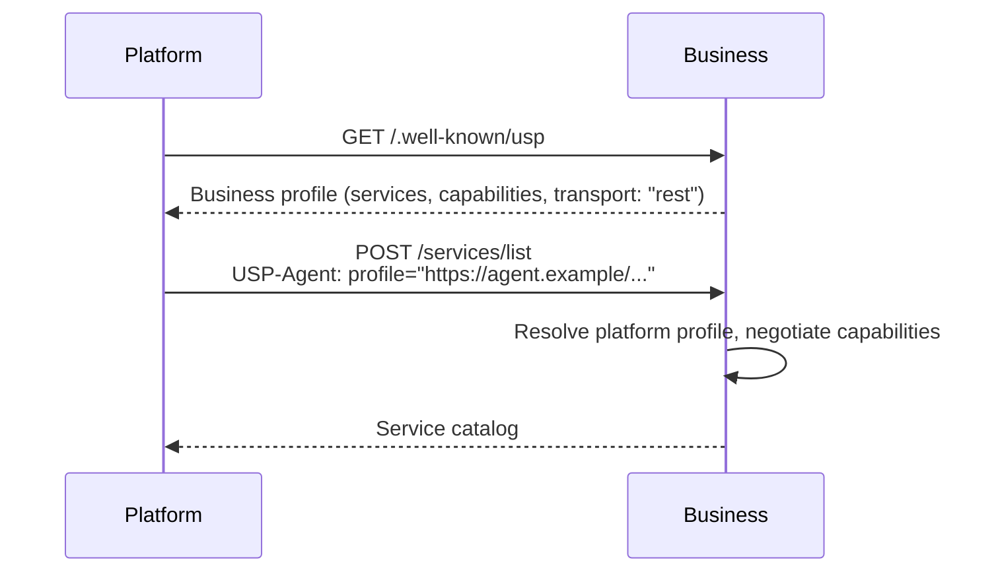

# REST Binding

The REST binding uses HTTP/1.1 (or higher) with JSON request/response bodies. All examples in the USP specification use the REST binding.

| Property | Value |
|----------|-------|
| **Schema format** | OpenAPI 3.x (JSON) |
| **Content type** | `application/json` |
| **Schema reference** | `openapi/usp-rest.json` |
| **Data shapes** | Normative JSON Schema definitions under `schemas/` (`$defs` per file) |

!!! info "Schema resolution"

    The canonical machine-readable binding at
    `https://usp-protocol.dev/schemas/openapi/usp-rest.json` references schema
    documents by absolute `$id` URIs, such as
    `https://usp-protocol.dev/schemas/services/catalog.json#/$defs/Service`.
    It is **not** self-contained unless bundled. Implementations and tools MUST
    resolve external `$ref`s from the authority origin or use a pre-bundled
    copy.

## Capability Negotiation

The platform advertises its profile URI via the `USP-Agent` header using Dictionary Structured Field syntax (RFC 8941):

```http
POST /services/list HTTP/1.1
Host: business.example.com
USP-Agent: profile="https://agent.example/profiles/scheduling-agent.json"
Content-Type: application/json

{"filters": {"type": "appointment"}}
```

## Error Responses

USP uses RFC 9457 Problem Details for HTTP API error responses and distinguishes between **protocol errors** and **business outcome errors**.

### Business Outcome Errors

Business outcome errors (e.g., slot unavailable, hold expired, capacity exceeded) return **HTTP 200** with a `messages[]` array on the response object. Each message has `type`, `code`, `content`, optional `content_type`, optional `severity`, and an optional `path` field.

!!! note

    The `messages[]` array is available on **all** USP response envelopes, including catalog responses (`/services/list`, `/services/{service_id}`, `/services/feed`), not only state-modifying operations. This enables partial-success signalling, filter feedback, service-level warnings, and deprecation notices.

### Protocol Errors

Protocol errors use standard HTTP status codes with RFC 9457 Problem Details:

| HTTP Status | USP Meaning |
|-------------|-------------|
| `200 OK` | Operation succeeded, or business outcome error (check `messages[]`) |
| `201 Created` | Resource created (bookings, holds, registry entries, waitlist entries, feed subscriptions) |
| `400 Bad Request` | Malformed JSON, missing required fields, invalid profile URL |
| `401 Unauthorized` | Authentication required or invalid credentials |
| `403 Forbidden` | Platform profile not in business allowlist |
| `422 Unprocessable Entity` | Syntactically valid but structurally invalid request |
| `424 Failed Dependency` | Business profile unreachable |
| `429 Too Many Requests` | Rate limited; retry after `Retry-After` header |
| `500 Internal Server Error` | Unexpected server failure |
| `503 Service Unavailable` | Business temporarily unable to handle requests |

## Idempotency

State-modifying operations (booking creation, cancellation, rescheduling, hold creation, confirm-payment) **SHOULD** support idempotency via the `Idempotency-Key` header, consistent with `draft-ietf-httpapi-idempotency-key-header`.

### Behavior

- The platform **SHOULD** send an `Idempotency-Key` header (UUID v4 recommended) with all state-modifying requests.
- The business **MUST** store the idempotency key with the operation result for at least 24 hours.
- If the business receives a request with a previously seen key **and the same parameters**, it **MUST** return the cached result without re-executing.
- If the business receives a request with a previously seen key **but different parameters**, it **MUST** return `409 Conflict`.

!!! warning "Why idempotency matters"

    Idempotency is critical for booking operations where network retries could create duplicate reservations. For read-only operations (`GET`, `POST /services/list`, `POST /availability/query`), idempotency keys are not required.

### Example

```http
POST /bookings HTTP/1.1
Host: business.example.com
USP-Agent: profile="https://agent.example/profiles/scheduling-agent.json"
Idempotency-Key: 550e8400-e29b-41d4-a716-446655440000
Content-Type: application/json

{"service_id": "svc_haircut_001", "slot_id": "slot_20260315_0900", ...}
```



## Pagination

Several USP operations return paginated result sets. All paginated operations use cursor-based pagination.

### Request Fields

| Field | Type | Required | Description |
|-------|------|----------|-------------|
| `cursor` | string | No | Opaque cursor from the previous response's `pagination.cursor`. Omit on first request. |
| `limit` | integer | No | Requested page size. Businesses MAY apply a lower or upper cap. |

### Response Fields

| Field | Type | Required | Description |
|-------|------|----------|-------------|
| `pagination.cursor` | string \| null | **Yes** | Opaque cursor for the next request. `null` when no more pages. |
| `pagination.has_more` | boolean | **Yes** | `true` if additional pages exist; `false` on the last page. |

### Semantics

- Cursors are **opaque strings** -- platforms MUST NOT parse or construct them.
- Businesses SHOULD honor a cursor for at least **60 seconds** after it is issued.
- Platforms that retry after cursor expiry MAY receive a `cursor_expired` error and SHOULD restart from the first page.
- Default page sizes: **50 items** for slot queries, **20 items** for service lists.

!!! note "Feed endpoint exception"

    The `GET /services/feed` endpoint uses a timestamp-based cursor named `next_cursor` (not `cursor`) because its pagination semantics are tied to the RPDE incremental-sync model. All other paginated USP operations use the `cursor`/`has_more` pattern.

### Example



## Discovery

This subsection specifies **profile discovery** for the REST binding: how platforms learn a business's REST endpoints via the business profile. It does **not** cover catalog discovery (Discovery Registry) or platform onboarding.

Platforms discover a business's REST endpoints through the business profile published at `/.well-known/usp`. The profile's `usp.services` array lists supported USP operations with their base URLs and transport type. Platforms MUST filter for entries where `transport` is `"rest"` to locate REST endpoints.

On each request, the platform identifies itself by sending the `USP-Agent` header:

```http
USP-Agent: profile="https://agent.example/profiles/scheduling-agent.json"
```

The business resolves the platform profile to perform capability negotiation. For UCP-Native deployments, profile discovery is inherited from `/.well-known/ucp`.



## Request Signing

State-modifying REST requests (POST, PUT, DELETE on bookings, holds, waitlist, registry) **SHOULD** be signed using HTTP Message Signatures (RFC 9421) to ensure integrity and authenticity.

### Signed Components

USP uses the same covered-component set as UCP's REST binding, so one signature
satisfies a USP verifier and a UCP verifier alike.

Always covered:

- `@method`
- `@authority`
- `@path`

Covered when present on the request:

- `@query`
- `usp-agent` (or `ucp-agent` in UCP-Native Mode)
- `idempotency-key`
- `content-digest`
- `content-type`

`@target-uri` MAY be covered in addition, but MUST NOT replace `@authority` and
`@path`: a verifier that enforces covered components treats a request whose
target components are unsigned as unsigned.

`created` is an OPTIONAL RFC 9421 signature *parameter* (`;created=...`), never
a covered component named `@created`. Request replay protection is the signed
`Idempotency-Key`, matching UCP; businesses MUST NOT reject a signed request
merely because it carries no `created`.


Verifiers MUST support `ES256` and signers SHOULD default to it. ECDSA
signature values use fixed-width raw `r||s` encoding, not DER.

### Platform Signing Keys

When a platform signs requests, it **MUST** publish signing material in the
platform profile via the top-level `keys` array (UCP-canonical). It **MAY**
also publish an identical `signing_keys` array during transition; dual-publish
is **RECOMMENDED**. Verifiers **MUST** resolve a `keyid` against `keys` first
and fall back to `signing_keys` otherwise. Businesses that enforce request
verification MUST advertise this requirement in their published `authorization`
policy.


### Example

```http
POST /bookings HTTP/1.1
Host: business.example.com
Content-Type: application/json
USP-Agent: profile="https://agent.example/profiles/scheduling-agent.json"
Idempotency-Key: 550e8400-e29b-41d4-a716-446655440000
Content-Digest: sha-256=:RK/0qy18MlBSVnWgjwz6lZEWjP/lF5HF9bvEF8FabDg=:
Signature-Input: sig1=("@method" "@authority" "@path" "usp-agent" "idempotency-key" "content-digest" "content-type");keyid="platform-2026"
Signature: sig1=:MEUCIQDXyK9N3p5Rt...:

{"service_id": "svc_haircut_001", "slot_id": "slot_20260315_0900", ...}
```

!!! info "MCP note"

    For the MCP binding, request integrity is ensured by the underlying MCP transport layer (stdio pipe or HTTP-SSE with TLS). The `_meta.usp.profile` field identifies the platform without transport-level signing.

## Conformance Requirements

### MUST

A conforming REST binding implementation **MUST:**

1. Serve all endpoints over HTTPS (TLS 1.2 or later).
2. Accept and return `application/json` on all endpoints.
3. Return RFC 9457 Problem Details for protocol errors.
4. Return business outcome errors as HTTP 200 with a `messages[]` array on the response object.
5. Support the `USP-Agent` header on all requests.
6. Return `201 Created` for resource creation operations (bookings, holds, registry entries, waitlist entries, feed subscriptions).
7. Implement webhook signing per the security specification.

### SHOULD

A conforming REST binding implementation **SHOULD:**

1. Support the `Idempotency-Key` header on state-modifying operations.
2. Sign state-modifying requests using HTTP Message Signatures (RFC 9421).
3. Support cursor-based pagination.
