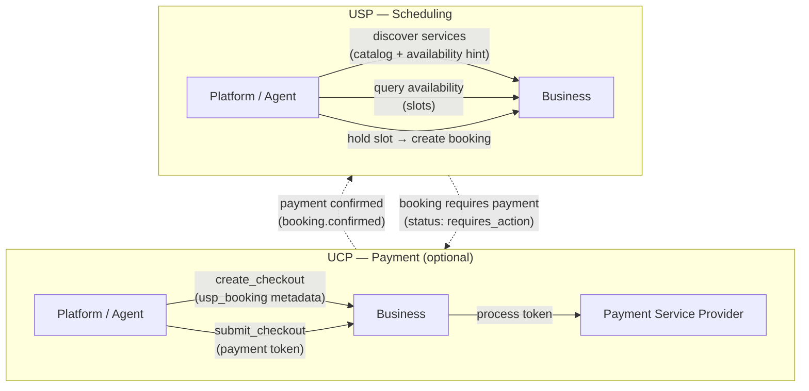
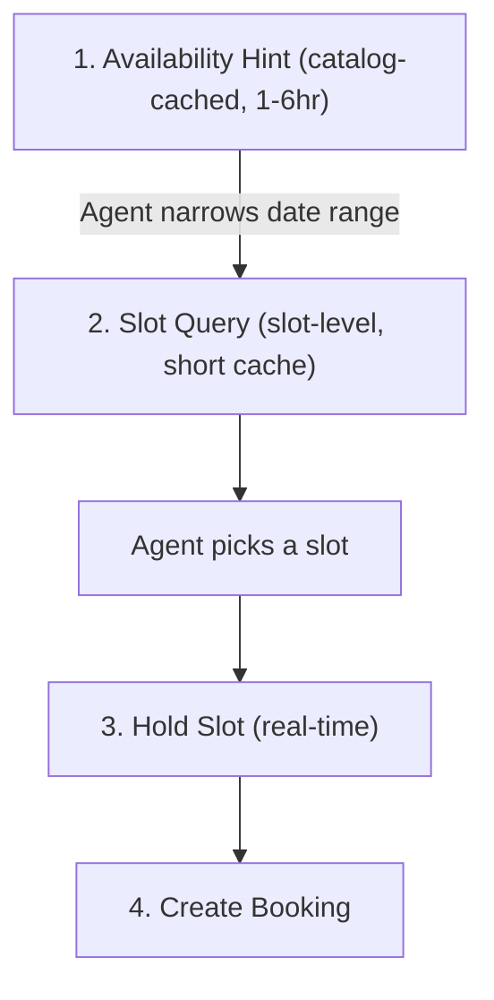
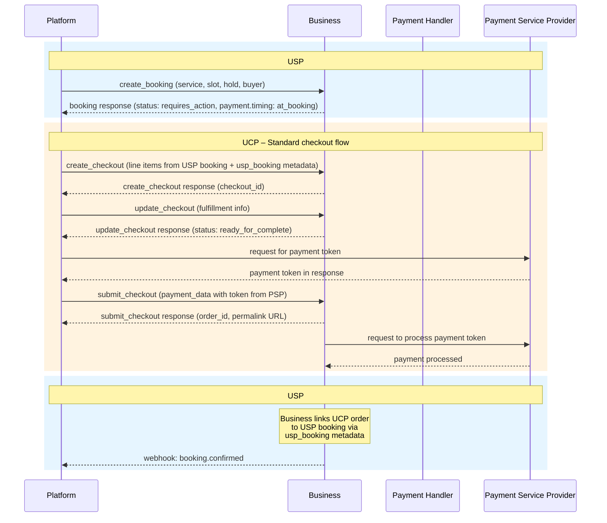
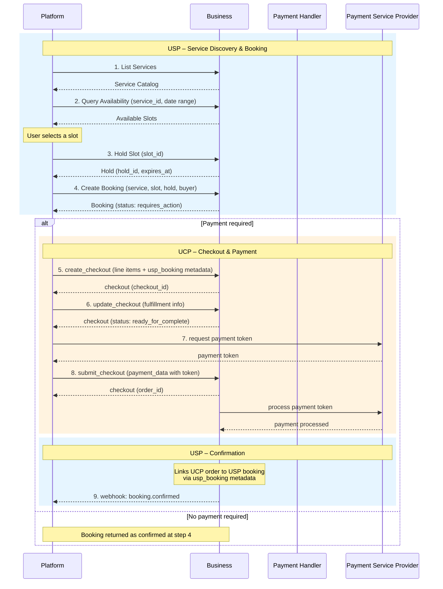
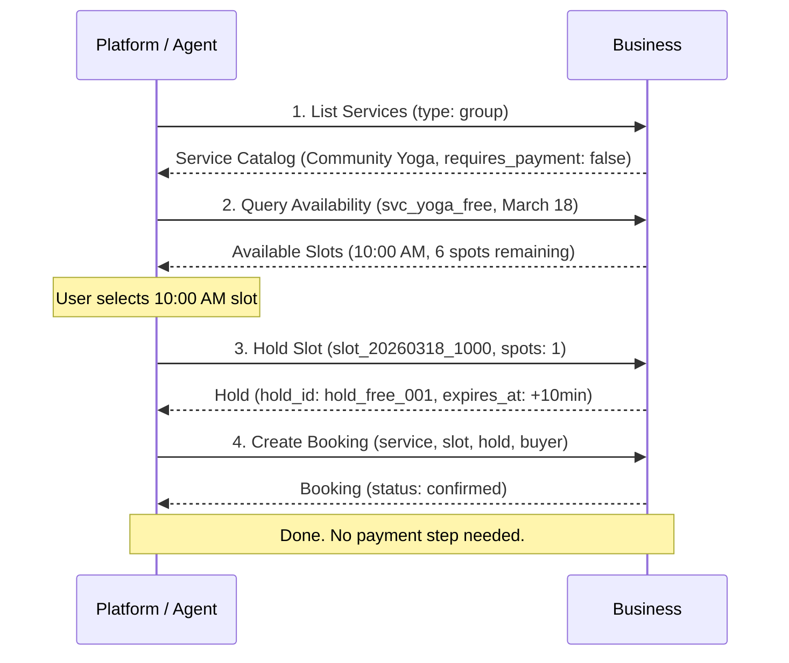

# Universal Scheduling Protocol (USP)

**Version:** `2026-02-09`

**Status:** Draft

---

## Abstract

The Universal Scheduling Protocol (USP) is an open standard that enables consumer platforms and AI agents to discover, check availability of, and book time-based services from businesses. USP is a companion protocol to the Universal Commerce Protocol (UCP) [UCP]. UCP handles product commerce -- checkout, payment, fulfillment, and order management for goods. USP addresses what UCP does not: the unique requirements of service commerce, where a specific time slot, resource, and participant count must be coordinated.

USP defines three core capabilities -- service catalog, availability, and booking -- along with optional extensions for waitlist management. It supports REST, MCP, and A2A transport bindings and delegates payment processing to UCP when required.

## Status of This Memo

This document specifies a Draft protocol for the Internet community and requests discussion and suggestions for improvements. Distribution of this memo is unlimited.

This is a draft specification. It is published for examination, experimental implementation, and evaluation. It is not yet an Internet Standard.

## Copyright Notice

Copyright (c) 2026 USP Authors. This specification is released under the [Apache License, Version 2.0](https://www.apache.org/licenses/LICENSE-2.0).

---

## Table of Contents

- [1. Introduction](#1-introduction)
  - [1.1 Conventions](#11-conventions)
  - [1.2 Terminology](#12-terminology)
  - [1.3 Service Verticals](#13-service-verticals)
  - [1.4 Relationship to Other Standards](#14-relationship-to-other-standards)
- [2. Core Concepts](#2-core-concepts)
  - [2.1 Roles and Participants](#21-roles-and-participants)
  - [2.2 Commerce and Non-Commerce Services](#22-commerce-and-non-commerce-services)
  - [2.3 High-Level Architecture](#23-high-level-architecture)
  - [2.4 Core Constructs](#24-core-constructs)
  - [2.5 Key Goals](#25-key-goals)
  - [2.6 USP vs UCP: Division of Responsibility](#26-usp-vs-ucp-division-of-responsibility)
- [3. Discovery and Negotiation](#3-discovery-and-negotiation)
  - [3.1 Business Profile](#31-business-profile)
  - [3.2 Namespace Governance](#32-namespace-governance)
  - [3.3 Capability Negotiation](#33-capability-negotiation)
- [4. Service Catalog](#4-service-catalog)
  - [4.1 Service Catalog Feed](#41-service-catalog-feed)
  - [4.2 Catalog Caching and Indexing](#42-catalog-caching-and-indexing)
  - [4.3 Service Schema](#43-service-schema)
  - [4.4 Availability Hint](#44-availability-hint)
  - [4.5 Duration](#45-duration)
  - [4.6 Pricing](#46-pricing)
  - [4.7 Service Policies](#47-service-policies)
  - [4.8 Resource Requirement](#48-resource-requirement)
  - [4.9 Validation Rules](#49-validation-rules)
  - [4.10 Operations](#410-operations)
- [5. Availability](#5-availability)
  - [5.1 Time Slot](#51-time-slot)
  - [5.2 Hold](#52-hold)
  - [5.3 Operations](#53-operations)
  - [5.4 Caching Strategy](#54-caching-strategy)
- [6. Booking](#6-booking)
  - [6.1 Booking Status Lifecycle](#61-booking-status-lifecycle)
  - [6.2 Booking Schema](#62-booking-schema)
  - [6.3 Operations](#63-operations)
  - [6.4 Webhooks](#64-webhooks)
- [7. Payment Integration with UCP](#7-payment-integration-with-ucp)
  - [7.1 Booking Payment](#71-booking-payment)
  - [7.2 How USP Connects to the UCP Checkout Flow](#72-how-usp-connects-to-the-ucp-checkout-flow)
  - [7.3 Line Item Mapping (USP to UCP)](#73-line-item-mapping-usp-to-ucp)
  - [7.4 Deposit and Refund Rules](#74-deposit-and-refund-rules)
- [8. End-to-End Flows](#8-end-to-end-flows)
  - [8.1 Full Flow (with Payment)](#81-full-flow-with-payment)
  - [8.2 Non-Commerce Flow (Free Service)](#82-non-commerce-flow-free-service)
  - [8.3 Example: Booking a Massage with Deposit](#83-example-booking-a-massage-with-deposit)
- [9. Waitlist Extension](#9-waitlist-extension)
  - [9.1 WaitlistEntry Schema](#91-waitlistentry-schema)
  - [9.2 Waitlist Lifecycle](#92-waitlist-lifecycle)
  - [9.3 Operations](#93-operations)
  - [9.4 Cancellation Fee Waiver](#94-cancellation-fee-waiver)
  - [9.5 Webhooks](#95-webhooks)
- [10. Transport Bindings](#10-transport-bindings)
  - [10.1 REST Binding](#101-rest-binding)
  - [10.2 MCP Binding](#102-mcp-binding)
  - [10.3 A2A Binding](#103-a2a-binding)
  - [10.4 Error Code Mapping](#104-error-code-mapping)
- [11. Security](#11-security)
- [12. Operation Reference](#12-operation-reference)
- [13. IANA Considerations](#13-iana-considerations)
- [14. References](#14-references)
  - [14.1 Normative References](#141-normative-references)
  - [14.2 Informative References](#142-informative-references)
- [Authors' Addresses](#authors-addresses)

---

## 1. Introduction

The Universal Scheduling Protocol (USP) is an open standard that enables consumer platforms and AI agents to **discover**, **check availability of**, and **book** time-based services from businesses.

USP is a **companion protocol** to the [Universal Commerce Protocol (UCP)](https://ucp.dev) [UCP]. UCP handles product commerce -- checkout, payment, fulfillment, and order management for goods. USP addresses what UCP does not: the unique requirements of service commerce, where a specific time slot, resource, and participant count must be coordinated.

The key words **MUST**, **MUST NOT**, **REQUIRED**, **SHALL**, **SHALL NOT**, **SHOULD**, **SHOULD NOT**, **RECOMMENDED**, **MAY**, and **OPTIONAL** in this document are to be interpreted as described in [RFC 2119] and [RFC 8174]. These keywords **MUST** only carry their special meaning when they appear in all capitals, as shown here.

### 1.1 Conventions

- Dates: [RFC 3339] (e.g., `2026-03-15T09:00:00-04:00`)
- Durations: [ISO 8601] (e.g., `PT60M`, `PT24H`, `P90D`)
- Currency amounts: Minor units / cents (e.g., `7500` = $75.00)
- Timezones: [IANA Time Zone Database](https://www.iana.org/time-zones) identifiers (e.g., `America/New_York`)

### 1.2 Terminology

The following terms are used throughout this document:

| Term | Definition |
|------|------------|
| **Booking** | A confirmed or pending reservation of a specific service at a specific time for a specific buyer. A booking has a lifecycle (create, confirm, reschedule, cancel, complete). |
| **Business** | The entity offering time-based services. The business owns the schedule, resources, and booking policies. For payment purposes, the business is the Merchant of Record. |
| **Buyer** | The end user receiving the service. Represented by a `buyer` object containing identity fields (name, email, phone). |
| **Capability** | A standalone feature a business supports, identified by a namespaced string (e.g., `dev.usp.services.catalog`). Each capability has a version, schema, and specification URL. |
| **Extension** | An optional module that augments a capability via the `extends` field. Extensions add functionality without modifying the base capability. |
| **Hold** | A temporary reservation of a time slot that prevents double-booking during the booking flow. Holds have a short TTL and are automatically released on expiry. |
| **Platform** | The consumer-facing application or AI agent acting on behalf of the buyer. Platforms orchestrate the scheduling journey from discovery through booking. |
| **Service** | A time-based offering provided by a business (e.g., a haircut, yoga class, restaurant table, car rental). Each service has a type, duration, pricing, and policies. |
| **Slot** | A specific, bookable time window for a service. Slots are computed dynamically from the business's schedule, resources, and existing bookings. Also referred to as "time slot." |
| **Vertical** | A classification of service type that determines the scheduling semantics (e.g., `appointment`, `group`, `reservation`, `rental`). See [Section 1.3](#13-service-verticals). |

### 1.3 Service Verticals

USP defines the following core service verticals. The `type` field on a service **MUST** be set to one of these values, or to a vendor-defined vertical using reverse-domain notation (e.g., `com.wix.services.courses`).

#### 1.3.1 Core Verticals

| Vertical | Description | Examples |
|----------|-------------|----------|
| `appointment` | A 1:1 session between a single client and a provider. The booking reserves one provider for one buyer at a specific time. | Salon, dental, consulting, personal training, therapy |
| `group` | A group session with limited capacity. Multiple buyers book into the same time slot, each occupying one or more spots up to a maximum capacity. | Yoga class, workshop, group fitness, cooking class |
| `reservation` | A hold on a shared resource for a time window. The buyer reserves a specific resource (e.g., a table, a room) for a party of a given size. | Restaurant table, conference room, venue, court booking |
| `rental` | Temporary exclusive use of equipment or space for a duration. The buyer takes possession of the resource for the rental period. | Car rental, studio space, equipment hire, vacation rental |

#### 1.3.2 Extended Verticals

The following verticals address additional scheduling domains. Implementations **MAY** support these as vendor-defined capabilities or as future USP core verticals:

| Vertical | Description | Examples | Key Differences from Core |
|----------|-------------|----------|---------------------------|
| `event` | A ticketed one-time event with complex capacity models (tiers, seating maps, general admission). | Concerts, conferences, theater, sporting events | Ticket tiers, seating maps, general admission vs. reserved seating |
| `course` | A multi-session educational or training program spanning multiple dates with enrollment, progression, and completion. | University courses, certification programs, multi-week workshops | Series management, enrollment caps, session progression |
| `healthcare` | A clinical appointment with domain-specific requirements such as insurance verification, referrals, and intake forms. | Doctor visits, telehealth, lab work, dental procedures | Insurance, referrals, HIPAA compliance, intake workflows |
| `home_service` | An on-location service performed at the buyer's premises. Scheduling must account for travel time and service area. | Plumbing, cleaning, pest control, home repair, moving | Travel time, service area boundaries, on-site assessment |
| `tour` | A time-bound guided experience combining group capacity with location, route, and potentially weather-dependent availability. | City tours, wine tastings, adventure activities, museum tours | Route/location, equipment, weather dependencies |

#### 1.3.3 Custom Verticals

Vendors **MAY** define custom verticals using their reverse-domain namespace:

```
com.{vendor}.services.{vertical_name}
```

Custom verticals **MUST** publish a specification and schema that define the additional fields and semantics beyond the USP base service schema. Platforms encountering an unrecognized vertical **SHOULD** fall back to treating the service as an `appointment` type for basic scheduling operations.

### 1.4 Relationship to Other Standards

USP builds upon and complements several existing standards. This section clarifies how USP relates to each and why a new protocol is necessary.

| Standard | Relationship to USP |
|----------|-------------------|
| **RFC 5545** (iCalendar) [RFC 5545] | iCalendar defines the core data format for calendar events (`VEVENT`), free/busy information (`VFREEBUSY`), and scheduling objects. USP's booking and availability concepts are semantically related to iCalendar components. Businesses **SHOULD** support exporting confirmed bookings as iCalendar `VEVENT` objects for calendar integration. USP does not replace iCalendar but provides a higher-level commerce-aware scheduling protocol on top of similar concepts. |
| **RFC 5546** (iTIP) [RFC 5546] | iTIP defines transport-independent scheduling methods (`REQUEST`, `REPLY`, `CANCEL`, `COUNTER`). USP's booking operations (create, confirm, reschedule, cancel) are semantically equivalent to iTIP methods. USP extends beyond iTIP by adding service discovery, real-time availability queries, slot holds, payment integration, and agentic transport bindings (MCP, A2A) that iTIP does not address. |
| **RFC 6638** (CalDAV Scheduling) [RFC 6638] | CalDAV Scheduling provides server-side implicit scheduling and free/busy queries. USP's availability query serves a similar purpose but is designed for cross-organization, platform-to-business interactions rather than intra-organization calendar sharing. |
| **RFC 7986** (New iCalendar Properties) [RFC 7986] | Adds `IMAGE`, `CONFERENCE` (virtual meeting URIs), and `REFRESH-INTERVAL` to iCalendar. USP's `channel.virtual_provider` and `images` fields overlap with these properties. Implementations **SHOULD** map these fields when exporting to iCalendar. |
| **schema.org/Service** | schema.org defines structured data types for services, offers, and actions (`ReserveAction`, `BookAction`). USP's service catalog complements schema.org: businesses **SHOULD** expose service catalog data as [schema.org/Service](https://schema.org/Service) structured data on their website for search engine discoverability (see [Section 4.2](#42-catalog-caching-and-indexing)), while the USP API provides the programmatic booking flow. |
| **OpenActive Open Booking API 1.0** [OpenActive] | The Open Booking API is a W3C Community Group specification for booking physical activities, using RPDE feeds and schema.org data models. USP differs from OpenActive in three key ways: (1) USP integrates with UCP for standardized payment processing, (2) USP is designed for agentic commerce with MCP/A2A bindings and availability hints for AI reasoning, and (3) USP covers a broader range of service verticals beyond physical activities. |
| **UCP** (Universal Commerce Protocol) [UCP] | USP is a companion protocol to UCP. USP handles the scheduling lifecycle; UCP handles checkout and payment. The two protocols share a common discovery model (`/.well-known/`), capability negotiation pattern, and role model (platform, business, credential provider, PSP). When payment is required, USP delegates to UCP's checkout flow. |

---

## 2. Core Concepts

USP enables interoperability between platforms, businesses, and payment providers for service commerce. This section introduces the key roles, architectural principles, and protocol constructs.

### 2.1 Roles and Participants

USP defines interactions between four participants, mirroring UCP's role model:

#### 2.1.1 Platform (Application / Agent)

The consumer-facing surface acting on behalf of the user. Platforms orchestrate the full journey: discovering services, presenting availability, and facilitating booking and payment.

- **Responsibilities:** Discovering business capabilities via `/.well-known/usp`, querying availability, creating bookings, orchestrating UCP checkout when payment is required.
- **Examples:** AI scheduling assistants, super apps, search engines, marketplace platforms.

#### 2.1.2 Business

The entity offering time-based services. In USP, the business owns the schedule, resources, and booking policies. For payment, the business remains the **Merchant of Record** (same as in UCP).

- **Responsibilities:** Publishing a USP profile, exposing a service catalog, computing real-time availability, managing the booking lifecycle, processing payments via UCP/PSP.
- **Examples:** Salons, clinics, fitness studios, restaurants, rental companies, consultancies.

#### 2.1.3 Credential Provider (CP)

A trusted entity that securely manages user payment instruments and identity. USP does not interact with credential providers directly -- this role is exercised through UCP during the checkout flow.

- **Examples:** Google Wallet, Apple Pay, digital identity providers.

#### 2.1.4 Payment Service Provider (PSP)

The financial infrastructure that processes payments. USP delegates all payment processing to UCP, which in turn interacts with the PSP. The platform acquires a payment token from the PSP and submits it via UCP's `submit_checkout`.

- **Examples:** Stripe, Adyen, PayPal, Braintree.

### 2.2 Commerce and Non-Commerce Services

USP supports both **paid services** that require payment integration with UCP and **free or pay-later services** that operate standalone without any payment infrastructure. This section defines the two operational modes and their implications.

#### 2.2.1 Operational Modes

| Mode | `requires_payment` | `payment_timing` | UCP Required? | Booking Confirmation Flow |
|------|-------------------|-------------------|---------------|---------------------------|
| **Standalone (non-commerce)** | `false` | N/A | No | `pending` → `confirmed` (auto mode) or `pending` → `confirmed` (manual mode, business approves) |
| **Standalone (pay-at-service)** | `true` | `at_service` | No | `pending` → `confirmed`. Payment is collected in person at the time of service; no upfront digital payment is required. |
| **Integrated (commerce)** | `true` | `at_booking` | Yes | `pending` → `requires_action` → (UCP checkout) → `confirmed` |
| **Integrated (deposit)** | `true` | `deposit_required` | Yes | `pending` → `requires_action` → (UCP checkout for deposit) → `confirmed` |

- **Standalone mode:** USP operates independently. No UCP infrastructure is needed. The business publishes only `/.well-known/usp`. This mode is appropriate for free community events, public library room reservations, government services, volunteer scheduling, and services where payment is collected in person.
- **Integrated mode:** USP and UCP work together. The business **MUST** publish both `/.well-known/usp` and `/.well-known/ucp`. This mode is required when upfront digital payment or a deposit must be collected before the booking is confirmed.

#### 2.2.2 Payment Field Conditionality

The `payment` object on a booking is conditionally present based on the service's payment configuration:

| `requires_payment` | `payment_timing` | `payment` Object on Booking | Notes |
|--------------------|-------------------|----------------------------|-------|
| `false` | N/A | **MUST** be omitted | Free service. No payment fields. |
| `true` | `at_service` | **MAY** be present | If present: `status: not_required`, `amount_due: 0`. The `amount` field reflects the service price for informational purposes. |
| `true` | `at_booking` | **MUST** be present | `status: pending`, `amount_due` = full amount. UCP checkout required. |
| `true` | `deposit_required` | **MUST** be present | `status: pending`, `amount_due` = deposit amount. UCP checkout required. |

See [Section 8.2](#82-non-commerce-flow-free-service) for a complete non-commerce end-to-end example.

### 2.3 High-Level Architecture



USP operates **standalone** for the full scheduling lifecycle: service discovery, availability hints, slot queries, holds, and bookings. No payment infrastructure is required for services with `requires_payment: false` or `payment_timing: at_service`.

When payment is required (`at_booking` or `deposit_required`), USP integrates with UCP. The two protocols share a common business endpoint and are linked via `usp_booking` metadata. USP signals that payment is needed; UCP handles the checkout and payment flow; the business links the completed payment back to the USP booking.

### 2.4 Core Constructs

USP is built on three constructs, consistent with UCP's architecture:

| Construct | Description | Examples |
|-----------|-------------|----------|
| **Capabilities** | Standalone features a business supports. Each capability has a namespace, schema, and version. | `dev.usp.services.catalog`, `dev.usp.services.availability`, `dev.usp.services.booking` |
| **Extensions** | Optional modules that augment a capability via the `extends` field. | Waitlist management (extends booking), vendor-specific loyalty (extends booking) |
| **Services** | Transport layers for exchanging data. USP is transport-agnostic with specific bindings. | REST (OpenAPI 3.x), MCP (OpenRPC / JSON-RPC), A2A (Agent Card). See [Section 10](#10-transport-bindings). |

### 2.5 Key Goals

- **Discovery:** Platforms dynamically discover what services a business offers, what availability exists, and what policies apply -- all machine-readable.
- **Agentic Scheduling:** AI agents can autonomously discover, evaluate, and book services on behalf of users, with `continue_url` handoff when human interaction is required.
- **Interoperability:** A standard language for platforms, businesses, and payment providers to transact time-based services without custom integrations.
- **Real-Time Coordination:** Slot holds prevent double-booking. Availability is computed dynamically from schedules, resources, and existing bookings.
- **Separation of Concerns:** USP handles scheduling; UCP handles payment. Neither protocol reinvents what the other provides.

### 2.6 USP vs UCP: Division of Responsibility

| Concern | USP | UCP |
|---------|-----|-----|
| Service discovery | Service catalog, categories, pricing, policies | Product catalog, inventory |
| Availability | Time slots, capacity, resource scheduling, holds | N/A |
| Booking lifecycle | Create, confirm, reschedule, cancel, no-show | N/A |
| Checkout & payment | Delegates to UCP | `create_checkout`, `update_checkout`, `submit_checkout` |
| Payment handlers | N/A (uses UCP's) | Handler definitions, token acquisition, PSP processing |
| Order management | N/A | Order lifecycle, fulfillment |
| Identity | Shared `buyer` object | Identity linking capability |

---

## 3. Discovery and Negotiation

USP follows UCP's discovery model. Businesses publish a machine-readable profile; platforms discover it and negotiate capabilities.

### 3.1 Business Profile

Businesses publish their USP profile at `/.well-known/usp`:

```json
{
  "usp": {
    "version": "2026-02-09",
    "services": {
      "dev.usp.services": {
        "version": "2026-02-09",
        "spec": "https://usp.dev/specification",
        "rest": {
          "schema": "https://usp.dev/services/rest.openapi.json",
          "endpoint": "https://business.example.com/usp/v1"
        },
        "mcp": {
          "schema": "https://usp.dev/services/mcp.openrpc.json",
          "endpoint": "https://business.example.com/usp/mcp"
        }
      }
    },
    "capabilities": [
      {
        "name": "dev.usp.services.catalog",
        "version": "2026-02-09",
        "spec": "https://usp.dev/specification#4-service-catalog",
        "schema": "https://usp.dev/schemas/services/catalog.json"
      },
      {
        "name": "dev.usp.services.availability",
        "version": "2026-02-09",
        "spec": "https://usp.dev/specification#5-availability",
        "schema": "https://usp.dev/schemas/services/availability.json"
      },
      {
        "name": "dev.usp.services.booking",
        "version": "2026-02-09",
        "spec": "https://usp.dev/specification#6-booking",
        "schema": "https://usp.dev/schemas/services/booking.json"
      }
    ],
    "business": {
      "name": "Sunrise Wellness Studio",
      "timezone": "America/New_York",
      "currency": "USD"
    }
  }
}
```

A business **MAY** publish both `/.well-known/ucp` and `/.well-known/usp`. The profiles are independent. A business offering only free or pay-at-service services **MAY** publish `/.well-known/usp` alone.

### 3.2 Namespace Governance

Capability names use reverse-domain notation, consistent with UCP:

```
{reverse-domain}.{service}.{capability}
```

The `dev.usp.*` namespace is governed by the USP body. Vendors **MUST** use their own domain (e.g., `com.wix.services.courses`).

### 3.3 Capability Negotiation

USP uses the same **server-selects** negotiation as UCP:

1. Platform advertises its profile URI via the `USP-Agent` header (REST) or `_meta.usp.profile` (MCP).
2. Business fetches the platform profile, computes the capability intersection, and responds using only shared capabilities.
3. Every response **MUST** include a `usp` metadata object declaring the active version and capabilities.

```json
{
  "usp": {
    "version": "2026-02-09",
    "capabilities": [
      {"name": "dev.usp.services.catalog", "version": "2026-02-09"},
      {"name": "dev.usp.services.availability", "version": "2026-02-09"},
      {"name": "dev.usp.services.booking", "version": "2026-02-09"}
    ]
  },
  ...
}
```

---

## 4. Service Catalog

**Capability:** `dev.usp.services.catalog`

The catalog enables platforms to **discover what services a business offers** -- types, pricing, policies, resources, and delivery channels.

### 4.1 Service Catalog Feed

Businesses **SHOULD** publish a service catalog feed for aggregators and indexing platforms. The feed enables incremental synchronization -- aggregators maintain a cursor and fetch only changed records since their last sync, rather than re-fetching the entire catalog.

**Feed Endpoint** -- `GET /services/feed`

The feed returns a paginated, chronologically ordered list of service records, sorted by `modified_at` ascending. This design follows the Realtime Paged Data Exchange (RPDE) pattern used by [OpenActive] and is analogous to product feeds in UCP and Google Merchant Center.

Request:

```json
GET /services/feed?cursor=2026-03-10T08:00:00Z&limit=50
```

Response:

```json
{
  "usp": {
    "version": "2026-02-09",
    "capabilities": [{"name": "dev.usp.services.catalog", "version": "2026-02-09"}]
  },
  "items": [
    {
      "state": "updated",
      "modified_at": "2026-03-10T09:15:00Z",
      "data": {
        "id": "svc_haircut_001",
        "name": "Women's Haircut & Style",
        "type": "appointment",
        "...": "full service object"
      }
    },
    {
      "state": "deleted",
      "modified_at": "2026-03-10T10:00:00Z",
      "data": {
        "id": "svc_old_service_002"
      }
    }
  ],
  "pagination": {
    "next_cursor": "2026-03-10T10:00:00Z",
    "has_more": true
  }
}
```

| Field | Type | Required | Description |
|-------|------|----------|-------------|
| `items[].state` | string | **Yes** | `updated` (new or modified service) or `deleted` (service removed; aggregators **MUST** prune this from their index). |
| `items[].modified_at` | string | **Yes** | RFC 3339 timestamp of when this record was last modified. Used as the cursor for incremental sync. |
| `items[].data` | object | **Yes** | Full service object for `updated` state; object containing only `id` for `deleted` state. |
| `pagination.next_cursor` | string | **Yes** | Opaque cursor to pass as the `cursor` query parameter on the next request. |
| `pagination.has_more` | boolean | **Yes** | Whether more records exist beyond this page. |

The `List Services` operation ([Section 4.10](#410-operations)) remains available for interactive use by platform UIs and AI agents. The feed endpoint is designed for bulk indexing by aggregators.

### 4.2 Catalog Caching and Indexing

Service catalog data is relatively static -- services, pricing, and policies change infrequently compared to real-time availability. Platforms and aggregators **SHOULD** cache catalog data rather than querying it on every user interaction.

**Recommended caching strategies:**

- **Merchant aggregators** (e.g., Google Merchant Center): Catalog data **SHOULD** be indexed by consuming the service catalog feed ([Section 4.1](#41-service-catalog-feed)) via incremental cursor-based synchronization. This enables pre-indexed service discovery and search across businesses without real-time API calls. Aggregators **SHOULD** synchronize at least once per hour for high-frequency businesses and once per day for low-frequency businesses.
- **Web crawlers and structured data**: Businesses **SHOULD** additionally expose service catalog data as [schema.org/Service](https://schema.org/Service) structured data on their website, enabling search engines and discovery platforms to index services through standard web scraping. This is complementary to the API -- the structured data provides discoverability, while the USP API provides the programmatic booking flow.
- **Platform-level caching**: Platforms **SHOULD** cache catalog responses according to HTTP `Cache-Control` headers. Platforms **SHOULD** refresh cached catalog data at intervals between 1 and 24 hours, depending on the business vertical and rate of change.

Availability and booking, by contrast, are real-time operations and **MUST NOT** be served from stale caches.

### 4.3 Service Schema

The service object represents a bookable offering from a business. Each service has a type (vertical), duration, pricing, policies, and optional resource requirements.

| Field | Type | Required | Description |
|-------|------|----------|-------------|
| `id` | string | **Yes** | Unique service identifier, scoped to the business. Opaque to the platform. |
| `name` | string | **Yes** | Human-readable display name for the service (e.g., "Women's Haircut & Style"). |
| `description` | string | No | Human-readable description providing details about what the service includes, what to expect, and any prerequisites. Aimed at both human readers and AI agents. |
| `type` | string | **Yes** | The service vertical. **MUST** be one of the core verticals (`appointment`, `group`, `reservation`, `rental`) or a vendor-defined vertical using reverse-domain notation. See [Section 1.3](#13-service-verticals). |
| `category` | object | No | `{id, name, parent_id}` -- business-defined classification for organizing services (e.g., "Beauty > Hair"). The `parent_id` enables hierarchical categorization. |
| `duration` | Duration | **Yes** | Duration configuration. See [Section 4.5](#45-duration). |
| `pricing` | Pricing | **Yes** | Pricing model and amounts. See [Section 4.6](#46-pricing). |
| `locations` | Array\[Location\] | No | Physical or virtual locations where the service is offered. Each location has `{id, name, address, coordinates}`. |
| `resources` | Array\[ResourceRequirement\] | No | Required staff, rooms, or equipment. See [Section 4.8](#48-resource-requirement). |
| `channel` | object | **Yes** | Delivery channel for the service. See channel types below. |
| `policies` | ServicePolicies | **Yes** | Booking, cancellation, rescheduling, and payment policies. See [Section 4.7](#47-service-policies). |
| `capacity` | object | No | `{min, max, waitlist}` -- **REQUIRED** for `group` and `reservation` types. `min`: minimum party size accepted. `max`: maximum participants per slot. `waitlist`: boolean indicating whether waitlist is enabled when slots are full. |
| `images` | Array\[object\] | No | `{url, alt, type}` -- service images. `type` is one of `hero`, `gallery`, or `thumbnail`. |
| `availability_hint` | AvailabilityHint | No | Approximate availability summary for agent-assisted discovery. See [Section 4.4](#44-availability-hint). |

**Channel types:**

| `channel.type` | Description | Additional Fields |
|-----------------|-------------|-------------------|
| `in_person` | Service is delivered at a physical location. The buyer must attend in person. | `instructions`: optional arrival instructions. |
| `virtual` | Service is delivered remotely via video/audio call. | `virtual_provider`: platform name (e.g., "Zoom", "Google Meet"). `instructions`: join instructions or a link provided after booking. |
| `phone` | Service is delivered via phone call. | `instructions`: optional call-in details. |
| `hybrid` | Service can be delivered either in person or virtually, at the buyer's choice. The buyer selects the channel during booking. | `virtual_provider`, `instructions`. The booking request **SHOULD** include the buyer's channel preference. |

### 4.4 Availability Hint

An optional, lightweight summary of a service's near-term availability. The hint is designed for AI agents and platforms that need to make smart decisions about **what date ranges to query** before hitting the real-time availability API. It is cached alongside catalog data and serves as "Tier 0" of the availability funnel (see [Section 5.4 -- Caching Strategy](#54-caching-strategy)).

The hint captures the same information a receptionist would give over the phone: a natural-language snapshot of when the business is open, busy, or booked out. Businesses **SHOULD** regenerate this field every 1-6 hours, or whenever availability changes significantly (e.g., a day transitions from available to fully booked).

> **Important:** The availability hint is an **approximation**. Platforms **MUST NOT** use it as a substitute for real-time availability queries. It is strictly a guide for narrowing the date range and reducing unnecessary API calls. The structured availability API (day-level and slot-level) remains the source of truth.

| Field | Type | Required | Description |
|-------|------|----------|-------------|
| `summary` | string | **Yes** | Natural-language description of near-term availability. Aimed at AI agents for reasoning about which dates to query. Example: *"Fully booked this week. Next week we have good availability on Tuesday afternoon and Wednesday morning."* |
| `generated_at` | string | **Yes** | RFC 3339 timestamp of when this hint was generated. Platforms can use this to assess freshness and decide how much weight to give the hint. A hint older than 6 hours **SHOULD** be treated with lower confidence. |
| `next_available_date` | string | No | `YYYY-MM-DD` date of the next day with known availability. This single structured field is usable by both AI agents and traditional programmatic platforms to skip fully booked date ranges. |

#### 4.4.1 Agent Use Cases

The availability hint is particularly valuable for AI agents that orchestrate scheduling on behalf of users. The following table summarizes the key use cases and how the hint helps in each:

| # | Use Case | Agent Scenario | How the Hint Helps |
|---|----------|---------------|-------------------|
| 1 | **First-available search** | "Book me a haircut as soon as possible." | `next_available_date` lets the agent jump directly to the first opening instead of scanning day-by-day from today. |
| 2 | **Multi-business comparison** | "Find me a massage therapist available this Thursday." | The agent reads hints from multiple businesses' cached catalogs and filters out those marked as booked -- without making any availability API calls. |
| 3 | **Flexible date negotiation** | "I'm flexible -- find me a good time next week." | The `summary` names specific days with openings, so the agent can propose smart options conversationally before querying slot-level. |
| 4 | **Proactive rescheduling** | A booking is canceled; the agent helps the user rebook. | The agent reads the hint from the cached catalog and immediately suggests alternate days, enabling a faster rescheduling flow. |
| 5 | **Availability-aware recommendations** | "I want to book a yoga class this weekend." | The agent ranks services not just by relevance but by likelihood of availability, avoiding the pattern of recommending a class only to discover it's full. |
| 6 | **Smart date range scoping** | Agent builds a calendar view for the user. | The hint identifies fully-booked periods, so the agent only queries day-level for the remaining open range -- reducing payload size and API load. |
| 7 | **Long-horizon search** | "Book me with Dr. Smith -- I don't care when." | The hint says "booked solid for 3 weeks, next opening around April 1," letting the agent set expectations and target a narrow query window across a large booking horizon. |
| 8 | **Multi-service bundling** | "Haircut and color treatment back-to-back." | Hints for each service reveal overlapping open days, so the agent intersects constraints from the hints before querying -- reducing API fan-out. |
| 9 | **Off-peak targeting** | "When is the cheapest time to book?" | The hint identifies low-demand windows (e.g., midweek mornings), which the agent can infer as likely off-peak pricing for services with `variable` pricing models. |
| 10 | **Background pre-qualification** | Agent compiles a daily briefing of scheduling options. | Hints from the user's preferred businesses are read entirely from the cached catalog -- zero availability API calls -- to produce a summary like "Your salon has openings Tuesday; your dentist is booked until April." |

```json
{
  "id": "svc_haircut_001",
  "name": "Women's Haircut & Style",
  "availability_hint": {
    "summary": "Fully booked this week. Next week we have good availability on Tuesday afternoon and Wednesday morning. Thursday is filling up fast.",
    "generated_at": "2026-03-11T08:00:00-04:00",
    "next_available_date": "2026-03-17"
  }
}
```

### 4.5 Duration

The duration object defines how long a service takes. Either a fixed duration or a range **MUST** be provided. Buffers define non-bookable prep/cleanup time that the business needs between consecutive bookings.

**Fixed duration:**

```json
{"fixed": "PT60M", "buffer_after": "PT15M"}
```

**Variable duration (buyer selects):**

```json
{"range": {"min": "PT30M", "max": "PT120M", "step": "PT30M"}}
```

| Field | Type | Required | Description |
|-------|------|----------|-------------|
| `fixed` | string | Conditional | ISO 8601 duration. **REQUIRED** if `range` is not present. The exact duration of the service. |
| `range` | object | Conditional | **REQUIRED** if `fixed` is not present. `{min, max, step}` -- all ISO 8601 durations. The buyer selects a duration within this range in increments of `step`. |
| `buffer_before` | string | No | ISO 8601 duration. Non-bookable prep time before the service (e.g., room setup). This time is blocked on the schedule but not visible to the buyer. |
| `buffer_after` | string | No | ISO 8601 duration. Non-bookable cleanup time after the service (e.g., sanitization between clients). |

### 4.6 Pricing

The pricing object defines how a service is priced. The combination of `model` and the service's `requires_payment` / `payment_timing` fields **MUST** conform to the validation rules in [Section 4.9](#49-validation-rules).

| Field | Type | Required | Description |
|-------|------|----------|-------------|
| `model` | string | **Yes** | The pricing model. See pricing model values below. |
| `amount` | integer | Conditional | Price in minor currency units (e.g., `7500` = $75.00). **REQUIRED** when `model` is `fixed`, `hourly`, or `per_person`. **MUST NOT** be present when `model` is `free`. **MAY** be absent when `model` is `variable` (price is determined at slot query time). |
| `currency` | string | **Yes** | ISO 4217 currency code (e.g., `USD`, `EUR`, `GBP`). **REQUIRED** even when `model` is `free` (to establish the business's operating currency). |
| `deposit` | object | No | `{type, value, refundable}` -- **REQUIRED** when `payment_timing` is `deposit_required`. `type`: `fixed` (absolute amount) or `percentage` (of the total price). `value`: the deposit amount or percentage. `refundable`: boolean indicating if the deposit is refundable upon cancellation within the free cancellation window. |

**Pricing model values:**

| Model | Description |
|-------|-------------|
| `fixed` | A single, fixed price for the service regardless of duration or party size. |
| `hourly` | Price is per hour (or per unit of duration). The total is computed as `amount * duration_in_hours`. |
| `per_person` | Price is per participant. The total is computed as `amount * party_size`. |
| `variable` | Price varies based on factors such as time of day, demand, day of week, or provider. The actual price is returned on each time slot in the availability response (`slot.pricing`). The catalog `amount` **MAY** be omitted or set to a base/starting price. |
| `free` | No charge for the service. `amount` **MUST NOT** be present. The service `requires_payment` **MUST** be `false`. |

### 4.7 Service Policies

Machine-readable policies that enable agents to make informed decisions about booking, cancellation, rescheduling, and payment. These policies govern the booking lifecycle and **MUST** be enforced by the business.

| Field | Type | Required | Description |
|-------|------|----------|-------------|
| `cancellation` | object | **Yes** | Cancellation policy. `allowed`: boolean, whether cancellation is permitted. `free_cancellation_until`: ISO 8601 duration before the service start time within which cancellation incurs no fee (e.g., `PT24H` = free cancellation up to 24 hours before). `late_cancellation_fee`: integer, fee in minor currency units charged for cancellations after the free window. `no_cancellation_after`: ISO 8601 duration, the point after which cancellation is no longer permitted (e.g., `PT1H` = cannot cancel within 1 hour of start). |
| `rescheduling` | object | **Yes** | Rescheduling policy. `allowed`: boolean. `free_reschedule_until`: ISO 8601 duration before start time for free rescheduling. `max_reschedules`: integer, maximum number of times a booking can be rescheduled (prevents abuse). `fee`: integer, fee in minor currency units for rescheduling outside the free window. |
| `no_show` | object | No | No-show policy. `fee`: integer, fixed fee in minor currency units. `fee_percentage`: integer (0-100), percentage of the service price charged as a no-show fee. Only one of `fee` or `fee_percentage` **SHOULD** be set. `grace_period`: ISO 8601 duration after the scheduled start time before the booking is marked as a no-show (e.g., `PT15M` = 15-minute grace period). |
| `booking_window` | object | **Yes** | Booking window constraints. `min_advance`: ISO 8601 duration, minimum time before the slot start that a booking can be made (e.g., `PT2H` = must book at least 2 hours in advance). `max_advance`: ISO 8601 duration, maximum time in advance a booking can be made (e.g., `P60D` = can book up to 60 days ahead). `slot_interval`: ISO 8601 duration, the interval at which slots are generated (e.g., `PT30M` = slots start every 30 minutes). |
| `confirmation_mode` | string | **Yes** | `auto`: booking is confirmed immediately upon creation (or upon payment completion if payment is required). `manual`: booking requires explicit business approval. The business **SHOULD** respond within 24 hours. If the business does not confirm within the `expires_at` time on the booking, the booking transitions to `canceled`. |
| `requires_payment` | boolean | **Yes** | Whether this service requires any payment. `false` for free services. `true` for all paid services (including pay-at-service). See [Section 2.2](#22-commerce-and-non-commerce-services). |
| `payment_timing` | string | Conditional | **REQUIRED** when `requires_payment` is `true`. **MUST NOT** be present when `requires_payment` is `false`. One of: `at_booking` (full payment collected digitally before confirmation, requires UCP), `at_service` (payment collected in person at time of service, no UCP required), `deposit_required` (partial payment collected digitally before confirmation, remainder at service time, requires UCP). |

### 4.8 Resource Requirement

The resource requirement defines what staff, rooms, or equipment are needed for a service, and whether the buyer can select a specific resource.

| Field | Type | Required | Description |
|-------|------|----------|-------------|
| `type` | string | **Yes** | The kind of resource. `staff`: a person providing the service (e.g., stylist, therapist, instructor). `room`: a physical space (e.g., treatment room, studio, court). `equipment`: a piece of equipment (e.g., camera, projector, vehicle). `other`: any resource that does not fit the above categories. |
| `name` | string | No | Human-readable label for this resource type (e.g., "Stylist", "Treatment Room"). Displayed to the buyer when `selectable` is `true`. |
| `selectable` | boolean | No | Whether the buyer can choose a specific resource during booking. Default: `false`. When `true`, the `options` array **MUST** be populated. When `false`, the business assigns the resource automatically. |
| `options` | Array\[Resource\] | No | `{id, name, description, image_url}` -- the available resource instances. **REQUIRED** when `selectable` is `true`. Each option represents a specific resource the buyer can choose (e.g., a specific stylist or a specific room). |

### 4.9 Validation Rules

The following constraints define legal combinations of `requires_payment`, `payment_timing`, and `pricing.model`. Implementations **MUST** validate service definitions against these rules. JSON Schema files published at the capability schema URL **SHOULD** enforce these constraints using `if/then/else` or `oneOf` composition.

#### 4.9.1 Payment and Pricing Constraint Matrix

| `requires_payment` | `payment_timing` | `pricing.model` | `pricing.amount` | Legal? | Notes |
|--------------------|-------------------|-----------------|-------------------|--------|-------|
| `false` | (absent) | `free` | (absent) | **Yes** | Free service. No payment, no price. |
| `false` | (absent) | `fixed` | (any) | **No** | If payment is not required, the pricing model **MUST** be `free`. |
| `false` | (absent) | `hourly` | (any) | **No** | Same as above. |
| `false` | (absent) | `per_person` | (any) | **No** | Same as above. |
| `false` | (absent) | `variable` | (any) | **No** | Same as above. |
| `true` | `at_booking` | `free` | (any) | **No** | Cannot require payment at booking for a free-priced service. |
| `true` | `at_booking` | `fixed` | (required) | **Yes** | Standard paid service with upfront payment. |
| `true` | `at_booking` | `hourly` | (required) | **Yes** | Hourly rate, total computed from duration. |
| `true` | `at_booking` | `per_person` | (required) | **Yes** | Per-person rate, total computed from party size. |
| `true` | `at_booking` | `variable` | (optional) | **Yes** | Variable pricing; actual price on each slot. |
| `true` | `at_service` | `free` | (any) | **No** | Cannot have pay-at-service with a free pricing model. |
| `true` | `at_service` | `fixed` | (required) | **Yes** | Price shown but collected in person. |
| `true` | `at_service` | `hourly` | (required) | **Yes** | Price shown but collected in person. |
| `true` | `at_service` | `per_person` | (required) | **Yes** | Price shown but collected in person. |
| `true` | `at_service` | `variable` | (optional) | **Yes** | Variable pricing, collected in person. |
| `true` | `deposit_required` | `free` | (any) | **No** | Cannot require a deposit on a free service. |
| `true` | `deposit_required` | `fixed` | (required) | **Yes** | Deposit collected upfront, remainder at service. `deposit` object **MUST** be present in `pricing`. |
| `true` | `deposit_required` | `hourly` | (required) | **Yes** | Same as above. |
| `true` | `deposit_required` | `per_person` | (required) | **Yes** | Same as above. |
| `true` | `deposit_required` | `variable` | (optional) | **Yes** | Variable pricing with deposit. |

#### 4.9.2 Summary Rules

1. When `requires_payment` is `false`, `pricing.model` **MUST** be `free` and `payment_timing` **MUST NOT** be present.
2. When `requires_payment` is `true`, `pricing.model` **MUST NOT** be `free`.
3. When `payment_timing` is `deposit_required`, the `pricing.deposit` object **MUST** be present.
4. When `pricing.model` is `free`, `pricing.amount` **MUST NOT** be present.
5. When `pricing.model` is `fixed`, `hourly`, or `per_person`, `pricing.amount` **MUST** be present and greater than zero.

### 4.10 Operations

#### 4.10.1 List Services -- `POST /services/list`

Returns a filtered, paginated list of services from the business catalog. Designed for interactive use by platforms and AI agents.

Request:

```json
{
  "filters": {"type": "appointment", "category_id": "beauty"},
  "pagination": {"limit": 20, "cursor": null}
}
```

Response:

```json
{
  "usp": {
    "version": "2026-02-09",
    "capabilities": [{"name": "dev.usp.services.catalog", "version": "2026-02-09"}]
  },
  "services": [
    {
      "id": "svc_haircut_001",
      "name": "Women's Haircut & Style",
      "type": "appointment",
      "duration": {"fixed": "PT60M", "buffer_after": "PT15M"},
      "pricing": {"model": "fixed", "amount": 7500, "currency": "USD"},
      "channel": {"type": "in_person"},
      "resources": [
        {
          "type": "staff",
          "name": "Stylist",
          "selectable": true,
          "options": [
            {"id": "staff_jane", "name": "Jane Smith"},
            {"id": "staff_alex", "name": "Alex Johnson"}
          ]
        }
      ],
      "policies": {
        "cancellation": {"allowed": true, "free_cancellation_until": "PT24H", "late_cancellation_fee": 2500},
        "rescheduling": {"allowed": true, "free_reschedule_until": "PT24H", "max_reschedules": 2},
        "no_show": {"fee_percentage": 100, "grace_period": "PT15M"},
        "booking_window": {"min_advance": "PT2H", "max_advance": "P60D", "slot_interval": "PT30M"},
        "confirmation_mode": "auto",
        "requires_payment": true,
        "payment_timing": "at_service"
      },
      "availability_hint": {
        "summary": "Fully booked this week. Next week we have good availability Tuesday afternoon and all day Wednesday. Thursday is filling up.",
        "generated_at": "2026-03-11T08:00:00-04:00",
        "next_available_date": "2026-03-17"
      }
    }
  ],
  "pagination": {"cursor": null, "has_more": false}
}
```

#### 4.10.2 Get Service -- `GET /services/{service_id}`

Returns the full service object for a single service.

Request:

```
GET /services/svc_haircut_001
```

Response:

```json
{
  "usp": {
    "version": "2026-02-09",
    "capabilities": [{"name": "dev.usp.services.catalog", "version": "2026-02-09"}]
  },
  "service": {
    "id": "svc_haircut_001",
    "name": "Women's Haircut & Style",
    "type": "appointment",
    "description": "A full haircut and styling session with one of our experienced stylists. Includes consultation, shampoo, cut, and blow-dry.",
    "duration": {"fixed": "PT60M", "buffer_after": "PT15M"},
    "pricing": {"model": "fixed", "amount": 7500, "currency": "USD"},
    "channel": {"type": "in_person"},
    "policies": {
      "cancellation": {"allowed": true, "free_cancellation_until": "PT24H", "late_cancellation_fee": 2500},
      "rescheduling": {"allowed": true, "free_reschedule_until": "PT24H", "max_reschedules": 2},
      "no_show": {"fee_percentage": 100, "grace_period": "PT15M"},
      "booking_window": {"min_advance": "PT2H", "max_advance": "P60D", "slot_interval": "PT30M"},
      "confirmation_mode": "auto",
      "requires_payment": true,
      "payment_timing": "at_service"
    }
  }
}
```

---

## 5. Availability

**Capability:** `dev.usp.services.availability`

The availability capability lets platforms **query when services are available** and **hold slots** to prevent double-booking during the booking flow.

### 5.1 Time Slot

A time slot represents a specific, bookable window for a service. Slots are computed dynamically by the business from schedules, resource calendars, and existing bookings.

| Field | Type | Required | Description |
|-------|------|----------|-------------|
| `id` | string | **Yes** | Unique slot identifier, opaque to the platform. The business generates this and it is used to reference the slot in hold and booking operations. |
| `service_id` | string | **Yes** | The service this slot belongs to. |
| `start` | string | **Yes** | RFC 3339 start time of the slot. |
| `end` | string | **Yes** | RFC 3339 end time of the slot. |
| `duration` | string | **Yes** | ISO 8601 duration of the slot (e.g., `PT60M`). |
| `state` | string | **Yes** | The availability state of the slot. See state values below. |
| `capacity` | object | No | `{total, remaining, held}` -- present for `group` and `reservation` types. `total`: maximum number of spots. `remaining`: spots still available. `held`: spots currently in active holds. |
| `resources` | Array\[object\] | No | `{id, type, name}` -- resources available for this slot (e.g., which staff members or rooms are free). |
| `location` | object | No | `{id, name}` -- the specific location for this slot, when a service is offered at multiple locations. |
| `pricing` | object | No | `{amount, currency, label}` -- slot-specific pricing that overrides the service-level pricing. Used for peak/off-peak pricing, demand-based pricing, or promotional rates. `label` is an optional human-readable note (e.g., "Peak hour rate"). |

**Slot state values:**

| State | Description |
|-------|-------------|
| `available` | The slot has capacity for new bookings. For `appointment` types, this means the slot is open. For `group`/`reservation` types, this means `capacity.remaining > 0` with sufficient spots for a typical booking. |
| `limited` | The slot has low remaining capacity. Businesses **SHOULD** return `limited` when remaining capacity drops below 20% of total capacity or when fewer than 3 spots remain (whichever threshold the business defines). This signals to agents and platforms that the slot may fill soon. |
| `waitlist` | The slot is fully booked but the service has waitlist enabled (`capacity.waitlist: true`). The platform **MAY** allow the buyer to join the waitlist via the waitlist extension ([Section 9](#9-waitlist-extension)). Businesses **MUST NOT** return `waitlist` state unless the `dev.usp.services.waitlist` capability is supported. |

### 5.2 Hold

A hold is a temporary reservation of a time slot that prevents double-booking during the booking flow. Holds have a short TTL and are automatically released when they expire, are explicitly released, or are converted to a booking.

| Field | Type | Required | Description |
|-------|------|----------|-------------|
| `id` | string | **Yes** | Unique hold identifier. |
| `slot_id` | string | **Yes** | The held slot. |
| `service_id` | string | **Yes** | The service. |
| `spots` | integer | No | Number of spots held. Default: 1. For `group` and `reservation` types, this is the number of capacity units reserved. |
| `expires_at` | string | **Yes** | RFC 3339 expiration time. After this time, the hold is automatically released. Businesses **SHOULD** set hold TTL between 5 and 10 minutes. |
| `status` | string | **Yes** | `active`: hold is in effect and the slot is reserved. `expired`: hold TTL has elapsed; the slot is released. `released`: hold was explicitly released by the platform. `converted`: hold was successfully converted to a booking. |

### 5.3 Operations

#### 5.3.1 Query Availability -- `POST /availability/query`

Returns available time slots for a service within a date range. Use the [Availability Hint](#44-availability-hint) on the service entity to narrow the date range before querying.

| Field | Type | Required | Description |
|-------|------|----------|-------------|
| `service_id` | string | **Yes** | The service to query. |
| `start_date` | string | **Yes** | Start of range (RFC 3339 date or datetime). |
| `end_date` | string | **Yes** | End of range (RFC 3339 date or datetime). |
| `timezone` | string | No | IANA timezone. Defaults to business timezone. |
| `resource_id` | string | No | Preferred resource (e.g., specific staff member). If provided, only slots where this resource is available are returned. |
| `party_size` | integer | No | Number of participants. Default: 1. For `group` and `reservation` types, only slots with sufficient remaining capacity are returned. |

Request:

```json
{
  "service_id": "svc_haircut_001",
  "start_date": "2026-03-15",
  "end_date": "2026-03-16",
  "timezone": "America/New_York",
  "resource_id": "staff_jane"
}
```

Response:

```json
{
  "usp": {
    "version": "2026-02-09",
    "capabilities": [{"name": "dev.usp.services.availability", "version": "2026-02-09"}]
  },
  "service_id": "svc_haircut_001",
  "slots": [
    {
      "id": "slot_20260315_0900",
      "service_id": "svc_haircut_001",
      "start": "2026-03-15T09:00:00-04:00",
      "end": "2026-03-15T10:00:00-04:00",
      "duration": "PT60M",
      "state": "available",
      "resources": [{"id": "staff_jane", "type": "staff", "name": "Jane Smith"}],
      "location": {"id": "loc_main", "name": "Downtown Studio"}
    },
    {
      "id": "slot_20260315_1030",
      "service_id": "svc_haircut_001",
      "start": "2026-03-15T10:30:00-04:00",
      "end": "2026-03-15T11:30:00-04:00",
      "duration": "PT60M",
      "state": "available",
      "resources": [{"id": "staff_jane", "type": "staff", "name": "Jane Smith"}],
      "location": {"id": "loc_main", "name": "Downtown Studio"}
    }
  ],
  "opening_hours": [
    {"day_of_week": ["monday", "tuesday", "wednesday", "thursday", "friday"], "opens": "09:00", "closes": "18:00"},
    {"day_of_week": ["saturday"], "opens": "10:00", "closes": "16:00"}
  ],
  "pagination": {"cursor": null, "has_more": false}
}
```

#### 5.3.2 Hold Slot -- `POST /availability/holds`

Creates a temporary hold on a time slot to prevent double-booking while the buyer completes the booking flow.

Request:

```json
{
  "slot_id": "slot_20260315_0900",
  "service_id": "svc_haircut_001",
  "spots": 1
}
```

Response:

```json
{
  "usp": {
    "version": "2026-02-09",
    "capabilities": [{"name": "dev.usp.services.availability", "version": "2026-02-09"}]
  },
  "hold": {
    "id": "hold_abc123",
    "slot_id": "slot_20260315_0900",
    "service_id": "svc_haircut_001",
    "spots": 1,
    "expires_at": "2026-03-15T08:10:00-04:00",
    "status": "active"
  }
}
```

If the slot is no longer available, the business **MUST** return an error:

```json
{
  "usp": {"version": "2026-02-09", "capabilities": []},
  "error": {
    "code": "slot_unavailable",
    "message": "The requested slot is no longer available."
  }
}
```

#### 5.3.3 Release Slot -- `DELETE /availability/holds/{hold_id}`

Explicitly releases a hold before it expires. This frees the slot for other buyers.

Request:

```
DELETE /availability/holds/hold_abc123
```

Response:

```json
{
  "usp": {
    "version": "2026-02-09",
    "capabilities": [{"name": "dev.usp.services.availability", "version": "2026-02-09"}]
  },
  "hold": {
    "id": "hold_abc123",
    "status": "released"
  }
}
```

### 5.4 Caching Strategy

Availability data has an inverse relationship between freshness and usefulness: near-term slots are the most actionable but change the fastest, while far-out availability is stable but less immediately useful. Platforms **SHOULD** use a tiered caching strategy:

| Tier | Source | Date Range | Recommended TTL | Use Case |
|------|--------|------------|-----------------|----------|
| **Hint** | `availability_hint` | General / near-term | 1-6 hours (cached with catalog) | Agent pre-filtering: "which date range should I even query?" See [Section 4.4](#44-availability-hint). |
| **Select** | `slot` query | 1-2 specific days | 30-60 seconds | Time picker: "what times are available on Tuesday?" |
| **Commit** | Hold | Single slot | Real-time (no cache) | Slot hold before booking. Always live. |

This creates a natural funnel that balances user experience with data freshness:



**Why this works:**

- **Availability hints are virtually free.** They are served as part of the service catalog (already cached at 1-24 hour TTL) and require zero additional API calls. For AI agents, the natural-language summary provides enough signal to skip entire date ranges or filter out fully-booked businesses before making any availability query. See the [Agent Use Cases](#441-agent-use-cases) table for the full set of scenarios where hints reduce API fan-out.
- **Slot-level data is expensive but scoped.** The platform only fetches full slots for 1-2 days the agent actually drills into, not the entire booking window. Agents using the availability hint typically query only 1-2 targeted days, keeping payloads small (~32 objects for a typical service). A 30-60 second TTL avoids hammering the API while keeping data reasonably fresh.
- **Holds are the safety net.** Even with slightly stale slot data, the hold operation is always real-time. If a displayed slot has been booked since the cache was populated, the hold fails with `slot_unavailable` and the platform re-queries. No false bookings.

---

## 6. Booking

**Capability:** `dev.usp.services.booking`

The booking capability defines the **lifecycle of a service booking** from creation through completion.

### 6.1 Booking Status Lifecycle

```
  pending ──────► confirmed ──────► in_progress ──────► completed
    │                │                    │
    │                │                    └──────────► no_show
    │                │
    ▼                ▼
  requires_action   canceled
    │
    ▼ (resolved)
  confirmed
```

| Status | Description |
|--------|-------------|
| `pending` | Booking has been created and is awaiting confirmation. For `auto` confirmation mode, this state is transient -- the booking moves to `confirmed` immediately (or to `requires_action` if payment is needed). For `manual` mode, the booking remains in `pending` until the business explicitly confirms it. |
| `requires_action` | Buyer input is needed before the booking can be confirmed. Inspect the `messages` array for details (e.g., `payment_required`). The `continue_url` field **MUST** be provided for browser-based handoff. This status is used when `payment_timing` is `at_booking` or `deposit_required`. |
| `confirmed` | The booking is confirmed and the service will proceed at the scheduled time. This is reached after auto-confirmation, manual business approval, or successful payment completion. |
| `in_progress` | The service is currently being delivered. Transitioned by the business when the appointment/session begins. |
| `completed` | The service has been delivered. Terminal state. |
| `no_show` | The client did not attend within the grace period defined in the no-show policy. Terminal state. Business **MAY** charge the no-show fee. |
| `canceled` | The booking has been canceled. Can be reached from `pending`, `requires_action`, or `confirmed`. Terminal state. Cancellation fees may apply per the service's cancellation policy. |

### 6.2 Booking Schema

The booking object represents a scheduled service instance for a specific buyer at a specific time.

| Field | Type | Required | Description |
|-------|------|----------|-------------|
| `id` | string | **Yes** | Unique booking identifier, generated by the business. |
| `service_id` | string | **Yes** | The booked service. |
| `service_name` | string | **Yes** | Service display name, captured at booking time. This is a snapshot -- it does not change if the service name is later updated. |
| `slot` | object | **Yes** | `{id, start, end, duration}` -- the booked time slot. |
| `buyer` | Buyer | **Yes** | `{first_name, last_name, email, phone_number}` -- the person receiving the service. |
| `party_size` | integer | **Yes** | Total number of attendees. For `appointment` types, this is typically `1`. For `group` and `reservation` types, this reflects the number of spots booked. |
| `resources` | Array\[object\] | No | `{id, type, name}` -- the specific resources assigned to this booking (e.g., which stylist, which room). |
| `location` | object | No | `{id, name}` -- the specific location for this booking. |
| `status` | string | **Yes** | Current booking status. See [Section 6.1](#61-booking-status-lifecycle). |
| `confirmation_mode` | string | **Yes** | `auto` or `manual`. Reflects the service's confirmation policy at booking time. |
| `payment` | BookingPayment | Conditional | Payment state. **MUST** be present when the service's `requires_payment` is `true` and `payment_timing` is `at_booking` or `deposit_required`. **MUST** be omitted when `requires_payment` is `false`. **MAY** be present with `status: not_required` when `payment_timing` is `at_service`. See [Section 7.1](#71-booking-payment). |
| `messages` | Array\[Message\] | No | Messages providing context about the booking state. Each message has: `type` (`error`, `warning`, `info`), `code` (machine-readable code, e.g., `payment_required`, `confirmation_pending`, `reschedule_limit_reached`), `message` (human-readable text), `severity` (`requires_buyer_input`: buyer must take action, `informational`: no action required, `actionable`: action is recommended but not required). |
| `continue_url` | string | Conditional | Business UI handoff URL. **MUST** be provided when `status` is `requires_action`. The platform **SHOULD** redirect or present this URL to the buyer to complete the required action (e.g., payment, form completion). |
| `notes` | string | No | Buyer-provided special requests or notes (e.g., "First time visit", "Allergic to latex"). |
| `cancellation` | object | No | `{reason, canceled_by, fee, refund_amount, canceled_at}` -- present when the booking has been canceled. `canceled_by`: `buyer` or `business`. `fee`: cancellation fee charged in minor currency units. `refund_amount`: amount refunded in minor currency units. |
| `created_at` | string | **Yes** | RFC 3339 timestamp of when the booking was created. |
| `updated_at` | string | **Yes** | RFC 3339 timestamp of the last status change or modification. |
| `expires_at` | string | No | RFC 3339 expiration time. Present for `pending` and `requires_action` bookings. If the booking is not confirmed or the required action is not completed by this time, the booking transitions to `canceled`. |

### 6.3 Operations

#### 6.3.1 Create Booking -- `POST /bookings`

Creates a new booking for a service at a specific time slot. The platform **SHOULD** hold the slot before creating the booking to prevent race conditions.

Request:

```json
{
  "service_id": "svc_haircut_001",
  "slot_id": "slot_20260315_0900",
  "hold_id": "hold_abc123",
  "buyer": {
    "first_name": "Alice",
    "last_name": "Williams",
    "email": "alice@example.com",
    "phone_number": "+12125551234"
  },
  "party_size": 1,
  "resource_id": "staff_jane",
  "notes": "First time visit"
}
```

Response (service with `requires_payment: true`, `payment_timing: at_service`):

```json
{
  "usp": {
    "version": "2026-02-09",
    "capabilities": [{"name": "dev.usp.services.booking", "version": "2026-02-09"}]
  },
  "booking": {
    "id": "bkg_789ghi",
    "service_id": "svc_haircut_001",
    "service_name": "Women's Haircut & Style",
    "slot": {"id": "slot_20260315_0900", "start": "2026-03-15T09:00:00-04:00", "end": "2026-03-15T10:00:00-04:00", "duration": "PT60M"},
    "buyer": {"first_name": "Alice", "last_name": "Williams", "email": "alice@example.com", "phone_number": "+12125551234"},
    "party_size": 1,
    "resources": [{"id": "staff_jane", "type": "staff", "name": "Jane Smith"}],
    "location": {"id": "loc_main", "name": "Downtown Studio"},
    "status": "confirmed",
    "confirmation_mode": "auto",
    "payment": {
      "status": "not_required",
      "timing": "at_service",
      "amount": 7500,
      "currency": "USD",
      "amount_due": 0
    },
    "created_at": "2026-03-14T22:05:00Z",
    "updated_at": "2026-03-14T22:05:00Z"
  }
}
```

#### 6.3.2 Get Booking -- `GET /bookings/{booking_id}`

Returns the current state of a booking.

Request:

```
GET /bookings/bkg_789ghi
```

Response:

```json
{
  "usp": {
    "version": "2026-02-09",
    "capabilities": [{"name": "dev.usp.services.booking", "version": "2026-02-09"}]
  },
  "booking": {
    "id": "bkg_789ghi",
    "service_id": "svc_haircut_001",
    "service_name": "Women's Haircut & Style",
    "slot": {"id": "slot_20260315_0900", "start": "2026-03-15T09:00:00-04:00", "end": "2026-03-15T10:00:00-04:00", "duration": "PT60M"},
    "buyer": {"first_name": "Alice", "last_name": "Williams", "email": "alice@example.com"},
    "party_size": 1,
    "status": "confirmed",
    "confirmation_mode": "auto",
    "created_at": "2026-03-14T22:05:00Z",
    "updated_at": "2026-03-14T22:05:00Z"
  }
}
```

#### 6.3.3 Update Booking -- `PUT /bookings/{booking_id}`

Updates mutable fields on a booking. Only `buyer` and `notes` are mutable after creation.

Request:

```json
{
  "buyer": {
    "phone_number": "+12125559876"
  },
  "notes": "First time visit. Running 5 minutes late."
}
```

Response: Returns the updated booking object (same structure as Get Booking).

#### 6.3.4 Confirm Booking -- `POST /bookings/{booking_id}/confirm`

Business-initiated confirmation for bookings with `confirmation_mode: manual`. Transitions the booking from `pending` to `confirmed`.

Request:

```json
{
  "message": "Confirmed! See you on Tuesday."
}
```

Response:

```json
{
  "usp": {
    "version": "2026-02-09",
    "capabilities": [{"name": "dev.usp.services.booking", "version": "2026-02-09"}]
  },
  "booking": {
    "id": "bkg_789ghi",
    "status": "confirmed",
    "messages": [{"type": "info", "code": "business_confirmed", "message": "Confirmed! See you on Tuesday.", "severity": "informational"}],
    "updated_at": "2026-03-14T23:00:00Z"
  }
}
```

#### 6.3.5 Cancel Booking -- `POST /bookings/{booking_id}/cancel`

Cancels a booking. Cancellation fees are applied per the service's cancellation policy.

Request:

```json
{
  "reason": "Schedule conflict",
  "canceled_by": "buyer"
}
```

Response:

```json
{
  "usp": {
    "version": "2026-02-09",
    "capabilities": [{"name": "dev.usp.services.booking", "version": "2026-02-09"}]
  },
  "booking": {
    "id": "bkg_789ghi",
    "status": "canceled",
    "cancellation": {
      "reason": "Schedule conflict",
      "canceled_by": "buyer",
      "fee": 0,
      "refund_amount": 0,
      "canceled_at": "2026-03-14T23:30:00Z"
    },
    "updated_at": "2026-03-14T23:30:00Z"
  }
}
```

#### 6.3.6 Reschedule Booking -- `POST /bookings/{booking_id}/reschedule`

Moves a booking to a different time slot. The platform **SHOULD** hold the new slot before rescheduling. Rescheduling limits and fees are governed by the service's rescheduling policy.

Request:

```json
{
  "new_slot_id": "slot_20260316_0900",
  "reason": "Scheduling conflict"
}
```

Response:

```json
{
  "usp": {
    "version": "2026-02-09",
    "capabilities": [{"name": "dev.usp.services.booking", "version": "2026-02-09"}]
  },
  "booking": {
    "id": "bkg_789ghi",
    "status": "confirmed",
    "slot": {"id": "slot_20260316_0900", "start": "2026-03-16T09:00:00-04:00", "end": "2026-03-16T10:00:00-04:00", "duration": "PT60M"},
    "updated_at": "2026-03-15T10:00:00Z"
  }
}
```

### 6.4 Webhooks

Businesses **SHOULD** notify platforms of state changes via webhooks. Webhook payloads **SHOULD** be signed (see [Section 11](#11-security)).

| Event | Trigger |
|-------|---------|
| `booking.confirmed` | Business confirms (manual mode) or payment completes (integrated mode) |
| `booking.canceled` | Business or system cancels the booking |
| `booking.rescheduled` | Business reschedules the booking |
| `booking.reminder` | Upcoming appointment reminder (e.g., 24 hours before) |
| `booking.completed` | Service has been delivered |
| `booking.no_show` | Client did not attend within the grace period |

---

## 7. Payment Integration with UCP

USP defines **when** payment is required but delegates **how** to UCP's payment architecture. This section defines the bridge between the two protocols.

This section applies only when `requires_payment` is `true` and `payment_timing` is `at_booking` or `deposit_required`. For free services and pay-at-service services, see [Section 2.2](#22-commerce-and-non-commerce-services).

### 7.1 Booking Payment

USP defines the payment state within the booking. Payment handlers and token acquisition are handled entirely by UCP -- the platform creates a UCP checkout session when `status` is `requires_action`.

| Field | Type | Required | Description |
|-------|------|----------|-------------|
| `status` | string | **Yes** | Payment status. `not_required`: no digital payment needed (pay-at-service or free). `pending`: payment has not yet been completed; UCP checkout is needed. `deposit_paid`: deposit has been collected; remainder due at service time. `paid`: full payment has been collected. `refunded`: full refund has been issued. `partially_refunded`: partial refund has been issued (e.g., cancellation fee withheld). |
| `timing` | string | **Yes** | Mirrors the service's `payment_timing` value. `at_booking`, `at_service`, `deposit_required`. |
| `amount` | integer | Conditional | Total service amount in minor currency units. **REQUIRED** when `timing` is `at_booking` or `deposit_required`. |
| `currency` | string | Conditional | ISO 4217 currency code. **REQUIRED** when `amount` is present. |
| `amount_due` | integer | Conditional | Amount due now in minor currency units. Full amount for `at_booking`, deposit amount for `deposit_required`, `0` for `at_service`. **REQUIRED** when `timing` is `at_booking` or `deposit_required`. |
| `deposit_amount` | integer | No | The deposit amount in minor currency units. Present when `timing` is `deposit_required`. |
| `payment_url` | string | No | Fallback URL for businesses without UCP integration. The buyer is redirected to this URL to complete payment on the business's own payment page. |

### 7.2 How USP Connects to the UCP Checkout Flow

USP handles service discovery, availability, and booking creation. When payment is needed, the platform orchestrates UCP checkout as a separate step -- it creates the checkout, completes the standard UCP payment flow, and the business links the completed order back to the USP booking. Each protocol handles what it's designed for: USP for scheduling, UCP for payment.

This requires the business to publish both `/.well-known/usp` and `/.well-known/ucp`.



**Steps:**

1. **[USP] Platform calls `create_booking`.** The platform sends a USP booking request with the service, slot, hold, and buyer information. The business returns the booking with `status: requires_action` and `payment.timing: at_booking` (or `deposit_required`), indicating that payment must be completed before the booking can be confirmed.

2. **[UCP] Platform calls `create_checkout`.** The platform creates a UCP checkout session on the business's UCP endpoint (`/.well-known/ucp`). The platform maps the USP booking to UCP line items (see [Line Item Mapping](#73-line-item-mapping-usp-to-ucp)) and includes `usp_booking` metadata so the business can link this checkout back to the USP booking. The business validates the line items, applies taxes/discounts, and returns the checkout session with a `checkout_id`.

3. **[UCP] Platform calls `update_checkout`.** The platform sends any additional fulfillment information (e.g., selection ID). The business returns the checkout object with `status: ready_for_complete`.

4. **[UCP] Platform requests a payment token from the Payment Service Provider.** Using the payment handler configuration from the UCP checkout response, the platform requests a payment token directly from the PSP. The PSP returns an opaque token.

5. **[UCP] Platform calls `submit_checkout`.** The platform sends the `submit_checkout` request to the business's UCP endpoint with `payment_data` containing the token from the PSP and any additional risk signals. The business returns the full checkout object with a populated `order_id` and permalink URL.

6. **[UCP] Business processes the payment token with the PSP (server-side).** The business sends the token to the Payment Service Provider for processing. The PSP charges the buyer and confirms the payment. This step is invisible to the platform.

7. **[USP] Business links the UCP order to the USP booking.** The business matches the `usp_booking.booking_id` metadata from the completed UCP checkout back to the original USP booking and transitions it from `requires_action` to `confirmed`.

8. **[USP] Platform receives `booking.confirmed` webhook.** The business sends a USP webhook notification to the platform's configured webhook URL. Alternatively, the platform can poll `GET /bookings/{booking_id}` to observe the status change.

> **Note:** For businesses without programmatic payment support (no UCP integration), the USP booking response **MAY** include a `payment_url` or `continue_url` instead. In this fallback scenario, the buyer is redirected to the business's own payment page and the platform is notified via USP webhook when payment completes. No UCP involvement.

### 7.3 Line Item Mapping (USP to UCP)

When the platform creates a UCP checkout for a USP booking, the service is mapped to UCP line items:

| UCP Field | USP Source |
|-----------|-----------|
| `item.id` | `booking.service_id` |
| `item.title` | `booking.service_name` |
| `item.price` | `booking.payment.amount / booking.party_size` |
| `quantity` | `booking.party_size` |

> **Note:** The `item.id` uses the `service_id` (not the `booking_id`) because it serves the same role as a product SKU in standard UCP commerce -- it identifies *what* is being purchased from the catalog. The booking-specific context (which time slot, which booking instance) is carried in the `usp_booking` metadata below. The business uses `usp_booking.booking_id` -- not `item.id` -- to link a completed checkout back to the USP booking.

The `create_checkout` request **MUST** include `usp_booking` metadata so the business can link completion back to the USP booking:

```json
{
  "line_items": [
    {"item": {"id": "svc_massage_001", "title": "Deep Tissue Massage", "price": 12000}, "quantity": 1}
  ],
  "currency": "USD",
  "usp_booking": {
    "booking_id": "bkg_456def",
    "slot": {"start": "2026-03-16T14:00:00-04:00", "end": "2026-03-16T15:00:00-04:00"},
    "service_type": "appointment"
  }
}
```

### 7.4 Deposit and Refund Rules

| Scenario | `amount_due` | Behavior |
|----------|-------------|----------|
| `at_booking` | Full amount | Payment must complete before booking confirms. |
| `deposit_required` | Deposit amount | Deposit collected now; remainder at service time. |
| `at_service` | 0 | No upfront payment; collected in person. |
| Cancellation (free window) | -- | Full refund of collected amount. |
| Cancellation (late) | -- | Refund = collected - cancellation fee. |
| Business-initiated cancel | -- | Full refund. No fees. |

---

## 8. End-to-End Flows

### 8.1 Full Flow (with Payment)

The complete booking journey across USP and UCP:



### 8.2 Non-Commerce Flow (Free Service)

The following example shows the complete flow for booking a free community yoga class. No payment infrastructure is involved -- USP operates standalone.



**[USP] Step 1** -- Discover services via `POST /services/list`. Find "Community Yoga" -- a free group class.

Request:

```json
{
  "filters": {"type": "group"}
}
```

Response (excerpt):

```json
{
  "services": [
    {
      "id": "svc_yoga_free",
      "name": "Community Yoga",
      "type": "group",
      "duration": {"fixed": "PT60M"},
      "pricing": {"model": "free", "currency": "USD"},
      "channel": {"type": "in_person"},
      "capacity": {"min": 1, "max": 20, "waitlist": true},
      "policies": {
        "cancellation": {"allowed": true, "free_cancellation_until": "PT2H"},
        "rescheduling": {"allowed": false},
        "booking_window": {"min_advance": "PT1H", "max_advance": "P14D", "slot_interval": "PT60M"},
        "confirmation_mode": "auto",
        "requires_payment": false
      },
      "availability_hint": {
        "summary": "Classes run Monday, Wednesday, Friday at 10 AM. Next Monday has 6 spots left.",
        "generated_at": "2026-03-14T08:00:00-04:00",
        "next_available_date": "2026-03-18"
      }
    }
  ]
}
```

**[USP] Step 2** -- Query availability for March 18.

Request:

```json
{
  "service_id": "svc_yoga_free",
  "start_date": "2026-03-18",
  "end_date": "2026-03-18",
  "party_size": 1
}
```

Response:

```json
{
  "service_id": "svc_yoga_free",
  "slots": [
    {
      "id": "slot_20260318_1000",
      "service_id": "svc_yoga_free",
      "start": "2026-03-18T10:00:00-04:00",
      "end": "2026-03-18T11:00:00-04:00",
      "duration": "PT60M",
      "state": "available",
      "capacity": {"total": 20, "remaining": 6, "held": 1}
    }
  ]
}
```

**[USP] Step 3** -- Hold the slot.

**[USP] Step 4** -- Create booking.

Request:

```json
{
  "service_id": "svc_yoga_free",
  "slot_id": "slot_20260318_1000",
  "hold_id": "hold_free_001",
  "buyer": {"first_name": "Bob", "last_name": "Chen", "email": "bob@example.com"},
  "party_size": 1
}
```

Response:

```json
{
  "usp": {"version": "2026-02-09", "capabilities": [{"name": "dev.usp.services.booking", "version": "2026-02-09"}]},
  "booking": {
    "id": "bkg_free_001",
    "service_id": "svc_yoga_free",
    "service_name": "Community Yoga",
    "slot": {"id": "slot_20260318_1000", "start": "2026-03-18T10:00:00-04:00", "end": "2026-03-18T11:00:00-04:00", "duration": "PT60M"},
    "buyer": {"first_name": "Bob", "last_name": "Chen", "email": "bob@example.com"},
    "party_size": 1,
    "status": "confirmed",
    "confirmation_mode": "auto",
    "created_at": "2026-03-15T12:00:00Z",
    "updated_at": "2026-03-15T12:00:00Z"
  }
}
```

Note: No `payment` object is present. The booking is immediately `confirmed` because `requires_payment` is `false` and `confirmation_mode` is `auto`.

### 8.3 Example: Booking a Massage with Deposit

**[USP] Step 1** -- Discover services via `POST /services/list`. Find "Deep Tissue Massage - 60 min" at $120, requires 50% deposit.

**[USP] Step 2** -- Query availability via `POST /availability/query` for March 16. Get slot at 2:00 PM.

**[USP] Step 3** -- Hold the slot via `POST /availability/holds`.

**[USP] Step 4** -- Create booking via `POST /bookings`:

Request:

```json
{
  "service_id": "svc_massage_001",
  "slot_id": "slot_20260316_1400",
  "hold_id": "hold_xyz789",
  "buyer": {"first_name": "Alice", "last_name": "Williams", "email": "alice@example.com"},
  "party_size": 1
}
```

Response (requires payment):

```json
{
  "usp": {"version": "2026-02-09", "capabilities": [{"name": "dev.usp.services.booking", "version": "2026-02-09"}]},
  "booking": {
    "id": "bkg_456def",
    "service_id": "svc_massage_001",
    "service_name": "Deep Tissue Massage - 60 min",
    "slot": {"id": "slot_20260316_1400", "start": "2026-03-16T14:00:00-04:00", "end": "2026-03-16T15:00:00-04:00", "duration": "PT60M"},
    "buyer": {"first_name": "Alice", "last_name": "Williams", "email": "alice@example.com"},
    "party_size": 1,
    "status": "requires_action",
    "confirmation_mode": "auto",
    "messages": [{"type": "error", "code": "payment_required", "message": "A 50% deposit ($60.00) is required.", "severity": "requires_buyer_input"}],
    "payment": {
      "status": "pending",
      "timing": "deposit_required",
      "amount": 12000,
      "currency": "USD",
      "amount_due": 6000,
      "deposit_amount": 6000
    },
    "continue_url": "https://business.example.com/bookings/bkg_456def/pay",
    "expires_at": "2026-03-15T22:05:00Z",
    "created_at": "2026-03-14T22:05:00Z",
    "updated_at": "2026-03-14T22:05:00Z"
  }
}
```

**[UCP] Step 5** -- Platform creates a UCP checkout on the business's UCP endpoint via `create_checkout`, mapping the USP booking to a line item:

Request:

```json
{
  "line_items": [
    {"item": {"id": "svc_massage_001", "title": "Deep Tissue Massage - 60 min", "price": 6000}, "quantity": 1}
  ],
  "currency": "USD",
  "buyer": {"email": "alice@example.com"},
  "usp_booking": {
    "booking_id": "bkg_456def",
    "slot": {"start": "2026-03-16T14:00:00-04:00", "end": "2026-03-16T15:00:00-04:00"},
    "service_type": "appointment"
  }
}
```

Note: the `item.price` is `6000` (the deposit amount), not the full `12000`, because `payment.amount_due` is `6000`.

**[UCP] Step 6** -- Platform calls `update_checkout` with any fulfillment details. Business returns checkout with `status: ready_for_complete`.

**[UCP] Step 7** -- Platform requests a payment token from the PSP using the handler config from the checkout response.

**[UCP] Step 8** -- Platform calls `submit_checkout` with the payment token. Business processes payment with PSP. Checkout completes with `order_id`.

**[USP] Step 9** -- Business links the UCP order to booking `bkg_456def` via `usp_booking` metadata. Booking transitions to `confirmed` with `payment.status: deposit_paid`. Platform receives webhook.

---

## 9. Waitlist Extension

**Capability:** `dev.usp.services.waitlist` (extends `dev.usp.services.booking`)

The waitlist extension enables buyers to join a waiting list for fully booked service slots. When a spot opens (due to cancellation or rescheduling), waitlisted buyers are offered the spot in order. This extension gives operational meaning to the `waitlist` slot state defined in [Section 5.1](#51-time-slot).

### 9.1 WaitlistEntry Schema

A waitlist entry represents a buyer's interest in booking a specific slot or a date range when all current slots are full.

| Field | Type | Required | Description |
|-------|------|----------|-------------|
| `id` | string | **Yes** | Unique waitlist entry identifier, generated by the business. |
| `service_id` | string | **Yes** | The service the buyer wants to book. |
| `slot_id` | string | No | The specific slot the buyer is waiting for. If null, the buyer is waiting for any available slot within `date_range`. |
| `date_range` | object | No | `{start_date, end_date}` -- preferred date range (RFC 3339 dates). Used when `slot_id` is null to indicate the buyer is flexible on timing. |
| `buyer` | Buyer | **Yes** | `{first_name, last_name, email, phone_number}` -- the waitlisted buyer. |
| `party_size` | integer | **Yes** | Number of spots the buyer needs. |
| `position` | integer | **Yes** | Current position in the waitlist (1-indexed). Position may change as entries ahead are converted, declined, or expired. |
| `status` | string | **Yes** | See [Section 9.2](#92-waitlist-lifecycle). |
| `offer_expires_at` | string | No | RFC 3339 timestamp. When a spot is offered, this is the deadline to accept. After expiry, the offer moves to the next person in line. Businesses **SHOULD** set offer TTL between 15 and 60 minutes. |
| `preferences` | object | No | `{preferred_resources, preferred_times, flexible_dates}` -- optional buyer preferences to help the business make better offers. |
| `created_at` | string | **Yes** | RFC 3339 timestamp of when the entry was created. |

### 9.2 Waitlist Lifecycle

```
waiting ──► offered ──► converted (becomes a booking)
   │            │
   │            ├──► declined (spot offered to next person)
   │            │
   │            └──► expired (offer timed out, spot offered to next)
   │
   └──► left (buyer voluntarily leaves)
```

| Status | Description |
|--------|-------------|
| `waiting` | The buyer is on the waitlist. No spot has been offered yet. |
| `offered` | A spot has opened and has been offered to this buyer. The buyer has until `offer_expires_at` to accept. |
| `expired` | The offer timed out without the buyer accepting. The spot is offered to the next person in line. Terminal. |
| `converted` | The buyer accepted the offer and a booking has been created. Terminal. |
| `declined` | The buyer explicitly declined the offered spot. The spot is offered to the next person in line. Terminal. |
| `left` | The buyer voluntarily left the waitlist. Terminal. |

### 9.3 Operations

#### 9.3.1 Join Waitlist -- `POST /waitlist`

Adds a buyer to the waitlist for a specific slot or date range.

Request:

```json
{
  "service_id": "svc_yoga_001",
  "slot_id": "slot_20260318_1000",
  "buyer": {"first_name": "Carol", "last_name": "Davis", "email": "carol@example.com"},
  "party_size": 1
}
```

Response:

```json
{
  "usp": {
    "version": "2026-02-09",
    "capabilities": [{"name": "dev.usp.services.waitlist", "version": "2026-02-09"}]
  },
  "waitlist_entry": {
    "id": "wl_001",
    "service_id": "svc_yoga_001",
    "slot_id": "slot_20260318_1000",
    "buyer": {"first_name": "Carol", "last_name": "Davis", "email": "carol@example.com"},
    "party_size": 1,
    "position": 3,
    "status": "waiting",
    "created_at": "2026-03-15T14:00:00Z"
  }
}
```

#### 9.3.2 Get Waitlist Entry -- `GET /waitlist/{entry_id}`

Returns the current status and position of a waitlist entry.

Request:

```
GET /waitlist/wl_001
```

Response:

```json
{
  "usp": {
    "version": "2026-02-09",
    "capabilities": [{"name": "dev.usp.services.waitlist", "version": "2026-02-09"}]
  },
  "waitlist_entry": {
    "id": "wl_001",
    "position": 1,
    "status": "offered",
    "offer_expires_at": "2026-03-16T10:30:00-04:00"
  }
}
```

#### 9.3.3 Leave Waitlist -- `DELETE /waitlist/{entry_id}`

Removes the buyer from the waitlist.

Request:

```
DELETE /waitlist/wl_001
```

Response:

```json
{
  "usp": {
    "version": "2026-02-09",
    "capabilities": [{"name": "dev.usp.services.waitlist", "version": "2026-02-09"}]
  },
  "waitlist_entry": {
    "id": "wl_001",
    "status": "left"
  }
}
```

#### 9.3.4 Accept Offer -- `POST /waitlist/{entry_id}/accept`

Converts a waitlist offer into a booking. The business creates the booking and transitions the waitlist entry to `converted`.

Request:

```json
{
  "notes": "Excited to join!"
}
```

Response:

```json
{
  "usp": {
    "version": "2026-02-09",
    "capabilities": [{"name": "dev.usp.services.waitlist", "version": "2026-02-09"}]
  },
  "waitlist_entry": {
    "id": "wl_001",
    "status": "converted"
  },
  "booking": {
    "id": "bkg_from_waitlist_001",
    "service_id": "svc_yoga_001",
    "status": "confirmed"
  }
}
```

#### 9.3.5 Decline Offer -- `POST /waitlist/{entry_id}/decline`

Declines the offered spot. The business offers the spot to the next person in line.

Request:

```json
{
  "reason": "No longer available at that time"
}
```

Response:

```json
{
  "usp": {
    "version": "2026-02-09",
    "capabilities": [{"name": "dev.usp.services.waitlist", "version": "2026-02-09"}]
  },
  "waitlist_entry": {
    "id": "wl_001",
    "status": "declined"
  }
}
```

### 9.4 Cancellation Fee Waiver

When a booked user wants to cancel but would incur a cancellation fee, the waitlist creates an opportunity to avoid that fee by filling the vacated slot from the waitlist.

The cancellation policy **MAY** include waitlist-aware fields:

```json
{
  "cancellation": {
    "allowed": true,
    "free_cancellation_until": "PT24H",
    "late_cancellation_fee": 2500,
    "waive_fee_if_waitlist_fills": true,
    "waitlist_fill_window": "PT2H"
  }
}
```

| Field | Type | Required | Description |
|-------|------|----------|-------------|
| `waive_fee_if_waitlist_fills` | boolean | No | If `true`, the cancellation fee is waived when a waitlisted buyer books the canceled slot within the fill window. Default: `false`. |
| `waitlist_fill_window` | string | No | ISO 8601 duration. The window after cancellation during which the waitlist is checked. If a waitlisted buyer accepts within this window, the canceling buyer's fee is waived. |

**Flow:**

1. User A has a booking with a `late_cancellation_fee` of $25.
2. User A requests cancellation. The business checks the waitlist for that slot.
3. Users B, C, D are on the waitlist. User B receives an offer with a TTL.
4. User B accepts within `waitlist_fill_window` -- a new booking is created for User B.
5. Because the slot was re-filled, User A's cancellation fee is **waived**.
6. If no waitlist user accepts within the window, User A's cancellation proceeds with the standard fee.

### 9.5 Webhooks

| Event | Trigger |
|-------|---------|
| `waitlist.spot_offered` | A spot opened and was offered to the next waitlisted buyer |
| `waitlist.converted` | A waitlist entry was converted to a booking |
| `waitlist.expired` | An offer expired without acceptance |
| `waitlist.position_changed` | A buyer's position in the waitlist changed (e.g., someone ahead left) |

---

## 10. Transport Bindings

USP is transport-agnostic. The protocol defines operations and schemas independent of the wire format. This section specifies how USP operations map to each supported transport.

### 10.1 REST Binding

The REST binding uses HTTP/1.1 (or higher) with JSON request/response bodies. All examples in this specification use the REST binding.

- **Schema format:** OpenAPI 3.x (JSON)
- **Content type:** `application/json`
- **Capability negotiation:** Platform advertises its profile URI via the `USP-Agent` header using Dictionary Structured Field syntax ([RFC 8941]):

```
POST /services/list HTTP/1.1
Host: business.example.com
USP-Agent: profile="https://agent.example/profiles/scheduling-agent.json"
Content-Type: application/json

{"filters": {"type": "appointment"}}
```

- **Error responses:** HTTP status codes are used per standard REST conventions:

| HTTP Status | USP Meaning |
|-------------|-------------|
| `200 OK` | Operation succeeded |
| `400 Bad Request` | Invalid request (malformed JSON, missing required fields) |
| `404 Not Found` | Resource not found (service, booking, hold) |
| `409 Conflict` | Conflict (e.g., slot already booked, hold expired) |
| `422 Unprocessable Entity` | Validation error (e.g., illegal field combination, booking window violated) |
| `429 Too Many Requests` | Rate limited; retry after `Retry-After` header |

### 10.2 MCP Binding

The MCP (Model Context Protocol) binding uses JSON-RPC 2.0 over stdio or HTTP-SSE, designed for AI agents that interact with USP via tool calls.

- **Schema format:** OpenRPC (JSON)
- **Transport:** JSON-RPC 2.0

#### 10.2.1 Method Mapping

Each USP REST operation maps to a JSON-RPC method:

| REST Operation | MCP Method Name | Description |
|----------------|----------------|-------------|
| `POST /services/list` | `usp_services_list` | List services from catalog |
| `GET /services/{service_id}` | `usp_services_get` | Get a single service |
| `GET /services/feed` | `usp_services_feed` | Get service catalog feed |
| `POST /availability/query` | `usp_availability_query` | Query time slots |
| `POST /availability/holds` | `usp_availability_hold` | Hold a slot |
| `DELETE /availability/holds/{hold_id}` | `usp_availability_release` | Release a hold |
| `POST /bookings` | `usp_bookings_create` | Create a booking |
| `GET /bookings/{booking_id}` | `usp_bookings_get` | Get a booking |
| `PUT /bookings/{booking_id}` | `usp_bookings_update` | Update a booking |
| `POST /bookings/{booking_id}/confirm` | `usp_bookings_confirm` | Confirm a booking (manual mode) |
| `POST /bookings/{booking_id}/cancel` | `usp_bookings_cancel` | Cancel a booking |
| `POST /bookings/{booking_id}/reschedule` | `usp_bookings_reschedule` | Reschedule a booking |
| `POST /waitlist` | `usp_waitlist_join` | Join a waitlist |
| `GET /waitlist/{entry_id}` | `usp_waitlist_get` | Get waitlist entry |
| `DELETE /waitlist/{entry_id}` | `usp_waitlist_leave` | Leave waitlist |
| `POST /waitlist/{entry_id}/accept` | `usp_waitlist_accept` | Accept a waitlist offer |
| `POST /waitlist/{entry_id}/decline` | `usp_waitlist_decline` | Decline a waitlist offer |

#### 10.2.2 Request Format

```json
{
  "jsonrpc": "2.0",
  "method": "usp_availability_query",
  "params": {
    "_meta": {
      "usp": {
        "profile": "https://agent.example/profiles/scheduling-agent.json"
      }
    },
    "service_id": "svc_haircut_001",
    "start_date": "2026-03-15",
    "end_date": "2026-03-16"
  },
  "id": 1
}
```

The `_meta.usp.profile` field carries the platform's profile URI, equivalent to the `USP-Agent` header in the REST binding.

#### 10.2.3 Response Format

```json
{
  "jsonrpc": "2.0",
  "result": {
    "usp": {
      "version": "2026-02-09",
      "capabilities": [{"name": "dev.usp.services.availability", "version": "2026-02-09"}]
    },
    "service_id": "svc_haircut_001",
    "slots": [
      {
        "id": "slot_20260315_0900",
        "start": "2026-03-15T09:00:00-04:00",
        "end": "2026-03-15T10:00:00-04:00",
        "duration": "PT60M",
        "state": "available"
      }
    ]
  },
  "id": 1
}
```

#### 10.2.4 Webhooks in MCP

In the MCP binding, webhooks are delivered as JSON-RPC **notifications** (requests without an `id`):

```json
{
  "jsonrpc": "2.0",
  "method": "usp_webhook",
  "params": {
    "event": "booking.confirmed",
    "booking_id": "bkg_789ghi",
    "timestamp": "2026-03-15T09:00:00Z"
  }
}
```

### 10.3 A2A Binding

The A2A (Agent-to-Agent) binding enables USP interactions between autonomous agents using the [A2A protocol](https://a2a-protocol.org/latest/).

- **Schema format:** Agent Card Specification
- **Transport:** A2A protocol (HTTP-based agent messaging)

#### 10.3.1 Agent Card

A USP-capable business publishes an Agent Card that declares scheduling skills:

```json
{
  "name": "Sunrise Wellness Scheduling Agent",
  "description": "Handles appointment booking for Sunrise Wellness Studio",
  "url": "https://business.example.com/.well-known/agent-card.json",
  "skills": [
    {
      "id": "usp_scheduling",
      "name": "Service Scheduling",
      "description": "Discover services, check availability, and book appointments",
      "input_modes": ["application/json"],
      "output_modes": ["application/json"]
    }
  ],
  "usp": {
    "profile_url": "https://business.example.com/.well-known/usp",
    "capabilities": ["dev.usp.services.catalog", "dev.usp.services.availability", "dev.usp.services.booking"]
  }
}
```

#### 10.3.2 Task Mapping

In the A2A binding, each USP operation is expressed as an A2A **task**:

| USP Operation | A2A Task Type | Description |
|---------------|--------------|-------------|
| List Services | `usp/services/list` | Platform agent sends filter criteria; business agent returns matching services. |
| Query Availability | `usp/availability/query` | Platform agent sends service ID and date range; business agent returns slots. |
| Hold Slot | `usp/availability/hold` | Platform agent requests hold; business agent returns hold with TTL. |
| Create Booking | `usp/bookings/create` | Platform agent sends booking request; business agent creates and returns booking. |
| Cancel Booking | `usp/bookings/cancel` | Platform agent sends cancellation; business agent processes and returns result. |
| Reschedule Booking | `usp/bookings/reschedule` | Platform agent sends reschedule request with new slot ID. |

#### 10.3.3 Multi-Step Flow

The A2A binding supports the full multi-step booking flow through A2A task chaining. Each step is a separate A2A task, but the business agent maintains session context using the `usp_booking` metadata:

1. **Discovery:** Platform agent sends a `usp/services/list` task. Business agent returns service catalog.
2. **Availability:** Platform agent sends a `usp/availability/query` task. Business agent returns slots.
3. **Hold:** Platform agent sends a `usp/availability/hold` task. Business agent returns hold.
4. **Booking:** Platform agent sends a `usp/bookings/create` task with `hold_id`. Business agent creates booking.
5. **Payment (if needed):** When the booking returns `status: requires_action`, the platform agent uses UCP (via its own UCP integration) to complete payment, then the business agent transitions the booking to `confirmed`.

In A2A context, `continue_url` is used as a fallback when the business agent cannot complete an action programmatically. The platform agent **SHOULD** escalate to the user (e.g., present the URL in a chat interface) when `continue_url` is returned.

### 10.4 Error Code Mapping

USP defines the following error codes, which are transport-independent. Each transport maps these to its native error representation:

| USP Error Code | Description | REST Status | JSON-RPC Code |
|----------------|-------------|-------------|---------------|
| `slot_unavailable` | The requested slot is no longer available | `409 Conflict` | `-32001` |
| `hold_expired` | The hold has expired | `409 Conflict` | `-32002` |
| `booking_not_found` | The booking ID does not exist | `404 Not Found` | `-32003` |
| `validation_error` | Request fields are invalid or violate constraints | `422 Unprocessable Entity` | `-32004` |
| `booking_window_violated` | Booking is outside the allowed advance window | `422 Unprocessable Entity` | `-32005` |
| `capacity_exceeded` | Not enough capacity for the requested party size | `409 Conflict` | `-32006` |
| `reschedule_limit_reached` | Maximum number of reschedules exceeded | `422 Unprocessable Entity` | `-32007` |
| `cancellation_not_allowed` | Cancellation is not permitted at this time | `422 Unprocessable Entity` | `-32008` |
| `payment_required` | Payment must be completed before confirmation | `402 Payment Required` | `-32009` |
| `rate_limited` | Too many requests | `429 Too Many Requests` | `-32010` |
| `version_unsupported` | The requested USP version is not supported | `400 Bad Request` | `-32011` |

---

## 11. Security

### 11.1 Transport Security

All USP endpoints **MUST** use HTTPS with TLS 1.2 or later. Plaintext HTTP connections **MUST** be rejected.

### 11.2 Rate Limiting

Businesses **SHOULD** implement rate limiting on all endpoints and **MUST** return `429 Too Many Requests` with a `Retry-After` header when limits are exceeded. Recommended limits:

- Catalog and feed endpoints: 100 requests/minute per platform
- Availability queries: 60 requests/minute per platform
- Hold operations: 30 requests/minute per platform per buyer
- Booking operations: 20 requests/minute per platform per buyer

### 11.3 Webhook Security

Webhook payloads **SHOULD** be signed using JSON Web Signature (JWS) with keys published in the business profile's `signing_keys` array. Platforms **MUST** verify webhook signatures before processing events.

### 11.4 Hold Abuse Prevention

Businesses **MUST** implement safeguards against hold abuse:

- **Concurrent hold limits:** Maximum concurrent holds per buyer per service (recommended: 1-3).
- **Short TTLs:** Hold TTL **SHOULD** be between 5 and 10 minutes.
- **Backoff for repeated hold-and-release:** Businesses **SHOULD** implement exponential backoff or temporary blocking for buyers who repeatedly acquire and release holds without completing bookings.
- **IP and buyer tracking:** Businesses **MAY** track hold patterns by buyer identity and IP address to detect automated abuse.

### 11.5 Data Privacy

- Buyer personal data (`buyer` object) **MUST** be transmitted only over encrypted connections.
- Businesses **SHOULD** minimize the buyer data returned in responses to what is necessary for the operation.
- Businesses **MUST** comply with applicable data protection regulations (GDPR, CCPA, etc.) regarding buyer data retention and deletion.

### 11.6 Authentication and Authorization

USP does not prescribe a specific authentication mechanism. Businesses and platforms **SHOULD** use one of the following:

- **API keys:** For platform-to-business authentication. Keys **SHOULD** be rotated periodically.
- **OAuth 2.0:** For delegated access, especially when platforms act on behalf of specific buyers. Compatible with UCP's identity linking capability.
- **Mutual TLS (mTLS):** For high-security environments requiring certificate-based authentication.

---

## 12. Operation Reference

| Operation | Method | Path | Capability |
|-----------|--------|------|------------|
| List Services | `POST` | `/services/list` | catalog |
| Get Service | `GET` | `/services/{service_id}` | catalog |
| Service Feed | `GET` | `/services/feed` | catalog |
| Query Availability | `POST` | `/availability/query` | availability |
| Hold Slot | `POST` | `/availability/holds` | availability |
| Release Slot | `DELETE` | `/availability/holds/{hold_id}` | availability |
| Create Booking | `POST` | `/bookings` | booking |
| Get Booking | `GET` | `/bookings/{booking_id}` | booking |
| Update Booking | `PUT` | `/bookings/{booking_id}` | booking |
| Confirm Booking | `POST` | `/bookings/{booking_id}/confirm` | booking |
| Cancel Booking | `POST` | `/bookings/{booking_id}/cancel` | booking |
| Reschedule Booking | `POST` | `/bookings/{booking_id}/reschedule` | booking |
| Join Waitlist | `POST` | `/waitlist` | waitlist |
| Get Waitlist Entry | `GET` | `/waitlist/{entry_id}` | waitlist |
| Leave Waitlist | `DELETE` | `/waitlist/{entry_id}` | waitlist |
| Accept Waitlist Offer | `POST` | `/waitlist/{entry_id}/accept` | waitlist |
| Decline Waitlist Offer | `POST` | `/waitlist/{entry_id}/decline` | waitlist |

Payment operations (`create_checkout`, `update_checkout`, `submit_checkout`) are handled by UCP. See [Section 7](#7-payment-integration-with-ucp).

---

## 13. IANA Considerations

This document has no IANA actions at this time.

USP uses reverse-domain notation for namespace governance (see [Section 3.2](#32-namespace-governance)), which does not require IANA registry allocation. The `dev.usp.*` namespace is governed by the USP body. Vendor namespaces are self-allocated via domain ownership.

If USP advances to Standards Track, future versions may request IANA registration of:

- The `/.well-known/usp` well-known URI (per [RFC 8615])
- The `USP-Agent` HTTP header field
- A USP capability namespace registry

---

## 14. References

### 14.1 Normative References

- **[RFC 2119]** Bradner, S., "Key words for use in RFCs to Indicate Requirement Levels", BCP 14, RFC 2119, DOI 10.17487/RFC2119, March 1997. https://www.rfc-editor.org/rfc/rfc2119
- **[RFC 3339]** Klyne, G. and C. Newman, "Date and Time on the Internet: Timestamps", RFC 3339, DOI 10.17487/RFC3339, July 2002. https://www.rfc-editor.org/rfc/rfc3339
- **[RFC 8174]** Leiba, B., "Ambiguity of Uppercase vs Lowercase in RFC 2119 Key Words", BCP 14, RFC 8174, DOI 10.17487/RFC8174, May 2017. https://www.rfc-editor.org/rfc/rfc8174
- **[RFC 8615]** Nottingham, M., "Well-Known Uniform Resource Identifiers (URIs)", RFC 8615, DOI 10.17487/RFC8615, May 2019. https://www.rfc-editor.org/rfc/rfc8615
- **[RFC 8941]** Nottingham, M. and P-H. Kamp, "Structured Field Values for HTTP", RFC 8941, DOI 10.17487/RFC8941, February 2021. https://www.rfc-editor.org/rfc/rfc8941
- **[ISO 8601]** International Organization for Standardization, "Date and time -- Representations for information interchange", ISO 8601:2019. https://www.iso.org/standard/70907.html
- **[UCP]** Universal Commerce Protocol, "UCP Specification", Version 2026-01-11. https://ucp.dev/latest/specification/overview/

### 14.2 Informative References

- **[RFC 5545]** Desruisseaux, B., Ed., "Internet Calendaring and Scheduling Core Object Specification (iCalendar)", RFC 5545, DOI 10.17487/RFC5545, September 2009. https://www.rfc-editor.org/rfc/rfc5545
- **[RFC 5546]** Daboo, C., Ed., "iCalendar Transport-Independent Interoperability Protocol (iTIP)", RFC 5546, DOI 10.17487/RFC5546, December 2009. https://www.rfc-editor.org/rfc/rfc5546
- **[RFC 6638]** Daboo, C. and B. Desruisseaux, "Scheduling Extensions to CalDAV", RFC 6638, DOI 10.17487/RFC6638, June 2012. https://www.rfc-editor.org/rfc/rfc6638
- **[RFC 7986]** Daboo, C., "New Properties for iCalendar", RFC 7986, DOI 10.17487/RFC7986, October 2016. https://www.rfc-editor.org/rfc/rfc7986
- **[RFC 8126]** Cotton, M., Leiba, B., and T. Narten, "Guidelines for Writing an IANA Considerations Section in RFCs", BCP 26, RFC 8126, DOI 10.17487/RFC8126, June 2017. https://www.rfc-editor.org/rfc/rfc8126
- **[OpenActive]** OpenActive Community Group, "Open Booking API 1.0 CR3", W3C Community Group Report. https://openactive.io/open-booking-api/EditorsDraft/1.0CR3/
- **[A2A]** Agent-to-Agent Protocol. https://a2a-protocol.org/latest/
- **[MCP]** Model Context Protocol. https://modelcontextprotocol.io/docs/getting-started/intro
- **[schema.org/Service]** schema.org, "Service Type". https://schema.org/Service

---

## Authors' Addresses

*To be determined.*
