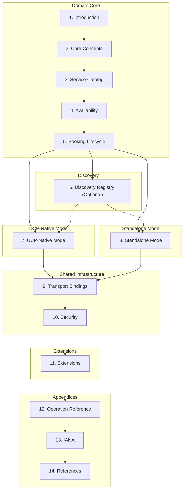
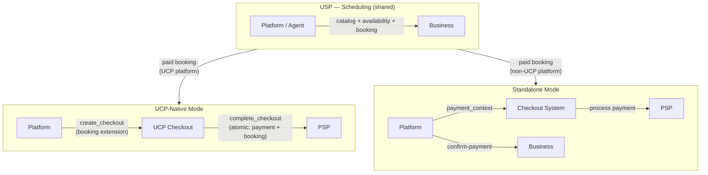
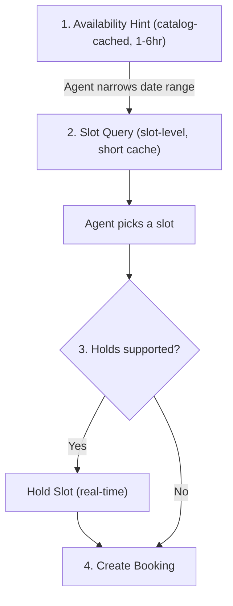
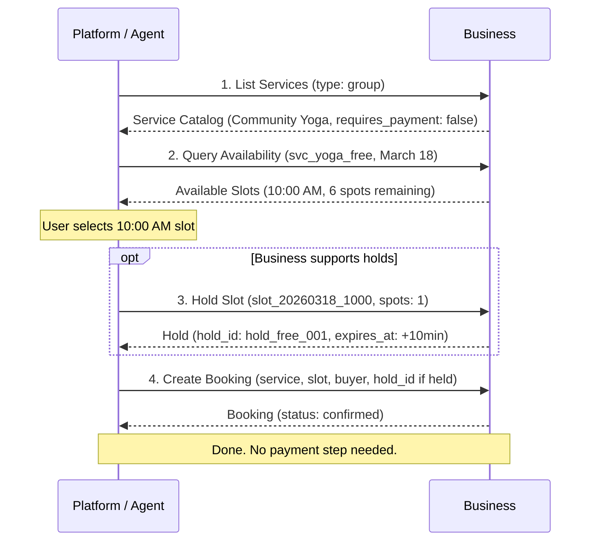
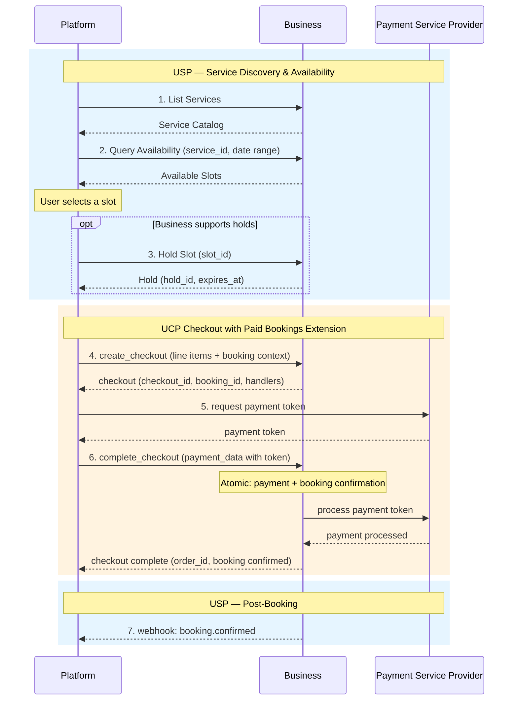
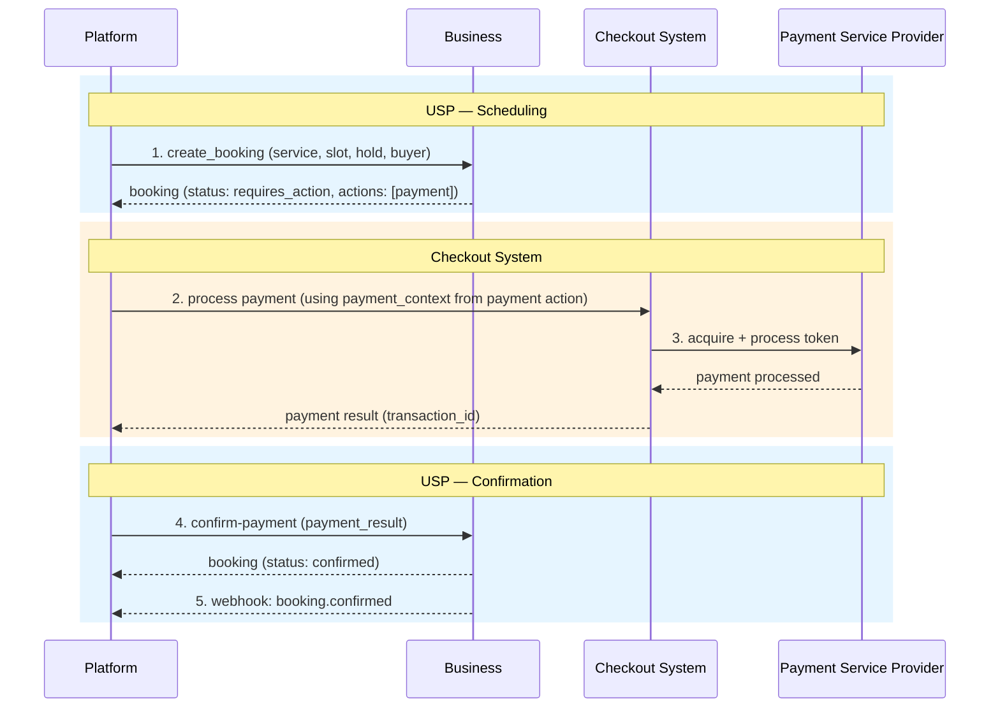
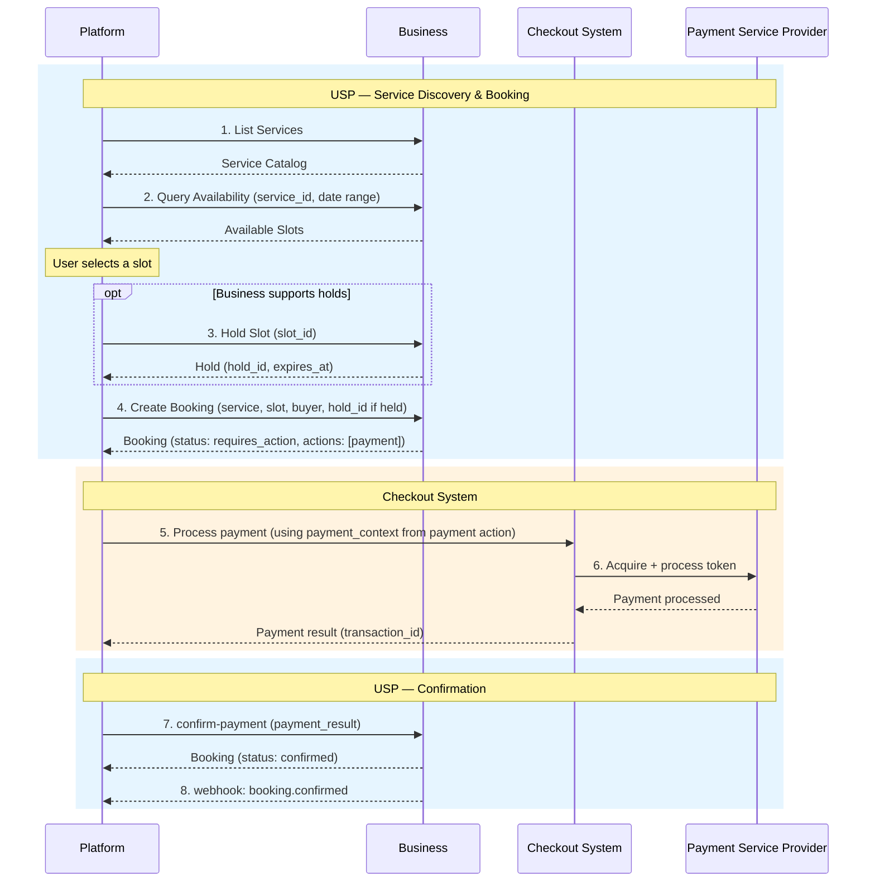
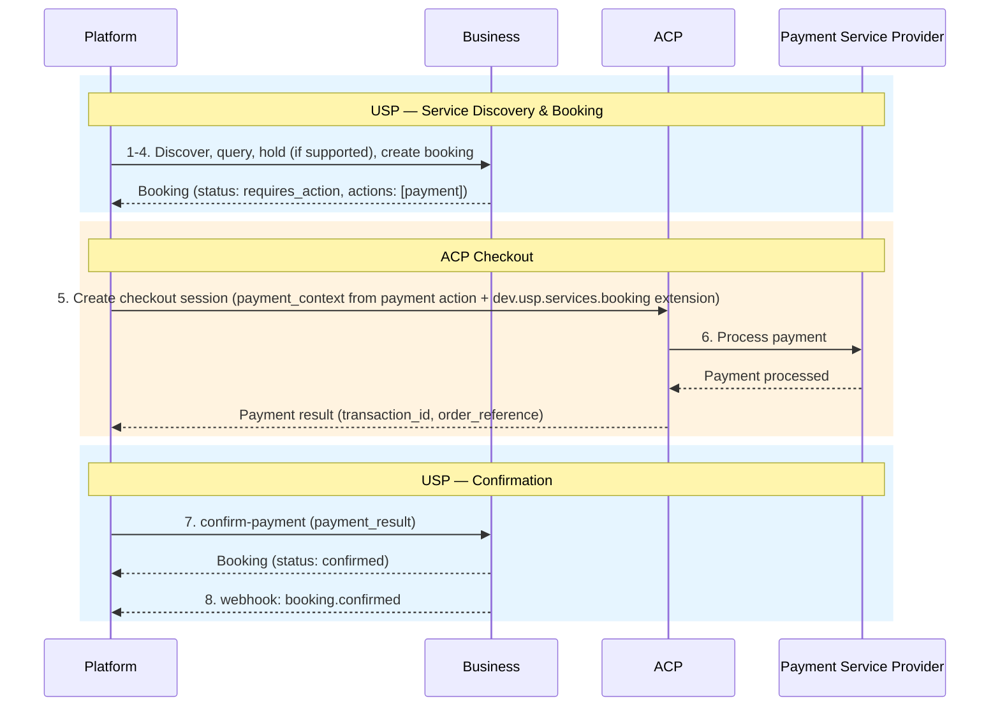
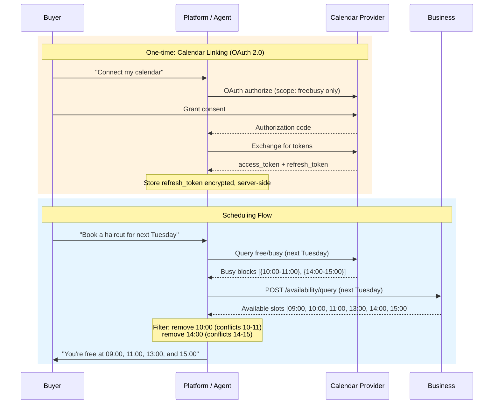

# Universal Scheduling Protocol (USP)

**Version:** `2026-02-21`

**Status:** Draft

---

## Abstract

The Universal Scheduling Protocol (USP) is an open standard that enables
consumer platforms and AI agents to discover, check availability of, and book
time-based services from businesses. USP supports both **paid** and **free**
agentic scheduling through two deployment modes.

USP defines three core capabilities - service catalog, availability, and
booking - along with optional extensions for waitlist management. It supports
REST, MCP, A2A, and ESP transport bindings and references IETF standards
directly for cross-cutting concerns (security, authorization, error format,
idempotency, webhook verification).

USP offers two deployment modes: **UCP-Native Mode** for platforms that already
support the [Universal Commerce Protocol (UCP)][UCP], where scheduling
capabilities register directly in the UCP profile and paid bookings use atomic
checkout; and **Standalone Mode** for platforms that want a self-contained
scheduling protocol with generic payment handoff. Both modes share the same
domain core (service catalog, availability, booking lifecycle) and the same
transport bindings. The mode determines only how discovery, payment, and
infrastructure are handled.

## Status of This Memo

This document specifies a Draft protocol for the Internet community and requests
discussion and suggestions for improvements. Distribution of this memo is
unlimited.

This is a draft specification. It is published for examination, experimental
implementation, and evaluation. It is not yet an Internet Standard.

## Copyright Notice

Copyright (c) 2026 USP Authors. This specification is released under
the [Apache License, Version 2.0](https://www.apache.org/licenses/LICENSE-2.0).

---

## Table of Contents

**PART I: DOMAIN CORE**

- [1. Introduction](#1-introduction)
    - [1.1 Conventions](#11-conventions)
    - [1.2 Terminology](#12-terminology)
    - [1.3 Service Verticals](#13-service-verticals)
    - [1.4 Relationship to Other Standards](#14-relationship-to-other-standards)
    - [1.5 Deployment Modes](#15-deployment-modes)
- [2. Core Concepts](#2-core-concepts)
    - [2.1 Roles and Participants](#21-roles-and-participants)
    - [2.2 Commerce and Non-Commerce Services](#22-commerce-and-non-commerce-services)
    - [2.3 High-Level Architecture](#23-high-level-architecture)
    - [2.4 Core Constructs](#24-core-constructs)
    - [2.5 Namespace Governance](#25-namespace-governance)
    - [2.6 Multi-Location Businesses](#26-multi-location-businesses)
- [3. Service Catalog](#3-service-catalog)
    - [3.1 Service Catalog Feed](#31-service-catalog-feed)
    - [3.2 Catalog Caching and Indexing](#32-catalog-caching-and-indexing)
    - [3.3 Service Schema](#33-service-schema)
    - [3.4 Business ID and Cross-Business Discovery](#34-business-id-and-cross-business-discovery)
    - [3.5 Localization](#35-localization)
    - [3.6 Availability Hint](#36-availability-hint)
    - [3.7 Duration](#37-duration)
    - [3.8 Pricing](#38-pricing)
    - [3.9 Service Policies](#39-service-policies)
    - [3.10 Resource Requirement](#310-resource-requirement)
    - [3.11 Validation Rules](#311-validation-rules)
    - [3.12 Operations](#312-operations)
- [4. Availability](#4-availability)
    - [4.1 Time Slot](#41-time-slot)
    - [4.2 Hold](#42-hold)
    - [4.3 Operations](#43-operations)
    - [4.4 Caching Strategy](#44-caching-strategy)
- [5. Booking Lifecycle](#5-booking-lifecycle)
    - [5.1 Booking Status Lifecycle](#51-booking-status-lifecycle)
    - [5.2 Booking Schema](#52-booking-schema)
    - [5.3 Operations](#53-operations)
    - [5.4 Webhooks](#54-webhooks)
    - [5.5 Post-Booking Lifecycle](#55-post-booking-lifecycle)
- [6. Discovery Registry (Optional)](#6-discovery-registry-optional)
    - [6.1 Business Registration](#61-business-registration---post-registrybusinesses)
    - [6.2 Business Search](#62-business-search---post-registrysearch_business)
    - [6.3 Service Search](#63-service-search---post-registrysearch_services)
    - [6.4 Registry Governance](#64-registry-governance)

**PART II: DEPLOYMENT MODES**

- [7. UCP-Native Mode](#7-ucp-native-mode)
    - [7.1 Overview and When to Use](#71-overview-and-when-to-use)
    - [7.2 Profile Registration in /.well-known/ucp](#72-profile-registration-in-well-knownucp)
    - [7.3 Inherited Infrastructure](#73-inherited-infrastructure)
    - [7.4 Paid Bookings Extension Schema](#74-paid-bookings-extension-schema)
    - [7.5 Checkout Flow and Atomicity Guarantee](#75-checkout-flow-and-atomicity-guarantee)
    - [7.6 Free Services in UCP-Native Mode](#76-free-services-in-ucp-native-mode)
    - [7.7 End-to-End Flows](#77-end-to-end-flows)
- [8. Standalone Mode](#8-standalone-mode)
    - [8.1 Overview and When to Use](#81-overview-and-when-to-use)
    - [8.2 Business Profile (/.well-known/usp)](#82-business-profile-well-knownusp)
        - [8.2.1 Business Profile Fields](#821-business-profile-fields)
        - [8.2.2 Profile Hosting Requirements](#822-profile-hosting-requirements)
        - [8.2.3 Platform Profile](#823-platform-profile)
        - [8.2.4 Backward Compatibility](#824-backward-compatibility)
    - [8.3 Capability Negotiation](#83-capability-negotiation)
    - [8.4 Versioning](#84-versioning)
    - [8.5 Payment Integration](#85-payment-integration)
    - [8.6 End-to-End Flows](#86-end-to-end-flows)

**PART III: SHARED INFRASTRUCTURE**

- [9. Transport Bindings](#9-transport-bindings)
    - [9.1 REST Binding](#91-rest-binding)
    - [9.2 MCP Binding](#92-mcp-binding)
    - [9.3 A2A Binding](#93-a2a-binding)
    - [9.4 Error Code Mapping](#94-error-code-mapping)
    - [9.5 Embedded Scheduling Protocol (ESP)](#95-embedded-scheduling-protocol-esp)
    - [9.6 Transport Infrastructure for Standalone Mode](#96-transport-infrastructure-for-standalone-mode)
- [10. Security](#10-security)
    - [10.1 USP Security Requirements](#101-usp-security-requirements)
    - [10.2 Security Infrastructure for Standalone Mode](#102-security-infrastructure-for-standalone-mode)

**PART IV: EXTENSIONS**

- [11. Extensions](#11-extensions)
    - [11.1 Waitlist Extension](#111-waitlist-extension)

**PART V: APPENDICES**

- [12. Operation Reference](#12-operation-reference)
- [13. IANA Considerations](#13-iana-considerations)
- [14. References](#14-references)
    - [14.1 Normative References](#141-normative-references)
    - [14.2 Informative References](#142-informative-references)
- [Appendix A. Future Vertical Considerations (Informative)](#appendix-a-future-vertical-considerations-informative)
- [Authors' Addresses](#authors-addresses)

---

## 1. Introduction

The Universal Scheduling Protocol (USP) is an open standard that enables
consumer platforms and AI agents to **discover**, **check availability of**, and
**book** time-based services from businesses.

USP defines the complete scheduling domain - service catalog, availability,
holds, and bookings - with two deployment modes: UCP-Native
Mode ([Section 7](#7-ucp-native-mode)) for platforms using the Universal
Commerce Protocol, and Standalone Mode ([Section 8](#8-standalone-mode)) for
self-contained deployments. Cross-cutting concerns (security, authorization,
error format, idempotency, webhook verification) reference IETF standards
directly.

The keywords **MUST**, **MUST NOT**, **REQUIRED**, **SHALL**, **SHALL NOT**, *
*SHOULD**, **SHOULD NOT**, **RECOMMENDED**, **MAY**, and **OPTIONAL** in this
document are to be interpreted as described in [RFC 2119] and [RFC 8174]. These
keywords **MUST** only carry their special meaning when they appear in all
capitals, as shown here.

### 1.1 Conventions

- Dates: [RFC 3339] (e.g., `2026-03-15T09:00:00-04:00`)
- Durations: [ISO 8601] (e.g., `PT60M`, `PT24H`, `P90D`)
- Currency amounts: Minor units / cents (e.g., `7500` = $75.00)
- Timezones: [IANA Time Zone Database](https://www.iana.org/time-zones)
  identifiers (e.g., `America/New_York`)

### 1.2 Terminology

The following terms are used throughout this document:

| Term                | Definition                                                                                                                                                                                                                                                                                                                                                       |
|---------------------|------------------------------------------------------------------------------------------------------------------------------------------------------------------------------------------------------------------------------------------------------------------------------------------------------------------------------------------------------------------|
| **Booking**         | A confirmed or pending reservation of a specific service at a specific time for a specific buyer. A booking has a lifecycle (create, confirm, reschedule, cancel, complete).                                                                                                                                                                                     |
| **Business**        | The entity offering time-based services. The business owns the schedule, resources, and booking policies. For payment purposes, the business is the Merchant of Record.                                                                                                                                                                                          |
| **BusyBlock**       | An opaque time block (`{start, end}`) from a buyer's calendar indicating the buyer is unavailable. Contains no event details. See [Section 11.2](#112-buyer-calendar-freebusy-extension).                                                                                                                                                                        |
| **Buyer**           | The person making and paying for the booking. Represented by a `buyer` object containing identity fields (name, email, phone). The buyer is the primary contact for booking management, payment, and notifications. When no separate `recipient` is specified, the buyer is also the person receiving the service.                                               |
| **BuyerFreeBusy**   | Aggregated free/busy data for a buyer, containing an array of `BusyBlock` entries merged across connected calendar providers. Used by platforms to filter business availability. See [Section 11.2](#112-buyer-calendar-freebusy-extension).                                                                                                                      |
| **Capability**      | A standalone feature a business supports, identified by a namespaced string (e.g., `dev.usp.services.catalog`). Each capability has a version, schema, and specification URL.                                                                                                                                                                                    |
| **Action**          | A pending task the buyer must complete before a booking can be confirmed. Each action has a type, status, continue URL, and expiry. Actions are returned in the ordered `actions` array on the booking when `status` is `requires_action`. The business determines which actions are required and their completion order. See [Section 5.2](#52-booking-schema). |
| **Checkout System** | Any external commerce protocol or payment mechanism used to process payment for a booking. USP does not prescribe which checkout system to use. See [Section 7](#7-ucp-native-mode) (UCP-Native Mode) or [Section 8.5](#85-payment-integration) (Standalone Mode payment integration).                                                                           |
| **Extension**       | An optional module that augments a capability via the `extends` field. Extensions add functionality without modifying the base capability.                                                                                                                                                                                                                       |
| **Hold**            | A temporary reservation of a time slot that prevents double-booking during the booking flow. Holds have a short TTL and are automatically released on expiry.                                                                                                                                                                                                    |
| **Payment Context** | A universal handoff object containing amount, currency, line items, and metadata - everything a checkout system needs to process payment. In Standalone Mode, the `PaymentContext` is nested inside a payment action in the booking's `actions` array. See [Section 8.5.2](#852-payment-context).                                                                |
| **Platform**        | The consumer-facing application or AI agent acting on behalf of the buyer. Platforms orchestrate the scheduling journey from discovery through booking and payment.                                                                                                                                                                                              |
| **Recipient**       | The person receiving the service, when different from the buyer. Represented by an optional `recipient` object on the booking with the same identity fields as `buyer`. When absent, the buyer is the recipient.                                                                                                                                                 |
| **Service**         | A time-based offering provided by a business (e.g., a haircut, yoga class, restaurant table, car rental). Each service has a type, duration, pricing, and policies.                                                                                                                                                                                              |
| **Slot**            | A specific, bookable time window for a service. Slots are computed dynamically from the business's schedule, resources, and existing bookings. Also referred to as "time slot."                                                                                                                                                                                  |
| **Vertical**        | A classification of service type that determines the scheduling semantics (e.g., `appointment`, `group`, `reservation`, `rental`). See [Section 1.3](#13-service-verticals).                                                                                                                                                                                     |

### 1.3 Service Verticals

USP defines the following core service verticals. The `type` field on a service*
*MUST** be set to one of these values, or to a vendor-defined vertical using
reverse-domain notation (e.g., `com.wix.services.courses`).

#### 1.3.1 Core Verticals

| Vertical      | Description                                                                                                                                     | Examples                                                  |
|---------------|-------------------------------------------------------------------------------------------------------------------------------------------------|-----------------------------------------------------------|
| `appointment` | A 1:1 session between a single client and a provider. The booking reserves one provider for one buyer at a specific time.                       | Salon, dental, consulting, personal training, therapy     |
| `group`       | A group session with limited capacity. Multiple buyers book into the same time slot, each occupying one or more spots up to a maximum capacity. | Yoga class, workshop, group fitness, cooking class        |
| `reservation` | A hold on a shared resource for a time window. The buyer reserves a specific resource (e.g., a table, a room) for a party of a given size.      | Restaurant table, conference room, venue, court booking   |
| `rental`      | Temporary exclusive use of equipment or space for a duration. The buyer takes possession of the resource for the rental period.                 | Car rental, studio space, equipment hire, vacation rental |

#### 1.3.2 Custom Verticals

Vendors **MAY** define custom verticals using their reverse-domain namespace:

```
com.{vendor}.services.{vertical_name}
```

Custom verticals **MUST** publish a specification and schema that define the
additional fields and semantics beyond the USP base service schema. Platforms
encountering an unrecognized vertical **SHOULD** fall back to treating the
service as an `appointment` type for basic scheduling operations.

For a list of scheduling domains under consideration for future standardization,
see [Appendix A](#appendix-a-future-vertical-considerations-informative).

### 1.4 Relationship to Other Standards

USP builds upon and complements several existing standards. This section
clarifies how USP relates to each and why a new protocol is necessary.

| Standard                                           | Relationship to USP                                                                                                                                                                                                                                                                                                                                                                                                                                                                |
|----------------------------------------------------|------------------------------------------------------------------------------------------------------------------------------------------------------------------------------------------------------------------------------------------------------------------------------------------------------------------------------------------------------------------------------------------------------------------------------------------------------------------------------------|
| **RFC 5545** (iCalendar) [RFC 5545]                | iCalendar defines the core data format for calendar events (`VEVENT`), free/busy information (`VFREEBUSY`), and scheduling objects. USP's booking and availability concepts are semantically related to iCalendar components. Businesses **SHOULD** support exporting confirmed bookings as iCalendar `VEVENT` objects for calendar integration. USP does not replace iCalendar but provides a higher-level commerce-aware scheduling protocol on top of similar concepts.         |
| **RFC 5546** (iTIP) [RFC 5546]                     | iTIP defines transport-independent scheduling methods (`REQUEST`, `REPLY`, `CANCEL`, `COUNTER`). USP's booking operations (create, confirm, reschedule, cancel) are semantically equivalent to iTIP methods. USP extends beyond iTIP by adding service discovery, real-time availability queries, slot holds, payment integration, and agentic transport bindings (MCP, A2A) that iTIP does not address.                                                                           |
| **RFC 6638** (CalDAV Scheduling) [RFC 6638]        | CalDAV Scheduling provides server-side implicit scheduling and free/busy queries. USP's availability query serves a similar purpose but is designed for cross-organization, platform-to-business interactions rather than intra-organization calendar sharing.                                                                                                                                                                                                                     |
| **RFC 7986** (New iCalendar Properties) [RFC 7986] | Adds `IMAGE`, `CONFERENCE` (virtual meeting URIs), and `REFRESH-INTERVAL` to iCalendar. USP's `channel.virtual_provider` and `images` fields overlap with these properties. Implementations **SHOULD** map these fields when exporting to iCalendar.                                                                                                                                                                                                                               |
| **schema.org/Service**                             | schema.org defines structured data types for services, offers, and actions (`ReserveAction`, `BookAction`). USP's service catalog complements schema.org: businesses **SHOULD** expose service catalog data as [schema.org/Service](https://schema.org/Service) structured data on their website for search engine discoverability (see [Section 3.2](#32-catalog-caching-and-indexing)), while the USP API provides the programmatic booking flow.                                |
| **OpenActive Open Booking API 1.0** [OpenActive]   | The Open Booking API is a W3C Community Group specification for booking physical activities, using RPDE feeds and schema.org data models. USP differs from OpenActive in three key ways: (1) USP provides a flexible payment integration model with multiple checkout path extensions, (2) USP is designed for agentic commerce with MCP/A2A bindings and availability hints for AI reasoning, and (3) USP covers a broader range of service verticals beyond physical activities. |
| **UCP** (Universal Commerce Protocol) [UCP]        | USP includes a UCP-Native Mode where scheduling capabilities register directly in the UCP profile. See [Section 7](#7-ucp-native-mode).                                                                                                                                                                                                                                                                                                                                            |
| **ACP** (Agentic Commerce Protocol)                | USP includes an ACP booking extension for Standalone Mode deployments. See [Section 8.5.6](#856-acp-booking-extension).                                                                                                                                                                                                                                                                                                                                                            |
| **RFC 9457** (Problem Details) [RFC 9457]          | USP uses RFC 9457 Problem Details for HTTP error responses. See [Section 9.1](#91-rest-binding).                                                                                                                                                                                                                                                                                                                                                                                   |
| **RFC 6749** (OAuth 2.0) [RFC 6749]                | USP uses OAuth 2.0 for authorization and identity linking. See [Section 10.2.3](#1023-authentication-and-authorization).                                                                                                                                                                                                                                                                                                                                                           |
| **RFC 9421** (HTTP Message Signatures) [RFC 9421]  | USP uses HTTP Message Signatures for webhook integrity verification. See [Section 10.1.1](#1011-webhook-security).                                                                                                                                                                                                                                                                                                                                                                 |

### 1.5 Deployment Modes

USP supports two deployment modes. An implementer of USP chooses one mode
based on their existing infrastructure and follows the implementation stages
associated with that deployment mode.
Both modes share the same domain core (Sections 1-5) for service catalog,
availability, and booking lifecycle.

#### 1.5.1 Choosing a Deployment Mode

| If your platform...                                             | Choose                                                | Read                                                                                                 |
|-----------------------------------------------------------------|-------------------------------------------------------|------------------------------------------------------------------------------------------------------|
| Already supports [UCP][UCP]                                     | **UCP-Native Mode** ([Section 7](#7-ucp-native-mode)) | Sections 1-5, optionally 6, 7, 9.1-9.5, 10.1, optionally 11, 12-14                                   |
| Does not support UCP, or wants a standalone scheduling protocol | **Standalone Mode** ([Section 8](#8-standalone-mode)) | Sections 1-6, 8, 9 (all), 10 (all), optionally 11, 12-14                                             |
| Only offers free services                                       | Either <br/>mode (for discovery only)                 | Sections 1-5, optionally 6, chosen deployment mode's section (without the payment part), 9-10, 12-14 |

#### 1.5.2 UCP-Native Implementation Stages

If your platform supports UCP, follow these steps to add USP scheduling
capabilities:

1. **Register capabilities.** Declare `dev.usp.services.catalog`,
   `dev.usp.services.availability`, `dev.usp.services.bookings`, and optionally
   `dev.usp.services.paid_bookings` in your `/.well-known/ucp` profile.
   See [Section 7.2](#72-profile-registration-in-well-knownucp).
2. **Implement service catalog.** Expose the service catalog API (list services,
   get service, feed). See [Section 3](#3-service-catalog).
3. **Implement availability.** Expose availability query and optional hold
   mechanism. See [Section 4](#4-availability).
4. **Implement booking lifecycle.** Expose create, get, update, confirm, cancel,
   and reschedule booking operations. See [Section 5](#5-booking-lifecycle).
5. **If offering paid services:** Add the `paid_bookings` extension to your UCP
   checkout schema ([Section 7.4](#74-paid-bookings-extension-schema)) and
   implement the checkout
   flow ([Section 7.5](#75-checkout-flow-and-atomicity-guarantee)).
6. **If offering free services only:**
   Follow [Section 7.6](#76-free-services-in-ucp-native-mode) - no checkout
   integration needed.
7. **Implement USP-specific transport details** for your chosen binding (
   Sections 9.1-9.5). *
   *Skip [Section 9.6](#96-transport-infrastructure-for-standalone-mode)** - UCP
   provides your transport infrastructure.
8. **Implement USP-specific security requirements
   ** ([Section 10.1](#101-usp-security-requirements)). *
   *Skip [Section 10.2](#102-security-infrastructure-for-standalone-mode)** -
   UCP provides your security infrastructure.
9. **Optional:** Implement the waitlist
   extension ([Section 11](#11-extensions)).
10. **Optional:** Register in a discovery
    registry ([Section 6](#6-discovery-registry-optional)).
11. **Verify** against end-to-end flows ([Section 7.7](#77-end-to-end-flows)).

#### 1.5.3 Standalone Implementation Stages

If your platform does not use UCP, follow these steps:

1. **Create your business profile.** Publish a `/.well-known/usp` profile
   declaring your capabilities, transport endpoints, and optional checkout
   systems. See [Section 8.2](#82-business-profile-well-knownusp).
2. **Implement capability negotiation.** Support the `USP-Agent` header and
   server-selects negotiation model.
   See [Section 8.3](#83-capability-negotiation).
3. **Implement service catalog.** Expose the service catalog API (list services,
   get service, feed). See [Section 3](#3-service-catalog).
4. **Implement availability.** Expose availability query and optional hold
   mechanism. See [Section 4](#4-availability).
5. **Implement booking lifecycle.** Expose create, get, update, confirm, cancel,
   and reschedule booking operations. See [Section 5](#5-booking-lifecycle).
6. **If offering paid services:** Implement payment
   integration ([Section 8.5](#85-payment-integration)) - choose the generic
   payment flow ([Section 8.5.4](#854-generic-payment-flow)) and/or the ACP
   booking extension ([Section 8.5.6](#856-acp-booking-extension)).
7. **If offering free services only:**
   Skip [Section 8.5](#85-payment-integration) entirely.
8. **Implement transport binding** for your chosen transport (Sections 9.1-9.5)*
   *and** transport
   infrastructure ([Section 9.6](#96-transport-infrastructure-for-standalone-mode)).
9. **Implement security requirements
   ** ([Section 10.1](#101-usp-security-requirements)) **and** security
   infrastructure ([Section 10.2](#102-security-infrastructure-for-standalone-mode)).
10. **Optional:** Implement the waitlist
    extension ([Section 11](#11-extensions)).
11. **Optional:** Register in a discovery
    registry ([Section 6](#6-discovery-registry-optional)).
12. **Verify** against end-to-end flows ([Section 8.6](#86-end-to-end-flows)).

#### 1.5.4 Reading Path Summary

The following diagram shows the specification structure and how sections flow
between the deployment modes:



| Implementer Type             | Sections to Read                                      | Skip Rules                                                                                                                                                       |
|------------------------------|-------------------------------------------------------|------------------------------------------------------------------------------------------------------------------------------------------------------------------|
| **UCP-Native (paid + free)** | 1-5, optionally 6, 7, 9-10, optionally 11, 12-14      | Skip [Sections 9.6](#96-transport-infrastructure-for-standalone-mode) and [10.2](#102-security-infrastructure-for-standalone-mode) (UCP provides infrastructure) |
| **Standalone (paid + free)** | 1-6, 8, 9-10 (all), optionally 11, 12-14              | Read all subsections                                                                                                                                             |
| **Free services only**       | 1-5, optionally 6, mode section (7 or 8), 9-10, 12-14 | Skip payment subsections in mode section                                                                                                                         |
| **Minimal v1**               | 1-5, mode section, 9-10                               | Skip extensions ([Section 11](#11-extensions)) entirely                                                                                                          |

---

## 2. Core Concepts

USP enables interoperability between platforms, businesses, and payment
providers for service commerce. This section introduces the key roles,
architectural principles, and protocol constructs.

### 2.1 Roles and Participants

USP defines interactions between four participants:

#### 2.1.1 Platform (Application / Agent)

The consumer-facing surface acting on behalf of the user. Platforms orchestrate
the full journey: discovering services, presenting availability, and
facilitating booking and payment.

- **Responsibilities:** Discovering business capabilities via`/.well-known/usp`,
  querying availability, creating bookings, processing payment through whichever
  checkout system is available.
- **Examples:** AI scheduling assistants, super apps, search engines,
  marketplace platforms.

#### 2.1.2 Business

The entity offering time-based services. In USP, the business owns the schedule,
resources, and booking policies. For payment, the business remains the *
*Merchant of Record**.

- **Responsibilities:** Publishing a USP profile, exposing a service catalog,
  computing real-time availability, managing the booking lifecycle, providing
  payment actions with `payment_context` for paid services.
- **Examples:** Salons, clinics, fitness studios, restaurants, rental companies,
  consultancies.

#### 2.1.3 Credential Provider (CP)

A trusted entity that securely manages user payment instruments and identity.
USP does not interact with credential providers directly - this interaction
occurs within the checkout system used for payment.

- **Examples:** Google Wallet, Apple Pay, digital identity providers.

#### 2.1.4 Payment Service Provider (PSP)

The financial infrastructure that processes payments. USP delegates all payment
processing to the checkout system, which in turn interacts with the PSP.

- **Examples:** Stripe, Adyen, PayPal, Braintree.

#### 2.1.5 Implementor Note: Expected Deployment Topology

While [Section 2.1](#21-roles-and-participants) describes the logical roles, in practice the 
business-side USP
implementation is almost always provided by a **SaaS platform** (e.g., Wix,
Square, Mindbody, Booksy) rather than by the individual business itself. The
salon owner does not implement USP endpoints -- their SaaS platform does, once,
on behalf of all its merchants.

This means the realistic implementor landscape is:

| Side                  | Who implements                                | Scale                                                        |
|-----------------------|-----------------------------------------------|--------------------------------------------------------------|
| **Business (server)** | SaaS scheduling platforms                     | One implementation serves thousands of merchants             |
| **Platform (client)** | Aggregators, AI agents, marketplace platforms | One integration consumes services across many SaaS providers |

This topology has important implications for the spec:

- **Features like the service catalog feed
  ** ([Section 3.1](#31-service-catalog-feed)), feed subscriptions, and hold
  abuse prevention are designed for SaaS-to-aggregator integration, not for
  individual businesses to build from scratch. SaaS platforms already have the
  infrastructure (change tracking, cursor-based pagination, soft-delete
  tombstones) to implement these features.
- **The `POST /services/list` endpoint** remains available for simpler,
  interactive use by platform UIs and AI agents that do not need bulk indexing.
- **Complexity budgets** in this spec are calibrated for professional platform
  teams on both sides, not for ad-hoc integrations.

Businesses that self-host USP without a SaaS platform **MAY** implement only the
capabilities they need. The modular capability system ensures that a minimal
implementation (catalog + availability + bookings) is viable without the feed,
subscriptions, or hold operations.

### 2.2 Commerce and Non-Commerce Services

USP supports both **paid services** that require payment integration and **free
or pay-later services** that operate standalone without any payment
infrastructure. This section defines the two operational modes and their
implications.

#### 2.2.1 Operational Modes

| Mode                            | `requires_payment` | `payment_timing`   | Checkout Required? | Booking Confirmation Flow                                                                                               |
|---------------------------------|--------------------|--------------------|--------------------|-------------------------------------------------------------------------------------------------------------------------|
| **Standalone (non-commerce)**   | `false`            | N/A                | No                 | `pending` → `confirmed` (auto mode) or `pending` → `confirmed` (manual mode, business approves)                         |
| **Standalone (pay-at-service)** | `true`             | `at_service`       | No                 | `pending` → `confirmed`. Payment is collected in person at the time of service; no upfront digital payment is required. |
| **Integrated (commerce)**       | `true`             | `at_booking`       | Yes                | `pending` → `requires_action` → (checkout) → `confirmed`                                                                |
| **Integrated (deposit)**        | `true`             | `deposit_required` | Yes                | `pending` → `requires_action` → (checkout for deposit) → `confirmed`                                                    |

- **Standalone mode:** USP operates independently. No checkout system is needed.
  The business publishes only `/.well-known/usp`. This mode is appropriate for
  free community events, public library room reservations, government services,
  volunteer scheduling, and services where payment is collected in person.
- **Integrated mode:** USP and a checkout system work together. When a booking
  requires payment, the `create_booking` response includes an `actions` array
  containing a payment action with a `payment_context` object. The platform
  processes payment through the available checkout system, then calls USP's
  `confirm-payment` endpoint to finalize the booking. In UCP-Native
  Mode ([Section 7](#7-ucp-native-mode)), paid bookings use UCP's atomic
  checkout (no payment action; payment is handled by the checkout). In
  Standalone Mode ([Section 8](#8-standalone-mode)), paid bookings use the
  generic `payment_context` + `confirm-payment` pattern via the payment action.

#### 2.2.2 Payment Field Conditionality

The `payment` object on a booking is conditionally present based on the
service's payment configuration:

| `requires_payment` | `payment_timing`   | `payment` Object on Booking | Notes                                                                                                                                                 |
|--------------------|--------------------|-----------------------------|-------------------------------------------------------------------------------------------------------------------------------------------------------|
| `false`            | N/A                | **MUST** be omitted         | Free service. No payment fields.                                                                                                                      |
| `true`             | `at_service`       | **MAY** be present          | If present: `status: not_required`, `amount_due: 0`. The `amount` field reflects the service price for informational purposes.                        |
| `true`             | `at_booking`       | **MUST** be present         | `status: pending`, `amount_due` = full amount. In Standalone Mode, the booking's `actions` array includes a payment action with `payment_context`.    |
| `true`             | `deposit_required` | **MUST** be present         | `status: pending`, `amount_due` = deposit amount. In Standalone Mode, the booking's `actions` array includes a payment action with `payment_context`. |

See [Section 7.7](#77-end-to-end-flows) (UCP-Native Mode)
or [Section 8.6](#86-end-to-end-flows) (Standalone Mode) for complete end-to-end
examples.

### 2.3 High-Level Architecture

USP supports two deployment modes. Both share the same scheduling layer (
catalog, availability, booking). The payment path diverges based on the
deployment mode:



**UCP-Native Mode** ([Section 7](#7-ucp-native-mode)): Platforms that already
support UCP register USP scheduling capabilities directly in their
`/.well-known/ucp` profile. Paid bookings use UCP's atomic checkout -
`complete_checkout` finalizes both payment and booking in a single operation.
Infrastructure (discovery, negotiation, security, error handling) is inherited
from UCP.

**Standalone Mode** ([Section 8](#8-standalone-mode)): Platforms that do not use
UCP discover businesses via `/.well-known/usp` and use USP's own infrastructure.
For paid bookings, the business returns a booking with a payment action
containing a `payment_context` object that any checkout system can process. The
platform calls `confirm-payment` after payment succeeds.

Both modes share the same scheduling
operations ([Sections 3-5](#3-service-catalog)) and the same transport
bindings ([Section 9](#9-transport-bindings)). For free services, no checkout
system is needed in either mode.

### 2.4 Core Constructs

USP is built on three constructs:

| Construct        | Description                                                                                                                                                                            | Examples                                                                                                                                                                                                             |
|------------------|----------------------------------------------------------------------------------------------------------------------------------------------------------------------------------------|----------------------------------------------------------------------------------------------------------------------------------------------------------------------------------------------------------------------|
| **Capabilities** | Standalone features a business supports, declared using a registry pattern (object keyed by capability name). Each capability has a namespace, schema, and version.                    | `dev.usp.services.catalog`, `dev.usp.services.availability`, `dev.usp.services.bookings`                                                                                                                             |
| **Extensions**   | Optional modules that augment a capability via the `extends` field. Extensions use JSON Schema composition (`allOf`, `$defs`) to layer additional fields onto base capability schemas. | Waitlist management (extends bookings, [Section 11.1](#111-waitlist-extension)), paid bookings (extends UCP checkout, [Section 7.4](#74-paid-bookings-extension-schema)), vendor-specific loyalty (extends bookings) |
| **Services**     | Transport layers for exchanging data. USP is transport-agnostic with specific bindings. Each service is an array of transport objects with a `transport` discriminator field.          | REST (OpenAPI 3.x), MCP (OpenRPC / JSON-RPC), A2A (Agent Card). See [Section 9](#9-transport-bindings).                                                                                                              |

### 2.5 Namespace Governance

USP uses reverse-domain notation for capability names:

```
{reverse-domain}.{service}.{capability}
```

The `dev.usp.*` namespace is governed by the USP body. Vendors **MUST** use
their own domain (e.g., `com.wix.services.courses`).

Within the `dev.usp.*` namespace, capabilities are organized by scope:

- `dev.usp.services.*` — Business-facing capabilities that the business
  declares and platforms consume (e.g., `dev.usp.services.catalog`,
  `dev.usp.services.availability`).
- `dev.usp.platform.*` — Platform-scoped capabilities that the platform
  declares and implements internally. These do not require business-side
  support (e.g., `dev.usp.platform.calendar_freebusy`).

### 2.6 Multi-Location Businesses

For businesses with multiple locations (chains, franchises), a single USP
endpoint **MAY** serve all locations through a unified profile. The business
profile includes a `locations` array that enumerates the locations it manages:

```json
{
  "usp": {
    "version": "2026-02-09",
    "business": {
      "name": "Sunrise Wellness Studio",
      "timezone": "America/New_York",
      "currency": "USD",
      "locations": [
        {
          "id": "loc_nyc",
          "name": "NYC Downtown",
          "address": "123 Main St, New York, NY 10001"
        },
        {
          "id": "loc_la",
          "name": "LA West",
          "address": "456 Sunset Blvd, Los Angeles, CA 90028"
        }
      ]
    }
  }
}
```

When multiple locations share a single endpoint, the feed, list, and
availability operations **SHOULD** accept an optional `location_id` filter so
platforms can scope requests to a specific location:

```
GET /services/feed?cursor=crs_a1b2c3d4e5f6&limit=50&location_id=loc_nyc
```

Similarly, `POST /services/list` and `POST /availability/query` **SHOULD**accept
`location_id`. Each service's `locations[]`
field ([Section 3.3](#33-service-schema)) and each slot's `location`
field ([Section 4.1](#41-time-slot)) identify which location a service or slot
belongs to.

> **Note:** Alternatively, each location **MAY** publish its own independent
`/.well-known/usp` profile (e.g., `nyc.sunrisewellness.com`,
`la.sunrisewellness.com`), in which case no multi-location protocol extensions
> are needed -- each location operates as a standard single-location USP business.

---

## 3. Service Catalog

**Capability:** `dev.usp.services.catalog`

The catalog enables platforms to **discover what services a business offers** -
types, pricing, policies, resources, and delivery channels.

### 3.1 Service Catalog Feed

Businesses **SHOULD** publish a service catalog feed for aggregators and
indexing platforms. The feed enables incremental synchronization - aggregators
maintain a cursor and fetch only changed records since their last sync, rather
than re-fetching the entire catalog.

**Feed Endpoint** - `GET /services/feed`

The feed returns a paginated, chronologically ordered list of service records,
sorted by `modified_at` ascending. This design follows the Realtime Paged Data
Exchange (RPDE) pattern used by [OpenActive] and is analogous to product feeds
in commerce platforms. The response **MAY** include an optional `messages[]`
array (e.g., partial results when `feed_status` is `degraded`).

Request:

```json
GET /services/feed?cursor=crs_a1b2c3d4e5f6&limit=50
```

Response:

```json
{
  "usp": {
    "version": "2026-02-09",
    "capabilities": {
      "dev.usp.services.catalog": [
        {
          "version": "2026-02-09"
        }
      ]
    }
  },
  "items": [
    {
      "state": "updated",
      "modified_at": "2026-03-10T09:15:00Z",
      "data": {
        "id": "svc_haircut_001",
        "business_id": "biz_glamour_salon_nyc",
        "name": "Women's Haircut & Style",
        "type": "appointment",
        "...": "full service object"
      }
    },
    {
      "state": "deleted",
      "modified_at": "2026-03-10T10:00:00Z",
      "data": {
        "id": "svc_old_service_002",
        "business_id": "biz_glamour_salon_nyc"
      }
    }
  ],
  "pagination": {
    "cursor": "crs_f7g8h9i0j1k2",
    "has_more": true
  },
  "feed_meta": {
    "feed_generated_at": "2026-03-10T10:05:00Z",
    "total_services": 47,
    "feed_status": "healthy"
  }
}
```

| Field                         | Type    | Required | Description                                                                                                                                                                                                                                                  |
|-------------------------------|---------|----------|--------------------------------------------------------------------------------------------------------------------------------------------------------------------------------------------------------------------------------------------------------------|
| `items[].state`               | string  | **Yes**  | `updated` (new or modified service) or `deleted` (service removed; aggregators **MUST** prune this from their index).                                                                                                                                        |
| `items[].modified_at`         | string  | **Yes**  | RFC 3339 timestamp of when this record was last modified. Used as the cursor for incremental sync.                                                                                                                                                           |
| `items[].data`                | object  | **Yes**  | Full service object for `updated` state; object containing only `id` for `deleted` state.                                                                                                                                                                    |
| `pagination.next_cursor`      | string  | **Yes**  | Opaque cursor to pass as the `cursor` query parameter on the next request.                                                                                                                                                                                   |
| `pagination.has_more`         | boolean | **Yes**  | Whether more records exist beyond this page.                                                                                                                                                                                                                 |
| `feed_meta.feed_generated_at` | string  | **Yes**  | RFC 3339 timestamp of when this feed page was computed. Aggregators can use this to detect stale feeds.                                                                                                                                                      |
| `feed_meta.total_services`    | integer | **Yes**  | Total number of active (non-deleted) services in the business's catalog. Aggregators can use this to verify completeness of their index.                                                                                                                     |
| `feed_meta.feed_status`       | string  | **Yes**  | Health status of the feed. `healthy`: feed is fully up-to-date. `degraded`: feed may be missing recent changes (e.g., partial index rebuild in progress). `rebuilding`: feed is being regenerated from scratch; aggregators **SHOULD** expect a full resync. |

> **Note:** The feed endpoint uses `pagination.next_cursor` (a timestamp
> string) rather than the generic `cursor` used by all other paginated USP
> operations. This is intentional: the feed cursor is a `modified_at` timestamp
> that enables incremental RPDE-style synchronization, and its semantics differ
> from the opaque cursor used for interactive paging. See
> [Section 9.1.2](#912-pagination) for the shared cursor model.

The `List Services` operation ([Section 3.12](#312-operations)) remains
available for interactive use by platform UIs and AI agents. The feed endpoint
is designed for bulk indexing by aggregators.

### 3.2 Catalog Caching and Indexing

Service catalog data is relatively static - services, pricing, and policies
change infrequently compared to real-time availability. Platforms and
aggregators **SHOULD** cache catalog data rather than querying it on every user
interaction.

**Recommended caching strategies:**

- **Merchant aggregators** (e.g., Google Merchant Center): Catalog data **SHOULD
  ** be indexed by consuming the service catalog
  feed ([Section 3.1](#31-service-catalog-feed)) via incremental cursor-based
  synchronization. This enables pre-indexed service discovery and search across
  businesses without real-time API calls. Aggregators **SHOULD** synchronize at
  least once per hour for high-frequency businesses and once per day for
  low-frequency businesses.
- **Web crawlers and structured data**: Businesses **SHOULD** additionally
  expose service catalog data
  as [schema.org/Service](https://schema.org/Service) structured data on their
  website, enabling search engines and discovery platforms to index services
  through standard web scraping. This is complementary to the API - the
  structured data provides discoverability, while the USP API provides the
  programmatic booking flow.
- **Platform-level caching**: Platforms **SHOULD** cache catalog responses
  according to HTTP `Cache-Control` headers. Platforms **SHOULD** refresh cached
  catalog data at intervals between 1 and 24 hours, depending on the business
  vertical and rate of change.

Availability and booking, by contrast, are real-time operations and **MUST NOT**
be served from stale caches.

#### 3.2.1 Structured Data Mapping Guide

When exposing service catalog data
as [schema.org/Service](https://schema.org/Service) structured data, businesses*
*SHOULD** use the following mapping from USP service fields to schema.org
properties:

| USP Field                               | schema.org Property                            | Notes                                                                                                 |
|-----------------------------------------|------------------------------------------------|-------------------------------------------------------------------------------------------------------|
| `name`                                  | `schema:name`                                  | Direct mapping.                                                                                       |
| `description`                           | `schema:description`                           | Direct mapping.                                                                                       |
| `type`                                  | `schema:serviceType`                           | Map USP vertical to a human-readable service type string.                                             |
| `pricing.amount`                        | `schema:offers.price`                          | Convert from minor units to decimal (e.g., `7500` -> `75.00`).                                        |
| `pricing.currency`                      | `schema:offers.priceCurrency`                  | Direct mapping (ISO 4217).                                                                            |
| `pricing.model`                         | `schema:offers.priceSpecification`             | Use `UnitPriceSpecification` for `hourly`/`per_person`; `CompoundPriceSpecification` for `variable`.  |
| `channel.type: virtual`                 | `schema:availableChannel.serviceType`          | Set to `OnlineOnly`. Include `schema:offers.availableDeliveryMethod` as `DeliveryModeDirectDownload`. |
| `channel.type: in_person`               | `schema:availableChannel.serviceLocation`      | Map to `schema:Place` with address.                                                                   |
| `locations[]`                           | `schema:areaServed` / `schema:serviceLocation` | Map each location to a `schema:Place`.                                                                |
| `availability_hint.next_available_date` | `schema:availabilityStarts`                    | Approximate; use with `schema:Offer`.                                                                 |
| `media[].url` (type=image)              | `schema:image`                                 | Direct mapping. Filter to `type: "image"` entries.                                                    |
| `media[].url` (type=video)              | `schema:video`                                 | Map to `schema:VideoObject`.                                                                          |
| `policies.cancellation`                 | `schema:cancellationPolicy`                    | Map `free_cancellation_until` to a human-readable string or use `schema:MerchantReturnPolicy`.        |
| `duration.fixed`                        | `schema:providerMobility` / custom             | No direct schema.org equivalent; use `schema:duration` on the `Event` if modeling as an event.        |
| `capacity.max`                          | `schema:maximumAttendeeCapacity`               | For `group` and `reservation` types.                                                                  |

This mapping ensures consistent discoverability across search engines while the
USP API provides the programmatic booking flow.

### 3.3 Service Schema

> **JSON Schema:** [`schemas/catalog.json`](schemas/catalog.json)

The service object represents a bookable offering from a business. Each service
has a type (vertical), duration, pricing, policies, and optional resource
requirements.

| Field               | Type                         | Required | Description                                                                                                                                                                                                                                                                                                                                |
|---------------------|------------------------------|----------|--------------------------------------------------------------------------------------------------------------------------------------------------------------------------------------------------------------------------------------------------------------------------------------------------------------------------------------------|
| `id`                | string                       | **Yes**  | Unique service identifier, scoped to the business. Opaque to the platform. The composite key `(business_id, id)` is globally unique.                                                                                                                                                                                                       |
| `business_id`       | string                       | **Yes**  | Identifier of the business that owns this service. Populated by the provider in API responses. Together with `id`, forms the globally unique composite key for a service. Required for cross-business discovery, cached catalog aggregation, and agent-to-agent hand-off. See [Section 3.4](#34-business-id-and-cross-business-discovery). |
| `provider`          | Provider                     | No       | Inline business metadata for display without a separate profile fetch. See [Section 3.3.3](#333-provider-schema). Aligns with UCP's seller object.                                                                                                                                                                                        |
| `name`              | string                       | **Yes**  | Human-readable display name for the service (e.g., "Women's Haircut & Style").                                                                                                                                                                                                                                                             |
| `description`       | string \| Description        | No       | Service description. Accepts either a plain string (backward compatible) or a structured `Description` object with multiple format variants. See [Section 3.3.2](#332-description-schema).                                                                                                                                                 |
| `type`              | string                       | **Yes**  | The service vertical. **MUST** be one of the core verticals (`appointment`, `group`, `reservation`, `rental`) or a vendor-defined vertical using reverse-domain notation. See [Section 1.3](#13-service-verticals).                                                                                                                        |
| `category`          | object                       | No       | `{id, name, parent_id}` - business's canonical classification for the service (e.g., "Beauty > Hair"). The `parent_id` enables hierarchical categorization.                                                                                                                                                                                |
| `categories`        | Array\[object\]              | No       | Array of `{value, taxonomy}` category entries. Supports multiple taxonomy systems (e.g., `{"value": "beauty > hair", "taxonomy": "merchant"}`, `{"value": "596", "taxonomy": "google_product_category"}`). Aligns with UCP categories. If both `category` and `categories` are present, `categories` is the authoritative set.             |
| `duration`          | Duration                     | **Yes**  | Duration configuration. See [Section 3.7](#37-duration).                                                                                                                                                                                                                                                                                   |
| `pricing`           | Pricing                      | **Yes**  | Pricing model and amounts. See [Section 3.8](#38-pricing).                                                                                                                                                                                                                                                                                 |
| `locations`         | Array\[Location\]            | No       | Physical or virtual locations where the service is offered. Each location has `{id, name, address, coordinates}`.                                                                                                                                                                                                                          |
| `resources`         | Array\[ResourceRequirement\] | No       | Required staff, rooms, or equipment. See [Section 3.10](#310-resource-requirement).                                                                                                                                                                                                                                                        |
| `channel`           | object                       | **Yes**  | Delivery channel for the service. See channel types below.                                                                                                                                                                                                                                                                                 |
| `policies`          | ServicePolicies              | **Yes**  | Booking, cancellation, rescheduling, and payment policies. See [Section 3.9](#39-service-policies).                                                                                                                                                                                                                                        |
| `capacity`          | object                       | No       | `{min, max, waitlist}` - **REQUIRED** for `group` and `reservation` types. `min`: minimum party size accepted. `max`: maximum participants per slot. `waitlist`: boolean indicating whether waitlist is enabled when slots are full.                                                                                                       |
| `media`             | Array\[Media\]               | No       | Service media items (images, videos). See [Section 3.3.1](#331-media-schema). Replaces the previous `images` field.                                                                                                                                                                                                                         |
| `images`            | Array\[object\]              | No       | **Deprecated.** Alias for `media` for backward compatibility. If both `images` and `media` are present, `media` takes precedence. New implementations **SHOULD** use `media`.                                                                                                                                                               |
| `rating`            | object                       | No       | Aggregate service rating. `value` (number, required): average rating. `scale_min` (number, default 1): minimum scale value. `scale_max` (number, required): maximum scale value (e.g., 5). `count` (integer): number of reviews. Aligns with UCP rating object.                                                                            |
| `status`            | string                       | No       | Service lifecycle status: `active` (default, bookable), `suspended` (temporarily unavailable), `archived` (no longer offered, retained for history). Absent means `active`. A `service.suspended` webhook event **MUST** set this to `suspended`.                                                                                          |
| `handle`            | string                       | No       | URL-friendly slug for the service (e.g., `womens-haircut-style`). Aligns with UCP handle.                                                                                                                                                                                                                                                  |
| `url`               | string                       | No       | Canonical service page URL on the business's website. Aligns with UCP url.                                                                                                                                                                                                                                                                  |
| `tags`              | Array\[string\]              | No       | Freeform tags for categorization and search (e.g., `["relaxation", "deep-tissue", "prenatal"]`). Aligns with UCP tags.                                                                                                                                                                                                                     |
| `metadata`          | object                       | No       | Business-defined custom data extending the standard service model. Freeform key-value object. Platforms **SHOULD** pass through opaquely. Aligns with UCP metadata.                                                                                                                                                                         |
| `availability_hint` | AvailabilityHint             | No       | Approximate availability summary for agent-assisted discovery. See [Section 3.6](#36-availability-hint).                                                                                                                                                                                                                                   |
| `localized`         | LocalizedFields              | No       | Per-locale overrides for human-readable text fields. Keys are IETF BCP 47 language tags (e.g., `es`, `fr`, `zh-Hant`). The top-level fields (`name`, `description`, etc.) serve as the default/fallback locale. See [Section 3.5](#35-localization).                                                                                       |

**Channel types:**

| `channel.type` | Description                                                                                                                  | Additional Fields                                                                                                                    |
|----------------|------------------------------------------------------------------------------------------------------------------------------|--------------------------------------------------------------------------------------------------------------------------------------|
| `in_person`    | Service is delivered at a physical location. The buyer must attend in person.                                                | `instructions`: optional arrival instructions.                                                                                       |
| `virtual`      | Service is delivered remotely via video/audio call.                                                                          | `virtual_provider`: platform name (e.g., "Zoom", "Google Meet"). `instructions`: join instructions or a link provided after booking. |
| `phone`        | Service is delivered via phone call.                                                                                         | `instructions`: optional call-in details.                                                                                            |
| `hybrid`       | Service can be delivered either in person or virtually, at the buyer's choice. The buyer selects the channel during booking. | `virtual_provider`, `instructions`. The booking request **SHOULD** include the buyer's channel preference.                           |

#### 3.3.1 Media Schema

The `media` array contains typed media items for the service. Each entry
describes a single image, video, or other media resource. This aligns with
UCP's media model.

| Field      | Type    | Required | Description                                                                                                                 |
|------------|---------|----------|-----------------------------------------------------------------------------------------------------------------------------|
| `type`     | string  | **Yes**  | Media format type: `image`, `video`. Additional types **MAY** be added in the future; platforms **MUST** ignore unknown types. |
| `url`      | string  | **Yes**  | URL to the media resource (HTTPS).                                                                                          |
| `alt_text` | string  | No       | Accessibility text describing the media. **RECOMMENDED** for all media items.                                               |
| `role`     | string  | No       | Display role: `hero` (primary banner), `gallery` (additional images/videos), `thumbnail` (small preview). Default: `gallery`. |
| `width`    | integer | No       | Width in pixels. **RECOMMENDED** for images and videos to enable responsive layouts without fetching the resource.           |
| `height`   | integer | No       | Height in pixels. **RECOMMENDED** for images and videos.                                                                    |

**Migration from `images`:** The previous `images` field used `{url, alt, type}`
where `type` was the display role (`hero`, `gallery`, `thumbnail`). The new
`media` field separates the media format (`type`) from the display role
(`role`), and renames `alt` to `alt_text` for consistency with UCP and
accessibility standards. Businesses **SHOULD** migrate to `media`. If both
`images` and `media` are present on a service, platforms **MUST** use `media`.

#### 3.3.2 Description Schema

The `description` field accepts either a plain string (backward compatible) or
a structured object with multiple format variants. This aligns with UCP's
`Description` type.

**Plain string (backward compatible):**

```json
"description": "A full haircut and styling session with one of our experienced stylists."
```

**Structured object:**

```json
"description": {
  "plain": "A full haircut and styling session with one of our experienced stylists.",
  "markdown": "A full **haircut and styling** session with one of our experienced stylists.\n\n- Consultation\n- Shampoo\n- Cut & blow-dry"
}
```

| Field      | Type   | Required    | Description                                                                                                                                   |
|------------|--------|-------------|-----------------------------------------------------------------------------------------------------------------------------------------------|
| `plain`    | string | **Yes**     | Plain text content. Always required as the universal fallback.                                                                                |
| `markdown` | string | No          | Markdown-formatted content.                                                                                                                  |
| `html`     | string | No          | HTML-formatted content. Platforms **MUST** sanitize before rendering — strip scripts, event handlers, and untrusted elements.                 |

At least `plain` **MUST** be provided. Platforms **SHOULD** prefer the richest
format they can safely render (`html` > `markdown` > `plain`), falling back to
`plain` for unsupported formats.

When a plain string is provided instead of an object, platforms **MUST** treat
it as equivalent to `{"plain": "<the string>"}`.

#### 3.3.3 Provider Schema

The optional `provider` object carries inline business metadata on the service,
so platforms can display the business name, website, and policy links without a
separate profile fetch. This is particularly valuable for multi-business search
results, cached catalogs, and AI agents describing services to buyers. Aligns
with UCP's `seller` object on product variants.

The `provider` is a lightweight subset of the business profile — not a
replacement. Platforms that need the full profile (capabilities, endpoints,
signing keys) **MUST** still fetch `/.well-known/usp`.

| Field   | Type          | Required | Description                                                                                            |
|---------|---------------|----------|--------------------------------------------------------------------------------------------------------|
| `name`  | string        | **Yes**  | Business display name (e.g., "Glamour Salon NYC").                                                     |
| `url`   | string        | No       | Business website URL.                                                                                  |
| `links` | Array\[Link\] | No       | Typed links to policy and information pages. See link types below.                                     |

**Link object:**

| Field   | Type   | Required | Description                                                                                                          |
|---------|--------|----------|----------------------------------------------------------------------------------------------------------------------|
| `type`  | string | **Yes**  | Link type. Well-known values: `privacy_policy`, `terms_of_service`, `refund_policy`, `cancellation_policy`, `faq`.   |
| `url`   | string | **Yes**  | URL to the linked page.                                                                                              |
| `title` | string | No       | Display text for the link. When provided, use instead of generating from `type`.                                     |

Platforms **SHOULD** handle unknown `type` values gracefully by displaying
them using the `title` field or omitting the link.

Example:

```json
"provider": {
  "name": "Glamour Salon NYC",
  "url": "https://glamoursalon.nyc",
  "links": [
    {
      "type": "cancellation_policy",
      "url": "https://glamoursalon.nyc/policies/cancellation"
    },
    {
      "type": "terms_of_service",
      "url": "https://glamoursalon.nyc/terms",
      "title": "Booking Terms"
    }
  ]
}
```

### 3.4 Business ID and Cross-Business Discovery

The `business_id` field makes every service object **self-describing** — it
carries the identity of the business that offers it, even after the service
object leaves the API response context.

This is critical in agentic workflows where services are routinely aggregated,
cached, and passed between systems:

| Scenario                           | Why `business_id` matters                                                                                                                                                             |
|------------------------------------|---------------------------------------------------------------------------------------------------------------------------------------------------------------------------------------|
| **Cross-business semantic search** | An agent indexes services from hundreds of businesses into a single search index. When a match is found, the agent needs to know which business to call for availability and booking. |
| **Cached catalog aggregation**     | Platforms cache service catalogs (the spec recommends 1-24 hour caching). The cache is a flat collection; `business_id` preserves the association.                                    |
| **Agent-to-agent hand-off**        | A discovery agent passes a service object to a booking agent. Without `business_id`, the receiving agent cannot act on it.                                                            |
| **Collision prevention**           | Two businesses may both have a service with `id: "haircut-1"`. The composite key `(business_id, id)` ensures global uniqueness.                                                       |

**Rules:**

- Providers **MUST** populate `business_id` in all API responses that contain
  service objects (list, get, feed, webhooks).
- Platforms **MUST NOT** send `business_id` in create or update requests — the
  business context is established by the API endpoint and authentication.
- The composite key `(business_id, id)` is the globally unique identifier for a
  service across the entire USP ecosystem.

### 3.5 Localization

The optional `localized` field provides per-locale overrides for human-readable
text fields on a service. The top-level fields (`name`, `description`,
`category.name`, `channel.instructions`) serve as the default/fallback locale.
The `localized` field uses IETF BCP 47 language tags as keys.

This design allows platforms to cache a single service object containing all
translations, rather than making per-locale API calls or maintaining multiple
cached copies. It is especially important for businesses serving multilingual
audiences.

**Localizable fields:**

| `localized` key        | Overrides                      |
|------------------------|--------------------------------|
| `name`                 | `service.name`                 |
| `description`          | `service.description`          |
| `category_name`        | `service.category.name`        |
| `channel_instructions` | `service.channel.instructions` |

**Example:**

```json
{
  "id": "svc_haircut_001",
  "business_id": "biz_glamour_salon_nyc",
  "name": "Women's Haircut & Style",
  "description": "A full haircut and styling session.",
  "localized": {
    "name": {
      "es": "Corte y Peinado para Mujer",
      "fr": "Coupe & Coiffure Femme"
    },
    "description": {
      "es": "Una sesión completa de corte y peinado.",
      "fr": "Une séance complète de coupe et coiffure."
    },
    "category_name": {
      "es": "Cortes de pelo",
      "fr": "Coupes de cheveux"
    }
  }
}
```

**Rules:**

- The `localized` field is **optional**. Services without it use their top-level
  text fields for all locales.
- Platforms **SHOULD** resolve the buyer's preferred locale by matching against
  available keys, falling back to the top-level field when no match is found.
- Providers **SHOULD** include translations for all locales they actively
  support.

### 3.6 Availability Hint

An optional, lightweight summary of a service's near-term availability. The hint
is designed for AI agents and platforms that need to make smart decisions about*
*what date ranges to query** before hitting the real-time availability API. It
is cached alongside catalog data and serves as "Tier 0" of the availability
funnel (see [Section 4.4 - Caching Strategy](#44-caching-strategy)).

The hint captures the same information a receptionist would give over the phone:
a natural-language snapshot of when the business is open, busy, or booked out.
Businesses **SHOULD** regenerate this field every 1-6 hours, or whenever
availability changes significantly (e.g., a day transitions from available to
fully booked).

> **Important:** The availability hint is an **approximation**. Platforms **MUST
NOT** use it as a substitute for real-time availability queries. It is strictly
> a guide for narrowing the date range and reducing unnecessary API calls. The
> structured availability API (day-level and slot-level) remains the source of
> truth.

| Field                 | Type   | Required | Description                                                                                                                                                                                                                               |
|-----------------------|--------|----------|-------------------------------------------------------------------------------------------------------------------------------------------------------------------------------------------------------------------------------------------|
| `summary`             | string | **Yes**  | Natural-language description of near-term availability. Aimed at AI agents for reasoning about which dates to query. Example: *"Fully booked this week. Next week we have good availability on Tuesday afternoon and Wednesday morning."* |
| `generated_at`        | string | **Yes**  | RFC 3339 timestamp of when this hint was generated. Platforms can use this to assess freshness and decide how much weight to give the hint. A hint older than 6 hours **SHOULD** be treated with lower confidence.                        |
| `next_available_date` | string | No       | `YYYY-MM-DD` date of the next day with known availability. This single structured field is usable by both AI agents and traditional programmatic platforms to skip fully booked date ranges.                                              |

#### 3.6.1 Agent Use Cases

The availability hint is particularly valuable for AI agents that orchestrate
scheduling on behalf of users. The following table summarizes the key use cases
and how the hint helps in each:

| #  | Use Case                               | Agent Scenario                                          | How the Hint Helps                                                                                                                                                                                                    |
|----|----------------------------------------|---------------------------------------------------------|-----------------------------------------------------------------------------------------------------------------------------------------------------------------------------------------------------------------------|
| 1  | **First-available search**             | "Book me a haircut as soon as possible."                | `next_available_date` lets the agent jump directly to the first opening instead of scanning day-by-day from today.                                                                                                    |
| 2  | **Multi-business comparison**          | "Find me a massage therapist available this Thursday."  | The agent reads hints from multiple businesses' cached catalogs and filters out those marked as booked - without making any availability API calls.                                                                   |
| 3  | **Flexible date negotiation**          | "I'm flexible - find me a good time next week."         | The `summary` names specific days with openings, so the agent can propose smart options conversationally before querying slot-level.                                                                                  |
| 4  | **Proactive rescheduling**             | A booking is canceled; the agent helps the user rebook. | The agent reads the hint from the cached catalog and immediately suggests alternate days, enabling a faster rescheduling flow.                                                                                        |
| 5  | **Availability-aware recommendations** | "I want to book a yoga class this weekend."             | The agent ranks services not just by relevance but by likelihood of availability, avoiding the pattern of recommending a class only to discover it's full.                                                            |
| 6  | **Smart date range scoping**           | Agent builds a calendar view for the user.              | The hint identifies fully-booked periods, so the agent only queries day-level for the remaining open range - reducing payload size and API load.                                                                      |
| 7  | **Long-horizon search**                | "Book me with Dr. Smith - I don't care when."           | The hint says "booked solid for 3 weeks, next opening around April 1," letting the agent set expectations and target a narrow query window across a large booking horizon.                                            |
| 8  | **Multi-service bundling**             | "Haircut and color treatment back-to-back."             | Hints for each service reveal overlapping open days, so the agent intersects constraints from the hints before querying - reducing API fan-out.                                                                       |
| 9  | **Off-peak targeting**                 | "When is the cheapest time to book?"                    | The hint identifies low-demand windows (e.g., midweek mornings), which the agent can infer as likely off-peak pricing for services with `variable` pricing models.                                                    |
| 10 | **Background pre-qualification**       | Agent compiles a daily briefing of scheduling options.  | Hints from the user's preferred businesses are read entirely from the cached catalog - zero availability API calls - to produce a summary like "Your salon has openings Tuesday; your dentist is booked until April." |

```json
{
  "id": "svc_haircut_001",
  "business_id": "biz_glamour_salon_nyc",
  "name": "Women's Haircut & Style",
  "availability_hint": {
    "summary": "Fully booked this week. Next week we have good availability on Tuesday afternoon and Wednesday morning. Thursday is filling up fast.",
    "generated_at": "2026-03-11T08:00:00-04:00",
    "next_available_date": "2026-03-17"
  }
}
```

### 3.7 Duration

The duration object defines how long a service takes. Exactly one of `fixed`,
`range`, or `undetermined` **MUST** be provided. Buffers define non-bookable
prep/cleanup time that the business needs between consecutive bookings.

**Fixed duration:**

```json
{
  "fixed": "PT60M",
  "buffer_after": "PT15M"
}
```

**Variable duration (buyer selects):**

```json
{
  "range": {
    "min": "PT30M",
    "max": "PT120M",
    "step": "PT30M"
  }
}
```

**Undetermined duration (no meaningful duration to display):**

```json
{
  "undetermined": true
}
```

| Field           | Type    | Required    | Description                                                                                                                                                                                                                                                                                                                    |
|-----------------|---------|-------------|--------------------------------------------------------------------------------------------------------------------------------------------------------------------------------------------------------------------------------------------------------------------------------------------------------------------------------|
| `fixed`         | string  | Conditional | ISO 8601 duration. **REQUIRED** if neither `range` nor `undetermined` is present. The exact duration of the service.                                                                                                                                                                                                           |
| `range`         | object  | Conditional | **REQUIRED** if neither `fixed` nor `undetermined` is present. `{min, max, step}` - all ISO 8601 durations. The buyer selects a duration within this range in increments of `step`.                                                                                                                                            |
| `undetermined`  | boolean | Conditional | Set to `true` when the service has no meaningful duration to display (e.g., consultations, custom quotes, "call for estimate" services). **MUST NOT** be combined with `fixed` or `range`. When set, platforms **SHOULD NOT** display duration information to the buyer. Buffers **MAY** still be set for scheduling purposes. |
| `buffer_before` | string  | No          | ISO 8601 duration. Non-bookable prep time before the service (e.g., room setup). This time is blocked on the schedule but not visible to the buyer.                                                                                                                                                                            |
| `buffer_after`  | string  | No          | ISO 8601 duration. Non-bookable cleanup time after the service (e.g., sanitization between clients).                                                                                                                                                                                                                           |

### 3.8 Pricing

The pricing object defines how a service is priced. The combination of `model`
and the service's `requires_payment` / `payment_timing` fields **MUST** conform
to the validation rules in [Section 3.11](#311-validation-rules).

| Field         | Type    | Required    | Description                                                                                                                                                                                                                                                                                                                     |
|---------------|---------|-------------|---------------------------------------------------------------------------------------------------------------------------------------------------------------------------------------------------------------------------------------------------------------------------------------------------------------------------------|
| `model`       | string  | **Yes**     | The pricing model. See pricing model values below.                                                                                                                                                                                                                                                                              |
| `amount`      | integer | Conditional | Price in minor currency units (e.g., `7500` = $75.00). **REQUIRED** when `model` is `fixed`, `hourly`, or `per_person`. **MUST NOT** be present when `model` is `free`. **MAY** be absent when `model` is `variable` (price is determined at slot query time).                                                                  |
| `currency`    | string  | **Yes**     | ISO 4217 currency code (e.g., `USD`, `EUR`, `GBP`). **REQUIRED** even when `model` is `free` (to establish the business's operating currency).                                                                                                                                                                                  |
| `price_range` | object  | No          | `{min, max}` — displayable price range in minor currency units (same currency as `currency`). **RECOMMENDED** when `model` is `variable`, `hourly`, or `per_person`, so platforms can display a price range without querying availability. Aligns with UCP's `price_range` on products. See below.                              |
| `deposit`     | object  | No          | `{type, value, refundable}` - **REQUIRED** when `payment_timing` is `deposit_required`. `type`: `fixed` (absolute amount) or `percentage` (of the total price). `value`: the deposit amount or percentage. `refundable`: boolean indicating if the deposit is refundable upon cancellation within the free cancellation window. |

**Price range:**

When `model` is `variable`, `hourly`, or `per_person`, the catalog-level
`amount` may not represent the actual price the buyer will pay (it depends on
slot, duration, or party size). The optional `price_range` object provides a
displayable min/max so platforms can show "from $50 – $150" without querying
availability first.

| Field | Type    | Required | Description                                    |
|-------|---------|----------|------------------------------------------------|
| `min` | integer | **Yes**  | Minimum price in minor currency units.         |
| `max` | integer | **Yes**  | Maximum price in minor currency units.         |

Both `min` and `max` are denominated in the same currency as `pricing.currency`.
When `model` is `fixed`, `price_range` is redundant (min = max = amount) and
**SHOULD** be omitted. When `model` is `free`, `price_range` **MUST NOT** be
present.

**Pricing model values:**

| Model        | Description                                                                                                                                                                                                                                                 |
|--------------|-------------------------------------------------------------------------------------------------------------------------------------------------------------------------------------------------------------------------------------------------------------|
| `fixed`      | A single, fixed price for the service regardless of duration or party size.                                                                                                                                                                                 |
| `hourly`     | Price is per hour (or per unit of duration). The total is computed as `amount * duration_in_hours`.                                                                                                                                                         |
| `per_person` | Price is per participant. The total is computed as `amount * party_size`.                                                                                                                                                                                   |
| `variable`   | Price varies based on factors such as time of day, demand, day of week, or provider. The actual price is returned on each time slot in the availability response (`slot.pricing`). The catalog `amount` **MAY** be omitted or set to a base/starting price. |
| `free`       | No charge for the service. `amount` **MUST NOT** be present. The service `requires_payment` **MUST** be `false`.                                                                                                                                            |

### 3.9 Service Policies

Machine-readable policies that enable agents to make informed decisions about
booking, cancellation, rescheduling, and payment. These policies govern the
booking lifecycle and **MUST** be enforced by the business.

| Field               | Type    | Required    | Description                                                                                                                                                                                                                                                                                                                                                                                                                                                                                                                           |
|---------------------|---------|-------------|---------------------------------------------------------------------------------------------------------------------------------------------------------------------------------------------------------------------------------------------------------------------------------------------------------------------------------------------------------------------------------------------------------------------------------------------------------------------------------------------------------------------------------------|
| `cancellation`      | object  | **Yes**     | Cancellation policy. `allowed`: boolean, whether cancellation is permitted. `free_cancellation_until`: ISO 8601 duration before the service start time within which cancellation incurs no fee (e.g., `PT24H` = free cancellation up to 24 hours before). `late_cancellation_fee`: integer, fee in minor currency units charged for cancellations after the free window. `no_cancellation_after`: ISO 8601 duration, the point after which cancellation is no longer permitted (e.g., `PT1H` = cannot cancel within 1 hour of start). |
| `rescheduling`      | object  | **Yes**     | Rescheduling policy. `allowed`: boolean. `free_reschedule_until`: ISO 8601 duration before start time for free rescheduling. `max_reschedules`: integer, maximum number of times a booking can be rescheduled (prevents abuse). `fee`: integer, fee in minor currency units for rescheduling outside the free window.                                                                                                                                                                                                                 |
| `no_show`           | object  | No          | No-show policy. `fee`: integer, fixed fee in minor currency units. `fee_percentage`: integer (0-100), percentage of the service price charged as a no-show fee. Only one of `fee` or `fee_percentage` **SHOULD** be set. `grace_period`: ISO 8601 duration after the scheduled start time before the booking is marked as a no-show (e.g., `PT15M` = 15-minute grace period).                                                                                                                                                         |
| `booking_window`    | object  | **Yes**     | Booking window constraints. `min_advance`: ISO 8601 duration, minimum time before the slot start that a booking can be made (e.g., `PT2H` = must book at least 2 hours in advance). `max_advance`: ISO 8601 duration, maximum time in advance a booking can be made (e.g., `P60D` = can book up to 60 days ahead). `slot_interval`: ISO 8601 duration, the interval at which slots are generated (e.g., `PT30M` = slots start every 30 minutes).                                                                                      |
| `confirmation_mode` | string  | **Yes**     | `auto`: booking is confirmed immediately upon creation (or upon payment completion if payment is required). `manual`: booking requires explicit business approval. The business **SHOULD** respond within 24 hours. If the business does not confirm within the `expires_at` time on the booking, the booking transitions to `canceled`.                                                                                                                                                                                              |
| `requires_payment`  | boolean | **Yes**     | Whether this service requires any payment. `false` for free services. `true` for all paid services (including pay-at-service). See [Section 2.2](#22-commerce-and-non-commerce-services).                                                                                                                                                                                                                                                                                                                                             |
| `payment_timing`    | string  | Conditional | **REQUIRED** when `requires_payment` is `true`. **MUST NOT** be present when `requires_payment` is `false`. One of: `at_booking` (full payment collected digitally before confirmation), `at_service` (payment collected in person at time of service), `deposit_required` (partial payment collected digitally before confirmation, remainder at service time).                                                                                                                                                                      |

### 3.10 Resource Requirement

The resource requirement defines what staff, rooms, or equipment are needed for
a service, and whether the buyer can select a specific resource.

| Field        | Type              | Required | Description                                                                                                                                                                                                                                                                                               |
|--------------|-------------------|----------|-----------------------------------------------------------------------------------------------------------------------------------------------------------------------------------------------------------------------------------------------------------------------------------------------------------|
| `type`       | string            | **Yes**  | The kind of resource. `staff`: a person providing the service (e.g., stylist, therapist, instructor). `room`: a physical space (e.g., treatment room, studio, court). `equipment`: a piece of equipment (e.g., camera, projector, vehicle). `other`: any resource that does not fit the above categories. |
| `name`       | string            | No       | Human-readable label for this resource type (e.g., "Stylist", "Treatment Room"). Displayed to the buyer when `selectable` is `true`.                                                                                                                                                                      |
| `selectable` | boolean           | No       | Whether the buyer can choose a specific resource during booking. Default: `false`. When `true`, the `options` array **MUST** be populated. When `false`, the business assigns the resource automatically.                                                                                                 |
| `options`    | Array\[Resource\] | No       | `{id, name, description, image_url}` - the available resource instances. **REQUIRED** when `selectable` is `true`. Each option represents a specific resource the buyer can choose (e.g., a specific stylist or a specific room).                                                                         |

### 3.11 Validation Rules

The following constraints define legal combinations of `requires_payment`,
`payment_timing`, and `pricing.model`. Implementations **MUST** validate service
definitions against these rules. JSON Schema files published at the capability
schema URL **SHOULD** enforce these constraints using `if/then/else` or `oneOf`
composition.

#### 3.11.1 Payment and Pricing Constraint Matrix

| `requires_payment` | `payment_timing`   | `pricing.model` | `pricing.amount` | Legal?  | Notes                                                                                               |
|--------------------|--------------------|-----------------|------------------|---------|-----------------------------------------------------------------------------------------------------|
| `false`            | (absent)           | `free`          | (absent)         | **Yes** | Free service. No payment, no price.                                                                 |
| `false`            | (absent)           | `fixed`         | (any)            | **No**  | If payment is not required, the pricing model **MUST** be `free`.                                   |
| `false`            | (absent)           | `hourly`        | (any)            | **No**  | Same as above.                                                                                      |
| `false`            | (absent)           | `per_person`    | (any)            | **No**  | Same as above.                                                                                      |
| `false`            | (absent)           | `variable`      | (any)            | **No**  | Same as above.                                                                                      |
| `true`             | `at_booking`       | `free`          | (any)            | **No**  | Cannot require payment at booking for a free-priced service.                                        |
| `true`             | `at_booking`       | `fixed`         | (required)       | **Yes** | Standard paid service with upfront payment.                                                         |
| `true`             | `at_booking`       | `hourly`        | (required)       | **Yes** | Hourly rate, total computed from duration.                                                          |
| `true`             | `at_booking`       | `per_person`    | (required)       | **Yes** | Per-person rate, total computed from party size.                                                    |
| `true`             | `at_booking`       | `variable`      | (optional)       | **Yes** | Variable pricing; actual price on each slot.                                                        |
| `true`             | `at_service`       | `free`          | (any)            | **No**  | Cannot have pay-at-service with a free pricing model.                                               |
| `true`             | `at_service`       | `fixed`         | (required)       | **Yes** | Price shown but collected in person.                                                                |
| `true`             | `at_service`       | `hourly`        | (required)       | **Yes** | Price shown but collected in person.                                                                |
| `true`             | `at_service`       | `per_person`    | (required)       | **Yes** | Price shown but collected in person.                                                                |
| `true`             | `at_service`       | `variable`      | (optional)       | **Yes** | Variable pricing, collected in person.                                                              |
| `true`             | `deposit_required` | `free`          | (any)            | **No**  | Cannot require a deposit on a free service.                                                         |
| `true`             | `deposit_required` | `fixed`         | (required)       | **Yes** | Deposit collected upfront, remainder at service. `deposit` object **MUST** be present in `pricing`. |
| `true`             | `deposit_required` | `hourly`        | (required)       | **Yes** | Same as above.                                                                                      |
| `true`             | `deposit_required` | `per_person`    | (required)       | **Yes** | Same as above.                                                                                      |
| `true`             | `deposit_required` | `variable`      | (optional)       | **Yes** | Variable pricing with deposit.                                                                      |

#### 3.11.2 Summary Rules

1. When `requires_payment` is `false`, `pricing.model` **MUST** be `free` and
   `payment_timing` **MUST NOT** be present.
2. When `requires_payment` is `true`, `pricing.model` **MUST NOT** be `free`.
3. When `payment_timing` is `deposit_required`, the `pricing.deposit` object *
   *MUST** be present.
4. When `pricing.model` is `free`, `pricing.amount` **MUST NOT** be present.
5. When `pricing.model` is `fixed`, `hourly`, or `per_person`, `pricing.amount`*
   *MUST** be present and greater than zero.
6. Exactly one of `duration.fixed`, `duration.range`, or `duration.undetermined`
   **MUST** be present. They are mutually exclusive.
7. When `duration.undetermined` is `true`, `pricing.model` **MUST NOT** be
   `hourly` (hourly pricing requires a known duration to compute the total).

### 3.12 Operations

#### 3.12.1 List Services - `POST /services/list`

Returns a filtered, paginated list of services from the business catalog.
Designed for interactive use by platforms and AI agents. The response **MAY**
include an optional `messages[]` array with errors, warnings, or informational
notices (e.g., partial results, filter feedback, service-level warnings).

**Free-text search:** The request **MAY** include an optional `query` field for
free-text search across service names, descriptions, and categories. This
aligns with UCP's `catalog_search` pattern. When `query` is present, the
business **SHOULD** rank results by relevance. When both `query` and `filters`
are provided, the business **MUST** apply filters as hard constraints and use
the query for relevance ranking within the filtered set.

Businesses that support free-text search **SHOULD** advertise this by including
`"search": true` in their `dev.usp.services.catalog` capability entry.
Businesses that do not support search **MUST** ignore the `query` field and
return results as if it were omitted (they **MUST NOT** return an error).

**Filters:**

| Field         | Type            | Description                                                                                                                                          |
|---------------|-----------------|------------------------------------------------------------------------------------------------------------------------------------------------------|
| `type`        | string          | Service vertical to filter by (e.g., `appointment`, `group`, `reservation`).                                                                        |
| `category_id` | string          | Single category ID to filter by. Shorthand for `categories: ["<value>"]`. If both `category_id` and `categories` are provided, `categories` takes precedence. |
| `categories`  | Array\[string\] | Category IDs to filter by (OR logic — matches services in any listed category). Aligns with UCP's `catalog_search` filters.                         |
| `location_id` | string          | Location ID to filter by (for multi-location businesses).                                                                                            |
| `price`       | object          | Price range filter. Contains optional `min` and `max` fields in minor currency units. Currency is determined by `context.currency` or the business's default currency. |

All specified filters combine with AND logic (e.g., `type` AND `categories`
AND `price` must all match). Within `categories`, values combine with OR logic.

**Context:** The request **MAY** include an optional `context` object with
buyer locale and intent signals that inform relevance, localization, and
personalization. This aligns with UCP's context pattern. Businesses **SHOULD**
use context when available and **MUST** ignore unrecognized context fields
without error.

| Field             | Type            | Description                                                                                                                                                           |
|-------------------|-----------------|-----------------------------------------------------------------------------------------------------------------------------------------------------------------------|
| `address_country` | string          | Buyer's country (ISO 3166-1 alpha-2, e.g., `US`). Hint for market context — higher-resolution data (e.g., `location_id`) supersedes.                                |
| `address_region`  | string          | Region within the country (e.g., `California`). Optional hint for localization.                                                                                       |
| `postal_code`     | string          | Postal code (e.g., `94043`). Optional hint for regional refinement.                                                                                                  |
| `coordinates`     | object          | Buyer's geographic coordinates. Contains `latitude` (number, WGS 84) and `longitude` (number, WGS 84). Enables proximity-based ranking and "near me" queries. Higher-resolution than postal code; `location_id` filter supersedes for multi-location businesses. |
| `language`        | string          | Preferred language (IETF BCP 47, e.g., `en`, `fr-CA`). Businesses **MAY** return content in a different language if the requested language is unavailable.            |
| `currency`        | string          | Preferred currency (ISO 4217, e.g., `USD`, `EUR`). Used as denomination for price filter values. Response prices include explicit currency confirming the resolution. |
| `intent`          | string          | Free-text description of the buyer's intent (e.g., `"looking for a relaxing spa treatment"`). Informs relevance and recommendations.                                 |

The `context` object is available on all catalog request payloads
(`/services/list`, `/services/lookup`). The same context definition applies to
both endpoints. Businesses **MUST** ignore unrecognized context fields without
error; this ensures forward compatibility as new context fields are added.

Request (structured filters only):

```json
{
  "filters": {
    "type": "appointment",
    "category_id": "beauty"
  },
  "pagination": {
    "limit": 20,
    "cursor": null
  }
}
```

Request (free-text search with context and extended filters):

```json
{
  "query": "deep tissue massage",
  "filters": {
    "type": "appointment",
    "categories": ["wellness", "spa"],
    "price": {
      "min": 5000,
      "max": 15000
    }
  },
  "context": {
    "address_country": "US",
    "address_region": "California",
    "coordinates": {
      "latitude": 37.4419,
      "longitude": -122.1430
    },
    "language": "en",
    "currency": "USD",
    "intent": "looking for a relaxing post-workout massage"
  },
  "pagination": {
    "limit": 10,
    "cursor": null
  }
}
```

Response:

```json
{
  "usp": {
    "version": "2026-02-09",
    "capabilities": {
      "dev.usp.services.catalog": [
        {
          "version": "2026-02-09"
        }
      ]
    }
  },
  "services": [
    {
      "id": "svc_haircut_001",
      "business_id": "biz_glamour_salon_nyc",
      "name": "Women's Haircut & Style",
      "type": "appointment",
      "duration": {
        "fixed": "PT60M",
        "buffer_after": "PT15M"
      },
      "pricing": {
        "model": "fixed",
        "amount": 7500,
        "currency": "USD"
      },
      "channel": {
        "type": "in_person"
      },
      "resources": [
        {
          "type": "staff",
          "name": "Stylist",
          "selectable": true,
          "options": [
            {
              "id": "staff_jane",
              "name": "Jane Smith"
            },
            {
              "id": "staff_alex",
              "name": "Alex Johnson"
            }
          ]
        }
      ],
      "policies": {
        "cancellation": {
          "allowed": true,
          "free_cancellation_until": "PT24H",
          "late_cancellation_fee": 2500
        },
        "rescheduling": {
          "allowed": true,
          "free_reschedule_until": "PT24H",
          "max_reschedules": 2
        },
        "no_show": {
          "fee_percentage": 100,
          "grace_period": "PT15M"
        },
        "booking_window": {
          "min_advance": "PT2H",
          "max_advance": "P60D",
          "slot_interval": "PT30M"
        },
        "confirmation_mode": "auto",
        "requires_payment": true,
        "payment_timing": "at_service"
      },
      "availability_hint": {
        "summary": "Fully booked this week. Next week we have good availability Tuesday afternoon and all day Wednesday. Thursday is filling up.",
        "generated_at": "2026-03-11T08:00:00-04:00",
        "next_available_date": "2026-03-17"
      },
      "localized": {
        "name": {
          "es": "Corte y Peinado para Mujer"
        }
      }
    }
  ],
  "pagination": {
    "cursor": null,
    "has_more": false
  }
}
```

#### 3.12.2 Feed Subscriptions - `POST /services/feed/subscriptions`

Platforms and aggregators **MAY** register for push-based catalog change
notifications by creating a feed subscription. This formalizes the
producer-consumer relationship between a feed producer (business) and a feed
consumer (platform/aggregator).

Request:

```json
{
  "callback_url": "https://platform.example.com/webhooks/usp/catalog",
  "categories": [
    "beauty",
    "wellness"
  ],
  "events": [
    "service.created",
    "service.updated",
    "service.deleted",
    "service.suspended"
  ]
}
```

Response:

```json
{
  "usp": {
    "version": "2026-02-09",
    "capabilities": {
      "dev.usp.services.catalog": [
        {
          "version": "2026-02-09"
        }
      ]
    }
  },
  "subscription": {
    "id": "sub_abc123",
    "callback_url": "https://platform.example.com/webhooks/usp/catalog",
    "categories": [
      "beauty",
      "wellness"
    ],
    "events": [
      "service.created",
      "service.updated",
      "service.deleted",
      "service.suspended"
    ],
    "status": "active",
    "created_at": "2026-03-14T10:00:00Z"
  }
}
```

**Subscription schema:**

| Field          | Type            | Required                | Description                                                                                                  |
|----------------|-----------------|-------------------------|--------------------------------------------------------------------------------------------------------------|
| `id`           | string          | **Yes** (response only) | Unique subscription identifier.                                                                              |
| `callback_url` | string          | **Yes**                 | The webhook URL where catalog change events are delivered. **MUST** be HTTPS.                                |
| `categories`   | Array\[string\] | No                      | Category IDs the subscriber is interested in. If omitted, the subscriber receives events for all categories. |
| `events`       | Array\[string\] | No                      | Event types to subscribe to. If omitted, defaults to all `service.*` events.                                 |
| `status`       | string          | **Yes** (response only) | `active`, `paused`, `canceled`.                                                                              |
| `created_at`   | string          | **Yes** (response only) | RFC 3339 timestamp.                                                                                          |

**Subscription lifecycle operations:**

| Operation           | Method   | Path                                                    | Description                               |
|---------------------|----------|---------------------------------------------------------|-------------------------------------------|
| Create Subscription | `POST`   | `/services/feed/subscriptions`                          | Register for catalog change notifications |
| Get Subscription    | `GET`    | `/services/feed/subscriptions/{subscription_id}`        | Get subscription status                   |
| Pause Subscription  | `POST`   | `/services/feed/subscriptions/{subscription_id}/pause`  | Temporarily stop receiving events         |
| Resume Subscription | `POST`   | `/services/feed/subscriptions/{subscription_id}/resume` | Resume receiving events                   |
| Cancel Subscription | `DELETE` | `/services/feed/subscriptions/{subscription_id}`        | Permanently cancel the subscription       |

Businesses that support feed subscriptions **SHOULD** declare the
`dev.usp.services.catalog.subscriptions` capability in their profile.

#### 3.12.3 Get Service - `GET /services/{service_id}`

Returns the full service object for a single service. The response **MAY**
include an optional `messages[]` array with service-level notices.

Request:

```
GET /services/svc_haircut_001
```

Response:

```json
{
  "usp": {
    "version": "2026-02-09",
    "capabilities": {
      "dev.usp.services.catalog": [
        {
          "version": "2026-02-09"
        }
      ]
    }
  },
  "service": {
    "id": "svc_haircut_001",
    "business_id": "biz_glamour_salon_nyc",
    "name": "Women's Haircut & Style",
    "type": "appointment",
    "description": "A full haircut and styling session with one of our experienced stylists. Includes consultation, shampoo, cut, and blow-dry.",
    "duration": {
      "fixed": "PT60M",
      "buffer_after": "PT15M"
    },
    "pricing": {
      "model": "fixed",
      "amount": 7500,
      "currency": "USD"
    },
    "channel": {
      "type": "in_person"
    },
    "policies": {
      "cancellation": {
        "allowed": true,
        "free_cancellation_until": "PT24H",
        "late_cancellation_fee": 2500
      },
      "rescheduling": {
        "allowed": true,
        "free_reschedule_until": "PT24H",
        "max_reschedules": 2
      },
      "no_show": {
        "fee_percentage": 100,
        "grace_period": "PT15M"
      },
      "booking_window": {
        "min_advance": "PT2H",
        "max_advance": "P60D",
        "slot_interval": "PT30M"
      },
      "confirmation_mode": "auto",
      "requires_payment": true,
      "payment_timing": "at_service"
    }
  }
}
```

#### 3.12.4 Lookup Services - `POST /services/lookup`

Returns full service objects for a batch of service IDs in a single request.
Analogous to UCP's `catalog_lookup` capability. Designed for platforms that
need to hydrate multiple service references at once (e.g., after a search,
when rendering a shortlist, or when resolving services from booking history).

The response **MAY** include an optional `messages[]` array. If some IDs
cannot be resolved, the business **SHOULD** return the services it can resolve
and include `messages` entries with `code: "service_not_found"` and `path`
pointing to the unresolved ID for each missing service.

**Batch limits:**

- Businesses **MUST** accept requests with at least 50 IDs.
- Businesses **MAY** accept more; the maximum **SHOULD** be documented in the
  business profile.
- If the request exceeds the business's limit, the business **MUST** return
  `422 Unprocessable Entity` with a `ProblemDetails` response indicating the
  maximum allowed batch size.

**Deduplication:** If the `ids` array contains duplicate values, the business
**MUST** return each unique service at most once. Duplicates are silently
ignored.

**Ordering:** The response `services` array is unordered. Platforms **MUST
NOT** rely on the response order matching the request `ids` order.

**Context:** The request **MAY** include an optional `context` object (same
definition as in [Section 3.12.1](#3121-list-services---post-serviceslist))
for localization of the returned service content (e.g., language, currency).

Request:

```json
POST /services/lookup

{
  "ids": [
    "svc_haircut_001",
    "svc_massage_002",
    "svc_nonexistent_999"
  ],
  "context": {
    "language": "es",
    "currency": "EUR"
  }
}
```

Response (partial success):

```json
{
  "usp": {
    "version": "2026-02-09",
    "capabilities": {
      "dev.usp.services.catalog": [
        {
          "version": "2026-02-09"
        }
      ]
    }
  },
  "services": [
    {
      "id": "svc_haircut_001",
      "business_id": "biz_glamour_salon_nyc",
      "name": "Women's Haircut & Style",
      "type": "appointment"
    },
    {
      "id": "svc_massage_002",
      "business_id": "biz_glamour_salon_nyc",
      "name": "Deep Tissue Massage",
      "type": "appointment"
    }
  ],
  "messages": [
    {
      "type": "warning",
      "code": "service_not_found",
      "content": "Service ID 'svc_nonexistent_999' was not found.",
      "path": "$.ids[2]"
    }
  ]
}
```

### 3.13 Catalog Conformance Requirements

A conforming implementation of the `dev.usp.services.catalog` capability
**MUST** satisfy the following requirements:

1. **MUST** implement `POST /services/list` returning a paginated list of
   services with the `usp` envelope, `services` array, and `pagination` object.
2. **MUST** implement `GET /services/{service_id}` returning a single service
   with the `usp` envelope.
3. **MUST** implement `POST /services/lookup` accepting at least 50 IDs and
   returning matching services with partial-success semantics.
4. **SHOULD** implement `GET /services/feed` for incremental catalog
   synchronization.
5. **MUST** include all required fields on each `Service` object: `id`,
   `business_id`, `name`, `type`, `duration`, `pricing`, `channel`, `policies`.
6. **MUST** conform to the validation rules in [Section 3.11](#311-validation-rules)
   for `requires_payment`, `payment_timing`, and `pricing.model` combinations.
7. **MUST** return valid `messages[]` entries (with `type` and `content`) when
   including messages on catalog responses.
8. **MUST** ignore unrecognized `query`, `context`, and `filters` fields on
   `POST /services/list` without returning an error, to ensure forward
   compatibility.
9. **SHOULD** populate `provider`, `rating`, `availability_hint`, and
   `price_range` when the data is available, to support rich platform
   rendering and agent-assisted discovery.
10. **MUST** use opaque cursors for pagination across all catalog endpoints.
    Platforms **MUST NOT** construct or parse cursor values.

---

## 4. Availability

**Capability:** `dev.usp.services.availability`

> **JSON Schema:** [`schemas/availability.json`](schemas/availability.json)

The availability capability lets platforms **query when services are available**
and, optionally, **hold slots** to prevent double-booking during the booking
flow.

**Feature flags:**

| Flag    | Type    | Default | Description                                                                                                                                                                                                                                                                                 |
|---------|---------|---------|---------------------------------------------------------------------------------------------------------------------------------------------------------------------------------------------------------------------------------------------------------------------------------------------|
| `holds` | boolean | `false` | When `true`, the business supports the Hold Slot (`POST /availability/holds`) and Release Slot (`DELETE /availability/holds/{hold_id}`) operations described in [Section 4.2](#42-hold). Platforms **MUST NOT** call hold/release endpoints unless the business advertises `"holds": true`. |

Businesses declare feature flags inside the capability entry in their profile:

```json
"dev.usp.services.availability": [
{
"version": "2026-02-09",
"holds": true
}
]
```

When `holds` is `false` or absent, the booking flow proceeds directly from slot
query to booking creation without an intermediate hold step.

### 4.1 Time Slot

A time slot represents a specific, bookable window for a service. Slots are
computed dynamically by the business from schedules, resource calendars, and
existing bookings.

> **Non-transactional:** Availability responses are **not** transactional
> commitments. A slot returned as `available` reflects the business's state at
> query time; by the time `create_booking` is called the slot may have been
> taken by another platform or buyer. Platforms **MUST NOT** assume that an
> `available` slot will remain bookable. The optional hold mechanism
> ([Section 4.2](#42-hold)) provides a short-lived, best-effort reservation to
> reduce — but not eliminate — this race window. Businesses **MUST** validate
> slot availability at booking creation time regardless of whether a hold was
> placed.

| Field        | Type            | Required | Description                                                                                                                                                                                                                                    |
|--------------|-----------------|----------|------------------------------------------------------------------------------------------------------------------------------------------------------------------------------------------------------------------------------------------------|
| `id`         | string          | **Yes**  | Unique slot identifier, opaque to the platform. The business generates this and it is used to reference the slot in hold and booking operations.                                                                                               |
| `service_id` | string          | **Yes**  | The service this slot belongs to.                                                                                                                                                                                                              |
| `start`      | string          | **Yes**  | RFC 3339 start time of the slot.                                                                                                                                                                                                               |
| `end`        | string          | **Yes**  | RFC 3339 end time of the slot.                                                                                                                                                                                                                 |
| `duration`   | string          | **Yes**  | ISO 8601 duration of the slot (e.g., `PT60M`).                                                                                                                                                                                                 |
| `state`      | string          | **Yes**  | The availability state of the slot. See state values below.                                                                                                                                                                                    |
| `capacity`   | object          | No       | `{total, remaining, held}` - present for `group` and `reservation` types. `total`: maximum number of spots. `remaining`: spots still available. `held`: spots currently in active holds.                                                       |
| `resources`  | Array\[object\] | No       | `{id, type, name}` - resources available for this slot (e.g., which staff members or rooms are free).                                                                                                                                          |
| `location`   | object          | No       | `{id, name}` - the specific location for this slot, when a service is offered at multiple locations.                                                                                                                                           |
| `pricing`    | object          | No       | `{amount, currency, label}` - slot-specific pricing that overrides the service-level pricing. Used for peak/off-peak pricing, demand-based pricing, or promotional rates. `label` is an optional human-readable note (e.g., "Peak hour rate"). |

**Slot state values:**

| State       | Description                                                                                                                                                                                                                                                                                                                                |
|-------------|--------------------------------------------------------------------------------------------------------------------------------------------------------------------------------------------------------------------------------------------------------------------------------------------------------------------------------------------|
| `available` | The slot has capacity for new bookings. For `appointment` types, this means the slot is open. For `group`/`reservation` types, this means `capacity.remaining > 0` with sufficient spots for a typical booking.                                                                                                                            |
| `limited`   | The slot has low remaining capacity. Businesses **SHOULD** return `limited` when remaining capacity drops below 20% of total capacity or when fewer than 3 spots remain (whichever threshold the business defines). This signals to agents and platforms that the slot may fill soon.                                                      |
| `waitlist`  | The slot is fully booked but the service has waitlist enabled (`capacity.waitlist: true`). The platform **MAY** allow the buyer to join the waitlist via the waitlist extension ([Section 11.1](#111-waitlist-extension)). Businesses **MUST NOT** return `waitlist` state unless the `dev.usp.services.waitlist` capability is supported. |

### 4.2 Hold

> **Feature flag:** This section applies only when the business advertises
`"holds": true` in its `dev.usp.services.availability` capability entry.
> See [Section 4](#4-availability) for the feature flag definition.

A hold is a temporary reservation of a time slot that prevents double-booking
during the booking flow. Holds have a short TTL and are automatically released
when they expire, are explicitly released, or are converted to a booking.

| Field        | Type    | Required | Description                                                                                                                                                                                                                       |
|--------------|---------|----------|-----------------------------------------------------------------------------------------------------------------------------------------------------------------------------------------------------------------------------------|
| `id`         | string  | **Yes**  | Unique hold identifier.                                                                                                                                                                                                           |
| `slot_id`    | string  | **Yes**  | The held slot.                                                                                                                                                                                                                    |
| `service_id` | string  | **Yes**  | The service.                                                                                                                                                                                                                      |
| `spots`      | integer | No       | Number of spots held. Default: 1. For `group` and `reservation` types, this is the number of capacity units reserved.                                                                                                             |
| `expires_at` | string  | **Yes**  | RFC 3339 expiration time. After this time, the hold is automatically released. Businesses **SHOULD** set hold TTL between 5 and 10 minutes.                                                                                       |
| `status`     | string  | **Yes**  | `active`: hold is in effect and the slot is reserved. `expired`: hold TTL has elapsed; the slot is released. `released`: hold was explicitly released by the platform. `converted`: hold was successfully converted to a booking. |

#### Concurrent Holds

The business **MUST** enforce hold concurrency rules that match the service's
capacity model:

- **`appointment` type:** A slot represents a single bookable unit (one
  resource at one time). The business **MUST NOT** accept more than one active
  hold per slot. A second hold request on the same slot **MUST** be rejected
  with `slot_unavailable`.
- **`group` and `reservation` types:** Multiple concurrent holds are permitted
  up to the slot's remaining capacity. A hold requesting `spots` that would
  exceed `capacity.remaining` **MUST** be rejected with `slot_unavailable`.
  Businesses **MUST** decrement `capacity.remaining` immediately when a hold is
  created and restore it on expiry, release, or failure.
- **`rental` type:** Holds on the same resource that overlap in time **MUST**
  be rejected with `slot_unavailable`, treating the resource as equivalent to an
  appointment-type slot for concurrency purposes.

### 4.3 Operations

#### 4.3.1 Query Availability - `POST /availability/query`

Returns available time slots for a service within a date range. Use
the [Availability Hint](#36-availability-hint) on the service entity to narrow
the date range before querying.

| Field         | Type    | Required | Description                                                                                                                          |
|---------------|---------|----------|--------------------------------------------------------------------------------------------------------------------------------------|
| `service_id`  | string  | **Yes**  | The service to query.                                                                                                                |
| `start_date`  | string  | **Yes**  | Start of range (RFC 3339 date or datetime).                                                                                          |
| `end_date`    | string  | **Yes**  | End of range (RFC 3339 date or datetime).                                                                                            |
| `timezone`    | string  | No       | IANA timezone. Defaults to business timezone.                                                                                        |
| `resource_id` | string  | No       | Preferred resource (e.g., specific staff member). If provided, only slots where this resource is available are returned.             |
| `party_size`  | integer | No       | Number of participants. Default: 1. For `group` and `reservation` types, only slots with sufficient remaining capacity are returned. |
| `location_id` | string  | No       | Location filter. When provided, only slots at the specified location are returned. Applies to multi-location businesses (see [Section 2.6](#26-multi-location-businesses)). |
| `locale`      | string  | No       | BCP 47 language tag (e.g., `"en-US"`). When provided, the business **SHOULD** return human-readable content (resource names, slot labels, `opening_hours` day names) in the requested locale. |
| `cursor`      | string  | No       | Opaque pagination cursor returned by a previous response. See [Section 9.1.2](#912-pagination). |

> **Date Range Guidance:** Platforms **SHOULD** query at most 7 calendar days
> per request, consistent with the slot-query tier's intended use (see
> [Section 4.4](#44-caching-strategy)). Businesses **MAY** reject queries
> spanning more than their configured maximum by returning HTTP 422 with error
> code `range_too_wide`. Platforms that need broader coverage should use the
> [Availability Hint](#36-availability-hint) to identify productive date ranges
> before issuing multiple bounded queries.

> **Single-Service Design:** Each query targets exactly one service. For
> multi-service scenarios (e.g., booking a haircut followed by a color
> treatment), platforms **SHOULD** issue separate queries per service and
> correlate results client-side. A future multi-service availability extension
> is under consideration.

Request:

```json
{
  "service_id": "svc_haircut_001",
  "start_date": "2026-03-15",
  "end_date": "2026-03-21",
  "timezone": "America/New_York",
  "resource_id": "staff_jane",
  "location_id": "loc_main",
  "locale": "en-US"
}
```

Response:

```json
{
  "usp": {
    "version": "2026-02-09",
    "capabilities": {
      "dev.usp.services.availability": [
        {
          "version": "2026-02-09"
        }
      ]
    }
  },
  "service_id": "svc_haircut_001",
  "slots": [
    {
      "id": "slot_20260315_0900",
      "service_id": "svc_haircut_001",
      "start": "2026-03-15T09:00:00-04:00",
      "end": "2026-03-15T10:00:00-04:00",
      "duration": "PT60M",
      "state": "available",
      "resources": [
        {
          "id": "staff_jane",
          "type": "staff",
          "name": "Jane Smith"
        }
      ],
      "location": {
        "id": "loc_main",
        "name": "Downtown Studio"
      }
    },
    {
      "id": "slot_20260315_1030",
      "service_id": "svc_haircut_001",
      "start": "2026-03-15T10:30:00-04:00",
      "end": "2026-03-15T11:30:00-04:00",
      "duration": "PT60M",
      "state": "available",
      "resources": [
        {
          "id": "staff_jane",
          "type": "staff",
          "name": "Jane Smith"
        }
      ],
      "location": {
        "id": "loc_main",
        "name": "Downtown Studio"
      }
    }
  ],
  "opening_hours": [
    {
      "day_of_week": [
        "monday",
        "tuesday",
        "wednesday",
        "thursday",
        "friday"
      ],
      "opens": "09:00",
      "closes": "18:00"
    },
    {
      "day_of_week": [
        "saturday"
      ],
      "opens": "10:00",
      "closes": "16:00"
    }
  ],
  "pagination": {
    "cursor": null,
    "has_more": false
  }
}
```

**Response fields:**

| Field                          | Type            | Required | Description                                                                                                                                                                                           |
|--------------------------------|-----------------|----------|-------------------------------------------------------------------------------------------------------------------------------------------------------------------------------------------------------|
| `service_id`                   | string          | **Yes**  | Echoes the queried service identifier.                                                                                                                                                                |
| `slots`                        | array           | **Yes**  | List of available time slots. See [Section 4.1](#41-time-slot) for the slot schema. Empty array when no slots match the query.                                                                        |
| `opening_hours`                | array           | No       | Regular business hours for the queried period. See table below. Special closures are reflected by the absence of slots, not by this field.                                                            |
| `messages`                     | array           | No       | Optional informational or warning messages about the result set (e.g., reduced availability due to staff absence, holiday hours in effect). See `messages[]` schema in [Section 9.1](#91-rest-binding). |
| `pagination`                   | object          | No       | Pagination state. See [Section 9.1.2](#912-pagination). `cursor`: opaque string for the next page (null when no more pages). `has_more`: boolean.                                                     |

**`opening_hours[]` fields:**

| Field         | Type            | Required | Description                                                                                                                                     |
|---------------|-----------------|----------|-------------------------------------------------------------------------------------------------------------------------------------------------|
| `day_of_week` | array\[string\] | **Yes**  | Days this entry applies to. Values are lowercase English day names: `"monday"`, `"tuesday"`, `"wednesday"`, `"thursday"`, `"friday"`, `"saturday"`, `"sunday"`. |
| `opens`       | string          | **Yes**  | Opening time in `HH:MM` 24-hour format (local business time).                                                                                   |
| `closes`      | string          | **Yes**  | Closing time in `HH:MM` 24-hour format (local business time). A value of `"00:00"` or `"24:00"` indicates midnight (end of day).                |

Slots are returned in ascending `start` order. For pagination behavior see [Section 9.1.2](#912-pagination).

#### 4.3.2 Hold Slot - `POST /availability/holds`

> **Requires:** `"holds": true` on the `dev.usp.services.availability`
> capability. Platforms **MUST NOT** call this endpoint unless the business
> profile advertises hold support.

Creates a temporary hold on a time slot to prevent double-booking while the
buyer completes the booking flow.

Request:

```json
{
  "slot_id": "slot_20260315_0900",
  "service_id": "svc_haircut_001",
  "spots": 1
}
```

Response:

```json
{
  "usp": {
    "version": "2026-02-09",
    "capabilities": {
      "dev.usp.services.availability": [
        {
          "version": "2026-02-09"
        }
      ]
    }
  },
  "hold": {
    "id": "hold_abc123",
    "slot_id": "slot_20260315_0900",
    "service_id": "svc_haircut_001",
    "spots": 1,
    "expires_at": "2026-03-15T08:10:00-04:00",
    "status": "active"
  }
}
```

If the slot is no longer available, the business **MUST** return HTTP 200 with a
`messages` array indicating the error:

```json
{
  "usp": {
    "version": "2026-02-09",
    "capabilities": {}
  },
  "messages": [
    {
      "type": "error",
      "code": "slot_unavailable",
      "content": "The requested slot is no longer available.",
      "severity": "recoverable"
    }
  ]
}
```

#### 4.3.3 Release Slot - `DELETE /availability/holds/{hold_id}`

> **Requires:** `"holds": true` on the `dev.usp.services.availability`
> capability.

Explicitly releases a hold before it expires. This frees the slot for other
buyers.

Request:

```
DELETE /availability/holds/hold_abc123
```

Response:

```json
{
  "usp": {
    "version": "2026-02-09",
    "capabilities": {
      "dev.usp.services.availability": [
        {
          "version": "2026-02-09"
        }
      ]
    }
  },
  "hold": {
    "id": "hold_abc123",
    "slot_id": "slot_20260315_0900",
    "service_id": "svc_haircut_001",
    "spots": 1,
    "expires_at": "2026-03-15T08:10:00-04:00",
    "status": "released"
  }
}
```

### 4.4 Caching Strategy

Availability data has an inverse relationship between freshness and usefulness:
near-term slots are the most actionable but change the fastest, while far-out
availability is stable but less immediately useful. Platforms **SHOULD** use a
tiered caching strategy:

| Tier                    | Source              | Date Range          | Recommended TTL                 | Use Case                                                                                               |
|-------------------------|---------------------|---------------------|---------------------------------|--------------------------------------------------------------------------------------------------------|
| **Hint**                | `availability_hint` | General / near-term | 1-6 hours (cached with catalog) | Agent pre-filtering: "which date range should I even query?" See [Section 3.6](#36-availability-hint). |
| **Select**              | `slot` query        | 1-2 specific days   | 30-60 seconds                   | Time picker: "what times are available on Tuesday?"                                                    |
| **Commit** *(optional)* | Hold                | Single slot         | Real-time (no cache)            | Slot hold before booking. Only available when business advertises `"holds": true`.                     |

This creates a natural funnel that balances user experience with data freshness.
When holds are not supported, the flow skips directly from slot selection to
booking creation:



---

## 5. Booking Lifecycle

**Capability:** `dev.usp.services.bookings`

The bookings capability defines the **lifecycle of a service booking** from
creation through completion. For paid services, the bookings capability also
defines the `actions` array (including payment actions with `payment_context`)
and the `confirm-payment` operation for payment confirmation.

### 5.1 Booking Status Lifecycle

```
  pending ──────► confirmed ──────► in_progress ──────► completed
    │                │                    │
    │                │                    └──────────► no_show
    │                │
    ▼                ▼
  requires_action   canceled
    │
    ▼ (payment confirmed)
  confirmed
```

| Status            | Description                                                                                                                                                                                                                                                                                                                                                                                                                            |
|-------------------|----------------------------------------------------------------------------------------------------------------------------------------------------------------------------------------------------------------------------------------------------------------------------------------------------------------------------------------------------------------------------------------------------------------------------------------|
| `pending`         | Booking has been created and is awaiting confirmation. For `auto` confirmation mode, this state is transient - the booking moves to `confirmed` immediately (or to `requires_action` if payment is needed). For `manual` mode, the booking remains in `pending` until the business explicitly confirms it.                                                                                                                             |
| `requires_action` | One or more actions in the `actions` array have `status: pending`. Inspect `actions[]` for required tasks (e.g., payment, waiver signing). Each action has a `type`, `status`, `continue_url`, and `expires_at`. The booking **MUST** have this status if and only if `actions[]` contains at least one pending action. When the last pending action completes, the business **MUST** transition the booking out of `requires_action`. |
| `confirmed`       | The booking is confirmed and the service will proceed at the scheduled time. This is reached after auto-confirmation, manual business approval, or successful payment completion (via `confirm-payment` or webhook).                                                                                                                                                                                                                   |
| `in_progress`     | The service is currently being delivered. Transitioned by the business when the appointment/session begins.                                                                                                                                                                                                                                                                                                                            |
| `completed`       | The service has been delivered. Terminal state.                                                                                                                                                                                                                                                                                                                                                                                        |
| `no_show`         | The client did not attend within the grace period defined in the no-show policy. Terminal state. Business **MAY** charge the no-show fee.                                                                                                                                                                                                                                                                                              |
| `canceled`        | The booking has been canceled. Can be reached from `pending`, `requires_action`, or `confirmed`. Terminal state. Cancellation fees may apply per the service's cancellation policy.                                                                                                                                                                                                                                                    |

### 5.2 Booking Schema

> **JSON Schema:** [`schemas/booking.json`](schemas/booking.json)

The booking object represents a scheduled service instance for a specific buyer
at a specific time.

> **Deployment Mode Note:** In **UCP-Native Mode
** ([Section 7](#7-ucp-native-mode)), the `payment` field is not present on the
> booking object (payment state is managed by the UCP checkout object). The
`actions` array, if present, will not contain `payment`-type actions.
> Non-payment actions (e.g., waivers, intake forms) may still appear and follow
> the same status-actions invariant. In **Standalone Mode
** ([Section 8](#8-standalone-mode)), the `payment` field is present as defined
> in [Section 8.5](#85-payment-integration), and `actions` may contain both
> payment and non-payment action types.

| Field               | Type            | Required    | Description                                                                                                                                                                                                                                                                                                                                                                                                                                                                                                                                               |
|---------------------|-----------------|-------------|-----------------------------------------------------------------------------------------------------------------------------------------------------------------------------------------------------------------------------------------------------------------------------------------------------------------------------------------------------------------------------------------------------------------------------------------------------------------------------------------------------------------------------------------------------------|
| `id`                | string          | **Yes**     | Unique booking identifier, generated by the business.                                                                                                                                                                                                                                                                                                                                                                                                                                                                                                     |
| `service_id`        | string          | **Yes**     | The booked service.                                                                                                                                                                                                                                                                                                                                                                                                                                                                                                                                       |
| `service_name`      | string          | **Yes**     | Service display name, captured at booking time. This is a snapshot - it does not change if the service name is later updated.                                                                                                                                                                                                                                                                                                                                                                                                                             |
| `slot`              | object          | **Yes**     | `{id, start, end, duration}` - the booked time slot.                                                                                                                                                                                                                                                                                                                                                                                                                                                                                                      |
| `buyer`             | Buyer           | **Yes**     | `{first_name, last_name, email, phone_number}` - the person making and paying for the booking. When no `recipient` is provided, the buyer is also the person receiving the service.                                                                                                                                                                                                                                                                                                                                                                       |
| `recipient`         | Buyer           | No          | `{first_name, last_name, email, phone_number}` - the person receiving the service, when different from the buyer (e.g., a parent booking for a child, an assistant booking for their employer, or a gift booking). When absent, the buyer is the recipient. Same schema as `buyer`; not all fields are required — `first_name` and `last_name` **SHOULD** be provided at minimum.                                                                                                                                                                         |
| `party_size`        | integer         | **Yes**     | Total number of attendees. For `appointment` types, this is typically `1`. For `group` and `reservation` types, this reflects the number of spots booked.                                                                                                                                                                                                                                                                                                                                                                                                 |
| `resources`         | Array\[object\] | No          | `{id, type, name}` - the specific resources assigned to this booking (e.g., which stylist, which room).                                                                                                                                                                                                                                                                                                                                                                                                                                                   |
| `location`          | object          | No          | `{id, name}` - the specific location for this booking.                                                                                                                                                                                                                                                                                                                                                                                                                                                                                                    |
| `status`            | string          | **Yes**     | Current booking status. See [Section 5.1](#51-booking-status-lifecycle).                                                                                                                                                                                                                                                                                                                                                                                                                                                                                  |
| `confirmation_mode` | string          | **Yes**     | `auto` or `manual`. Reflects the service's confirmation policy at booking time.                                                                                                                                                                                                                                                                                                                                                                                                                                                                           |
| `payment`           | BookingPayment  | Conditional | Payment state. **MUST** be present when the service's `requires_payment` is `true` and `payment_timing` is `at_booking` or `deposit_required`. **MUST** be omitted when `requires_payment` is `false`. **MAY** be present with `status: not_required` when `payment_timing` is `at_service`. See [Section 8.5.1](#851-booking-payment-schema) (Standalone Mode).                                                                                                                                                                                          |
| `actions`           | Array\[Action\] | Conditional | Ordered array of pending tasks the buyer must complete. **MUST** be present and non-empty when `status` is `requires_action`; **MUST** be absent or empty otherwise. The booking has `status: requires_action` if and only if this array contains at least one action with `status: pending`. Each action has `type`, `status`, `continue_url`, `expires_at`, and an optional `message`. The business places actions in recommended completion order; non-payment actions **SHOULD** precede payment actions. See [Section 8.5](#85-payment-integration). |
| `notes`             | string          | No          | Buyer-provided special requests or notes.                                                                                                                                                                                                                                                                                                                                                                                                                                                                                                                 |
| `cancellation`      | object          | No          | `{reason, canceled_by, fee, refund_amount, canceled_at}` - present when the booking has been canceled.                                                                                                                                                                                                                                                                                                                                                                                                                                                    |
| `created_at`        | string          | **Yes**     | RFC 3339 timestamp of when the booking was created.                                                                                                                                                                                                                                                                                                                                                                                                                                                                                                       |
| `updated_at`        | string          | **Yes**     | RFC 3339 timestamp of the last status change or modification.                                                                                                                                                                                                                                                                                                                                                                                                                                                                                             |
| `expires_at`        | string          | No          | RFC 3339 expiration time. Present for `pending` and `requires_action` bookings. If not resolved by this time, the booking transitions to `canceled`.                                                                                                                                                                                                                                                                                                                                                                                                      |

### 5.3 Operations

#### 5.3.1 Create Booking - `POST /bookings`

Creates a new booking for a service at a specific time slot. When the business
supports holds (`"holds": true`), the platform **SHOULD** hold the slot before
creating the booking to prevent race conditions. When holds are not supported,
the platform proceeds directly from slot query to booking creation. When the
person receiving the service is different from the buyer, the platform **SHOULD
** include a `recipient` object.

| Field                         | Type    | Required | Description                                                                                                                                                                                                                                 |
|-------------------------------|---------|----------|---------------------------------------------------------------------------------------------------------------------------------------------------------------------------------------------------------------------------------------------|
| `service_id`                  | string  | **Yes**  | The service to book.                                                                                                                                                                                                                        |
| `slot_id`                     | string  | **Yes**  | The selected time slot.                                                                                                                                                                                                                     |
| `hold_id`                     | string  | No       | Hold ID from a prior hold operation. Present only when the business supports holds.                                                                                                                                                         |
| `buyer`                       | object  | **Yes**  | Buyer contact information.                                                                                                                                                                                                                  |
| `recipient`                   | object  | No       | The person receiving the service, when different from the buyer.                                                                                                                                                                            |
| `party_size`                  | integer | No       | Number of participants. Default: 1.                                                                                                                                                                                                         |
| `resource_id`                 | string  | No       | Preferred resource.                                                                                                                                                                                                                         |
| `notes`                       | string  | No       | Free-text notes for the business.                                                                                                                                                                                                           |
| `post_payment_return_request` | object  | No       | The platform's return instruction for when `checkout_systems: redirect` is in use. The platform **SHOULD** always include this field when using the redirect checkout path — without it, the platform has no way to predict where the buyer will land after payment or cancellation. If present, the business **MUST** redirect the buyer's browser (via GET) to the specified URL — with the specified query parameters appended — after payment completes **or** after the buyer cancels or abandons payment. See [Section 8.5.5](#855-redirect-flow-and-post-payment-return). |

Request (with hold):

```json
{
  "service_id": "svc_massage_001",
  "slot_id": "slot_20260316_1400",
  "hold_id": "hold_xyz789",
  "buyer": {
    "first_name": "Alice",
    "last_name": "Williams",
    "email": "alice@example.com",
    "phone_number": "+12125551234"
  },
  "party_size": 1,
  "resource_id": "staff_jane",
  "notes": "First time visit"
}
```

Request (without hold - business does not support holds):

```json
{
  "service_id": "svc_massage_001",
  "slot_id": "slot_20260316_1400",
  "buyer": {
    "first_name": "Alice",
    "last_name": "Williams",
    "email": "alice@example.com",
    "phone_number": "+12125551234"
  },
  "party_size": 1,
  "resource_id": "staff_jane",
  "notes": "First time visit"
}
```

Request (booking on behalf of another person):

```json
{
  "service_id": "svc_haircut_kids",
  "slot_id": "slot_20260316_1600",
  "hold_id": "hold_abc456",
  "buyer": {
    "first_name": "Alice",
    "last_name": "Williams",
    "email": "alice@example.com",
    "phone_number": "+12125551234"
  },
  "recipient": {
    "first_name": "Max",
    "last_name": "Williams"
  },
  "party_size": 1,
  "resource_id": "staff_tom",
  "notes": "He is 7 years old"
}
```

Request (paid service, with `post_payment_return_request`):

```json
{
  "service_id": "svc_massage_001",
  "slot_id": "slot_20260316_1400",
  "hold_id": "hold_xyz789",
  "buyer": {
    "first_name": "Alice",
    "last_name": "Williams",
    "email": "alice@example.com",
    "phone_number": "+12125551234"
  },
  "party_size": 1,
  "post_payment_return_request": {
    "url": "https://platform.example.com/booking/return",
    "params": {
      "session_id": "plat-sess-abc123"
    }
  }
}
```

Response (paid service, `payment_timing: at_booking`):

```json
{
  "usp": {
    "version": "2026-02-09",
    "capabilities": {
      "dev.usp.services.bookings": [
        {
          "version": "2026-02-09"
        }
      ]
    }
  },
  "booking": {
    "id": "bkg_456def",
    "service_id": "svc_massage_001",
    "service_name": "Deep Tissue Massage",
    "slot": {
      "id": "slot_20260316_1400",
      "start": "2026-03-16T14:00:00-04:00",
      "end": "2026-03-16T15:00:00-04:00",
      "duration": "PT60M"
    },
    "buyer": {
      "first_name": "Alice",
      "last_name": "Williams",
      "email": "alice@example.com",
      "phone_number": "+12125551234"
    },
    "party_size": 1,
    "resources": [
      {
        "id": "staff_jane",
        "type": "staff",
        "name": "Jane Smith"
      }
    ],
    "status": "requires_action",
    "confirmation_mode": "auto",
    "payment": {
      "status": "pending",
      "timing": "at_booking",
      "amount": 12000,
      "currency": "USD",
      "amount_due": 12000
    },
    "actions": [
      {
        "type": "payment",
        "status": "pending",
        "continue_url": "https://business.example.com/pay/bkg_456def",
        "expires_at": "2026-03-16T13:10:00-04:00",
        "message": {
          "type": "info",
          "code": "payment_required",
          "content": "Payment of $120.00 is required to confirm this booking.",
          "severity": "requires_buyer_input"
        },
        "payment_context": {
          "amount_due": 12000,
          "currency": "USD",
          "description": "Deep Tissue Massage – Mar 16, 2:00 PM",
          "line_items": [
            {
              "label": "Deep Tissue Massage (60 min)",
              "amount": 12000,
              "quantity": 1,
              "item_id": "svc_massage_001"
            }
          ],
          "metadata": {
            "booking_id": "bkg_456def",
            "service_id": "svc_massage_001",
            "service_type": "appointment",
            "slot_start": "2026-03-16T14:00:00-04:00"
          }
        }
      }
    ],
    "created_at": "2026-03-14T22:05:00Z",
    "updated_at": "2026-03-14T22:05:00Z",
    "expires_at": "2026-03-16T13:10:00-04:00"
  }
}
```

Response (free service, `requires_payment: false`):

```json
{
  "usp": {
    "version": "2026-02-09",
    "capabilities": {
      "dev.usp.services.bookings": [
        {
          "version": "2026-02-09"
        }
      ]
    }
  },
  "booking": {
    "id": "bkg_789ghi",
    "service_id": "svc_yoga_free",
    "service_name": "Community Yoga",
    "slot": {
      "id": "slot_20260318_1000",
      "start": "2026-03-18T10:00:00-04:00",
      "end": "2026-03-18T11:00:00-04:00",
      "duration": "PT60M"
    },
    "buyer": {
      "first_name": "Alice",
      "last_name": "Williams",
      "email": "alice@example.com"
    },
    "party_size": 1,
    "status": "confirmed",
    "confirmation_mode": "auto",
    "created_at": "2026-03-14T22:05:00Z",
    "updated_at": "2026-03-14T22:05:00Z"
  }
}
```

#### 5.3.2 Get Booking - `GET /bookings/{booking_id}`

Returns the current state of a booking. Same structure as the booking object
above.

#### 5.3.3 Update Booking - `PUT /bookings/{booking_id}`

Updates mutable fields on a booking. Only `buyer`, `recipient`, and `notes` are
mutable after creation.

#### 5.3.4 Confirm Booking - `POST /bookings/{booking_id}/confirm`

Business-initiated confirmation for bookings with `confirmation_mode: manual`.
Transitions the booking from `pending` to `confirmed`.

#### 5.3.5 Cancel Booking - `POST /bookings/{booking_id}/cancel`

Cancels a booking. Cancellation fees are applied per the service's cancellation
policy.

#### 5.3.6 Reschedule Booking - `POST /bookings/{booking_id}/reschedule`

Moves a booking to a different time slot. When the business supports holds, the
platform **SHOULD** hold the new slot before rescheduling. When holds are not
supported, the platform provides only the new `slot_id`. Rescheduling limits and
fees are governed by the service's rescheduling policy.

| Field     | Type   | Required | Description                                                              |
|-----------|--------|----------|--------------------------------------------------------------------------|
| `slot_id` | string | **Yes**  | The new slot to reschedule to.                                           |
| `hold_id` | string | No       | Hold ID for the new slot. Present only when the business supports holds. |

#### 5.3.7 Confirm Payment - `POST /bookings/{booking_id}/confirm-payment`

The universal callback that the platform calls after payment succeeds. This
completes the payment action in the booking's `actions` array. Per the
status-actions invariant, if no pending actions remain after the payment action
is completed, the booking transitions to `confirmed`. If other actions remain
pending, the booking stays in `requires_action` with updated `actions[]`.

The business **MAY** reject this call if non-payment actions are still pending,
returning a response-level `messages[]` error with code `actions_pending`.

Request:

```json
{
  "payment_result": {
    "status": "paid",
    "provider": "stripe",
    "transaction_id": "txn_abc123",
    "amount_paid": 12000,
    "currency": "USD",
    "order_reference": "ord_xyz789"
  }
}
```

Response:

```json
{
  "usp": {
    "version": "2026-02-09",
    "capabilities": {
      "dev.usp.services.bookings": [
        {
          "version": "2026-02-09"
        }
      ]
    }
  },
  "booking": {
    "id": "bkg_456def",
    "status": "confirmed",
    "payment": {
      "status": "paid",
      "timing": "at_booking",
      "amount": 12000,
      "currency": "USD",
      "amount_due": 0,
      "transaction_id": "txn_abc123",
      "order_reference": "ord_xyz789"
    },
    "updated_at": "2026-03-14T22:06:00Z"
  }
}
```

The `payment_result` fields:

| Field             | Type    | Required | Description                                                                                      |
|-------------------|---------|----------|--------------------------------------------------------------------------------------------------|
| `status`          | string  | **Yes**  | Payment outcome. `paid`: full amount collected. `deposit_paid`: deposit amount collected.        |
| `provider`        | string  | No       | Payment provider identifier (e.g., `stripe`, `adyen`, `paypal`). Informational.                  |
| `transaction_id`  | string  | **Yes**  | Transaction identifier from the payment provider. Used for reconciliation and refund processing. |
| `amount_paid`     | integer | **Yes**  | Amount paid in minor currency units.                                                             |
| `currency`        | string  | **Yes**  | ISO 4217 currency code.                                                                          |
| `order_reference` | string  | No       | External order identifier from the checkout system. Used for cross-system reconciliation.        |

If the booking has already been confirmed (idempotent call) or has expired, the
business **MUST** return the current booking state. The **response** includes a
`messages[]` entry indicating the condition.

See [Section 7](#7-ucp-native-mode) (UCP-Native Mode)
and [Section 8.5.6](#856-acp-booking-extension) (ACP Booking Extension) for
checkout-specific payment flows.

### 5.4 Webhooks

Businesses **SHOULD** notify platforms of state changes via webhooks. Webhook
payloads **MUST** be signed (see [Section 10.1.1](#1011-webhook-security)).

#### 5.4.1 Booking Webhooks

| Event                      | Trigger                                                  |
|----------------------------|----------------------------------------------------------|
| `booking.confirmed`        | Business confirms (manual mode) or payment completes     |
| `booking.canceled`         | Business or system cancels the booking                   |
| `booking.rescheduled`      | Business reschedules the booking                         |
| `booking.reminder`         | Upcoming appointment reminder (e.g., 24 hours before)    |
| `booking.completed`        | Service has been delivered                               |
| `booking.no_show`          | Client did not attend within the grace period            |
| `booking.refund_issued`    | A full or partial refund has been issued                 |
| `booking.dispute_opened`   | A dispute or chargeback has been opened for this booking |
| `booking.dispute_resolved` | A dispute has been resolved                              |

#### 5.4.2 Catalog Change Webhooks

Businesses **SHOULD** notify platforms of catalog changes via webhooks. This
provides a push-based complement to the pull-based service catalog
feed ([Section 3.1](#31-service-catalog-feed)). Catalog webhooks ride on the
same webhook infrastructure (RFC 9421 signing, `signing_keys`, verification
flow) defined in [Section 10.1.1](#1011-webhook-security).

| Event               | Trigger                                                                         |
|---------------------|---------------------------------------------------------------------------------|
| `service.created`   | A new service has been added to the catalog                                     |
| `service.updated`   | Service details have changed (pricing, policies, resources, availability, etc.) |
| `service.deleted`   | A service has been permanently removed from the catalog                         |
| `service.suspended` | A service is temporarily unavailable (e.g., seasonal, staffing shortage)        |

**Webhook payload schema:**

| Field             | Type    | Required | Description                                                                                                                        |
|-------------------|---------|----------|------------------------------------------------------------------------------------------------------------------------------------|
| `event`           | string  | **Yes**  | Event type (e.g., `service.created`, `service.updated`, `service.deleted`, `service.suspended`).                                   |
| `service_id`      | string  | **Yes**  | The service this event relates to.                                                                                                 |
| `subscription_id` | string  | **Yes**  | The subscription that triggered this notification.                                                                                 |
| `timestamp`       | string  | **Yes**  | RFC 3339 timestamp of when the event occurred.                                                                                     |
| `data`            | object  | No       | Full service object for `service.created` and `service.updated` (same schema as [Section 3.3](#33-service-schema)). **SHOULD** be included for create/update events. For `service.deleted` and `service.suspended`, **MAY** be omitted (the `service_id` is sufficient). |

```json
{
  "event": "service.updated",
  "service_id": "svc_haircut_001",
  "data": {
    "id": "svc_haircut_001",
    "business_id": "biz_glamour_salon_nyc",
    "name": "Women's Haircut & Style",
    "pricing": {
      "model": "fixed",
      "amount": 8000,
      "currency": "USD"
    },
    "...": "full service object"
  },
  "timestamp": "2026-03-15T14:30:00Z"
}
```

Platforms receiving catalog webhooks **SHOULD** update their cached catalog data
accordingly. Catalog webhooks are complementary to - not a replacement for - the
feed endpoint. Platforms that rely solely on polling **MAY** ignore catalog
webhooks.

### 5.5 Post-Booking Lifecycle

After a booking reaches a terminal state (`completed`, `no_show`, `canceled`),
additional lifecycle events may occur.

#### 5.5.1 Refund Tracking

When a refund is issued, the booking's `payment` object **MUST** be updated:

| `payment.status`     | Description                                                                                                 |
|----------------------|-------------------------------------------------------------------------------------------------------------|
| `refunded`           | Full refund issued. `refund_amount` equals `amount` (or `deposit_amount` for deposit bookings).             |
| `partially_refunded` | Partial refund issued. `refund_amount` is less than the collected amount (e.g., cancellation fee withheld). |

The business **MUST** send a `booking.refund_issued` webhook when a refund is
processed. Refund processing is handled through the checkout system that
originally processed the payment. The `order_reference` field on the booking's
payment object links back to the checkout system's order for refund operations.

#### 5.5.2 Dispute Resolution

When a payment dispute (chargeback) is opened against a booking, the business *
*SHOULD** update the booking with dispute information and notify the platform:

| Field                 | Type   | Description                                                                                  |
|-----------------------|--------|----------------------------------------------------------------------------------------------|
| `dispute.status`      | string | `opened`, `under_review`, `resolved_buyer`, `resolved_business`                              |
| `dispute.reason`      | string | Machine-readable reason code (e.g., `service_not_provided`, `quality_issue`, `unauthorized`) |
| `dispute.opened_at`   | string | RFC 3339 timestamp of when the dispute was opened                                            |
| `dispute.resolved_at` | string | RFC 3339 timestamp of when the dispute was resolved                                          |

#### 5.5.3 Service Delivery Events

For complex services (e.g., multi-step healthcare, ongoing rentals), businesses*
*MAY** emit intermediate delivery events:

| Event                     | Trigger                                                                               |
|---------------------------|---------------------------------------------------------------------------------------|
| `booking.service_started` | The service delivery has begun (e.g., rental pickup, appointment check-in)            |
| `booking.service_updated` | Service details changed during delivery (e.g., extended rental, additional treatment) |

These events are informational and do not change the booking's primary status.


---

## 6. Discovery Registry (Optional)

**Capability:** `dev.usp.discovery.registry` (optional extension)

The USP discovery model assumes platforms already know a business's domain and
can fetch its profile (`/.well-known/usp` in Standalone Mode or
`/.well-known/ucp` in UCP-Native Mode). This section defines an optional
registry mechanism for the **cold-start problem**: how does a platform discover
USP-enabled businesses?

A USP registry is a centralized or federated directory that maintains a
searchable list of USP-enabled businesses, regardless of their deployment mode.
Registries enable platforms to discover businesses by location, vertical,
category, or keyword.

### 6.1 Business Registration - `POST /registry/businesses`

Request:

```json
{
  "profile_url": "https://sunrisewellness.com/.well-known/usp",
  "deployment_mode": "standalone",
  "name": "Sunrise Wellness Studio",
  "verticals": [
    "appointment",
    "group"
  ],
  "categories": [
    "wellness",
    "beauty",
    "fitness"
  ],
  "location": {
    "address": "123 Main St, New York, NY 10001",
    "coordinates": {
      "lat": 40.7484,
      "lng": -73.9967
    }
  },
  "timezone": "America/New_York"
}
```

| Field             | Type            | Required | Description                                                                                                                                                    |
|-------------------|-----------------|----------|----------------------------------------------------------------------------------------------------------------------------------------------------------------|
| `profile_url`     | string (URL)    | **Yes**  | The URL of the business's USP profile. For Standalone Mode businesses, this is `/.well-known/usp`. For UCP-Native Mode businesses, this is `/.well-known/ucp`. |
| `deployment_mode` | string          | **Yes**  | The deployment mode of the business. **MUST** be one of `standalone` or `ucp_native`.                                                                          |
| `name`            | string          | **Yes**  | Human-readable business name.                                                                                                                                  |
| `verticals`       | Array\[string\] | **Yes**  | Service verticals offered by the business (e.g., `appointment`, `group`).                                                                                      |
| `categories`      | Array\[string\] | **Yes**  | Business categories for search and filtering.                                                                                                                  |
| `location`        | object          | **Yes**  | Physical location with `address` (string) and `coordinates` (`{lat, lng}`).                                                                                    |
| `timezone`        | string          | **Yes**  | IANA timezone identifier (e.g., `America/New_York`).                                                                                                           |

Response:

```json
{
  "usp": {
    "version": "2026-02-09",
    "capabilities": {
      "dev.usp.discovery.registry": [
        {
          "version": "2026-02-09"
        }
      ]
    }
  },
  "registration": {
    "id": "reg_sunrise_001",
    "profile_url": "https://sunrisewellness.com/.well-known/usp",
    "deployment_mode": "standalone",
    "name": "Sunrise Wellness Studio",
    "verticals": [
      "appointment",
      "group"
    ],
    "categories": [
      "wellness",
      "beauty",
      "fitness"
    ],
    "location": {
      "address": "123 Main St, New York, NY 10001",
      "coordinates": {
        "lat": 40.7484,
        "lng": -73.9967
      }
    },
    "timezone": "America/New_York",
    "status": "active",
    "created_at": "2026-03-14T10:00:00Z"
  }
}
```

The registry **MUST** validate that the `profile_url` is reachable and returns a
valid USP or UCP profile (depending on the declared `deployment_mode`) before
accepting the registration.

### 6.2 Business Search - `POST /registry/search_business`

Request:

```json
{
  "location": {
    "coordinates": {
      "lat": 40.7484,
      "lng": -73.9967
    },
    "radius_km": 10
  },
  "verticals": [
    "appointment"
  ],
  "categories": [
    "wellness"
  ],
  "query": "massage",
  "deployment_mode": "standalone",
  "pagination": {
    "limit": 20,
    "cursor": null
  }
}
```

The `deployment_mode` filter is **OPTIONAL**. When omitted, the search returns
businesses in both deployment modes.

Response:

```json
{
  "usp": {
    "version": "2026-02-09",
    "capabilities": {
      "dev.usp.discovery.registry": [
        {
          "version": "2026-02-09"
        }
      ]
    }
  },
  "businesses": [
    {
      "id": "reg_sunrise_001",
      "profile_url": "https://sunrisewellness.com/.well-known/usp",
      "deployment_mode": "standalone",
      "name": "Sunrise Wellness Studio",
      "verticals": [
        "appointment",
        "group"
      ],
      "categories": [
        "wellness",
        "beauty",
        "fitness"
      ],
      "location": {
        "address": "123 Main St, New York, NY 10001",
        "coordinates": {
          "lat": 40.7484,
          "lng": -73.9967
        }
      },
      "timezone": "America/New_York",
      "status": "active",
      "created_at": "2026-03-01T10:00:00Z"
    },
    {
      "id": "reg_serenity_002",
      "profile_url": "https://serenityspa.example.com/.well-known/usp",
      "deployment_mode": "standalone",
      "name": "Serenity Spa & Massage",
      "verticals": [
        "appointment"
      ],
      "categories": [
        "wellness",
        "beauty"
      ],
      "location": {
        "address": "456 Oak Ave, New York, NY 10002",
        "coordinates": {
          "lat": 40.7521,
          "lng": -73.9812
        }
      },
      "timezone": "America/New_York",
      "status": "active",
      "created_at": "2026-03-05T14:30:00Z"
    }
  ],
  "pagination": {
    "cursor": "cursor_abc123",
    "has_more": true
  }
}
```

### 6.3 Service Search - `POST /registry/search_services`

A platform can search the registry for specific **services** offered by
registered businesses. This enables more granular discovery -- rather than
finding businesses and then querying each one for services, the platform can
directly search across all registered businesses' services.

Request:

```json
{
  "location": {
    "coordinates": {
      "lat": 40.7484,
      "lng": -73.9967
    },
    "radius_km": 10
  },
  "verticals": [
    "appointment"
  ],
  "categories": [
    "wellness"
  ],
  "query": "deep tissue massage",
  "price_range": {
    "min": 5000,
    "max": 20000,
    "currency": "USD"
  },
  "duration_range": {
    "min_minutes": 30,
    "max_minutes": 90
  },
  "pagination": {
    "limit": 20,
    "cursor": null
  }
}
```

Response:

```json
{
  "usp": {
    "version": "2026-02-09",
    "capabilities": {
      "dev.usp.discovery.registry": [
        {
          "version": "2026-02-09"
        }
      ]
    }
  },
  "services": [
    {
      "service_id": "svc_deep_tissue_60",
      "service_name": "Deep Tissue Massage - 60 min",
      "business": {
        "id": "reg_sunrise_001",
        "profile_url": "https://sunrisewellness.com/.well-known/usp",
        "deployment_mode": "standalone",
        "name": "Sunrise Wellness Studio"
      },
      "category": "wellness",
      "duration_minutes": 60,
      "price": {
        "amount": 12000,
        "currency": "USD"
      },
      "location": {
        "address": "123 Main St, New York, NY 10001",
        "coordinates": {
          "lat": 40.7484,
          "lng": -73.9967
        }
      },
      "timezone": "America/New_York"
    },
    {
      "service_id": "svc_massage_90",
      "service_name": "Therapeutic Deep Tissue - 90 min",
      "business": {
        "id": "reg_serenity_002",
        "profile_url": "https://serenityspa.example.com/.well-known/usp",
        "deployment_mode": "standalone",
        "name": "Serenity Spa & Massage"
      },
      "category": "wellness",
      "duration_minutes": 90,
      "price": {
        "amount": 18000,
        "currency": "USD"
      },
      "location": {
        "address": "456 Oak Ave, New York, NY 10002",
        "coordinates": {
          "lat": 40.7521,
          "lng": -73.9812
        }
      },
      "timezone": "America/New_York"
    }
  ],
  "pagination": {
    "cursor": "cursor_svc_xyz",
    "has_more": true
  }
}
```

The registry **SHOULD** index services from registered businesses by
periodically fetching their USP profiles and caching service metadata. The
`query` field performs a full-text search across service names, descriptions,
and categories.

### 6.4 Registry Governance

Registries are **independent** from USP-enabled businesses and from deployment
mode. Multiple registries **MAY** coexist (federated model). A business **MAY**
register with multiple registries. Registries **SHOULD** periodically validate
that registered businesses still serve a valid profile at their declared
`profile_url`.

## 7. UCP-Native Mode

This section defines the deployment mode for platforms that already support
the [Universal Commerce Protocol (UCP)][UCP]. In UCP-Native Mode, USP scheduling
capabilities register directly in the UCP profile, giving agents a single
discovery endpoint for everything. Paid bookings use UCP's atomic checkout.

### 7.1 Overview and When to Use

Use UCP-Native Mode when:

- Your platform already supports UCP for commerce
- You want single-endpoint discovery via `/.well-known/ucp`
- You want atomic payment-plus-booking confirmation (no two-phase
  `confirm-payment`)
- You want to inherit UCP's infrastructure (negotiation, versioning, error
  model, security)

In this mode, there is no `/.well-known/usp` profile. All capabilities -
shopping, services, scheduling - are registered in the UCP profile. The
scheduling domain ([Sections 3-5](#3-service-catalog)) works identically; only
the discovery and payment paths differ from Standalone Mode.

### 7.2 Profile Registration in /.well-known/ucp

Businesses register USP scheduling capabilities in their UCP profile alongside
other UCP capabilities:

```json
{
  "ucp": {
    "version": "2026-01-11",
    "services": {
      "dev.ucp.shopping": [
        {
          "version": "2026-01-11",
          "spec": "https://ucp.dev/latest/specification/overview/",
          "transport": "rest",
          "endpoint": "https://business.example.com/ucp/v1",
          "schema": "https://ucp.dev/schemas/shopping/rest.openapi.json"
        }
      ],
      "dev.usp.services": [
        {
          "version": "2026-02-09",
          "spec": "https://usp.dev/specification",
          "transport": "rest",
          "endpoint": "https://business.example.com/usp/v1",
          "schema": "https://usp.dev/services/rest.openapi.json"
        }
      ]
    },
    "capabilities": {
      "dev.ucp.shopping.checkout": [
        {
          "version": "2026-01-11"
        }
      ],
      "dev.usp.services.catalog": [
        {
          "version": "2026-02-09",
          "spec": "https://usp.dev/specification#3-service-catalog",
          "schema": "https://usp.dev/schemas/services/catalog.json"
        }
      ],
      "dev.usp.services.availability": [
        {
          "version": "2026-02-09",
          "holds": true,
          "spec": "https://usp.dev/specification#4-availability",
          "schema": "https://usp.dev/schemas/services/availability.json"
        }
      ],
      "dev.usp.services.bookings": [
        {
          "version": "2026-02-09",
          "spec": "https://usp.dev/specification#5-booking-lifecycle",
          "schema": "https://usp.dev/schemas/services/booking.json"
        }
      ],
      "dev.usp.services.paid_bookings": [
        {
          "version": "2026-02-09",
          "spec": "https://usp.dev/specification#7-ucp-native-mode",
          "schema": "https://usp.dev/schemas/services/paid_bookings.json",
          "extends": "dev.ucp.shopping.checkout"
        }
      ]
    },
    "business": {
      "name": "Sunrise Wellness Studio",
      "timezone": "America/New_York",
      "currency": "USD"
    }
  }
}
```

**Free-service-only profile:** Businesses offering only free services omit
`dev.ucp.shopping.checkout` and `dev.usp.services.paid_bookings`:

```json
{
  "ucp": {
    "version": "2026-01-11",
    "services": {
      "dev.usp.services": [
        {
          "version": "2026-02-09",
          "transport": "rest",
          "endpoint": "https://business.example.com/usp/v1"
        }
      ]
    },
    "capabilities": {
      "dev.usp.services.catalog": [
        {
          "version": "2026-02-09"
        }
      ],
      "dev.usp.services.availability": [
        {
          "version": "2026-02-09"
        }
      ],
      "dev.usp.services.bookings": [
        {
          "version": "2026-02-09"
        }
      ]
    }
  }
}
```

### 7.3 Inherited Infrastructure

In UCP-Native Mode, the following infrastructure is inherited from UCP. USP does
not redefine these concerns:

| Concern                | Provided By                        | UCP Reference             |
|------------------------|------------------------------------|---------------------------|
| Discovery              | `/.well-known/ucp`                 | UCP Profile Specification |
| Capability Negotiation | UCP negotiation protocol           | UCP Negotiation           |
| Versioning             | UCP version format and negotiation | UCP Versioning            |
| Error Model            | UCP error handling + RFC 9457      | UCP Error Handling        |
| Idempotency            | UCP idempotency key support        | UCP Idempotency           |
| Webhook Signing        | UCP webhook infrastructure         | UCP Webhooks              |
| Identity Linking       | UCP identity linking               | UCP Identity              |
| Buyer Consent          | UCP consent mechanism              | UCP Consent               |
| Transport Security     | UCP TLS requirements               | UCP Security              |
| Authentication         | UCP OAuth 2.0 support              | UCP Auth                  |
| Rate Limiting          | UCP rate limiting framework        | UCP Rate Limiting         |

> **Reading guidance:** In UCP-Native Mode, read Sections 9.1-9.5 and 10.1 for
> USP-specific details (error codes, method mappings, webhook payload schemas). *
*Skip [Sections 9.6](#96-transport-infrastructure-for-standalone-mode)
and [10.2](#102-security-infrastructure-for-standalone-mode)** - these are
> infrastructure requirements for Standalone Mode that UCP already provides.

### 7.4 Paid Bookings Extension Schema

**Capability:** `dev.usp.services.paid_bookings` (extends
`dev.ucp.shopping.checkout`)

The paid bookings extension adds a `booking` object to the UCP checkout. This
object carries the scheduling context - the slot, service, hold, resources, and
booking status - as a first-class, schema-validated extension field.

The extension schema uses `allOf` composition with `$defs` keyed by
`dev.ucp.shopping.checkout`, consistent with UCP's schema composition model.
See [`schemas/paid_bookings.json`](schemas/paid_bookings.json).

**The `create_checkout` request with the paid bookings extension:**

```json
{
  "line_items": [
    {
      "id": "li_1",
      "item": {
        "id": "svc_massage_001",
        "title": "Deep Tissue Massage",
        "price": 12000
      },
      "quantity": 1
    }
  ],
  "currency": "USD",
  "buyer": {
    "email": "alice@example.com",
    "first_name": "Alice",
    "last_name": "Williams"
  },
  "booking": {
    "service_id": "svc_massage_001",
    "service_type": "appointment",
    "slot": {
      "id": "slot_20260316_1400",
      "start": "2026-03-16T14:00:00-04:00",
      "end": "2026-03-16T15:00:00-04:00",
      "duration": "PT60M"
    },
    "hold_id": "hold_xyz789",
    "resources": [
      {
        "id": "staff_jane",
        "type": "staff",
        "name": "Jane Smith"
      }
    ],
    "party_size": 1,
    "confirmation_mode": "auto",
    "notes": "First time visit"
  }
}
```

**The checkout response with the paid bookings extension:**

```json
{
  "ucp": {
    "version": "2026-01-11",
    "capabilities": {
      "dev.ucp.shopping.checkout": [
        {
          "version": "2026-01-11"
        }
      ],
      "dev.usp.services.paid_bookings": [
        {
          "version": "2026-02-09"
        }
      ]
    },
    "payment_handlers": {
      "stripe_card": {
        "type": "processor_tokenizer",
        "endpoint": "https://api.stripe.com/v1/tokens",
        "schema": "https://ucp.dev/schemas/handlers/stripe.json"
      }
    }
  },
  "id": "chk_abc123",
  "status": "incomplete",
  "line_items": [
    {
      "id": "li_1",
      "item": {
        "id": "svc_massage_001",
        "title": "Deep Tissue Massage",
        "price": 12000
      },
      "quantity": 1
    }
  ],
  "booking": {
    "booking_id": "bkg_456def",
    "service_id": "svc_massage_001",
    "service_type": "appointment",
    "slot": {
      "id": "slot_20260316_1400",
      "start": "2026-03-16T14:00:00-04:00",
      "end": "2026-03-16T15:00:00-04:00",
      "duration": "PT60M"
    },
    "hold_id": "hold_xyz789",
    "resources": [
      {
        "id": "staff_jane",
        "type": "staff",
        "name": "Jane Smith"
      }
    ],
    "booking_status": "pending",
    "confirmation_mode": "auto"
  },
  "totals": {
    "subtotal": 12000,
    "total": 12000,
    "currency": "USD"
  }
}
```

**Booking object fields within checkout:**

| Field               | Type            | Required                | Description                                                                            |
|---------------------|-----------------|-------------------------|----------------------------------------------------------------------------------------|
| `booking_id`        | string          | **Yes** (response only) | Unique booking identifier, generated by the business when the checkout is created.     |
| `service_id`        | string          | **Yes**                 | The service being booked.                                                              |
| `service_type`      | string          | **Yes**                 | The service vertical (e.g., `appointment`, `group`, `reservation`, `rental`).          |
| `slot`              | object          | **Yes**                 | `{id, start, end, duration}` - the booked time slot.                                   |
| `hold_id`           | string          | No                      | The hold ID if a slot was held.                                                        |
| `resources`         | Array\[object\] | No                      | `{id, type, name}` - requested resources.                                              |
| `party_size`        | integer         | No                      | Number of participants. Default: 1.                                                    |
| `confirmation_mode` | string          | No                      | `auto` or `manual`.                                                                    |
| `booking_status`    | string          | **Yes** (response only) | `pending` while checkout is incomplete; `confirmed` when `complete_checkout` succeeds. |
| `notes`             | string          | No                      | Buyer-provided special requests.                                                       |

### 7.5 Checkout Flow and Atomicity Guarantee

When the platform detects `dev.usp.services.paid_bookings` in the business's UCP
profile, it uses this flow:

1. **[USP] Discover services** via `POST /services/list`.
2. **[USP] Query availability** via `POST /availability/query`.
3. *(If business supports holds)* **[USP] Hold the slot** via
   `POST /availability/holds`.
4. **[UCP] Create checkout** with the booking extension (including `hold_id` if
   step 3 was performed). The business validates the booking context, creates a
   pending booking, and returns the checkout with payment handlers. No separate
   `create_booking` call. No `update_checkout` round-trip. The booking inside
   the checkout response **MAY** include an `actions` array with non-payment
   actions (e.g., a liability waiver).
5. *(If non-payment actions are present)* **[USP] Complete non-payment actions.
   ** The platform presents actions to the buyer in array order and calls the
   appropriate action-completion endpoints. Non-payment actions **SHOULD** be
   resolved before proceeding to payment (see Action Ordering below).
6. **[UCP] Acquire payment token** from the PSP using handler configuration from
   the checkout response.
7. **[UCP] Complete checkout** with the payment token. The business
   atomically: (a) processes the payment with the PSP, (b) transitions the
   booking from `pending` to `confirmed` (if no actions remain pending), and (c)
   returns the completed checkout with the `order_id` and confirmed
   `booking_status`.
8. **[USP] Webhook notification.** The business sends a `booking.confirmed`
   webhook.

For the full specification of `create_checkout`, `complete_checkout`, and
payment handlers, see
the [UCP Specification](https://ucp.dev/latest/specification/overview/).

**Atomicity guarantee:** When `complete_checkout` succeeds, the business **MUST
** have atomically:

1. Processed the payment with the PSP.
2. Transitioned the booking from `pending` to `confirmed` (if no non-payment
   actions remain pending).
3. Released the slot hold (if any).

If payment processing fails, the booking **MUST** remain in `pending` status and
the checkout **MUST** return an appropriate error. No partial state changes are
permitted.

If the booking cannot be confirmed (e.g., hold expired between `create_checkout`
and `complete_checkout`), the business **MUST NOT** process the payment and *
*MUST** return a `slot_unavailable` error.

**Non-payment actions and `complete_checkout`:** The business **MAY** reject
`complete_checkout` if non-payment actions are still pending. The rejection is
returned as a business outcome error with code `actions_pending`, indicating
which actions must be completed first. This enforces the recommended ordering
server-side.

**Action ordering rationale:** Non-payment actions may cause the buyer to decide
not to proceed. For example, a spa requires a liability waiver before a deep
tissue massage. If the buyer reads the waiver and decides they are not
comfortable with the risks, they should be able to walk away without having
already paid. Placing non-payment actions before payment ensures the buyer has
full information and has consented to all requirements before committing
financially.

### 7.6 Free Services in UCP-Native Mode

For businesses that only offer free services (no `requires_payment: true`
services), the UCP-Native Mode profile omits `dev.ucp.shopping.checkout` and
`dev.usp.services.paid_bookings` (
see [Section 7.2](#72-profile-registration-in-well-knownucp)). Bookings are
created via `POST /bookings` and are immediately confirmed (for `auto`
confirmation mode) without any checkout involvement.

### 7.7 End-to-End Flows

#### 7.7.1 Free Service Flow (UCP-Native)



#### 7.7.2 Paid Service Flow (UCP Checkout)



**Steps:**

1. **[USP] Discover services** via `POST /services/list`.
2. **[USP] Query availability** via `POST /availability/query`.
3. *(If business supports holds)* **[USP] Hold the slot** via
   `POST /availability/holds`.
4. **[UCP] Create checkout** with the booking extension (including `hold_id` if
   step 3 was performed).
5. **[UCP] Acquire payment token** from the PSP.
6. **[UCP] Complete checkout** - atomic payment + booking confirmation.
7. **[USP] Webhook notification.** The business sends a `booking.confirmed`
   webhook.

---

## 8. Standalone Mode

This section defines the deployment mode for platforms that do not use UCP. In
Standalone Mode, USP operates as an independent protocol with its own discovery,
negotiation, and payment infrastructure. Businesses publish a `/.well-known/usp`
profile, and payment is handled via the payment action's `payment_context` +
`confirm-payment` pattern.

### 8.1 Overview and When to Use

Use Standalone Mode when:

- Your platform does not support UCP
- You want a self-contained scheduling protocol
- You want to support any checkout system via generic payment handoff
- You want independence from any specific commerce protocol

In this mode, the business publishes a `/.well-known/usp` profile and implements
USP's own infrastructure for negotiation, versioning, and security (Sections 9.6
and 10.2).

### 8.2 Business Profile (/.well-known/usp)

> **JSON Schemas:** [`schemas/profile.json`](schemas/profile.json) (see
> `$defs/BusinessProfile`) and [`schemas/usp.json`](schemas/usp.json) (see
> `$defs/business_schema`)

Businesses publish their USP profile at `/.well-known/usp`. This document is
the single source of truth for endpoint discovery, capability negotiation, and
webhook verification key distribution. Platforms fetch this document to
determine which transports, capabilities, and checkout systems the business
supports before initiating any scheduling interactions.

```json
{
  "usp": {
    "version": "2026-02-09",
    "services": {
      "dev.usp.services": [
        {
          "version": "2026-02-09",
          "spec": "https://usp.dev/specification",
          "transport": "rest",
          "endpoint": "https://business.example.com/usp/v1",
          "schema": "https://usp.dev/services/rest.openapi.json"
        },
        {
          "version": "2026-02-09",
          "spec": "https://usp.dev/specification",
          "transport": "mcp",
          "endpoint": "https://business.example.com/usp/mcp",
          "schema": "https://usp.dev/services/mcp.openrpc.json"
        }
      ]
    },
    "capabilities": {
      "dev.usp.services.catalog": [
        {
          "version": "2026-02-09",
          "spec": "https://usp.dev/specification#3-service-catalog",
          "schema": "https://usp.dev/schemas/services/catalog.json"
        }
      ],
      "dev.usp.services.availability": [
        {
          "version": "2026-02-09",
          "holds": true,
          "spec": "https://usp.dev/specification#4-availability",
          "schema": "https://usp.dev/schemas/services/availability.json"
        }
      ],
      "dev.usp.services.bookings": [
        {
          "version": "2026-02-09",
          "spec": "https://usp.dev/specification#5-booking-lifecycle",
          "schema": "https://usp.dev/schemas/services/booking.json"
        }
      ]
    },
    "checkout_systems": [
      "acp",
      "redirect"
    ],
    "business": {
      "name": "Sunrise Wellness Studio",
      "timezone": "America/New_York",
      "currency": "USD"
    }
  },
  "signing_keys": [
    {
      "kid": "usp-webhook-key-2026-02",
      "kty": "EC",
      "crv": "P-256",
      "x": "...",
      "y": "...",
      "use": "sig",
      "alg": "ES256"
    }
  ]
}
```

#### 8.2.1 Business Profile Fields

The business profile document has the following top-level fields:

| Field          | Type              | Required    | Description                                                                                                                 |
|----------------|-------------------|-------------|-----------------------------------------------------------------------------------------------------------------------------|
| `usp`          | object            | **Yes**     | The USP metadata object. Contains version, services, capabilities, checkout systems, business identity, and backward-compatibility declarations. |
| `signing_keys` | Array[SigningKey] | Conditional | Public keys for webhook signature verification. **MUST** be present when the business sends signed webhooks. See [Section 10.1.1](#1011-webhook-security). |

The `usp` object fields:

| Field               | Type   | Required | Description                                                                                                                   |
|---------------------|--------|----------|-------------------------------------------------------------------------------------------------------------------------------|
| `version`           | string | **Yes**  | USP protocol version implemented by this business (`YYYY-MM-DD`).                                                            |
| `services`          | object | **Yes**  | Service endpoint registry. Keys are reverse-domain service names (e.g., `dev.usp.services`). Values are arrays of **ServiceBinding** objects, one per supported transport. |
| `capabilities`      | object | **Yes**  | Capability registry. Keys are reverse-domain capability names (e.g., `dev.usp.services.catalog`). Values are arrays of **CapabilityEntry** objects. |
| `checkout_systems`  | array  | No       | Checkout systems integrated for paid bookings: `acp`, `redirect`, `embedded`. Omit for free or pay-at-service services.       |
| `business`          | object | **Yes**  | Business identity: `name` (string, required), `timezone` (IANA identifier, required), `currency` (ISO 4217, required), `locations` (array, optional). |
| `supported_versions`| object | No       | Backward-compatibility map. Keys are older protocol versions (`YYYY-MM-DD`); values are URIs to version-specific profiles. See [Section 8.2.4](#824-backward-compatibility). |

Each **ServiceBinding** (an entry in a `services` value array) has:

| Field      | Type       | Required    | Description                                                                                                    |
|------------|------------|-------------|----------------------------------------------------------------------------------------------------------------|
| `version`  | string     | **Yes**     | Protocol version implemented at this endpoint (`YYYY-MM-DD`).                                                 |
| `transport`| string     | **Yes**     | Transport protocol: `rest`, `mcp`, `a2a`, or `embedded`.                                                      |
| `endpoint` | string URI | Conditional | Base URL of the endpoint. **REQUIRED** for `rest`, `mcp`, and `a2a` transports.                              |
| `spec`     | string URI | No          | URL to the human-readable specification. **RECOMMENDED**.                                                     |
| `schema`   | string URI | No          | URL to the machine-readable schema (OpenAPI for `rest`, OpenRPC for `mcp`). **RECOMMENDED**.                  |

Each **CapabilityEntry** (an entry in a `capabilities` value array) has:

| Field     | Type              | Required | Description                                                                                    |
|-----------|-------------------|----------|------------------------------------------------------------------------------------------------|
| `version` | string            | **Yes**  | Capability version (`YYYY-MM-DD`).                                                            |
| `spec`    | string URI        | No       | URL to the capability specification. **RECOMMENDED** in profiles.                             |
| `schema`  | string URI        | No       | URL to the capability JSON Schema. **RECOMMENDED** in profiles.                               |
| `extends` | string or array   | No       | Base capability name(s) this capability extends, in reverse-domain format.                    |

Capability keys **MUST** use reverse-domain notation. The `dev.usp.*` namespace
is reserved for the USP governing body. Vendor-defined capabilities **MUST**
use the vendor's own reverse-domain prefix (e.g., `com.example.services.loyalty`).

The `checkout_systems` field is an **OPTIONAL** array that declares which
checkout systems the business has integrated for paid bookings. Platforms use
this field during discovery or onboarding to determine compatibility - it is not
consulted per-transaction.

| Value      | Description                                                                                                                       |
|------------|-----------------------------------------------------------------------------------------------------------------------------------|
| `acp`      | Business supports ACP checkout sessions. See [Section 8.5.6](#856-acp-booking-extension).                                         |
| `redirect` | Business provides a `continue_url` on the payment action for buyer-facing payment. See [Section 8.5.5](#855-action-continue-url). |
| `embedded` | Business supports platform-processed payment via `confirm-payment`.                                                               |

A business offering only free or pay-at-service services **MAY** omit
`checkout_systems` entirely.

> **Note:** USP does not define how a platform-business relationship is
> established. The `checkout_systems` field and `/.well-known/usp` profile provide
> the information needed for compatibility assessment, but the actual onboarding
> process occurs out-of-band.

#### 8.2.2 Profile Hosting Requirements

Business profiles **MUST** comply with the following hosting requirements:

| Requirement      | Rule                                                                                                                                                        |
|------------------|-------------------------------------------------------------------------------------------------------------------------------------------------------------|
| **Transport**    | **MUST** be served over HTTPS. Plaintext HTTP **MUST** be rejected.                                                                                        |
| **Redirects**    | **MUST NOT** issue HTTP 3xx redirects on the profile URL.                                                                                                  |
| **Cache-Control**| **MUST** include `Cache-Control: public, max-age=<N>` where N ≥ 60. The directives `no-store`, `no-cache`, and `private` are prohibited.                  |
| **Content-Type** | **MUST** return `Content-Type: application/json`.                                                                                                          |
| **Schema**       | **MUST** conform to [`schemas/profile.json`](schemas/profile.json) `$defs/BusinessProfile`.                                                               |

Platforms fetching business profiles:

- **MUST** reject profile URLs that do not use the `https://` scheme and treat
  them as `invalid_profile_url` errors (see [Section 9.4](#94-error-code-mapping)).
- **MUST NOT** follow HTTP redirects when fetching profiles.
- **SHOULD** cache the fetched profile for the TTL given in the `Cache-Control`
  header, with a minimum floor of 60 seconds regardless of origin headers.
- **MAY** refresh profiles asynchronously using stale-while-revalidate semantics.
- **SHOULD** force-refresh the cached profile when a signed webhook arrives with
  an unknown `kid`, but **MUST NOT** do so more than once per TTL floor per origin.

#### 8.2.3 Platform Profile

Platforms publish a machine-readable profile document at a stable HTTPS URI
and advertise that URI on every API request:

- **REST:** via the `USP-Agent` header (see [Section 9.1](#91-rest-binding)):
  `USP-Agent: profile="https://agent.example/profiles/scheduling-agent.json"`
- **MCP:** via the `_meta.usp.profile` JSON-RPC field (see
  [Section 9.2](#92-mcp-binding)):
  `"_meta": {"usp": {"profile": "https://agent.example/profiles/scheduling-agent.json"}}`

The platform profile document describes which capabilities the platform can
consume. Businesses fetch this document and compute the capability intersection
to determine which capabilities to activate for responses — without any
round-trip negotiation handshake.

> **JSON Schemas:** [`schemas/profile.json`](schemas/profile.json) (see
> `$defs/PlatformProfile`) and [`schemas/usp.json`](schemas/usp.json) (see
> `$defs/platform_schema`)

**Example platform profile document:**

```json
{
  "usp": {
    "version": "2026-02-09",
    "capabilities": {
      "dev.usp.services.catalog": [
        {
          "version": "2026-02-09",
          "spec": "https://usp.dev/specification#3-service-catalog",
          "schema": "https://usp.dev/schemas/services/catalog.json"
        }
      ],
      "dev.usp.services.availability": [
        {
          "version": "2026-02-09",
          "spec": "https://usp.dev/specification#4-availability",
          "schema": "https://usp.dev/schemas/services/availability.json"
        }
      ],
      "dev.usp.services.bookings": [
        {
          "version": "2026-02-09",
          "spec": "https://usp.dev/specification#5-booking-lifecycle",
          "schema": "https://usp.dev/schemas/services/booking.json"
        }
      ]
    },
    "services": {
      "dev.usp.services": [
        { "transport": "rest" },
        { "transport": "mcp" }
      ]
    }
  }
}
```

The `usp` object in a platform profile has the following fields:

| Field          | Type   | Required | Description                                                                                                                              |
|----------------|--------|----------|------------------------------------------------------------------------------------------------------------------------------------------|
| `version`      | string | **Yes**  | The highest USP protocol version the platform supports (`YYYY-MM-DD`).                                                                  |
| `capabilities` | object | **Yes**  | Capabilities the platform can consume. Same key/value format as the business profile: reverse-domain keys → arrays of CapabilityEntry.  |
| `services`     | object | No       | Service consumption preferences. Keys are reverse-domain service names; values list preferred transports in preference order.            |

Platform profile hosting requirements are identical to business profile
requirements: HTTPS, no redirects, `Cache-Control: public, max-age≥60`,
`Content-Type: application/json`.

Businesses fetching platform profiles:

- **MUST** reject profile URLs that do not use the `https://` scheme.
- **MUST NOT** follow redirects.
- **SHOULD** fetch and cache the platform profile lazily — on the first request
  from a given profile URI — and refresh it according to the `Cache-Control` TTL
  with a minimum floor of 60 seconds.
- **MUST** treat platform profile fetch failures as protocol errors. See the
  `profile_unreachable` and `profile_malformed` error codes in
  [Section 9.4](#94-error-code-mapping).

#### 8.2.4 Backward Compatibility

The optional `supported_versions` field in the business profile enables
businesses that have upgraded their USP implementation to continue serving older
platforms that only understand a prior protocol version:

```json
{
  "usp": {
    "version": "2026-06-01",
    "supported_versions": {
      "2026-02-09": "https://business.example.com/.well-known/usp-2026-02-09"
    },
    "services": { ... },
    "capabilities": { ... },
    "business": { ... }
  }
}
```

Each key is an older protocol version string (`YYYY-MM-DD`). Each value is a
URI pointing to a profile document that conforms to that older version's schema.
Businesses that upgrade to a new USP version **SHOULD** advertise prior
supported versions in `supported_versions` for at least 90 days to allow older
platforms to continue discovering a compatible profile.

### 8.3 Capability Negotiation

USP uses a **server-selects** negotiation model. There is no handshake — the
business computes the intersection of its own capabilities and the platform's
capabilities and activates only shared capabilities silently on every response.

**Negotiation algorithm:**

1. **Platform advertises its profile URI** on every request via the `USP-Agent`
   header (REST) or `_meta.usp.profile` field (MCP). See
   [Section 8.2.3](#823-platform-profile) for the platform profile structure.
2. **Business fetches and caches the platform profile** lazily on first contact
   from a given URI, then refreshes it per its `Cache-Control` TTL (minimum 60
   seconds). Fetch failures **MUST** be returned as `profile_unreachable` or
   `invalid_profile_url` protocol errors (see
   [Section 9.4](#94-error-code-mapping)).
3. **Business computes the capability intersection**: the set of capability keys
   that appear in both the business profile's `capabilities` map and the platform
   profile's `capabilities` map. For each shared key, the business selects the
   highest mutually supported version.
4. **Business responds using only capabilities in the intersection.** If a
   capability depends on an extension that the platform does not support, the
   business **MUST** prune the orphaned extension from the response.
5. **Every response includes a `usp` object** declaring the active version and
   the negotiated capabilities (see [Section 9.2.2](#922-requestresponse-format)
   for the MCP example and REST envelope structure).
6. **If the intersection is empty** (no shared capabilities), the business
   **MUST** return a `capabilities_incompatible` error.

**Example response `usp` object** (the negotiated intersection for a
standard scheduling request):

```json
{
  "usp": {
    "version": "2026-02-09",
    "capabilities": {
      "dev.usp.services.catalog": [
        {
          "version": "2026-02-09"
        }
      ],
      "dev.usp.services.availability": [
        {
          "version": "2026-02-09"
        }
      ],
      "dev.usp.services.bookings": [
        {
          "version": "2026-02-09"
        }
      ]
    }
  }
}
```

Businesses **SHOULD** include in the response `usp.capabilities` only the
capabilities relevant to the specific operation type. For example, a response
to `POST /availability/query` need not include `dev.usp.services.bookings` in
the `usp.capabilities` map.

### 8.4 Versioning

USP uses date-based versioning (`YYYY-MM-DD` format). This applies to protocol
versions, capability versions, and transport binding versions.

**Version negotiation:** When a platform sends a request, the business **MUST**
compare versions:

| Condition                           | Behavior                                                                                                                  |
|-------------------------------------|---------------------------------------------------------------------------------------------------------------------------|
| Platform version ≤ Business version | Business processes the request using the platform's version semantics.                                                    |
| Platform version > Business version | Business **MUST** return a `version_unsupported` error with a `messages[]` entry indicating the latest supported version. |

**Backwards compatibility:** Adding optional fields, new capabilities, new enum
values, and new error codes are non-breaking changes. Removing fields, changing
types, and changing semantics are breaking changes.

**Capability versioning:** Capabilities are versioned independently from the
protocol. When a business supports multiple versions, it declares them in the
capabilities registry:

```json
"capabilities": {
"dev.usp.services.catalog": [
{"version": "2026-02-09"},
{"version": "2026-06-15"}
]
}
```

### 8.5 Payment Integration

This section defines payment handling for Standalone Mode. USP defines **when**
payment is required and provides a universal payment handoff mechanism. This
section applies only when `requires_payment` is `true` and `payment_timing` is
`at_booking` or `deposit_required`.

#### 8.5.1 Booking Payment Schema

> **JSON Schema:** [`schemas/booking.json`](schemas/booking.json) (see
`BookingPayment` and `PaymentContext` definitions)

The `payment` object on the booking tracks the lifecycle of payment:

| Field             | Type    | Required    | Description                                                                            |
|-------------------|---------|-------------|----------------------------------------------------------------------------------------|
| `status`          | string  | **Yes**     | `not_required`, `pending`, `deposit_paid`, `paid`, `refunded`, `partially_refunded`    |
| `timing`          | string  | **Yes**     | Mirrors the service's `payment_timing`: `at_booking`, `at_service`, `deposit_required` |
| `amount`          | integer | Conditional | Total service amount in minor currency units.                                          |
| `currency`        | string  | Conditional | ISO 4217 currency code.                                                                |
| `amount_due`      | integer | Conditional | Amount due now in minor currency units.                                                |
| `deposit_amount`  | integer | No          | Deposit amount when `timing` is `deposit_required`.                                    |
| `transaction_id`  | string  | No          | Transaction ID from the payment provider, set after `confirm-payment`.                 |
| `order_reference` | string  | No          | External order ID from the checkout system.                                            |

#### 8.5.2 Payment Context

The `PaymentContext` is a **handoff object** nested inside a payment action in
the booking's `actions` array. It contains everything a checkout system needs to
process payment. The payment expiry deadline is carried on the action's
`expires_at` field, not on the `PaymentContext` itself.

| Field         | Type              | Required | Description                                                                         |
|---------------|-------------------|----------|-------------------------------------------------------------------------------------|
| `amount_due`  | integer           | **Yes**  | Amount to collect in minor currency units.                                          |
| `currency`    | string            | **Yes**  | ISO 4217 currency code.                                                             |
| `description` | string            | **Yes**  | Human-readable description of the payment.                                          |
| `line_items`  | Array\[LineItem\] | **Yes**  | Itemized breakdown. Each item has `label`, `amount`, `quantity`, `item_id`.         |
| `metadata`    | object            | **Yes**  | Machine-readable context: `booking_id`, `service_id`, `service_type`, `slot_start`. |

#### 8.5.3 Confirm Payment

The `POST /bookings/{booking_id}/confirm-payment` endpoint (defined in [Section
5.3.7](#537-confirm-payment---post-bookingsbooking_idconfirm-payment)) is the 
callback that the platform calls after successfully processing payment. 
The business **MUST** validate the booking, amount, and currency, then
complete the payment action. Per the status-actions invariant, if no pending
actions remain, the booking transitions to `confirmed`; otherwise it stays in
`requires_action`.

#### 8.5.4 Generic Payment Flow

The generic payment flow uses the payment action's `payment_context` +
`confirm-payment` pattern with any checkout system:



The platform extracts `payment_context` from the payment action in `actions[]` (
the action with `type: payment`). The action's `expires_at` indicates the
payment deadline.

#### 8.5.5 Redirect Flow and Post-Payment Return

> **Applies to:** Businesses that declare `checkout_systems: ["redirect"]`. This section is not applicable to the `acp` or `embedded` checkout paths.

Each action in the `actions` array includes a `continue_url` that links to a
business-hosted page for completing that specific action. For payment actions,
this is a payment page; for other action types, it may be a waiver form, intake
questionnaire, or similar.

The platform **SHOULD** redirect the buyer to an action's `continue_url` if it
cannot process the action programmatically. For payment actions, this serves as
a fallback when the platform cannot use the `payment_context` for programmatic
processing.

**Post-payment return:** The platform **SHOULD** include a
`post_payment_return_request` object in the `POST /bookings` request body
whenever the redirect checkout path is used. Without it, the platform has no
way to predict or control where the buyer's browser will land after payment
completes or after the buyer cancels or abandons payment — making it impossible
to resume the booking flow reliably on the platform side.

If `post_payment_return_request` is present, the business **MUST** redirect the
buyer's browser (via HTTP GET) to `post_payment_return_request.url` — with all
`post_payment_return_request.params` key-value pairs appended verbatim as URL
query parameters — in both of the following terminal outcomes of the payment
action:

- **Payment completed** (successful or failed): buyer has reached a definitive
  payment result on the business's payment page.
- **Payment cancelled or abandoned**: buyer has explicitly cancelled, closed,
  or navigated away from the payment page without completing payment.

> **Note:** Businesses using server-side checkout configuration need the 
> return URL at checkout session creation time — before
> the buyer reaches the payment page. Because `post_payment_return_request` is
> present in the `POST /bookings` request, the business backend has it at exactly
> the right time.

`post_payment_return_request` contains two fields:

| Field    | Type   | Required | Description                                                                                                                                                                                                                                                         |
|----------|--------|----------|---------------------------------------------------------------------------------------------------------------------------------------------------------------------------------------------------------------------------------------------------------------------|
| `url`    | string | **Yes**  | The platform's return URL. The business MUST redirect the buyer's browser to this URL (via HTTP GET) after payment completes, is cancelled, or is abandoned, appending any `params` as query parameters.                                                            |
| `params` | object | No       | Query parameter key-value pairs (string values) the business MUST append verbatim to `url` when issuing the return redirect. Keys and values are opaque to the business — the platform uses them to carry whatever correlation state it needs to identify the session on return. |

#### 8.5.6 ACP Booking Extension

This section defines the integration with
the [Agentic Commerce Protocol (ACP)](https://agenticcommerce.dev/) for
businesses that declare `checkout_systems: ["acp"]`.

USP defines `dev.usp.services.booking` as a proper ACP extension using ACP's
native `capabilities.extensions` mechanism with JSONPath-based `extends`
declarations. This provides structured booking context within ACP checkout
sessions.

**ACP Extension Declaration:**

```json
{
  "capabilities": {
    "extensions": [
      {
        "name": "dev.usp.services.booking",
        "version": "2026-02-09",
        "extends": "$.checkout_session",
        "spec": "https://usp.dev/specification#856-acp-booking-extension",
        "schema": "https://usp.dev/schemas/services/acp_booking_extension.json"
      }
    ]
  }
}
```

**ACP Checkout Session with USP Booking Extension:**

```json
{
  "items": [
    {
      "id": "svc_massage_001",
      "title": "Deep Tissue Massage",
      "price": 12000,
      "quantity": 1
    }
  ],
  "total": 12000,
  "currency": "USD",
  "extensions": {
    "dev.usp.services.booking": {
      "booking_id": "bkg_456def",
      "service_id": "svc_massage_001",
      "service_type": "appointment",
      "slot": {
        "start": "2026-03-16T14:00:00-04:00",
        "end": "2026-03-16T15:00:00-04:00"
      }
    }
  }
}
```

**Payment flow:**

1. **[USP] Create booking.** The platform calls `POST /bookings` and receives a
   booking with `status: requires_action` and an `actions` array containing a
   payment action with `payment_context`.
2. **[ACP] Create checkout session.** The platform maps the payment action's
   `payment_context` to an ACP checkout session, including the
   `dev.usp.services.booking` extension.
3. **[ACP] Process payment.** ACP processes the payment through its agent-driven
   payment flow.
4. **[USP] Confirm payment.** The platform calls
   `POST /bookings/{booking_id}/confirm-payment` with the ACP `transaction_id`
   and `order_reference`.
5. **[USP] Webhook notification.** The business sends a `booking.confirmed`
   webhook (if no other actions remain pending).

**Line item mapping (USP payment action to ACP):**

| USP `actions[type=payment].payment_context` Field | ACP Checkout Session Field                         |
|---------------------------------------------------|----------------------------------------------------|
| `line_items[].item_id`                            | `items[].id`                                       |
| `line_items[].label`                              | `items[].title`                                    |
| `line_items[].amount`                             | `items[].price`                                    |
| `line_items[].quantity`                           | `items[].quantity`                                 |
| `amount_due`                                      | `total`                                            |
| `currency`                                        | `currency`                                         |
| `metadata.booking_id`                             | `extensions.dev.usp.services.booking.booking_id`   |
| `metadata.service_type`                           | `extensions.dev.usp.services.booking.service_type` |

#### 8.5.7 Deposit and Refund Rules

| Scenario                   | `amount_due`   | Behavior                                          |
|----------------------------|----------------|---------------------------------------------------|
| `at_booking`               | Full amount    | Payment must complete before booking confirms.    |
| `deposit_required`         | Deposit amount | Deposit collected now; remainder at service time. |
| `at_service`               | 0              | No upfront payment; collected in person.          |
| Cancellation (free window) | -              | Full refund of collected amount.                  |
| Cancellation (late)        | -              | Refund = collected - cancellation fee.            |
| Business-initiated cancel  | -              | Full refund. No fees.                             |

For deposit bookings, the payment action's `payment_context.amount_due` reflects
the deposit amount (not the full service price). The full service price is
carried in `payment.amount` for informational purposes.

### 8.6 End-to-End Flows

#### 8.6.1 Free Service Flow (Standalone)


#### 8.6.2 Generic Payment Flow (Paid Service)



#### 8.6.3 ACP Payment Flow (Paid Service)



#### 8.6.4 Deposit Flow (Paid Service)

A paid booking with `deposit_required` using the generic path. The key
difference from the full-payment flow is that the payment action's
`payment_context.amount_due` reflects only the deposit amount:

```json
{
  "booking": {
    "id": "bkg_deposit_001",
    "status": "requires_action",
    "payment": {
      "status": "pending",
      "timing": "deposit_required",
      "amount": 12000,
      "currency": "USD",
      "amount_due": 6000,
      "deposit_amount": 6000
    },
    "actions": [
      {
        "type": "payment",
        "status": "pending",
        "continue_url": "https://business.example.com/pay/bkg_deposit_001",
        "expires_at": "2026-03-16T13:10:00-04:00",
        "payment_context": {
          "amount_due": 6000,
          "currency": "USD",
          "description": "Deposit: Deep Tissue Massage – Mar 16, 2:00 PM",
          "line_items": [
            {
              "label": "Deep Tissue Massage (deposit)",
              "amount": 6000,
              "quantity": 1,
              "item_id": "svc_massage_001"
            }
          ],
          "metadata": {
            "booking_id": "bkg_deposit_001",
            "service_id": "svc_massage_001",
            "service_type": "appointment",
            "slot_start": "2026-03-16T14:00:00-04:00"
          }
        }
      }
    ]
  }
}
```

The platform processes the deposit through the available checkout system, then
calls `confirm-payment` with `status: deposit_paid`. The remainder is due at
service time.

#### 8.6.5 Comparison of Payment Paths

|                     | Free Service | Generic Path                      | ACP Path                          | Deposit Flow                      |
|---------------------|--------------|-----------------------------------|-----------------------------------|-----------------------------------|
| **USP calls**       | 4            | 4 + confirm-payment + webhook     | 4 + confirm-payment + webhook     | 4 + confirm-payment + webhook     |
| **Checkout calls**  | None         | Depends on system (1-3)           | 1-2 (create session + process)    | Depends on system (1-3)           |
| **Atomicity**       | N/A          | Two-phase (checkout then confirm) | Two-phase (checkout then confirm) | Two-phase (checkout then confirm) |
| **Checkout system** | None         | Any                               | ACP                               | Any                               |

---

## 9. Transport Bindings

USP is transport-agnostic. The protocol defines operations and schemas
independent of the wire format. This section specifies how USP operations map to
each supported transport.

### 9.1 REST Binding

The REST binding uses HTTP/1.1 (or higher) with JSON request/response bodies.
All examples in this specification use the REST binding.

- **Schema format:** OpenAPI 3.x (JSON)
- **Content type:** `application/json`
- **Capability negotiation:** Platform advertises its profile URI via the
  `USP-Agent` header using Dictionary Structured Field syntax ([RFC 8941]):

```
POST /services/list HTTP/1.1
Host: business.example.com
USP-Agent: profile="https://agent.example/profiles/scheduling-agent.json"
Content-Type: application/json

{"filters": {"type": "appointment"}}
```

- **Error responses:** USP uses [RFC 9457] Problem Details for HTTP API error
  responses. USP distinguishes between **protocol errors** and **business
  outcome errors**:

  **Business outcome errors** (e.g., slot unavailable, hold expired, capacity
  exceeded, booking not found) return **HTTP 200** with a `messages[]` array on
  the **response** object. The `messages[]` array is a response-level
  construct — it is not a field on the booking or service object. Each message
  has `type` (`error`, `warning`, `info`), `code`, `content`, optional
  `content_type` (`plain` or `markdown`, default `plain`), optional `severity`,
  and an optional `path` field (RFC 9535 JSONPath).

  The `messages[]` array is available on **all** USP response envelopes,
  including catalog responses (`/services/list`, `/services/{service_id}`,
  `/services/feed`), not only state-modifying operations. On catalog responses,
  messages enable partial-success signalling (e.g., some services could not be
  loaded), filter feedback, service-level warnings, and deprecation notices.
  This aligns with the UCP message model.

  **Protocol errors** (e.g., malformed requests, authentication failures) use
  standard HTTP status codes with [RFC 9457] Problem Details:

| HTTP Status                 | USP Meaning                                                                          |
|-----------------------------|--------------------------------------------------------------------------------------|
| `200 OK`                    | Operation succeeded, or business outcome error (check `messages[]` array for errors) |
| `400 Bad Request`           | Protocol error: malformed JSON, missing required fields, invalid profile URL         |
| `401 Unauthorized`          | Protocol error: authentication required or invalid credentials                       |
| `422 Unprocessable Entity`  | Protocol error: request is syntactically valid but structurally invalid              |
| `424 Failed Dependency`     | Protocol error: business profile unreachable                                         |
| `429 Too Many Requests`     | Protocol error: rate limited; retry after `Retry-After` header                       |
| `500 Internal Server Error` | Protocol error: unexpected server failure                                            |

#### 9.1.1 Idempotency

State-modifying operations (booking creation, cancellation, rescheduling, hold
creation, confirm-payment) **SHOULD** support idempotency via the
`Idempotency-Key` header, consistent
with [draft-ietf-httpapi-idempotency-key-header]:

- The platform **SHOULD** send an `Idempotency-Key` header (UUID v4 recommended)
  with all state-modifying requests.
- The business **MUST** store the idempotency key with the operation result for
  at least 24 hours.
- If the business receives a request with a previously seen `Idempotency-Key`and
  the same parameters, it **MUST** return the cached result without re-executing
  the operation.
- If the business receives a request with a previously seen `Idempotency-Key`but
  different parameters, it **MUST** return `409 Conflict`.

```
POST /bookings HTTP/1.1
Host: business.example.com
USP-Agent: profile="https://agent.example/profiles/scheduling-agent.json"
Idempotency-Key: 550e8400-e29b-41d4-a716-446655440000
Content-Type: application/json

{"service_id": "svc_haircut_001", "slot_id": "slot_20260315_0900", ...}
```

Idempotency is critical for booking operations where network retries could
create duplicate reservations. For read-only operations (`GET`,
`POST /services/list`, `POST /availability/query`), idempotency keys are not
required.

#### 9.1.2 Pagination

Several USP operations return paginated result sets. All paginated operations
use the same cursor-based model described here.

**Request fields (for paginated operations):**

| Field    | Type    | Required | Description                                                                                               |
|----------|---------|----------|-----------------------------------------------------------------------------------------------------------|
| `cursor` | string  | No       | Opaque cursor string from the previous response's `pagination.cursor`. Omit on the first request.         |
| `limit`  | integer | No       | Requested page size. Businesses **MAY** apply a lower or upper cap and **SHOULD** document their default. |

**Response fields:**

| Field              | Type    | Required | Description                                                                       |
|--------------------|---------|----------|-----------------------------------------------------------------------------------|
| `pagination.cursor`    | string\|null | **Yes** | Opaque cursor to pass in the next request. `null` when there are no more pages. |
| `pagination.has_more`  | boolean | **Yes** | `true` if additional pages exist; `false` on the last page.                       |

**Semantics:**

- Cursors are opaque strings. Platforms **MUST NOT** attempt to parse or
  construct them.
- Businesses **SHOULD** honor a cursor for at least 60 seconds after it is
  issued. Platforms that retry after cursor expiry **MAY** receive a
  `cursor_expired` error and **SHOULD** restart from the first page.
- Result ordering is operation-specific and is stated at each operation. For
  `POST /availability/query`, slots are returned in ascending `start` order.
- Businesses **SHOULD** use a default page size of 50 items for slot queries
  and 20 items for service lists.

> **Feed endpoint exception:** The `GET /services/feed` endpoint
> ([Section 3.1](#31-service-catalog-feed)) uses a timestamp-based cursor
> named `next_cursor` (not `cursor`) because its pagination semantics are tied
> to the RPDE incremental-sync model. All other paginated USP operations use
> the `cursor`/`has_more` pattern described above.

### 9.2 MCP Binding

The MCP (Model Context Protocol) binding uses JSON-RPC 2.0 over stdio or
HTTP-SSE, designed for AI agents that interact with USP via tool calls.

- **Schema format:** OpenRPC (JSON)
- **Transport:** JSON-RPC 2.0

#### 9.2.1 Method Mapping

Each USP REST operation maps to a JSON-RPC method:

| REST Operation                                | MCP Method Name                | Description                             |
|-----------------------------------------------|--------------------------------|-----------------------------------------|
| `POST /services/list`                         | `usp_services_list`            | List services from catalog              |
| `GET /services/{service_id}`                  | `usp_services_get`             | Get a single service                    |
| `GET /services/feed`                          | `usp_services_feed`            | Get service catalog feed                |
| `POST /services/feed/subscriptions`           | `usp_services_feed_subscribe`  | Create a feed subscription              |
| `POST /availability/query`                    | `usp_availability_query`       | Query time slots                        |
| `POST /availability/holds`                    | `usp_availability_hold`        | Hold a slot (requires `holds: true`)    |
| `DELETE /availability/holds/{hold_id}`        | `usp_availability_release`     | Release a hold (requires `holds: true`) |
| `POST /bookings`                              | `usp_bookings_create`          | Create a booking                        |
| `GET /bookings/{booking_id}`                  | `usp_bookings_get`             | Get a booking                           |
| `PUT /bookings/{booking_id}`                  | `usp_bookings_update`          | Update a booking                        |
| `POST /bookings/{booking_id}/confirm`         | `usp_bookings_confirm`         | Confirm a booking (manual mode)         |
| `POST /bookings/{booking_id}/cancel`          | `usp_bookings_cancel`          | Cancel a booking                        |
| `POST /bookings/{booking_id}/reschedule`      | `usp_bookings_reschedule`      | Reschedule a booking                    |
| `POST /bookings/{booking_id}/confirm-payment` | `usp_bookings_confirm_payment` | Confirm payment for a booking           |
| `POST /waitlist`                              | `usp_waitlist_join`            | Join a waitlist                         |
| `GET /waitlist/{entry_id}`                    | `usp_waitlist_get`             | Get waitlist entry                      |
| `DELETE /waitlist/{entry_id}`                 | `usp_waitlist_leave`           | Leave waitlist                          |
| `POST /waitlist/{entry_id}/accept`            | `usp_waitlist_accept`          | Accept a waitlist offer                 |
| `POST /waitlist/{entry_id}/decline`           | `usp_waitlist_decline`         | Decline a waitlist offer                |

#### 9.2.2 Request/Response Format

The `_meta.usp.profile` field carries the platform's profile URI, equivalent to
the `USP-Agent` header in the REST binding. Responses include the `usp` metadata
object in the result.

**Complete JSON-RPC request example:**

```json
{
  "jsonrpc": "2.0",
  "method": "usp_availability_query",
  "params": {
    "service_id": "svc_haircut_001",
    "start_date": "2026-03-15",
    "end_date": "2026-03-16",
    "_meta": {
      "usp": {
        "profile": "https://agent.example/profiles/scheduling-agent.json"
      }
    }
  },
  "id": 1
}
```

**Complete JSON-RPC response example:**

```json
{
  "jsonrpc": "2.0",
  "result": {
    "usp": {
      "version": "2026-02-09",
      "capabilities": {
        "dev.usp.services.availability": [
          {
            "version": "2026-02-09"
          }
        ]
      }
    },
    "service_id": "svc_haircut_001",
    "slots": [
      {
        "id": "slot_20260315_0900",
        "service_id": "svc_haircut_001",
        "start": "2026-03-15T09:00:00-04:00",
        "end": "2026-03-15T10:00:00-04:00",
        "duration": "PT60M",
        "state": "available"
      }
    ]
  },
  "id": 1
}
```

**Error response example:**

```json
{
  "jsonrpc": "2.0",
  "error": {
    "code": -32001,
    "message": "slot_unavailable",
    "data": {
      "content": "The requested slot is no longer available.",
      "severity": "recoverable"
    }
  },
  "id": 2
}
```

#### 9.2.3 Webhook Notifications

Booking webhooks are delivered over JSON-RPC as **notifications** (messages
without an `id` field):

```json
{
  "jsonrpc": "2.0",
  "method": "usp_webhook",
  "params": {
    "event": "booking.confirmed",
    "booking_id": "bkg_456def",
    "timestamp": "2026-03-14T22:06:00Z"
  }
}
```

### 9.3 A2A Binding

The A2A (Agent-to-Agent) binding enables USP interactions between autonomous
agents using the [A2A protocol](https://a2a-protocol.org/latest/).

- **Schema format:** Agent Card Specification
- **Transport:** A2A protocol (HTTP-based agent messaging)

Each USP operation is expressed as an A2A **task**. The full multi-step booking
flow is supported through A2A task chaining.

#### 9.3.1 Task-Type Mapping

| USP Operation      | A2A Task Type                  | Description                           |
|--------------------|--------------------------------|---------------------------------------|
| List Services      | `usp/services/list`            | Discovery task                        |
| Get Service        | `usp/services/get`             | Get single service                    |
| Service Feed       | `usp/services/feed`            | Feed sync task                        |
| Query Availability | `usp/availability/query`       | Availability task                     |
| Hold Slot          | `usp/availability/hold`        | Hold task (requires `holds: true`)    |
| Release Slot       | `usp/availability/release`     | Release task (requires `holds: true`) |
| Create Booking     | `usp/bookings/create`          | Booking task                          |
| Get Booking        | `usp/bookings/get`             | Booking status                        |
| Cancel Booking     | `usp/bookings/cancel`          | Cancellation task                     |
| Reschedule Booking | `usp/bookings/reschedule`      | Reschedule task                       |
| Confirm Payment    | `usp/bookings/confirm-payment` | Payment confirmation                  |
| Join Waitlist      | `usp/waitlist/join`            | Waitlist task                         |

#### 9.3.2 End-to-End Example: Booking Flow via A2A

The following shows a complete booking flow through A2A task chaining between a
scheduling agent and a business agent:

1. **Platform agent → Business agent:** Task `usp/services/list` with filters.
   Business agent returns the service catalog.
2. **Platform agent → Business agent:** Task `usp/availability/query` with the
   selected service and date range. Business agent returns available slots.
3. *(If business supports holds)* **Platform agent → Business agent:** Task
   `usp/availability/hold` with the selected slot. Business agent returns the
   hold.
4. **Platform agent → Business agent:** Task `usp/bookings/create` with service,
   slot, buyer, optional recipient, and `hold_id` (if step 3 was performed).
   Business agent returns the booking.
5. *(If payment required)* Platform agent processes payment through the
   configured checkout system.
6. **Platform agent → Business agent:** Task `usp/bookings/confirm-payment` with
   the payment result.

Each task in the chain carries the A2A conversation context, enabling the
business agent to maintain state across the multi-step flow.

### 9.4 Error Code Mapping

USP defines the following error codes, which are transport-independent.

Each message in the `messages[]` array carries the following fields:

| Field          | Type   | Required | Description                                                                                                             |
|----------------|--------|----------|-------------------------------------------------------------------------------------------------------------------------|
| `type`         | string | **Yes**  | Message type discriminator: `error`, `warning`, or `info`.                                                              |
| `code`         | string | No       | Machine-readable code identifying the message (e.g., `slot_unavailable`). Standard codes listed below; freeform codes permitted. |
| `content`      | string | **Yes**  | Human-readable message text.                                                                                            |
| `content_type` | string | No       | Content format: `plain` (default) or `markdown`.                                                                         |
| `severity`     | string | No       | `recoverable`, `requires_buyer_input`, `requires_buyer_review`, or `unrecoverable`. See severity descriptions below.    |
| `path`         | string | No       | RFC 9535 JSONPath to the field this message relates to (e.g., `$.services[0].pricing`).                                  |

**Severity levels:**

| Severity               | Description                                                                                                   |
|------------------------|---------------------------------------------------------------------------------------------------------------|
| `recoverable`          | Platform can resolve by modifying inputs and retrying.                                                        |
| `requires_buyer_input` | Buyer must provide information before proceeding.                                                             |
| `requires_buyer_review`| Buyer must authorize before proceeding due to policy or regulatory rules.                                     |
| `unrecoverable`        | No valid resource exists to act on; retry with new resource or inputs.                                        |

**Business outcome errors** (returned via `messages[]` in an HTTP 200 response):

| USP Error Code             | Description                                                                                                                                                                     | REST Status | JSON-RPC Code | Severity                |
|----------------------------|---------------------------------------------------------------------------------------------------------------------------------------------------------------------------------|-------------|---------------|-------------------------|
| `slot_unavailable`         | The requested slot is no longer available                                                                                                                                       | `200 OK`    | `-32001`      | `recoverable`           |
| `hold_expired`             | The hold has expired                                                                                                                                                            | `200 OK`    | `-32002`      | `recoverable`           |
| `booking_not_found`        | The booking ID does not exist                                                                                                                                                   | `200 OK`    | `-32003`      | `recoverable`           |
| `validation_error`         | Request fields are invalid or violate constraints                                                                                                                               | `200 OK`    | `-32004`      | `requires_buyer_input`  |
| `booking_window_violated`  | Booking is outside the allowed advance window                                                                                                                                   | `200 OK`    | `-32005`      | `requires_buyer_input`  |
| `capacity_exceeded`        | Not enough capacity for the requested party size                                                                                                                                | `200 OK`    | `-32006`      | `recoverable`           |
| `reschedule_limit_reached` | Maximum number of reschedules exceeded                                                                                                                                          | `200 OK`    | `-32007`      | `requires_buyer_review` |
| `cancellation_not_allowed` | Cancellation is not permitted at this time                                                                                                                                      | `200 OK`    | `-32008`      | `requires_buyer_review` |
| `payment_required`         | Payment must be completed before confirmation. This code appears on the payment action's `message` field, not as a response-level error.                                        | `200 OK`    | `-32009`      | `requires_buyer_input`  |
| `payment_expired`          | The payment context has expired; booking was canceled                                                                                                                           | `200 OK`    | `-32010`      | `recoverable`           |
| `payment_amount_mismatch`  | The `confirm-payment` amount does not match `amount_due`                                                                                                                        | `200 OK`    | `-32011`      | `requires_buyer_input`  |
| `actions_pending`          | Non-payment actions must be completed before payment can proceed. Returned when `confirm-payment` or `complete_checkout` is called while non-payment actions are still pending. | `200 OK`    | `-32012`      | `requires_buyer_input`  |

**Protocol errors** (use standard HTTP status codes):

| Protocol Error              | Description                                                                                                          | REST Status                 | JSON-RPC Code |
|-----------------------------|----------------------------------------------------------------------------------------------------------------------|-----------------------------|---------------|
| `invalid_request`           | Malformed JSON, missing required fields                                                                              | `400 Bad Request`           | `-32001`      |
| `invalid_profile_url`       | Profile URL is malformed, uses a non-HTTPS scheme, or is unresolvable                                               | `400 Bad Request`           | `-32001`      |
| `profile_unreachable`       | Profile fetch failed (timeout, DNS failure, non-2xx response)                                                        | `424 Failed Dependency`     | `-32001`      |
| `profile_malformed`         | Profile document is not valid JSON or fails schema validation against `schemas/profile.json`                         | `422 Unprocessable Entity`  | `-32001`      |
| `capabilities_incompatible` | The capability intersection between the business and platform profiles is empty — no shared capabilities             | `200 OK`                    | result        |
| `profile_not_trusted`       | The platform profile URL is not in the business's pre-approved allowlist (when the business enforces an allowlist)  | `403 Forbidden`             | `-32000`      |
| `authentication_required`   | Authentication credentials are missing or invalid                                                                    | `401 Unauthorized`          | `-32000`      |
| `rate_limited`              | Too many requests                                                                                                    | `429 Too Many Requests`     | `-32000`      |
| `version_unsupported`       | The requested USP version is not supported                                                                           | `400 Bad Request`           | `-32011`      |
| `server_error`              | Unexpected server failure                                                                                            | `500 Internal Server Error` | `-32603`      |

> **Note on `capabilities_incompatible`:** This is a business outcome error
> (returned with HTTP 200 and a `messages[]` entry) rather than a protocol
> error, because the request itself was valid — the business and platform simply
> have no capabilities in common. The platform **SHOULD** surface this to the
> operator as a configuration incompatibility.

### 9.5 Embedded Scheduling Protocol (ESP)

The Embedded Scheduling Protocol enables a host application to embed a
business's scheduling UI within its own interface while maintaining delegation
control over payment, participant details, and slot selection.

> **UCP-Native note:** In UCP-Native Mode, ESP extends UCP's Embedded Checkout
> Protocol (ECP). The foundational protocol (communication channel, security
> model, ready/start/complete lifecycle) is inherited from ECP. ESP adds the
> scheduling-specific delegation messages defined in this section.

#### 9.5.1 Message Schemas

ESP uses JSON-RPC 2.0 messaging over `MessageChannel` (web) or injected
globals (native):

| Message                           | Direction       | Description                                     |
|-----------------------------------|-----------------|-------------------------------------------------|
| `esp.ready`                       | Business → Host | Business signals the embedded UI is ready       |
| `esp.start`                       | Host → Business | Host initiates the scheduling flow with context |
| `esp.slot_selection.request`      | Business → Host | Business requests slot selection from host      |
| `esp.slot_selection.response`     | Host → Business | Host returns the selected slot                  |
| `esp.party_details.request`       | Business → Host | Business requests participant details           |
| `esp.party_details.response`      | Host → Business | Host returns participant information            |
| `esp.payment.credential_request`  | Business → Host | Business requests payment credential            |
| `esp.payment.credential_response` | Host → Business | Host returns the payment credential             |
| `esp.complete`                    | Business → Host | Booking is complete                             |

**`esp.ready` message:**

```json
{
  "jsonrpc": "2.0",
  "method": "esp.ready",
  "params": {
    "delegations": [
      "slot_selection",
      "party_details",
      "payment"
    ],
    "service_id": "svc_massage_001",
    "version": "2026-02-09"
  }
}
```

**`esp.start` message:**

```json
{
  "jsonrpc": "2.0",
  "method": "esp.start",
  "params": {
    "buyer": {
      "first_name": "Alice",
      "email": "alice@example.com"
    },
    "recipient": {
      "first_name": "Max",
      "last_name": "Williams"
    },
    "preferences": {
      "date": "2026-03-16",
      "time_of_day": "afternoon"
    },
    "accepted_delegations": [
      "slot_selection",
      "payment"
    ]
  }
}
```

#### 9.5.2 Delegation Negotiation

When the business sends `esp.ready`, it declares which delegations it supports
via the `delegations` array. The host responds with `esp.start`, specifying
which delegations it accepts via `accepted_delegations`. Only accepted
delegations are active for the session.

| Delegation       | Description                                                                                                                               |
|------------------|-------------------------------------------------------------------------------------------------------------------------------------------|
| `slot_selection` | Host provides the time slot picker UI. Business requests slot via `esp.slot_selection.request`.                                           |
| `party_details`  | Host provides participant details, including buyer and optional recipient information. Business requests via `esp.party_details.request`. |
| `payment`        | Host handles payment credential acquisition. Business requests via `esp.payment.credential_request`.                                      |

If a delegation is not accepted, the business handles that step internally
within its embedded UI.

#### 9.5.3 Iframe Security

ESP iframes **MUST** use the `sandbox` attribute with the following minimum
values:

```html

<iframe
        src="https://business.example.com/esp/svc_massage_001"
        sandbox="allow-scripts allow-same-origin allow-forms"
        referrerpolicy="no-referrer"
></iframe>
```

The business **MUST** set Content-Security-Policy headers restricting the
embedded page's capabilities. The host **MUST** use `MessageChannel` for
communication - direct `postMessage` to `window.parent` is not permitted.

All ESP messages **MUST** be validated against the expected JSON-RPC schema
before processing.

#### 9.5.4 Example Flow

1. Host embeds business scheduling iframe with `sandbox` attributes.
2. Business sends `esp.ready` with `delegations: ["slot_selection", "payment"]`.
3. Host sends `esp.start` with buyer context, optional recipient, and
   `accepted_delegations: ["slot_selection", "payment"]`.
4. Business displays services/availability. When buyer selects a service,
   business sends `esp.slot_selection.request`.
5. Host displays slot picker in its own UI. User selects a slot. Host sends
   `esp.slot_selection.response` with the selected slot.
6. Business creates a pending booking. Business sends
   `esp.payment.credential_request` with amount and currency.
7. Host acquires payment credential from its PSP. Host sends
   `esp.payment.credential_response` with the credential.
8. Business processes payment, confirms booking, sends `esp.complete` with the
   booking confirmation.

### 9.6 Transport Infrastructure for Standalone Mode

> *This subsection is not relevant for UCP-Native deployments. UCP-Native
implementations inherit transport infrastructure from UCP.*

Standalone Mode implementations **MUST** provide the following transport
infrastructure:

**TLS Requirements:**

- All USP endpoints **MUST** be served over HTTPS using TLS 1.2 [RFC 5246] or
  later.
- Implementations **SHOULD** support TLS 1.3 [RFC 8446].
- Plaintext HTTP connections **MUST** be rejected.

**Content Negotiation:**

- All endpoints **MUST** accept and return `application/json`.
- Responses **MUST** include `Content-Type: application/json`.

**Transport-Level Security:**

- CORS headers **SHOULD** be configured appropriately for browser-based clients.
- The `X-Content-Type-Options: nosniff` header **SHOULD** be set on all
  responses.
- HTTP Strict Transport Security (HSTS) **SHOULD** be enabled.

---

## 10. Security

USP references IETF standards directly for all security concerns. This section
is split into USP-specific security
requirements ([Section 10.1](#101-usp-security-requirements), applicable to all
deployment modes) and infrastructure security for Standalone
Mode ([Section 10.2](#102-security-infrastructure-for-standalone-mode), not
relevant for UCP-Native deployments).

### 10.1 USP Security Requirements

These requirements apply to **all** USP implementations regardless of deployment
mode.

#### 10.1.1 Webhook Security

Webhook payloads **MUST** be signed to ensure integrity and authenticity. USP
uses HTTP Message Signatures [RFC 9421] for webhook verification.

**Signing Requirements:**

- **Algorithm:** `ecdsa-p256-sha256` is **RECOMMENDED**. `rsa-pss-sha512` **MAY
  ** be used for backwards compatibility.
- **Covered components:** The signature **MUST** cover at minimum:
  `content-digest`, `content-type`, and the `@method`, `@target-uri`, and
  `@created` derived components.
- **Content digest:** The request **MUST** include a `Content-Digest`
  header [RFC 9530] computed over the webhook body.
- **Key ID:** The `Signature-Input` **MUST** include a `keyid` parameter that
  matches a key in the business profile's `signing_keys` array.

**Signing Keys in Business Profile:**

The business profile **MUST** include a top-level `signing_keys` array
containing one or more public keys in JWK format [RFC 7517]. See
[Section 8.2.1](#821-business-profile-fields) for the full business profile
structure and [Section 8.2.2](#822-profile-hosting-requirements) for profile
hosting requirements.

> **JSON Schema:** [`schemas/profile.json`](schemas/profile.json) (see
> `$defs/SigningKey`) and [`schemas/usp.json`](schemas/usp.json)

```json
{
  "usp": { "..." : "..." },
  "signing_keys": [
    {
      "kid": "usp-webhook-key-2026-02",
      "kty": "EC",
      "crv": "P-256",
      "x": "...",
      "y": "...",
      "use": "sig",
      "alg": "ES256"
    }
  ]
}
```

Each `SigningKey` object has the following fields:

| Field | Type   | Required    | Description                                                                                                 |
|-------|--------|-------------|-------------------------------------------------------------------------------------------------------------|
| `kid` | string | **Yes**     | Key ID. Matched against the `keyid` parameter in the `Signature-Input` header to identify the signing key. |
| `kty` | string | **Yes**     | Key type: `EC` or `RSA`.                                                                                   |
| `crv` | string | Conditional | Elliptic curve: `P-256` or `P-384`. **REQUIRED** when `kty` is `EC`.                                      |
| `x`   | string | Conditional | X coordinate (base64url). **REQUIRED** for EC keys.                                                        |
| `y`   | string | Conditional | Y coordinate (base64url). **REQUIRED** for EC keys.                                                        |
| `n`   | string | Conditional | Modulus (base64url). **REQUIRED** for RSA keys.                                                             |
| `e`   | string | Conditional | Exponent (base64url). **REQUIRED** for RSA keys.                                                            |
| `use` | string | No          | Intended key usage: `sig` or `enc`. **SHOULD** be set to `sig` for webhook verification keys.              |
| `alg` | string | No          | Algorithm: `ES256`, `ES384`, or `RS256`. Implementations **MUST** support `ES256`. `ES384` and `RS256` are **OPTIONAL**. |

Multiple keys **MUST** be supported for key rotation. The business **SHOULD**
publish the new key before transitioning to it. Old keys **SHOULD** be retained
for at least 24 hours after rotation.

**Verification:** Platforms **MUST** verify webhook signatures before processing
events by parsing `Signature` and `Signature-Input` headers per [RFC 9421],
looking up the `keyid` in the business profile's `signing_keys`, verifying the
signature, and verifying the `Content-Digest` matches the body.

#### 10.1.2 Hold Abuse Prevention

When a business supports holds (`"holds": true`), it **MUST** implement
safeguards against hold abuse:

- **Concurrent hold limits:** Maximum concurrent holds per buyer per service (
  recommended: 1-3).
- **Short TTLs:** Hold TTL **SHOULD** be between 5 and 10 minutes.
- **Backoff for repeated hold-and-release:** Businesses **SHOULD** implement
  exponential backoff or temporary blocking for buyers who repeatedly acquire
  and release holds without completing bookings.
- **IP and buyer tracking:** Businesses **MAY** track hold patterns by buyer
  identity and IP address to detect automated abuse.

#### 10.1.3 Data Privacy

- Buyer personal data (`buyer` object) **MUST** be transmitted only over
  encrypted connections.
- Businesses **SHOULD** minimize the buyer data returned in responses to what is
  necessary for the operation.
- Businesses **MUST** comply with applicable data protection regulations (GDPR,
  CCPA, etc.) regarding buyer data retention and deletion.

#### 10.1.4 Buyer Consent

For service bookings that involve personal data (contact information, health
details, location data), businesses **MUST** provide a mechanism for capturing
and transmitting buyer consent.

| Category       | Description                                                                                                                     |
|----------------|---------------------------------------------------------------------------------------------------------------------------------|
| `analytics`    | Consent for the business to use booking data for analytics and service improvement                                              |
| `marketing`    | Consent for the business to send marketing communications to the buyer                                                          |
| `data_sharing` | Consent for the business to share buyer data with third parties                                                                 |
| `health_data`  | Consent for processing health-related data (applicable to healthcare verticals). **MUST** comply with HIPAA/GDPR as applicable. |

Consent is transmitted in the `create_booking` request as an optional `consent`
object:

```json
{
  "buyer": {
    "first_name": "Alice",
    "last_name": "Williams",
    "email": "alice@example.com"
  },
  "consent": {
    "analytics": true,
    "marketing": false,
    "data_sharing": false
  }
}
```

Businesses **MUST** respect the consent selections and **MUST NOT** assume
consent for categories not explicitly granted.

### 10.2 Security Infrastructure for Standalone Mode

> *This subsection is not relevant for UCP-Native deployments. UCP-Native
implementations inherit security infrastructure from UCP.*

#### 10.2.1 Transport Security

All USP endpoints **MUST** be served over HTTPS using TLS 1.2 [RFC 5246] or
later. Implementations **SHOULD** support TLS 1.3 [RFC 8446]. Plaintext HTTP
connections **MUST** be rejected.

#### 10.2.2 Rate Limiting

Businesses **SHOULD** implement rate limiting on all endpoints and **MUST**
return `429 Too Many Requests` with a `Retry-After` header when limits are
exceeded. Businesses **SHOULD** use the `RateLimit-*` headers defined
in [draft-ietf-httpapi-ratelimit-headers] to communicate rate limit status.

Recommended limits:

- Catalog and feed endpoints: 100 requests/minute per platform
- Availability queries: 60 requests/minute per platform
- Hold operations: 30 requests/minute per platform per buyer
- Booking operations: 20 requests/minute per platform per buyer

#### 10.2.3 Authentication and Authorization

USP endpoints **MUST** support OAuth 2.0 [RFC 6749] Bearer tokens [RFC 6750] for
platform-to-business authentication. Implementations **SHOULD** support
DPoP [RFC 9449] for proof-of-possession where additional security is required.

Businesses and platforms **SHOULD** use one of the following authentication
mechanisms:

- **OAuth 2.0 Bearer tokens:** For platform-to-business authentication. Tokens
  are transmitted via the `Authorization: Bearer <token>` header.
- **API keys:** For simpler integrations. Keys **SHOULD** be rotated
  periodically and transmitted via the `Authorization: Bearer <key>` header.
- **Mutual TLS (mTLS):** For high-security environments requiring
  certificate-based authentication.

#### 10.2.4 Identity Linking

For bookings tied to user accounts (e.g., loyalty programs, member pricing,
returning client history), platforms need a way to authenticate as a specific
buyer at a business. USP uses OAuth 2.0 authorization code flow [RFC 6749] to
establish a scoped, revocable relationship.

**Linking Flow:**

1. **Authorization Request:** Platform redirects the buyer to the business's
   authorization endpoint with `scope=usp:booking usp:history`.
2. **Buyer Consent:** The buyer authenticates at the business and grants the
   requested scopes.
3. **Token Exchange:** The business returns an authorization code. The platform
   exchanges it for an `access_token` and `refresh_token`.
4. **Authenticated Requests:** The platform includes the `access_token` in
   subsequent USP requests via the `Authorization: Bearer <token>` header.

**Scopes:**

| Scope             | Description                                                       |
|-------------------|-------------------------------------------------------------------|
| `usp:booking`     | Create, view, and manage bookings on behalf of the linked buyer   |
| `usp:history`     | View the buyer's booking history at this business                 |
| `usp:preferences` | Access the buyer's saved preferences (preferred resources, times) |
| `usp:loyalty`     | Access loyalty/rewards information for the linked buyer           |

Businesses **MAY** define additional custom scopes using their vendor namespace.
Buyers **MUST** be able to revoke linked access at any time per [RFC 7009].

---

## 11. Extensions

Extensions are optional capabilities that build on the core scheduling
functionality defined in Sections 3-5 and the infrastructure in Sections 9-10.
Each extension uses the `extends` field to declare which base capability it
augments. Extensions may be **business-scoped** (declared by the business,
consumed by platforms) or **platform-scoped** (declared and implemented
entirely by the platform).

Extensions are not required for a conforming USP implementation. Implementers *
*SHOULD** add extensions based on the needs of their service verticals and buyer
expectations. Future extensions (e.g., loyalty programs, recurring bookings)
would be added in this section.

### 11.1 Waitlist Extension

**Capability:** `dev.usp.services.waitlist` (extends`dev.usp.services.bookings`)

The waitlist extension enables buyers to join a queue when their desired time
slot is fully booked. When a spot opens (due to cancellation or reschedule), the
business offers it to the next eligible waitlisted buyer.

#### 11.1.1 WaitlistEntry Schema

> **JSON Schema:** [`schemas/waitlist.json`](schemas/waitlist.json)

The waitlist entry tracks a buyer's position and preferences.

| Field              | Type            | Required | Description                                                                                                       |
|--------------------|-----------------|----------|-------------------------------------------------------------------------------------------------------------------|
| `id`               | string          | **Yes**  | Unique waitlist entry identifier.                                                                                 |
| `service_id`       | string          | **Yes**  | The service the buyer is waitlisted for.                                                                          |
| `buyer`            | Buyer           | **Yes**  | The buyer requesting the slot.                                                                                    |
| `preferred_slots`  | Array\[object\] | No       | `{start_date, end_date, time_of_day}` - preferred time windows. If omitted, the buyer accepts any available slot. |
| `status`           | string          | **Yes**  | Current waitlist status. See [Section 11.1.2](#1112-waitlist-lifecycle).                                          |
| `position`         | integer         | **Yes**  | Current position in the waitlist queue (1-based).                                                                 |
| `offered_slot`     | object          | No       | `{slot_id, start, end}` - the slot being offered to this buyer. Present when `status` is `offered`.               |
| `offer_expires_at` | string          | No       | RFC 3339 expiration time for the current offer. Present when `status` is `offered`.                               |
| `created_at`       | string          | **Yes**  | RFC 3339 timestamp of when the entry was created.                                                                 |

#### 11.1.2 Waitlist Lifecycle

```
  waiting ──────► offered ──────► accepted ──────► (booking created)
    │               │
    │               ▼
    │            expired / declined ──► waiting (re-queued) or removed
    ▼
  removed (buyer left)
```

#### 11.1.3 Operations

| Operation      | Method   | Path                           | Description                          |
|----------------|----------|--------------------------------|--------------------------------------|
| Join Waitlist  | `POST`   | `/waitlist`                    | Join the waitlist for a service/slot |
| Get Entry      | `GET`    | `/waitlist/{entry_id}`         | Get waitlist entry status            |
| Leave Waitlist | `DELETE` | `/waitlist/{entry_id}`         | Leave the waitlist                   |
| Accept Offer   | `POST`   | `/waitlist/{entry_id}/accept`  | Accept an offered slot               |
| Decline Offer  | `POST`   | `/waitlist/{entry_id}/decline` | Decline an offered slot              |

#### 11.1.4 Cancellation Fee Waiver

When a waitlisted buyer accepts an offered slot for a paid service that requires
cancellation of their existing booking, the business **SHOULD** waive the
cancellation fee for the original booking.

#### 11.1.5 Webhooks

| Event                       | Trigger                                                    |
|-----------------------------|------------------------------------------------------------|
| `waitlist.spot_offered`     | A spot opened and was offered to the next waitlisted buyer |
| `waitlist.converted`        | A waitlist entry was converted to a booking                |
| `waitlist.expired`          | An offer expired without acceptance                        |
| `waitlist.position_changed` | A buyer's position in the waitlist changed                 |

---

### 11.2 Buyer Calendar Free/Busy Extension

**Capability:** `dev.usp.platform.calendar_freebusy` (extends
`dev.usp.services.availability`)

This platform-scoped extension enables platforms to access a buyer's calendar
for free/busy information only, then cross-reference that data with business
availability to suggest only mutually free times. The business is not involved
in this flow and does not receive the buyer's calendar data.

Platforms **MAY** implement this extension. It is entirely platform-side — no
business implementation is required.

#### 11.2.1 Overview

When a buyer connects their calendar, the platform obtains an OAuth token scoped
to free/busy access only. The platform uses this token to retrieve opaque busy
blocks — `[{start, end}]` pairs with no event details — and filters the
business's available slots against them. This ensures the buyer is only
presented with times that work for both parties.

The extension is provider-agnostic. The following table lists well-known
calendar providers and their free/busy-only access mechanisms (informative):

| Provider ID   | Calendar Service                  | OAuth Scope / Access Method                                          |
|---------------|-----------------------------------|----------------------------------------------------------------------|
| `google`      | Google Calendar                   | `https://www.googleapis.com/auth/calendar.freebusy` (REST)           |
| `microsoft`   | Microsoft Outlook / Exchange      | `Calendars.ReadBasic` (Microsoft Graph)                              |
| `apple`       | Apple iCloud Calendar             | CalDAV `VFREEBUSY` query ([RFC 4791] REPORT method)                  |

Platforms **MAY** support additional providers using vendor-prefixed identifiers
(e.g., `com.fastmail.calendar`).

> **Future extension:** A future version of USP **MAY** extend this capability
> to allow platforms to pass opaque busy blocks to the business in
> `POST /availability/query`, enabling server-side pre-filtering. This would be
> a non-breaking change (new optional field) under the versioning rules in
> [Section 8.4](#84-versioning).

#### 11.2.2 Proactive Agent Use Cases

Buyer calendar access is particularly valuable for AI agents that orchestrate
scheduling proactively. The following table summarizes key use cases enabled by
this extension:

**Buyer-initiated scenarios:**

| #  | Use Case                                  | Agent Scenario                                                            | How Calendar Free/Busy Helps                                                                                                                                                          |
|----|-------------------------------------------|---------------------------------------------------------------------------|---------------------------------------------------------------------------------------------------------------------------------------------------------------------------------------|
| 1  | **Conflict-aware slot presentation**      | "Book me a haircut next Tuesday."                                         | The agent filters business slots against the buyer's busy blocks and only presents times the buyer is actually free — no back-and-forth to reject conflicting options.                |
| 2  | **Multi-service coordination**            | "Schedule a dentist appointment and a haircut on the same day."           | The agent books the first service, then queries the second business with the buyer's updated calendar (now including the first booking) to find a non-overlapping slot.               |
| 3  | **Smart rescheduling suggestions**        | "I need to move my Thursday appointment."                                 | The agent knows the buyer's free windows around the original time and can suggest concrete alternatives ("You're free Wednesday 2-4pm and Friday 10am-12pm") in the first message.    |
| 4  | **Travel-time-aware scheduling**          | Buyer has a meeting across town at 2pm, wants to book a nearby lunch.     | The agent sees the 2pm busy block and its location context (if available from surrounding schedule density) and suggests booking the lunch with enough buffer for travel.              |
| 5  | **Availability-first business discovery** | "Find me a yoga class this week."                                         | The agent cross-references the buyer's free windows with multiple businesses' availability hints, ranking results by mutual availability rather than just proximity or ratings.        |
| 6  | **Recurring availability pattern matching** | "Book me a weekly personal training session."                           | The agent analyzes the buyer's recurring free windows across multiple weeks to suggest a consistent time slot that avoids calendar conflicts long-term.                                |
| 7  | **Group scheduling**                      | "Find a time for me and two friends to book an escape room."              | When multiple buyers have linked calendars, the agent intersects all participants' busy blocks with the business's availability to find times that work for everyone.                 |

**Business-initiated scenarios (reactive via webhooks):**

These use cases combine calendar free/busy access with USP webhooks
([Section 5.4](#54-webhooks)) and the waitlist extension
([Section 11.1](#111-waitlist-extension)) to enable autonomous agent responses
to business-side events:

| #  | Use Case                                       | Trigger                                                                       | How Calendar Free/Busy Helps                                                                                                                                                                                                   |
|----|-------------------------------------------------|-------------------------------------------------------------------------------|--------------------------------------------------------------------------------------------------------------------------------------------------------------------------------------------------------------------------------|
| 8  | **Calendar-aware waitlist acceptance**          | `waitlist.spot_offered` webhook — a spot opens for a waitlisted buyer.        | The agent checks the buyer's calendar against the offered slot. If the buyer is free, the agent auto-accepts before the offer expires. If the buyer has a conflict, the agent declines immediately so the next person is offered. |
| 9  | **Proactive rebooking on business cancellation**| `booking.canceled` webhook — the business cancels (e.g., provider is sick).   | The agent immediately queries the buyer's calendar and the business's (or alternative businesses') availability to suggest replacement times that fit, without waiting for the buyer to initiate.                               |
| 10 | **Smart reschedule on business-initiated move** | `booking.rescheduled` webhook — the business moves the appointment.           | The agent checks whether the new time conflicts with the buyer's calendar. If it does, the agent proactively negotiates an alternative with the business on the buyer's behalf.                                                |
| 11 | **Waitlist priority optimization**              | `waitlist.position_changed` webhook — buyer moves up in the queue.            | As the buyer nears the front, the agent pre-fetches their calendar for the likely offer window. When the offer arrives, the agent can respond instantly rather than fetching calendar data under time pressure (offers have TTL). |

#### 11.2.3 BusyBlock and BuyerFreeBusy Schemas

> **JSON Schema:**
> [`schemas/calendar_freebusy.json`](schemas/calendar_freebusy.json)

**BusyBlock** — an opaque busy time block from the buyer's calendar:

| Field   | Type   | Required | Description                       |
|---------|--------|----------|-----------------------------------|
| `start` | string | **Yes**  | RFC 3339 start of the busy period |
| `end`   | string | **Yes**  | RFC 3339 end of the busy period   |

`BusyBlock` uses `additionalProperties: false` to enforce that no event details
(titles, descriptions, attendees, locations) can be included.

**BuyerFreeBusy** — aggregated free/busy data for a buyer:

| Field         | Type              | Required | Description                                                                                                            |
|---------------|-------------------|----------|------------------------------------------------------------------------------------------------------------------------|
| `buyer_ref`   | string            | **Yes**  | Opaque platform-generated buyer correlation ID. **MUST NOT** contain personally identifiable information.              |
| `timezone`    | string            | **Yes**  | IANA timezone identifier for the buyer.                                                                                |
| `queried_at`  | string            | **Yes**  | RFC 3339 timestamp of when the free/busy data was fetched. Used as a freshness indicator.                              |
| `busy_blocks` | Array\[BusyBlock\]| **Yes**  | Busy time blocks merged across all connected calendar providers. Empty array means no conflicts in the queried range.  |

All times in `BusyBlock` **MUST** use RFC 3339 with explicit UTC offsets to
ensure correct cross-timezone handling when the buyer and business are in
different timezones.

#### 11.2.4 Platform Capability Advertisement

Platforms advertise this capability in their platform profile (see
[Section 8.2.3](#823-platform-profile)):

```json
{
  "usp": {
    "version": "2026-02-09",
    "capabilities": {
      "dev.usp.services.catalog": [{ "version": "2026-02-09" }],
      "dev.usp.services.availability": [{ "version": "2026-02-09" }],
      "dev.usp.platform.calendar_freebusy": [
        {
          "version": "2026-02-09",
          "extends": "dev.usp.services.availability",
          "supported_providers": ["google", "microsoft", "apple"]
        }
      ]
    }
  }
}
```

The `supported_providers` field is an informational array listing the calendar
providers the platform supports. It is not required for protocol correctness.

#### 11.2.5 Buyer Consent and Token Management

Platforms **MUST** obtain explicit buyer consent before accessing calendar
free/busy data. The consent and token management requirements are:

| Requirement | Level        | Description                                                                                                                          |
|-------------|--------------|--------------------------------------------------------------------------------------------------------------------------------------|
| Consent     | **MUST**     | Obtain explicit buyer consent before accessing calendar free/busy data.                                                              |
| Scope       | **MUST**     | Use the narrowest available OAuth scope for each provider (e.g., `calendar.freebusy` for Google, **not** `calendar.readonly`).       |
| No details  | **MUST NOT** | Access, store, or transmit event details (titles, descriptions, attendees, locations). Only `{start, end}` pairs.                    |
| Encryption  | **MUST**     | Store refresh tokens server-side, encrypted at rest. Tokens **MUST NOT** be exposed to client-side code.                             |
| Revocation  | **MUST**     | Allow the buyer to revoke calendar access at any time. Revocation **MUST** invalidate stored tokens promptly.                        |
| Re-consent  | **SHOULD**   | Re-verify buyer consent periodically (RECOMMENDED: every 90 days).                                                                   |
| Audit       | **SHOULD**   | Maintain an audit log of calendar access (timestamp, buyer_ref, provider, date range queried).                                        |

The OAuth flow for connecting a buyer's calendar is between the platform and
the calendar provider — it follows standard OAuth 2.0 Authorization Code flow
([RFC 6749]) and is outside the scope of USP protocol exchanges. The flow is
analogous to the identity linking flow described in
[Section 10.2.4](#1024-identity-linking), but scoped to the calendar provider
rather than the business.

#### 11.2.6 Integration with Availability Query

The platform cross-references buyer free/busy data with business availability
entirely on the platform side. The recommended pattern is:

1. Platform obtains the buyer's busy blocks from the calendar provider.
2. Platform queries business availability via `POST /availability/query`.
3. Platform filters business slots against the buyer's busy blocks.
4. Platform presents only mutually available slots to the buyer.

**No changes to `POST /availability/query` are required.** The business
endpoint remains unchanged. Filtering happens entirely on the platform side.

Platforms **MUST NOT** send the buyer's free/busy data to the business. The
buyer's calendar data never leaves the platform. This is a firm privacy
boundary.

**Filtering algorithm (informative):**

```
for each slot in business_slots:
    is_conflicting = false
    for each block in buyer_busy_blocks:
        if slot.start < block.end AND slot.end > block.start:
            is_conflicting = true
            break
    if not is_conflicting:
        include slot in filtered_results
```

Platforms **MAY** apply more sophisticated logic, such as adding buffer time
around busy blocks or weighting partially-overlapping slots lower rather than
excluding them entirely.

#### 11.2.7 Sequence Diagram



#### 11.2.8 Caching

Buyer calendar data changes frequently. Platforms **SHOULD** apply short cache
TTLs:

| Query Range        | Recommended TTL | Rationale                                    |
|--------------------|-----------------|----------------------------------------------|
| Same-day queries   | 5 minutes       | Buyer's schedule may change on short notice  |
| Future dates (1d+) | 30 minutes      | Longer horizon tolerates slightly stale data |

Platforms **SHOULD** re-fetch free/busy data before committing to a hold or
booking to minimize the risk of conflicts arising from stale cached data.

#### 11.2.9 Security and Privacy

| Requirement                        | Level          | Description                                                                                                   |
|------------------------------------|----------------|---------------------------------------------------------------------------------------------------------------|
| Narrowest OAuth scope              | **MUST**       | Use free/busy-only scopes. Never request full calendar read access for this feature.                          |
| No event details                   | **MUST NOT**   | Store, transmit, or log event details (titles, descriptions, attendees, locations).                           |
| Token encryption                   | **MUST**       | Encrypt stored refresh tokens at rest.                                                                        |
| Buyer revocation                   | **MUST**       | Support buyer-initiated revocation of calendar access at any time.                                            |
| No sharing with business           | **MUST NOT**   | Send buyer free/busy data to the business or any third party.                                                 |
| Short-lived access tokens          | **SHOULD**     | Use short-lived access tokens and refresh as needed.                                                          |
| Audit logging                      | **SHOULD**     | Log calendar access events (timestamp, buyer\_ref, provider, date range).                                     |
| Data minimization                  | **MUST**       | Comply with GDPR / CCPA data minimization principles. Only store what is necessary for the free/busy feature. |

---

## 12. Operation Reference

| Operation                | Method   | Path                                                    | Capability                   |
|--------------------------|----------|---------------------------------------------------------|------------------------------|
| List Services            | `POST`   | `/services/list`                                        | catalog                      |
| Get Service              | `GET`    | `/services/{service_id}`                                | catalog                      |
| Lookup Services          | `POST`   | `/services/lookup`                                      | catalog                      |
| Service Feed             | `GET`    | `/services/feed`                                        | catalog                      |
| Create Feed Subscription | `POST`   | `/services/feed/subscriptions`                          | catalog (subscriptions)      |
| Get Feed Subscription    | `GET`    | `/services/feed/subscriptions/{subscription_id}`        | catalog (subscriptions)      |
| Pause Feed Subscription  | `POST`   | `/services/feed/subscriptions/{subscription_id}/pause`  | catalog (subscriptions)      |
| Resume Feed Subscription | `POST`   | `/services/feed/subscriptions/{subscription_id}/resume` | catalog (subscriptions)      |
| Cancel Feed Subscription | `DELETE` | `/services/feed/subscriptions/{subscription_id}`        | catalog (subscriptions)      |
| Query Availability       | `POST`   | `/availability/query`                                   | availability                 |
| Hold Slot                | `POST`   | `/availability/holds`                                   | availability (`holds: true`) |
| Release Slot             | `DELETE` | `/availability/holds/{hold_id}`                         | availability (`holds: true`) |
| Create Booking           | `POST`   | `/bookings`                                             | bookings                     |
| Get Booking              | `GET`    | `/bookings/{booking_id}`                                | bookings                     |
| Update Booking           | `PUT`    | `/bookings/{booking_id}`                                | bookings                     |
| Confirm Booking          | `POST`   | `/bookings/{booking_id}/confirm`                        | bookings                     |
| Cancel Booking           | `POST`   | `/bookings/{booking_id}/cancel`                         | bookings                     |
| Reschedule Booking       | `POST`   | `/bookings/{booking_id}/reschedule`                     | bookings                     |
| Confirm Payment          | `POST`   | `/bookings/{booking_id}/confirm-payment`                | bookings                     |
| Join Waitlist            | `POST`   | `/waitlist`                                             | waitlist                     |
| Get Waitlist Entry       | `GET`    | `/waitlist/{entry_id}`                                  | waitlist                     |
| Leave Waitlist           | `DELETE` | `/waitlist/{entry_id}`                                  | waitlist                     |
| Accept Waitlist Offer    | `POST`   | `/waitlist/{entry_id}/accept`                           | waitlist                     |
| Decline Waitlist Offer   | `POST`   | `/waitlist/{entry_id}/decline`                          | waitlist                     |
| Register Business        | `POST`   | `/registry/businesses`                                  | discovery (optional)         |
| Search Businesses        | `POST`   | `/registry/search_business`                             | discovery (optional)         |
| Search Services          | `POST`   | `/registry/search_services`                             | discovery (optional)         |

---

## 13. IANA Considerations

This document has no IANA actions at this time.

USP uses reverse-domain notation for namespace governance (
see [Section 2.5](#25-namespace-governance)), which does not require IANA
registry allocation. The `dev.usp.*` namespace is governed by the USP body.
Vendor namespaces are self-allocated via domain ownership.

If USP advances to Standards Track, future versions may request IANA
registration of:

- The `/.well-known/usp` well-known URI (per [RFC 8615])
- The `USP-Agent` HTTP header field
- A USP capability namespace registry

---

## 14. References

### 14.1 Normative References

- **[RFC 2119]** Bradner, S., "Key words for use in RFCs to Indicate Requirement
  Levels", BCP 14, RFC 2119, DOI 10.17487/RFC2119, March
  1997. https://www.rfc-editor.org/rfc/rfc2119
- **[RFC 3339]** Klyne, G. and C. Newman, "Date and Time on the Internet:
  Timestamps", RFC 3339, DOI 10.17487/RFC3339, July
  2002. https://www.rfc-editor.org/rfc/rfc3339
- **[RFC 5246]** Dierks, T. and E. Rescorla, "The Transport Layer Security (TLS)
  Protocol Version 1.2", RFC 5246, DOI 10.17487/RFC5246, August
  2008. https://www.rfc-editor.org/rfc/rfc5246
- **[RFC 6749]** Hardt, D., Ed., "The OAuth 2.0 Authorization Framework", RFC
  6749, DOI 10.17487/RFC6749, October
  2012. https://www.rfc-editor.org/rfc/rfc6749
- **[RFC 6750]** Jones, M. and D. Hardt, "The OAuth 2.0 Authorization Framework:
  Bearer Token Usage", RFC 6750, DOI 10.17487/RFC6750, October
  2012. https://www.rfc-editor.org/rfc/rfc6750
- **[RFC 7009]** Lodderstedt, T., Ed., Dronia, S., and M. Scurtescu, "OAuth 2.0
  Token Revocation", RFC 7009, DOI 10.17487/RFC7009, August
  2013. https://www.rfc-editor.org/rfc/rfc7009
- **[RFC 7517]** Jones, M., "JSON Web Key (JWK)", RFC 7517, DOI
  10.17487/RFC7517, May 2015. https://www.rfc-editor.org/rfc/rfc7517
- **[RFC 8174]** Leiba, B., "Ambiguity of Uppercase vs Lowercase in RFC 2119 Key
  Words", BCP 14, RFC 8174, DOI 10.17487/RFC8174, May
  2017. https://www.rfc-editor.org/rfc/rfc8174
- **[RFC 8446]** Rescorla, E., "The Transport Layer Security (TLS) Protocol
  Version 1.3", RFC 8446, DOI 10.17487/RFC8446, August
  2018. https://www.rfc-editor.org/rfc/rfc8446
- **[RFC 8615]** Nottingham, M., "Well-Known Uniform Resource Identifiers (
  URIs)", RFC 8615, DOI 10.17487/RFC8615, May
  2019. https://www.rfc-editor.org/rfc/rfc8615
- **[RFC 8941]** Nottingham, M. and P-H. Kamp, "Structured Field Values for
  HTTP", RFC 8941, DOI 10.17487/RFC8941, February
  2021. https://www.rfc-editor.org/rfc/rfc8941
- **[RFC 9110]** Fielding, R., Ed., Nottingham, M., Ed., and J. Reschke, Ed., "
  HTTP Semantics", STD 97, RFC 9110, DOI 10.17487/RFC9110, June
  2022. https://www.rfc-editor.org/rfc/rfc9110
- **[RFC 9421]** Backman, A., Ed., Richer, J., Ed., and M. Sporny, "HTTP Message
  Signatures", RFC 9421, DOI 10.17487/RFC9421, February
  2024. https://www.rfc-editor.org/rfc/rfc9421
- **[RFC 9449]** Fett, D., Campbell, B., Bradley, J., Lodderstedt, T., Jones,
  M., and D. Waite, "OAuth 2.0 Demonstrating Proof of Possession (DPoP)", RFC
  9449, DOI 10.17487/RFC9449, September
  2023. https://www.rfc-editor.org/rfc/rfc9449
- **[RFC 9457]** Nottingham, M., Wilde, E., and S. Dalal, "Problem Details for
  HTTP APIs", RFC 9457, DOI 10.17487/RFC9457, July
  2023. https://www.rfc-editor.org/rfc/rfc9457
- **[RFC 9530]** Polli, R. and L. Pardue, "Digest Fields", RFC 9530, DOI
  10.17487/RFC9530, February 2024. https://www.rfc-editor.org/rfc/rfc9530
- **[ISO 8601]** International Organization for Standardization, "Date and
  time - Representations for information interchange", ISO 8601:
  2019. https://www.iso.org/standard/70907.html
- **[draft-ietf-httpapi-idempotency-key-header]** Dalal, S. and J. Desrosiers, "
  The Idempotency-Key HTTP Header Field",
  Internet-Draft. https://datatracker.ietf.org/doc/draft-ietf-httpapi-idempotency-key-header/
- **[draft-ietf-httpapi-ratelimit-headers]** Polli, R. and A. Martinez, "
  RateLimit Fields for HTTP",
  Internet-Draft. https://datatracker.ietf.org/doc/draft-ietf-httpapi-ratelimit-headers/

### 14.2 Informative References

- **[RFC 5545]** Desruisseaux, B., Ed., "Internet Calendaring and Scheduling
  Core Object Specification (iCalendar)", RFC 5545, DOI 10.17487/RFC5545,
  September 2009. https://www.rfc-editor.org/rfc/rfc5545
- **[RFC 5546]** Daboo, C., Ed., "iCalendar Transport-Independent
  Interoperability Protocol (iTIP)", RFC 5546, DOI 10.17487/RFC5546, December
  2009. https://www.rfc-editor.org/rfc/rfc5546
- **[RFC 6638]** Daboo, C. and B. Desruisseaux, "Scheduling Extensions to
  CalDAV", RFC 6638, DOI 10.17487/RFC6638, June
  2012. https://www.rfc-editor.org/rfc/rfc6638
- **[RFC 7986]** Daboo, C., "New Properties for iCalendar", RFC 7986, DOI
  10.17487/RFC7986, October 2016. https://www.rfc-editor.org/rfc/rfc7986
- **[OpenActive]** OpenActive Community Group, "Open Booking API 1.0 CR3", W3C
  Community Group
  Report. https://openactive.io/open-booking-api/EditorsDraft/1.0CR3/
- **[A2A]** Agent-to-Agent Protocol. https://a2a-protocol.org/latest/
- **[MCP]** Model Context
  Protocol. https://modelcontextprotocol.io/docs/getting-started/intro
- **[schema.org/Service]** schema.org, "Service
  Type". https://schema.org/Service
- **[UCP]** Universal Commerce Protocol, "UCP Specification", Version
  2026-01-11. https://ucp.dev/latest/specification/overview/
- **[RFC 4791]** Daboo, C., Desruisseaux, B., and L. Dusseault, "Calendaring
  Extensions to WebDAV (CalDAV)", RFC 4791, DOI 10.17487/RFC4791, March
  2007. https://www.rfc-editor.org/rfc/rfc4791
- **[Google Calendar FreeBusy API]** Google, "Freebusy: query", Google Calendar
  API
  Reference. https://developers.google.com/calendar/api/v3/reference/freebusy/query
- **[Microsoft Graph getSchedule]** Microsoft, "Get free/busy schedule of
  users and resources", Microsoft Graph API
  Reference. https://learn.microsoft.com/en-us/graph/api/calendar-getschedule

---

## Appendix A. Future Vertical Considerations (Informative)

This appendix is non-normative.

The core verticals defined in [Section 1.3.1](#131-core-verticals) cover the
most common scheduling domains. The following additional domains have been
identified as candidates for future standardization. They are documented here to
guide vendors defining custom verticals ([Section 1.3.2](#132-custom-verticals))
and to promote namespace convergence across the ecosystem.

Vendors implementing services in these domains **SHOULD** use the custom
vertical mechanism (reverse-domain notation) until these verticals are promoted
to core status. Platforms encountering services with these verticals **SHOULD**
fall back to treating the service as an `appointment` type for basic scheduling
operations, as described in [Section 1.3.2](#132-custom-verticals).

### A.1 Candidate Verticals

| Vertical       | Description                                                                                                                   | Examples                                                         | Key Differences from Core                                          |
|----------------|-------------------------------------------------------------------------------------------------------------------------------|------------------------------------------------------------------|--------------------------------------------------------------------|
| `event`        | A ticketed one-time event with complex capacity models (tiers, seating maps, general admission).                              | Concerts, conferences, theater, sporting events                  | Ticket tiers, seating maps, general admission vs. reserved seating |
| `course`       | A multi-session educational or training program spanning multiple dates with enrollment, progression, and completion.         | University courses, certification programs, multi-week workshops | Series management, enrollment caps, session progression            |
| `healthcare`   | A clinical appointment with domain-specific requirements such as insurance verification, referrals, and intake forms.         | Doctor visits, telehealth, lab work, dental procedures           | Insurance, referrals, HIPAA compliance, intake workflows           |
| `home_service` | An on-location service performed at the buyer's premises. Scheduling must account for travel time and service area.           | Plumbing, cleaning, pest control, home repair, moving            | Travel time, service area boundaries, on-site assessment           |
| `tour`         | A time-bound guided experience combining group capacity with location, route, and potentially weather-dependent availability. | City tours, wine tastings, adventure activities, museum tours    | Route/location, equipment, weather dependencies                    |

### A.2 Promotion Criteria

A vertical **MAY** be promoted from this appendix to core status in a future
version of USP when:

1. At least two independent implementations exist using the vertical via the
   custom vertical mechanism ([Section 1.3.2](#132-custom-verticals)).
2. The additional schema fields and behavioral semantics are documented in a
   published specification.
3. The scheduling semantics cannot be adequately modeled by one of the existing
   core verticals with category differentiation alone.

---

## Authors' Addresses

*To be determined.*

[UCP]: https://ucp.dev/latest/specification/overview/

[RFC 2119]: https://www.rfc-editor.org/rfc/rfc2119

[RFC 3339]: https://www.rfc-editor.org/rfc/rfc3339

[RFC 5246]: https://www.rfc-editor.org/rfc/rfc5246

[RFC 6749]: https://www.rfc-editor.org/rfc/rfc6749

[RFC 6750]: https://www.rfc-editor.org/rfc/rfc6750

[RFC 7009]: https://www.rfc-editor.org/rfc/rfc7009

[RFC 7517]: https://www.rfc-editor.org/rfc/rfc7517

[RFC 8174]: https://www.rfc-editor.org/rfc/rfc8174

[RFC 8446]: https://www.rfc-editor.org/rfc/rfc8446

[RFC 8615]: https://www.rfc-editor.org/rfc/rfc8615

[RFC 8941]: https://www.rfc-editor.org/rfc/rfc8941

[RFC 9110]: https://www.rfc-editor.org/rfc/rfc9110

[RFC 9421]: https://www.rfc-editor.org/rfc/rfc9421

[RFC 9449]: https://www.rfc-editor.org/rfc/rfc9449

[RFC 9457]: https://www.rfc-editor.org/rfc/rfc9457

[RFC 9530]: https://www.rfc-editor.org/rfc/rfc9530

[ISO 8601]: https://www.iso.org/standard/70907.html

[UCP]: https://ucp.dev/latest/specification/overview/

[RFC 2119]: https://www.rfc-editor.org/rfc/rfc2119

[RFC 3339]: https://www.rfc-editor.org/rfc/rfc3339

[RFC 5246]: https://www.rfc-editor.org/rfc/rfc5246

[RFC 6749]: https://www.rfc-editor.org/rfc/rfc6749

[RFC 6750]: https://www.rfc-editor.org/rfc/rfc6750

[RFC 7009]: https://www.rfc-editor.org/rfc/rfc7009

[RFC 7517]: https://www.rfc-editor.org/rfc/rfc7517

[RFC 8174]: https://www.rfc-editor.org/rfc/rfc8174

[RFC 8446]: https://www.rfc-editor.org/rfc/rfc8446

[RFC 8615]: https://www.rfc-editor.org/rfc/rfc8615

[RFC 8941]: https://www.rfc-editor.org/rfc/rfc8941

[RFC 9110]: https://www.rfc-editor.org/rfc/rfc9110

[RFC 9421]: https://www.rfc-editor.org/rfc/rfc9421

[RFC 9449]: https://www.rfc-editor.org/rfc/rfc9449

[RFC 9457]: https://www.rfc-editor.org/rfc/rfc9457

[RFC 9530]: https://www.rfc-editor.org/rfc/rfc9530

[ISO 8601]: https://www.iso.org/standard/70907.html