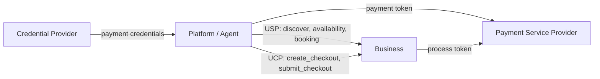
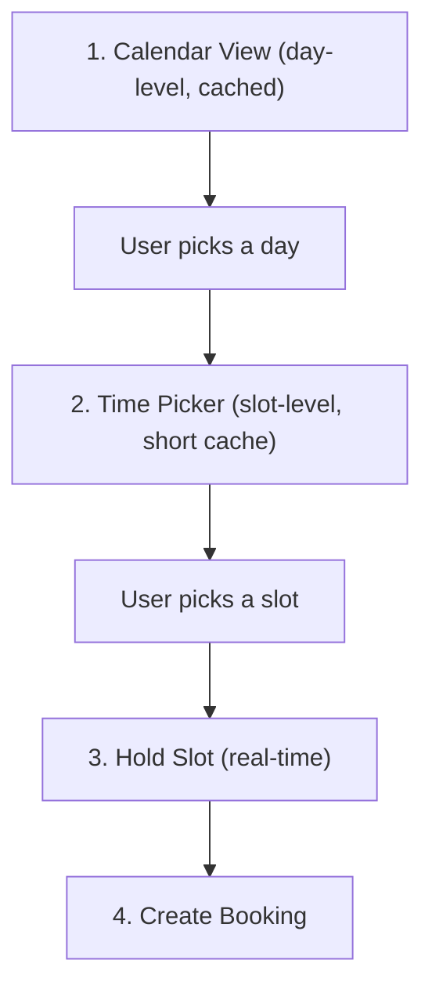
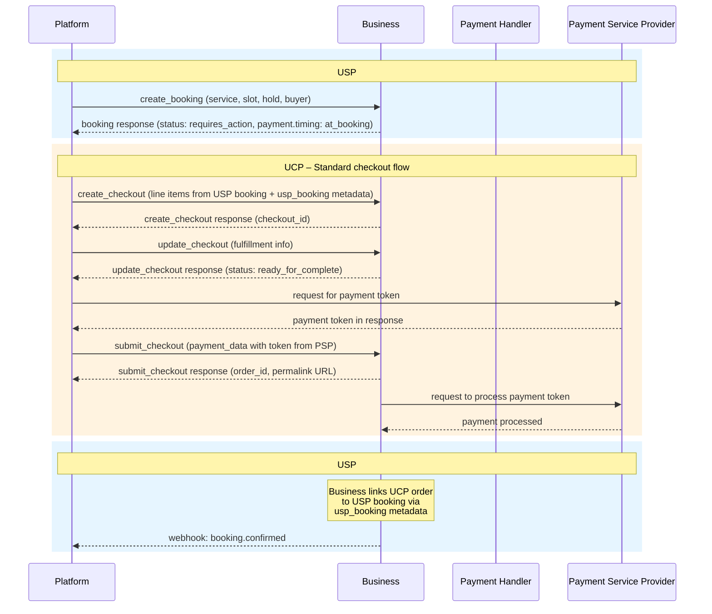
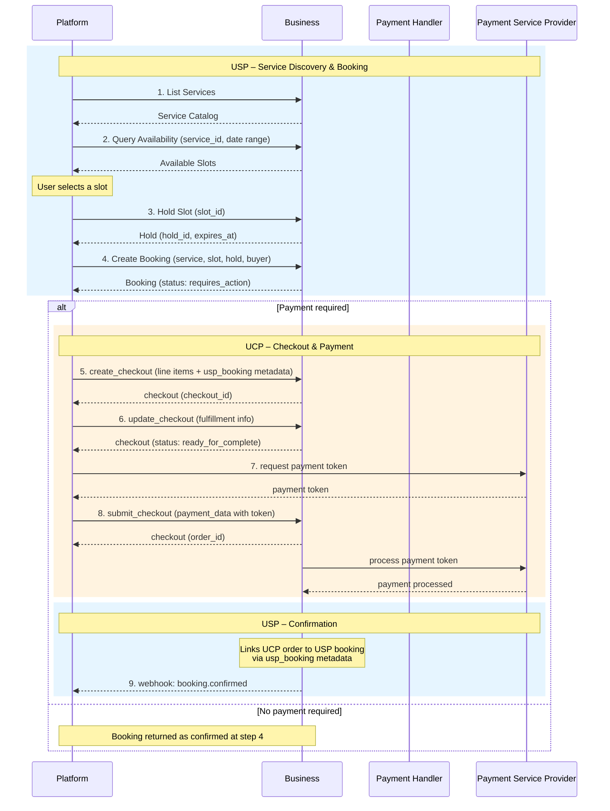

# Universal Scheduling Protocol (USP)

**Version:** `2026-02-09`

---

## 1. Introduction

The Universal Scheduling Protocol (USP) is an open standard that enables consumer platforms and AI agents to **discover**, **check availability of**, and **book** time-based services from businesses.

USP is a **companion protocol** to the [Universal Commerce Protocol (UCP)](https://ucp.dev). UCP handles product commerce -- checkout, payment, fulfillment, and order management for goods. USP addresses what UCP does not: the unique requirements of service commerce, where a specific time slot, resource, and participant count must be coordinated.

The key words **MUST**, **MUST NOT**, **REQUIRED**, **SHALL**, **SHALL NOT**, **SHOULD**, **SHOULD NOT**, **RECOMMENDED**, **MAY**, and **OPTIONAL** in this document are to be interpreted as described in [RFC 2119](https://www.rfc-editor.org/rfc/rfc2119.html).

### Conventions

- Dates: [RFC 3339](https://www.rfc-editor.org/rfc/rfc3339.html) (e.g., `2026-03-15T09:00:00-04:00`)
- Durations: [ISO 8601](https://en.wikipedia.org/wiki/ISO_8601#Durations) (e.g., `PT60M`, `PT24H`, `P90D`)
- Currency amounts: Minor units / cents (e.g., `7500` = $75.00)
- Timezones: [IANA identifiers](https://www.iana.org/time-zones) (e.g., `America/New_York`)

### Service Verticals

| Vertical | Description | Examples |
|----------|-------------|----------|
| `appointment` | 1:1 session between client and provider | Salon, dental, consulting, personal training |
| `group` | Group session with limited capacity | Yoga class, workshop, group fitness |
| `reservation` | Hold on a shared resource for a time window | Restaurant table, conference room, venue |
| `rental` | Temporary use of equipment or space | Car rental, studio space, equipment hire |

---

## 2. Core Concepts

USP enables interoperability between platforms, businesses, and payment providers for service commerce. This section introduces the key roles, architectural principles, and protocol constructs.

### Roles and Participants

USP defines interactions between four participants, mirroring UCP's role model:

#### Platform (Application / Agent)

The consumer-facing surface acting on behalf of the user. Platforms orchestrate the full journey: discovering services, presenting availability, and facilitating booking and payment.

- **Responsibilities:** Discovering business capabilities via `/.well-known/usp`, querying availability, creating bookings, orchestrating UCP checkout when payment is required.
- **Examples:** AI scheduling assistants, super apps, search engines, marketplace platforms.

#### Business

The entity offering time-based services. In USP, the business owns the schedule, resources, and booking policies. For payment, the business remains the **Merchant of Record** (same as in UCP).

- **Responsibilities:** Publishing a USP profile, exposing a service catalog, computing real-time availability, managing the booking lifecycle, processing payments via UCP/PSP.
- **Examples:** Salons, clinics, fitness studios, restaurants, rental companies, consultancies.

#### Credential Provider (CP)

A trusted entity that securely manages user payment instruments and identity. USP does not interact with credential providers directly -- this role is exercised through UCP during the checkout flow.

- **Examples:** Google Wallet, Apple Pay, digital identity providers.

#### Payment Service Provider (PSP)

The financial infrastructure that processes payments. USP delegates all payment processing to UCP, which in turn interacts with the PSP. The platform acquires a payment token from the PSP and submits it via UCP's `submit_checkout`.

- **Examples:** Stripe, Adyen, PayPal, Braintree.

### High-Level Architecture



The platform uses **USP** for the scheduling lifecycle (service catalog, availability, booking) and **UCP** for the payment lifecycle (checkout, payment). The two protocols share a common business endpoint and are linked via `usp_booking` metadata.

### Core Constructs

USP is built on three constructs, consistent with UCP's architecture:

| Construct | Description | Examples |
|-----------|-------------|----------|
| **Capabilities** | Standalone features a business supports. Each capability has a namespace, schema, and version. | `dev.usp.services.catalog`, `dev.usp.services.availability`, `dev.usp.services.booking` |
| **Extensions** | Optional modules that augment a capability via the `extends` field. | Post-booking management (extends booking), vendor-specific loyalty (extends booking) |
| **Services** | Transport layers for exchanging data. USP is transport-agnostic with specific bindings. | REST (OpenAPI 3.x), MCP (OpenRPC / JSON-RPC), A2A (Agent Card) |

### Key Goals

- **Interoperability:** A standard language for platforms, businesses, and payment providers to transact time-based services without custom integrations.
- **Discovery:** Platforms dynamically discover what services a business offers, what availability exists, and what policies apply -- all machine-readable.
- **Agentic Scheduling:** AI agents can autonomously discover, evaluate, and book services on behalf of users, with `continue_url` handoff when human interaction is required.
- **Separation of Concerns:** USP handles scheduling; UCP handles payment. Neither protocol reinvents what the other provides.
- **Real-Time Coordination:** Slot holds prevent double-booking. Availability is computed dynamically from schedules, resources, and existing bookings.

### USP vs UCP: Division of Responsibility

| Concern | USP | UCP |
|---------|-----|-----|
| Service discovery | Service catalog, categories, pricing, policies | Product catalog, inventory |
| Availability | Time slots, capacity, resource scheduling, holds | N/A |
| Booking lifecycle | Create, confirm, reschedule, cancel, no-show | N/A |
| Checkout & payment | Delegates to UCP | `create_checkout`, `update_checkout`, `submit_checkout` |
| Payment handlers | N/A (uses UCP's) | Handler definitions, token acquisition, PSP processing |
| Order management | N/A | Order lifecycle, fulfillment |
| Identity | Shared `buyer` object | Identity linking capability |

---

## 3. Discovery and Negotiation

USP follows UCP's discovery model. Businesses publish a machine-readable profile; platforms discover it and negotiate capabilities.

### Business Profile

Businesses publish their USP profile at `/.well-known/usp`:

```json
{
  "usp": {
    "version": "2026-02-09",
    "services": {
      "dev.usp.services": {
        "version": "2026-02-09",
        "spec": "https://usp.dev/specification",
        "rest": {
          "schema": "https://usp.dev/services/rest.openapi.json",
          "endpoint": "https://business.example.com/usp/v1"
        },
        "mcp": {
          "schema": "https://usp.dev/services/mcp.openrpc.json",
          "endpoint": "https://business.example.com/usp/mcp"
        }
      }
    },
    "capabilities": [
      {
        "name": "dev.usp.services.catalog",
        "version": "2026-02-09",
        "spec": "https://usp.dev/specification#4-service-catalog",
        "schema": "https://usp.dev/schemas/services/catalog.json"
      },
      {
        "name": "dev.usp.services.availability",
        "version": "2026-02-09",
        "spec": "https://usp.dev/specification#5-availability",
        "schema": "https://usp.dev/schemas/services/availability.json"
      },
      {
        "name": "dev.usp.services.booking",
        "version": "2026-02-09",
        "spec": "https://usp.dev/specification#6-booking",
        "schema": "https://usp.dev/schemas/services/booking.json"
      }
    ],
    "business": {
      "name": "Sunrise Wellness Studio",
      "timezone": "America/New_York",
      "currency": "USD"
    }
  }
}
```

A business **MAY** publish both `/.well-known/ucp` and `/.well-known/usp`. The profiles are independent.

### Namespace Governance

Capability names use reverse-domain notation, consistent with UCP:

```
{reverse-domain}.{service}.{capability}
```

The `dev.usp.*` namespace is governed by the USP body. Vendors use their own domain (e.g., `com.wix.services.courses`).

### Capability Negotiation

USP uses the same **server-selects** negotiation as UCP:

1. Platform advertises its profile URI via the `USP-Agent` header (REST) or `_meta.usp.profile` (MCP).
2. Business fetches the platform profile, computes the capability intersection, and responds using only shared capabilities.
3. Every response includes a `usp` metadata object declaring the active version and capabilities.

```json
{
  "usp": {
    "version": "2026-02-09",
    "capabilities": [
      {"name": "dev.usp.services.catalog", "version": "2026-02-09"},
      {"name": "dev.usp.services.availability", "version": "2026-02-09"},
      {"name": "dev.usp.services.booking", "version": "2026-02-09"}
    ]
  },
  ...
}
```

---

## 4. Service Catalog

**Capability:** `dev.usp.services.catalog`

The catalog enables platforms to **discover what services a business offers** -- types, pricing, policies, resources, and delivery channels.

### Catalog Caching and Indexing

Service catalog data is relatively static -- services, pricing, and policies change infrequently compared to real-time availability. Platforms and aggregators **SHOULD** cache catalog data rather than querying it on every user interaction.

**Recommended caching strategies:**

- **Merchant aggregators** (e.g., Google Merchant Center): Catalog data can be indexed by periodically crawling `/.well-known/usp` endpoints and fetching the service catalog via `List Services`. This enables pre-indexed service discovery and search across businesses without real-time API calls.
- **Web crawlers and structured data**: Businesses **MAY** additionally expose service catalog data as [schema.org/Service](https://schema.org/Service) structured data on their website, enabling search engines and discovery platforms to index services through standard web scraping. This is complementary to the API -- the structured data provides discoverability, while the USP API provides the programmatic booking flow.
- **Platform-level caching**: Platforms **SHOULD** cache catalog responses according to HTTP `Cache-Control` headers and periodically refresh to detect new or updated services. A recommended refresh interval is every 1-24 hours depending on the business vertical.

Availability and booking, by contrast, are real-time operations and **MUST NOT** be served from stale caches.

### Service Schema

| Field | Type | Required | Description |
|-------|------|----------|-------------|
| `id` | string | **Yes** | Unique service identifier |
| `name` | string | **Yes** | Display name |
| `description` | string | No | Human-readable description |
| `type` | string | **Yes** | One of: `appointment`, `group`, `reservation`, `rental` |
| `category` | object | No | `{id, name, parent_id}` -- business-defined classification |
| `duration` | Duration | **Yes** | Duration configuration (see below) |
| `pricing` | Pricing | **Yes** | Pricing model and amounts (see below) |
| `locations` | Array\[Location\] | No | Where the service is offered |
| `resources` | Array\[ResourceRequirement\] | No | Required staff, rooms, equipment |
| `channel` | object | **Yes** | `{type, virtual_provider, instructions}` -- one of: `in_person`, `virtual`, `phone`, `hybrid` |
| `policies` | ServicePolicies | **Yes** | Booking, cancellation, rescheduling policies (see below) |
| `capacity` | object | No | `{min, max, waitlist}` -- required for `group` and `reservation` types |
| `images` | Array\[object\] | No | `{url, alt, type}` -- service images |

### Duration

Either a fixed duration or a range. Buffers define non-bookable prep/cleanup time.

```json
{"fixed": "PT60M", "buffer_after": "PT15M"}
```

```json
{"range": {"min": "PT30M", "max": "PT120M", "step": "PT30M"}}
```

### Pricing

| Field | Type | Required | Description |
|-------|------|----------|-------------|
| `model` | string | **Yes** | `fixed`, `hourly`, `per_person`, `variable`, `free` |
| `amount` | integer | No | Price in minor currency units. Required unless `variable` or `free`. |
| `currency` | string | **Yes** | ISO 4217 code |
| `deposit` | object | No | `{type, value, refundable}` -- `type` is `fixed` or `percentage` |

### Service Policies

Machine-readable policies that enable agents to make informed decisions.

| Field | Type | Required | Description |
|-------|------|----------|-------------|
| `cancellation` | object | **Yes** | `{allowed, free_cancellation_until, late_cancellation_fee, no_cancellation_after}` |
| `rescheduling` | object | **Yes** | `{allowed, free_reschedule_until, max_reschedules, fee}` |
| `no_show` | object | No | `{fee, fee_percentage, grace_period}` |
| `booking_window` | object | **Yes** | `{min_advance, max_advance, slot_interval}` -- ISO 8601 durations |
| `confirmation_mode` | string | **Yes** | `auto` (instant) or `manual` (business approves) |
| `payment_timing` | string | **Yes** | `at_booking`, `at_service`, `deposit_required`, `free` |

### Resource Requirement

| Field | Type | Required | Description |
|-------|------|----------|-------------|
| `type` | string | **Yes** | `staff`, `room`, `equipment`, `other` |
| `name` | string | No | Display name (e.g., "Stylist") |
| `selectable` | boolean | No | Whether the buyer can choose a specific resource |
| `options` | Array\[Resource\] | No | `{id, name, description, image_url}` -- available when `selectable` is `true` |

### Operations

**List Services** -- `POST /services/list`

```json
{
  "filters": {"type": "appointment", "category_id": "beauty"},
  "pagination": {"limit": 20, "cursor": null}
}
```

**Get Service** -- `GET /services/{service_id}`

### Example Response

```json
{
  "usp": {
    "version": "2026-02-09",
    "capabilities": [{"name": "dev.usp.services.catalog", "version": "2026-02-09"}]
  },
  "services": [
    {
      "id": "svc_haircut_001",
      "name": "Women's Haircut & Style",
      "type": "appointment",
      "duration": {"fixed": "PT60M", "buffer_after": "PT15M"},
      "pricing": {"model": "fixed", "amount": 7500, "currency": "USD"},
      "channel": {"type": "in_person"},
      "resources": [
        {
          "type": "staff",
          "name": "Stylist",
          "selectable": true,
          "options": [
            {"id": "staff_jane", "name": "Jane Smith"},
            {"id": "staff_alex", "name": "Alex Johnson"}
          ]
        }
      ],
      "policies": {
        "cancellation": {"allowed": true, "free_cancellation_until": "PT24H", "late_cancellation_fee": 2500},
        "rescheduling": {"allowed": true, "free_reschedule_until": "PT24H", "max_reschedules": 2},
        "no_show": {"fee_percentage": 100, "grace_period": "PT15M"},
        "booking_window": {"min_advance": "PT2H", "max_advance": "P60D", "slot_interval": "PT30M"},
        "confirmation_mode": "auto",
        "payment_timing": "at_service"
      }
    }
  ],
  "pagination": {"cursor": null, "has_more": false}
}
```

---

## 5. Availability

**Capability:** `dev.usp.services.availability`

The availability capability lets platforms **query when services are available** and **hold slots** to prevent double-booking during the booking flow.

### Time Slot

| Field | Type | Required | Description |
|-------|------|----------|-------------|
| `id` | string | **Yes** | Unique slot identifier (opaque) |
| `service_id` | string | **Yes** | The service this slot belongs to |
| `start` | string | **Yes** | RFC 3339 start time |
| `end` | string | **Yes** | RFC 3339 end time |
| `duration` | string | **Yes** | ISO 8601 duration |
| `state` | string | **Yes** | `available`, `limited` (low capacity), or `waitlist` |
| `capacity` | object | No | `{total, remaining, held}` -- present for `group` and `reservation` |
| `resources` | Array\[object\] | No | `{id, type, name}` -- available resources for this slot |
| `location` | object | No | `{id, name}` -- slot-specific location |
| `pricing` | object | No | `{amount, currency, label}` -- overrides service pricing (e.g., peak hours) |

### Hold

| Field | Type | Required | Description |
|-------|------|----------|-------------|
| `id` | string | **Yes** | Unique hold identifier |
| `slot_id` | string | **Yes** | The held slot |
| `service_id` | string | **Yes** | The service |
| `spots` | integer | No | Number of spots held. Default: 1. |
| `expires_at` | string | **Yes** | RFC 3339 expiration time |
| `status` | string | **Yes** | `active`, `expired`, `released`, `converted` |

### Operations

**Query Availability** -- `POST /availability/query`

The `granularity` parameter controls the level of detail returned:

| Field | Type | Required | Description |
|-------|------|----------|-------------|
| `service_id` | string | **Yes** | The service to query |
| `start_date` | string | **Yes** | Start of range (RFC 3339 date or datetime) |
| `end_date` | string | **Yes** | End of range (RFC 3339 date or datetime) |
| `granularity` | string | No | `slot` (default) or `day`. See Availability Granularity below. |
| `timezone` | string | No | IANA timezone. Defaults to business timezone. |
| `resource_id` | string | No | Preferred resource (e.g., specific staff member) |
| `party_size` | integer | No | Number of participants. Default: 1. |

#### Granularity: `slot` (default)

Returns full time slot objects. Use for displaying bookable times when the user has selected a specific day or narrow date range.

```json
{
  "service_id": "svc_haircut_001",
  "start_date": "2026-03-15",
  "end_date": "2026-03-16",
  "granularity": "slot",
  "timezone": "America/New_York",
  "resource_id": "staff_jane"
}
```

Response:

```json
{
  "usp": {
    "version": "2026-02-09",
    "capabilities": [{"name": "dev.usp.services.availability", "version": "2026-02-09"}]
  },
  "service_id": "svc_haircut_001",
  "granularity": "slot",
  "slots": [
    {
      "id": "slot_20260315_0900",
      "service_id": "svc_haircut_001",
      "start": "2026-03-15T09:00:00-04:00",
      "end": "2026-03-15T10:00:00-04:00",
      "duration": "PT60M",
      "state": "available",
      "resources": [{"id": "staff_jane", "type": "staff", "name": "Jane Smith"}],
      "location": {"id": "loc_main", "name": "Downtown Studio"}
    },
    {
      "id": "slot_20260315_1030",
      "service_id": "svc_haircut_001",
      "start": "2026-03-15T10:30:00-04:00",
      "end": "2026-03-15T11:30:00-04:00",
      "duration": "PT60M",
      "state": "available",
      "resources": [{"id": "staff_jane", "type": "staff", "name": "Jane Smith"}],
      "location": {"id": "loc_main", "name": "Downtown Studio"}
    }
  ],
  "opening_hours": [
    {"day_of_week": ["monday", "tuesday", "wednesday", "thursday", "friday"], "opens": "09:00", "closes": "18:00"},
    {"day_of_week": ["saturday"], "opens": "10:00", "closes": "16:00"}
  ],
  "pagination": {"cursor": null, "has_more": false}
}
```

#### Granularity: `day`

Returns a lightweight day-level summary: whether each day has any availability, and optionally how much. Designed for calendar views and caching over wider date ranges.

```json
{
  "service_id": "svc_haircut_001",
  "start_date": "2026-03-15",
  "end_date": "2026-03-28",
  "granularity": "day",
  "timezone": "America/New_York"
}
```

Response:

```json
{
  "usp": {
    "version": "2026-02-09",
    "capabilities": [{"name": "dev.usp.services.availability", "version": "2026-02-09"}]
  },
  "service_id": "svc_haircut_001",
  "granularity": "day",
  "days": [
    {"date": "2026-03-15", "available": true,  "slots_remaining": 8},
    {"date": "2026-03-16", "available": true,  "slots_remaining": 12},
    {"date": "2026-03-17", "available": false, "slots_remaining": 0},
    {"date": "2026-03-18", "available": true,  "slots_remaining": 3},
    {"date": "2026-03-19", "available": true,  "slots_remaining": 15},
    {"date": "2026-03-20", "available": true,  "slots_remaining": 14},
    {"date": "2026-03-21", "available": false, "slots_remaining": 0},
    {"date": "2026-03-22", "available": true,  "slots_remaining": 10},
    {"date": "2026-03-23", "available": true,  "slots_remaining": 6},
    {"date": "2026-03-24", "available": true,  "slots_remaining": 16},
    {"date": "2026-03-25", "available": true,  "slots_remaining": 16},
    {"date": "2026-03-26", "available": true,  "slots_remaining": 15},
    {"date": "2026-03-27", "available": true,  "slots_remaining": 16},
    {"date": "2026-03-28", "available": false, "slots_remaining": 0}
  ]
}
```

**Day Summary:**

| Field | Type | Required | Description |
|-------|------|----------|-------------|
| `date` | string | **Yes** | Date in `YYYY-MM-DD` format |
| `available` | boolean | **Yes** | Whether at least one slot is available on this day |
| `slots_remaining` | integer | No | Approximate number of available slots. Helps platforms display "limited" indicators without fetching full slots. |

### Caching Strategy

Availability data has an inverse relationship between freshness and usefulness: near-term slots are the most actionable but change the fastest, while far-out days are stable but less immediately useful. Platforms **SHOULD** use a tiered caching strategy:

| Tier | Granularity | Date Range | Recommended TTL | Use Case |
|------|-------------|------------|-----------------|----------|
| **Browse** | `day` | Next 2-4 weeks | 5-15 minutes | Calendar view: "which days have openings?" |
| **Select** | `slot` | 1-2 specific days | 30-60 seconds | Time picker: "what times are available on Tuesday?" |
| **Commit** | Hold | Single slot | Real-time (no cache) | Slot hold before booking. Always live. |

This creates a natural funnel that balances user experience with data freshness:



**Why this works:**

- **Day-level data is cheap and stable.** A day goes from "available" to "unavailable" only when the *last* slot is booked -- a rare event for days further out. For a service with 16 slots per day, the day-level answer remains "yes" even after 15 bookings. Caching this at 5-15 minute TTL is safe.
- **Slot-level data is expensive but scoped.** The platform only fetches full slots for 1-2 days the user actually drills into, not the entire booking window. A 30-60 second TTL avoids hammering the API on every scroll while keeping data reasonably fresh.
- **Holds are the safety net.** Even with slightly stale slot data, the hold operation is always real-time. If a displayed slot has been booked since the cache was populated, the hold fails with `slot_unavailable` and the platform re-queries. No false bookings.

> **Note:** The data volume difference is significant. For a business with 5 appointment services, 15-minute intervals across 8 working hours, and a 14-day booking window: slot-level returns ~2,240 objects; day-level returns ~70. That's a **97% reduction** in payload size, API load, and cache storage.

Businesses **MUST** support `granularity: slot`. Support for `granularity: day` is **RECOMMENDED**. If a business does not support day-level queries, it **MUST** return an error with code `granularity_unsupported`, and the platform **SHOULD** fall back to slot-level queries over narrower date ranges.

### Hold and Release Operations

**Hold Slot** -- `POST /availability/holds`

```json
{"slot_id": "slot_20260315_0900", "service_id": "svc_haircut_001", "spots": 1}
```

Returns a Hold with `expires_at` (recommended TTL: 5-10 minutes).

**Release Slot** -- `DELETE /availability/holds/{hold_id}`

---

## 6. Booking

**Capability:** `dev.usp.services.booking`

The booking capability defines the **lifecycle of a service booking** from creation through completion.

### Booking Status Lifecycle

```
  pending ──────► confirmed ──────► in_progress ──────► completed
    │                │                    │
    │                │                    └──────────► no_show
    │                │
    ▼                ▼
  requires_action   canceled
    │
    ▼ (resolved)
  confirmed
```

| Status | Description |
|--------|-------------|
| `pending` | Awaiting confirmation. Transient for `auto` mode. |
| `requires_action` | Buyer input needed (payment, intake form). Inspect `messages`, use `continue_url`. |
| `confirmed` | Booking confirmed. Service will proceed at scheduled time. |
| `in_progress` | Service is currently being delivered. |
| `completed` | Service delivered. Terminal. |
| `no_show` | Client did not attend. Terminal. |
| `canceled` | Booking canceled (from `pending`, `requires_action`, or `confirmed`). Terminal. |

### Booking Schema

| Field | Type | Required | Description |
|-------|------|----------|-------------|
| `id` | string | **Yes** | Unique booking identifier |
| `service_id` | string | **Yes** | The booked service |
| `service_name` | string | **Yes** | Service display name (snapshot at booking time) |
| `slot` | object | **Yes** | `{id, start, end, duration}` -- booked time slot |
| `buyer` | Buyer | **Yes** | `{first_name, last_name, email, phone_number}` |
| `party_size` | integer | **Yes** | Total attendees |
| `resources` | Array\[object\] | No | `{id, type, name}` -- assigned resources |
| `location` | object | No | `{id, name}` |
| `status` | string | **Yes** | See lifecycle above |
| `confirmation_mode` | string | **Yes** | `auto` or `manual` |
| `payment` | BookingPayment | No | Payment state (see section 6) |
| `messages` | Array\[Message\] | No | `{type, code, message, severity}` -- errors/warnings |
| `continue_url` | string | No | Business UI handoff URL. **MUST** be provided when `status` is `requires_action`. |
| `notes` | string | No | Buyer-provided special requests |
| `cancellation` | object | No | `{reason, canceled_by, fee, refund_amount, canceled_at}` -- present when canceled |
| `created_at` | string | **Yes** | RFC 3339 |
| `updated_at` | string | **Yes** | RFC 3339 |
| `expires_at` | string | No | RFC 3339 expiry for pending bookings |

### Operations

**Create Booking** -- `POST /bookings`

```json
{
  "service_id": "svc_haircut_001",
  "slot_id": "slot_20260315_0900",
  "hold_id": "hold_abc123",
  "buyer": {
    "first_name": "Alice",
    "last_name": "Williams",
    "email": "alice@example.com",
    "phone_number": "+12125551234"
  },
  "party_size": 1,
  "resource_id": "staff_jane",
  "notes": "First time visit"
}
```

**Get Booking** -- `GET /bookings/{booking_id}`

**Update Booking** -- `PUT /bookings/{booking_id}` (mutable fields: buyer, intake_responses, notes)

**Confirm Booking** -- `POST /bookings/{booking_id}/confirm` (business-initiated, for `manual` mode)

**Cancel Booking** -- `POST /bookings/{booking_id}/cancel`

```json
{"reason": "Schedule conflict", "canceled_by": "buyer"}
```

**Reschedule Booking** -- `POST /bookings/{booking_id}/reschedule`

```json
{"new_slot_id": "slot_20260316_0900", "reason": "Scheduling conflict"}
```

### Webhooks

Businesses **SHOULD** notify platforms of state changes:

| Event | Trigger |
|-------|---------|
| `booking.confirmed` | Business confirms (manual mode) |
| `booking.canceled` | Business or system cancels |
| `booking.rescheduled` | Business reschedules |
| `booking.reminder` | Upcoming appointment |
| `booking.completed` | Service delivered |
| `booking.no_show` | Client absent |

---

## 7. Payment Integration with UCP

USP defines **when** payment is required but delegates **how** to UCP's payment architecture. This section defines the bridge between the two protocols.

### Booking Payment

USP defines the payment state within the booking. Payment handlers and token acquisition are handled entirely by UCP -- the platform creates a UCP checkout session when `status` is `pending`.

| Field | Type | Required | Description |
|-------|------|----------|-------------|
| `status` | string | **Yes** | `not_required`, `pending`, `deposit_paid`, `paid`, `refunded`, `partially_refunded` |
| `timing` | string | **Yes** | `at_booking`, `at_service`, `deposit_required`, `free` |
| `amount` | integer | **Yes** | Total service amount in minor units |
| `currency` | string | **Yes** | ISO 4217 |
| `amount_due` | integer | **Yes** | Amount due now (full amount, deposit amount, or 0) |
| `deposit_amount` | integer | No | Deposit amount when `timing` is `deposit_required` |
| `payment_url` | string | No | Fallback URL for businesses without UCP integration |

### How USP Connects to the UCP Checkout Flow


USP handles service discovery, availability, and booking creation. When payment is needed, the platform orchestrates UCP checkout as a separate step -- it creates the checkout, completes the standard UCP payment flow, and the business links the completed order back to the USP booking. Each protocol handles what it's designed for: USP for scheduling, UCP for payment.

This requires the business to publish both `/.well-known/usp` and `/.well-known/ucp`.



**Steps:**

1. **[USP] Platform calls `create_booking`.** The platform sends a USP booking request with the service, slot, hold, and buyer information. The business returns the booking with `status: requires_action` and `payment.timing: at_booking` (or `deposit_required`), indicating that payment must be completed before the booking can be confirmed.

2. **[UCP] Platform calls `create_checkout`.** The platform creates a UCP checkout session on the business's UCP endpoint (`/.well-known/ucp`). The platform maps the USP booking to UCP line items (see Line Item Mapping below) and includes `usp_booking` metadata so the business can link this checkout back to the USP booking. The business validates the line items, applies taxes/discounts, and returns the checkout session with a `checkout_id`.

3. **[UCP] Platform calls `update_checkout`.** The platform sends any additional fulfillment information (e.g., selection ID). The business returns the checkout object with `status: ready_for_complete`.

4. **[UCP] Platform requests a payment token from the Payment Service Provider.** Using the payment handler configuration from the UCP checkout response, the platform requests a payment token directly from the PSP. The PSP returns an opaque token.

5. **[UCP] Platform calls `submit_checkout`.** The platform sends the `submit_checkout` request to the business's UCP endpoint with `payment_data` containing the token from the PSP and any additional risk signals. The business returns the full checkout object with a populated `order_id` and permalink URL.

6. **[UCP] Business processes the payment token with the PSP (server-side).** The business sends the token to the Payment Service Provider for processing. The PSP charges the buyer and confirms the payment. This step is invisible to the platform.

7. **[USP] Business links the UCP order to the USP booking.** The business matches the `usp_booking.booking_id` metadata from the completed UCP checkout back to the original USP booking and transitions it from `requires_action` to `confirmed`.

8. **[USP] Platform receives `booking.confirmed` webhook.** The business sends a USP webhook notification to the platform's configured webhook URL. Alternatively, the platform can poll `GET /bookings/{booking_id}` to observe the status change.

> **Note:** For businesses without programmatic payment support (no UCP integration), the USP booking response **MAY** include a `payment_url` or `continue_url` instead. In this fallback scenario, the buyer is redirected to the business's own payment page and the platform is notified via USP webhook when payment completes. No UCP involvement.

### Line Item Mapping (USP → UCP)

When the platform creates a UCP checkout for a USP booking, the service is mapped to UCP line items:

| UCP Field | USP Source |
|-----------|-----------|
| `item.id` | `booking.service_id` |
| `item.title` | `booking.service_name` |
| `item.price` | `booking.payment.amount / booking.party_size` |
| `quantity` | `booking.party_size` |

> **Note:** The `item.id` uses the `service_id` (not the `booking_id`) because it serves the same role as a product SKU in standard UCP commerce -- it identifies *what* is being purchased from the catalog. The booking-specific context (which time slot, which booking instance) is carried in the `usp_booking` metadata below. The business uses `usp_booking.booking_id` -- not `item.id` -- to link a completed checkout back to the USP booking.

The `create_checkout` request **MUST** include `usp_booking` metadata so the business can link completion back to the USP booking:

```json
{
  "line_items": [
    {"item": {"id": "svc_massage_001", "title": "Deep Tissue Massage", "price": 12000}, "quantity": 1}
  ],
  "currency": "USD",
  "usp_booking": {
    "booking_id": "bkg_456def",
    "slot": {"start": "2026-03-16T14:00:00-04:00", "end": "2026-03-16T15:00:00-04:00"},
    "service_type": "appointment"
  }
}
```

### Deposit and Refund Rules

| Scenario | `amount_due` | Behavior |
|----------|-------------|----------|
| `at_booking` | Full amount | Payment must complete before booking confirms |
| `deposit_required` | Deposit amount | Deposit collected now; remainder at service time |
| `at_service` | 0 | No upfront payment; collected in person |
| Cancellation (free window) | -- | Full refund of collected amount |
| Cancellation (late) | -- | Refund = collected - cancellation fee |
| Business-initiated cancel | -- | Full refund. No fees. |

---

## 8. End-to-End Flow

The complete booking journey across USP and UCP:



### Example: Booking a Massage with Deposit

**[USP] Step 1** -- Discover services via `POST /services/list`. Find "Deep Tissue Massage - 60 min" at $120, requires 50% deposit.

**[USP] Step 2** -- Query availability via `POST /availability/query` for March 16. Get slot at 2:00 PM.

**[USP] Step 3** -- Hold the slot via `POST /availability/holds`.

**[USP] Step 4** -- Create booking via `POST /bookings`:

```json
{
  "service_id": "svc_massage_001",
  "slot_id": "slot_20260316_1400",
  "hold_id": "hold_xyz789",
  "buyer": {"first_name": "Alice", "last_name": "Williams", "email": "alice@example.com"},
  "party_size": 1
}
```

Response (requires payment):

```json
{
  "usp": {"version": "2026-02-09", "capabilities": [{"name": "dev.usp.services.booking", "version": "2026-02-09"}]},
  "id": "bkg_456def",
  "service_id": "svc_massage_001",
  "service_name": "Deep Tissue Massage - 60 min",
  "slot": {"id": "slot_20260316_1400", "start": "2026-03-16T14:00:00-04:00", "end": "2026-03-16T15:00:00-04:00", "duration": "PT60M"},
  "buyer": {"first_name": "Alice", "last_name": "Williams", "email": "alice@example.com"},
  "party_size": 1,
  "status": "requires_action",
  "confirmation_mode": "auto",
  "messages": [{"type": "error", "code": "payment_required", "message": "A 50% deposit ($60.00) is required.", "severity": "requires_buyer_input"}],
  "payment": {
    "status": "pending",
    "timing": "deposit_required",
    "amount": 12000,
    "currency": "USD",
    "amount_due": 6000,
    "deposit_amount": 6000
  },
  "continue_url": "https://business.example.com/bookings/bkg_456def/pay",
  "expires_at": "2026-03-15T22:05:00Z",
  "created_at": "2026-03-14T22:05:00Z",
  "updated_at": "2026-03-14T22:05:00Z"
}
```

**[UCP] Step 5** -- Platform creates a UCP checkout on the business's UCP endpoint via `create_checkout`, mapping the USP booking to a line item:

```json
{
  "line_items": [
    {"item": {"id": "svc_massage_001", "title": "Deep Tissue Massage - 60 min", "price": 6000}, "quantity": 1}
  ],
  "currency": "USD",
  "buyer": {"email": "alice@example.com"},
  "usp_booking": {
    "booking_id": "bkg_456def",
    "slot": {"start": "2026-03-16T14:00:00-04:00", "end": "2026-03-16T15:00:00-04:00"},
    "service_type": "appointment"
  }
}
```

Note: the `item.price` is `6000` (the deposit amount), not the full `12000`, because `payment.amount_due` is `6000`.

**[UCP] Step 6** -- Platform calls `update_checkout` with any fulfillment details. Business returns checkout with `status: ready_for_complete`.

**[UCP] Step 7** -- Platform requests a payment token from the PSP using the handler config from the checkout response.

**[UCP] Step 8** -- Platform calls `submit_checkout` with the payment token. Business processes payment with PSP. Checkout completes with `order_id`.

**[USP] Step 9** -- Business links the UCP order to booking `bkg_456def` via `usp_booking` metadata. Booking transitions to `confirmed` with `payment.status: deposit_paid`. Platform receives webhook.

---

## 9. Security

- All endpoints **MUST** use HTTPS (TLS 1.2+).
- Businesses **SHOULD** implement rate limiting and return `429` with `Retry-After`.
- Webhook payloads **SHOULD** be signed via JWS using keys published in the business profile.
- Hold abuse prevention: max concurrent holds per buyer, short TTLs (5-10 min), backoff for repeated hold-and-release.

---

## 10. Operation Reference

| Operation | Method | Path | Capability |
|-----------|--------|------|------------|
| List Services | `POST` | `/services/list` | catalog |
| Get Service | `GET` | `/services/{service_id}` | catalog |
| Query Availability | `POST` | `/availability/query` | availability |
| Hold Slot | `POST` | `/availability/holds` | availability |
| Release Slot | `DELETE` | `/availability/holds/{hold_id}` | availability |
| Create Booking | `POST` | `/bookings` | booking |
| Get Booking | `GET` | `/bookings/{booking_id}` | booking |
| Update Booking | `PUT` | `/bookings/{booking_id}` | booking |
| Confirm Booking | `POST` | `/bookings/{booking_id}/confirm` | booking |
| Cancel Booking | `POST` | `/bookings/{booking_id}/cancel` | booking |
| Reschedule Booking | `POST` | `/bookings/{booking_id}/reschedule` | booking |

Payment operations (`create_checkout`, `update_checkout`, `submit_checkout`) are handled by UCP. See [Section 7](#7-payment-integration-with-ucp).
