# Universal Scheduling Protocol (USP)

**Version:** `2026-02-21`

**Status:** Draft

---

## Abstract

The Universal Scheduling Protocol (USP) is an open standard that enables
consumer platforms and AI agents to discover, check availability of, and book
time-based services from businesses. USP supports both **paid** and **free**
agentic scheduling through two deployment modes.

USP defines three core capabilities - service catalog, availability, and
booking - along with optional extensions for waitlist management. It supports
REST, MCP, A2A, and ESP transport bindings and references IETF standards
directly for cross-cutting concerns (security, authorization, error format,
idempotency, webhook verification).

USP offers two deployment modes: **UCP-Native Mode** for platforms that already
support the [Universal Commerce Protocol (UCP)][UCP], where scheduling
capabilities register directly in the UCP profile and paid bookings use atomic
checkout; and **Standalone Mode** for platforms that want a self-contained
scheduling protocol with generic payment handoff. Both modes share the same
domain core (service catalog, availability, booking lifecycle) and the same
transport bindings. The mode determines only how profile discovery, payment, and
infrastructure are handled.

## Status of This Memo

This document specifies a Draft protocol for the Internet community and requests
discussion and suggestions for improvements. Distribution of this memo is
unlimited.

This is a draft specification. It is published for examination, experimental
implementation, and evaluation. It is not yet an Internet Standard.

## Copyright Notice

Copyright (c) 2026 USP Authors. This specification is released under
the [Apache License, Version 2.0](https://www.apache.org/licenses/LICENSE-2.0).

---

## Table of Contents

**PART I: DOMAIN CORE**

- [1. Introduction](#1-introduction)
    - [1.1 Conventions](#11-conventions)
    - [1.2 Terminology](#12-terminology)
    - [1.3 Service Verticals](#13-service-verticals)
    - [1.4 Relationship to Other Standards](#14-relationship-to-other-standards)
    - [1.5 Deployment Modes](#15-deployment-modes)
- [2. Core Concepts](#2-core-concepts)
    - [2.1 Roles and Participants](#21-roles-and-participants)
    - [2.2 Commerce and Non-Commerce Services](#22-commerce-and-non-commerce-services)
    - [2.3 High-Level Architecture](#23-high-level-architecture)
    - [2.4 Core Constructs](#24-core-constructs)
    - [2.5 Namespace Governance](#25-namespace-governance)
    - [2.6 Multi-Location Businesses](#26-multi-location-businesses)
    - [2.7 Error Handling Overview](#27-error-handling-overview)
- [3. Service Catalog](#3-service-catalog)
    - [3.1 Service Catalog Feed](#31-service-catalog-feed)
    - [3.2 Catalog Caching and Indexing](#32-catalog-caching-and-indexing)
    - [3.3 Service Schema](#33-service-schema)
    - [3.4 Business ID and Cross-Business Discovery](#34-business-id-and-cross-business-discovery)
    - [3.5 Localization](#35-localization)
    - [3.6 Availability Hint](#36-availability-hint)
    - [3.7 Duration](#37-duration)
    - [3.8 Pricing](#38-pricing)
    - [3.9 Service Policies](#39-service-policies)
    - [3.10 Resource Requirement](#310-resource-requirement)
    - [3.11 Validation Rules](#311-validation-rules)
    - [3.12 Operations](#312-operations)
- [4. Availability](#4-availability)
    - [4.1 Time Slot](#41-time-slot)
    - [4.2 Hold](#42-hold)
    - [4.3 Operations](#43-operations)
    - [4.4 Caching Strategy](#44-caching-strategy)
- [5. Booking Lifecycle](#5-booking-lifecycle)
    - [5.1 Booking Status Lifecycle](#51-booking-status-lifecycle)
    - [5.2 Booking Schema](#52-booking-schema)
    - [5.3 Operations](#53-operations)
    - [5.4 Webhooks](#54-webhooks)
    - [5.5 Post-Booking Lifecycle](#55-post-booking-lifecycle)
- [6. Discovery Registry (Optional)](#6-discovery-registry-optional)
    - [6.1 Business Registration](#61-business-registration---post-registrybusinesses)
    - [6.2 Business Search](#62-business-search---post-registrysearch_business)
    - [6.3 Service Search](#63-service-search---post-registrysearch_services)
    - [6.3.1 Filter Matching Semantics](#631-filter-matching-semantics)
    - [6.4 Get Registration](#64-get-registration---get-registrybusinessesid)
    - [6.5 Update Registration](#65-update-registration---put-registrybusinessesid)
    - [6.6 Delete Registration](#66-delete-registration---delete-registrybusinessesid)
    - [6.7 Registry Governance](#67-registry-governance)

**PART II: DEPLOYMENT MODES**

- [7. UCP-Native Mode](#7-ucp-native-mode)
    - [7.1 Overview and When to Use](#71-overview-and-when-to-use)
    - [7.2 Profile Registration in /.well-known/ucp](#72-profile-registration-in-well-knownucp)
    - [7.3 Inherited Infrastructure](#73-inherited-infrastructure)
    - [7.4 Paid Bookings Extension Schema](#74-paid-bookings-extension-schema)
    - [7.5 Checkout Flow and Atomicity Guarantee](#75-checkout-flow-and-atomicity-guarantee)
    - [7.6 Free Services in UCP-Native Mode](#76-free-services-in-ucp-native-mode)
    - [7.7 End-to-End Flows](#77-end-to-end-flows)
- [8. Standalone Mode](#8-standalone-mode)
    - [8.1 Overview and When to Use](#81-overview-and-when-to-use)
    - [8.2 Business Profile (/.well-known/usp)](#82-business-profile-well-knownusp)
        - [8.2.1 Business Profile Fields](#821-business-profile-fields)
        - [8.2.2 Profile Hosting Requirements](#822-profile-hosting-requirements)
        - [8.2.3 Platform Profile](#823-platform-profile)
        - [8.2.4 Backward Compatibility](#824-backward-compatibility)
    - [8.3 Capability Negotiation](#83-capability-negotiation)
    - [8.4 Versioning](#84-versioning)
    - [8.5 Payment Integration](#85-payment-integration)
    - [8.6 End-to-End Flows](#86-end-to-end-flows)
    - [8.7 Payment Path Comparison](#87-payment-path-comparison)

**PART III: SHARED INFRASTRUCTURE**

- [9. Transport Bindings](#9-transport-bindings)
    - [9.1 REST Binding](#91-rest-binding)
        - [9.1.1 Idempotency](#911-idempotency)
        - [9.1.2 Pagination](#912-pagination)
        - [9.1.3 Discovery](#913-discovery)
        - [9.1.4 Request Signing](#914-request-signing)
        - [9.1.5 REST Binding Conformance](#915-rest-binding-conformance)
    - [9.2 MCP Binding](#92-mcp-binding)
        - [9.2.1 Method Mapping](#921-method-mapping)
        - [9.2.2 Request/Response Format](#922-requestresponse-format)
        - [9.2.3 Webhook Notifications](#923-webhook-notifications)
        - [9.2.4 MCP Binding Conformance](#924-mcp-binding-conformance)
    - [9.3 A2A Binding](#93-a2a-binding)
        - [9.3.1 Task-Type Mapping](#931-task-type-mapping)
        - [9.3.2 End-to-End Example: Booking Flow via A2A](#932-end-to-end-example-booking-flow-via-a2a)
        - [9.3.3 Agent Card](#933-agent-card)
        - [9.3.4 DataPart Conventions](#934-datapart-conventions)
        - [9.3.5 Session Management](#935-session-management)
        - [9.3.6 A2A Binding Conformance](#936-a2a-binding-conformance)
    - [9.4 Error Code Mapping](#94-error-code-mapping)
    - [9.5 Embedded Scheduling Protocol (ESP)](#95-embedded-scheduling-protocol-esp)
        - [9.5.1 Message Schemas](#951-message-schemas)
        - [9.5.2 Delegation Negotiation](#952-delegation-negotiation)
        - [9.5.3 Iframe Security](#953-iframe-security)
        - [9.5.4 Example Flow](#954-example-flow)
        - [9.5.5 Error Handling and Timeouts](#955-error-handling-and-timeouts)
        - [9.5.6 ESP Conformance](#956-esp-conformance)
    - [9.6 Transport Infrastructure for Standalone Mode](#96-transport-infrastructure-for-standalone-mode)
- [10. Security](#10-security)
    - [10.1 USP Security Requirements](#101-usp-security-requirements)
    - [10.2 Security Infrastructure for Standalone Mode](#102-security-infrastructure-for-standalone-mode)

**PART IV: EXTENSIONS**

- [11. Extensions](#11-extensions)
    - [11.1 Waitlist Extension](#111-waitlist-extension)

**PART V: APPENDICES**

- [12. Operation Reference](#12-operation-reference)
- [13. IANA Considerations](#13-iana-considerations)
- [14. References](#14-references)
    - [14.1 Normative References](#141-normative-references)
    - [14.2 Informative References](#142-informative-references)
- [Appendix A. Future Vertical Considerations (Informative)](#appendix-a-future-vertical-considerations-informative)
- [Authors' Addresses](#authors-addresses)

---

## 1. Introduction

The Universal Scheduling Protocol (USP) is an open standard that enables
consumer platforms and AI agents to **discover**, **check availability of**, and
**book** time-based services from businesses, covering appointments, group
sessions, reservations, and rentals across any commerce-enabled vertical.

**The problem.** Today's scheduling landscape is fragmented. iCalendar
([RFC 5545]) and CalDAV Scheduling ([RFC 6638]) handle calendar data
sharing within organizations. [OpenActive](https://openactive.io/open-booking-api/EditorsDraft/1.0CR3/) covers activity bookings for physical
sports. [schema.org/Service](https://schema.org/Service) models services for search engine indexing. None of them
provide a complete, interoperable path from catalog discovery through booking
and payment that works *across* organizations and commerce protocols. The gaps
are consistent:

- **Catalog discovery**: no standard way for a platform to ask what services a business offers, what their pricing and policies are, and when they are roughly available for scheduling.
- **Real-time availability**: no standard slot query API that returns specific bookable windows with assigned resources, capacity state, and hold support.
- **Booking lifecycle**: no unified create/confirm/reschedule/cancel model with webhooks and idempotency guarantees that works across platforms.
- **Payment coordination**: no flexible handoff model that works whether payment is free, redirect-based, or handled by an atomic commerce protocol.
- **Buyer context**: no mechanism for passing the buyer's own calendar commitments so that only non-conflicting slots are surfaced.

USP closes all five gaps in a single, cohesive protocol.

**Designed for agentic scheduling.** A growing share of scheduling interactions
are initiated and orchestrated by AI agents acting autonomously on behalf of
buyers, rather than humans clicking through UIs. USP is built from the ground up
for this model. Several features exist specifically to make agents effective:

*Availability hints* ([Section 3.6](#36-availability-hint)). Before issuing a
real-time slot query, an agent needs to know *when* it is productive to ask.
Each service carries an `availability_hint`, a machine-readable signal with the
next likely available window, a schedule pattern, and a staleness TTL. Agents
use this to skip empty date ranges and query only windows that are likely to
contain open slots, avoiding wasted API calls on dead periods.

*Buyer free/busy* ([Section 11.2](#112-buyer-calendar-freebusy-extension)). When
a platform knows the buyer's existing calendar commitments, it can pass them as a
`BuyerFreeBusy` object, a merged, anonymized list of opaque busy blocks across
calendar providers. The business pre-filters its availability response to exclude
slots that conflict with the buyer's schedule, so the agent only presents times
that actually work for the buyer.

*Slot-per-resource model* ([Section 4.1](#41-time-slot)). A slot returned from
an availability query is a fully self-contained booking token: it encodes both
the time window *and* the assigned resource (for example, a specific stylist or room).
If three stylists are free at 3 pm, the business returns three separate slots,
one per stylist. Picking a slot picks both the time and the resource in a single
step, eliminating the race condition between resource selection and booking
creation.

*Checkout modes* ([Section 7](#7-ucp-native-mode), [Section 8](#8-standalone-mode)).
USP does not prescribe a payment system. It defines two deployment paths.
**UCP-Native Mode** is for platforms that already use the Universal Commerce
Protocol: scheduling capabilities register directly in the UCP profile and
payment is handled atomically by UCP's checkout. **Standalone Mode** is for
self-contained deployments: the business surfaces a `payment_context` object
that platforms hand off to any checkout system, with redirect and ACP extension
variants also available. Free services skip payment entirely in both modes.

*Human escalation via actions* ([Section 5.2](#52-booking-schema)). When an
agent cannot complete a step autonomously, for example, when a business requires
a signed consent form or intake questionnaire before confirming, the booking
enters `requires_action` status. Each action carries a `continue_url` the agent
can hand to a human for out-of-band completion. Once resolved, the booking flow
resumes programmatically.

**Protocol structure.** USP defines the scheduling domain, service catalog,
availability, holds, and bookings, as the shared domain core (Sections 1-5),
applicable to both deployment modes. The mode sections (Section 7 UCP-Native, Section 8
Standalone) cover profile discovery, payment, and infrastructure specific to each path.
An optional Discovery Registry (Section 6) supports catalog discovery for the cold-start
problem of finding USP-enabled businesses. Transport, security, errors, and idempotency are covered
in Sections 9-10, referencing IETF standards directly. Extensions (Section 11) add
vertical-specific capabilities such as waitlist management and buyer calendar
integration.

The keywords **MUST**, **MUST NOT**, **REQUIRED**, **SHALL**, **SHALL NOT**, **SHOULD**, **SHOULD NOT**, **RECOMMENDED**, **MAY**, and **OPTIONAL** in this
document are to be interpreted as described in [RFC 2119] and [RFC 8174]. These
keywords **MUST** only carry their special meaning when they appear in all
capitals, as shown here.

### 1.1 Conventions

- Dates: [RFC 3339] (e.g., `2026-03-15T09:00:00-04:00`)
- Durations: [ISO 8601] (e.g., `PT60M`, `PT24H`, `P90D`)
- Currency amounts: Minor units / cents (e.g., `7500` = $75.00)
- Timezones: [IANA Time Zone Database](https://www.iana.org/time-zones)
  identifiers (e.g., `America/New_York`)

### 1.2 Terminology

The following terms are used throughout this document:

| Term                | Definition                                                                                                                                                                                                                                                                                                                                                       |
|---------------------|------------------------------------------------------------------------------------------------------------------------------------------------------------------------------------------------------------------------------------------------------------------------------------------------------------------------------------------------------------------|
| **Booking**         | A confirmed or pending reservation of a specific service at a specific time for a specific buyer. A booking has a lifecycle (create, confirm, reschedule, cancel, complete).                                                                                                                                                                                     |
| **Business**        | The entity offering time-based services. The business owns the schedule, resources, and booking policies. For payment purposes, the business is the Merchant of Record.                                                                                                                                                                                          |
| **BusyBlock**       | An opaque time block (`{start, end}`) from a buyer's calendar indicating the buyer is unavailable. Contains no event details. See [Section 11.2](#112-buyer-calendar-freebusy-extension).                                                                                                                                                                        |
| **Buyer**           | The person making and paying for the booking. Represented by a `buyer` object containing identity fields (name, email, phone). The buyer is the primary contact for booking management, payment, and notifications. When no separate `recipient` is specified, the buyer is also the person receiving the service.                                               |
| **BuyerFreeBusy**   | Aggregated free/busy data for a buyer, containing an array of `BusyBlock` entries merged across connected calendar providers. Used by platforms to filter business availability. See [Section 11.2](#112-buyer-calendar-freebusy-extension).                                                                                                                      |
| **Capability**         | A standalone feature a business supports, identified by a namespaced string (e.g., `dev.usp.services.catalog`). Each capability has a version, schema, and specification URL.                                                                                                                                                                                    |
| **Catalog Discovery**  | The process by which a platform, acting with buyer intent, finds which businesses and services to book. Typical artifacts include registry search ([Section 6](#6-discovery-registry-optional)), aggregated catalogs, and `availability_hint`. Catalog discovery is a directory and search activity; it does **not** exchange credentials or establish a platform-business commercial relationship. |
| **Action**             | A pending task the buyer must complete before a booking can be confirmed. Each action has a type, status, continue URL, and expiry. Actions are returned in the ordered `actions` array on the booking when `status` is `requires_action`. The business determines which actions are required and their completion order. See [Section 5.2](#52-booking-schema). |
| **Checkout System**    | Any external commerce protocol or payment mechanism used to process payment for a booking. USP does not prescribe which checkout system to use. See [Section 7](#7-ucp-native-mode) (UCP-Native Mode) or [Section 8.5](#85-payment-integration) (Standalone Mode payment integration).                                                                           |
| **Extension**       | An optional module that augments a capability via the `extends` field. Extensions add functionality without modifying the base capability.                                                                                                                                                                                                                       |
| **Hold**            | A temporary reservation of a time slot that prevents double-booking during the booking flow. Holds have a short TTL and are automatically released on expiry.                                                                                                                                                                                                    |
| **Payment Context** | A universal handoff object containing amount, currency, line items, and metadata - everything a checkout system needs to process payment. In Standalone Mode, the `PaymentContext` is nested inside a payment action in the booking's `actions` array. See [Section 8.5.2](#852-payment-context).                                                                |
| **Platform**             | The consumer-facing application or AI agent acting on behalf of the buyer. Platforms orchestrate the scheduling journey from catalog discovery through booking and payment.                                                                                                                                                                                         |
| **Platform Onboarding**  | The out-of-band process of establishing a lasting integration between a platform and a business, typically once per platform-business pair. It may include OAuth client registration (DCR), checkout-path selection, and PSP credential storage. USP does not define the onboarding procedure. The `checkout_systems` field ([Section 8.2.1](#821-business-profile-fields)) supports compatibility assessment during profile discovery or platform onboarding; it is not consulted per transaction. |
| **Profile Discovery**    | The process by which a platform learns how to call a known business: fetching `/.well-known/usp` ([Section 8.2](#82-business-profile-well-knownusp)) or `/.well-known/ucp` ([Section 7.2](#72-profile-registration-in-well-knownucp)), resolving endpoints, and intersecting capabilities. [Section 9.1.3](#913-discovery) covers REST endpoint discovery via the business profile. |
| **Recipient**            | The person receiving the service, when different from the buyer. Represented by an optional `recipient` object on the booking with the same identity fields as `buyer`. When absent, the buyer is the recipient.                                                                                                                                                 |
| **Service**         | A time-based offering provided by a business (e.g., a haircut, yoga class, restaurant table, car rental). Each service has a type, duration, pricing, and policies.                                                                                                                                                                                              |
| **Slot**            | A specific, bookable time window for a service. Slots are computed dynamically from the business's schedule, resources, and existing bookings. Also referred to as "time slot."                                                                                                                                                                                  |
| **Vertical**        | A classification of service type that determines the scheduling semantics (e.g., `appointment`, `group`, `reservation`, `rental`). See [Section 1.3](#13-service-verticals).                                                                                                                                                                                     |

The three phases **Catalog Discovery**, **Profile Discovery**, and **Platform
Onboarding** disambiguate activities that unqualified "discovery" can otherwise
conflate. Implementors **MUST NOT** treat registry catalog search as platform
onboarding, or profile fetch as credential exchange. The capability identifier
`dev.usp.discovery.registry` and the section title Discovery Registry
([Section 6](#6-discovery-registry-optional)) are retained for wire stability.
OAuth Authorization Server Metadata Discovery
([Section 10.2.4](#1024-identity-linking)) retains the [RFC 8414] name.

Typical lifecycle (catalog discovery is optional when the business is already
known; platform onboarding is skipped when a relationship already exists):

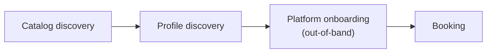

### 1.3 Service Verticals

USP defines the following core service verticals. The `type` field on a service*
*MUST** be set to one of these values, or to a vendor-defined vertical using
reverse-domain notation (e.g., `com.wix.services.courses`).

#### 1.3.1 Core Verticals

| Vertical      | Description                                                                                                                                     | Examples                                                  |
|---------------|-------------------------------------------------------------------------------------------------------------------------------------------------|-----------------------------------------------------------|
| `appointment` | A 1:1 session between a single client and a provider. The booking reserves one provider for one buyer at a specific time.                       | Salon, dental, consulting, personal training, therapy     |
| `group`       | A group session with limited capacity. Multiple buyers book into the same time slot, each occupying one or more spots up to a maximum capacity. | Yoga class, workshop, group fitness, cooking class        |
| `reservation` | A hold on a shared resource for a time window. The buyer reserves a specific resource (e.g., a table, a room) for a party of a given size.      | Restaurant table, conference room, venue, court booking   |
| `rental`      | Temporary exclusive use of equipment or space for a duration. The buyer takes possession of the resource for the rental period.                 | Car rental, studio space, equipment hire, vacation rental |
| `field_service` | A service performed at a location the buyer specifies (home, office, or other premises) rather than at the business's own location. Uses `channel.type: at_buyer_location` and `delivery_address` ([Section 5.2](#52-booking-schema)). Scheduling **SHOULD** account for travel time and service area. | Plumbing, cleaning, pest control, home repair, mobile equipment repair |

#### 1.3.2 Custom Verticals

Vendors **MAY** define custom verticals using their reverse-domain namespace:

```
com.{vendor}.services.{vertical_name}
```

Custom verticals **MUST** publish a specification and schema that define the
additional fields and semantics beyond the USP base service schema. Platforms
encountering an unrecognized vertical **SHOULD** fall back to treating the
service as an `appointment` type for basic scheduling operations.

For a list of scheduling domains under consideration for future standardization,
see [Appendix A](#appendix-a-future-vertical-considerations-informative).

### 1.4 Relationship to Other Standards

USP builds upon and complements several existing standards. This section
clarifies how USP relates to each and why a new protocol is necessary.

| Standard                                           | Relationship to USP                                                                                                                                                                                                                                                                                                                                                                                                                                                                |
|----------------------------------------------------|------------------------------------------------------------------------------------------------------------------------------------------------------------------------------------------------------------------------------------------------------------------------------------------------------------------------------------------------------------------------------------------------------------------------------------------------------------------------------------|
| **RFC 5545** (iCalendar) [RFC 5545]                | iCalendar defines the core data format for calendar events (`VEVENT`), free/busy information (`VFREEBUSY`), and scheduling objects. USP's booking and availability concepts are semantically related to iCalendar components. Businesses **SHOULD** support exporting confirmed bookings as iCalendar `VEVENT` objects for calendar integration. USP does not replace iCalendar but provides a higher-level commerce-aware scheduling protocol on top of similar concepts.         |
| **RFC 5546** (iTIP) [RFC 5546]                     | iTIP defines transport-independent scheduling methods (`REQUEST`, `REPLY`, `CANCEL`, `COUNTER`). USP's booking operations (create, confirm, reschedule, cancel) are semantically equivalent to iTIP methods. USP extends beyond iTIP by adding service discovery, real-time availability queries, slot holds, payment integration, and agentic transport bindings (MCP, A2A) that iTIP does not address.                                                                           |
| **RFC 6638** (CalDAV Scheduling) [RFC 6638]        | CalDAV Scheduling provides server-side implicit scheduling and free/busy queries. USP's availability query serves a similar purpose but is designed for cross-organization, platform-to-business interactions rather than intra-organization calendar sharing.                                                                                                                                                                                                                     |
| **RFC 7986** (New iCalendar Properties) [RFC 7986] | Adds `IMAGE`, `CONFERENCE` (virtual meeting URIs), and `REFRESH-INTERVAL` to iCalendar. USP's `channel.virtual_provider` and `images` fields overlap with these properties. Implementations **SHOULD** map these fields when exporting to iCalendar.                                                                                                                                                                                                                               |
| **schema.org/Service**                             | schema.org defines structured data types for services, offers, and actions (`ReserveAction`, `BookAction`). USP's service catalog complements schema.org: businesses **SHOULD** expose service catalog data as [schema.org/Service](https://schema.org/Service) structured data on their website for search engine discoverability (see [Section 3.2](#32-catalog-caching-and-indexing)), while the USP API provides the programmatic booking flow.                                |
| **OpenActive Open Booking API 1.0** [OpenActive]   | The Open Booking API is a W3C Community Group specification for booking physical activities, using RPDE feeds and schema.org data models. USP differs from OpenActive in three key ways: (1) USP provides a flexible payment integration model with multiple checkout path extensions, (2) USP is designed for agentic commerce with MCP/A2A bindings and availability hints for AI reasoning, and (3) USP covers a broader range of service verticals beyond physical activities. |
| **UCP** (Universal Commerce Protocol) [UCP]        | USP includes a UCP-Native Mode where scheduling capabilities register directly in the UCP profile. See [Section 7](#7-ucp-native-mode).                                                                                                                                                                                                                                                                                                                                            |
| **ACP** (Agentic Commerce Protocol)                | USP includes an ACP booking extension for Standalone Mode deployments. See [Section 8.5.6](#856-acp-booking-extension).                                                                                                                                                                                                                                                                                                                                                            |
| **RFC 9457** (Problem Details) [RFC 9457]          | USP uses RFC 9457 Problem Details for HTTP error responses. See [Section 9.1](#91-rest-binding).                                                                                                                                                                                                                                                                                                                                                                                   |
| **RFC 6749** (OAuth 2.0) [RFC 6749]                | USP uses OAuth 2.0 for authorization and identity linking. See [Section 10.2.3](#1023-authentication-and-authorization).                                                                                                                                                                                                                                                                                                                                                           |
| **RFC 9421** (HTTP Message Signatures) [RFC 9421]  | USP uses HTTP Message Signatures for webhook integrity verification ([Section 10.1.1](#1011-webhook-security)) and for platform request signing ([Section 9.1.4](#914-request-signing)), the RECOMMENDED way to satisfy [Section 10.1.6](#1016-platform-authentication-for-privileged-operations).                                                                                                                                                                                                                                                                                                                                                                 |

### 1.5 Deployment Modes

USP supports two deployment modes. An implementer of USP chooses one mode
based on their existing infrastructure and follows the implementation stages
associated with that deployment mode.
Both modes share the same domain core (Sections 1-5) for service catalog,
availability, and booking lifecycle.

#### 1.5.1 Choosing a Deployment Mode

| If your platform...                                             | Choose                                                | Read                                                                                                 |
|-----------------------------------------------------------------|-------------------------------------------------------|------------------------------------------------------------------------------------------------------|
| Already supports [UCP][UCP]                                     | **UCP-Native Mode** ([Section 7](#7-ucp-native-mode)) | Sections 1-5, optionally 6, 7, 9.1-9.5, 10.1, optionally 11, 12-14                                   |
| Does not support UCP, or wants a standalone scheduling protocol | **Standalone Mode** ([Section 8](#8-standalone-mode)) | Sections 1-6, 8, 9 (all), 10 (all), optionally 11, 12-14                                             |
| Only offers free services                                       | Either <br/>mode (for discovery only)                 | Sections 1-5, optionally 6, chosen deployment mode's section (without the payment part), 9-10, 12-14 |

#### 1.5.2 UCP-Native Implementation Stages

If your platform supports UCP, follow these steps to add USP scheduling
capabilities:

1. **Register capabilities.** Declare `dev.usp.services.catalog`,
   `dev.usp.services.availability`, `dev.usp.services.bookings`, and optionally
   `dev.usp.services.paid_bookings` in your `/.well-known/ucp` profile.
   See [Section 7.2](#72-profile-registration-in-well-knownucp).
2. **Implement service catalog.** Expose the service catalog API (list services,
   get service, feed). See [Section 3](#3-service-catalog).
3. **Implement availability.** Expose availability query and optional hold
   mechanism. See [Section 4](#4-availability).
4. **Implement booking lifecycle.** Expose create, get, update, confirm, cancel,
   and reschedule booking operations. See [Section 5](#5-booking-lifecycle).
5. **If offering paid services:** Add the `paid_bookings` extension to your UCP
   checkout schema ([Section 7.4](#74-paid-bookings-extension-schema)) and
   implement the checkout
   flow ([Section 7.5](#75-checkout-flow-and-atomicity-guarantee)).
6. **If offering free services only:**
   Follow [Section 7.6](#76-free-services-in-ucp-native-mode) - no checkout
   integration needed.
7. **Implement USP-specific transport details** for your chosen binding (
   Sections 9.1-9.5). *
   *Skip [Section 9.6](#96-transport-infrastructure-for-standalone-mode)** - UCP
   provides your transport infrastructure.
8. **Implement USP-specific security requirements
   ** ([Section 10.1](#101-usp-security-requirements)). *
   *Skip [Section 10.2](#102-security-infrastructure-for-standalone-mode)** -
   UCP provides your security infrastructure.
9. **Optional:** Implement the waitlist
   extension ([Section 11](#11-extensions)).
10. **Optional:** Register in a discovery
    registry ([Section 6](#6-discovery-registry-optional)).
11. **Verify** against end-to-end flows ([Section 7.7](#77-end-to-end-flows)).

#### 1.5.3 Standalone Implementation Stages

If your platform does not use UCP, follow these steps:

1. **Create your business profile.** Publish a `/.well-known/usp` profile
   declaring your capabilities, transport endpoints, and optional checkout
   systems. See [Section 8.2](#82-business-profile-well-knownusp).
2. **Implement capability negotiation.** Support the `USP-Agent` header and
   server-selects negotiation model.
   See [Section 8.3](#83-capability-negotiation).
3. **Implement service catalog.** Expose the service catalog API (list services,
   get service, feed). See [Section 3](#3-service-catalog).
4. **Implement availability.** Expose availability query and optional hold
   mechanism. See [Section 4](#4-availability).
5. **Implement booking lifecycle.** Expose create, get, update, confirm, cancel,
   and reschedule booking operations. See [Section 5](#5-booking-lifecycle).
6. **If offering paid services:** Implement payment
   integration ([Section 8.5](#85-payment-integration)) - choose the generic
   payment flow ([Section 8.5.4](#854-generic-payment-flow)) and/or the ACP
   booking extension ([Section 8.5.6](#856-acp-booking-extension)).
7. **If offering free services only:**
   Skip [Section 8.5](#85-payment-integration) entirely.
8. **Implement transport binding** for your chosen transport (Sections 9.1-9.5)*
   *and** transport
   infrastructure ([Section 9.6](#96-transport-infrastructure-for-standalone-mode)).
9. **Implement security requirements
   ** ([Section 10.1](#101-usp-security-requirements)) **and** security
   infrastructure ([Section 10.2](#102-security-infrastructure-for-standalone-mode)).
10. **Optional:** Implement the waitlist
    extension ([Section 11](#11-extensions)).
11. **Optional:** Register in a discovery
    registry ([Section 6](#6-discovery-registry-optional)).
12. **Verify** against end-to-end flows ([Section 8.6](#86-end-to-end-flows)).

#### 1.5.4 Reading Path Summary

The following diagram shows the specification structure and how sections flow
between the deployment modes:

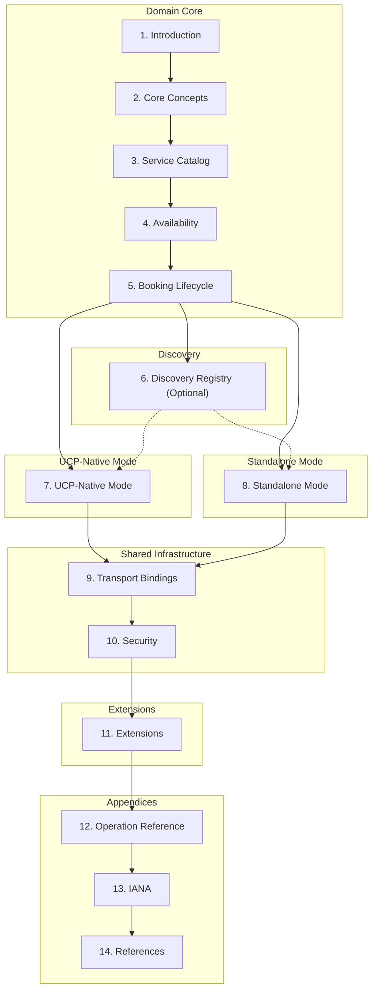

| Implementer Type             | Sections to Read                                      | Skip Rules                                                                                                                                                       |
|------------------------------|-------------------------------------------------------|------------------------------------------------------------------------------------------------------------------------------------------------------------------|
| **UCP-Native (paid + free)** | 1-5, optionally 6, 7, 9-10, optionally 11, 12-14      | Skip [Sections 9.6](#96-transport-infrastructure-for-standalone-mode) and [10.2](#102-security-infrastructure-for-standalone-mode) (UCP provides infrastructure) |
| **Standalone (paid + free)** | 1-6, 8, 9-10 (all), optionally 11, 12-14              | Read all subsections                                                                                                                                             |
| **Free services only**       | 1-5, optionally 6, mode section (7 or 8), 9-10, 12-14 | Skip payment subsections in mode section                                                                                                                         |
| **Minimal v1**               | 1-5, mode section, 9-10                               | Skip extensions ([Section 11](#11-extensions)) entirely                                                                                                          |

---

## 2. Core Concepts

USP enables interoperability between platforms, businesses, and payment
providers for service commerce. This section introduces the key roles,
architectural principles, and protocol constructs.

### 2.1 Roles and Participants

USP defines interactions between four participants:

#### 2.1.1 Platform (Application / Agent)

The consumer-facing surface acting on behalf of the user. Platforms orchestrate
the full journey: catalog discovery, profile discovery, presenting availability,
and facilitating booking and payment.

- **Responsibilities:** Profile discovery via `/.well-known/usp`,
  querying availability, creating bookings, processing payment through whichever
  checkout system is available.
- **Examples:** AI scheduling assistants, super apps, search engines,
  marketplace platforms.

#### 2.1.2 Business

The entity offering time-based services. In USP, the business owns the schedule,
resources, and booking policies. For payment, the business remains the *
*Merchant of Record**.

- **Responsibilities:** Publishing a USP profile, exposing a service catalog,
  computing real-time availability, managing the booking lifecycle, providing
  payment actions with `payment_context` for paid services.
- **Examples:** Salons, clinics, fitness studios, restaurants, rental companies,
  consultancies.

#### 2.1.3 Credential Provider (CP)

A trusted entity that securely manages user payment instruments and identity.
Listing the CP role clarifies **PCI-DSS scope**: when buyers pay with a wallet
or tokenized instrument, the credential provider—not the platform or
business—often holds the sensitive payment credentials, which reduces what USP
implementations must handle directly. USP does not define APIs to credential
providers; checkout systems integrate with them as part of payment processing.

- **Examples:** Google Wallet, Apple Pay, digital identity providers.

#### 2.1.4 Payment Service Provider (PSP)

The financial infrastructure that processes payments. USP delegates all payment
processing to the checkout system, which in turn interacts with the PSP.

- **Examples:** Stripe, Adyen, PayPal, Braintree.

#### 2.1.5 Implementor Note: Expected Deployment Topology

While [Section 2.1](#21-roles-and-participants) describes the logical roles, in practice the 
business-side USP
implementation is almost always provided by a **SaaS platform** (e.g., Wix,
Square, Mindbody, Booksy) rather than by the individual business itself. The
salon owner does not implement USP endpoints -- their SaaS platform does, once,
on behalf of all its merchants.

This means the realistic implementor landscape is:

| Side                  | Who implements                                | Scale                                                        |
|-----------------------|-----------------------------------------------|--------------------------------------------------------------|
| **Business (server)** | SaaS scheduling platforms                     | One implementation serves thousands of merchants             |
| **Platform (client)** | Aggregators, AI agents, marketplace platforms | One integration consumes services across many SaaS providers |

This topology has important implications for the spec:

- **Features like the service catalog feed
  ** ([Section 3.1](#31-service-catalog-feed)), feed subscriptions, and hold
  abuse prevention are designed for SaaS-to-aggregator integration, not for
  individual businesses to build from scratch. SaaS platforms already have the
  infrastructure (change tracking, cursor-based pagination, soft-delete
  tombstones) to implement these features.
- **The `POST /services/list` endpoint** remains available for simpler,
  interactive use by platform UIs and AI agents that do not need bulk indexing.
- **Complexity budgets** in this spec are calibrated for professional platform
  teams on both sides, not for ad-hoc integrations.

Businesses that self-host USP without a SaaS platform **MAY** implement only the
capabilities they need. The modular capability system ensures that a minimal
implementation (catalog + availability + bookings) is viable without the feed,
subscriptions, or hold operations.

### 2.2 Commerce and Non-Commerce Services

USP supports both **paid services** that require payment integration and **free
or pay-later services** that operate standalone without any payment
infrastructure. This section defines the two operational modes and their
implications.

#### 2.2.1 Operational Modes

| Mode                            | `requires_payment` | `payment_timing`   | Checkout Required? | Booking Confirmation Flow                                                                                               |
|---------------------------------|--------------------|--------------------|--------------------|-------------------------------------------------------------------------------------------------------------------------|
| **Standalone (non-commerce)**   | `false`            | N/A                | No                 | `pending` → `confirmed` (auto mode) or `pending` → `confirmed` (manual mode, business approves)                         |
| **Standalone (pay-at-service)** | `true`             | `at_service`       | No                 | `pending` → `confirmed`. Payment is collected in person at the time of service; no upfront digital payment is required. |
| **Integrated (commerce)**       | `true`             | `at_booking`       | Yes                | `pending` → `requires_action` → (checkout) → `confirmed`                                                                |
| **Integrated (deposit)**        | `true`             | `deposit_required` | Yes                | `pending` → `requires_action` → (checkout for deposit) → `confirmed`                                                    |

- **Standalone mode:** USP operates independently. No checkout system is needed.
  The business publishes only `/.well-known/usp`. This mode is appropriate for
  free community events, public library room reservations, government services,
  volunteer scheduling, and services where payment is collected in person.
- **Integrated mode:** USP and a checkout system work together. When a booking
  requires payment, the `create_booking` response includes an `actions` array
  containing a payment action with a `payment_context` object. The platform
  processes payment through the available checkout system, then calls USP's
  `confirm-payment` endpoint to finalize the booking. In UCP-Native
  Mode ([Section 7](#7-ucp-native-mode)), paid bookings use UCP's atomic
  checkout (no payment action; payment is handled by the checkout). In
  Standalone Mode ([Section 8](#8-standalone-mode)), paid bookings use the
  generic `payment_context` + `confirm-payment` pattern via the payment action.

#### 2.2.2 Payment Field Conditionality

The `payment` object on a booking is conditionally present based on the
service's payment configuration:

| `requires_payment` | `payment_timing`   | `payment` Object on Booking | Notes                                                                                                                                                 |
|--------------------|--------------------|-----------------------------|-------------------------------------------------------------------------------------------------------------------------------------------------------|
| `false`            | N/A                | **MUST** be omitted         | Free service. No payment fields.                                                                                                                      |
| `true`             | `at_service`       | **MAY** be present          | If present: `status: not_required`, `amount_due: 0`. The `amount` field reflects the service price for informational purposes.                        |
| `true`             | `at_booking`       | **MUST** be present         | `status: pending`, `amount_due` = full amount. In Standalone Mode, the booking's `actions` array includes a payment action with `payment_context`.    |
| `true`             | `deposit_required` | **MUST** be present         | `status: pending`, `amount_due` = deposit amount. In Standalone Mode, the booking's `actions` array includes a payment action with `payment_context`. |

See [Section 7.7](#77-end-to-end-flows) (UCP-Native Mode)
or [Section 8.6](#86-end-to-end-flows) (Standalone Mode) for complete end-to-end
examples.

### 2.3 High-Level Architecture

USP supports two deployment modes. Both share the same scheduling layer (
catalog, availability, booking). The payment path diverges based on the
deployment mode:

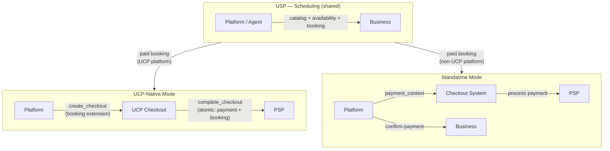

**UCP-Native Mode** ([Section 7](#7-ucp-native-mode)): Platforms that already
support UCP register USP scheduling capabilities directly in their
`/.well-known/ucp` profile. Paid bookings use UCP's atomic checkout -
`complete_checkout` finalizes both payment and booking in a single operation.
Infrastructure (profile discovery, negotiation, security, error handling) is inherited
from UCP.

**Standalone Mode** ([Section 8](#8-standalone-mode)): Platforms that do not use
UCP perform profile discovery via `/.well-known/usp` and use USP's own infrastructure.
For paid bookings, the business returns a booking with a payment action
containing a `payment_context` object that any checkout system can process. The
platform calls `confirm-payment` after payment succeeds.

Both modes share the same scheduling
operations ([Sections 3-5](#3-service-catalog)) and the same transport
bindings ([Section 9](#9-transport-bindings)). For free services, no checkout
system is needed in either mode.

**Profile hosting.** Business profile documents **MUST** be served over HTTPS,
**MUST NOT** redirect (clients **MUST** use the resolved final URL only), and
**SHOULD** include appropriate `Cache-Control` headers. Full normative
requirements are in [Section 8.2.2](#822-profile-hosting-requirements). The
machine-readable shapes are defined in [`schemas/profile.json`](schemas/profile.json)
(`$defs/BusinessProfile`, `$defs/PlatformProfile`) and
[`schemas/usp.json`](schemas/usp.json) (`$defs/business_schema`,
`$defs/platform_schema`).

**Graceful degradation.** When a buyer-facing flow cannot be completed entirely
through the API (for example, payment authentication or policy review), businesses
**SHOULD** provide a [`continue_url`](https://ucp.dev/latest/specification/checkout/#continue-url)
pointing to a web-based fallback so the buyer can finish the task in a browser.
USP uses this pattern on booking `actions` (for example, payment and waivers);
UCP-Native Mode uses it for checkout escalation. See
[Section 5.2](#52-booking-schema) and [Section 8.5.5](#855-redirect-flow-and-post-payment-return).

**Protocol version compatibility.** Businesses **MAY** support older USP protocol
versions by publishing a `supported_versions` map in the business profile (keys:
prior `YYYY-MM-DD` versions; values: URIs of version-specific profile documents).
See [Section 8.2.4](#824-backward-compatibility) and
[`schemas/usp.json`](schemas/usp.json) (`$defs/business_schema`, property
`supported_versions`).

### 2.4 Core Constructs

USP is built on three constructs:

| Construct        | Description                                                                                                                                                                            | Examples                                                                                                                                                                                                             |
|------------------|----------------------------------------------------------------------------------------------------------------------------------------------------------------------------------------|----------------------------------------------------------------------------------------------------------------------------------------------------------------------------------------------------------------------|
| **Capabilities** | Standalone features a business supports, declared using a registry pattern (object keyed by capability name). Each capability has a namespace, schema, and version.                    | `dev.usp.services.catalog`, `dev.usp.services.availability`, `dev.usp.services.bookings`                                                                                                                             |
| **Extensions**   | Optional modules that augment a capability via the `extends` field. Extensions use JSON Schema composition (`allOf`, `$defs`) to layer additional fields onto base capability schemas. | Waitlist management (extends bookings, [Section 11.1](#111-waitlist-extension)), paid bookings (extends UCP checkout, [Section 7.4](#74-paid-bookings-extension-schema)), vendor-specific loyalty (extends bookings) |
| **Transport Bindings** | Declarations of how USP traffic is carried (REST, MCP, A2A, embedded). The profile `services` registry maps reverse-domain service names to arrays of transport-specific bindings, each with a `transport` discriminator. Not to be confused with the **Service** domain entity (bookable offerings) in [Section 3](#3-service-catalog). | REST (OpenAPI 3.x), MCP (OpenRPC / JSON-RPC), A2A (Agent Card). See [Section 9](#9-transport-bindings) and [`schemas/usp.json`](schemas/usp.json) (`$defs/ServiceBinding`). |

**Capability entries (profiles).** Each object in a profile’s `capabilities`
registry declares support for one capability version. Normative JSON Schema:
[`schemas/usp.json`](schemas/usp.json) — [`$defs/ProfileCapabilityEntry`](schemas/usp.json)
for business and platform profiles (requires `spec` and `schema`); [`$defs/CapabilityEntry`](schemas/usp.json)
for the base shape; response metadata uses only `version` in each negotiated
capability object ([`$defs/response_schema`](schemas/usp.json)).

| Field     | Type            | Required              | Description |
| --------- | --------------- | --------------------- | ----------- |
| `version` | string          | **Yes**               | Capability version (`YYYY-MM-DD`). |
| `spec`    | string (URI)    | **Yes** (in profiles) | URL to the human-readable capability specification. Required in business and platform profiles; omitted in response metadata entries that only declare the negotiated version. |
| `schema`  | string (URI)    | **Yes** (in profiles) | URL to the machine-readable JSON Schema for the capability. Required in business and platform profiles; omitted in response metadata entries that only declare the negotiated version. |
| `extends` | string or array | No                    | Parent capability name(s) for extensions. |

**Version requirements (extension schemas).** Extension JSON Schemas **SHOULD**
declare a top-level `requires` object (alongside schema metadata) with:

- `protocol`: an object giving a minimum (and optionally maximum) USP protocol
  version required for correct operation, and
- `capabilities`: a map from parent capability names to `{min, max?}` version
  ranges.

If `requires` is present, platforms and businesses **MUST** verify the
negotiated protocol and capability versions satisfy these constraints during
schema resolution; incompatible extensions **MUST** be excluded from the active
capability set. This mirrors the pattern used in the Universal Commerce Protocol
(UCP) for extension compatibility.

### 2.5 Namespace Governance

USP uses reverse-domain notation for capability names:

```
{reverse-domain}.{service}.{capability}
```

The `dev.usp.*` namespace is governed by the USP body. Vendors **MUST** use
their own domain (e.g., `com.wix.services.courses`).

#### Governance model

| Namespace pattern | Authority   | Governance         |
|-------------------|-------------|--------------------|
| `dev.usp.*`       | usp.dev     | USP governing body |
| `com.{vendor}.*`  | {vendor}.com | Vendor organization |
| `org.{org}.*`     | {org}.org   | Organization       |

#### Spec URL binding

The `spec` and `schema` URLs on each capability entry **MUST** use origins that
match the reverse-domain namespace authority of the capability name. Platforms
**MUST** validate this binding when processing profiles and **SHOULD** reject
capabilities where the origins do not match.

| Namespace prefix   | Required URL origin (scheme + host)   |
|--------------------|---------------------------------------|
| `dev.usp.*`        | `https://usp.dev/...`                 |
| `com.{vendor}.*`   | `https://{vendor}.com/...`            |
| `org.{org}.*`      | `https://{org}.org/...`               |

Field definitions are in [`schemas/usp.json`](schemas/usp.json) (`$defs/CapabilityEntry`,
`$defs/ProfileCapabilityEntry`).

Within the `dev.usp.*` namespace, capabilities are organized by scope:

- `dev.usp.services.*` — Business-facing capabilities that the business
  declares and platforms consume (e.g., `dev.usp.services.catalog`,
  `dev.usp.services.availability`).
- `dev.usp.platform.*` — Platform-scoped capabilities that the platform
  declares and implements internally. These do not require business-side
  support (e.g., `dev.usp.platform.calendar_freebusy`).

### 2.6 Multi-Location Businesses

For businesses with multiple locations (chains, franchises), a single USP
endpoint **MAY** serve all locations through a unified profile. The business
profile includes a `locations` array that enumerates the locations it manages:

```json
{
  "usp": {
    "version": "2026-02-09",
    "business": {
      "name": "Sunrise Wellness Studio",
      "timezone": "America/New_York",
      "currency": "USD",
      "locations": [
        {
          "id": "loc_nyc",
          "name": "NYC Downtown",
          "address": "123 Main St, New York, NY 10001"
        },
        {
          "id": "loc_la",
          "name": "LA West",
          "address": "456 Sunset Blvd, Los Angeles, CA 90028"
        }
      ]
    }
  }
}
```

When multiple locations share a single endpoint, the feed, list, and
availability operations **SHOULD** accept an optional `location_id` filter so
platforms can scope requests to a specific location:

```
GET /services/feed?cursor=crs_a1b2c3d4e5f6&limit=50&location_id=loc_nyc
```

Similarly, `POST /services/list` and `POST /availability/query` **SHOULD** accept
`location_id`. Each service's `locations[]`
field ([Section 3.3](#33-service-schema)) and each slot's `location`
field ([Section 4.1](#41-time-slot)) identify which location a service or slot
belongs to.

> **Note:** Alternatively, each location **MAY** publish its own independent
> `/.well-known/usp` profile (e.g., `nyc.sunrisewellness.com`,
> `la.sunrisewellness.com`), in which case no multi-location protocol extensions
> are needed -- each location operates as a standard single-location USP business.

### 2.7 Error Handling Overview

USP separates **business outcome** feedback from **protocol** failures:

- **Business outcomes** are successful HTTP exchanges where the business reports
  a scheduling or policy result using a `messages[]` array (REST: in the JSON
  body; MCP: in `result.messages[]`). Each message uses `type`, `code`, `content`,
  and optional `severity`. See [Section 9.4](#94-error-code-mapping) for standard
  codes and severities.
- **Protocol errors** use HTTP status codes with [RFC 9457] Problem Details in
  the REST binding and JSON-RPC `error` objects in the MCP binding, as mapped in
  [Section 9.4](#94-error-code-mapping).

State-changing operations that create or modify resources (for example, booking
creation, cancellation, rescheduling, payment confirmation) **SHOULD** use an
idempotency key: the `Idempotency-Key` header in REST or `_meta.usp.idempotency_key`
in MCP. Semantics and conflict behavior are defined in
[Section 9.1.1](#911-idempotency).

---

## 3. Service Catalog

**Capability:** `dev.usp.services.catalog`

The catalog enables platforms to **discover what services a business offers** -
types, pricing, policies, resources, and delivery channels.

### 3.1 Service Catalog Feed

Businesses **SHOULD** publish a service catalog feed for aggregators and
indexing platforms. The feed enables incremental synchronization - aggregators
maintain a cursor and fetch only changed records since their last sync, rather
than re-fetching the entire catalog.

**Feed Endpoint** - `GET /services/feed`

The feed returns a paginated, chronologically ordered list of service records,
sorted by `modified_at` ascending. This design follows the Realtime Paged Data
Exchange (RPDE) pattern used by [OpenActive] and is analogous to product feeds
in commerce platforms. The response **MAY** include an optional `messages[]`
array (e.g., partial results when `feed_status` is `degraded`).

Request:

```json
GET /services/feed?cursor=crs_a1b2c3d4e5f6&limit=50
```

Response:

```json
{
  "usp": {
    "version": "2026-02-09",
    "capabilities": {
      "dev.usp.services.catalog": [
        {
          "version": "2026-02-09"
        }
      ]
    }
  },
  "items": [
    {
      "state": "updated",
      "modified_at": "2026-03-10T09:15:00Z",
      "data": {
        "id": "svc_haircut_001",
        "business_id": "biz_glamour_salon_nyc",
        "name": "Women's Haircut & Style",
        "type": "appointment",
        "...": "full service object"
      }
    },
    {
      "state": "deleted",
      "modified_at": "2026-03-10T10:00:00Z",
      "data": {
        "id": "svc_old_service_002",
        "business_id": "biz_glamour_salon_nyc"
      }
    }
  ],
  "pagination": {
    "cursor": "crs_f7g8h9i0j1k2",
    "has_more": true
  },
  "feed_meta": {
    "feed_generated_at": "2026-03-10T10:05:00Z",
    "total_services": 47,
    "feed_status": "healthy"
  }
}
```

| Field                         | Type    | Required | Description                                                                                                                                                                                                                                                  |
|-------------------------------|---------|----------|--------------------------------------------------------------------------------------------------------------------------------------------------------------------------------------------------------------------------------------------------------------|
| `items[].state`               | string  | **Yes**  | `updated` (new or modified service) or `deleted` (service removed; aggregators **MUST** prune this from their index).                                                                                                                                        |
| `items[].modified_at`         | string  | **Yes**  | RFC 3339 timestamp of when this record was last modified. Used as the cursor for incremental sync.                                                                                                                                                           |
| `items[].data`                | object  | **Yes**  | Full service object for `updated` state; object containing only `id` for `deleted` state.                                                                                                                                                                    |
| `pagination.next_cursor`      | string  | **Yes**  | Opaque cursor to pass as the `cursor` query parameter on the next request.                                                                                                                                                                                   |
| `pagination.has_more`         | boolean | **Yes**  | Whether more records exist beyond this page.                                                                                                                                                                                                                 |
| `feed_meta.feed_generated_at` | string  | **Yes**  | RFC 3339 timestamp of when this feed page was computed. Aggregators can use this to detect stale feeds.                                                                                                                                                      |
| `feed_meta.total_services`    | integer | **Yes**  | Total number of active (non-deleted) services in the business's catalog. Aggregators can use this to verify completeness of their index.                                                                                                                     |
| `feed_meta.feed_status`       | string  | **Yes**  | Health status of the feed. `healthy`: feed is fully up-to-date. `degraded`: feed may be missing recent changes (e.g., partial index rebuild in progress). `rebuilding`: feed is being regenerated from scratch; aggregators **SHOULD** expect a full resync. |

> **Note:** The feed endpoint uses `pagination.next_cursor` (a timestamp
> string) rather than the generic `cursor` used by all other paginated USP
> operations. This is intentional: the feed cursor is a `modified_at` timestamp
> that enables incremental RPDE-style synchronization, and its semantics differ
> from the opaque cursor used for interactive paging. See
> [Section 9.1.2](#912-pagination) for the shared cursor model.

The `List Services` operation ([Section 3.12](#312-operations)) remains
available for interactive use by platform UIs and AI agents. The feed endpoint
is designed for bulk indexing by aggregators.

### 3.2 Catalog Caching and Indexing

Service catalog data is relatively static - services, pricing, and policies
change infrequently compared to real-time availability. Platforms and
aggregators **SHOULD** cache catalog data rather than querying it on every user
interaction.

**Recommended caching strategies:**

- **Merchant aggregators** (e.g., Google Merchant Center): Catalog data **SHOULD
  ** be indexed by consuming the service catalog
  feed ([Section 3.1](#31-service-catalog-feed)) via incremental cursor-based
  synchronization. This enables pre-indexed service discovery and search across
  businesses without real-time API calls. Aggregators **SHOULD** synchronize at
  least once per hour for high-frequency businesses and once per day for
  low-frequency businesses.
- **Web crawlers and structured data**: Businesses **SHOULD** additionally
  expose service catalog data
  as [schema.org/Service](https://schema.org/Service) structured data on their
  website, enabling search engines and discovery platforms to index services
  through standard web scraping. This is complementary to the API - the
  structured data provides discoverability, while the USP API provides the
  programmatic booking flow.
- **Platform-level caching**: Platforms **SHOULD** cache catalog responses
  according to HTTP `Cache-Control` headers. Platforms **SHOULD** refresh cached
  catalog data at intervals between 1 and 24 hours, depending on the business
  vertical and rate of change.

Availability and booking, by contrast, are real-time operations and **MUST NOT**
be served from stale caches.

#### 3.2.1 Structured Data Mapping Guide

When exposing service catalog data
as [schema.org/Service](https://schema.org/Service) structured data, businesses*
*SHOULD** use the following mapping from USP service fields to schema.org
properties:

| USP Field                               | schema.org Property                            | Notes                                                                                                 |
|-----------------------------------------|------------------------------------------------|-------------------------------------------------------------------------------------------------------|
| `name`                                  | `schema:name`                                  | Direct mapping.                                                                                       |
| `description`                           | `schema:description`                           | Direct mapping.                                                                                       |
| `type`                                  | `schema:serviceType`                           | Map USP vertical to a human-readable service type string.                                             |
| `pricing.amount`                        | `schema:offers.price`                          | Convert from minor units to decimal (e.g., `7500` -> `75.00`).                                        |
| `pricing.currency`                      | `schema:offers.priceCurrency`                  | Direct mapping (ISO 4217).                                                                            |
| `pricing.model`                         | `schema:offers.priceSpecification`             | Use `UnitPriceSpecification` for `hourly`/`per_person`; `CompoundPriceSpecification` for `variable`.  |
| `channel.type: virtual`                 | `schema:availableChannel.serviceType`          | Set to `OnlineOnly`. Include `schema:offers.availableDeliveryMethod` as `DeliveryModeDirectDownload`. |
| `channel.type: at_business_location`    | `schema:availableChannel.serviceLocation`      | Map to `schema:Place` with address.                                                                   |
| `channel.type: at_buyer_location`       | `schema:areaServed`                            | Map `channel.service_area`, if present, to `schema:areaServed`. Do not publish the buyer's `delivery_address` as structured data — it is per-booking buyer data, not a business location.                                        |
| `locations[]`                           | `schema:areaServed` / `schema:serviceLocation` | Map each location to a `schema:Place`.                                                                |
| `availability_hint.next_available_date` | `schema:availabilityStarts`                    | Approximate; use with `schema:Offer`.                                                                 |
| `media[].url` (type=image)              | `schema:image`                                 | Direct mapping. Filter to `type: "image"` entries.                                                    |
| `media[].url` (type=video)              | `schema:video`                                 | Map to `schema:VideoObject`.                                                                          |
| `policies.cancellation`                 | `schema:cancellationPolicy`                    | Map `free_cancellation_until` to a human-readable string or use `schema:MerchantReturnPolicy`.        |
| `duration.fixed`                        | `schema:providerMobility` / custom             | No direct schema.org equivalent; use `schema:duration` on the `Event` if modeling as an event.        |
| `capacity.max`                          | `schema:maximumAttendeeCapacity`               | For `group` and `reservation` types.                                                                  |

This mapping ensures consistent discoverability across search engines while the
USP API provides the programmatic booking flow.

### 3.3 Service Schema

> **JSON Schema:** [/$defs/Service](schemas/catalog.json)

The service object represents a bookable offering from a business. Each service
has a type (vertical), duration, pricing, policies, and optional resource
requirements.

| Field               | Type                         | Required | Description                                                                                                                                                                                                                                                                                                                                |
|---------------------|------------------------------|----------|--------------------------------------------------------------------------------------------------------------------------------------------------------------------------------------------------------------------------------------------------------------------------------------------------------------------------------------------|
| `id`                | string                       | **Yes**  | Unique service identifier, scoped to the business. Opaque to the platform. The composite key `(business_id, id)` is globally unique.                                                                                                                                                                                                       |
| `business_id`       | string                       | **Yes**  | Identifier of the business that owns this service. Populated by the provider in API responses. Together with `id`, forms the globally unique composite key for a service. Required for cross-business discovery, cached catalog aggregation, and agent-to-agent hand-off. See [Section 3.4](#34-business-id-and-cross-business-discovery). |
| `provider`          | Provider                     | No       | Inline business metadata for display without a separate profile fetch. See [Section 3.3.3](#333-provider-schema). Aligns with UCP's seller object.                                                                                                                                                                                        |
| `name`              | string                       | **Yes**  | Human-readable display name for the service (e.g., "Women's Haircut & Style").                                                                                                                                                                                                                                                             |
| `description`       | string \| Description        | No       | Service description. Accepts either a plain string (backward compatible) or a structured `Description` object with multiple format variants. See [Section 3.3.2](#332-description-schema).                                                                                                                                                 |
| `type`              | string                       | **Yes**  | The service vertical. **MUST** be one of the core verticals (`appointment`, `group`, `reservation`, `rental`, `field_service`) or a vendor-defined vertical using reverse-domain notation. See [Section 1.3](#13-service-verticals).                                                                                                                        |
| `categories`        | Array\[ServiceCategory\]     | No       | Multi-taxonomy category labels. Each entry has required `taxonomy` plus optional `id`, `name`, `parent_id`, `value`, and `primary`. The simple single-category case is a one-element array with `taxonomy: "merchant"`. See [Category rules](#category-rules) below.                                                                                                                                         |
| `duration`          | Duration                     | **Yes**  | Duration configuration. See [Section 3.7](#37-duration).                                                                                                                                                                                                                                                                                   |
| `pricing`           | Pricing                      | **Yes**  | Pricing model and amounts. See [Section 3.8](#38-pricing).                                                                                                                                                                                                                                                                                 |
| `locations`         | Array\[Location\]            | No       | Physical or virtual locations where the service is offered. Each location has `{id, name, address, coordinates}`.                                                                                                                                                                                                                          |
| `resources`         | Array\[ResourceRequirement\] | No       | Required staff, rooms, or equipment. See [Section 3.10](#310-resource-requirement).                                                                                                                                                                                                                                                        |
| `channel`           | object                       | **Yes**  | Delivery channel for the service. See channel types below.                                                                                                                                                                                                                                                                                 |
| `policies`          | ServicePolicies              | **Yes**  | Booking, cancellation, rescheduling, and payment policies. See [Section 3.9](#39-service-policies).                                                                                                                                                                                                                                        |
| `capacity`          | object                       | No       | `{min, max, waitlist}` - **REQUIRED** for `group` and `reservation` types. `min`: minimum party size accepted. `max`: maximum participants per slot. `waitlist`: boolean indicating whether waitlist is enabled when slots are full.                                                                                                       |
| `media`             | Array\[Media\]               | No       | Service media items (images, videos). See [Section 3.3.1](#331-media-schema). Replaces the previous `images` field.                                                                                                                                                                                                                         |
| `images`            | Array\[object\]              | No       | **Deprecated.** Alias for `media` for backward compatibility. If both `images` and `media` are present, `media` takes precedence. New implementations **SHOULD** use `media`.                                                                                                                                                               |
| `rating`            | object                       | No       | Aggregate service rating. `value` (number, required): average rating. `scale_min` (number, default 1): minimum scale value. `scale_max` (number, required): maximum scale value (e.g., 5). `count` (integer): number of reviews. Aligns with UCP rating object.                                                                            |
| `status`            | string                       | No       | Service lifecycle status: `active` (default, bookable), `suspended` (temporarily unavailable), `archived` (no longer offered, retained for history). Absent means `active`. A `service.suspended` webhook event **MUST** set this to `suspended`.                                                                                          |
| `handle`            | string                       | No       | URL-friendly slug for the service (e.g., `womens-haircut-style`). Aligns with UCP handle.                                                                                                                                                                                                                                                  |
| `url`               | string                       | No       | Canonical service page URL on the business's website. Aligns with UCP url.                                                                                                                                                                                                                                                                  |
| `tags`              | Array\[string\]              | No       | Freeform tags for categorization and search (e.g., `["relaxation", "deep-tissue", "prenatal"]`). Aligns with UCP tags.                                                                                                                                                                                                                     |
| `metadata`          | object                       | No       | Business-defined custom data extending the standard service model. Freeform key-value object. Platforms **SHOULD** pass through opaquely. Aligns with UCP metadata.                                                                                                                                                                         |
| `availability_hint` | AvailabilityHint             | No       | Approximate availability summary for agent-assisted discovery. See [Section 3.6](#36-availability-hint).                                                                                                                                                                                                                                   |
| `links`             | Array\[Link\]                | No       | Typed links to policy and information pages specific to this service (e.g., cancellation policy page, waiver form). Each entry: `{type, url, title}`. Platforms **SHOULD** surface these during the booking flow — before the buyer confirms — so terms are visible at decision time. Well-known `type` values: `cancellation_policy`, `rescheduling_policy`, `terms_of_service`, `privacy_policy`, `waiver`, `faq`. Complements `provider.links[]` which carries business-level policies. |
| `localized`         | LocalizedFields              | No       | Per-locale overrides for human-readable text fields. Keys are IETF BCP 47 language tags (e.g., `es`, `fr`, `zh-Hant`). The top-level fields (`name`, `description`, etc.) serve as the default/fallback locale. See [Section 3.5](#35-localization).                                                                                       |

**Category rules:**

> **JSON Schema:** [/$defs/ServiceCategory](schemas/catalog.json)

Each `categories[]` entry:

| Field       | Type    | Required | Description |
|-------------|---------|----------|-------------|
| `taxonomy`  | string  | **Yes**  | Labeling system this entry belongs to. Well-known values include `merchant` (the merchant's own taxonomy) and external systems such as `google_business_profile`, `google_product_category`. Open extensible string, not a closed enum. |
| `id`        | string  | No       | Stable identifier within that taxonomy. Primarily used on the merchant entry. Catalog filters match against `id` values. |
| `name`      | string  | No       | Human-readable display label in the default locale. Primarily on the merchant or primary entry. |
| `parent_id` | string  | No       | Identifier of the parent category within the same taxonomy, enabling hierarchy (e.g., Wellness to Massage). |
| `value`     | string  | Conditional | Taxonomy-native identifier, path, or code (e.g., `beauty > hair > haircut`, `job_type_id:hair_styling`). Optional on `merchant` entries; **REQUIRED** for external (non-`merchant`) taxonomies. |
| `primary`   | boolean | No       | When `true`, marks this entry as the single canonical primary category. At most one entry **MAY** set `primary` to `true`. |

Normative rules:

1. An entry **MUST** carry at least one of `id`, `name`, or `value`. External (non-`merchant`) taxonomies **MUST** carry `value`.
2. Exactly one entry is canonical (primary). If exactly one entry has `primary: true`, that is the primary. If no entry sets `primary`, and exactly one entry has `taxonomy: "merchant"`, that entry is the primary. If neither disambiguates, the first entry in array order is the primary. Never more than one `primary: true`.
3. The primary entry is the source for display, localization (`localized.category_name` overrides the primary entry's `name`), and registry projection of `ServiceSearchResult.category`.
4. Catalog filters (`category_id`, and `categories` filter parameters that carry IDs) **MUST** match against the primary entry's `id`, and **MAY** match any entry's `id`. Filter parameters remain flat ID strings.
5. Registry projection: `ServiceSearchResult.category` (flat string) is derived from the primary entry with pick order: primary `name`, else primary `value`, else primary `id`, else the first entry's `value`, else the service `type`.

**Example (multi-taxonomy):**

```json
"categories": [
  {
    "taxonomy": "merchant",
    "id": "cat_haircut",
    "name": "Haircut",
    "parent_id": "cat_hair",
    "value": "beauty > hair > haircut",
    "primary": true
  },
  {
    "taxonomy": "google_business_profile",
    "value": "job_type_id:hair_styling"
  }
]
```

**Channel types:**

| `channel.type` | Description                                                                                                                  | Additional Fields                                                                                                                    |
|----------------|------------------------------------------------------------------------------------------------------------------------------|--------------------------------------------------------------------------------------------------------------------------------------|
| `at_business_location` | Service is delivered at the business's physical location. The buyer travels there.                                   | `instructions`: optional arrival instructions.                                                                                       |
| `at_buyer_location`    | Service is delivered at a location the buyer specifies. The business travels there. The `POST /bookings` request **MUST** include `delivery_address` ([Section 5.3.1](#531-create-booking---post-bookings)), echoed back on the `Booking` object ([Section 5.2](#52-booking-schema)). | `instructions`: optional access or preparation instructions. `service_area`: optional free-text description of the geographic area served. |
| `virtual`      | Service is delivered remotely via video/audio call.                                                                          | `virtual_provider`: platform name (e.g., "Zoom", "Google Meet"). `instructions`: join instructions or a link provided after booking. |
| `phone`        | Service is delivered via phone call.                                                                                         | `instructions`: optional call-in details.                                                                                            |
| `hybrid`       | Service can be delivered via more than one of the above channels, at the buyer's choice. The buyer selects the channel during booking. | `virtual_provider`, `instructions`, `service_area`. The booking request **SHOULD** include the buyer's channel preference.            |

> **Note:** `at_business_location` was named `in_person` prior to [#40](https://github.com/wix-private/universal-scheduling-protocol-spec/issues/40); implementations **MUST** treat `in_person` as an unrecognized/removed value once this rename is adopted, not as a synonym.

#### 3.3.1 Media Schema

The `media` array contains typed media items for the service. Each entry
describes a single image, video, or other media resource. This aligns with
UCP's media model.

| Field      | Type    | Required | Description                                                                                                                 |
|------------|---------|----------|-----------------------------------------------------------------------------------------------------------------------------|
| `type`     | string  | **Yes**  | Media format type: `image`, `video`. Additional types **MAY** be added in the future; platforms **MUST** ignore unknown types. |
| `url`      | string  | **Yes**  | URL to the media resource (HTTPS).                                                                                          |
| `alt_text` | string  | No       | Accessibility text describing the media. **RECOMMENDED** for all media items.                                               |
| `role`     | string  | No       | Display role: `hero` (primary banner), `gallery` (additional images/videos), `thumbnail` (small preview). Default: `gallery`. |
| `width`    | integer | No       | Width in pixels. **RECOMMENDED** for images and videos to enable responsive layouts without fetching the resource.           |
| `height`   | integer | No       | Height in pixels. **RECOMMENDED** for images and videos.                                                                    |

**Migration from `images`:** The previous `images` field used `{url, alt, type}`
where `type` was the display role (`hero`, `gallery`, `thumbnail`). The new
`media` field separates the media format (`type`) from the display role
(`role`), and renames `alt` to `alt_text` for consistency with UCP and
accessibility standards. Businesses **SHOULD** migrate to `media`. If both
`images` and `media` are present on a service, platforms **MUST** use `media`.

#### 3.3.2 Description Schema

The `description` field accepts either a plain string (backward compatible) or
a structured object with multiple format variants. This aligns with UCP's
`Description` type.

**Plain string (backward compatible):**

```json
"description": "A full haircut and styling session with one of our experienced stylists."
```

**Structured object:**

```json
"description": {
  "plain": "A full haircut and styling session with one of our experienced stylists.",
  "markdown": "A full **haircut and styling** session with one of our experienced stylists.\n\n- Consultation\n- Shampoo\n- Cut & blow-dry"
}
```

| Field      | Type   | Required    | Description                                                                                                                                   |
|------------|--------|-------------|-----------------------------------------------------------------------------------------------------------------------------------------------|
| `plain`    | string | **Yes**     | Plain text content. Always required as the universal fallback.                                                                                |
| `markdown` | string | No          | Markdown-formatted content.                                                                                                                  |
| `html`     | string | No          | HTML-formatted content. Platforms **MUST** sanitize before rendering — strip scripts, event handlers, and untrusted elements.                 |

At least `plain` **MUST** be provided. Platforms **SHOULD** prefer the richest
format they can safely render (`html` > `markdown` > `plain`), falling back to
`plain` for unsupported formats.

When a plain string is provided instead of an object, platforms **MUST** treat
it as equivalent to `{"plain": "<the string>"}`.

#### 3.3.3 Provider Schema

The optional `provider` object carries inline business metadata on the service,
so platforms can display the business name, website, and policy links without a
separate profile fetch. This is particularly valuable for multi-business search
results, cached catalogs, and AI agents describing services to buyers. Aligns
with UCP's `seller` object on product variants.

The `provider` is a lightweight subset of the business profile — not a
replacement. Platforms that need the full profile (capabilities, endpoints,
signing keys) **MUST** still fetch `/.well-known/usp`.

| Field   | Type          | Required | Description                                                                                            |
|---------|---------------|----------|--------------------------------------------------------------------------------------------------------|
| `name`  | string        | **Yes**  | Business display name (e.g., "Glamour Salon NYC").                                                     |
| `url`   | string        | No       | Business website URL.                                                                                  |
| `links` | Array\[Link\] | No       | Typed links to policy and information pages. See link types below.                                     |

**Link object:**

| Field   | Type   | Required | Description                                                                                                          |
|---------|--------|----------|----------------------------------------------------------------------------------------------------------------------|
| `type`  | string | **Yes**  | Link type. Well-known values: `privacy_policy`, `terms_of_service`, `refund_policy`, `cancellation_policy`, `faq`.   |
| `url`   | string | **Yes**  | URL to the linked page.                                                                                              |
| `title` | string | No       | Display text for the link. When provided, use instead of generating from `type`.                                     |

Platforms **SHOULD** handle unknown `type` values gracefully by displaying
them using the `title` field or omitting the link.

Example:

```json
"provider": {
  "name": "Glamour Salon NYC",
  "url": "https://glamoursalon.nyc",
  "links": [
    {
      "type": "cancellation_policy",
      "url": "https://glamoursalon.nyc/policies/cancellation"
    },
    {
      "type": "terms_of_service",
      "url": "https://glamoursalon.nyc/terms",
      "title": "Booking Terms"
    }
  ]
}
```

### 3.4 Business ID and Cross-Business Discovery

The `business_id` field makes every service object **self-describing** — it
carries the identity of the business that offers it, even after the service
object leaves the API response context.

This is critical in agentic workflows where services are routinely aggregated,
cached, and passed between systems:

| Scenario                           | Why `business_id` matters                                                                                                                                                             |
|------------------------------------|---------------------------------------------------------------------------------------------------------------------------------------------------------------------------------------|
| **Cross-business semantic search** | An agent indexes services from hundreds of businesses into a single search index. When a match is found, the agent needs to know which business to call for availability and booking. |
| **Cached catalog aggregation**     | Platforms cache service catalogs (the spec recommends 1-24 hour caching). The cache is a flat collection; `business_id` preserves the association.                                    |
| **Agent-to-agent hand-off**        | A discovery agent passes a service object to a booking agent. Without `business_id`, the receiving agent cannot act on it.                                                            |
| **Collision prevention**           | Two businesses may both have a service with `id: "haircut-1"`. The composite key `(business_id, id)` ensures global uniqueness.                                                       |

**Rules:**

- Providers **MUST** populate `business_id` in all API responses that contain
  service objects (list, get, feed, webhooks).
- Platforms **MUST NOT** send `business_id` in create or update requests — the
  business context is established by the API endpoint and authentication.
- The composite key `(business_id, id)` is the globally unique identifier for a
  service across the entire USP ecosystem.

### 3.5 Localization

The optional `localized` field provides per-locale overrides for human-readable
text fields on a service. The top-level fields (`name`, `description`,
primary `categories[].name`, `channel.instructions`) serve as the default/fallback locale.
The `localized` field uses IETF BCP 47 language tags as keys.

This design allows platforms to cache a single service object containing all
translations, rather than making per-locale API calls or maintaining multiple
cached copies. It is especially important for businesses serving multilingual
audiences.

**Localizable fields:**

| `localized` key        | Overrides                              |
|------------------------|----------------------------------------|
| `name`                 | `service.name`                         |
| `description`          | `service.description`                  |
| `category_name`        | primary `service.categories[].name`    |
| `channel_instructions` | `service.channel.instructions`         |

**Example:**

```json
{
  "id": "svc_haircut_001",
  "business_id": "biz_glamour_salon_nyc",
  "name": "Women's Haircut & Style",
  "description": "A full haircut and styling session.",
  "localized": {
    "name": {
      "es": "Corte y Peinado para Mujer",
      "fr": "Coupe & Coiffure Femme"
    },
    "description": {
      "es": "Una sesión completa de corte y peinado.",
      "fr": "Une séance complète de coupe et coiffure."
    },
    "category_name": {
      "es": "Cortes de pelo",
      "fr": "Coupes de cheveux"
    }
  }
}
```

**Rules:**

- The `localized` field is **optional**. Services without it use their top-level
  text fields for all locales.
- Platforms **SHOULD** resolve the buyer's preferred locale by matching against
  available keys, falling back to the top-level field when no match is found.
- Providers **SHOULD** include translations for all locales they actively
  support.

### 3.6 Availability Hint

An optional, lightweight summary of a service's near-term availability. The hint
is designed for AI agents and platforms that need to make smart decisions about*
*what date ranges to query** before hitting the real-time availability API. It
is cached alongside catalog data and serves as "Tier 0" of the availability
funnel (see [Section 4.4 - Caching Strategy](#44-caching-strategy)).

The hint captures the same information a receptionist would give over the phone:
a natural-language snapshot of when the business is open, busy, or booked out.
Businesses **SHOULD** regenerate this field every 1-6 hours, or whenever
availability changes significantly (e.g., a day transitions from available to
fully booked).

> **Important:** The availability hint is an **approximation**. Platforms **MUST
NOT** use it as a substitute for real-time availability queries. It is strictly
> a guide for narrowing the date range and reducing unnecessary API calls. The
> structured availability API (day-level and slot-level) remains the source of
> truth.

| Field                 | Type   | Required | Description                                                                                                                                                                                                                               |
|-----------------------|--------|----------|-------------------------------------------------------------------------------------------------------------------------------------------------------------------------------------------------------------------------------------------|
| `summary`             | string | **Yes**  | Natural-language description of near-term availability. Aimed at AI agents for reasoning about which dates to query. Example: *"Fully booked this week. Next week we have good availability on Tuesday afternoon and Wednesday morning."* |
| `generated_at`        | string | **Yes**  | RFC 3339 timestamp of when this hint was generated. Platforms can use this to assess freshness and decide how much weight to give the hint. A hint older than 6 hours **SHOULD** be treated with lower confidence.                        |
| `next_available_date` | string | No       | `YYYY-MM-DD` date of the next day with known availability. This single structured field is usable by both AI agents and traditional programmatic platforms to skip fully booked date ranges.                                              |

#### 3.6.1 Agent Use Cases

The availability hint is particularly valuable for AI agents that orchestrate
scheduling on behalf of users. The following table summarizes the key use cases
and how the hint helps in each:

| #  | Use Case                               | Agent Scenario                                          | How the Hint Helps                                                                                                                                                                                                    |
|----|----------------------------------------|---------------------------------------------------------|-----------------------------------------------------------------------------------------------------------------------------------------------------------------------------------------------------------------------|
| 1  | **First-available search**             | "Book me a haircut as soon as possible."                | `next_available_date` lets the agent jump directly to the first opening instead of scanning day-by-day from today.                                                                                                    |
| 2  | **Multi-business comparison**          | "Find me a massage therapist available this Thursday."  | The agent reads hints from multiple businesses' cached catalogs and filters out those marked as booked - without making any availability API calls.                                                                   |
| 3  | **Flexible date negotiation**          | "I'm flexible - find me a good time next week."         | The `summary` names specific days with openings, so the agent can propose smart options conversationally before querying slot-level.                                                                                  |
| 4  | **Proactive rescheduling**             | A booking is canceled; the agent helps the user rebook. | The agent reads the hint from the cached catalog and immediately suggests alternate days, enabling a faster rescheduling flow.                                                                                        |
| 5  | **Availability-aware recommendations** | "I want to book a yoga class this weekend."             | The agent ranks services not just by relevance but by likelihood of availability, avoiding the pattern of recommending a class only to discover it's full.                                                            |
| 6  | **Smart date range scoping**           | Agent builds a calendar view for the user.              | The hint identifies fully-booked periods, so the agent only queries day-level for the remaining open range - reducing payload size and API load.                                                                      |
| 7  | **Long-horizon search**                | "Book me with Dr. Smith - I don't care when."           | The hint says "booked solid for 3 weeks, next opening around April 1," letting the agent set expectations and target a narrow query window across a large booking horizon.                                            |
| 8  | **Multi-service bundling**             | "Haircut and color treatment back-to-back."             | Hints for each service reveal overlapping open days, so the agent intersects constraints from the hints before querying - reducing API fan-out.                                                                       |
| 9  | **Off-peak targeting**                 | "When is the cheapest time to book?"                    | The hint identifies low-demand windows (e.g., midweek mornings), which the agent can infer as likely off-peak pricing for services with `variable` pricing models.                                                    |
| 10 | **Background pre-qualification**       | Agent compiles a daily briefing of scheduling options.  | Hints from the user's preferred businesses are read entirely from the cached catalog - zero availability API calls - to produce a summary like "Your salon has openings Tuesday; your dentist is booked until April." |

```json
{
  "id": "svc_haircut_001",
  "business_id": "biz_glamour_salon_nyc",
  "name": "Women's Haircut & Style",
  "availability_hint": {
    "summary": "Fully booked this week. Next week we have good availability on Tuesday afternoon and Wednesday morning. Thursday is filling up fast.",
    "generated_at": "2026-03-11T08:00:00-04:00",
    "next_available_date": "2026-03-17"
  }
}
```

### 3.7 Duration

The duration object defines how long a service takes. Exactly one of `fixed`,
`range`, or `undetermined` **MUST** be provided. Buffers define non-bookable
prep/cleanup time that the business needs between consecutive bookings.

**Fixed duration:**

```json
{
  "fixed": "PT60M",
  "buffer_after": "PT15M"
}
```

**Variable duration (buyer selects):**

```json
{
  "range": {
    "min": "PT30M",
    "max": "PT120M",
    "step": "PT30M"
  }
}
```

**Undetermined duration (no meaningful duration to display):**

```json
{
  "undetermined": true
}
```

| Field           | Type    | Required    | Description                                                                                                                                                                                                                                                                                                                    |
|-----------------|---------|-------------|--------------------------------------------------------------------------------------------------------------------------------------------------------------------------------------------------------------------------------------------------------------------------------------------------------------------------------|
| `fixed`         | string  | Conditional | ISO 8601 duration. **REQUIRED** if neither `range` nor `undetermined` is present. The exact duration of the service.                                                                                                                                                                                                           |
| `range`         | object  | Conditional | **REQUIRED** if neither `fixed` nor `undetermined` is present. `{min, max, step}` - all ISO 8601 durations. The buyer selects a duration within this range in increments of `step`.                                                                                                                                            |
| `undetermined`  | boolean | Conditional | Set to `true` when the service has no meaningful duration to display (e.g., consultations, custom quotes, "call for estimate" services). **MUST NOT** be combined with `fixed` or `range`. When set, platforms **SHOULD NOT** display duration information to the buyer. Buffers **MAY** still be set for scheduling purposes. |
| `buffer_before` | string  | No          | ISO 8601 duration. Non-bookable prep time before the service (e.g., room setup). This time is blocked on the schedule but not visible to the buyer.                                                                                                                                                                            |
| `buffer_after`  | string  | No          | ISO 8601 duration. Non-bookable cleanup time after the service (e.g., sanitization between clients).                                                                                                                                                                                                                           |

### 3.8 Pricing

The pricing object defines how a service is priced. The combination of `model`
and the service's `requires_payment` / `payment_timing` fields **MUST** conform
to the validation rules in [Section 3.11](#311-validation-rules).

| Field         | Type    | Required    | Description                                                                                                                                                                                                                                                                                                                     |
|---------------|---------|-------------|---------------------------------------------------------------------------------------------------------------------------------------------------------------------------------------------------------------------------------------------------------------------------------------------------------------------------------|
| `model`       | string  | **Yes**     | The pricing model. See pricing model values below.                                                                                                                                                                                                                                                                              |
| `amount`      | integer | Conditional | Price in minor currency units (e.g., `7500` = $75.00). **REQUIRED** when `model` is `fixed`, `hourly`, or `per_person`. **MUST NOT** be present when `model` is `free`. **MAY** be absent when `model` is `variable` (price is determined at slot query time).                                                                  |
| `currency`    | string  | **Yes**     | ISO 4217 currency code (e.g., `USD`, `EUR`, `GBP`). **REQUIRED** even when `model` is `free` (to establish the business's operating currency).                                                                                                                                                                                  |
| `price_range` | object  | No          | `{min, max}` — displayable price range in minor currency units (same currency as `currency`). **RECOMMENDED** when `model` is `variable`, `hourly`, or `per_person`, so platforms can display a price range without querying availability. Aligns with UCP's `price_range` on products. See below.                              |
| `deposit`     | object  | No          | `{type, value, refundable}` - **REQUIRED** when `payment_timing` is `deposit_required`. `type`: `fixed` (absolute amount) or `percentage` (of the total price). `value`: the deposit amount or percentage. `refundable`: boolean indicating if the deposit is refundable upon cancellation within the free cancellation window. |

**Price range:**

When `model` is `variable`, `hourly`, or `per_person`, the catalog-level
`amount` may not represent the actual price the buyer will pay (it depends on
slot, duration, or party size). The optional `price_range` object provides a
displayable min/max so platforms can show "from $50 – $150" without querying
availability first.

| Field | Type    | Required | Description                                    |
|-------|---------|----------|------------------------------------------------|
| `min` | integer | **Yes**  | Minimum price in minor currency units.         |
| `max` | integer | **Yes**  | Maximum price in minor currency units.         |

Both `min` and `max` are denominated in the same currency as `pricing.currency`.
When `model` is `fixed`, `price_range` is redundant (min = max = amount) and
**SHOULD** be omitted. When `model` is `free`, `price_range` **MUST NOT** be
present.

**Pricing model values:**

| Model        | Description                                                                                                                                                                                                                                                 |
|--------------|-------------------------------------------------------------------------------------------------------------------------------------------------------------------------------------------------------------------------------------------------------------|
| `fixed`      | A single, fixed price for the service regardless of duration or party size.                                                                                                                                                                                 |
| `hourly`     | Price is per hour (or per unit of duration). The total is computed as `amount * duration_in_hours`.                                                                                                                                                         |
| `per_person` | Price is per participant. The total is computed as `amount * party_size`.                                                                                                                                                                                   |
| `variable`   | Price varies based on factors such as time of day, demand, day of week, or provider. The actual price is returned on each time slot in the availability response (`slot.pricing`). The catalog `amount` **MAY** be omitted or set to a base/starting price. |
| `free`       | No charge for the service. `amount` **MUST NOT** be present. The service `requires_payment` **MUST** be `false`.                                                                                                                                            |

### 3.9 Service Policies

Machine-readable policies that enable agents to make informed decisions about
booking, cancellation, rescheduling, and payment. These policies govern the
booking lifecycle and **MUST** be enforced by the business.

| Field               | Type    | Required    | Description                                                                                                                                                                                                                                                                                                                                                                                                                                                                                                                           |
|---------------------|---------|-------------|---------------------------------------------------------------------------------------------------------------------------------------------------------------------------------------------------------------------------------------------------------------------------------------------------------------------------------------------------------------------------------------------------------------------------------------------------------------------------------------------------------------------------------------|
| `cancellation`      | object  | **Yes**     | Cancellation policy. `allowed`: boolean, whether cancellation is permitted. `free_cancellation_until`: ISO 8601 duration before the service start time within which cancellation incurs no fee (e.g., `PT24H` = free cancellation up to 24 hours before). `late_cancellation_fee`: integer, fee in minor currency units charged for cancellations after the free window. `no_cancellation_after`: ISO 8601 duration, the point after which cancellation is no longer permitted (e.g., `PT1H` = cannot cancel within 1 hour of start). |
| `rescheduling`      | object  | **Yes**     | Rescheduling policy. `allowed`: boolean. `free_reschedule_until`: ISO 8601 duration before start time for free rescheduling. `max_reschedules`: integer, maximum number of times a booking can be rescheduled (prevents abuse). `fee`: integer, fee in minor currency units for rescheduling outside the free window.                                                                                                                                                                                                                 |
| `no_show`           | object  | No          | No-show policy. `fee`: integer, fixed fee in minor currency units. `fee_percentage`: integer (0-100), percentage of the service price charged as a no-show fee. Only one of `fee` or `fee_percentage` **SHOULD** be set. `grace_period`: ISO 8601 duration after the scheduled start time before the booking is marked as a no-show (e.g., `PT15M` = 15-minute grace period).                                                                                                                                                         |
| `booking_window`    | object  | **Yes**     | Booking window constraints. `min_advance`: ISO 8601 duration, minimum time before the slot start that a booking can be made (e.g., `PT2H` = must book at least 2 hours in advance). `max_advance`: ISO 8601 duration, maximum time in advance a booking can be made (e.g., `P60D` = can book up to 60 days ahead). `slot_interval`: ISO 8601 duration, the interval at which slots are generated (e.g., `PT30M` = slots start every 30 minutes).                                                                                      |
| `confirmation_mode` | string  | **Yes**     | `auto`: booking is confirmed immediately upon creation (or upon payment completion if payment is required). `manual`: booking requires explicit business approval. The business **SHOULD** respond within 24 hours. If the business does not confirm within the `expires_at` time on the booking, the booking transitions to `canceled`.                                                                                                                                                                                              |
| `requires_payment`  | boolean | **Yes**     | Whether this service requires any payment. `false` for free services. `true` for all paid services (including pay-at-service). See [Section 2.2](#22-commerce-and-non-commerce-services).                                                                                                                                                                                                                                                                                                                                             |
| `payment_timing`    | string  | Conditional | **REQUIRED** when `requires_payment` is `true`. **MUST NOT** be present when `requires_payment` is `false`. One of: `at_booking` (full payment collected digitally before confirmation), `at_service` (payment collected in person at time of service), `deposit_required` (partial payment collected digitally before confirmation, remainder at service time).                                                                                                                                                                      |

### 3.10 Resource Requirement

The resource requirement defines what staff, rooms, or equipment are needed for
a service, and whether the buyer can select a specific resource.

| Field        | Type              | Required | Description                                                                                                                                                                                                                                                                                               |
|--------------|-------------------|----------|-----------------------------------------------------------------------------------------------------------------------------------------------------------------------------------------------------------------------------------------------------------------------------------------------------------|
| `type`       | string            | **Yes**  | The kind of resource. `staff`: a person providing the service (e.g., stylist, therapist, instructor). `room`: a physical space (e.g., treatment room, studio, court). `equipment`: a piece of equipment (e.g., camera, projector, vehicle). `other`: any resource that does not fit the above categories. |
| `name`       | string            | No       | Human-readable label for this resource type (e.g., "Stylist", "Treatment Room"). Displayed to the buyer when `selectable` is `true`.                                                                                                                                                                      |
| `selectable` | boolean           | No       | Whether the buyer can choose a specific resource during booking. Default: `false`. When `true`, the `options` array **MUST** be populated. When `false`, the business assigns the resource automatically.                                                                                                 |
| `options`    | Array\[Resource\] | No       | `{id, name, description, image_url}` - the available resource instances. **REQUIRED** when `selectable` is `true`. Each option represents a specific resource the buyer can choose (e.g., a specific stylist or a specific room).                                                                         |

### 3.11 Validation Rules

The following constraints define legal combinations of `requires_payment`,
`payment_timing`, and `pricing.model`. Implementations **MUST** validate service
definitions against these rules. JSON Schema files published at the capability
schema URL **SHOULD** enforce these constraints using `if/then/else` or `oneOf`
composition.

#### 3.11.1 Payment and Pricing Constraint Matrix

| `requires_payment` | `payment_timing`   | `pricing.model` | `pricing.amount` | Legal?  | Notes                                                                                               |
|--------------------|--------------------|-----------------|------------------|---------|-----------------------------------------------------------------------------------------------------|
| `false`            | (absent)           | `free`          | (absent)         | **Yes** | Free service. No payment, no price.                                                                 |
| `false`            | (absent)           | `fixed`         | (any)            | **No**  | If payment is not required, the pricing model **MUST** be `free`.                                   |
| `false`            | (absent)           | `hourly`        | (any)            | **No**  | Same as above.                                                                                      |
| `false`            | (absent)           | `per_person`    | (any)            | **No**  | Same as above.                                                                                      |
| `false`            | (absent)           | `variable`      | (any)            | **No**  | Same as above.                                                                                      |
| `true`             | `at_booking`       | `free`          | (any)            | **No**  | Cannot require payment at booking for a free-priced service.                                        |
| `true`             | `at_booking`       | `fixed`         | (required)       | **Yes** | Standard paid service with upfront payment.                                                         |
| `true`             | `at_booking`       | `hourly`        | (required)       | **Yes** | Hourly rate, total computed from duration.                                                          |
| `true`             | `at_booking`       | `per_person`    | (required)       | **Yes** | Per-person rate, total computed from party size.                                                    |
| `true`             | `at_booking`       | `variable`      | (optional)       | **Yes** | Variable pricing; actual price on each slot.                                                        |
| `true`             | `at_service`       | `free`          | (any)            | **No**  | Cannot have pay-at-service with a free pricing model.                                               |
| `true`             | `at_service`       | `fixed`         | (required)       | **Yes** | Price shown but collected in person.                                                                |
| `true`             | `at_service`       | `hourly`        | (required)       | **Yes** | Price shown but collected in person.                                                                |
| `true`             | `at_service`       | `per_person`    | (required)       | **Yes** | Price shown but collected in person.                                                                |
| `true`             | `at_service`       | `variable`      | (optional)       | **Yes** | Variable pricing, collected in person.                                                              |
| `true`             | `deposit_required` | `free`          | (any)            | **No**  | Cannot require a deposit on a free service.                                                         |
| `true`             | `deposit_required` | `fixed`         | (required)       | **Yes** | Deposit collected upfront, remainder at service. `deposit` object **MUST** be present in `pricing`. |
| `true`             | `deposit_required` | `hourly`        | (required)       | **Yes** | Same as above.                                                                                      |
| `true`             | `deposit_required` | `per_person`    | (required)       | **Yes** | Same as above.                                                                                      |
| `true`             | `deposit_required` | `variable`      | (optional)       | **Yes** | Variable pricing with deposit.                                                                      |

#### 3.11.2 Summary Rules

1. When `requires_payment` is `false`, `pricing.model` **MUST** be `free` and
   `payment_timing` **MUST NOT** be present.
2. When `requires_payment` is `true`, `pricing.model` **MUST NOT** be `free`.
3. When `payment_timing` is `deposit_required`, the `pricing.deposit` object *
   *MUST** be present.
4. When `pricing.model` is `free`, `pricing.amount` **MUST NOT** be present.
5. When `pricing.model` is `fixed`, `hourly`, or `per_person`, `pricing.amount`*
   *MUST** be present and greater than zero.
6. Exactly one of `duration.fixed`, `duration.range`, or `duration.undetermined`
   **MUST** be present. They are mutually exclusive.
7. When `duration.undetermined` is `true`, `pricing.model` **MUST NOT** be
   `hourly` (hourly pricing requires a known duration to compute the total).

### 3.12 Operations

#### 3.12.1 List Services - `POST /services/list`

> **JSON Schema:** Response items — [/$defs/Service](schemas/catalog.json)

Returns a filtered, paginated list of services from the business catalog.
Designed for interactive use by platforms and AI agents. The response **MAY**
include an optional `messages[]` array with errors, warnings, or informational
notices (e.g., partial results, filter feedback, service-level warnings).

**Free-text search:** The request **MAY** include an optional `query` field for
free-text search across service names, descriptions, and categories. This
aligns with UCP's `catalog_search` pattern. When `query` is present, the
business **SHOULD** rank results by relevance. When both `query` and `filters`
are provided, the business **MUST** apply filters as hard constraints and use
the query for relevance ranking within the filtered set.

Businesses that support free-text search **SHOULD** advertise this by including
`"search": true` in their `dev.usp.services.catalog` capability entry.
Businesses that do not support search **MUST** ignore the `query` field and
return results as if it were omitted (they **MUST NOT** return an error).

**Filters:**

| Field         | Type            | Description                                                                                                                                          |
|---------------|-----------------|------------------------------------------------------------------------------------------------------------------------------------------------------|
| `type`        | string          | Service vertical to filter by (e.g., `appointment`, `group`, `reservation`).                                                                        |
| `category_id` | string          | Single category ID to filter by. Shorthand for `categories: ["<value>"]`. If both `category_id` and `categories` are provided, `categories` takes precedence. Matches the primary `categories[]` entry's `id`, and **MAY** match any entry's `id`. |
| `categories`  | Array\[string\] | Category IDs to filter by (OR logic - matches services in any listed category). Aligns with UCP's `catalog_search` filters. Match rule: primary entry `id`, and **MAY** match any entry's `id`. |
| `location_id` | string          | Location ID to filter by (for multi-location businesses).                                                                                            |
| `price`       | object          | Price range filter. Contains optional `min` and `max` fields in minor currency units. Currency is determined by `context.currency` or the business's default currency. |

All specified filters combine with AND logic (e.g., `type` AND `categories`
AND `price` must all match). Within `categories`, values combine with OR logic.

**Context:** The request **MAY** include an optional `context` object with
buyer locale and intent signals that inform relevance, localization, and
personalization. This aligns with UCP's context pattern. Businesses **SHOULD**
use context when available and **MUST** ignore unrecognized context fields
without error.

| Field             | Type            | Description                                                                                                                                                           |
|-------------------|-----------------|-----------------------------------------------------------------------------------------------------------------------------------------------------------------------|
| `address_country` | string          | Buyer's country (ISO 3166-1 alpha-2, e.g., `US`). Hint for market context — higher-resolution data (e.g., `location_id`) supersedes.                                |
| `address_region`  | string          | Region within the country (e.g., `California`). Optional hint for localization.                                                                                       |
| `postal_code`     | string          | Postal code (e.g., `94043`). Optional hint for regional refinement.                                                                                                  |
| `coordinates`     | object          | Buyer's geographic coordinates. Contains `latitude` (number, WGS 84) and `longitude` (number, WGS 84). Enables proximity-based ranking and "near me" queries. Higher-resolution than postal code; `location_id` filter supersedes for multi-location businesses. |
| `language`        | string          | Preferred language (IETF BCP 47, e.g., `en`, `fr-CA`). Businesses **MAY** return content in a different language if the requested language is unavailable.            |
| `currency`        | string          | Preferred currency (ISO 4217, e.g., `USD`, `EUR`). Used as denomination for price filter values. Response prices include explicit currency confirming the resolution. |
| `intent`          | string          | Free-text description of the buyer's intent (e.g., `"looking for a relaxing spa treatment"`). Informs relevance and recommendations.                                 |

The `context` object is available on all catalog request payloads
(`/services/list`, `/services/lookup`). The same context definition applies to
both endpoints. Businesses **MUST** ignore unrecognized context fields without
error; this ensures forward compatibility as new context fields are added.

Request (structured filters only):

```json
{
  "filters": {
    "type": "appointment",
    "category_id": "beauty"
  },
  "pagination": {
    "limit": 20,
    "cursor": null
  }
}
```

Request (free-text search with context and extended filters):

```json
{
  "query": "deep tissue massage",
  "filters": {
    "type": "appointment",
    "categories": ["wellness", "spa"],
    "price": {
      "min": 5000,
      "max": 15000
    }
  },
  "context": {
    "address_country": "US",
    "address_region": "California",
    "coordinates": {
      "latitude": 37.4419,
      "longitude": -122.1430
    },
    "language": "en",
    "currency": "USD",
    "intent": "looking for a relaxing post-workout massage"
  },
  "pagination": {
    "limit": 10,
    "cursor": null
  }
}
```

Response:

```json
{
  "usp": {
    "version": "2026-02-09",
    "capabilities": {
      "dev.usp.services.catalog": [
        {
          "version": "2026-02-09"
        }
      ]
    }
  },
  "services": [
    {
      "id": "svc_haircut_001",
      "business_id": "biz_glamour_salon_nyc",
      "name": "Women's Haircut & Style",
      "type": "appointment",
      "duration": {
        "fixed": "PT60M",
        "buffer_after": "PT15M"
      },
      "pricing": {
        "model": "fixed",
        "amount": 7500,
        "currency": "USD"
      },
      "channel": {
        "type": "at_business_location"
      },
      "resources": [
        {
          "type": "staff",
          "name": "Stylist",
          "selectable": true,
          "options": [
            {
              "id": "staff_jane",
              "name": "Jane Smith"
            },
            {
              "id": "staff_alex",
              "name": "Alex Johnson"
            }
          ]
        }
      ],
      "policies": {
        "cancellation": {
          "allowed": true,
          "free_cancellation_until": "PT24H",
          "late_cancellation_fee": 2500
        },
        "rescheduling": {
          "allowed": true,
          "free_reschedule_until": "PT24H",
          "max_reschedules": 2
        },
        "no_show": {
          "fee_percentage": 100,
          "grace_period": "PT15M"
        },
        "booking_window": {
          "min_advance": "PT2H",
          "max_advance": "P60D",
          "slot_interval": "PT30M"
        },
        "confirmation_mode": "auto",
        "requires_payment": true,
        "payment_timing": "at_service"
      },
      "availability_hint": {
        "summary": "Fully booked this week. Next week we have good availability Tuesday afternoon and all day Wednesday. Thursday is filling up.",
        "generated_at": "2026-03-11T08:00:00-04:00",
        "next_available_date": "2026-03-17"
      },
      "localized": {
        "name": {
          "es": "Corte y Peinado para Mujer"
        }
      }
    }
  ],
  "pagination": {
    "cursor": null,
    "has_more": false
  }
}
```

#### 3.12.2 Feed Subscriptions - `POST /services/feed/subscriptions`

Platforms and aggregators **MAY** register for push-based catalog change
notifications by creating a feed subscription. This formalizes the
producer-consumer relationship between a feed producer (business) and a feed
consumer (platform/aggregator).

Request:

```json
{
  "callback_url": "https://platform.example.com/webhooks/usp/catalog",
  "categories": [
    "beauty",
    "wellness"
  ],
  "events": [
    "service.created",
    "service.updated",
    "service.deleted",
    "service.suspended"
  ]
}
```

Response:

```json
{
  "usp": {
    "version": "2026-02-09",
    "capabilities": {
      "dev.usp.services.catalog": [
        {
          "version": "2026-02-09"
        }
      ]
    }
  },
  "subscription": {
    "id": "sub_abc123",
    "callback_url": "https://platform.example.com/webhooks/usp/catalog",
    "categories": [
      "beauty",
      "wellness"
    ],
    "events": [
      "service.created",
      "service.updated",
      "service.deleted",
      "service.suspended"
    ],
    "status": "active",
    "created_at": "2026-03-14T10:00:00Z"
  }
}
```

**Subscription schema:**

| Field          | Type            | Required                | Description                                                                                                  |
|----------------|-----------------|-------------------------|--------------------------------------------------------------------------------------------------------------|
| `id`           | string          | **Yes** (response only) | Unique subscription identifier.                                                                              |
| `callback_url` | string          | **Yes**                 | The webhook URL where catalog change events are delivered. **MUST** be HTTPS.                                |
| `categories`   | Array\[string\] | No                      | Category IDs the subscriber is interested in. If omitted, the subscriber receives events for all categories. |
| `events`       | Array\[string\] | No                      | Event types to subscribe to. If omitted, defaults to all `service.*` events.                                 |
| `status`       | string          | **Yes** (response only) | `active`, `paused`, `canceled`.                                                                              |
| `created_at`   | string          | **Yes** (response only) | RFC 3339 timestamp.                                                                                          |

**Subscription lifecycle operations:**

| Operation           | Method   | Path                                                    | Description                               |
|---------------------|----------|---------------------------------------------------------|-------------------------------------------|
| Create Subscription | `POST`   | `/services/feed/subscriptions`                          | Register for catalog change notifications |
| Get Subscription    | `GET`    | `/services/feed/subscriptions/{subscription_id}`        | Get subscription status                   |
| Pause Subscription  | `POST`   | `/services/feed/subscriptions/{subscription_id}/pause`  | Temporarily stop receiving events         |
| Resume Subscription | `POST`   | `/services/feed/subscriptions/{subscription_id}/resume` | Resume receiving events                   |
| Cancel Subscription | `DELETE` | `/services/feed/subscriptions/{subscription_id}`        | Permanently cancel the subscription       |

Businesses that support feed subscriptions **SHOULD** declare the
`dev.usp.services.catalog.subscriptions` capability in their profile.

#### 3.12.3 Get Service - `GET /services/{service_id}`

> **JSON Schema:** Response — [/$defs/Service](schemas/catalog.json)

Returns the full service object for a single service. The response **MAY**
include an optional `messages[]` array with service-level notices.

Request:

```
GET /services/svc_haircut_001
```

Response:

```json
{
  "usp": {
    "version": "2026-02-09",
    "capabilities": {
      "dev.usp.services.catalog": [
        {
          "version": "2026-02-09"
        }
      ]
    }
  },
  "service": {
    "id": "svc_haircut_001",
    "business_id": "biz_glamour_salon_nyc",
    "name": "Women's Haircut & Style",
    "type": "appointment",
    "description": "A full haircut and styling session with one of our experienced stylists. Includes consultation, shampoo, cut, and blow-dry.",
    "duration": {
      "fixed": "PT60M",
      "buffer_after": "PT15M"
    },
    "pricing": {
      "model": "fixed",
      "amount": 7500,
      "currency": "USD"
    },
    "channel": {
      "type": "at_business_location"
    },
    "policies": {
      "cancellation": {
        "allowed": true,
        "free_cancellation_until": "PT24H",
        "late_cancellation_fee": 2500
      },
      "rescheduling": {
        "allowed": true,
        "free_reschedule_until": "PT24H",
        "max_reschedules": 2
      },
      "no_show": {
        "fee_percentage": 100,
        "grace_period": "PT15M"
      },
      "booking_window": {
        "min_advance": "PT2H",
        "max_advance": "P60D",
        "slot_interval": "PT30M"
      },
      "confirmation_mode": "auto",
      "requires_payment": true,
      "payment_timing": "at_service"
    }
  }
}
```

#### 3.12.4 Lookup Services - `POST /services/lookup`

> **JSON Schema:** Response items — [/$defs/Service](schemas/catalog.json)

Returns full service objects for a batch of service IDs in a single request.
Analogous to UCP's `catalog_lookup` capability. Designed for platforms that
need to hydrate multiple service references at once (e.g., after a search,
when rendering a shortlist, or when resolving services from booking history).

The response **MAY** include an optional `messages[]` array. If some IDs
cannot be resolved, the business **SHOULD** return the services it can resolve
and include `messages` entries with `code: "service_not_found"` and `path`
pointing to the unresolved ID for each missing service.

**Batch limits:**

- Businesses **MUST** accept requests with at least 50 IDs.
- Businesses **MAY** accept more; the maximum **SHOULD** be documented in the
  business profile.
- If the request exceeds the business's limit, the business **MUST** return
  `422 Unprocessable Entity` with a `ProblemDetails` response indicating the
  maximum allowed batch size.

**Deduplication:** If the `ids` array contains duplicate values, the business
**MUST** return each unique service at most once. Duplicates are silently
ignored.

**Ordering:** The response `services` array is unordered. Platforms **MUST
NOT** rely on the response order matching the request `ids` order.

**Context:** The request **MAY** include an optional `context` object (same
definition as in [Section 3.12.1](#3121-list-services---post-serviceslist))
for localization of the returned service content (e.g., language, currency).

Request:

```json
POST /services/lookup

{
  "ids": [
    "svc_haircut_001",
    "svc_massage_002",
    "svc_nonexistent_999"
  ],
  "context": {
    "language": "es",
    "currency": "EUR"
  }
}
```

Response (partial success):

```json
{
  "usp": {
    "version": "2026-02-09",
    "capabilities": {
      "dev.usp.services.catalog": [
        {
          "version": "2026-02-09"
        }
      ]
    }
  },
  "services": [
    {
      "id": "svc_haircut_001",
      "business_id": "biz_glamour_salon_nyc",
      "name": "Women's Haircut & Style",
      "type": "appointment"
    },
    {
      "id": "svc_massage_002",
      "business_id": "biz_glamour_salon_nyc",
      "name": "Deep Tissue Massage",
      "type": "appointment"
    }
  ],
  "messages": [
    {
      "type": "warning",
      "code": "service_not_found",
      "content": "Service ID 'svc_nonexistent_999' was not found.",
      "path": "$.ids[2]"
    }
  ]
}
```

### 3.13 Catalog Conformance Requirements

A conforming implementation of the `dev.usp.services.catalog` capability
**MUST** satisfy the following requirements:

1. **MUST** implement `POST /services/list` returning a paginated list of
   services with the `usp` envelope, `services` array, and `pagination` object.
2. **MUST** implement `GET /services/{service_id}` returning a single service
   with the `usp` envelope.
3. **MUST** implement `POST /services/lookup` accepting at least 50 IDs and
   returning matching services with partial-success semantics.
4. **SHOULD** implement `GET /services/feed` for incremental catalog
   synchronization.
5. **MUST** include all required fields on each `Service` object: `id`,
   `business_id`, `name`, `type`, `duration`, `pricing`, `channel`, `policies`.
6. **MUST** conform to the validation rules in [Section 3.11](#311-validation-rules)
   for `requires_payment`, `payment_timing`, and `pricing.model` combinations.
7. **MUST** return valid `messages[]` entries (with `type` and `content`) when
   including messages on catalog responses.
8. **MUST** ignore unrecognized `query`, `context`, and `filters` fields on
   `POST /services/list` without returning an error, to ensure forward
   compatibility.
9. **SHOULD** populate `provider`, `rating`, `availability_hint`, and
   `price_range` when the data is available, to support rich platform
   rendering and agent-assisted discovery.
10. **MUST** use opaque cursors for pagination across all catalog endpoints.
    Platforms **MUST NOT** construct or parse cursor values.

---

## 4. Availability

**Capability:** `dev.usp.services.availability`

> **JSON Schema:** [/$defs/TimeSlot](schemas/availability.json) · [/$defs/Hold](schemas/availability.json)

The availability capability lets platforms **query when services are available**
and, optionally, **hold slots** to prevent double-booking during the booking
flow.

**Feature flags:**

| Flag    | Type    | Default | Description                                                                                                                                                                                                                                                                                 |
|---------|---------|---------|---------------------------------------------------------------------------------------------------------------------------------------------------------------------------------------------------------------------------------------------------------------------------------------------|
| `holds` | boolean | `false` | When `true`, the business supports the Hold Slot (`POST /availability/holds`) and Release Slot (`DELETE /availability/holds/{hold_id}`) operations described in [Section 4.2](#42-hold). Platforms **MUST NOT** call hold/release endpoints unless the business advertises `"holds": true`. |

Businesses declare feature flags inside the capability entry in their profile:

```json
"dev.usp.services.availability": [
{
"version": "2026-02-09",
"holds": true
}
]
```

When `holds` is `false` or absent, the booking flow proceeds directly from slot
query to booking creation without an intermediate hold step.

### 4.1 Time Slot

> **JSON Schema:** [/$defs/TimeSlot](schemas/availability.json)

A time slot represents a specific, bookable combination of a time window and
assigned resources, computed dynamically by the business from schedules,
resource calendars, and existing bookings.

> **One slot per resource combination:** If the same time window is available
> with multiple resource options (e.g., three stylists are all free at 3 pm),
> the business **MUST** return a separate slot for each option. Each slot's
> `resources` array carries exactly the resources assigned to that slot.
> Picking a slot is therefore equivalent to picking both the time and the
> resource — no second selection step is needed at booking time.

> **Non-transactional:** Availability responses are **not** transactional
> commitments. A slot returned as `available` reflects the business's state at
> query time; by the time `create_booking` is called the slot may have been
> taken by another platform or buyer. Platforms **MUST NOT** assume that an
> `available` slot will remain bookable. The optional hold mechanism
> ([Section 4.2](#42-hold)) provides a short-lived, best-effort reservation to
> reduce — but not eliminate — this race window. Businesses **MUST** validate
> slot availability at booking creation time regardless of whether a hold was
> placed.

| Field        | Type            | Required | Description                                                                                                                                                                                                                                    |
|--------------|-----------------|----------|------------------------------------------------------------------------------------------------------------------------------------------------------------------------------------------------------------------------------------------------|
| `id`         | string          | **Yes**  | Unique slot identifier, opaque to the platform. The business generates this and it is used to reference the slot in hold and booking operations.                                                                                               |
| `service_id` | string          | **Yes**  | The service this slot belongs to.                                                                                                                                                                                                              |
| `start`      | string          | **Yes**  | RFC 3339 start time of the slot.                                                                                                                                                                                                               |
| `end`        | string          | **Yes**  | RFC 3339 end time of the slot.                                                                                                                                                                                                                 |
| `duration`   | string          | **Yes**  | ISO 8601 duration of the slot (e.g., `PT60M`).                                                                                                                                                                                                 |
| `state`      | string          | **Yes**  | The availability state of the slot. See state values below.                                                                                                                                                                                    |
| `capacity`   | object          | No       | `{total, remaining, held}` - present for `group` and `reservation` types. `total`: maximum number of spots. `remaining`: spots still available. `held`: spots currently in active holds.                                                       |
| `resources`  | Array\[object\] | No       | `{id, type, name}` - the specific resources assigned to this slot (e.g., the staff member or room committed to this booking). Each slot carries at most one resource of each type. When the same time window is available with multiple resource options, the business returns a separate slot per option. |
| `location`   | object          | No       | `{id, name}` - the specific location for this slot, when a service is offered at multiple locations.                                                                                                                                           |
| `pricing`    | object          | No       | `{amount, currency, label}` - slot-specific pricing that overrides the service-level pricing. Used for peak/off-peak pricing, demand-based pricing, or promotional rates. `label` is an optional human-readable note (e.g., "Peak hour rate"). |

**Slot state values:**

| State       | Description                                                                                                                                                                                                                                                                                                                                |
|-------------|--------------------------------------------------------------------------------------------------------------------------------------------------------------------------------------------------------------------------------------------------------------------------------------------------------------------------------------------|
| `available` | The slot has capacity for new bookings. For `appointment` types, this means the slot is open. For `group`/`reservation` types, this means `capacity.remaining > 0` with sufficient spots for a typical booking.                                                                                                                            |
| `limited`   | The slot has low remaining capacity. Businesses **SHOULD** return `limited` when remaining capacity drops below 20% of total capacity or when fewer than 3 spots remain (whichever threshold the business defines). This signals to agents and platforms that the slot may fill soon.                                                      |
| `waitlist`  | The slot is fully booked but the service has waitlist enabled (`capacity.waitlist: true`). The platform **MAY** allow the buyer to join the waitlist via the waitlist extension ([Section 11.1](#111-waitlist-extension)). Businesses **MUST NOT** return `waitlist` state unless the `dev.usp.services.waitlist` capability is supported. |

### 4.2 Hold

> **JSON Schema:** [/$defs/Hold](schemas/availability.json)

> **Feature flag:** This section applies only when the business advertises
`"holds": true` in its `dev.usp.services.availability` capability entry.
> See [Section 4](#4-availability) for the feature flag definition.

A hold is a temporary reservation of a time slot that prevents double-booking
during the booking flow. Holds have a short TTL and are automatically released
when they expire, are explicitly released, or are converted to a booking.

| Field        | Type    | Required | Description                                                                                                                                                                                                                       |
|--------------|---------|----------|-----------------------------------------------------------------------------------------------------------------------------------------------------------------------------------------------------------------------------------|
| `id`         | string  | **Yes**  | Unique hold identifier.                                                                                                                                                                                                           |
| `slot_id`    | string  | **Yes**  | The held slot.                                                                                                                                                                                                                    |
| `service_id` | string  | **Yes**  | The service.                                                                                                                                                                                                                      |
| `spots`      | integer | No       | Number of spots held. Default: 1. For `group` and `reservation` types, this is the number of capacity units reserved.                                                                                                             |
| `expires_at` | string  | **Yes**  | RFC 3339 expiration time. After this time, the hold is automatically released. Businesses **SHOULD** set hold TTL between 5 and 10 minutes.                                                                                       |
| `status`     | string  | **Yes**  | `active`: hold is in effect and the slot is reserved. `expired`: hold TTL has elapsed; the slot is released. `released`: hold was explicitly released by the platform. `converted`: hold was successfully converted to a booking. |

#### Concurrent Holds

The business **MUST** enforce hold concurrency rules that match the service's
capacity model:

- **`appointment` type:** A slot represents a single bookable unit (one
  resource at one time). The business **MUST NOT** accept more than one active
  hold per slot. A second hold request on the same slot **MUST** be rejected
  with `slot_unavailable`.
- **`group` and `reservation` types:** Multiple concurrent holds are permitted
  up to the slot's remaining capacity. A hold requesting `spots` that would
  exceed `capacity.remaining` **MUST** be rejected with `slot_unavailable`.
  Businesses **MUST** decrement `capacity.remaining` immediately when a hold is
  created and restore it on expiry, release, or failure.
- **`rental` type:** Holds on the same resource that overlap in time **MUST**
  be rejected with `slot_unavailable`, treating the resource as equivalent to an
  appointment-type slot for concurrency purposes.

### 4.3 Operations

#### 4.3.1 Query Availability - `POST /availability/query`

> **JSON Schema:** Response slots — [/$defs/TimeSlot](schemas/availability.json)

Returns available time slots for a service within a date range. Use
the [Availability Hint](#36-availability-hint) on the service entity to narrow
the date range before querying.

| Field         | Type    | Required | Description                                                                                                                          |
|---------------|---------|----------|--------------------------------------------------------------------------------------------------------------------------------------|
| `service_id`  | string  | **Yes**  | The service to query.                                                                                                                |
| `start_date`  | string  | **Yes**  | Start of range (RFC 3339 date or datetime).                                                                                          |
| `end_date`    | string  | **Yes**  | End of range (RFC 3339 date or datetime).                                                                                            |
| `timezone`    | string  | No       | IANA timezone. Defaults to business timezone.                                                                                        |
| `resource_id` | string  | No       | Preferred resource (e.g., specific staff member). If provided, only slots where this resource is available are returned.             |
| `party_size`  | integer | No       | Number of participants. Default: 1. For `group` and `reservation` types, only slots with sufficient remaining capacity are returned. |
| `location_id` | string  | No       | Location filter. When provided, only slots at the specified location are returned. Applies to multi-location businesses (see [Section 2.6](#26-multi-location-businesses)). |
| `locale`      | string  | No       | BCP 47 language tag (e.g., `"en-US"`). When provided, the business **SHOULD** return human-readable content (resource names, slot labels, `opening_hours` day names) in the requested locale. |
| `cursor`      | string  | No       | Opaque pagination cursor returned by a previous response. See [Section 9.1.2](#912-pagination). |

> **Date Range Guidance:** Platforms **SHOULD** query at most 7 calendar days
> per request, consistent with the slot-query tier's intended use (see
> [Section 4.4](#44-caching-strategy)). Businesses **MAY** reject queries
> spanning more than their configured maximum by returning HTTP 422 with error
> code `range_too_wide`. Platforms that need broader coverage should use the
> [Availability Hint](#36-availability-hint) to identify productive date ranges
> before issuing multiple bounded queries.

> **Single-Service Design:** Each query targets exactly one service. For
> multi-service scenarios (e.g., booking a haircut followed by a color
> treatment), platforms **SHOULD** issue separate queries per service and
> correlate results client-side. A future multi-service availability extension
> is under consideration.

Request:

```json
{
  "service_id": "svc_haircut_001",
  "start_date": "2026-03-15",
  "end_date": "2026-03-21",
  "timezone": "America/New_York",
  "resource_id": "staff_jane",
  "location_id": "loc_main",
  "locale": "en-US"
}
```

Response:

```json
{
  "usp": {
    "version": "2026-02-09",
    "capabilities": {
      "dev.usp.services.availability": [
        {
          "version": "2026-02-09"
        }
      ]
    }
  },
  "service_id": "svc_haircut_001",
  "slots": [
    {
      "id": "slot_20260315_0900",
      "service_id": "svc_haircut_001",
      "start": "2026-03-15T09:00:00-04:00",
      "end": "2026-03-15T10:00:00-04:00",
      "duration": "PT60M",
      "state": "available",
      "resources": [
        {
          "id": "staff_jane",
          "type": "staff",
          "name": "Jane Smith"
        }
      ],
      "location": {
        "id": "loc_main",
        "name": "Downtown Studio"
      }
    },
    {
      "id": "slot_20260315_1030",
      "service_id": "svc_haircut_001",
      "start": "2026-03-15T10:30:00-04:00",
      "end": "2026-03-15T11:30:00-04:00",
      "duration": "PT60M",
      "state": "available",
      "resources": [
        {
          "id": "staff_jane",
          "type": "staff",
          "name": "Jane Smith"
        }
      ],
      "location": {
        "id": "loc_main",
        "name": "Downtown Studio"
      }
    }
  ],
  "opening_hours": [
    {
      "day_of_week": [
        "monday",
        "tuesday",
        "wednesday",
        "thursday",
        "friday"
      ],
      "opens": "09:00",
      "closes": "18:00"
    },
    {
      "day_of_week": [
        "saturday"
      ],
      "opens": "10:00",
      "closes": "16:00"
    }
  ],
  "pagination": {
    "cursor": null,
    "has_more": false
  }
}
```

**Response fields:**

| Field                          | Type            | Required | Description                                                                                                                                                                                           |
|--------------------------------|-----------------|----------|-------------------------------------------------------------------------------------------------------------------------------------------------------------------------------------------------------|
| `service_id`                   | string          | **Yes**  | Echoes the queried service identifier.                                                                                                                                                                |
| `slots`                        | array           | **Yes**  | List of available time slots. See [Section 4.1](#41-time-slot) for the slot schema. Empty array when no slots match the query.                                                                        |
| `opening_hours`                | array           | No       | Regular business hours for the queried period. See table below. Special closures are reflected by the absence of slots, not by this field.                                                            |
| `messages`                     | array           | No       | Optional informational or warning messages about the result set (e.g., reduced availability due to staff absence, holiday hours in effect). See `messages[]` schema in [Section 9.1](#91-rest-binding). |
| `pagination`                   | object          | No       | Pagination state. See [Section 9.1.2](#912-pagination). `cursor`: opaque string for the next page (null when no more pages). `has_more`: boolean.                                                     |

**`opening_hours[]` fields:**

| Field         | Type            | Required | Description                                                                                                                                     |
|---------------|-----------------|----------|-------------------------------------------------------------------------------------------------------------------------------------------------|
| `day_of_week` | array\[string\] | **Yes**  | Days this entry applies to. Values are lowercase English day names: `"monday"`, `"tuesday"`, `"wednesday"`, `"thursday"`, `"friday"`, `"saturday"`, `"sunday"`. |
| `opens`       | string          | **Yes**  | Opening time in `HH:MM` 24-hour format (local business time).                                                                                   |
| `closes`      | string          | **Yes**  | Closing time in `HH:MM` 24-hour format (local business time). A value of `"00:00"` or `"24:00"` indicates midnight (end of day).                |

Slots are returned in ascending `start` order. For pagination behavior see [Section 9.1.2](#912-pagination).

#### 4.3.2 Hold Slot - `POST /availability/holds`

> **JSON Schema:** Response — [/$defs/Hold](schemas/availability.json)

> **Requires:** `"holds": true` on the `dev.usp.services.availability`
> capability. Platforms **MUST NOT** call this endpoint unless the business
> profile advertises hold support.

Creates a temporary hold on a time slot to prevent double-booking while the
buyer completes the booking flow.

Request:

```json
{
  "slot_id": "slot_20260315_0900",
  "service_id": "svc_haircut_001",
  "spots": 1
}
```

Response:

```json
{
  "usp": {
    "version": "2026-02-09",
    "capabilities": {
      "dev.usp.services.availability": [
        {
          "version": "2026-02-09"
        }
      ]
    }
  },
  "hold": {
    "id": "hold_abc123",
    "slot_id": "slot_20260315_0900",
    "service_id": "svc_haircut_001",
    "spots": 1,
    "expires_at": "2026-03-15T08:10:00-04:00",
    "status": "active"
  }
}
```

If the slot is no longer available, the business **MUST** return HTTP 200 with a
`messages` array indicating the error:

```json
{
  "usp": {
    "version": "2026-02-09",
    "capabilities": {}
  },
  "messages": [
    {
      "type": "error",
      "code": "slot_unavailable",
      "content": "The requested slot is no longer available.",
      "severity": "recoverable"
    }
  ]
}
```

#### 4.3.3 Release Slot - `DELETE /availability/holds/{hold_id}`

> **Requires:** `"holds": true` on the `dev.usp.services.availability`
> capability.

Explicitly releases a hold before it expires. This frees the slot for other
buyers.

Request:

```
DELETE /availability/holds/hold_abc123
```

Response:

```json
{
  "usp": {
    "version": "2026-02-09",
    "capabilities": {
      "dev.usp.services.availability": [
        {
          "version": "2026-02-09"
        }
      ]
    }
  },
  "hold": {
    "id": "hold_abc123",
    "slot_id": "slot_20260315_0900",
    "service_id": "svc_haircut_001",
    "spots": 1,
    "expires_at": "2026-03-15T08:10:00-04:00",
    "status": "released"
  }
}
```

### 4.4 Caching Strategy

Availability data has an inverse relationship between freshness and usefulness:
near-term slots are the most actionable but change the fastest, while far-out
availability is stable but less immediately useful. Platforms **SHOULD** use a
tiered caching strategy:

| Tier                    | Source              | Date Range          | Recommended TTL                 | Use Case                                                                                               |
|-------------------------|---------------------|---------------------|---------------------------------|--------------------------------------------------------------------------------------------------------|
| **Hint**                | `availability_hint` | General / near-term | 1-6 hours (cached with catalog) | Agent pre-filtering: "which date range should I even query?" See [Section 3.6](#36-availability-hint). |
| **Select**              | `slot` query        | 1-2 specific days   | 30-60 seconds                   | Time picker: "what times are available on Tuesday?"                                                    |
| **Commit** *(optional)* | Hold                | Single slot         | Real-time (no cache)            | Slot hold before booking. Only available when business advertises `"holds": true`.                     |

This creates a natural funnel that balances user experience with data freshness.
When holds are not supported, the flow skips directly from slot selection to
booking creation:

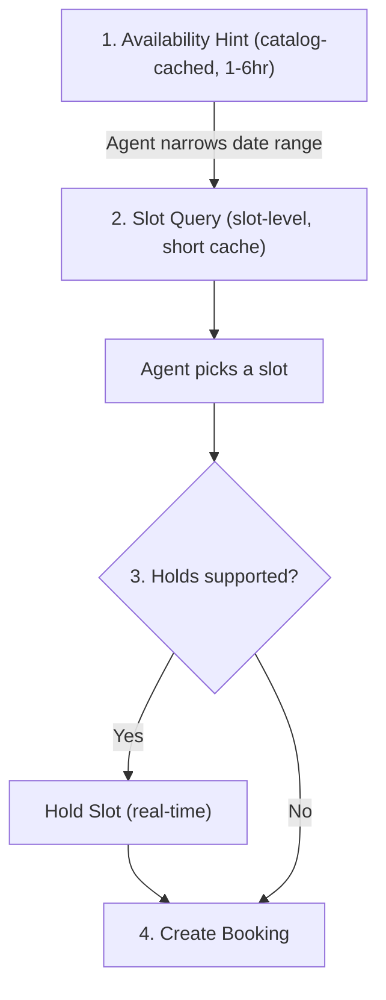

---

## 5. Booking Lifecycle

**Capability:** `dev.usp.services.bookings`

The bookings capability defines the **lifecycle of a service booking** from
creation through completion. For paid services, the bookings capability also
defines the `actions` array (including payment actions with `payment_context`)
and the `confirm-payment` operation for payment confirmation.

> **Single-service design:** USP bookings are single-service by design. Each `POST /bookings` creates exactly one booking for one service at one time slot. This reflects the reality of scheduling flows — buyers typically book one service at a time, and each service occupies a discrete resource (staff, room, equipment) for a specific time window. Multi-service coordination (e.g., a haircut followed by a color treatment, or a gym class plus a personal training session) is handled by the platform issuing separate bookings. A future multi-service booking extension is under consideration.

### 5.1 Booking Status Lifecycle

```
  pending ──────► confirmed ──────► in_progress ──────► completed
    │                │                    │
    │                │                    └──────────► no_show
    │                │
    ▼                ▼
  requires_action   canceled
    │
    ▼ (payment confirmed)
  confirmed
```

| Status            | Description                                                                                                                                                                                                                                                                                                                                                                                                                            |
|-------------------|----------------------------------------------------------------------------------------------------------------------------------------------------------------------------------------------------------------------------------------------------------------------------------------------------------------------------------------------------------------------------------------------------------------------------------------|
| `pending`         | Booking has been created and is awaiting confirmation. For `auto` confirmation mode, this state is transient - the booking moves to `confirmed` immediately (or to `requires_action` if payment is needed). For `manual` mode, the booking remains in `pending` until the business explicitly confirms it.                                                                                                                             |
| `requires_action` | One or more actions in the `actions` array have `status: pending`. Inspect `actions[]` for required tasks (e.g., payment, waiver signing). Each action has a `type`, `status`, `continue_url`, and `expires_at`. The booking **MUST** have this status if and only if `actions[]` contains at least one pending action. When the last pending action completes, the business **MUST** transition the booking out of `requires_action`. |
| `confirmed`       | The booking is confirmed and the service will proceed at the scheduled time. This is reached after auto-confirmation, manual business approval, or successful payment completion (via `confirm-payment` or webhook).                                                                                                                                                                                                                   |
| `in_progress`     | The service is currently being delivered. Transitioned by the business when the appointment/session begins.                                                                                                                                                                                                                                                                                                                            |
| `completed`       | The service has been delivered. Terminal state.                                                                                                                                                                                                                                                                                                                                                                                        |
| `no_show`         | The client did not attend within the grace period defined in the no-show policy. Terminal state. Business **MAY** charge the no-show fee.                                                                                                                                                                                                                                                                                              |
| `canceled`        | The booking has been canceled. Can be reached from `pending`, `requires_action`, or `confirmed`. Terminal state. Cancellation fees may apply per the service's cancellation policy.                                                                                                                                                                                                                                                    |

### 5.2 Booking Schema

> **JSON Schema:** [/$defs/Booking](schemas/booking.json)

The booking object represents a scheduled service instance for a specific buyer
at a specific time.

> **Deployment Mode Note:** In **UCP-Native Mode
** ([Section 7](#7-ucp-native-mode)), the `payment` field is not present on the
> booking object (payment state is managed by the UCP checkout object). The
`actions` array, if present, will not contain `payment`-type actions.
> Non-payment actions (e.g., waivers, intake forms) may still appear and follow
> the same status-actions invariant. In **Standalone Mode
** ([Section 8](#8-standalone-mode)), the `payment` field is present as defined
> in [Section 8.5](#85-payment-integration), and `actions` may contain both
> payment and non-payment action types.

| Field               | Type            | Required    | Description                                                                                                                                                                                                                                                                                                                                                                                                                                                                                                                                               |
|---------------------|-----------------|-------------|-----------------------------------------------------------------------------------------------------------------------------------------------------------------------------------------------------------------------------------------------------------------------------------------------------------------------------------------------------------------------------------------------------------------------------------------------------------------------------------------------------------------------------------------------------------|
| `id`                | string          | **Yes**     | Unique booking identifier, generated by the business.                                                                                                                                                                                                                                                                                                                                                                                                                                                                                                     |
| `service_id`        | string          | **Yes**     | The booked service.                                                                                                                                                                                                                                                                                                                                                                                                                                                                                                                                       |
| `service_name`      | string          | **Yes**     | Service display name, captured at booking time. This is a snapshot - it does not change if the service name is later updated.                                                                                                                                                                                                                                                                                                                                                                                                                             |
| `slot`              | object          | **Yes**     | `{id, start, end, duration}` - the booked time slot.                                                                                                                                                                                                                                                                                                                                                                                                                                                                                                      |
| `buyer`             | Buyer           | **Yes**     | `{first_name, last_name, email, phone_number}` - the person making and paying for the booking. When no `recipient` is provided, the buyer is also the person receiving the service.                                                                                                                                                                                                                                                                                                                                                                       |
| `recipient`         | Buyer           | No          | `{first_name, last_name, email, phone_number}` - the person receiving the service, when different from the buyer (e.g., a parent booking for a child, an assistant booking for their employer, or a gift booking). When absent, the buyer is the recipient. Same schema as `buyer`; not all fields are required — `first_name` and `last_name` **SHOULD** be provided at minimum.                                                                                                                                                                         |
| `party_size`        | integer         | **Yes**     | Total number of attendees. For `appointment` types, this is typically `1`. For `group` and `reservation` types, this reflects the number of spots booked.                                                                                                                                                                                                                                                                                                                                                                                                 |
| `resources`         | Array\[object\] | No          | `{id, type, name}` - the specific resources assigned to this booking (e.g., which stylist, which room).                                                                                                                                                                                                                                                                                                                                                                                                                                                   |
| `location`          | object          | No          | `{id, name}` - the business's location for this booking. Present when `channel.type` is `at_business_location` or `hybrid`. For `at_buyer_location`, see `delivery_address` instead.                                                                                                                                                                                                                                                                                                                                                                    |
| `delivery_address`  | DeliveryAddress | Conditional | The buyer's service delivery address, echoed from the create-booking request. **MUST** be present when the service's `channel.type` is `at_buyer_location`. **MAY** be present for other channels. See [Section 3.3](#33-service-schema) for channel types.                                                                                                                                                                                                                                                                                            |
| `status`            | string          | **Yes**     | Current booking status. See [Section 5.1](#51-booking-status-lifecycle).                                                                                                                                                                                                                                                                                                                                                                                                                                                                                  |
| `confirmation_mode` | string          | **Yes**     | `auto` or `manual`. Reflects the service's confirmation policy at booking time.                                                                                                                                                                                                                                                                                                                                                                                                                                                                           |
| `payment`           | BookingPayment  | Conditional | Payment state. **MUST** be present when the service's `requires_payment` is `true` and `payment_timing` is `at_booking` or `deposit_required`. **MUST** be omitted when `requires_payment` is `false`. **MAY** be present with `status: not_required` when `payment_timing` is `at_service`. See [Section 8.5.1](#851-booking-payment-schema) (Standalone Mode).                                                                                                                                                                                          |
| `actions`           | Array\[Action\] | Conditional | Ordered array of pending tasks the buyer must complete. **MUST** be present and non-empty when `status` is `requires_action`; **MUST** be absent or empty otherwise. The booking has `status: requires_action` if and only if this array contains at least one action with `status: pending`. Each action has `type`, `status`, `continue_url`, `expires_at`, and an optional `message`. The business places actions in recommended completion order; non-payment actions **SHOULD** precede payment actions. See [Section 8.5](#85-payment-integration). |
| `notes`             | string          | No          | Buyer-provided special requests or notes.                                                                                                                                                                                                                                                                                                                                                                                                                                                                                                                 |
| `booking_url`       | string          | No          | Stable URL where the buyer can view and manage this booking. Provided by the business. Used in confirmation emails, calendar events, and buyer portals.                                                                                                                                                                                                                                                                                                                                                                                                   |
| `messages`          | Array\[Message\] | No         | Soft messages from the business providing context about the booking state (e.g., "Manual confirmation required — expect a response within 24 hours", "Free cancellation closes in 2 hours"). Informational only; do not block booking creation. Protocol errors are returned as HTTP error codes, not messages. See [Section 9.2](#92-error-handling) for the distinction.                                                                                                                                                                                 |
| `dispute`           | Dispute         | No          | Present when a payment dispute has been opened for this booking. Opening a dispute does **NOT** change `payment.status` — the payment remains `paid`. Status **MAY** change to `refunded` or `partially_refunded` if the dispute resolves in the buyer's favor. See [Section 5.5.2](#552-dispute-resolution).                                                                                                                                                                                                                                             |
| `cancellation`      | object          | No          | `{reason, canceled_by, fee, refund_amount, canceled_at}` - present when the booking has been canceled.                                                                                                                                                                                                                                                                                                                                                                                                                                                    |
| `created_at`        | string          | **Yes**     | RFC 3339 timestamp of when the booking was created.                                                                                                                                                                                                                                                                                                                                                                                                                                                                                                       |
| `updated_at`        | string          | **Yes**     | RFC 3339 timestamp of the last status change or modification.                                                                                                                                                                                                                                                                                                                                                                                                                                                                                             |
| `expires_at`        | string          | No          | RFC 3339 expiration time. Present for `pending` and `requires_action` bookings. See expiry behavior below.                                                                                                                                                                                                                                                                                                                                                                                                                                                |

**Booking Expiry**

When a `pending` or `requires_action` booking reaches its `expires_at` deadline without being resolved:

1. The business **MUST** transition the booking to `status: canceled`.
2. The business **SHOULD** send a `booking.canceled` webhook so the platform can update its state.
3. The expired booking **MUST** remain retrievable via `GET /bookings/{booking_id}` with `status: canceled` — platforms and businesses need this for audit and reconciliation purposes.
4. The business **MUST** release the underlying slot hold when the booking expires, making the slot available for new bookings.

For hold-backed bookings, the hold's `expires_at` (see [Section 4.2](#42-hold)) **SHOULD** be aligned with or earlier than the booking's `expires_at` to prevent a race condition where the slot is released but the booking has not yet expired.

### 5.3 Operations

#### 5.3.1 Create Booking - `POST /bookings`

> **JSON Schema:** Response — [/$defs/Booking](schemas/booking.json)

Creates a new booking for a service at a specific time slot. Resource selection
(e.g., which staff member or room) is encoded in the `slot_id` — the platform
selects resources by choosing the appropriate slot at availability query time,
not at booking time. When the business supports holds (`"holds": true`), the
platform **SHOULD** hold the slot before creating the booking to prevent race
conditions. When holds are not supported, the platform proceeds directly from
slot query to booking creation. When the person receiving the service is
different from the buyer, the platform **SHOULD** include a `recipient` object.
When the service's `channel.type` is `at_buyer_location`, the platform **MUST**
include `delivery_address`; the business **MUST** reject the request with
`validation_error` ([Section 9.4](#94-error-code-mapping)) if it is missing.

| Field                         | Type    | Required | Description                                                                                                                                                                                                                                 |
|-------------------------------|---------|----------|---------------------------------------------------------------------------------------------------------------------------------------------------------------------------------------------------------------------------------------------|
| `service_id`                  | string  | **Yes**  | The service to book.                                                                                                                                                                                                                        |
| `slot_id`                     | string  | **Yes**  | The selected time slot.                                                                                                                                                                                                                     |
| `hold_id`                     | string  | No       | Hold ID from a prior hold operation. Present only when the business supports holds.                                                                                                                                                         |
| `buyer`                       | object  | **Yes**  | Buyer contact information.                                                                                                                                                                                                                  |
| `recipient`                   | object  | No       | The person receiving the service, when different from the buyer.                                                                                                                                                                            |
| `party_size`                  | integer | No       | Number of participants. Default: 1.                                                                                                                                                                                                         |
| `delivery_address`            | DeliveryAddress | Conditional | The buyer's service delivery address. **MUST** be present when the service's `channel.type` is `at_buyer_location` ([Section 3.3](#33-service-schema)). Echoed back on the `Booking` object.                                     |
| `notes`                       | string  | No       | Free-text notes for the business.                                                                                                                                                                                                           |
| `post_payment_return_request` | object  | No       | The platform's return instruction for when `checkout_systems: redirect` is in use. The platform **SHOULD** always include this field when using the redirect checkout path — without it, the platform has no way to predict where the buyer will land after payment or cancellation. If present, the business **MUST** redirect the buyer's browser (via GET) to the specified URL — with the specified query parameters appended — after payment completes **or** after the buyer cancels or abandons payment. See [Section 8.5.5](#855-redirect-flow-and-post-payment-return). |

> **Idempotency:** Duplicate booking submissions are a real concern — network retries can cause a buyer to be double-booked, which is a serious problem in scheduling (e.g., a patient booked twice for a medical appointment).
>
> - **With a hold:** When `hold_id` is present, the business **SHOULD** treat it as a natural idempotency key. A second `POST /bookings` with the same `hold_id` **MUST** return the existing booking rather than creating a duplicate.
> - **Without a hold:** Platforms **SHOULD** send an `Idempotency-Key` header per [Section 9.1.1](#911-idempotency). The business **MUST** honor it — a second request with the same key **MUST** return the same booking that was created by the first request.

Request (with hold):

```json
{
  "service_id": "svc_massage_001",
  "slot_id": "slot_20260316_1400",
  "hold_id": "hold_xyz789",
  "buyer": {
    "first_name": "Alice",
    "last_name": "Williams",
    "email": "alice@example.com",
    "phone_number": "+12125551234"
  },
  "party_size": 1,
  "notes": "First time visit"
}
```

Request (without hold - business does not support holds):

```json
{
  "service_id": "svc_massage_001",
  "slot_id": "slot_20260316_1400",
  "buyer": {
    "first_name": "Alice",
    "last_name": "Williams",
    "email": "alice@example.com",
    "phone_number": "+12125551234"
  },
  "party_size": 1,
  "notes": "First time visit"
}
```

Request (booking on behalf of another person):

```json
{
  "service_id": "svc_haircut_kids",
  "slot_id": "slot_20260316_1600",
  "hold_id": "hold_abc456",
  "buyer": {
    "first_name": "Alice",
    "last_name": "Williams",
    "email": "alice@example.com",
    "phone_number": "+12125551234"
  },
  "recipient": {
    "first_name": "Max",
    "last_name": "Williams"
  },
  "party_size": 1,
  "notes": "He is 7 years old"
}
```

Request (`field_service`, `channel.type: at_buyer_location`):

```json
{
  "service_id": "svc_hvac_repair_001",
  "slot_id": "slot_20260316_0900",
  "hold_id": "hold_def321",
  "buyer": {
    "first_name": "Alice",
    "last_name": "Williams",
    "email": "alice@example.com",
    "phone_number": "+12125551234"
  },
  "party_size": 1,
  "delivery_address": {
    "line1": "123 Main St",
    "line2": "Suite 4",
    "city": "Brooklyn",
    "region": "NY",
    "postal_code": "11201",
    "country": "US",
    "coordinates": { "lat": 40.6782, "lng": -73.9442 }
  },
  "notes": "Buzzer is broken, please call on arrival"
}
```

Request (paid service, with `post_payment_return_request`):

```json
{
  "service_id": "svc_massage_001",
  "slot_id": "slot_20260316_1400",
  "hold_id": "hold_xyz789",
  "buyer": {
    "first_name": "Alice",
    "last_name": "Williams",
    "email": "alice@example.com",
    "phone_number": "+12125551234"
  },
  "party_size": 1,
  "post_payment_return_request": {
    "url": "https://platform.example.com/booking/return",
    "params": {
      "session_id": "plat-sess-abc123"
    }
  }
}
```

Response (paid service, `payment_timing: at_booking`):

```json
{
  "usp": {
    "version": "2026-02-09",
    "capabilities": {
      "dev.usp.services.bookings": [
        {
          "version": "2026-02-09"
        }
      ]
    }
  },
  "booking": {
    "id": "bkg_456def",
    "service_id": "svc_massage_001",
    "service_name": "Deep Tissue Massage",
    "slot": {
      "id": "slot_20260316_1400",
      "start": "2026-03-16T14:00:00-04:00",
      "end": "2026-03-16T15:00:00-04:00",
      "duration": "PT60M"
    },
    "buyer": {
      "first_name": "Alice",
      "last_name": "Williams",
      "email": "alice@example.com",
      "phone_number": "+12125551234"
    },
    "party_size": 1,
    "resources": [
      {
        "id": "staff_jane",
        "type": "staff",
        "name": "Jane Smith"
      }
    ],
    "status": "requires_action",
    "confirmation_mode": "auto",
    "payment": {
      "status": "pending",
      "timing": "at_booking",
      "amount": 12000,
      "currency": "USD",
      "amount_due": 12000
    },
    "actions": [
      {
        "type": "payment",
        "status": "pending",
        "continue_url": "https://business.example.com/pay/bkg_456def",
        "expires_at": "2026-03-16T13:10:00-04:00",
        "message": {
          "type": "info",
          "code": "payment_required",
          "content": "Payment of $120.00 is required to confirm this booking.",
          "severity": "requires_buyer_input"
        },
        "payment_context": {
          "amount_due": 12000,
          "currency": "USD",
          "description": "Deep Tissue Massage – Mar 16, 2:00 PM",
          "line_items": [
            {
              "label": "Deep Tissue Massage (60 min)",
              "amount": 12000,
              "quantity": 1,
              "item_id": "svc_massage_001"
            }
          ],
          "metadata": {
            "booking_id": "bkg_456def",
            "service_id": "svc_massage_001",
            "service_type": "appointment",
            "slot_start": "2026-03-16T14:00:00-04:00"
          }
        }
      }
    ],
    "created_at": "2026-03-14T22:05:00Z",
    "updated_at": "2026-03-14T22:05:00Z",
    "expires_at": "2026-03-16T13:10:00-04:00"
  }
}
```

Response (free service, `requires_payment: false`):

```json
{
  "usp": {
    "version": "2026-02-09",
    "capabilities": {
      "dev.usp.services.bookings": [
        {
          "version": "2026-02-09"
        }
      ]
    }
  },
  "booking": {
    "id": "bkg_789ghi",
    "service_id": "svc_yoga_free",
    "service_name": "Community Yoga",
    "slot": {
      "id": "slot_20260318_1000",
      "start": "2026-03-18T10:00:00-04:00",
      "end": "2026-03-18T11:00:00-04:00",
      "duration": "PT60M"
    },
    "buyer": {
      "first_name": "Alice",
      "last_name": "Williams",
      "email": "alice@example.com"
    },
    "party_size": 1,
    "status": "confirmed",
    "confirmation_mode": "auto",
    "created_at": "2026-03-14T22:05:00Z",
    "updated_at": "2026-03-14T22:05:00Z"
  }
}
```

#### 5.3.2 Get Booking - `GET /bookings/{booking_id}`

> **JSON Schema:** Response — [/$defs/Booking](schemas/booking.json)

Returns the current state of a booking. Same structure as the booking object
above.

#### 5.3.3 Update Booking - `PUT /bookings/{booking_id}`

> **JSON Schema:** Response — [/$defs/Booking](schemas/booking.json)

Updates mutable fields on a booking. Only `buyer`, `recipient`, `delivery_address`,
and `notes` are mutable after creation. Fields omitted from the request body are
left unchanged (partial update semantics). Returns the full updated booking
object.

| Field              | Type            | Required | Description                                                    |
|--------------------|-----------------|----------|-----------------------------------------------------------------|
| `buyer`            | object          | No       | Updated buyer contact information (`first_name`, `last_name`, `email`, `phone_number`). |
| `recipient`        | object          | No       | Updated recipient information, when different from the buyer.  |
| `delivery_address` | DeliveryAddress | No       | Updated service delivery address. Only meaningful when the service's `channel.type` is `at_buyer_location`. |
| `notes`            | string          | No       | Updated buyer-provided special requests or notes.              |

Response: the full updated `booking` object with `updated_at` reflecting the modification time.

```json
{
  "booking": {
    "id": "bkg_456def",
    "notes": "Please use hypoallergenic products",
    "buyer": {
      "first_name": "Alice",
      "last_name": "Williams",
      "email": "alice.new@example.com",
      "phone_number": "+12125551234"
    },
    "updated_at": "2026-03-15T10:00:00Z"
  }
}
```

#### 5.3.4 Confirm Booking - `POST /bookings/{booking_id}/confirm`

> **JSON Schema:** Response — [/$defs/Booking](schemas/booking.json)

Business-initiated confirmation for bookings with `confirmation_mode: manual`.
Transitions the booking from `pending` to `confirmed`. Only applicable when
`confirmation_mode` is `manual` — calling this on an `auto`-mode booking that is
already `confirmed` **MUST** return the current booking state (idempotent). The
business **SHOULD** send a `booking.confirmed` webhook after confirming.

| Field   | Type   | Required | Description                                         |
|---------|--------|----------|-----------------------------------------------------|
| `notes` | string | No       | Optional message from the business to the buyer (e.g., "Your appointment is confirmed. Please arrive 10 minutes early."). |

Response: the full updated `booking` object with `status: confirmed`.

```json
{
  "booking": {
    "id": "bkg_456def",
    "status": "confirmed",
    "confirmation_mode": "manual",
    "updated_at": "2026-03-15T09:00:00Z"
  }
}
```

#### 5.3.5 Cancel Booking - `POST /bookings/{booking_id}/cancel`

> **JSON Schema:** Response — [/$defs/Booking](schemas/booking.json)

Cancels a booking. Eligible from `pending`, `requires_action`, or `confirmed`
status. Cancellation fees are applied per the service's cancellation policy (see
[Section 3.9](#39-service-policies)). The business **SHOULD** send a
`booking.canceled` webhook after cancellation. The business **MUST** release the
underlying slot so it becomes available for new bookings.

| Field         | Type   | Required | Description                                                                                   |
|---------------|--------|----------|-----------------------------------------------------------------------------------------------|
| `reason`      | string | No       | Human-readable cancellation reason from the initiating party.                                 |
| `canceled_by` | string | No       | Who initiated the cancellation: `buyer`, `business`, or `system`. Default: `buyer`.           |

Response: the full updated `booking` object with `status: canceled` and the `cancellation` object populated.

```json
{
  "booking": {
    "id": "bkg_456def",
    "status": "canceled",
    "cancellation": {
      "reason": "Schedule conflict",
      "canceled_by": "buyer",
      "fee": 0,
      "refund_amount": 12000,
      "canceled_at": "2026-03-15T08:30:00Z"
    },
    "payment": {
      "status": "refunded",
      "timing": "at_booking",
      "amount": 12000,
      "currency": "USD",
      "amount_due": 0,
      "transaction_id": "txn_abc123"
    },
    "updated_at": "2026-03-15T08:30:00Z"
  }
}
```

#### 5.3.6 Reschedule Booking - `POST /bookings/{booking_id}/reschedule`

> **JSON Schema:** Response — [/$defs/Booking](schemas/booking.json)

Moves a booking to a different time slot. Rescheduling preserves the booking
`id` — this is not a cancel + rebook. The original slot is released and the new
slot is occupied. Rescheduling limits and fees are governed by the service's
rescheduling policy (see [Section 3.9](#39-service-policies)).

**Eligible statuses:** `confirmed` (**MUST** be supported). `pending`
**SHOULD** be allowed. `requires_action` is at the business's discretion.
Rescheduling a `canceled` or terminal-state booking **MUST** return a 409 error.

When the business supports holds, the platform **SHOULD** hold the new slot
before rescheduling to prevent a race condition. When holds are not supported,
the platform provides only the new `slot_id`. The business **SHOULD** send a
`booking.rescheduled` webhook after the operation.

| Field     | Type   | Required | Description                                                              |
|-----------|--------|----------|--------------------------------------------------------------------------|
| `slot_id` | string | **Yes**  | The new slot to reschedule to.                                           |
| `hold_id` | string | No       | Hold ID for the new slot. Present only when the business supports holds. |

Response: the full updated `booking` object with `slot` updated to the new time.

**Price changes on reschedule:** When slot-level pricing differs between the
original and new slot (e.g., rescheduling from an off-peak to a peak slot), the
business **SHOULD** update `payment.amount` to reflect the new price. If
additional payment is required, the business **MUST** set a new
`payment.amount_due` and add a new `payment`-type action to `actions[]`,
transitioning the booking to `requires_action` until the additional payment is
collected.

#### 5.3.7 Confirm Payment - `POST /bookings/{booking_id}/confirm-payment`

> **JSON Schema:** Response — [/$defs/Booking](schemas/booking.json)

The universal callback that the platform calls after payment succeeds. This
completes the payment action in the booking's `actions` array. Per the
status-actions invariant, if no pending actions remain after the payment action
is completed, the booking transitions to `confirmed`. If other actions remain
pending, the booking stays in `requires_action` with updated `actions[]`.

The business **MAY** reject this call if non-payment actions are still pending,
returning a response-level `messages[]` error with code `actions_pending`.

Request:

```json
{
  "payment_result": {
    "status": "paid",
    "provider": "stripe",
    "transaction_id": "txn_abc123",
    "amount_paid": 12000,
    "currency": "USD",
    "order_reference": "ord_xyz789"
  }
}
```

Response:

```json
{
  "usp": {
    "version": "2026-02-09",
    "capabilities": {
      "dev.usp.services.bookings": [
        {
          "version": "2026-02-09"
        }
      ]
    }
  },
  "booking": {
    "id": "bkg_456def",
    "status": "confirmed",
    "payment": {
      "status": "paid",
      "timing": "at_booking",
      "amount": 12000,
      "currency": "USD",
      "amount_due": 0,
      "transaction_id": "txn_abc123",
      "order_reference": "ord_xyz789"
    },
    "updated_at": "2026-03-14T22:06:00Z"
  }
}
```

The `payment_result` fields:

| Field             | Type    | Required | Description                                                                                      |
|-------------------|---------|----------|--------------------------------------------------------------------------------------------------|
| `status`          | string  | **Yes**  | Payment outcome. `paid`: full amount collected. `deposit_paid`: deposit amount collected.        |
| `provider`        | string  | No       | Payment provider identifier (e.g., `stripe`, `adyen`, `paypal`). Informational.                  |
| `transaction_id`  | string  | **Yes**  | Transaction identifier from the payment provider. Used for reconciliation and refund processing. |
| `amount_paid`     | integer | **Yes**  | Amount paid in minor currency units.                                                             |
| `currency`        | string  | **Yes**  | ISO 4217 currency code.                                                                          |
| `order_reference` | string  | No       | External order identifier from the checkout system. Used for cross-system reconciliation.        |

If the booking has already been confirmed (idempotent call) or has expired, the
business **MUST** return the current booking state. The **response** includes a
`messages[]` entry indicating the condition.

See [Section 7](#7-ucp-native-mode) (UCP-Native Mode)
and [Section 8.5.6](#856-acp-booking-extension) (ACP Booking Extension) for
checkout-specific payment flows.

### 5.4 Webhooks

Businesses **SHOULD** notify platforms of state changes via webhooks. Webhook
payloads **MUST** be signed (see [Section 10.1.1](#1011-webhook-security)).

#### 5.4.1 Booking Webhooks

> **JSON Schema:** [`schemas/webhook_event.json`](schemas/webhook_event.json) (`$defs/BookingEvent`). OpenAPI: [`openapi/usp-rest.json`](openapi/usp-rest.json) `webhooks.bookingEvent`.

| Event                      | Trigger                                                  |
|----------------------------|----------------------------------------------------------|
| `booking.confirmed`        | Business confirms (manual mode) or payment completes     |
| `booking.canceled`         | Business or system cancels the booking                   |
| `booking.rescheduled`      | Business reschedules the booking                         |
| `booking.reminder`         | Upcoming appointment reminder (e.g., 24 hours before)    |
| `booking.completed`        | Service has been delivered                               |
| `booking.no_show`          | Client did not attend within the grace period            |
| `booking.refund_issued`    | A full or partial refund has been issued                 |
| `booking.dispute_opened`   | A dispute or chargeback has been opened for this booking |
| `booking.dispute_resolved` | A dispute has been resolved                              |
| `booking.service_started`  | Service delivery has begun (e.g., rental pickup, appointment check-in) |
| `booking.service_updated`  | Service details changed during delivery (e.g., extended rental, additional treatment) |

**Webhook payload schema:**

| Field          | Type    | Required | Description                                                                                                                                                                                                               |
|----------------|---------|----------|---------------------------------------------------------------------------------------------------------------------------------------------------------------------------------------------------------------------------|
| `event`        | string  | **Yes**  | Event type (e.g., `booking.confirmed`, `booking.canceled`).                                                                                                                                                               |
| `event_id`     | string  | **Yes**  | Unique event identifier. Platforms **MUST** use this for idempotent processing ([Section 9.2.3](#923-webhook-notifications)).                                                                                        |
| `booking_id`   | string  | **Yes**  | The booking this event relates to.                                                                                                                                                                                        |
| `order_id`     | string  | No       | UCP order ID. **SHOULD** be included when the booking was created via [UCP-Native Mode](#7-ucp-native-mode) checkout, and **SHOULD** equal the completed checkout's `order.id` ([Section 7.5](#75-checkout-flow-and-atomicity-guarantee)). |
| `timestamp`    | string  | **Yes**  | RFC 3339 timestamp of when the event occurred.                                                                                                                                                                            |
| `data`         | object  | No       | Full booking object (same schema as [Section 5.2](#52-booking-schema)). **SHOULD** be included for `confirmed`, `canceled`, `rescheduled`, `completed`, `no_show`, `refund_issued`, `dispute_opened`, and `dispute_resolved` events. **MAY** be omitted for `reminder` events (the `booking_id` is sufficient to fetch current state). For informational `service_started` and `service_updated` events ([Section 5.5.3](#553-service-delivery-events)), **MAY** be omitted or included as needed. |

```json
{
  "event": "booking.confirmed",
  "event_id": "evt_789abc",
  "booking_id": "bkg_456def",
  "order_id": "ord_ucp_001",
  "timestamp": "2026-03-15T09:00:00Z",
  "data": {
    "id": "bkg_456def",
    "service_id": "svc_massage_001",
    "service_name": "Deep Tissue Massage",
    "slot": {
      "id": "slot_20260316_1400",
      "start": "2026-03-16T14:00:00-04:00",
      "end": "2026-03-16T15:00:00-04:00",
      "duration": "PT60M"
    },
    "buyer": {
      "first_name": "Alice",
      "last_name": "Williams",
      "email": "alice@example.com"
    },
    "party_size": 1,
    "status": "confirmed",
    "confirmation_mode": "manual",
    "created_at": "2026-03-14T22:05:00Z",
    "updated_at": "2026-03-15T09:00:00Z"
  }
}
```

#### 5.4.2 Catalog Change Webhooks

> **JSON Schema:** [`schemas/webhook_event.json`](schemas/webhook_event.json) (`$defs/CatalogEvent`). OpenAPI: [`openapi/usp-rest.json`](openapi/usp-rest.json) `webhooks.catalogEvent`.

Businesses **SHOULD** notify platforms of catalog changes via webhooks. This
provides a push-based complement to the pull-based service catalog
feed ([Section 3.1](#31-service-catalog-feed)). Catalog webhooks ride on the
same webhook infrastructure (RFC 9421 signing, `keys` / transition
`signing_keys`, verification flow) defined in [Section 10.1.1](#1011-webhook-security).

| Event               | Trigger                                                                         |
|---------------------|---------------------------------------------------------------------------------|
| `service.created`   | A new service has been added to the catalog                                     |
| `service.updated`   | Service details have changed (pricing, policies, resources, availability, etc.) |
| `service.deleted`   | A service has been permanently removed from the catalog                         |
| `service.suspended` | A service is temporarily unavailable (e.g., seasonal, staffing shortage)        |

**Webhook payload schema:**

| Field             | Type    | Required | Description                                                                                                                        |
|-------------------|---------|----------|------------------------------------------------------------------------------------------------------------------------------------|
| `event`           | string  | **Yes**  | Event type (e.g., `service.created`, `service.updated`, `service.deleted`, `service.suspended`).                                   |
| `event_id`        | string  | **Yes**  | Unique event identifier for idempotent processing.                                                                                  |
| `service_id`      | string  | **Yes**  | The service this event relates to.                                                                                                 |
| `subscription_id` | string  | **Yes**  | The subscription that triggered this notification.                                                                                 |
| `timestamp`       | string  | **Yes**  | RFC 3339 timestamp of when the event occurred.                                                                                     |
| `data`            | object  | No       | Full service object for `service.created` and `service.updated` (same schema as [Section 3.3](#33-service-schema)). **SHOULD** be included for create/update events. For `service.deleted` and `service.suspended`, **MAY** be omitted (the `service_id` is sufficient). |

```json
{
  "event": "service.updated",
  "event_id": "evt_catalog_001",
  "service_id": "svc_haircut_001",
  "subscription_id": "sub_feed_001",
  "timestamp": "2026-03-15T14:30:00Z",
  "data": {
    "id": "svc_haircut_001",
    "business_id": "biz_glamour_salon_nyc",
    "name": "Women's Haircut & Style",
    "pricing": {
      "model": "fixed",
      "amount": 8000,
      "currency": "USD"
    },
    "...": "full service object"
  }
}
```

Platforms receiving catalog webhooks **SHOULD** update their cached catalog data
accordingly. Catalog webhooks are complementary to - not a replacement for - the
feed endpoint. Platforms that rely solely on polling **MAY** ignore catalog
webhooks.

### 5.5 Post-Booking Lifecycle

After a booking reaches a terminal state (`completed`, `no_show`, `canceled`),
additional lifecycle events may occur.

#### 5.5.1 Refund Tracking

When a refund is issued, the booking's `payment` object **MUST** be updated:

| `payment.status`     | Description                                                                                                 |
|----------------------|-------------------------------------------------------------------------------------------------------------|
| `refunded`           | Full refund issued. `refund_amount` equals `amount` (or `deposit_amount` for deposit bookings).             |
| `partially_refunded` | Partial refund issued. `refund_amount` is less than the collected amount (e.g., cancellation fee withheld). |

The business **MUST** send a `booking.refund_issued` webhook when a refund is
processed. Refund processing is handled through the checkout system that
originally processed the payment. The `order_reference` field on the booking's
payment object links back to the checkout system's order for refund operations.

#### 5.5.2 Dispute Resolution

When a payment dispute (chargeback) is opened against a booking, the business
**SHOULD** update the booking with dispute information and notify the platform
via the `booking.dispute_opened` webhook.

> **JSON Schema:** [/$defs/Dispute](schemas/booking.json)

The `dispute` object on the booking:

| Field         | Type   | Required | Description                                                                                                            |
|---------------|--------|----------|------------------------------------------------------------------------------------------------------------------------|
| `status`      | string | **Yes**  | `opened`, `under_review`, `resolved_buyer` (resolved in buyer's favor), `resolved_business` (resolved in business's favor). |
| `reason`      | string | **Yes**  | Machine-readable reason code. Well-known values: `service_not_provided`, `quality_issue`, `unauthorized`, `duplicate`. |
| `opened_at`   | string | **Yes**  | RFC 3339 timestamp of when the dispute was opened.                                                                     |
| `resolved_at` | string | No       | RFC 3339 timestamp of when the dispute was resolved. Present only when `status` is `resolved_buyer` or `resolved_business`. |

**Payment status and disputes:** Opening a dispute does **NOT** change
`payment.status` — the payment remains `paid` while the dispute is under review.
`payment.status` **MAY** change to `refunded` or `partially_refunded` only if
the dispute resolves in the buyer's favor (i.e., `dispute.status:
resolved_buyer`). If the dispute resolves in the business's favor, `payment.status`
remains `paid`. The business **MUST** send a `booking.dispute_resolved` webhook
when the dispute is resolved.

#### 5.5.3 Service Delivery Events

For complex services (e.g., multi-step healthcare, ongoing rentals), businesses
**MAY** emit intermediate delivery events:

| Event                     | Trigger                                                                               |
|---------------------------|---------------------------------------------------------------------------------------|
| `booking.service_started` | The service delivery has begun (e.g., rental pickup, appointment check-in)            |
| `booking.service_updated` | Service details changed during delivery (e.g., extended rental, additional treatment) |

These events are informational and do not change the booking's primary status.
They use the standard booking webhook payload (`BookingEvent`) defined in
[Section 5.4.1](#541-booking-webhooks).


---

## 6. Discovery Registry (Optional)

**Capability:** `dev.usp.discovery.registry` (optional extension)

This section defines **catalog discovery** via an optional registry: how a
platform finds USP-enabled businesses and services when it does not already
know a business's domain. **Profile discovery** (fetching `/.well-known/usp` or
`/.well-known/ucp` for a known business) is defined in
[Section 8.2](#82-business-profile-well-knownusp) and
[Section 7.2](#72-profile-registration-in-well-knownucp). See
[Section 1.2](#12-terminology) for normative definitions of catalog discovery,
profile discovery, and platform onboarding.

Once a business is known, platforms fetch its profile (`/.well-known/usp` in
Standalone Mode or `/.well-known/ucp` in UCP-Native Mode). This section defines
an optional registry mechanism for the **cold-start problem**: how does a
platform discover USP-enabled businesses when it does not yet have a domain?

A USP registry is a centralized or federated **directory** that maintains a
searchable list of USP-enabled businesses, regardless of their deployment mode.
Registries enable platforms to discover businesses by location, vertical,
category, or keyword.

**Registry operations are not platform onboarding.** Registering a business in
a discovery registry is a **directory listing** (publication of search metadata
and a `profile_url`). It is **not** credential exchange, OAuth/DCR, checkout-path
binding, or any other platform-business relationship setup. Those activities are
**platform onboarding** ([Section 1.2](#12-terminology)) and occur out-of-band.

### 6.1 Business Registration - `POST /registry/businesses`

> **JSON Schema:** Request — [/$defs/RegistrationRequest](schemas/registry.json) · Response `registration` — [/$defs/RegistryEntry](schemas/registry.json) · **REST:** [openapi/usp-rest.json](openapi/usp-rest.json) (`POST /registry/businesses`) · **MCP:** [openrpc/usp-mcp.json](openrpc/usp-mcp.json) (`usp_registry_register`)

Request:

```json
{
  "profile_url": "https://sunrisewellness.com/.well-known/usp",
  "deployment_mode": "standalone",
  "name": "Sunrise Wellness Studio",
  "description": "Full-service wellness studio offering massage, facials, and yoga classes.",
  "verticals": [
    "appointment",
    "group"
  ],
  "categories": [
    "wellness",
    "beauty",
    "fitness"
  ],
  "location": {
    "address": "123 Main St, New York, NY 10001",
    "coordinates": {
      "lat": 40.7484,
      "lng": -73.9967
    }
  },
  "timezone": "America/New_York"
}
```

| Field             | Type            | Required    | Description                                                                                                                                                    |
|-------------------|-----------------|-------------|----------------------------------------------------------------------------------------------------------------------------------------------------------------|
| `profile_url`     | string (URL)    | **Yes**     | The URL of the business's USP profile. For Standalone Mode businesses, this is `/.well-known/usp`. For UCP-Native Mode businesses, this is `/.well-known/ucp`. |
| `deployment_mode` | string          | **Yes**     | The deployment mode of the business. **MUST** be one of `standalone` or `ucp_native`.                                                                          |
| `name`            | string          | **Yes**     | Human-readable business name.                                                                                                                                  |
| `description`     | string          | No          | Brief human-readable description of the business (e.g., for discovery cards and search snippets).                                                              |
| `verticals`       | Array\[string\] | **Yes**     | Service verticals offered by the business (e.g., `appointment`, `group`).                                                                                      |
| `categories`      | Array\[string\] | **Yes**     | Business categories for search and filtering.                                                                                                                  |
| `location`        | object          | Conditional | Physical location with `address` (string) and `coordinates` (`{lat, lng}`). **REQUIRED** when the business offers any `at_business_location` or `hybrid` channel services. **MAY** be omitted for businesses offering only `at_buyer_location`, `virtual`, or `phone` services. |
| `timezone`        | string          | **Yes**     | IANA timezone identifier (e.g., `America/New_York`).                                                                                                           |

Registries indexing virtual-only businesses (no `location`) **MUST** exclude them from location-filtered search results and **SHOULD** return them only when no geographic filter is applied.

Response:

```json
{
  "usp": {
    "version": "2026-02-09",
    "capabilities": {
      "dev.usp.discovery.registry": [
        {
          "version": "2026-02-09"
        }
      ]
    }
  },
  "registration": {
    "id": "reg_sunrise_001",
    "profile_url": "https://sunrisewellness.com/.well-known/usp",
    "deployment_mode": "standalone",
    "name": "Sunrise Wellness Studio",
    "description": "Full-service wellness studio offering massage, facials, and yoga classes.",
    "verticals": [
      "appointment",
      "group"
    ],
    "categories": [
      "wellness",
      "beauty",
      "fitness"
    ],
    "location": {
      "address": "123 Main St, New York, NY 10001",
      "coordinates": {
        "lat": 40.7484,
        "lng": -73.9967
      }
    },
    "timezone": "America/New_York",
    "status": "active",
    "created_at": "2026-03-14T10:00:00Z"
  }
}
```

The `usp` envelope in registry responses describes the **registry's own** protocol and capability declaration, not the registered business's capabilities. It follows the standard USP response envelope ([Section 9](#9-transport-bindings)).

The registry **MUST** validate that the `profile_url` is reachable and returns a
valid USP or UCP profile (depending on the declared `deployment_mode`) before
accepting the registration.

Registration failures (e.g., unreachable `profile_url`, invalid `deployment_mode`) **MUST** be reported using the error model defined in [Section 9.4](#94-error-code-mapping). The `profile_unreachable` and `validation_error` codes apply.

### 6.2 Business Search - `POST /registry/search_business`

> **JSON Schema:** [/$defs/BusinessSearchRequest](schemas/registry.json) · **REST:** [openapi/usp-rest.json](openapi/usp-rest.json) (`POST /registry/search_business`) · **MCP:** [openrpc/usp-mcp.json](openrpc/usp-mcp.json) (`usp_registry_search_business`)

Request:

```json
{
  "location": {
    "coordinates": {
      "lat": 40.7484,
      "lng": -73.9967
    },
    "radius_km": 10
  },
  "verticals": [
    "appointment"
  ],
  "categories": [
    "wellness"
  ],
  "query": "massage",
  "deployment_mode": "standalone",
  "context": {
    "locale": "en-US",
    "currency": "USD"
  },
  "pagination": {
    "limit": 20,
    "cursor": null
  }
}
```

| Field             | Type            | Required | Description                                                                 |
|-------------------|-----------------|----------|-----------------------------------------------------------------------------|
| `location`        | object          | No       | Geographic filter: `coordinates` (`{lat, lng}`) and `radius_km` (kilometers). See [Section 6.3.1](#631-filter-matching-semantics). |
| `verticals`       | Array\[string\] | No       | Filter by service verticals (OR within field). See [Section 6.3.1](#631-filter-matching-semantics). |
| `categories`      | Array\[string\] | No       | Filter by business categories (OR within field). See [Section 6.3.1](#631-filter-matching-semantics). |
| `query`           | string          | No       | Free-text search across business names and categories.                      |
| `deployment_mode` | string          | No       | Filter by `standalone` or `ucp_native`. When omitted, returns both modes. |
| `context`         | object          | No       | Localization hints: `locale` (BCP 47) and `currency` (ISO 4217). See below. |
| `pagination`      | object          | No       | Cursor-based pagination. See [Section 9.1.2](#912-pagination).                 |

**`context` object (optional):**

| Field      | Type   | Description                                                                 |
|------------|--------|-----------------------------------------------------------------------------|
| `locale`   | string | BCP 47 language tag (e.g., `en-US`). Influences result ranking and display. |
| `currency` | string | ISO 4217 currency code (e.g., `USD`). Display/ranking hint; may supply the resolved match currency when `price_range.currency` is omitted on service search ([Section 6.3.1](#631-filter-matching-semantics)). |

The request **MUST** contain at least one search filter (`location`, `verticals`, `categories`, `query`, or `deployment_mode`). Registries **MUST** reject requests with no search filters by returning a `validation_error` message ([Section 9.4](#94-error-code-mapping)). A request containing only `pagination` and/or `context` is invalid.

Search operations that match no results **MUST** return HTTP 200 with an empty `businesses[]` array and no error messages. Invalid or malformed requests **MUST** use the error codes from [Section 9.4](#94-error-code-mapping).

Filter matching for `location`, `verticals`, and `categories` follows [Section 6.3.1](#631-filter-matching-semantics).

Response:

```json
{
  "usp": {
    "version": "2026-02-09",
    "capabilities": {
      "dev.usp.discovery.registry": [
        {
          "version": "2026-02-09"
        }
      ]
    }
  },
  "businesses": [
    {
      "id": "reg_sunrise_001",
      "profile_url": "https://sunrisewellness.com/.well-known/usp",
      "deployment_mode": "standalone",
      "name": "Sunrise Wellness Studio",
      "description": "Full-service wellness studio offering massage, facials, and yoga classes.",
      "verticals": [
        "appointment",
        "group"
      ],
      "categories": [
        "wellness",
        "beauty",
        "fitness"
      ],
      "location": {
        "address": "123 Main St, New York, NY 10001",
        "coordinates": {
          "lat": 40.7484,
          "lng": -73.9967
        }
      },
      "timezone": "America/New_York",
      "status": "active",
      "created_at": "2026-03-01T10:00:00Z"
    },
    {
      "id": "reg_serenity_002",
      "profile_url": "https://serenityspa.example.com/.well-known/usp",
      "deployment_mode": "standalone",
      "name": "Serenity Spa & Massage",
      "description": "Boutique spa and massage therapy in Manhattan.",
      "verticals": [
        "appointment"
      ],
      "categories": [
        "wellness",
        "beauty"
      ],
      "location": {
        "address": "456 Oak Ave, New York, NY 10002",
        "coordinates": {
          "lat": 40.7521,
          "lng": -73.9812
        }
      },
      "timezone": "America/New_York",
      "status": "active",
      "created_at": "2026-03-05T14:30:00Z"
    }
  ],
  "pagination": {
    "cursor": "cursor_abc123",
    "has_more": true
  }
}
```

### 6.3 Service Search - `POST /registry/search_services`

A platform can search the registry for specific **services** offered by
registered businesses. This enables more granular discovery -- rather than
finding businesses and then querying each one for services, the platform can
directly search across all registered businesses' services.

> **JSON Schema:** Request — [/$defs/ServiceSearchRequest](schemas/registry.json) · Response items — [/$defs/ServiceSearchResult](schemas/registry.json) · Pricing aligns with [/$defs/Pricing](schemas/catalog.json) · Availability hint aligns with [/$defs/AvailabilityHint](schemas/catalog.json) · **REST:** [openapi/usp-rest.json](openapi/usp-rest.json) (`POST /registry/search_services`) · **MCP:** [openrpc/usp-mcp.json](openrpc/usp-mcp.json) (`usp_registry_search_services`)

Request:

```json
{
  "location": {
    "coordinates": {
      "lat": 40.7484,
      "lng": -73.9967
    },
    "radius_km": 10
  },
  "verticals": [
    "appointment"
  ],
  "categories": [
    "wellness"
  ],
  "query": "deep tissue massage",
  "price_range": {
    "min": 5000,
    "max": 20000,
    "currency": "USD",
    "match": "overlap"
  },
  "duration_range": {
    "min_minutes": 30,
    "max_minutes": 90,
    "match": "overlap"
  },
  "context": {
    "locale": "en-US",
    "currency": "USD"
  },
  "pagination": {
    "limit": 20,
    "cursor": null
  }
}
```

| Field            | Type            | Required | Description                                                                   |
|------------------|-----------------|----------|-------------------------------------------------------------------------------|
| `location`       | object          | No       | Geographic filter: `coordinates` (`{lat, lng}`) and `radius_km` (kilometers). See [Section 6.3.1](#631-filter-matching-semantics). |
| `verticals`      | Array\[string\] | No       | Filter by service verticals (OR within field). See [Section 6.3.1](#631-filter-matching-semantics). |
| `categories`     | Array\[string\] | No       | Filter by service categories (OR within field). See [Section 6.3.1](#631-filter-matching-semantics). |
| `query`          | string          | No       | Free-text search across service names, descriptions, and categories.            |
| `price_range`    | object          | No       | Price filter: `{min, max, currency, match?}`. Amounts in minor currency units. See [Section 6.3.1](#631-filter-matching-semantics). |
| `duration_range` | object          | No       | Duration filter: `{min_minutes, max_minutes, match?}`. See [Section 6.3.1](#631-filter-matching-semantics). |
| `context`        | object          | No       | Localization hints: `locale` (BCP 47) and `currency` (ISO 4217). See [Section 6.2](#62-business-search---post-registrysearch_business). |
| `pagination`     | object          | No       | Cursor-based pagination. See [Section 9.1.2](#912-pagination).                     |

The request **MUST** contain at least one search filter (`location`, `verticals`, `categories`, `query`, `price_range`, or `duration_range`). Registries **MUST** reject requests with no search filters by returning a `validation_error` message ([Section 9.4](#94-error-code-mapping)). A request containing only `pagination` and/or `context` is invalid.

Search operations that match no results **MUST** return HTTP 200 with an empty `services[]` array and no error messages. Invalid or malformed requests **MUST** use the error codes from [Section 9.4](#94-error-code-mapping).

Filter matching semantics for all registry search filters are defined in [Section 6.3.1](#631-filter-matching-semantics).

Response:

```json
{
  "usp": {
    "version": "2026-02-09",
    "capabilities": {
      "dev.usp.discovery.registry": [
        {
          "version": "2026-02-09"
        }
      ]
    }
  },
  "services": [
    {
      "service_id": "svc_deep_tissue_60",
      "service_name": "Deep Tissue Massage - 60 min",
      "business": {
        "id": "reg_sunrise_001",
        "profile_url": "https://sunrisewellness.com/.well-known/usp",
        "deployment_mode": "standalone",
        "name": "Sunrise Wellness Studio"
      },
      "category": "wellness",
      "duration_minutes": 60,
      "pricing": {
        "model": "fixed",
        "amount": 12000,
        "currency": "USD"
      },
      "location": {
        "address": "123 Main St, New York, NY 10001",
        "coordinates": {
          "lat": 40.7484,
          "lng": -73.9967
        }
      },
      "timezone": "America/New_York",
      "last_indexed_at": "2026-03-14T08:00:00Z",
      "availability_hint": {
        "summary": "Good availability this week, especially Tuesday and Wednesday afternoons.",
        "generated_at": "2026-03-14T07:00:00Z",
        "next_available_date": "2026-03-15"
      }
    },
    {
      "service_id": "svc_massage_90",
      "service_name": "Therapeutic Deep Tissue - 90 min",
      "business": {
        "id": "reg_serenity_002",
        "profile_url": "https://serenityspa.example.com/.well-known/usp",
        "deployment_mode": "standalone",
        "name": "Serenity Spa & Massage"
      },
      "category": "wellness",
      "duration_minutes": 90,
      "pricing": {
        "model": "variable",
        "currency": "USD",
        "price_range": {
          "min": 15000,
          "max": 22000
        }
      },
      "location": {
        "address": "456 Oak Ave, New York, NY 10002",
        "coordinates": {
          "lat": 40.7521,
          "lng": -73.9812
        }
      },
      "timezone": "America/New_York",
      "last_indexed_at": "2026-03-14T07:30:00Z"
    }
  ],
  "pagination": {
    "cursor": "cursor_svc_xyz",
    "has_more": true
  }
}
```

The `query` field performs a full-text search across service names, descriptions,
and categories.

`ServiceSearchResult.category` is a flat string projected from the catalog
service's primary `categories[]` entry. Pick order: primary `name`, else primary
`value`, else primary `id`, else the first entry's `value`, else the service
`type`. The registry wire model keeps this flat string; it does not expand the
catalog category object.

Registries **SHOULD** index services from registered businesses by subscribing to catalog changes via feed subscriptions ([Section 3.12.2](#3122-feed-subscriptions---post-servicesfeedsubscriptions)) where the business supports them, rather than relying solely on periodic polling. For businesses that do not support feed subscriptions, registries **SHOULD** re-index at most every 24 hours. Registry search results are **non-authoritative snapshots**; platforms **MUST** fetch the business's live profile and catalog for booking-time decisions. Registries **SHOULD** include `last_indexed_at` (ISO 8601 datetime) on each service search result so platforms can assess data freshness. When the indexed catalog service includes an `availability_hint` ([Section 3.6](#36-availability-hint)), registries **SHOULD** pass it through on each `ServiceSearchResult` so agents can reason about near-term availability without an extra catalog fetch. Platforms **MUST NOT** treat the hint as authoritative or use it as a hard availability filter; it is an approximate, cached signal for ranking context and date-range scoping only.

### 6.3.1 Filter Matching Semantics

Filters are hard constraints (yes/no). Ranking and free-text `query` scoring **MAY** differ across registries; match predicates **MUST** follow this section so federated registries return the same inclusion set for identical filters. Canonical schema descriptions (including worked examples) live in [`schemas/registry.json`](schemas/registry.json) (`PriceRangeFilter`, `DurationRangeFilter`, `RangeMatchMode`, `RegistrySearchLocation`).

**Composition**

- Distinct filter fields combine with **AND**.
- `verticals[]` and `categories[]` use **OR within the field** (match any listed value).
- Zero matches **MUST** return HTTP 200 with an empty result array (never an error for "no hits"). Requests with no real search filter **MUST** return `validation_error` ([Section 6.2](#62-business-search---post-registrysearch_business), [Section 6.3](#63-service-search---post-registrysearch_services)).

**Geographic (`location`)**

- `radius_km` is kilometers.
- Businesses or services with no coordinates (virtual/phone only) **MUST** be excluded when any location filter is present, and **SHOULD** appear only when no geographic filter is applied. This rule applies to search as well as registration indexing ([Section 6.1](#61-business-registration---post-registrybusinesses)).

**Range filters (`price_range`, `duration_range`)**

Optional `match` compares service interval **S** to filter interval **F**:

| `match` | Predicate | Default |
|---------|-----------|---------|
| `overlap` | S ∩ F ≠ ∅ | **Yes** (when `match` omitted) |
| `contained` | S ⊆ F | |
| `contains` | S ⊇ F | |
| `equals` | S = F | |

Omitted bounds on F are unbounded on that side. Point intervals (min = max) are valid.

Worked duration example: service offered **30–90 min**, filter `{ min_minutes: 60, max_minutes: 60 }` → `overlap` yes, `contained` no, `contains` yes, `equals` no.

Worked price example: service **$50–$150**, filter `{ min: 8000, max: 10000 }` (minor units) → `overlap` yes, `contained` no, `contains` yes, `equals` no.

**Building S (duration)**

- Fixed duration → `[d, d]` minutes.
- Range duration → `[min, max]` minutes (ISO 8601 durations converted to minutes for comparison).
- `duration.undetermined: true` (or no indexable duration) → no duration interval; any `duration_range` filter **MUST** exclude the service; with no duration filter the service **MAY** appear.

**Building S (price) and currency**

- Matching is **within-currency only**. Registries **MUST NOT** convert via FX.
- Resolved match currency: `price_range.currency` if present; else `context.currency` if present; else registries **MUST** reject with `validation_error` (omitting both is ambiguous). When both are present and differ, `price_range.currency` is authoritative for matching; `context.currency` remains a display/ranking hint.
- `pricing.model: free` → treat as amount **0** (degenerate `[0, 0]` in the service currency). Free services match filters that include 0 under the selected `match` mode, and are excluded when `min > 0` under `overlap`/`contained`/`equals` as the intervals dictate.
- Fixed amount → `[amount, amount]`. Variable / hourly / per_person with published `price_range` → that interval. Services with no indexable price interval **MUST** be excluded when a `price_range` filter is present.

### 6.4 Get Registration - `GET /registry/businesses/{id}`

Returns the full registration record for a previously registered business.

> **JSON Schema:** [/$defs/RegistryEntry](schemas/registry.json) · **REST:** [openapi/usp-rest.json](openapi/usp-rest.json) (`GET /registry/businesses/{id}`) · **MCP:** [openrpc/usp-mcp.json](openrpc/usp-mcp.json) (`usp_registry_get`)

| Parameter | Type   | Location | Description                          |
|-----------|--------|----------|--------------------------------------|
| `id`      | string | path     | Registration identifier (`reg_*`). |

The response body matches the `registration` object in [Section 6.1](#61-business-registration---post-registrybusinesses), wrapped in the standard `usp` envelope. If no registration exists for `id`, the registry **MUST** return `404 Not Found` with Problem Details ([Section 9.1](#91-rest-binding)).

### 6.5 Update Registration - `PUT /registry/businesses/{id}`

Updates an existing registration. The request body is the same as [Section 6.1](#61-business-registration---post-registrybusinesses) (registration fields only; the path supplies `id`).

> **JSON Schema:** Request — [/$defs/RegistrationRequest](schemas/registry.json) · Response — [/$defs/RegistryEntry](schemas/registry.json) · **REST:** [openapi/usp-rest.json](openapi/usp-rest.json) (`PUT /registry/businesses/{id}`) · **MCP:** [openrpc/usp-mcp.json](openrpc/usp-mcp.json) (`usp_registry_update`)

The registry **MUST** re-validate that `profile_url` is reachable and returns a valid profile when `profile_url` or `deployment_mode` changes. Successful responses return HTTP 200 with the updated `registration` object.

### 6.6 Delete Registration - `DELETE /registry/businesses/{id}`

Removes a business from the registry.

> **REST:** [openapi/usp-rest.json](openapi/usp-rest.json) (`DELETE /registry/businesses/{id}`) · **MCP:** [openrpc/usp-mcp.json](openrpc/usp-mcp.json) (`usp_registry_delete`)

| Parameter | Type   | Location | Description                          |
|-----------|--------|----------|--------------------------------------|
| `id`      | string | path     | Registration identifier (`reg_*`). |

On success the registry **MUST** return `204 No Content`. Registries **SHOULD** remove cached service metadata for the deleted business.

### 6.7 Registry Governance

Registries are **independent** from USP-enabled businesses and from deployment
mode. Multiple registries **MAY** coexist (federated model). A business **MAY**
register with multiple registries. Registries **SHOULD** periodically validate
that registered businesses still serve a valid profile at their declared
`profile_url`.

## 7. UCP-Native Mode

This section defines the deployment mode for platforms that already support
the [Universal Commerce Protocol (UCP)][UCP]. In UCP-Native Mode, USP scheduling
capabilities register directly in the UCP profile, giving agents a single
profile-discovery endpoint for everything. Paid bookings use UCP's atomic checkout.

### 7.1 Overview and When to Use

Use UCP-Native Mode when:

- Your platform already supports UCP for commerce
- You want single-endpoint profile discovery via `/.well-known/ucp`
- You want atomic payment-plus-booking confirmation (no two-phase
  `confirm-payment`)
- You want to inherit UCP's infrastructure (negotiation, versioning, error
  model, security)

In this mode, there is no `/.well-known/usp` profile. All capabilities -
shopping, services, scheduling - are registered in the UCP profile. The
scheduling domain ([Sections 3-5](#3-service-catalog)) works identically; only
the profile discovery and payment paths differ from Standalone Mode.

Paid checkout uses UCP `payment_handlers` on the same profile and on checkout
responses, per the [UCP payment architecture](https://ucp.dev/latest/specification/overview/#payment-architecture)
(not the Standalone `checkout_systems` field used at profile discovery in [Section 8.2](#82-business-profile-well-knownusp)).

### 7.2 Profile Registration in /.well-known/ucp

Businesses register USP scheduling capabilities in their UCP profile alongside
other UCP capabilities.

Every entry under `ucp.capabilities` **MUST** include `version` and **MUST**
include `spec` and `schema` URLs identifying the capability's specification and
JSON Schema. This applies to `dev.ucp.shopping.checkout` and to every
`dev.usp.services.*` capability. A profile that omits `spec` or `schema` on any
capability entry is not a valid UCP profile. A discovery registry
([Section 6](#6-discovery-registry-optional)) **MAY** warn when these URLs are
unreachable, and booking-time capability negotiation **SHOULD** reject capability
entries missing this metadata.

An example profile:

```json
{
  "ucp": {
    "version": "2026-01-11",
    "services": {
      "dev.ucp.shopping": [
        {
          "version": "2026-01-11",
          "spec": "https://ucp.dev/latest/specification/overview/",
          "transport": "rest",
          "endpoint": "https://business.example.com/ucp/v1",
          "schema": "https://ucp.dev/schemas/shopping/rest.openapi.json"
        }
      ],
      "dev.usp.services": [
        {
          "version": "2026-02-09",
          "spec": "https://usp.dev/specification",
          "transport": "rest",
          "endpoint": "https://business.example.com/usp/v1",
          "schema": "https://usp.dev/services/rest.openapi.json",
          "config": {
            "authorization": {
              "privileged_operations_require_authentication": true,
              "accepted_mechanisms": [
                "http_message_signature",
                "booking_scoped_credential"
              ]
            }
          }
        }
      ]
    },
    "capabilities": {
      "dev.ucp.shopping.checkout": [
        {
          "version": "2026-01-11",
          "spec": "https://ucp.dev/latest/specification/checkout/",
          "schema": "https://ucp.dev/schemas/shopping/checkout.json"
        }
      ],
      "dev.usp.services.catalog": [
        {
          "version": "2026-02-09",
          "spec": "https://usp.dev/specification#3-service-catalog",
          "schema": "https://usp.dev/schemas/services/catalog.json"
        }
      ],
      "dev.usp.services.availability": [
        {
          "version": "2026-02-09",
          "holds": true,
          "spec": "https://usp.dev/specification#4-availability",
          "schema": "https://usp.dev/schemas/services/availability.json"
        }
      ],
      "dev.usp.services.bookings": [
        {
          "version": "2026-02-09",
          "spec": "https://usp.dev/specification#5-booking-lifecycle",
          "schema": "https://usp.dev/schemas/services/booking.json"
        }
      ],
      "dev.usp.services.paid_bookings": [
        {
          "version": "2026-02-09",
          "spec": "https://usp.dev/specification#7-ucp-native-mode",
          "schema": "https://usp.dev/schemas/services/paid_bookings.json",
          "extends": "dev.ucp.shopping.checkout"
        }
      ]
    },
    "payment_handlers": {
      "com.stripe.agentic_commerce.shared_payment_token": [
        {
          "id": "stripe_spt_demo_h1",
          "version": "2026-01-11",
          "spec": "https://docs.stripe.com/agentic-commerce/protocol",
          "schema": "https://docs.stripe.com/agentic-commerce/concepts/shared-payment-tokens",
          "available_instruments": [
            { "type": "shared_payment_token" }
          ],
          "config": {
            "publishable_key": "pk_test_ExampleNotForProduction"
          }
        }
      ]
    },
    "business": {
      "name": "Sunrise Wellness Studio",
      "timezone": "America/New_York",
      "currency": "USD"
    }
  }
}
```

**Free-service-only profile:** Businesses offering only free services omit
`dev.ucp.shopping.checkout` and `dev.usp.services.paid_bookings`:

```json
{
  "ucp": {
    "version": "2026-01-11",
    "services": {
      "dev.usp.services": [
        {
          "version": "2026-02-09",
          "spec": "https://usp.dev/specification",
          "transport": "rest",
          "endpoint": "https://business.example.com/usp/v1",
          "schema": "https://usp.dev/services/rest.openapi.json",
          "config": {
            "authorization": {
              "privileged_operations_require_authentication": true,
              "accepted_mechanisms": ["http_message_signature"]
            }
          }
        }
      ]
    },
    "capabilities": {
      "dev.usp.services.catalog": [
        {
          "version": "2026-02-09",
          "spec": "https://usp.dev/specification#3-service-catalog",
          "schema": "https://usp.dev/schemas/services/catalog.json"
        }
      ],
      "dev.usp.services.availability": [
        {
          "version": "2026-02-09",
          "spec": "https://usp.dev/specification#4-availability",
          "schema": "https://usp.dev/schemas/services/availability.json"
        }
      ],
      "dev.usp.services.bookings": [
        {
          "version": "2026-02-09",
          "spec": "https://usp.dev/specification#5-booking-lifecycle",
          "schema": "https://usp.dev/schemas/services/booking.json"
        }
      ]
    }
  }
}
```

**Mixed product and service checkout:** A single UCP checkout session contains
exactly one `booking` object (this extension). The checkout **MAY** include
additional product-only `line_items` (UCP shopping) alongside the line item that
corresponds to the booked service. The service line item in `line_items` **MUST**
match `booking.service_id`. This supports mixed carts (e.g., retail product plus
a scheduled service). See [`schemas/paid_bookings.json`](schemas/paid_bookings.json)
and [UCP checkout `line_items`](https://ucp.dev/latest/specification/checkout/#line-item).

### 7.3 Inherited Infrastructure

In UCP-Native Mode, the following infrastructure is inherited from UCP. USP does
not redefine these concerns:

| Concern                | Provided By                        | UCP Reference             |
|------------------------|------------------------------------|---------------------------|
| Discovery              | `/.well-known/ucp`                 | UCP Profile Specification |
| Capability Negotiation | UCP negotiation protocol           | UCP Negotiation           |
| Versioning             | UCP version format and negotiation | UCP Versioning            |
| Error Model            | UCP error handling + RFC 9457      | UCP Error Handling        |
| Idempotency            | UCP idempotency key support        | UCP Idempotency           |
| Webhook Signing        | UCP webhook infrastructure         | UCP Webhooks              |
| Identity Linking       | UCP identity linking               | UCP Identity              |
| Buyer Consent          | UCP consent mechanism              | UCP Consent               |
| Transport Security     | UCP TLS requirements               | UCP Security              |
| Authentication (transport mechanics) | UCP OAuth 2.0 / signature support | UCP Auth |
| Rate Limiting          | UCP rate limiting framework        | UCP Rate Limiting         |

> **Reading guidance:** In UCP-Native Mode, read Sections 9.1-9.5 and 10.1 for
> USP-specific details (error codes, method mappings, webhook payload schemas).
> **Skip [Sections 9.6](#96-transport-infrastructure-for-standalone-mode)
> and [10.2](#102-security-infrastructure-for-standalone-mode)** — these are
> infrastructure requirements for Standalone Mode that UCP already provides.
>
> **Do not skip [Section 10.1.6](#1016-platform-authentication-for-privileged-operations).**
> UCP inherits transport mechanics (how a token or signature is carried), but
> USP's requirement that privileged operations **MUST** be authenticated is a
> USP-level floor layered on top of UCP, not something UCP-Native Mode
> supplies on its own; UCP's own posture on platform authentication is
> optional (`SHOULD`). Section 10.1.6 applies to UCP-Native checkout and
> booking-extension operations exactly as it does to Standalone Mode.
>
> In UCP-Native Mode the policy required by Section 10.1.6 is published as
> `config.authorization` on the `dev.usp.services` service binding in
> `/.well-known/ucp` ([Section 7.2](#72-profile-registration-in-well-knownucp)),
> **not** as a top-level member of the UCP profile: USP declares only under its
> own `dev.usp.*` namespace authority
> ([Section 2.5](#25-namespace-governance)), and `config` is the member [UCP]
> reserves for entity-specific settings.
> Key publication and request signing likewise reuse UCP's own key array and
> covered components ([Section 9.1.4](#914-request-signing)), so a UCP-Native
> business adds a policy declaration rather than any new UCP-facing surface.

### 7.4 Paid Bookings Extension Schema

> **JSON Schema:** [schemas/paid_bookings.json](schemas/paid_bookings.json)

**Capability:** `dev.usp.services.paid_bookings` (extends
`dev.ucp.shopping.checkout`)

The paid bookings extension adds a `booking` object to the UCP checkout. This
object carries the scheduling context - the slot, service, hold, resources, and
booking status - as a first-class, schema-validated extension field.

The extension schema uses `allOf` composition with `$defs` keyed by
`dev.ucp.shopping.checkout`, consistent with UCP's schema composition model.
See [`schemas/paid_bookings.json`](schemas/paid_bookings.json).

**The `create_checkout` request with the paid bookings extension:**

```json
{
  "line_items": [
    {
      "id": "li_1",
      "item": {
        "id": "svc_massage_001",
        "title": "Deep Tissue Massage",
        "price": 12000
      },
      "quantity": 1
    }
  ],
  "currency": "USD",
  "buyer": {
    "email": "alice@example.com",
    "first_name": "Alice",
    "last_name": "Williams"
  },
  "booking": {
    "service_id": "svc_massage_001",
    "service_type": "appointment",
    "slot": {
      "id": "slot_20260316_1400",
      "start": "2026-03-16T14:00:00-04:00",
      "end": "2026-03-16T15:00:00-04:00",
      "duration": "PT60M"
    },
    "hold_id": "hold_xyz789",
    "resources": [
      {
        "id": "staff_jane",
        "type": "staff",
        "name": "Jane Smith"
      }
    ],
    "party_size": 1,
    "confirmation_mode": "auto",
    "notes": "First time visit"
  }
}
```

**The checkout response with the paid bookings extension:**

```json
{
  "ucp": {
    "version": "2026-01-11",
    "capabilities": {
      "dev.ucp.shopping.checkout": [
        {
          "version": "2026-01-11",
          "spec": "https://ucp.dev/latest/specification/checkout/",
          "schema": "https://ucp.dev/schemas/shopping/checkout.json"
        }
      ],
      "dev.usp.services.paid_bookings": [
        {
          "version": "2026-02-09",
          "spec": "https://usp.dev/specification#7-ucp-native-mode",
          "schema": "https://usp.dev/schemas/services/paid_bookings.json",
          "extends": "dev.ucp.shopping.checkout"
        }
      ]
    },
    "payment_handlers": {
      "com.stripe.agentic_commerce.shared_payment_token": [
        {
          "id": "stripe_spt_demo_h1",
          "version": "2026-01-11",
          "spec": "https://docs.stripe.com/agentic-commerce/protocol",
          "schema": "https://docs.stripe.com/agentic-commerce/concepts/shared-payment-tokens",
          "available_instruments": [
            { "type": "shared_payment_token" }
          ],
          "config": {
            "publishable_key": "pk_test_ExampleNotForProduction"
          }
        }
      ]
    }
  },
  "id": "chk_abc123",
  "status": "ready_for_complete",
  "line_items": [
    {
      "id": "li_1",
      "item": {
        "id": "svc_massage_001",
        "title": "Deep Tissue Massage",
        "price": 12000
      },
      "quantity": 1
    }
  ],
  "links": [
    {
      "type": "cancellation_policy",
      "url": "https://business.example.com/cancellation-policy"
    },
    {
      "type": "terms_of_service",
      "url": "https://business.example.com/terms"
    }
  ],
  "booking": {
    "booking_id": "bkg_456def",
    "service_id": "svc_massage_001",
    "service_type": "appointment",
    "slot": {
      "id": "slot_20260316_1400",
      "start": "2026-03-16T14:00:00-04:00",
      "end": "2026-03-16T15:00:00-04:00",
      "duration": "PT60M"
    },
    "hold_id": "hold_xyz789",
    "resources": [
      {
        "id": "staff_jane",
        "type": "staff",
        "name": "Jane Smith"
      }
    ],
    "booking_status": "pending",
    "confirmation_mode": "auto"
  },
  "totals": [
    { "type": "subtotal", "amount": 12000 },
    { "type": "total", "amount": 12000 }
  ]
}
```

#### Payment handlers and instruments (UCP)

UCP-Native paid bookings reuse UCP `payment_handlers` as defined in the
[UCP payment architecture](https://ucp.dev/latest/specification/overview/#payment-architecture).

**Wire shape:** `ucp.payment_handlers` is an object whose property names are
**reverse-domain handler identifiers** (for example
`com.stripe.agentic_commerce.shared_payment_token`). Each property value is an
**array** of **handler instance** objects. Each instance **MUST** include an `id`
(string) and `version` (string), and **MAY** include `spec`, `schema`, `config`,
and `available_instruments` as required by that handler's specification.

**Profile vs checkout:** The business UCP profile **MAY** include
`payment_handlers` so platforms can discover integrations early. At payment
time, **`create_checkout` and `get_checkout` responses are authoritative:** the
business intersects platform capability, cart context, and its own policies,
then returns resolved handler instances and `available_instruments` for that
checkout. Platforms **MUST** treat `available_instruments` on the **checkout
response** as authoritative when present and **MUST** acquire credentials only
for instruments the checkout allows. Profile `payment_handlers` alone **MUST
NOT** override or replace checkout-time `available_instruments` resolution.

**`complete_checkout`:** The request body follows UCP [Complete Checkout](https://ucp.dev/latest/specification/checkout/#complete-checkout).
Each object in `payment.instruments[]` includes a `handler_id` that **MUST**
equal the `id` of one of the handler **instances** returned on the checkout the
platform is completing (the same checkout object from `create_checkout` or the
latest `get_checkout`), not the reverse-domain key under `payment_handlers`.

The `totals` field follows the [UCP Total](https://ucp.dev/latest/specification/checkout/#total)
shape and [UCP checkout](https://ucp.dev/schemas/shopping/checkout.json) schema.
The `links` array follows the [Link](https://ucp.dev/latest/specification/checkout/#link)
type; see [Well-Known Link Types](https://ucp.dev/latest/specification/checkout/#well-known-link-types).

**Price consistency:** `line_items[].item.price` **MUST** match the service's
current catalog price from [Section 3](#3-service-catalog). If the business
detects a mismatch at `create_checkout` or `update_checkout`, it **MUST** return
a business outcome message with code `price_mismatch` and severity `recoverable`
([Section 9.4](#94-error-code-mapping)).

**Booking object fields within checkout:**

| Field               | Type            | Required                | Description                                                                            |
|---------------------|-----------------|-------------------------|----------------------------------------------------------------------------------------|
| `booking_id`        | string          | **Yes** (response only) | Unique booking identifier, generated by the business when the checkout is created.     |
| `service_id`        | string          | **Yes**                 | The service being booked.                                                              |
| `service_type`      | string          | **Yes**                 | The service vertical (e.g., `appointment`, `group`, `reservation`, `rental`).          |
| `slot`              | object          | **Yes**                 | `{id, start, end, duration}` - the booked time slot.                                   |
| `hold_id`           | string          | No                      | The hold ID if a slot was held.                                                        |
| `resources`         | Array\[object\] | No                      | `{id, type, name}` - requested resources.                                              |
| `party_size`        | integer         | No                      | Number of participants. Default: 1.                                                    |
| `confirmation_mode` | string          | No                      | `auto` or `manual`.                                                                    |
| `booking_status`    | string          | **Yes** (response only) | Checkout-scoped status: `pending`, `confirmed`, or `canceled`. Derived from the UCP checkout status per [Section 7.5](#75-checkout-flow-and-atomicity-guarantee). Not the same as full [`Booking.status`](#51-booking-status-lifecycle). |
| `actions`           | Array\[Action\] | No                      | Non-payment actions (e.g., waiver). **MAY** appear when [`create_checkout`](https://ucp.dev/latest/specification/checkout/#create-checkout) requires buyer steps before payment. Payment is via UCP only. See [Section 5.2](#52-booking-schema). |
| `notes`             | string          | No                      | Buyer-provided special requests.                                                       |

### 7.5 Checkout Flow and Atomicity Guarantee

**`BookingContext.booking_status` vs `Booking.status`:** The `booking_status`
field inside the checkout's `booking` object ([Section 7.4](#74-paid-bookings-extension-schema),
[`schemas/paid_bookings.json`](schemas/paid_bookings.json)) is a **checkout-scoped**
summary with values `pending`, `confirmed`, or `canceled`. It is **not** the same
as the full [`Booking.status`](#51-booking-status-lifecycle) lifecycle in
[Section 5.1](#51-booking-status-lifecycle) (`pending`, `requires_action`,
`confirmed`, `in_progress`, `completed`, `no_show`, `canceled`). Non-payment
actions are represented by the `actions` array on the booking context; the
protocol **SHOULD** resolve them before payment ([step 5](#75-checkout-flow-and-atomicity-guarantee) and
[`actions_pending`](#94-error-code-mapping)). After checkout completes, the
retrieved booking from `GET /bookings/{booking_id}` uses the full Section 5.1
lifecycle.

**Derivation from UCP checkout status:** `BookingContext.booking_status` is
derived from the UCP checkout `status` (see [UCP Checkout Status Lifecycle](https://ucp.dev/latest/specification/checkout/#checkout-status-lifecycle)
and [UCP Status Values](https://ucp.dev/latest/specification/checkout/#status-values)):

1. When the checkout reaches **`completed`**: `booking_status` becomes `confirmed`
   when `confirmation_mode` is `auto`, or remains `pending` awaiting business
   approval when `confirmation_mode` is `manual`.
2. When the checkout reaches **`canceled`**: `booking_status` becomes `canceled`.
3. **For all other checkout statuses**: `booking_status` remains `pending`.

Only the terminal UCP checkout statuses `completed` and `canceled` change
`booking_status`; any intermediate status (current or future UCP values) maps to
`pending` under rule 3.

*Informational (non-normative): As of UCP version 2026-01-11, statuses that map to
`pending` via rule 3 include `incomplete`, `ready_for_complete`,
`requires_escalation`, and `complete_in_progress`. See [UCP Status Values](https://ucp.dev/latest/specification/checkout/#status-values)
for the authoritative list.*

When the platform detects `dev.usp.services.paid_bookings` in the business's UCP
profile, it uses this flow:

1. **[USP] Discover services** via `POST /services/list`.
2. **[USP] Query availability** via `POST /availability/query`.
3. *(If business supports holds)* **[USP] Hold the slot** via
   `POST /availability/holds`.
4. **[UCP] Create checkout** with the booking extension (including `hold_id` if
   step 3 was performed). The business validates the booking context, creates a
   pending booking, and returns the checkout with payment handlers. No separate
   `create_booking` call. The booking inside the checkout response **MAY** include
   an `actions` array with non-payment actions (e.g., a liability waiver).

   When `create_checkout` includes all required buyer, line item, and booking
   fields, the business **SHOULD** return checkout `status: ready_for_complete`
   so the platform can proceed without an extra round-trip. When required fields
   are missing or [UCP `messages`](https://ucp.dev/latest/specification/checkout/#error-handling)
   have severity `recoverable` or `requires_buyer_input`, the business **MAY**
   return `status: incomplete`; the platform **MUST** then use
   [`update_checkout`](https://ucp.dev/latest/specification/checkout/#update-checkout)
   to supply missing data. [`get_checkout`](https://ucp.dev/latest/specification/checkout/#get-checkout)
   **MAY** be used to poll checkout state (for example after buyer-side
   escalation completes).
5. *(If non-payment actions are present)* **[USP] Complete non-payment actions.
   ** The platform presents actions to the buyer in array order and calls the
   appropriate action-completion endpoints. Non-payment actions **SHOULD** be
   resolved before proceeding to payment (see Action Ordering below).
6. **[UCP] Acquire payment token** from the PSP using the handler instances and
   resolved `available_instruments` from the **checkout response** (see
   [Section 7.4](#74-paid-bookings-extension-schema)); profile `payment_handlers`
   are not authoritative for instrument choice when the checkout supplies
   `available_instruments`.
7. **[UCP] Complete checkout** with the payment token. The business
   atomically: (a) processes the payment with the PSP, (b) transitions
   `BookingContext.booking_status` per the derivation rules above (to `confirmed`
   when `confirmation_mode` is `auto` and no non-payment actions remain pending;
   payment collected with `booking_status` remaining `pending` when
   `confirmation_mode` is `manual`), and (c) returns the completed checkout with
   the UCP `order` object (`order.id`) and updated `booking_status` (see
   [`order.id` vs `order_id`](#orderid-vs-order_id) below).

8. **[USP] Webhook notification.** The business sends a `booking.confirmed`
   webhook (when the booking becomes confirmed) or defers it until manual
   confirmation when `confirmation_mode` is `manual`. The webhook payload
   **SHOULD** include the UCP order identifier — the checkout's `order.id` — in an
   `order_id` field alongside `booking_id` so platforms can correlate USP bookings
   with UCP orders. Webhook delivery is best-effort and asynchronous; it is **not**
   part of the atomic `complete_checkout` transaction. Platforms **SHOULD** use
   [`get_checkout`](https://ucp.dev/latest/specification/checkout/#get-checkout)
   or `GET /bookings/{booking_id}` as the source of truth rather than relying
   solely on webhooks. See [Section 5.4.1](#541-booking-webhooks).

##### `order.id` vs `order_id`

The UCP `complete_checkout` (and `get_checkout`) response exposes the order
identifier as **`order.id`** inside the `order` object, per the
[UCP checkout response](https://ucp.dev/latest/specification/checkout/). USP
correlation — including the `booking.confirmed` webhook
([Section 5.4.1](#541-booking-webhooks)) — uses a top-level **`order_id`** field,
which **SHOULD** equal that `order.id`. Adapters bridging UCP and USP **MUST** map
between the two; agents **MUST NOT** assume a root-level `order_id` on a UCP
checkout response unless the binding documents one.

The completed UCP checkout carries the order object:

```json
"order": { "id": "ord_ucp_001" }
```

while the USP `booking.confirmed` webhook carries the aliased top-level field:

```json
"order_id": "ord_ucp_001"
```

For the full specification of `create_checkout`, `complete_checkout`, and
payment handlers, see the [UCP Specification](https://ucp.dev/latest/specification/overview/)
and [Complete Checkout](https://ucp.dev/latest/specification/checkout/#complete-checkout).

**Atomicity guarantee:** When `complete_checkout` succeeds, the business **MUST
** have atomically:

1. Processed the payment with the PSP.
2. Updated `BookingContext.booking_status` per the derivation rules: to
   `confirmed` when `confirmation_mode` is `auto` (and no non-payment actions
   remain pending), or retained `pending` with payment collected when
   `confirmation_mode` is `manual` (the business confirms the booking later via
   `POST /bookings/{booking_id}/confirm` or cancels).
3. Released the slot hold (if any).

When `confirmation_mode` is `manual`, after successful payment the business
**MUST** allow the buyer's booking to be completed or rejected via USP booking
operations; the business **SHOULD** send `booking.confirmed` upon approval.

If payment processing fails, the booking **MUST** remain in `pending` status and
the checkout **MUST** return an appropriate error. No partial state changes are
permitted.

If the booking cannot be confirmed (e.g., hold expired between `create_checkout`
and `complete_checkout`), the business **MUST NOT** process the payment and *
*MUST** return a `slot_unavailable` error.

**Checkout `expires_at` and holds:** The checkout session's `expires_at` **SHOULD**
be no later than the slot hold's `expires_at` when a hold is in use. If the
hold expires before checkout completes, the business **MUST** return
`slot_unavailable` from `complete_checkout` and **MUST NOT** process payment.

**Buyer-side escalation and `continue_url`:** When the UCP checkout requires
buyer-side intervention after [`complete_checkout`](https://ucp.dev/latest/specification/checkout/#complete-checkout)
(e.g., 3-D Secure), the response **MAY** include a [`continue_url`](https://ucp.dev/latest/specification/checkout/#continue-url);
the platform **MUST** present it to the buyer. `BookingContext.booking_status`
remains `pending` until the checkout reaches a terminal status. After the buyer
completes the external step, the platform **SHOULD** call
[`get_checkout`](https://ucp.dev/latest/specification/checkout/#get-checkout)
to refresh state. If escalation fails or times out, the platform **MAY** call
[`cancel_checkout`](https://ucp.dev/latest/specification/checkout/#cancel-checkout).

**Cancel checkout:** When the business processes
[`cancel_checkout`](https://ucp.dev/latest/specification/checkout/#cancel-checkout)
(see [UCP Checkout REST](https://ucp.dev/latest/specification/checkout-rest/)),
it **MUST** atomically: transition the checkout to `canceled`, transition the
pending booking to `canceled` (derivation rule 2), and release the slot hold if
any. The business **SHOULD** send a `booking.canceled` webhook.

**Non-payment actions and `complete_checkout`:** The business **MAY** reject
`complete_checkout` if non-payment actions are still pending. The rejection is
returned as a business outcome error with code `actions_pending`, indicating
which actions must be completed first. This enforces the recommended ordering
server-side.

**Action ordering rationale:** Non-payment actions may cause the buyer to decide
not to proceed. For example, a spa requires a liability waiver before a deep
tissue massage. If the buyer reads the waiver and decides they are not
comfortable with the risks, they should be able to walk away without having
already paid. Placing non-payment actions before payment ensures the buyer has
full information and has consented to all requirements before committing
financially.

### 7.6 Free Services in UCP-Native Mode

For businesses that only offer free services (no `requires_payment: true`
services), the UCP-Native Mode profile omits `dev.ucp.shopping.checkout` and
`dev.usp.services.paid_bookings` (
see [Section 7.2](#72-profile-registration-in-well-knownucp)). Bookings are
created via `POST /bookings` and are immediately confirmed (for `auto`
confirmation mode) without any checkout involvement.

### 7.7 End-to-End Flows

The subsections below use the same structure as [Section 8.6](#86-end-to-end-flows)
(Standalone Mode): preamble with preconditions, sequence diagram, then request and
response JSON for each protocol step. UCP-Native Mode differs from Standalone Mode
only in profile discovery and payment: scheduling operations ([Sections 3-5](#3-service-catalog))
are identical. USP REST and MCP bindings are in [`openapi/usp-rest.json`](openapi/usp-rest.json)
and [`openrpc/usp-mcp.json`](openrpc/usp-mcp.json); UCP checkout operations follow
the [UCP shopping API](https://ucp.dev/latest/specification/checkout-rest/).

#### 7.7.1 Free Service Flow (UCP-Native)

This flow applies when the booked service has `requires_payment: false` and the
business profile at [`/.well-known/ucp`](#72-profile-registration-in-well-knownucp)
does not require UCP checkout for scheduling (no paid-bookings checkout path).

> **Applies when:** Deployment mode: UCP-Native. Service: `requires_payment: false`.
> Business UCP profile: includes `dev.usp.services.bookings` but **not**
> `dev.ucp.shopping.checkout` / `dev.usp.services.paid_bookings` for free-only
> merchants ([Section 7.2](#72-profile-registration-in-well-knownucp),
> [Section 7.6](#76-free-services-in-ucp-native-mode)).

> **JSON Schema:** Response — [/$defs/Booking](schemas/booking.json). See
> [Section 5.3.1](#531-create-booking---post-bookings) for the create-booking
> request and response field tables.

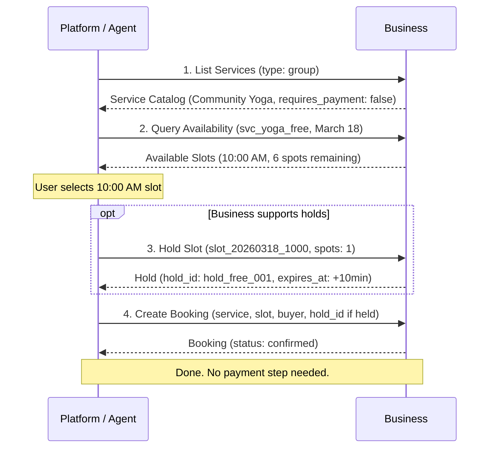

**1. `POST /bookings` — request (with hold):**

```json
{
  "service_id": "svc_yoga_free",
  "slot_id": "slot_20260318_1000",
  "hold_id": "hold_free_001",
  "buyer": {
    "first_name": "Alice",
    "last_name": "Williams",
    "email": "alice@example.com",
    "phone_number": "+12125551234"
  },
  "party_size": 1
}
```

**2. `POST /bookings` — response (`201 Created`, free service):**

```json
{
  "usp": {
    "version": "2026-02-09",
    "capabilities": {
      "dev.usp.services.bookings": [{ "version": "2026-02-09" }]
    }
  },
  "booking": {
    "id": "bkg_789ghi",
    "service_id": "svc_yoga_free",
    "service_name": "Community Yoga",
    "slot": {
      "id": "slot_20260318_1000",
      "start": "2026-03-18T10:00:00-04:00",
      "end": "2026-03-18T11:00:00-04:00",
      "duration": "PT60M"
    },
    "buyer": {
      "first_name": "Alice",
      "last_name": "Williams",
      "email": "alice@example.com"
    },
    "party_size": 1,
    "status": "confirmed",
    "confirmation_mode": "auto",
    "created_at": "2026-03-14T22:05:00Z",
    "updated_at": "2026-03-14T22:05:00Z"
  }
}
```

#### 7.7.2 Paid Service Flow (UCP Checkout)

This flow applies when the business advertises UCP checkout with the paid bookings
extension. The platform uses UCP `create_checkout` and `complete_checkout` instead
of Standalone `POST /bookings` + `confirm-payment`. See [Section 7.4](#74-paid-bookings-extension-schema)
and [Section 7.5](#75-checkout-flow-and-atomicity-guarantee).

> **Applies when:** Deployment mode: UCP-Native. Service: `requires_payment: true`,
> `payment_timing: at_booking`, `confirmation_mode: auto`. Business UCP profile:
> `dev.ucp.shopping.checkout` and `dev.usp.services.paid_bookings` registered
> at [`/.well-known/ucp`](#72-profile-registration-in-well-knownucp).

> **JSON shapes:** Booking context in checkout — [schemas/paid_bookings.json](schemas/paid_bookings.json).
> UCP checkout request/response — [UCP checkout](https://ucp.dev/schemas/shopping/checkout.json)
> and [Section 7.4](#74-paid-bookings-extension-schema) examples. The steps below
> illustrate the paid bookings extension fields; full UCP checkout fields follow
> the UCP specification.

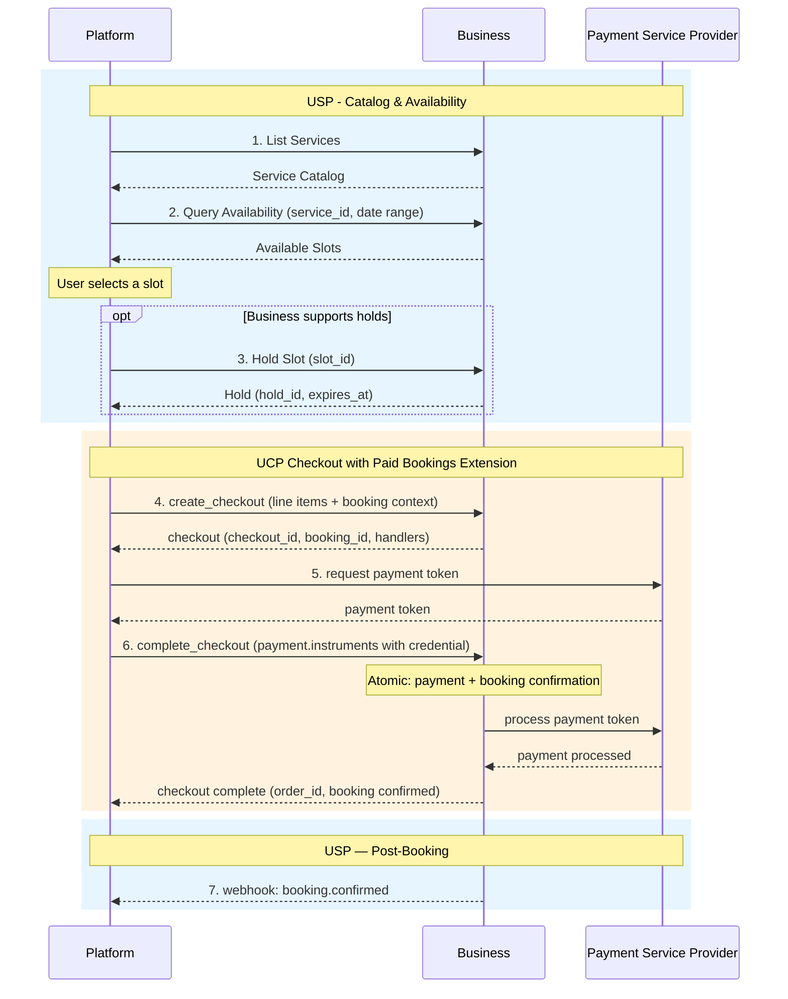

**1. `create_checkout` (UCP) — request body (excerpt, paid bookings extension):**

The full shape matches [Section 7.4](#74-paid-bookings-extension-schema). Example:

```json
{
  "line_items": [
    {
      "id": "li_1",
      "item": {
        "id": "svc_massage_001",
        "title": "Deep Tissue Massage",
        "price": 12000
      },
      "quantity": 1
    }
  ],
  "currency": "USD",
  "buyer": {
    "email": "alice@example.com",
    "first_name": "Alice",
    "last_name": "Williams"
  },
  "booking": {
    "service_id": "svc_massage_001",
    "service_type": "appointment",
    "slot": {
      "id": "slot_20260316_1400",
      "start": "2026-03-16T14:00:00-04:00",
      "end": "2026-03-16T15:00:00-04:00",
      "duration": "PT60M"
    },
    "hold_id": "hold_xyz789",
    "party_size": 1,
    "confirmation_mode": "auto"
  }
}
```

**2. `create_checkout` (UCP) — response (excerpt):**

```json
{
  "id": "chk_abc123",
  "status": "ready_for_complete",
  "booking": {
    "booking_id": "bkg_456def",
    "service_id": "svc_massage_001",
    "service_type": "appointment",
    "booking_status": "pending",
    "confirmation_mode": "auto"
  },
  "ucp": {
    "payment_handlers": {
      "com.stripe.agentic_commerce.shared_payment_token": [
        {
          "id": "stripe_spt_demo_h1",
          "version": "2026-01-11",
          "available_instruments": [
            { "type": "shared_payment_token" }
          ],
          "config": {
            "publishable_key": "pk_test_ExampleNotForProduction"
          }
        }
      ]
    }
  }
}
```

**3. `complete_checkout` (UCP) — request body (illustrative):**

Payment fields follow [UCP Complete Checkout](https://ucp.dev/latest/specification/checkout/#complete-checkout).
Shape is processor-specific; `handler_id` **MUST** match the handler instance `id`
from the checkout response (see [Section 7.4](#74-paid-bookings-extension-schema)):

```json
{
  "payment": {
    "instruments": [
      {
        "handler_id": "stripe_spt_demo_h1",
        "credential": {
          "type": "shared_payment_token",
          "token": "spt_ExampleOpaqueTokenNotForProduction"
        }
      }
    ]
  }
}
```

**4. `complete_checkout` (UCP) — response (excerpt, terminal success):**

```json
{
  "id": "chk_abc123",
  "status": "completed",
  "order_id": "ord_ucp_001",
  "booking": {
    "booking_id": "bkg_456def",
    "booking_status": "confirmed",
    "confirmation_mode": "auto"
  }
}
```

**5. Webhook:** The business **MAY** send `booking.confirmed`; the payload **SHOULD**
include `order_id` alongside `booking_id` ([Section 5.4.1](#541-booking-webhooks),
[Section 7.5](#75-checkout-flow-and-atomicity-guarantee)).

> See [Section 8.7](#87-payment-path-comparison) for a comparison of all payment
> paths across both deployment modes.

---

## 8. Standalone Mode

This section defines the deployment mode for platforms that do not use UCP. In
Standalone Mode, USP operates as an independent protocol with its own discovery,
negotiation, and payment infrastructure. Businesses publish a `/.well-known/usp`
profile, and payment is handled via the payment action's `payment_context` +
`confirm-payment` pattern.

### 8.1 Overview and When to Use

Use Standalone Mode when:

- Your platform does not support UCP
- You want a self-contained scheduling protocol
- You want to support any checkout system via generic payment handoff
- You want independence from any specific commerce protocol

In this mode, the business publishes a `/.well-known/usp` profile and implements
USP's own infrastructure for negotiation, versioning, and security (Sections 9.6
and 10.2).

### 8.2 Business Profile (/.well-known/usp)

> **JSON Schemas:** [`schemas/profile.json`](schemas/profile.json) (see
> `$defs/BusinessProfile`) and [`schemas/usp.json`](schemas/usp.json) (see
> `$defs/business_schema`)

Businesses publish their USP profile at `/.well-known/usp`. This document is
the single source of truth for **profile discovery** (endpoint and capability
resolution), capability negotiation, and webhook verification key distribution.
Platforms fetch this document to determine which transports, capabilities, and
checkout systems the business supports before initiating any scheduling
interactions.

```json
{
  "usp": {
    "version": "2026-02-09",
    "services": {
      "dev.usp.services": [
        {
          "version": "2026-02-09",
          "spec": "https://usp.dev/specification",
          "transport": "rest",
          "endpoint": "https://business.example.com/usp/v1",
          "schema": "https://usp.dev/services/rest.openapi.json"
        },
        {
          "version": "2026-02-09",
          "spec": "https://usp.dev/specification",
          "transport": "mcp",
          "endpoint": "https://business.example.com/usp/mcp",
          "schema": "https://usp.dev/services/mcp.openrpc.json"
        }
      ]
    },
    "capabilities": {
      "dev.usp.services.catalog": [
        {
          "version": "2026-02-09",
          "spec": "https://usp.dev/specification#3-service-catalog",
          "schema": "https://usp.dev/schemas/services/catalog.json"
        }
      ],
      "dev.usp.services.availability": [
        {
          "version": "2026-02-09",
          "holds": true,
          "spec": "https://usp.dev/specification#4-availability",
          "schema": "https://usp.dev/schemas/services/availability.json"
        }
      ],
      "dev.usp.services.bookings": [
        {
          "version": "2026-02-09",
          "spec": "https://usp.dev/specification#5-booking-lifecycle",
          "schema": "https://usp.dev/schemas/services/booking.json"
        }
      ]
    },
    "checkout_systems": [
      "acp",
      "redirect"
    ],
    "business": {
      "name": "Sunrise Wellness Studio",
      "timezone": "America/New_York",
      "currency": "USD"
    }
  },
  "keys": [
    {
      "kid": "usp-webhook-key-2026-02",
      "kty": "EC",
      "crv": "P-256",
      "x": "...",
      "y": "...",
      "use": "sig",
      "alg": "ES256"
    }
  ],
  "signing_keys": [
    {
      "kid": "usp-webhook-key-2026-02",
      "kty": "EC",
      "crv": "P-256",
      "x": "...",
      "y": "...",
      "use": "sig",
      "alg": "ES256"
    }
  ]
}
```

#### 8.2.1 Business Profile Fields

The business profile document has the following top-level fields:

| Field          | Type              | Required    | Description                                                                                                                 |
|----------------|-------------------|-------------|-----------------------------------------------------------------------------------------------------------------------------|
| `usp`          | object            | **Yes**     | The USP metadata object. Contains version, services, capabilities, checkout systems, business identity, and backward-compatibility declarations. |
| `keys`         | Array[SigningKey] | Conditional | [UCP]-canonical public keys for webhook signature verification (top-level JWK Set [RFC 7517]). **MUST** be present when the business sends signed webhooks. Dual-publish with identical `signing_keys` is **RECOMMENDED** during transition. See [Section 10.1.1](#1011-webhook-security). |
| `signing_keys` | Array[SigningKey] | No          | Transition alias for `keys`. **MAY** be published while consumers still read `signing_keys`. When both are present they **MUST** list the same keys; verifiers resolve against `keys` first. See [Section 10.1.1](#1011-webhook-security). |
| `authorization`| AuthorizationPolicy | Conditional | How this business authenticates platforms for privileged operations. **MUST** be present when the business exposes privileged operations. In UCP-Native Mode this policy is published as `config.authorization` on the `dev.usp.services` service binding instead. See [Section 10.1.6](#1016-platform-authentication-for-privileged-operations). |

The `usp` object fields:

| Field               | Type   | Required | Description                                                                                                                   |
|---------------------|--------|----------|-------------------------------------------------------------------------------------------------------------------------------|
| `version`           | string | **Yes**  | USP protocol version implemented by this business (`YYYY-MM-DD`).                                                            |
| `services`          | object | **Yes**  | Service endpoint registry. Keys are reverse-domain service names (e.g., `dev.usp.services`). Values are arrays of **ServiceBinding** objects, one per supported transport. |
| `capabilities`      | object | **Yes**  | Capability registry. Keys are reverse-domain capability names (e.g., `dev.usp.services.catalog`). Values are arrays of **ProfileCapabilityEntry** objects. See [`schemas/usp.json`](schemas/usp.json) (`$defs/ProfileCapabilityEntry`). |
| `checkout_systems`  | array  | No       | Checkout systems integrated for paid bookings: `acp`, `redirect`, `embedded`. Omit for free or pay-at-service services.       |
| `business`          | object | **Yes**  | Business identity: `name` (string, required), `timezone` (IANA identifier, required), `currency` (ISO 4217, required), `locations` (array, optional). |
| `supported_versions`| object | No       | Backward-compatibility map. Keys are older protocol versions (`YYYY-MM-DD`); values are URIs to version-specific profiles. See [Section 8.2.4](#824-backward-compatibility). |

Each **ServiceBinding** (an entry in a `services` value array) has:

| Field      | Type       | Required    | Description                                                                                                    |
|------------|------------|-------------|----------------------------------------------------------------------------------------------------------------|
| `version`  | string     | **Yes**     | Protocol version implemented at this endpoint (`YYYY-MM-DD`).                                                 |
| `transport`| string     | **Yes**     | Transport protocol: `rest`, `mcp`, `a2a`, or `embedded`.                                                      |
| `endpoint` | string URI | Conditional | Base URL of the endpoint. **REQUIRED** for `rest`, `mcp`, and `a2a` transports (for `a2a`, the Agent Card URL). |
| `spec`     | string URI | **Yes**     | URL to the human-readable specification.                                                                      |
| `schema`   | string URI | Conditional | URL to the machine-readable schema (OpenAPI for `rest`, OpenRPC for `mcp` and `embedded`). **REQUIRED** for `rest`, `mcp`, and `embedded`; not applicable to `a2a`. |
| `id`       | string     | No          | Disambiguates multiple instances of the same service. Mirrors the [UCP] service definition field.             |
| `config`   | object     | No          | Binding-specific settings, following [UCP]'s convention of carrying entity-specific configuration under `config`. Carries `authorization` in UCP-Native Mode (see below). |

These requirements mirror [UCP]'s service definition, so the same binding
object is conformant when it is published inside `/.well-known/ucp` in
UCP-Native Mode. The `spec` and `schema` origins **MUST** match the namespace
authority of the service key: `https://usp.dev/...` for `dev.usp.*`
([Section 2.5](#25-namespace-governance)).

The `config` object carries binding-specific settings:

| Field           | Type                | Required    | Description                                                                                                   |
|-----------------|---------------------|-------------|-----------------------------------------------------------------------------------------------------------------|
| `authorization` | AuthorizationPolicy | Conditional | Authentication policy governing privileged operations at this endpoint. This is where UCP-Native deployments publish the policy, since USP does not add top-level members to a [UCP] profile and `config` is the slot [UCP] defines for entity-specific settings. **REQUIRED** in UCP-Native Mode when the endpoint exposes privileged operations. See [Section 10.1.6](#1016-platform-authentication-for-privileged-operations). |

A ServiceBinding **MUST NOT** carry `authorization` as a direct member; the
policy belongs under `config`. Consumers **MUST** reject a binding that
declares a direct `authorization` member rather than reading it, and **MUST
NOT** treat it as a published policy. This is the one exception to the
forward-compatibility rule in
[Section 10.1.6](#1016-platform-authentication-for-privileged-operations) that
otherwise requires consumers to ignore unrecognized profile fields: silently
ignoring a misplaced policy would leave a business believing it had advertised
an authentication requirement that no conforming platform reads, and silently
honoring it would keep the non-idiomatic placement alive in deployed profiles.
[`schemas/usp.json`](schemas/usp.json) enforces this.

Each **ProfileCapabilityEntry** (an entry in a `capabilities` value array) has:

| Field     | Type              | Required | Description                                                                                    |
|-----------|-------------------|----------|------------------------------------------------------------------------------------------------|
| `version` | string            | **Yes**  | Capability version (`YYYY-MM-DD`).                                                            |
| `spec`    | string URI        | **Yes**  | URL to the capability specification.                                                          |
| `schema`  | string URI        | **Yes**  | URL to the capability JSON Schema.                                                            |
| `extends` | string or array   | No       | Base capability name(s) this capability extends, in reverse-domain format.                    |

The base [`$defs/CapabilityEntry`](schemas/usp.json) type omits required `spec`/`schema` for response metadata; profiles **MUST** use **ProfileCapabilityEntry** (see [Section 2.4](#24-core-constructs)).

Capability keys **MUST** use reverse-domain notation. The `dev.usp.*` namespace
is reserved for the USP governing body. Vendor-defined capabilities **MUST**
use the vendor's own reverse-domain prefix (e.g., `com.example.services.loyalty`).

The `checkout_systems` field is an **OPTIONAL** array that declares which
checkout systems the business has integrated for paid bookings. Platforms use
this field during **profile discovery** or **platform onboarding**
([Section 1.2](#12-terminology)) to determine compatibility - it is not
consulted per-transaction.

| Value      | Description                                                                                                                       |
|------------|-----------------------------------------------------------------------------------------------------------------------------------|
| `acp`      | Business supports ACP checkout sessions. See [Section 8.5.6](#856-acp-booking-extension) and [Section 8.6.4](#864-acp-payment-flow-paid-service). |
| `redirect` | Business provides a `continue_url` on the payment action for buyer-facing payment. See [Section 8.5.5](#855-redirect-flow-and-post-payment-return) and [Section 8.6.3](#863-redirect-payment-flow-paid-service). |
| `embedded` | Business supports platform-processed payment via `confirm-payment`. See [Section 8.5.4](#854-embedded-and-generic-payment-flow) and [Section 8.6.2](#862-embedded-payment-flow-paid-service). |

> **Design note (UCP-Native vs Standalone payment advertisement):** In **Standalone
> Mode**, USP uses a flat `checkout_systems` array for **profile-discovery-time**
> compatibility only (which checkout paths the business supports). Per-transaction
> amounts, line items, and metadata are in [`PaymentContext`](#852-payment-context)
> on the payment action; detailed PSP configuration is often agreed out of band.
> In **UCP-Native Mode**, payment handler advertisement and execution follow UCP
> `payment_handlers` on the profile and on checkout responses (reverse-domain
> keys, handler arrays, `available_instruments`), per the [UCP payment architecture](https://ucp.dev/latest/specification/overview/#payment-architecture)
> and [Section 7.4](#74-paid-bookings-extension-schema). Businesses that need to
> advertise richer payment configuration in Standalone Mode **MAY** add
> vendor-defined entries under `capabilities` (see [Section 2.5](#25-namespace-governance)).

A business offering only free or pay-at-service services **MAY** omit
`checkout_systems` entirely.

> **Note:** USP does not define how a platform-business relationship is
> established. The `checkout_systems` field and `/.well-known/usp` profile provide
> the information needed for compatibility assessment during profile discovery,
> but **platform onboarding** ([Section 1.2](#12-terminology)) - OAuth, DCR,
> credential storage, and related integration - occurs out-of-band.

#### 8.2.2 Profile Hosting Requirements

Business profiles **MUST** comply with the following hosting requirements:

| Requirement      | Rule                                                                                                                                                        |
|------------------|-------------------------------------------------------------------------------------------------------------------------------------------------------------|
| **Transport**    | **MUST** be served over HTTPS. Plaintext HTTP **MUST** be rejected.                                                                                        |
| **Redirects**    | **MUST NOT** issue HTTP 3xx redirects on the profile URL.                                                                                                  |
| **Cache-Control**| **MUST** include `Cache-Control: public, max-age=<N>` where N ≥ 60. The directives `no-store`, `no-cache`, and `private` are prohibited.                  |
| **Content-Type** | **MUST** return `Content-Type: application/json`.                                                                                                          |
| **Schema**       | **MUST** conform to [`schemas/profile.json`](schemas/profile.json) `$defs/BusinessProfile`.                                                               |

Platforms fetching business profiles:

- **MUST** reject profile URLs that do not use the `https://` scheme and treat
  them as `invalid_profile_url` errors (see [Section 9.4](#94-error-code-mapping)).
- **MUST NOT** follow HTTP redirects when fetching profiles.
- **SHOULD** cache the fetched profile for the TTL given in the `Cache-Control`
  header, with a minimum floor of 60 seconds regardless of origin headers.
- **MAY** refresh profiles asynchronously using stale-while-revalidate semantics.
- **SHOULD** force-refresh the cached profile when a signed webhook arrives with
  an unknown `kid`, but **MUST NOT** do so more than once per TTL floor per origin.

#### 8.2.3 Platform Profile

Platforms publish a machine-readable profile document at a stable HTTPS URI
and advertise that URI on every API request:

- **REST:** via the `USP-Agent` header (see [Section 9.1](#91-rest-binding)):
  `USP-Agent: profile="https://agent.example/profiles/scheduling-agent.json"`
- **MCP:** via the `_meta.usp.profile` JSON-RPC field (see
  [Section 9.2](#92-mcp-binding)):
  `"_meta": {"usp": {"profile": "https://agent.example/profiles/scheduling-agent.json"}}`

The platform profile document describes which capabilities the platform can
consume. Businesses fetch this document and compute the capability intersection
to determine which capabilities to activate for responses — without any
round-trip negotiation handshake.

> **JSON Schemas:** [`schemas/profile.json`](schemas/profile.json) (see
> `$defs/PlatformProfile`) and [`schemas/usp.json`](schemas/usp.json) (see
> `$defs/platform_schema`)

**Example platform profile document:**

```json
{
  "usp": {
    "version": "2026-02-09",
    "capabilities": {
      "dev.usp.services.catalog": [
        {
          "version": "2026-02-09",
          "spec": "https://usp.dev/specification#3-service-catalog",
          "schema": "https://usp.dev/schemas/services/catalog.json"
        }
      ],
      "dev.usp.services.availability": [
        {
          "version": "2026-02-09",
          "spec": "https://usp.dev/specification#4-availability",
          "schema": "https://usp.dev/schemas/services/availability.json"
        }
      ],
      "dev.usp.services.bookings": [
        {
          "version": "2026-02-09",
          "spec": "https://usp.dev/specification#5-booking-lifecycle",
          "schema": "https://usp.dev/schemas/services/booking.json"
        }
      ]
    },
    "services": {
      "dev.usp.services": [
        { "transport": "rest" },
        { "transport": "mcp" }
      ]
    }
  }
}
```

The `usp` object in a platform profile has the following fields:

| Field          | Type   | Required | Description                                                                                                                              |
|----------------|--------|----------|------------------------------------------------------------------------------------------------------------------------------------------|
| `version`      | string | **Yes**  | The highest USP protocol version the platform supports (`YYYY-MM-DD`).                                                                  |
| `capabilities` | object | **Yes**  | Capabilities the platform can consume. Same key/value format as the business profile: reverse-domain keys → arrays of **ProfileCapabilityEntry**. See [`schemas/usp.json`](schemas/usp.json) (`$defs/ProfileCapabilityEntry`).  |
| `services`     | object | No       | Service consumption preferences. Keys are reverse-domain service names; values list preferred transports in preference order.            |

Platform profile hosting requirements are identical to business profile
requirements: HTTPS, no redirects, `Cache-Control: public, max-age≥60`,
`Content-Type: application/json`.

Businesses fetching platform profiles:

- **MUST** reject profile URLs that do not use the `https://` scheme.
- **MUST NOT** follow redirects.
- **SHOULD** fetch and cache the platform profile lazily — on the first request
  from a given profile URI — and refresh it according to the `Cache-Control` TTL
  with a minimum floor of 60 seconds.
- **MUST** treat platform profile fetch failures as protocol errors. See the
  `profile_unreachable` and `profile_malformed` error codes in
  [Section 9.4](#94-error-code-mapping).

**Fetch hardening (MUST/SHOULD).** A platform profile URI is supplied by the
caller, so fetching it is an outbound request that an unauthenticated party
chooses. Businesses therefore:

- **MUST** reject profile URLs that resolve to special-use IP addresses
  [RFC 6890] (loopback, link-local including the cloud metadata address
  `169.254.169.254`, private, and other reserved ranges), except a loopback
  target when the verifier itself runs on that loopback interface for local
  development. Verifiers **SHOULD** validate the resolved address rather than
  the hostname alone, to resist DNS rebinding.
- **SHOULD** enforce connect and response timeouts, and **SHOULD** bound the
  response body size. A profile is an identity and capability manifest, not a
  data payload; a bound of no less than 128 KiB does not reject conformant
  profiles.
- **SHOULD** keep the cost of resolving unrecognized platforms constant
  regardless of how many distinct platforms call, for example with a
  fixed-size (LRU) profile cache, a global rate limit on discovery fetches,
  backoff on repeated failures, and negative caching of unresolvable URIs.
  This matters specifically for the personal-agent population
  ([Section 10.1.6](#1016-platform-authentication-for-privileged-operations)),
  where the number of distinct profile URIs is large.
- **SHOULD** force-refresh a cached profile at most once per TTL floor per
  origin when signature verification fails with an unknown `keyid`.

These requirements match [UCP]'s profile fetching rules; a UCP-Native business
inherits them from UCP and need not implement them twice.

#### 8.2.4 Backward Compatibility

The optional `supported_versions` field in the business profile enables
businesses that have upgraded their USP implementation to continue serving older
platforms that only understand a prior protocol version:

```json
{
  "usp": {
    "version": "2026-06-01",
    "supported_versions": {
      "2026-02-09": "https://business.example.com/.well-known/usp-2026-02-09"
    },
    "services": { ... },
    "capabilities": { ... },
    "business": { ... }
  }
}
```

Each key is an older protocol version string (`YYYY-MM-DD`). Each value is a
URI pointing to a profile document that conforms to that older version's schema.
Businesses that upgrade to a new USP version **SHOULD** advertise prior
supported versions in `supported_versions` for at least 90 days to allow older
platforms to continue discovering a compatible profile.

### 8.3 Capability Negotiation

USP uses a **server-selects** negotiation model. There is no handshake — the
business computes the intersection of its own capabilities and the platform's
capabilities and activates only shared capabilities silently on every response.

**Negotiation algorithm:**

1. **Platform advertises its profile URI** on every request via the `USP-Agent`
   header (REST) or `_meta.usp.profile` field (MCP). See
   [Section 8.2.3](#823-platform-profile) for the platform profile structure.
2. **Business fetches and caches the platform profile** lazily on first contact
   from a given URI, then refreshes it per its `Cache-Control` TTL (minimum 60
   seconds). Fetch failures **MUST** be returned as `profile_unreachable` or
   `invalid_profile_url` protocol errors (see
   [Section 9.4](#94-error-code-mapping)).
3. **Business computes the capability intersection**: the set of capability keys
   that appear in both the business profile's `capabilities` map and the platform
   profile's `capabilities` map. For each shared key, the business selects the
   highest mutually supported version.
4. **Business responds using only capabilities in the intersection.** If a
   capability depends on an extension that the platform does not support, the
   business **MUST** prune the orphaned extension from the response.
5. **Every response includes a `usp` object** declaring the active version and
   the negotiated capabilities (see [Section 9.2.2](#922-requestresponse-format)
   for the MCP example and REST envelope structure).
6. **If the intersection is empty** (no shared capabilities), the business
   **MUST** return a `capabilities_incompatible` error.

**Example response `usp` object** (the negotiated intersection for a
standard scheduling request):

```json
{
  "usp": {
    "version": "2026-02-09",
    "capabilities": {
      "dev.usp.services.catalog": [
        {
          "version": "2026-02-09"
        }
      ],
      "dev.usp.services.availability": [
        {
          "version": "2026-02-09"
        }
      ],
      "dev.usp.services.bookings": [
        {
          "version": "2026-02-09"
        }
      ]
    }
  }
}
```

Businesses **SHOULD** include in the response `usp.capabilities` only the
capabilities relevant to the specific operation type. For example, a response
to `POST /availability/query` need not include `dev.usp.services.bookings` in
the `usp.capabilities` map.

### 8.4 Versioning

USP uses date-based versioning (`YYYY-MM-DD` format). This applies to protocol
versions, capability versions, and transport binding versions.

**Version negotiation:** When a platform sends a request, the business **MUST**
compare versions:

| Condition                           | Behavior                                                                                                                  |
|-------------------------------------|---------------------------------------------------------------------------------------------------------------------------|
| Platform version ≤ Business version | Business processes the request using the platform's version semantics.                                                    |
| Platform version > Business version | Business **MUST** return a `version_unsupported` error with a `messages[]` entry indicating the latest supported version. |

**Backwards compatibility:** Adding optional fields, new capabilities, new enum
values, and new error codes are non-breaking changes. Removing fields, changing
types, and changing semantics are breaking changes.

**Capability versioning:** Capabilities are versioned independently from the
protocol. When a business supports multiple versions, it declares them in the
capabilities registry:

```json
"capabilities": {
"dev.usp.services.catalog": [
{"version": "2026-02-09"},
{"version": "2026-06-15"}
]
}
```

### 8.5 Payment Integration

This section defines payment handling for Standalone Mode. USP defines **when**
payment is required and provides a universal payment handoff mechanism. This
section applies only when `requires_payment` is `true` and `payment_timing` is
`at_booking` or `deposit_required`.

#### 8.5.1 Booking Payment Schema

> **JSON Schema:** [/$defs/BookingPayment](schemas/booking.json) · [/$defs/PaymentContext](schemas/booking.json)

The `payment` object on the booking tracks the lifecycle of payment:

| Field             | Type    | Required    | Description                                                                            |
|-------------------|---------|-------------|----------------------------------------------------------------------------------------|
| `status`          | string  | **Yes**     | `not_required`, `pending`, `deposit_paid`, `paid`, `refunded`, `partially_refunded`    |
| `timing`          | string  | **Yes**     | Mirrors the service's `payment_timing`: `at_booking`, `at_service`, `deposit_required` |
| `amount`          | integer | Conditional | Service fee in minor currency units, **before tax**. Does not include `tax_amount`. **REQUIRED** when `timing` is `at_booking` or `deposit_required`. |
| `currency`        | string  | Conditional | ISO 4217 currency code. **REQUIRED** when `amount` is present.                         |
| `amount_due`      | integer | Conditional | Amount due now in minor currency units. **REQUIRED** when `timing` is `at_booking` or `deposit_required`. |
| `tax_amount`      | integer | No          | Tax amount in minor currency units. When present, the total charged to the buyer is `amount + tax_amount`. **MUST** use the same currency as `amount`. |
| `deposit_amount`  | integer | No          | Deposit amount when `timing` is `deposit_required`.                                    |
| `transaction_id`  | string  | No          | Transaction ID from the payment provider, set after `confirm-payment`.                 |
| `order_reference` | string  | No          | External order ID from the checkout system.                                            |

#### 8.5.2 Payment Context

> **JSON Schema:** [/$defs/PaymentContext](schemas/booking.json)

The `PaymentContext` is a **handoff object** nested inside a payment action in
the booking's `actions` array. It contains everything a checkout system needs to
process payment. The payment expiry deadline is carried on the action's
`expires_at` field, not on the `PaymentContext` itself.

| Field         | Type              | Required | Description                                                                         |
|---------------|-------------------|----------|-------------------------------------------------------------------------------------|
| `amount_due`  | integer           | **Yes**  | Amount to collect in minor currency units.                                          |
| `currency`    | string            | **Yes**  | ISO 4217 currency code.                                                             |
| `description` | string            | **Yes**  | Human-readable description of the payment.                                          |
| `line_items`  | Array\[LineItem\] | **Yes**  | Itemized breakdown. Each item has `label`, `amount`, `quantity`, `item_id`.         |
| `tax_amount`  | integer           | No       | Tax portion of `amount_due` in minor units. When present, pre-tax subtotal is `amount_due - tax_amount`. |
| `metadata`    | object            | **Yes**  | Machine-readable context: `booking_id`, `service_id`, `service_type`, optional `slot_start`. See [`schemas/booking.json`](schemas/booking.json) `$defs/PaymentContext`. |

The `amount_due` is the total the buyer pays for this payment action. When
`tax_amount` is present, checkout UIs **SHOULD** show a tax breakdown; line
items provide further itemization.

#### 8.5.3 Confirm Payment

The `POST /bookings/{booking_id}/confirm-payment` endpoint (defined in [Section
5.3.7](#537-confirm-payment---post-bookingsbooking_idconfirm-payment)) is the
callback that the platform calls after successfully processing payment.
The business **MUST** validate the booking, amount, and currency, then
complete the payment action. Per the status-actions invariant, if no pending
actions remain, the booking transitions to `confirmed`; otherwise it stays in
`requires_action`.

Business outcome errors for this operation use the response-level `messages[]`
array ([Section 9.1](#91-rest-binding), [Section 9.4](#94-error-code-mapping)).
Normative codes include: `payment_expired` (payment action or booking expired),
`payment_amount_mismatch` (`amount_paid` does not match `amount_due`),
`actions_pending` (non-payment actions still pending), `booking_not_found`
(unknown `booking_id`). Protocol errors use HTTP status codes and Problem
Details, not `messages[]`.

> **Risk and fraud signals:** USP does **not** define a `signals` or risk object
> on `confirm-payment` or `PaymentContext`. Fraud prevention and environment
> signals (e.g., buyer IP, user agent) are the responsibility of the checkout
> system or PSP that processes payment. Platforms **MAY** pass vendor-defined
> fields inside `payment_result` if the business documents an extension contract.

#### 8.5.4 Embedded and Generic Payment Flow

When `checkout_systems` includes `embedded`, the platform processes payment
**programmatically** using the `payment_context` from the payment action (no
browser redirect to the business for payment, and no ACP session). This is the
same `payment_context` + `confirm-payment` pattern as other Standalone paths;
see [Section 8.6.2](#862-embedded-payment-flow-paid-service).

The **generic** payment diagram below applies to embedded checkout and to any
custom checkout integration that consumes `payment_context` off the USP payment
action:

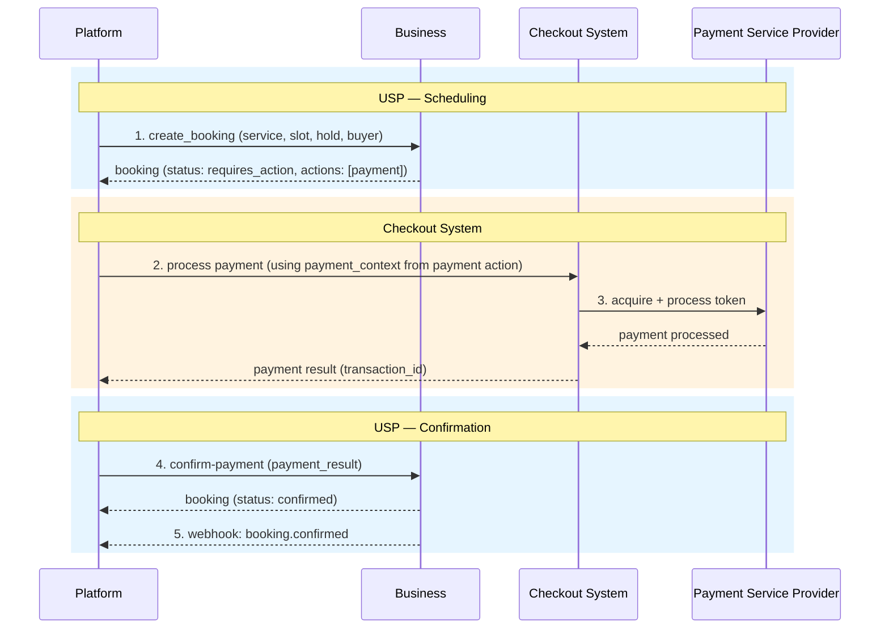

The platform extracts `payment_context` from the payment action in `actions[]` (
the action with `type: payment`). The action's `expires_at` indicates the
payment deadline.

**Buyer-side escalation:** Every action includes a `continue_url`. When
buyer-side steps are required (e.g., 3-D Secure) that the platform cannot
complete via its PSP integration alone, the platform **SHOULD** send the buyer
to that `continue_url` **regardless** of the declared `checkout_systems` value,
then resume with `confirm-payment` after success. This aligns with UCP's
`requires_escalation` + `continue_url` pattern using USP's action model.

**Payment action expiry:** When a payment action's `expires_at` passes without
`confirm-payment`, the business **SHOULD** set the action's `status` to
`expired`. If no other pending actions remain, the booking **MUST** transition
to `canceled` per [Section 5.2](#52-booking-schema) (booking expiry). The
business **SHOULD** release any hold and **SHOULD** send `booking.canceled`. A
late `confirm-payment` **MUST** return the canceled booking with `messages[]`
code `payment_expired`. The payment action's `expires_at` **SHOULD** be no later
than the booking's `expires_at` and no later than the slot hold's `expires_at`
when a hold exists.

**Payment abandonment:** If the buyer abandons payment, the platform **SHOULD**
call `POST /bookings/{booking_id}/cancel`. Otherwise the booking expires as
above. For `redirect`, the business **MUST** still return the buyer to
`post_payment_return_request.url` when payment is cancelled or abandoned ([Section 8.5.5](#855-redirect-flow-and-post-payment-return)).

#### 8.5.5 Redirect Flow and Post-Payment Return

> **JSON Schema:** [/$defs/PostPaymentReturnRequest](schemas/booking.json)

> **Applies to:** Businesses that declare `checkout_systems: ["redirect"]`. This section is not applicable to the `acp` or `embedded` checkout paths.

Each action in the `actions` array includes a `continue_url` that links to a
business-hosted page for completing that specific action. For payment actions,
this is a payment page; for other action types, it may be a waiver form, intake
questionnaire, or similar.

Action `continue_url` values **MUST** use the `https://` scheme. Platforms **MUST**
reject actions whose `continue_url` is not HTTPS. The URL is valid only until the
action's `expires_at`; after expiry the business **MUST** serve an explicit error
or explanation page (not a broken link). The URL **MUST** identify server-side
session state; businesses **MUST NOT** encode sensitive payment or booking
secrets in query parameters.

The platform **SHOULD** redirect the buyer to an action's `continue_url` if it
cannot process the action programmatically. For payment actions, this serves as
a fallback when the platform cannot use the `payment_context` for programmatic
processing.

**Post-payment return:** The platform **SHOULD** include a
`post_payment_return_request` object in the `POST /bookings` request body
whenever the redirect checkout path is used. Without it, the platform has no
way to predict or control where the buyer's browser will land after payment
completes or after the buyer cancels or abandons payment — making it impossible
to resume the booking flow reliably on the platform side.

If `post_payment_return_request` is present, the business **MUST** redirect the
buyer's browser (via HTTP GET) to `post_payment_return_request.url` — with all
`post_payment_return_request.params` key-value pairs appended verbatim as URL
query parameters — in both of the following terminal outcomes of the payment
action:

- **Payment completed** (successful or failed): buyer has reached a definitive
  payment result on the business's payment page.
- **Payment cancelled or abandoned**: buyer has explicitly cancelled, closed,
  or navigated away from the payment page without completing payment.

> **Note:** Businesses using server-side checkout configuration need the 
> return URL at checkout session creation time — before
> the buyer reaches the payment page. Because `post_payment_return_request` is
> present in the `POST /bookings` request, the business backend has it at exactly
> the right time.

`post_payment_return_request` contains two fields:

| Field    | Type   | Required | Description                                                                                                                                                                                                                                                         |
|----------|--------|----------|---------------------------------------------------------------------------------------------------------------------------------------------------------------------------------------------------------------------------------------------------------------------|
| `url`    | string | **Yes**  | The platform's return URL. The business MUST redirect the buyer's browser to this URL (via HTTP GET) after payment completes, is cancelled, or is abandoned, appending any `params` as query parameters.                                                            |
| `params` | object | No       | Query parameter key-value pairs (string values) the business MUST append verbatim to `url` when issuing the return redirect. Keys and values are opaque to the business — the platform uses them to carry whatever correlation state it needs to identify the session on return. |

#### 8.5.6 ACP Booking Extension

This section defines the integration with
the [Agentic Commerce Protocol (ACP)](https://agenticcommerce.dev/) for
businesses that declare `checkout_systems: ["acp"]`.

USP defines `dev.usp.services.booking` as a proper ACP extension using ACP's
native `capabilities.extensions` mechanism with JSONPath-based `extends`
declarations. The extension adds a **`booking`** field to ACP's `CheckoutSession`
response model (the same pattern as ACP's built-in extension fields such as
`discounts`), carrying scheduling context from USP.

**ACP Extension Declaration:**

```json
{
  "capabilities": {
    "extensions": [
      {
        "name": "dev.usp.services.booking",
        "extends": ["$.CheckoutSession.booking"],
        "spec": "https://usp.dev/specification#856-acp-booking-extension",
        "schema": "https://usp.dev/schemas/acp_booking_extension.json"
      }
    ]
  }
}
```

Versioning MAY use the `name@YYYY-MM-DD` suffix form (e.g.
`dev.usp.services.booking@2026-02-09`) per ACP extension conventions.

**Fulfillment options:** Scheduling services do not involve physical shipping.
Platforms SHOULD pass an empty `fulfillment_options: []` array when creating the
ACP checkout session. ACP requires this field; it need not be non-empty for
service bookings.

**ACP Checkout Session with USP Booking Extension:**

```json
{
  "id": "cs_usp_001",
  "status": "ready_for_payment",
  "currency": "usd",
  "line_items": [
    {
      "id": "li_001",
      "item": {
        "id": "svc_massage_001",
        "name": "Deep Tissue Massage",
        "unit_amount": 12000
      },
      "quantity": 1,
      "totals": [
        { "type": "subtotal", "display_text": "Subtotal", "amount": 12000 },
        { "type": "total", "display_text": "Total", "amount": 12000 }
      ]
    }
  ],
  "totals": [
    { "type": "subtotal", "display_text": "Subtotal", "amount": 12000 },
    { "type": "total", "display_text": "Total", "amount": 12000 }
  ],
  "fulfillment_options": [],
  "messages": [],
  "links": [],
  "capabilities": {
    "extensions": [
      {
        "name": "dev.usp.services.booking",
        "extends": ["$.CheckoutSession.booking"]
      }
    ]
  },
  "booking": {
    "booking_id": "bkg_456def",
    "service_id": "svc_massage_001",
    "service_type": "appointment",
    "slot": {
      "start": "2026-03-16T14:00:00-04:00",
      "end": "2026-03-16T15:00:00-04:00"
    }
  }
}
```

The `slot` object carries `start` and `end` only (ISO 8601 datetimes). It is a
simplified subset of USP's `SlotReference` (which also includes `id` and
`duration`); the extension needs only enough context to identify the booking time
range.

**Payment flow:**

1. **[USP] Create booking.** The platform calls `POST /bookings` and receives a
   booking with `status: requires_action` and an `actions` array containing a
   payment action with `payment_context`.
2. **[ACP] Create checkout session.** The platform maps the payment action's
   `payment_context` to an ACP checkout session create/update request, negotiates
   the `dev.usp.services.booking` extension, and populates the session **`booking`**
   field from USP metadata.
3. **[ACP] Process payment.** The platform runs ACP's agent-driven checkout flow:
   discovering payment handlers, optionally delegating payment credentials,
   submitting `payment_data` on `complete`, and handling payment interventions
   (e.g. 3DS). See the [ACP specification](https://agenticcommerce.dev/) for the
   full checkout lifecycle.
4. **[USP] Confirm payment.** After ACP checkout completes, the response includes
   an `order` object. The platform calls
   `POST /bookings/{booking_id}/confirm-payment` with `payment_result` containing
   the PSP **`transaction_id`** from the payment flow (ACP does not define a
   single normative `transaction_id` field on the order; platforms use the PSP or
   handler identifier), and **`order_reference`** from ACP **`order.id`** or
   **`order.order_number`** when present.
5. **[USP] Webhook notification.** The business sends a `booking.confirmed`
   webhook (if no other actions remain pending).

**Deposit bookings:** When `payment_context.amount_due` reflects a deposit amount
(see [Section 8.5.7](#857-deposit-and-refund-rules)), the ACP checkout session
cart total reflects that deposit. The platform sends
`payment_result.status: "deposit_paid"` on `confirm-payment`. The remainder is
due at service time per the service's cancellation policy.

**Line item mapping (USP payment action to ACP):**

| USP `actions[type=payment].payment_context` Field | ACP Checkout Session Field |
|---------------------------------------------------|----------------------------|
| `line_items[].item_id` | `line_items[].item.id` |
| `line_items[].label` | `line_items[].item.name` |
| `line_items[].amount` | `line_items[].item.unit_amount` |
| `line_items[].quantity` | `line_items[].quantity` |
| `amount_due` | `totals` entry with `type: "total"` (see `amount`) |
| `currency` | `currency` (lowercase per ACP) |
| `metadata.booking_id` | `booking.booking_id` |
| `metadata.service_id` | `booking.service_id` |
| `metadata.service_type` | `booking.service_type` |
| `metadata.slot_start` | `booking.slot.start` |

**Currency convention:** ACP uses lowercase ISO 4217 codes (e.g. `"usd"`).
Platforms MUST normalize USP's uppercase currency values when constructing the ACP
session.

#### 8.5.7 Deposit and Refund Rules

| Scenario                   | `amount_due`   | Behavior                                          |
|----------------------------|----------------|---------------------------------------------------|
| `at_booking`               | Full amount    | Payment must complete before booking confirms.    |
| `deposit_required`         | Deposit amount | Deposit collected now; remainder at service time. |
| `at_service`               | 0              | No upfront payment; collected in person.          |
| Cancellation (free window) | -              | Full refund of collected amount.                  |
| Cancellation (late)        | -              | Refund = collected - cancellation fee.            |
| Business-initiated cancel  | -              | Full refund. No fees.                             |

For deposit bookings, the payment action's `payment_context.amount_due` reflects
the deposit amount (not the full service price). The full service price is
carried in `payment.amount` for informational purposes.

### 8.6 End-to-End Flows

Subsections use the same structure as [Section 7.7](#77-end-to-end-flows)
(UCP-Native Mode): preamble, sequence diagram, then JSON for each USP step.
REST paths and envelopes are defined in [`openapi/usp-rest.json`](openapi/usp-rest.json);
MCP tool mappings in [`openrpc/usp-mcp.json`](openrpc/usp-mcp.json).

> See [Section 8.7](#87-payment-path-comparison) for a comparison of all payment
> paths across both deployment modes.

#### 8.6.1 Free Service Flow (Standalone)

Same scheduling path as [Section 7.7.1](#771-free-service-flow-ucp-native); only
discovery uses [`/.well-known/usp`](#82-business-profile-well-knownusp) instead
of UCP.

> **Applies when:** Standalone Mode. Service: `requires_payment: false`.
> `checkout_systems` not required.

> **JSON Schema:** [/$defs/Booking](schemas/booking.json). See
> [Section 5.3.1](#531-create-booking---post-bookings).


**`POST /bookings` — request:**

```json
{
  "service_id": "svc_yoga_free",
  "slot_id": "slot_20260318_1000",
  "hold_id": "hold_free_001",
  "buyer": {
    "first_name": "Alice",
    "last_name": "Williams",
    "email": "alice@example.com",
    "phone_number": "+12125551234"
  },
  "party_size": 1
}
```

**`POST /bookings` — response (excerpt):**

```json
{
  "booking": {
    "id": "bkg_789ghi",
    "service_id": "svc_yoga_free",
    "status": "confirmed",
    "confirmation_mode": "auto"
  }
}
```

#### 8.6.2 Embedded Payment Flow (Paid Service)

When `checkout_systems` includes `embedded`, the platform charges the buyer
using the `payment_context` from the payment action, then calls
`confirm-payment`. No separate ACP session and no redirect-only path is required
for this example.

> **Applies when:** Standalone Mode. `checkout_systems` includes `"embedded"`.
> Service: `requires_payment: true`, `payment_timing: at_booking`,
> `confirmation_mode: auto`.

> **JSON Schema:** [/$defs/Booking](schemas/booking.json), [/$defs/PaymentContext](schemas/booking.json).
> Operations: [Section 5.3.1](#531-create-booking---post-bookings),
> [Section 5.3.7](#537-confirm-payment---post-bookingsbooking_idconfirm-payment).

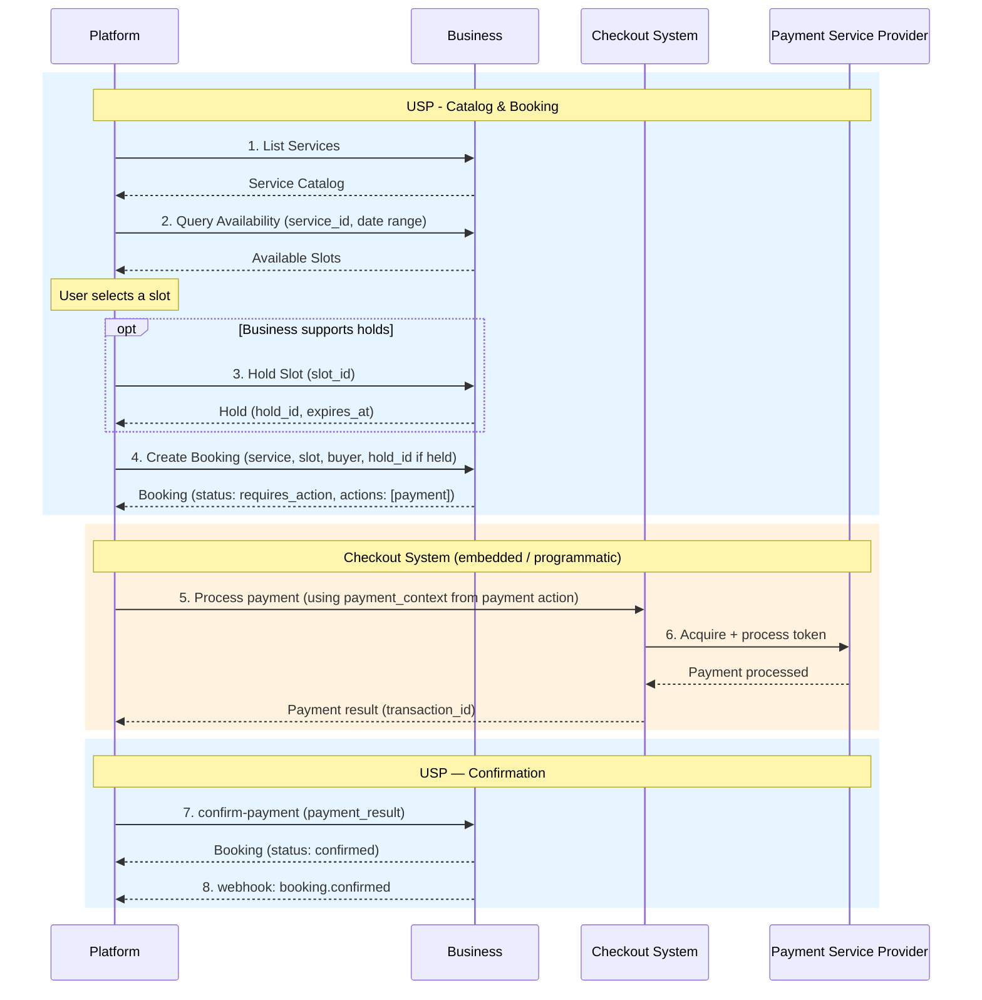

**1. `POST /bookings` — request (no `post_payment_return_request`):**

```json
{
  "service_id": "svc_massage_001",
  "slot_id": "slot_20260316_1400",
  "hold_id": "hold_xyz789",
  "buyer": {
    "first_name": "Alice",
    "last_name": "Williams",
    "email": "alice@example.com",
    "phone_number": "+12125551234"
  },
  "party_size": 1
}
```

**2. `POST /bookings` — response (`requires_action`, payment action):**

See [Section 5.3.1](#531-create-booking---post-bookings) for the full paid-service
example; the booking has `actions[]` with `type: payment`, `payment_context`, and
`continue_url`.

**3. `POST /bookings/{booking_id}/confirm-payment` — request:**

```json
{
  "payment_result": {
    "status": "paid",
    "provider": "stripe",
    "transaction_id": "txn_abc123",
    "amount_paid": 12000,
    "currency": "USD",
    "order_reference": "ord_xyz789"
  }
}
```

**4. `POST /bookings/{booking_id}/confirm-payment` — response (excerpt):**

```json
{
  "booking": {
    "id": "bkg_456def",
    "status": "confirmed",
    "payment": {
      "status": "paid",
      "timing": "at_booking",
      "amount": 12000,
      "currency": "USD",
      "amount_due": 0,
      "transaction_id": "txn_abc123"
    }
  }
}
```

#### 8.6.3 Redirect Payment Flow (Paid Service)

When `checkout_systems` includes `redirect`, the buyer **MAY** complete payment on
the business-hosted page at the payment action's `continue_url`. The platform
**SHOULD** send `post_payment_return_request` on `POST /bookings` so the business
can return the buyer to the platform after pay, cancel, or abandon.

> **Applies when:** Standalone Mode. `checkout_systems` includes `"redirect"`.
> Service: `requires_payment: true`, `payment_timing: at_booking`,
> `confirmation_mode: auto`.

> **JSON Schema:** [/$defs/PostPaymentReturnRequest](schemas/booking.json),
> [/$defs/Booking](schemas/booking.json).

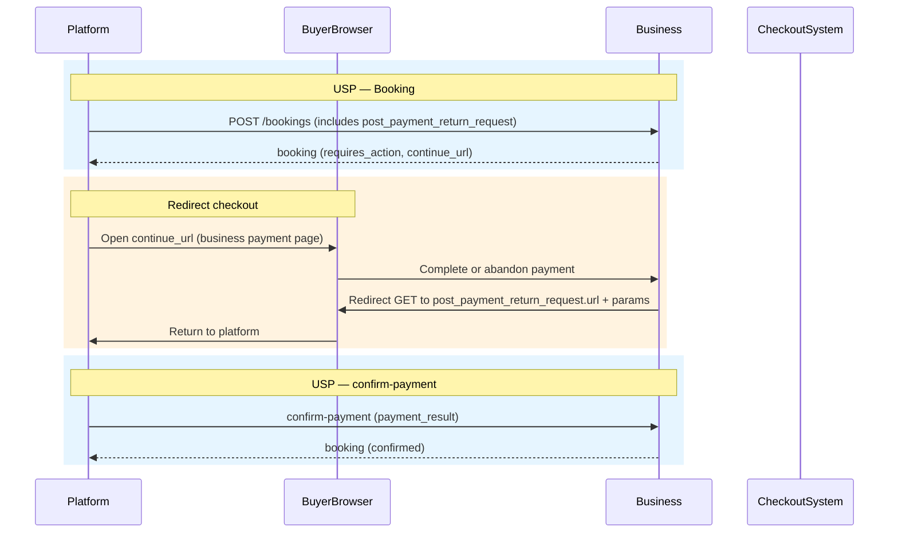

**1. `POST /bookings` — request (with return URL):**

```json
{
  "service_id": "svc_massage_001",
  "slot_id": "slot_20260316_1400",
  "hold_id": "hold_xyz789",
  "buyer": {
    "first_name": "Alice",
    "last_name": "Williams",
    "email": "alice@example.com"
  },
  "party_size": 1,
  "post_payment_return_request": {
    "url": "https://platform.example.com/booking/return",
    "params": { "session_id": "plat-sess-abc123" }
  }
}
```

**2–4.** Response and `confirm-payment` match [Section 8.6.2](#862-embedded-payment-flow-paid-service);
the payment action's `continue_url` is the business payment page per
[Section 8.5.5](#855-redirect-flow-and-post-payment-return).

#### 8.6.4 ACP Payment Flow (Paid Service)

When `checkout_systems` includes `acp`, the platform maps the USP payment action
to an ACP checkout session (including `dev.usp.services.booking`), then confirms
via USP `confirm-payment`. See [Section 8.5.6](#856-acp-booking-extension).

> **Applies when:** Standalone Mode. `checkout_systems` includes `"acp"`.
> Service: `requires_payment: true`, `payment_timing: at_booking`,
> `confirmation_mode: auto`.

> **JSON:** USP booking — [schemas/booking.json](schemas/booking.json). ACP
> session shape — [Section 8.5.6](#856-acp-booking-extension) and ACP docs.

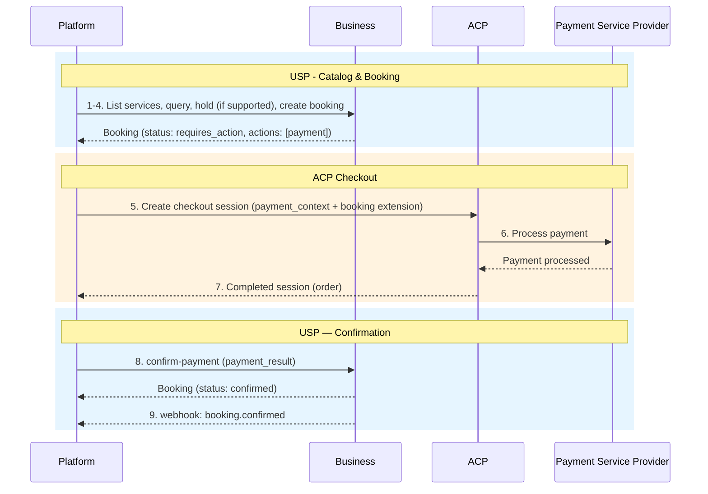

**ACP checkout session (excerpt, after mapping from `payment_context`):**

```json
{
  "id": "cs_usp_001",
  "status": "ready_for_payment",
  "currency": "usd",
  "line_items": [
    {
      "id": "li_001",
      "item": {
        "id": "svc_massage_001",
        "name": "Deep Tissue Massage",
        "unit_amount": 12000
      },
      "quantity": 1,
      "totals": [
        { "type": "subtotal", "display_text": "Subtotal", "amount": 12000 },
        { "type": "total", "display_text": "Total", "amount": 12000 }
      ]
    }
  ],
  "totals": [
    { "type": "subtotal", "display_text": "Subtotal", "amount": 12000 },
    { "type": "total", "display_text": "Total", "amount": 12000 }
  ],
  "fulfillment_options": [],
  "messages": [],
  "links": [],
  "capabilities": {
    "extensions": [
      {
        "name": "dev.usp.services.booking",
        "extends": ["$.CheckoutSession.booking"]
      }
    ]
  },
  "booking": {
    "booking_id": "bkg_456def",
    "service_id": "svc_massage_001",
    "service_type": "appointment",
    "slot": {
      "start": "2026-03-16T14:00:00-04:00",
      "end": "2026-03-16T15:00:00-04:00"
    }
  }
}
```

**`confirm-payment`** uses `order_reference` from the ACP order (`order.id` or
`order.order_number`) when present, and `transaction_id` from the PSP or payment
handler result.

#### 8.6.5 Deposit Flow (Paid Service)

A paid booking with `payment_timing: deposit_required`. The payment action's
`payment_context.amount_due` is the deposit; `payment.amount` carries the full
service price. Example uses `checkout_systems` including `embedded`; other
checkout systems follow the same USP steps.

> **Applies when:** Standalone Mode. Service: `requires_payment: true`,
> `payment_timing: deposit_required`, `confirmation_mode: auto`.

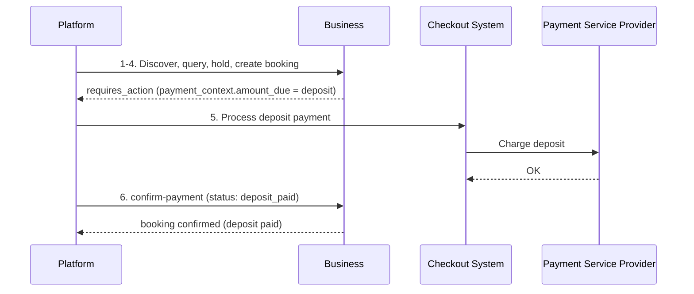

**`POST /bookings` — response (excerpt):**

```json
{
  "booking": {
    "id": "bkg_deposit_001",
    "status": "requires_action",
    "payment": {
      "status": "pending",
      "timing": "deposit_required",
      "amount": 12000,
      "currency": "USD",
      "amount_due": 6000,
      "deposit_amount": 6000
    },
    "actions": [
      {
        "type": "payment",
        "status": "pending",
        "continue_url": "https://business.example.com/pay/bkg_deposit_001",
        "expires_at": "2026-03-16T13:10:00-04:00",
        "payment_context": {
          "amount_due": 6000,
          "currency": "USD",
          "description": "Deposit: Deep Tissue Massage – Mar 16, 2:00 PM",
          "line_items": [
            {
              "label": "Deep Tissue Massage (deposit)",
              "amount": 6000,
              "quantity": 1,
              "item_id": "svc_massage_001"
            }
          ],
          "metadata": {
            "booking_id": "bkg_deposit_001",
            "service_id": "svc_massage_001",
            "service_type": "appointment",
            "slot_start": "2026-03-16T14:00:00-04:00"
          }
        }
      }
    ]
  }
}
```

**`confirm-payment` — request (deposit):**

```json
{
  "payment_result": {
    "status": "deposit_paid",
    "provider": "stripe",
    "transaction_id": "txn_dep_001",
    "amount_paid": 6000,
    "currency": "USD",
    "order_reference": "ord_dep_001"
  }
}
```

The remainder of the service price is due at service time per
[Section 8.5.7](#857-deposit-and-refund-rules).

### 8.7 Payment Path Comparison

This section compares **all** payment paths across [UCP-Native Mode](#7-ucp-native-mode)
and [Standalone Mode](#8-standalone-mode). Detailed JSON and diagrams appear in
[Section 7.7](#77-end-to-end-flows) and [Section 8.6](#86-end-to-end-flows).

| Aspect | Free Service | UCP Checkout | Embedded | Redirect | ACP | Deposit |
|---|:---:|:---:|:---:|:---:|:---:|:---:|
| **Deployment mode** | Both ([§7.7.1](#771-free-service-flow-ucp-native), [§8.6.1](#861-free-service-flow-standalone)) | UCP-Native ([§7.7.2](#772-paid-service-flow-ucp-checkout)) | Standalone ([§8.6.2](#862-embedded-payment-flow-paid-service)) | Standalone ([§8.6.3](#863-redirect-payment-flow-paid-service)) | Standalone ([§8.6.4](#864-acp-payment-flow-paid-service)) | Standalone ([§8.6.5](#865-deposit-flow-paid-service)) |
| **USP scheduling steps** | List / query / hold / create booking | List / query / hold / (checkout replaces create booking) | List / query / hold / create booking | Same as Embedded | Same as Embedded | Same as Embedded |
| **Payment mechanism** | None | UCP `create_checkout` + `complete_checkout` | `payment_context` + `confirm-payment` | Same + browser `continue_url` + `post_payment_return_request` | ACP session + `confirm-payment` | `confirm-payment` with `deposit_paid` |
| **Checkout calls** | None | UCP | Platform PSP | Business page + PSP | ACP + PSP | Platform or redirect PSP |
| **Atomicity** | N/A | Single UCP transaction at `complete_checkout` | Two-phase (pay then confirm) | Two-phase | Two-phase | Two-phase (deposit now) |
| **Buyer redirect** | No | Per UCP escalation | Optional (`continue_url`) | Yes (payment or return URL) | Per ACP | Optional |

---

## 9. Transport Bindings

USP is transport-agnostic. The protocol defines operations and schemas
independent of the wire format. This section specifies how USP operations map to
each supported transport.

### 9.1 REST Binding

The REST binding uses HTTP/1.1 (or higher) with JSON request/response bodies.
All examples in this specification use the REST binding.

- **Schema format:** OpenAPI 3.x (JSON)
- **Authoritative data shapes:** Normative JSON Schema definitions for domain objects live under [`schemas/`](schemas/) (`$defs` per file). The machine-readable [`openapi/usp-rest.json`](openapi/usp-rest.json) references those documents with relative JSON Pointer URIs (for example `../schemas/catalog.json#/$defs/Service`) and is **not** self-contained unless **bundled**. Implementations and tools MUST resolve external `$ref`s against the repository layout (or use a pre-bundled copy). A single-file bundle can be produced with OpenAPI bundlers (for example [Redocly CLI](https://redocly.com/docs/cli/) `bundle` or `@apidevtools/swagger-cli`).
- **Content type:** `application/json`
- **Capability negotiation:** Platform advertises its profile URI via the
  `USP-Agent` header using Dictionary Structured Field syntax ([RFC 8941]):

```
POST /services/list HTTP/1.1
Host: business.example.com
USP-Agent: profile="https://agent.example/profiles/scheduling-agent.json"
Content-Type: application/json

{"filters": {"type": "appointment"}}
```

- **Error responses:** USP uses [RFC 9457] Problem Details for HTTP API error
  responses. USP distinguishes between **protocol errors** and **business
  outcome errors**:

  **Business outcome errors** (e.g., slot unavailable, hold expired, capacity
  exceeded, booking not found) return **HTTP 200** with a `messages[]` array on
  the **response** object. The `messages[]` array is a response-level
  construct — it is not a field on the booking or service object. Each message
  has `type` (`error`, `warning`, `info`), `code`, `content`, optional
  `content_type` (`plain` or `markdown`, default `plain`), optional `severity`,
  and an optional `path` field (RFC 9535 JSONPath).

  The `messages[]` array is available on **all** USP response envelopes,
  including catalog responses (`/services/list`, `/services/{service_id}`,
  `/services/feed`), not only state-modifying operations. On catalog responses,
  messages enable partial-success signalling (e.g., some services could not be
  loaded), filter feedback, service-level warnings, and deprecation notices.
  This aligns with the UCP message model.

  **Protocol errors** (e.g., malformed requests, authentication failures) use
  standard HTTP status codes with [RFC 9457] Problem Details:

| HTTP Status                 | USP Meaning                                                                          |
|-----------------------------|--------------------------------------------------------------------------------------|
| `200 OK`                    | Operation succeeded, or business outcome error (check `messages[]` array for errors) |
| `201 Created`               | Resource successfully created (bookings, holds, registry entries, waitlist entries, feed subscriptions) |
| `400 Bad Request`           | Protocol error: malformed JSON, missing required fields, invalid profile URL         |
| `401 Unauthorized`          | Protocol error: authentication required or invalid credentials                       |
| `403 Forbidden`             | Protocol error: platform profile not in business allowlist                           |
| `422 Unprocessable Entity`  | Protocol error: request is syntactically valid but structurally invalid              |
| `424 Failed Dependency`     | Protocol error: business profile unreachable                                         |
| `429 Too Many Requests`     | Protocol error: rate limited; retry after `Retry-After` header                       |
| `500 Internal Server Error` | Protocol error: unexpected server failure                                            |
| `503 Service Unavailable`   | Protocol error: business temporarily unable to handle requests; retry after `Retry-After` header |

#### 9.1.1 Idempotency

State-modifying operations (booking creation, cancellation, rescheduling, hold
creation, confirm-payment) **SHOULD** support idempotency via the
`Idempotency-Key` header, consistent
with [draft-ietf-httpapi-idempotency-key-header]:

- The platform **SHOULD** send an `Idempotency-Key` header (UUID v4 recommended)
  with all state-modifying requests.
- The business **MUST** store the idempotency key with the operation result for
  at least 24 hours.
- If the business receives a request with a previously seen `Idempotency-Key` and
  the same parameters, it **MUST** return the cached result without re-executing
  the operation.
- If the business receives a request with a previously seen `Idempotency-Key` but
  different parameters, it **MUST** return `409 Conflict`.

```
POST /bookings HTTP/1.1
Host: business.example.com
USP-Agent: profile="https://agent.example/profiles/scheduling-agent.json"
Idempotency-Key: 550e8400-e29b-41d4-a716-446655440000
Content-Type: application/json

{"service_id": "svc_haircut_001", "slot_id": "slot_20260315_0900", ...}
```

Idempotency is critical for booking operations where network retries could
create duplicate reservations. For read-only operations (`GET`,
`POST /services/list`, `POST /availability/query`), idempotency keys are not
required.

#### 9.1.2 Pagination

Several USP operations return paginated result sets. All paginated operations
use the same cursor-based model described here.

**Request fields (for paginated operations):**

| Field    | Type    | Required | Description                                                                                               |
|----------|---------|----------|-----------------------------------------------------------------------------------------------------------|
| `cursor` | string  | No       | Opaque cursor string from the previous response's `pagination.cursor`. Omit on the first request.         |
| `limit`  | integer | No       | Requested page size. Businesses **MAY** apply a lower or upper cap and **SHOULD** document their default. |

**Response fields:**

| Field              | Type    | Required | Description                                                                       |
|--------------------|---------|----------|-----------------------------------------------------------------------------------|
| `pagination.cursor`    | string\|null | **Yes** | Opaque cursor to pass in the next request. `null` when there are no more pages. |
| `pagination.has_more`  | boolean | **Yes** | `true` if additional pages exist; `false` on the last page.                       |

**Semantics:**

- Cursors are opaque strings. Platforms **MUST NOT** attempt to parse or
  construct them.
- Businesses **SHOULD** honor a cursor for at least 60 seconds after it is
  issued. Platforms that retry after cursor expiry **MAY** receive a
  `cursor_expired` error and **SHOULD** restart from the first page.
- Result ordering is operation-specific and is stated at each operation. For
  `POST /availability/query`, slots are returned in ascending `start` order.
- Businesses **SHOULD** use a default page size of 50 items for slot queries
  and 20 items for service lists.

> **Feed endpoint exception:** The `GET /services/feed` endpoint
> ([Section 3.1](#31-service-catalog-feed)) uses a timestamp-based cursor
> named `next_cursor` (not `cursor`) because its pagination semantics are tied
> to the RPDE incremental-sync model. All other paginated USP operations use
> the `cursor`/`has_more` pattern described above.

#### 9.1.3 Discovery

This subsection specifies **profile discovery** for the REST binding: how
platforms learn a business's REST endpoints via the business profile. It does
**not** cover catalog discovery ([Section 6](#6-discovery-registry-optional)) or
platform onboarding ([Section 1.2](#12-terminology)).

Platforms discover a business's REST endpoints through the business profile published at `/.well-known/usp` ([Section 8.2](#82-business-profile-well-knownusp)). The profile's `usp.services` array lists supported USP operations with their base URLs and transport type. Platforms **MUST** filter for entries where `transport` is `"rest"` to locate REST endpoints.

On each request, the platform identifies itself by sending the `USP-Agent` header with Dictionary Structured Field syntax ([RFC 8941]), carrying the platform's profile URI:

```
USP-Agent: profile="https://agent.example/profiles/scheduling-agent.json"
```

The business resolves the platform profile to perform capability negotiation ([Section 8.3](#83-capability-negotiation)). For UCP-Native deployments, profile discovery is inherited from `/.well-known/ucp` ([Section 7.2](#72-profile-registration-in-well-knownucp)).

> **Schema reference:** Business profile — [`schemas/profile.json#/$defs/BusinessProfile`](schemas/profile.json). Platform profile — [`schemas/profile.json#/$defs/PlatformProfile`](schemas/profile.json). Service binding — [`schemas/usp.json#/$defs/ServiceBinding`](schemas/usp.json).

#### 9.1.4 Request Signing

State-modifying REST requests (POST, PUT, DELETE on bookings, holds, waitlist, registry) **SHOULD** be signed using HTTP Message Signatures [RFC 9421] to ensure integrity and authenticity. Signing is the **RECOMMENDED** way to satisfy the privileged-operation authentication requirement of [Section 10.1.6](#1016-platform-authentication-for-privileged-operations) when the platform has no pre-established credential with the business: it requires no prior credential exchange, so it scales unchanged from a single well-known platform to a large population of distinct personal-agent instances. Request signing uses the same infrastructure as webhook signing ([Section 10.1.1](#1011-webhook-security)).

**Signed components:** The covered components are the same set [UCP] requires for its REST binding, so that one signature satisfies a USP verifier and a UCP verifier alike. The signature **MUST** cover `@method`, `@authority`, and `@path`. It **MUST** additionally cover each of the following when present on the request: `@query`, `usp-agent` (or `ucp-agent`, in UCP-Native Mode), `idempotency-key`, `content-digest`, and `content-type`.

> **Do not substitute `@target-uri` for `@authority` and `@path`.** A verifier
> that enforces covered components (as [UCP] does) treats a request whose
> target components are absent from the covered set as unsigned, so a signature
> covering only `@target-uri` fails verification. `@target-uri` **MAY** be
> covered in addition, never instead.

**Signature parameters:** `keyid` **MUST** identify the signing key. `created` is **OPTIONAL** for request signing, matching [UCP]: request replay protection is provided at the business layer by the signed `Idempotency-Key` (see the replay paragraph below), not by a signature timestamp. A signer that includes `created` **MUST** express it as an RFC 9421 signature parameter (`;created=...`), not as a covered component identifier.

**Algorithm and encoding:** Verifiers **MUST** support verifying `ES256` (ECDSA P-256 with SHA-256), which is the baseline [UCP] and USP share. Signers **SHOULD** default to `ES256` absent a specific counterparty constraint. ECDSA signature values **MUST** use the fixed-width raw `r||s` encoding required by [RFC 9421] (64 bytes for P-256), not ASN.1/DER; several common crypto libraries emit DER by default and require explicit conversion. `Content-Digest` is computed over the raw body bytes per [RFC 9530] using `sha-256`; intermediaries **MUST NOT** re-serialize JSON bodies, as that invalidates the signature.

**Replay protection:** Platforms **SHOULD** send `Idempotency-Key` on state-modifying privileged requests ([Section 9.1.1](#911-idempotency)) and, when signing, **MUST** include it in the covered components so it cannot be altered in transit. Businesses **SHOULD** reject or de-duplicate replays on that key. USP does not impose a signature-timestamp freshness window on requests; where a business does enforce one (or where a signature carries `created`/`expires` for an external profile such as Web Bot Auth), it **MUST** be applied in addition to, not instead of, idempotency-key de-duplication.

**Platform signing keys:** When a platform signs requests, it **MUST** publish signing material in the platform profile ([Section 8.2.3](#823-platform-profile)) via the top-level `keys` array (UCP-canonical). It **MAY** also publish an identical `signing_keys` array during transition; dual-publish is **RECOMMENDED**. Verifiers **MUST** resolve a `keyid` against `keys` first and fall back to `signing_keys` otherwise (same rule as [Section 10.1.1](#1011-webhook-security)). Businesses that require HTTP Message Signatures for privileged operations **MUST** advertise this in their business profile's `authorization` object (see [Section 10.1.6](#1016-platform-authentication-for-privileged-operations) and [`schemas/profile.json`](schemas/profile.json) `$defs/AuthorizationPolicy`).

**Example:**

```http
POST /bookings HTTP/1.1
Host: business.example.com
Content-Type: application/json
USP-Agent: profile="https://agent.example/profiles/scheduling-agent.json"
Idempotency-Key: 550e8400-e29b-41d4-a716-446655440000
Content-Digest: sha-256=:RK/0qy18MlBSVnWgjwz6lZEWjP/lF5HF9bvEF8FabDg=:
Signature-Input: sig1=("@method" "@authority" "@path" "usp-agent" "idempotency-key" "content-digest" "content-type");keyid="platform-2026"
Signature: sig1=:MEUCIQDXyK9N3p5Rt...:

{"service_id": "svc_haircut_001", "slot_id": "slot_20260315_0900", ...}
```

> **MCP note:** The MCP binding is subject to the same Section 10.1.6 privileged-operation floor as REST. When MCP runs over HTTP, platforms **SHOULD** satisfy that floor with the same HTTP-layer mechanisms as REST (RFC 9421 `Signature` / `Signature-Input`, `Authorization: Bearer`, or mTLS) keyed off `_meta.usp.profile` (the MCP equivalent of `USP-Agent`). When the credential must ride inside the tool call (stdio MCP, or a `booking_scoped_credential`), carry it in `_meta.usp.authorization` per [`openrpc/usp-mcp.json`](openrpc/usp-mcp.json) `components.schemas.McpAuthorization`. Transport integrity of the MCP session itself (stdio pipe or HTTP-SSE with TLS) remains necessary but is **not** a substitute for Section 10.1.6 platform authentication on privileged methods.

#### 9.1.5 REST Binding Conformance

A conforming REST binding implementation **MUST:**

1. Serve all endpoints over HTTPS (TLS 1.2 or later).
2. Accept and return `application/json` on all endpoints.
3. Return [RFC 9457] Problem Details for protocol errors.
4. Return business outcome errors as HTTP 200 with a `messages[]` array on the response object.
5. Support the `USP-Agent` header on all requests ([Section 9.1.3](#913-discovery)).
6. Return `201 Created` for resource creation operations (bookings, holds, registry entries, waitlist entries, feed subscriptions).
7. Implement webhook signing per [Section 10.1.1](#1011-webhook-security).

A conforming REST binding implementation **SHOULD:**

1. Support the `Idempotency-Key` header on state-modifying operations ([Section 9.1.1](#911-idempotency)).
2. Sign state-modifying requests using HTTP Message Signatures [RFC 9421] ([Section 9.1.4](#914-request-signing)).
3. Support cursor-based pagination per [Section 9.1.2](#912-pagination).

> **Schema reference:** [`openapi/usp-rest.json`](openapi/usp-rest.json)

### 9.2 MCP Binding

The MCP (Model Context Protocol) binding uses JSON-RPC 2.0 over stdio or
HTTP-SSE, designed for AI agents that interact with USP via tool calls.

- **Schema format:** OpenRPC (JSON)
- **Authoritative data shapes:** As with the REST binding, domain types are defined once under [`schemas/`](schemas/); [`openrpc/usp-mcp.json`](openrpc/usp-mcp.json) uses relative `$ref`s into those `$defs` and requires the same multi-file resolution (or bundling) as [`openapi/usp-rest.json`](openapi/usp-rest.json).
- **Transport:** JSON-RPC 2.0

#### 9.2.1 Method Mapping

Each USP REST operation maps to a JSON-RPC method:

| REST Operation                                | MCP Method Name                | Description                             |
|-----------------------------------------------|--------------------------------|-----------------------------------------|
| `POST /services/list`                         | `usp_services_list`            | List services from catalog              |
| `GET /services/{service_id}`                  | `usp_services_get`             | Get a single service                    |
| `GET /services/feed`                          | `usp_services_feed`            | Get service catalog feed                |
| `POST /services/feed/subscriptions`           | `usp_services_feed_subscribe`  | Create a feed subscription              |
| `POST /availability/query`                    | `usp_availability_query`       | Query time slots                        |
| `POST /availability/holds`                    | `usp_availability_hold`        | Hold a slot (requires `holds: true`)    |
| `DELETE /availability/holds/{hold_id}`        | `usp_availability_release`     | Release a hold (requires `holds: true`) |
| `POST /bookings`                              | `usp_bookings_create`          | Create a booking                        |
| `GET /bookings/{booking_id}`                  | `usp_bookings_get`             | Get a booking                           |
| `PUT /bookings/{booking_id}`                  | `usp_bookings_update`          | Update a booking                        |
| `POST /bookings/{booking_id}/confirm`         | `usp_bookings_confirm`         | Confirm a booking (manual mode)         |
| `POST /bookings/{booking_id}/cancel`          | `usp_bookings_cancel`          | Cancel a booking                        |
| `POST /bookings/{booking_id}/reschedule`      | `usp_bookings_reschedule`      | Reschedule a booking                    |
| `POST /bookings/{booking_id}/confirm-payment` | `usp_bookings_confirm_payment` | Confirm payment for a booking           |
| `POST /waitlist`                              | `usp_waitlist_join`            | Join a waitlist                         |
| `POST /waitlist/list`                         | `usp_waitlist_list`            | List waitlist entries                   |
| `GET /waitlist/{entry_id}`                    | `usp_waitlist_get`             | Get waitlist entry                      |
| `DELETE /waitlist/{entry_id}`                 | `usp_waitlist_leave`           | Leave waitlist                          |
| `POST /waitlist/{entry_id}/accept`            | `usp_waitlist_accept`          | Accept a waitlist offer                 |
| `POST /waitlist/{entry_id}/decline`           | `usp_waitlist_decline`         | Decline a waitlist offer                |
| `POST /registry/businesses`                   | `usp_registry_register`        | Register business (discovery registry)  |
| `POST /registry/search_business`              | `usp_registry_search_business` | Search businesses (discovery registry)  |
| `POST /registry/search_services`              | `usp_registry_search_services` | Search services (discovery registry)    |
| `GET /registry/businesses/{id}`             | `usp_registry_get`             | Get registration by ID                  |
| `PUT /registry/businesses/{id}`               | `usp_registry_update`          | Update registration                     |
| `DELETE /registry/businesses/{id}`          | `usp_registry_delete`          | Delete registration                     |

#### 9.2.2 Request/Response Format

MCP clients invoke USP operations via the standard MCP `tools/call` method, with `params.name` set to the method name from [Section 9.2.1](#921-method-mapping) and `params.arguments` containing the operation parameters. The method names in [Section 9.2.1](#921-method-mapping) are the tool names passed in `params.name`, not raw JSON-RPC methods.

The `_meta.usp.profile` field inside `arguments` carries the platform's profile URI, equivalent to the `USP-Agent` header in the REST binding. It is the identity-binding input for [Section 10.1.6](#1016-platform-authentication-for-privileged-operations): every privileged MCP method **MUST** include it, and any presented credential **MUST** be bound to that same profile URI.

Privileged vs public access is transport-agnostic and **MUST** match the REST binding:

- **Public methods** (`x-usp-access: public` in [`openrpc/usp-mcp.json`](openrpc/usp-mcp.json)): catalog, availability query, and registry search/get. Authentication is optional.
- **Privileged platform-level methods** (`x-usp-access: privileged_platform`): create booking/hold/waitlist, feed subscribe, registry register, waitlist list. Authentication **MUST** use a mechanism from the business's `AuthorizationPolicy` ([`schemas/profile.json`](schemas/profile.json) `$defs/AuthorizationPolicy`), the same mechanism set documented for REST in [`openapi/usp-rest.json`](openapi/usp-rest.json) `components.securitySchemes` and for MCP in [`openrpc/usp-mcp.json`](openrpc/usp-mcp.json) `components.x-usp-securitySchemes`.
- **Privileged scoped methods** (`x-usp-access: privileged_scoped`): get/update/cancel/reschedule/confirm on an existing booking, hold, waitlist entry, or registry registration. Same as platform-level, and **SHOULD** prefer a retained `booking_scoped_credential` when the business accepts it.

When MCP runs over HTTP, platforms **SHOULD** present `oauth2_bearer` / `api_key` on the HTTP `Authorization` header, `http_message_signature` via RFC 9421 headers, and `mtls` via the TLS client certificate. When the credential must ride inside the tool call (stdio, or a booking-scoped credential), platforms **MUST** use `_meta.usp.authorization` ([`McpAuthorization`](openrpc/usp-mcp.json)).

For state-modifying operations (booking creation, cancellation, rescheduling, hold creation, confirm-payment, and other methods that declare `idempotency_key` on `_meta.usp`), the platform **SHOULD** include `_meta.usp.idempotency_key` (UUID v4), equivalent to the REST `Idempotency-Key` header (see [Section 9.1.1](#911-idempotency)).

> **Schema reference:** The MCP binding schema is defined in [`openrpc/usp-mcp.json`](openrpc/usp-mcp.json). Shared authorization policy and mechanism enums live in [`schemas/profile.json`](schemas/profile.json) (`$defs/AuthorizationPolicy`, `$defs/AuthorizationMechanism`) and **MUST NOT** be re-defined inline in either binding.

**Complete JSON-RPC request example:**

```json
{
  "jsonrpc": "2.0",
  "method": "tools/call",
  "params": {
    "name": "usp_availability_query",
    "arguments": {
      "service_id": "svc_haircut_001",
      "start_date": "2026-03-15",
      "end_date": "2026-03-16",
      "_meta": {
        "usp": {
          "profile": "https://agent.example/profiles/scheduling-agent.json"
        }
      }
    }
  },
  "id": 1
}
```

**State-modifying request example (with idempotency key):**

```json
{
  "jsonrpc": "2.0",
  "method": "tools/call",
  "params": {
    "name": "usp_bookings_create",
    "arguments": {
      "service_id": "svc_haircut_001",
      "slot_id": "slot_20260315_0900",
      "buyer": {
        "first_name": "Alice",
        "email": "alice@example.com"
      },
      "_meta": {
        "usp": {
          "profile": "https://agent.example/profiles/scheduling-agent.json",
          "idempotency_key": "550e8400-e29b-41d4-a716-446655440000"
        }
      }
    }
  },
  "id": 2
}
```

**Complete JSON-RPC response example:**

Responses use the `structuredContent` / `content` dual-envelope pattern. The `structuredContent` object carries typed USP response data (including the `usp` metadata and optional `messages[]` array). The `content` array provides a human-readable text summary for MCP clients that render text.

```json
{
  "jsonrpc": "2.0",
  "result": {
    "structuredContent": {
      "usp": {
        "version": "2026-02-09",
        "capabilities": {
          "dev.usp.services.availability": [
            {
              "version": "2026-02-09"
            }
          ]
        }
      },
      "service_id": "svc_haircut_001",
      "slots": [
        {
          "id": "slot_20260315_0900",
          "service_id": "svc_haircut_001",
          "start": "2026-03-15T09:00:00-04:00",
          "end": "2026-03-15T10:00:00-04:00",
          "duration": "PT60M",
          "state": "available"
        }
      ],
      "messages": []
    },
    "content": [
      {
        "type": "text",
        "text": "Found 1 available slot for svc_haircut_001 on 2026-03-15: 09:00–10:00 ET."
      }
    ]
  },
  "id": 1
}
```

**Business outcome error example:**

Business outcome errors (e.g., slot unavailable, hold expired) are returned inside the JSON-RPC `result` object within the `structuredContent` envelope, with a `messages[]` array — **not** as a JSON-RPC `error`. This mirrors the REST binding, where business outcome errors return HTTP 200 with `messages[]`. See [Section 9.4](#94-error-code-mapping) for the full error taxonomy.

```json
{
  "jsonrpc": "2.0",
  "result": {
    "structuredContent": {
      "usp": {
        "version": "2026-02-09"
      },
      "messages": [
        {
          "type": "error",
          "code": "slot_unavailable",
          "content": "The requested slot is no longer available.",
          "severity": "recoverable"
        }
      ]
    },
    "content": [
      {
        "type": "text",
        "text": "Error: The requested slot is no longer available."
      }
    ]
  },
  "id": 2
}
```

**Protocol error example:**

Protocol errors (e.g., malformed requests, authentication failures) use the JSON-RPC `error` object. Only protocol-level failures use this mechanism. See the protocol errors table in [Section 9.4](#94-error-code-mapping) for the complete list and JSON-RPC error codes.

```json
{
  "jsonrpc": "2.0",
  "error": {
    "code": -32600,
    "message": "invalid_request",
    "data": {
      "content": "Missing required field: service_id"
    }
  },
  "id": 3
}
```

#### 9.2.3 Webhook Notifications

Booking, catalog, and (when the waitlist extension is supported) waitlist lifecycle events are delivered as webhook notifications. This section specifies delivery semantics for all USP transports.

**Payload schemas:** [`schemas/webhook_event.json`](schemas/webhook_event.json) defines `BookingEvent`, `CatalogEvent`, and `WaitlistEvent`. The REST binding documents outbound webhook POST bodies under `webhooks` in [`openapi/usp-rest.json`](openapi/usp-rest.json). The MCP binding exposes the same shapes as `BookingWebhookEvent`, `CatalogWebhookEvent`, and `WaitlistWebhookEvent` in [`openrpc/usp-mcp.json`](openrpc/usp-mcp.json) `components.schemas` for validators and tooling (notifications use method `usp_webhook` per the examples below).

**Delivery semantics:** USP webhooks use **at-least-once** delivery. Platforms **MUST** handle duplicate events idempotently (e.g., by tracking `event_id`).

**Retry behavior:** Businesses **SHOULD** retry failed deliveries (non-2xx response or timeout) with exponential backoff: initial delay 30 seconds, maximum 3 retries, maximum total delay 15 minutes. After all retries are exhausted, the business **SHOULD** log the failure and **MAY** surface it via a monitoring API.

**Acknowledgment:** Platforms **MUST** respond with an HTTP 2xx status code within 10 seconds to acknowledge receipt. Non-2xx responses or timeouts trigger retry.

**URL registration:** Webhook callback URLs are registered via the platform profile's `webhook_url` field ([Section 8.2.3](#823-platform-profile)) or per-subscription via `POST /services/feed/subscriptions` ([Section 3.12](#312-feed-subscriptions)).

**Signature verification:** All webhook payloads **MUST** be signed per [Section 10.1.1](#1011-webhook-security). Platforms **MUST** verify signatures before processing events.

**Event ordering:** Events for the same booking are delivered in causal order. Events across different bookings have no ordering guarantee.

**MCP transport:** In the MCP binding, webhooks are delivered as JSON-RPC **notifications** (messages without an `id` field):

```json
{
  "jsonrpc": "2.0",
  "method": "usp_webhook",
  "params": {
    "event": "booking.confirmed",
    "event_id": "evt_789abc",
    "booking_id": "bkg_456def",
    "order_id": "ord_ucp_001",
    "timestamp": "2026-03-14T22:06:00Z",
    "data": { "...": "full booking object per schemas/webhook_event.json" }
  }
}
```

**REST transport:** Webhook notifications are delivered as HTTP POST requests to the registered `webhook_url`:

```http
POST /webhooks/usp HTTP/1.1
Host: platform.example.com
Content-Type: application/json
Content-Digest: sha-256=:X48E9qOokqqrvdts8nOJRJN3OWDUoyWxBf7kbu9DBPE=:
Signature-Input: sig1=("@method" "@authority" "@path" "content-digest" "content-type");keyid="biz-webhook-2026";created=1711036800
Signature: sig1=:MEUCIQDTxNq8h7LGHpvVZQp1iHkFp9...:

{
  "event": "booking.confirmed",
  "event_id": "evt_789abc",
  "booking_id": "bkg_456def",
  "order_id": "ord_ucp_001",
  "timestamp": "2026-03-14T22:06:00Z",
  "data": { "..." : "full booking object" }
}
```

#### 9.2.4 MCP Binding Conformance

A conforming MCP binding implementation **MUST:**

1. Use the `tools/call` envelope with `params.name` set to the method name and `params.arguments` containing operation parameters.
2. Wrap results in the `structuredContent` / `content` dual-envelope pattern.
3. Return business outcome errors in `result.structuredContent.messages[]`, not as JSON-RPC `error`.
4. Use JSON-RPC `error` only for protocol errors ([Section 9.4](#94-error-code-mapping)).
5. Include `_meta.usp.profile` on every privileged method (`x-usp-access` of `privileged_platform` or `privileged_scoped`) and bind any presented credential to that profile per [Section 10.1.6](#1016-platform-authentication-for-privileged-operations).
6. Authenticate privileged methods with at least one mechanism declared in the business's `AuthorizationPolicy` (the same mechanism set as the REST binding); reject unauthenticated privileged calls when the business requires authentication.
7. Deliver webhook notifications as JSON-RPC notifications (no `id` field).

A conforming MCP binding implementation **SHOULD:**

1. Include `_meta.usp.idempotency_key` on state-modifying operations.
2. Provide a human-readable text summary in `result.content[]`.
3. Prefer HTTP-layer credentials (Authorization / Signature / mTLS) when MCP runs over HTTP, and use `_meta.usp.authorization` for stdio sessions and for `booking_scoped_credential`.
4. Prefer a retained `booking_scoped_credential` on privileged_scoped get/cancel/reschedule/PII-bearing calls when the business accepts that mechanism.

> **Schema reference:** [`openrpc/usp-mcp.json`](openrpc/usp-mcp.json)

### 9.3 A2A Binding

The A2A (Agent-to-Agent) binding enables USP interactions between autonomous
agents using the [A2A protocol](https://a2a-protocol.org/latest/).

- **Schema format:** Agent Card Specification
- **Transport:** A2A protocol (HTTP-based agent messaging)

Each USP operation is expressed as an A2A **task**. The full multi-step booking
flow is supported through A2A task chaining.

#### 9.3.1 Task-Type Mapping

| USP Operation      | A2A Task Type                  | Description                           |
|--------------------|--------------------------------|---------------------------------------|
| List Services      | `usp/services/list`            | Discovery task                        |
| Get Service        | `usp/services/get`             | Get single service                    |
| Service Feed       | `usp/services/feed`            | Feed sync task                        |
| Query Availability | `usp/availability/query`       | Availability task                     |
| Hold Slot          | `usp/availability/hold`        | Hold task (requires `holds: true`)    |
| Release Slot       | `usp/availability/release`     | Release task (requires `holds: true`) |
| Create Booking     | `usp/bookings/create`          | Booking task                          |
| Get Booking        | `usp/bookings/get`             | Booking status                        |
| Cancel Booking     | `usp/bookings/cancel`          | Cancellation task                     |
| Reschedule Booking | `usp/bookings/reschedule`      | Reschedule task                       |
| Confirm Payment    | `usp/bookings/confirm-payment` | Payment confirmation                  |
| Join Waitlist      | `usp/waitlist/join`            | Waitlist task                         |

#### 9.3.2 End-to-End Example: Booking Flow via A2A

The following shows a complete booking flow through A2A task chaining between a
scheduling agent and a business agent:

1. **Platform agent → Business agent:** Task `usp/services/list` with filters.
   Business agent returns the service catalog.
2. **Platform agent → Business agent:** Task `usp/availability/query` with the
   selected service and date range. Business agent returns available slots.
3. *(If business supports holds)* **Platform agent → Business agent:** Task
   `usp/availability/hold` with the selected slot. Business agent returns the
   hold.
4. **Platform agent → Business agent:** Task `usp/bookings/create` with service,
   slot, buyer, optional recipient, and `hold_id` (if step 3 was performed).
   Business agent returns the booking.
5. *(If payment required)* Platform agent processes payment through the
   configured checkout system.
6. **Platform agent → Business agent:** Task `usp/bookings/confirm-payment` with
   the payment result.

Each task in the chain carries the A2A conversation context, enabling the
business agent to maintain state across the multi-step flow.

#### 9.3.3 Agent Card

A USP-enabled business agent **MUST** publish an [Agent Card](https://a2a-protocol.org/latest/#agent-card) advertising its USP capabilities. The Agent Card **SHOULD** include the supported USP task types from [Section 9.3.1](#931-task-type-mapping) and authentication requirements.

**Minimal Agent Card example:**

```json
{
  "name": "Glamour Salon Scheduling Agent",
  "description": "Handles appointment booking for Glamour Salon via USP.",
  "url": "https://salon.example.com/a2a",
  "capabilities": {
    "tasks": [
      "usp/services/list",
      "usp/availability/query",
      "usp/bookings/create",
      "usp/bookings/cancel",
      "usp/bookings/reschedule"
    ]
  },
  "authentication": {
    "schemes": ["bearer"]
  },
  "usp_profile": "https://salon.example.com/.well-known/usp"
}
```

The `usp_profile` field is a USP extension that points to the business's `/.well-known/usp` profile ([Section 8.2](#82-business-profile-well-knownusp)), enabling platform agents to perform capability negotiation.

#### 9.3.4 DataPart Conventions

USP data maps to A2A [DataPart](https://a2a-protocol.org/latest/#data-parts) objects as follows:

- Each USP response (service list, availability slots, booking, etc.) is carried as a DataPart with `mimeType: "application/json"` and `data` containing the USP response object.
- The USP metadata (`usp` envelope with `version` and `capabilities`) is carried in the DataPart's `metadata` field.
- Business outcome errors are carried in `data.messages[]`, consistent with the REST and MCP bindings.

**Example DataPart for an availability response:**

```json
{
  "mimeType": "application/json",
  "metadata": {
    "usp": {
      "version": "2026-02-09"
    }
  },
  "data": {
    "service_id": "svc_haircut_001",
    "slots": [
      {
        "id": "slot_20260315_0900",
        "start": "2026-03-15T09:00:00-04:00",
        "end": "2026-03-15T10:00:00-04:00",
        "state": "available"
      }
    ],
    "messages": []
  }
}
```

#### 9.3.5 Session Management

A2A tasks within the same booking flow **SHOULD** share a session context (`sessionId`). The session enables the business agent to maintain state (e.g., held slots, partial booking data) across multi-step task chains.

- The platform agent **SHOULD** include a `sessionId` on all tasks after the first in a booking flow.
- The business agent **MUST** return a `sessionId` in the response to the first task if it requires session continuity.
- Session timeout **SHOULD** be at least 30 minutes for multi-step flows.
- When a session expires, any associated holds are released and partial booking state is discarded.

#### 9.3.6 A2A Binding Conformance

A conforming A2A binding implementation **MUST:**

1. Publish an Agent Card advertising supported USP task types ([Section 9.3.3](#933-agent-card)).
2. Use task types from [Section 9.3.1](#931-task-type-mapping).
3. Carry USP data as DataParts with `mimeType: "application/json"` ([Section 9.3.4](#934-datapart-conventions)).
4. Return business outcome errors in `data.messages[]`, consistent with REST and MCP bindings.

A conforming A2A binding implementation **SHOULD:**

1. Maintain session context (`sessionId`) across multi-step booking flows ([Section 9.3.5](#935-session-management)).
2. Include the `usp_profile` field in the Agent Card pointing to `/.well-known/usp`.

### 9.4 Error Code Mapping

USP defines the following error codes, which are transport-independent.

Each message in the `messages[]` array carries the following fields:

| Field          | Type   | Required | Description                                                                                                             |
|----------------|--------|----------|-------------------------------------------------------------------------------------------------------------------------|
| `type`         | string | **Yes**  | Message type discriminator: `error`, `warning`, or `info`.                                                              |
| `code`         | string | No       | Machine-readable code identifying the message (e.g., `slot_unavailable`). Standard codes listed below; freeform codes permitted. |
| `content`      | string | **Yes**  | Human-readable message text.                                                                                            |
| `content_type` | string | No       | Content format: `plain` (default) or `markdown`.                                                                         |
| `severity`     | string | No       | `recoverable`, `requires_buyer_input`, `requires_buyer_review`, or `unrecoverable`. See severity descriptions below.    |
| `path`         | string | No       | RFC 9535 JSONPath to the field this message relates to (e.g., `$.services[0].pricing`).                                  |

**Severity levels:**

| Severity               | Description                                                                                                   |
|------------------------|---------------------------------------------------------------------------------------------------------------|
| `recoverable`          | Platform can resolve by modifying inputs and retrying.                                                        |
| `requires_buyer_input` | Buyer must provide information before proceeding.                                                             |
| `requires_buyer_review`| Buyer must authorize before proceeding due to policy or regulatory rules.                                     |
| `unrecoverable`        | No valid resource exists to act on; retry with new resource or inputs.                                        |

**Business outcome errors** (returned via `messages[]` in an HTTP 200 response):

Business outcome errors are returned in the `messages[]` array of the response object (REST) or the `result.messages[]` array (MCP). They do not use JSON-RPC error codes because they are not JSON-RPC errors — the request was processed successfully, and the business is communicating an application-level outcome.

| USP Error Code             | Description                                                                                                                                                                     | REST Status | Severity                |
|----------------------------|---------------------------------------------------------------------------------------------------------------------------------------------------------------------------------|-------------|-------------------------|
| `slot_unavailable`         | The requested slot is no longer available                                                                                                                                       | `200 OK`    | `recoverable`           |
| `hold_expired`             | The hold has expired                                                                                                                                                            | `200 OK`    | `recoverable`           |
| `booking_not_found`        | The booking ID does not exist                                                                                                                                                   | `200 OK`    | `recoverable`           |
| `validation_error`         | Request fields are invalid or violate constraints                                                                                                                               | `200 OK`    | `requires_buyer_input`  |
| `booking_window_violated`  | Booking is outside the allowed advance window                                                                                                                                   | `200 OK`    | `requires_buyer_input`  |
| `capacity_exceeded`        | Not enough capacity for the requested party size                                                                                                                                | `200 OK`    | `recoverable`           |
| `reschedule_limit_reached` | Maximum number of reschedules exceeded                                                                                                                                          | `200 OK`    | `requires_buyer_review` |
| `cancellation_not_allowed` | Cancellation is not permitted at this time                                                                                                                                      | `200 OK`    | `requires_buyer_review` |
| `payment_required`         | Payment must be completed before confirmation. This code appears on the payment action's `message` field, not as a response-level error.                                        | `200 OK`    | `requires_buyer_input`  |
| `payment_expired`          | The payment context has expired; booking was canceled                                                                                                                           | `200 OK`    | `recoverable`           |
| `payment_amount_mismatch`  | The `confirm-payment` amount does not match `amount_due`                                                                                                                        | `200 OK`    | `requires_buyer_input`  |
| `actions_pending`          | Non-payment actions must be completed before payment can proceed. Returned when `confirm-payment` or `complete_checkout` is called while non-payment actions are still pending. | `200 OK`    | `requires_buyer_input`  |
| `price_mismatch`           | Line item price does not match the service's current catalog price (e.g., at UCP `create_checkout` / `update_checkout`).                                                          | `200 OK`    | `recoverable`           |
| `waitlist_full`            | The waitlist has reached its maximum capacity. Requires `dev.usp.services.waitlist` capability ([Section 11.1.6](#1116-error-codes)).                                             | `200 OK`    | `recoverable`           |
| `offer_expired`            | The offered slot's acceptance window has passed. Requires `dev.usp.services.waitlist` capability ([Section 11.1.6](#1116-error-codes)).                                           | `200 OK`    | `recoverable`           |
| `entry_not_found`          | The waitlist entry ID does not exist. Requires `dev.usp.services.waitlist` capability ([Section 11.1.6](#1116-error-codes)).                                                      | `200 OK`    | `recoverable`           |
| `offer_already_accepted`   | The offer has already been accepted. Requires `dev.usp.services.waitlist` capability ([Section 11.1.6](#1116-error-codes)).                                                       | `200 OK`    | `recoverable`           |

**Protocol errors** (use standard HTTP status codes and JSON-RPC error codes):

Protocol errors indicate transport-level or infrastructure failures that prevented the request from being processed. In the REST binding, they use standard HTTP status codes with [RFC 9457] Problem Details. In the MCP binding, they use the JSON-RPC `error` object with unique error codes.

| Protocol Error              | Description                                                                                                          | REST Status                 | JSON-RPC Code |
|-----------------------------|----------------------------------------------------------------------------------------------------------------------|-----------------------------|---------------|
| `invalid_request`           | Malformed JSON, missing required fields                                                                              | `400 Bad Request`           | `-32600`      |
| `invalid_profile_url`       | Profile URL is malformed, uses a non-HTTPS scheme, or is unresolvable                                               | `400 Bad Request`           | `-32602`      |
| `profile_unreachable`       | Profile fetch failed (timeout, DNS failure, non-2xx response)                                                        | `424 Failed Dependency`     | `-32003`      |
| `profile_malformed`         | Profile document is not valid JSON or fails schema validation against [`schemas/profile.json`](schemas/profile.json) | `422 Unprocessable Entity`  | `-32004`      |
| `capabilities_incompatible` | The capability intersection between the business and platform profiles is empty — no shared capabilities             | `200 OK`                    | result        |
| `profile_not_trusted`       | The platform profile URL is not in the business's pre-approved allowlist (when the business enforces an allowlist)   | `403 Forbidden`             | `-32005`      |
| `authentication_required`   | Authentication credentials are missing or invalid                                                                    | `401 Unauthorized`          | `-32006`      |
| `rate_limited`              | Too many requests                                                                                                    | `429 Too Many Requests`     | `-32007`      |
| `version_unsupported`       | The requested USP version is not supported                                                                           | `400 Bad Request`           | `-32008`      |
| `service_unavailable`       | Business is temporarily unable to handle requests                                                                    | `503 Service Unavailable`   | `-32009`      |
| `server_error`              | Unexpected server failure                                                                                            | `500 Internal Server Error` | `-32603`      |

> **Note on `capabilities_incompatible`:** This is a business outcome error
> (returned with HTTP 200 and a `messages[]` entry) rather than a protocol
> error, because the request itself was valid — the business and platform simply
> have no capabilities in common. The platform **SHOULD** surface this to the
> operator as a configuration incompatibility.

### 9.5 Embedded Scheduling Protocol (ESP)

The Embedded Scheduling Protocol enables a host application to embed a
business's scheduling UI within its own interface while maintaining delegation
control over payment, participant details, and slot selection.

> **UCP-Native note:** In UCP-Native Mode, ESP extends UCP's Embedded Checkout
> Protocol (ECP). The foundational protocol (communication channel, security
> model, ready/start/complete lifecycle) is inherited from ECP. ESP adds the
> scheduling-specific delegation messages defined in this section.

#### 9.5.1 Message Schemas

ESP uses JSON-RPC 2.0 messaging over `MessageChannel` (web) or injected
globals (native):

| Message                           | Direction       | Description                                     |
|-----------------------------------|-----------------|-------------------------------------------------|
| `esp.ready`                       | Business → Host | Business signals the embedded UI is ready       |
| `esp.start`                       | Host → Business | Host initiates the scheduling flow with context |
| `esp.slot_selection.request`      | Business → Host | Business requests slot selection from host      |
| `esp.slot_selection.response`     | Host → Business | Host returns the selected slot                  |
| `esp.party_details.request`       | Business → Host | Business requests participant details           |
| `esp.party_details.response`      | Host → Business | Host returns participant information            |
| `esp.payment.credential_request`  | Business → Host | Business requests payment credential            |
| `esp.payment.credential_response` | Host → Business | Host returns the payment credential             |
| `esp.complete`                    | Business → Host | Booking is complete                             |
| `esp.error`                       | Business → Host | Business signals an error during the flow        |
| `esp.cancel`                      | Host → Business | Host requests cancellation of the in-progress flow |
| `esp.timeout`                     | Business → Host | Business signals the session has timed out       |

**`esp.ready` message:**

```json
{
  "jsonrpc": "2.0",
  "method": "esp.ready",
  "params": {
    "delegations": [
      "slot_selection",
      "party_details",
      "payment"
    ],
    "service_id": "svc_massage_001",
    "version": "2026-02-09"
  }
}
```

**`esp.start` message:**

```json
{
  "jsonrpc": "2.0",
  "method": "esp.start",
  "params": {
    "buyer": {
      "first_name": "Alice",
      "email": "alice@example.com"
    },
    "recipient": {
      "first_name": "Max",
      "last_name": "Williams"
    },
    "preferences": {
      "date": "2026-03-16",
      "time_of_day": "afternoon"
    },
    "accepted_delegations": [
      "slot_selection",
      "payment"
    ]
  }
}
```

#### 9.5.2 Delegation Negotiation

When the business sends `esp.ready`, it declares which delegations it supports
via the `delegations` array. The host responds with `esp.start`, specifying
which delegations it accepts via `accepted_delegations`. Only accepted
delegations are active for the session.

| Delegation       | Description                                                                                                                               |
|------------------|-------------------------------------------------------------------------------------------------------------------------------------------|
| `slot_selection` | Host provides the time slot picker UI. Business requests slot via `esp.slot_selection.request`.                                           |
| `party_details`  | Host provides participant details, including buyer and optional recipient information. Business requests via `esp.party_details.request`. |
| `payment`        | Host handles payment credential acquisition. Business requests via `esp.payment.credential_request`.                                      |

If a delegation is not accepted, the business handles that step internally
within its embedded UI.

#### 9.5.3 Iframe Security

ESP iframes **MUST** use the `sandbox` attribute with the following minimum
values:

```html

<iframe
        src="https://business.example.com/esp/svc_massage_001"
        sandbox="allow-scripts allow-same-origin allow-forms"
        referrerpolicy="no-referrer"
></iframe>
```

The business **MUST** set Content-Security-Policy headers restricting the
embedded page's capabilities. The host **MUST** use `MessageChannel` for
communication - direct `postMessage` to `window.parent` is not permitted.

All ESP messages **MUST** be validated against the expected JSON-RPC schema
before processing.

#### 9.5.4 Example Flow

1. Host embeds business scheduling iframe with `sandbox` attributes.
2. Business sends `esp.ready` with `delegations: ["slot_selection", "payment"]`.
3. Host sends `esp.start` with buyer context, optional recipient, and
   `accepted_delegations: ["slot_selection", "payment"]`.
4. Business displays services/availability. When buyer selects a service,
   business sends `esp.slot_selection.request`.
5. Host displays slot picker in its own UI. User selects a slot. Host sends
   `esp.slot_selection.response` with the selected slot.
6. Business creates a pending booking. Business sends
   `esp.payment.credential_request` with amount and currency.
7. Host acquires payment credential from its PSP. Host sends
   `esp.payment.credential_response` with the credential.
8. Business processes payment, confirms booking, sends `esp.complete` with the
   booking confirmation.

#### 9.5.5 Error Handling and Timeouts

If the business encounters an error during any delegation step, it **MUST** send `esp.error` with a machine-readable code, human-readable message, and a `recoverable` flag indicating whether the host can retry.

**`esp.error` message:**

```json
{
  "jsonrpc": "2.0",
  "method": "esp.error",
  "params": {
    "code": "payment_failed",
    "message": "The payment credential was declined by the processor.",
    "recoverable": true
  }
}
```

If the host wants to cancel the in-progress scheduling flow (e.g., user navigated away), it sends `esp.cancel`. The business **MUST** release any held slots and respond with either `esp.error` (code: `"canceled"`) or `esp.complete` with a cancellation status.

**`esp.cancel` message:**

```json
{
  "jsonrpc": "2.0",
  "method": "esp.cancel",
  "params": {}
}
```

**Session timeout:** ESP sessions **SHOULD** have a configurable timeout with a default of 30 minutes. If the session times out (no messages exchanged within the timeout window), the business sends `esp.timeout`. Any pending holds are released and partial booking state is discarded.

**`esp.timeout` message:**

```json
{
  "jsonrpc": "2.0",
  "method": "esp.timeout",
  "params": {
    "message": "The scheduling session has timed out after 30 minutes of inactivity."
  }
}
```

Well-known `esp.error` codes:

| Code               | Description                                          | Recoverable |
|--------------------|------------------------------------------------------|-------------|
| `canceled`         | The flow was canceled by the host via `esp.cancel`   | No          |
| `payment_failed`   | Payment credential was declined                      | Yes         |
| `slot_unavailable` | The selected slot became unavailable during the flow | Yes         |
| `internal_error`   | Unexpected business-side failure                     | No          |

#### 9.5.6 ESP Conformance

A conforming ESP implementation **MUST:**

1. Use the `sandbox` attribute on iframes with the minimum values specified in [Section 9.5.3](#953-iframe-security).
2. Validate all ESP messages against the expected JSON-RPC schema before processing.
3. Support the `esp.error` message for error signaling ([Section 9.5.5](#955-error-handling-and-timeouts)).
4. Release any held slots when the session times out or is canceled.
5. Use `MessageChannel` for communication — direct `postMessage` to `window.parent` is not permitted.

A conforming ESP implementation **SHOULD:**

1. Support delegation negotiation via `esp.ready` and `esp.start` ([Section 9.5.2](#952-delegation-negotiation)).
2. Implement a session timeout of at least 30 minutes.
3. Support the `esp.cancel` message from the host.

### 9.6 Transport Infrastructure for Standalone Mode

> *This subsection is not relevant for UCP-Native deployments. UCP-Native
implementations inherit transport infrastructure from UCP.*

Standalone Mode implementations **MUST** provide the following transport
infrastructure:

**TLS Requirements:**

- All USP endpoints **MUST** be served over HTTPS using TLS 1.2 [RFC 5246] or
  later.
- Implementations **SHOULD** support TLS 1.3 [RFC 8446].
- Plaintext HTTP connections **MUST** be rejected.

**Content Negotiation:**

- All endpoints **MUST** accept and return `application/json`.
- Responses **MUST** include `Content-Type: application/json`.

**Transport-Level Security:**

- CORS headers **SHOULD** be configured appropriately for browser-based clients.
- The `X-Content-Type-Options: nosniff` header **SHOULD** be set on all
  responses.
- HTTP Strict Transport Security (HSTS) **SHOULD** be enabled.

---

## 10. Security

USP references IETF standards directly for all security concerns. This section
is split into USP-specific security
requirements ([Section 10.1](#101-usp-security-requirements), applicable to all
deployment modes) and infrastructure security for Standalone
Mode ([Section 10.2](#102-security-infrastructure-for-standalone-mode), not
relevant for UCP-Native deployments).

### 10.1 USP Security Requirements

These requirements apply to **all** USP implementations regardless of deployment
mode.

#### 10.1.1 Webhook Security

Webhook payloads **MUST** be signed to ensure integrity and authenticity. USP
uses HTTP Message Signatures [RFC 9421] for webhook verification.

**Threat Model:** HTTP Message Signatures protect against:

- **Impersonation** — Attackers sending messages claiming to be legitimate
  participants.
- **Tampering** — Modification of message contents in transit.
- **Replay attacks** — Captured messages resent to different endpoints or at
  different times.
- **Method/endpoint confusion** — Signed payloads replayed with different HTTP
  methods or to different paths.

**Signing Requirements:**

- **Algorithm:** `ecdsa-p256-sha256` is **RECOMMENDED**. `rsa-pss-sha512` is
  **DEPRECATED** and **MUST NOT** be used in UCP-Native mode. Standalone mode
  implementations **MAY** use it during a transition period ending 2027-12-31,
  after which only ECDSA is permitted. New implementations **MUST** use
  `ecdsa-p256-sha256`.
- **Signature encoding:** ECDSA signatures **MUST** use fixed-width raw `r||s`
  encoding per RFC 9421, **not** ASN.1/DER. The signature value is the
  concatenation of `r` and `s` as fixed-length unsigned big-endian integers:
  64 bytes for P-256 (32 + 32). Many crypto libraries (OpenSSL, Java, .NET)
  default to DER encoding and require explicit conversion.
- **Covered components:** The signature **MUST** cover at minimum: `@method`,
  `@authority`, `@path`, `content-digest`, and `content-type`.
  Including `@authority` prevents cross-host relay attacks; including `@path`
  prevents endpoint confusion. The freshness timestamp is carried as the
  RFC 9421 `created` **signature parameter** (`;created=...`), which businesses
  **MUST** include on webhooks; it is a parameter, not a covered component, and
  is never written as `@created`.
- **Content digest:** The request **MUST** include a `Content-Digest`
  header [RFC 9530] computed over the webhook body.
- **Key ID:** The `Signature-Input` **MUST** include a `keyid` parameter that
  matches a key in the business profile's `keys` array (or, during transition,
  its `signing_keys` fallback; see resolution rule below).

**Intermediary Warning:** Proxies, API gateways, and other intermediaries
**MUST NOT** re-serialize JSON bodies, as this would invalidate the signature.
The `Content-Digest` is computed over raw bytes; any modification breaks
verification.

**Signing Keys in Business Profile:**

When the business sends signed webhooks, the business profile **MUST** publish
signing material in a top-level `keys` array containing one or more public keys
in JWK format [RFC 7517] (UCP-canonical, so the profile document is also a
valid JWK Set). The profile **MAY** also publish a top-level `signing_keys`
array during transition; dual-publishing identical `keys` and `signing_keys` is
**RECOMMENDED** so USP publishers satisfy both UCP main/draft verifiers and
legacy readers. When both arrays are present they **MUST** list the same keys.
Verifiers **MUST** resolve a `keyid` against `keys` when it is present and fall
back to `signing_keys` otherwise. This publisher and verifier rule applies to
platform profiles ([Section 8.2.3](#823-platform-profile)) identically. See
[Section 8.2.1](#821-business-profile-fields) for the full business profile
structure and [Section 8.2.2](#822-profile-hosting-requirements) for profile
hosting requirements.

> **`keys` alias ([UCP] migration).** [UCP] is moving its canonical key array
> from `signing_keys` to a top-level `keys` array, so that the profile document
> is simultaneously a valid JWK Set [RFC 7517]. USP tracks this without forcing
> a flag day: a profile **MAY** publish `keys` in addition to, or instead of,
> `signing_keys`, and both arrays **MUST** list the same keys when both are
> present. Verifiers **MUST** resolve a `keyid` against `keys` when it is
> present and fall back to `signing_keys` otherwise. This rule applies to
> platform profiles ([Section 8.2.3](#823-platform-profile)) identically.

> **JSON Schema:** [/$defs/SigningKey](schemas/profile.json) · [schemas/usp.json](schemas/usp.json)

```json
{
  "usp": { "..." : "..." },
  "keys": [
    {
      "kid": "usp-webhook-key-2026-02",
      "kty": "EC",
      "crv": "P-256",
      "x": "...",
      "y": "...",
      "use": "sig",
      "alg": "ES256"
    }
  ],
  "signing_keys": [
    {
      "kid": "usp-webhook-key-2026-02",
      "kty": "EC",
      "crv": "P-256",
      "x": "...",
      "y": "...",
      "use": "sig",
      "alg": "ES256"
    }
  ]
}
```

Each `SigningKey` object has the following fields:

| Field | Type   | Required    | Description                                                                                                 |
|-------|--------|-------------|-------------------------------------------------------------------------------------------------------------|
| `kid` | string | **Yes**     | Key ID. Matched against the `keyid` parameter in the `Signature-Input` header to identify the signing key. |
| `kty` | string | **Yes**     | Key type, e.g. `EC` or `RSA` (`OKP` where the counterparty profile defines it).                            |
| `crv` | string | Conditional | Elliptic curve, e.g. `P-256` or `P-384`. **REQUIRED** when `kty` is `EC`.                                  |
| `x`   | string | Conditional | X coordinate (base64url). **REQUIRED** for EC keys.                                                        |
| `y`   | string | Conditional | Y coordinate (base64url). **REQUIRED** for EC keys.                                                        |
| `n`   | string | Conditional | Modulus (base64url). **REQUIRED** for RSA keys.                                                             |
| `e`   | string | Conditional | Exponent (base64url). **REQUIRED** for RSA keys.                                                            |
| `use` | string | No          | Intended key usage: `sig` or `enc`. **SHOULD** be set to `sig` for webhook verification keys.              |
| `alg` | string | No          | Algorithm, e.g. `ES256`, `ES384`, or `RS256`. Verifiers **MUST** support verifying `ES256`; signers **SHOULD** default to it. Other values are **OPTIONAL**, and the JWK vocabulary is open (see the forward-compatibility rule in [Section 10.1.6](#1016-platform-authentication-for-privileged-operations)): a verifier that encounters a key type, curve, or algorithm it does not implement **MUST** skip that key rather than reject the profile. |

Multiple keys **MUST** be supported for key rotation. The business **SHOULD**
publish the new key before transitioning to it. Old keys **MUST** be retained
for at least **7 days** after rotation. Businesses **SHOULD** rotate keys every
**90 days**.

**Key Compromise Response:**

1. Immediately remove the compromised key from `keys` and from `signing_keys`
   when that transition alias is also published.
2. Add a new key with a different `kid` (to both arrays when dual-publishing).
3. Reject all signatures made with the compromised key.

**Verification:** Platforms **MUST** verify webhook signatures before processing
events by parsing `Signature` and `Signature-Input` headers per [RFC 9421],
looking up the `keyid` in the business profile's `keys` array first (falling
back to `signing_keys` when `keys` is absent), verifying the signature, and
verifying the `Content-Digest` matches the body.

**Signature Verification Error Codes:**

| Error Code           | HTTP Status | Description                                                                                  |
|----------------------|-------------|----------------------------------------------------------------------------------------------|
| `signature_missing`  | 401         | Request does not include required `Signature` and `Signature-Input` headers.                |
| `signature_invalid`  | 401         | Signature verification failed.                                                               |
| `key_not_found`      | 401         | The `keyid` in `Signature-Input` does not match any key in the signer's profile (`keys`, else `signing_keys`). |
| `digest_mismatch`    | 400         | `Content-Digest` header does not match the computed digest of the body. (400, matching [UCP]: the message is malformed rather than unauthenticated.) |
| `algorithm_unsupported` | 400      | The signature algorithm of the resolved key is not supported by the verifier.                |
| `signature_expired`  | 401         | The `created` signature parameter is outside the freshness window the verifier enforces. Applies to webhooks (see the replay rules below) and to any other signature the verifier evaluates for freshness; it does **not** apply to request signatures, where `created` is optional and replay protection is the signed `Idempotency-Key` ([Section 9.1.4](#914-request-signing)). |

> **REST:** [401/400 responses](openapi/usp-rest.json) · **MCP:** [JSON-RPC error codes](openrpc/usp-mcp.json)

**Response Signing:** Businesses **SHOULD** sign responses for booking
confirmations and pricing data using HTTP Message Signatures [RFC 9421].
Response signatures use `@status` instead of `@method` as a covered component.

**Replay Protection:** The rules differ by direction, because the two
directions carry different anti-replay material.

- **Webhooks (business to platform).** Businesses **MUST** include the `created`
  signature parameter, and receiving platforms **MUST** reject payloads whose
  `created` is older than a configurable window (RECOMMENDED: **5 minutes**).
  Platforms **MUST** additionally track the event `id` and reject duplicates.
  Both checks **MUST** be applied together; a timestamp alone is insufficient.
  A webhook has no idempotency key of its own, which is why the timestamp is
  required here.
- **Requests (platform to business).** Replay protection is the signed
  `Idempotency-Key`, per [Section 9.1.4](#914-request-signing) and matching
  [UCP]'s model. `created` is OPTIONAL on request signatures, and businesses
  **MUST NOT** reject a request solely because it carries no `created`
  parameter.

Note that `created` is an RFC 9421 signature *parameter* (`;created=...`), not
a covered component identifier; it is never written as `@created`.

#### 10.1.2 Hold Abuse Prevention

When a business supports holds (`"holds": true`), it **MUST** implement
safeguards against hold abuse:

- **Concurrent hold limits:** Maximum concurrent holds per buyer per service (
  recommended: 1-3).
- **Short TTLs:** Hold TTL **SHOULD** be between 5 and 10 minutes.
- **Backoff for repeated hold-and-release:** Businesses **SHOULD** implement
  exponential backoff or temporary blocking for buyers who repeatedly acquire
  and release holds without completing bookings.
- **IP and buyer tracking:** Businesses **MAY** track hold patterns by buyer
  identity and IP address to detect automated abuse.

#### 10.1.3 Data Privacy

- Buyer personal data (`buyer` object) **MUST** be transmitted only over
  encrypted connections.
- Businesses **SHOULD** minimize the buyer data returned in responses to what is
  necessary for the operation.
- Businesses **MUST** comply with applicable data protection regulations (GDPR,
  CCPA, etc.) regarding buyer data retention and deletion.

#### 10.1.4 Buyer Consent

For service bookings that involve personal data (contact information, health
details, location data), businesses **MUST** provide a mechanism for capturing
and transmitting buyer consent.

**Consent categories** (aligned with UCP Buyer Consent extension):

| Category        | Description                                                                                                                     |
|-----------------|---------------------------------------------------------------------------------------------------------------------------------|
| `analytics`     | Consent for the business to use booking data for analytics and service improvement.                                             |
| `marketing`     | Consent for the business to send marketing communications to the buyer.                                                         |
| `preferences`   | Consent for the business to store and use buyer preferences (preferred resources, times, etc.).                                 |
| `sale_of_data`  | Consent for the business to sell or share buyer data with third parties.                                                        |
| `health_data`   | *USP-specific extension.* Consent for processing health-related data (applicable to healthcare verticals). **MUST** comply with HIPAA/GDPR as applicable. |

Businesses **MAY** define additional consent categories using their vendor
namespace (e.g., `x-acme-research`).

Consent is transmitted in the `create_booking` request as an optional `consent`
object **nested inside the `buyer` object** (matching UCP's `checkout.buyer.consent` pattern):

> **REST:** [POST /bookings](openapi/usp-rest.json) · **MCP:** [create_booking](openrpc/usp-mcp.json)

```json
{
  "buyer": {
    "first_name": "Alice",
    "last_name": "Williams",
    "email": "alice@example.com",
    "consent": {
      "analytics": true,
      "marketing": false,
      "sale_of_data": false
    }
  }
}
```

Businesses **MUST** respect the consent selections and **MUST NOT** assume
consent for categories not explicitly granted.

> **Note:** Consent transmission is **declarative** — the protocol communicates
> consent choices but does not enforce them. Legal compliance with applicable
> data protection regulations remains the business's responsibility. Platforms
> **SHOULD NOT** assume consent without explicit buyer action.

#### 10.1.5 Sensitive Credential Handling

- Raw payment credentials (card numbers, bank account details) **MUST NOT** be
  transmitted via USP APIs. Payment processing **MUST** use the redirect or
  tokenized patterns defined in the [Paid Bookings extension](#1123-paid-bookings).
- Sensitive identity documents (government IDs, health records) **MUST NOT** be
  included in booking request/response payloads. Businesses requiring such
  documents **SHOULD** use out-of-band secure channels.
- Buyer personal data **MUST** be tokenized or encrypted when stored by
  platforms beyond the immediate transaction scope.

#### 10.1.6 Platform Authentication for Privileged Operations

USP separates operations into two trust tiers, independent of deployment mode:

- **Public operations** (catalog browsing, availability queries, and profile
  discovery at `/.well-known/usp` or `/.well-known/ucp`) **MAY** remain
  unauthenticated. These responses carry no buyer data and mutate no state, so
  forcing authentication here blocks browse-only integrations for no security
  benefit.
- **Privileged operations** (creating, updating, confirming, cancelling, or
  rescheduling a booking; creating or releasing an inventory hold; any
  payment-adjacent completion; joining, reading, or acting on a waitlist entry;
  registering or modifying a feed subscription; registry writes that mutate
  the discovery index; and any response that includes buyer personal data)
  **MUST** be authenticated. A resource identifier (booking ID, site ID, hold
  ID, registry entry ID) is not a credential; treating it as one lets anyone
  who can guess or observe an identifier act on it.

**Enforcement posture is declared, not negotiated.** The `authorization`
policy's `privileged_operations_require_authentication` flag declares whether a
deployment *enforces* the requirement above. It does not grant permission to
ignore it. A deployment that publishes `false` declares itself **out of
conformance for privileged operations**; the value is intended only for
explicitly non-production sandbox deployments. A platform **MUST** treat
`false` as a signal to **refuse** to transact real bookings or transmit buyer
personal data to that deployment — refuse, not warn and continue. Publishing
`true` while accepting unauthenticated privileged requests is likewise
non-conformant.

**This split, and the MUST on privileged operations, is a deliberate USP
requirement layered on top of [UCP]'s own posture.** Every other UCP-inherited
concern in [Section 7.3](#73-inherited-infrastructure) still carries over
unchanged. [UCP]'s HTTP/REST binding treats platform authentication as
optional (`SHOULD`) and defers to business policy, which is sufficient when
the calling population is a small, enumerable set of well-known platforms
(large AI assistants and shopping surfaces) that can be vetted out-of-band
before onboarding. USP's scheduling domain additionally has to support
**personal, single-user agents**: one distinct agent instance per consumer,
with no realistic pre-onboarding step and no brand-level accountability behind
it, where unauthenticated booking mutations, holds, and PII exposure carry
materially higher risk against a materially larger and less enumerable
population of callers. USP hardens this one point rather than inheriting
UCP's optional posture for it; this applies equally in UCP-Native Mode (see
[Section 7.3](#73-inherited-infrastructure)).

**Identity binding (MUST, mechanism-independent):** Regardless of which
authentication mechanism is used, every request to a privileged operation
**MUST** carry a `USP-Agent` (or `UCP-Agent`, in UCP-Native Mode) header
resolving to a profile that is fetchable per
[Section 8.2.2](#822-profile-hosting-requirements) (HTTPS, no redirects,
cached by URI, minimum 60-second TTL floor). When a credential is presented,
the business **MUST** confirm the authenticated principal is authorized to act
on behalf of the profile identified in the agent header, and **MUST** reject
requests where the two conflict.

**Where the policy is published (both modes):** The `authorization` object is
defined once in [`schemas/profile.json`](schemas/profile.json)
`$defs/AuthorizationPolicy` and published according to deployment mode:

- **Standalone Mode:** as a top-level `authorization` member of the business
  profile at `/.well-known/usp` ([Section 8.2.1](#821-business-profile-fields)).
- **UCP-Native Mode:** as `config.authorization` on the business's
  `dev.usp.services` service binding inside the `ucp.services` registry of
  `/.well-known/ucp` ([Section 7.2](#72-profile-registration-in-well-knownucp)).
  USP **MUST NOT** add top-level members to a [UCP] profile document: under
  UCP's namespace governance ([Section 2.5](#25-namespace-governance)) a
  non-UCP declaration belongs under the reverse-domain key of its own
  authority, which for USP is `dev.usp.*`. Within that key, `config` is the
  member [UCP] defines for carrying entity-specific settings on a service or
  capability entry, so the policy travels in the slot UCP already reserves for
  it rather than as an invented sibling field. Publishing it on the
  `dev.usp.services` binding also scopes it correctly, since it governs access
  to the USP endpoint that binding declares.

A business **MUST** accept at least one of the following for privileged
operations, and **MUST** publish which one(s) it requires via that
`authorization` policy:

| Mechanism                                       | Onboarding      | Best fit                                                                                                                                                                                                                                                                                                    |
|--------------------------------------------------|-----------------|--------------------------------------------------------------------------------------------------------------------------------------------------------------------------------------------------------------------------------------------------------------------------------------------------------------|
| HTTP Message Signatures ([RFC 9421])              | Permissionless  | **RECOMMENDED default.** Keyed off the `keys` already published in the platform profile (or the transition `signing_keys` alias; verifiers resolve `keys` first) ([Section 9.1.4](#914-request-signing)). Requires no prior credential exchange, so a personal agent authenticates by publishing a profile: the same mechanism scales unchanged whether one platform or a million distinct agent instances are calling. |
| Booking-scoped capability credential              | Issued at creation | Authorizes `get`/`update`/`cancel`/reschedule/PII-bearing operations on **one specific booking or waitlist entry**, independent of the calling platform's identity. Answers the actual authorization question for continuation operations, "does this caller hold the credential for this booking," rather than "is this caller a known platform." Detailed issuance and validation mechanics are tracked separately (issue #134; feeds the broader booking get/cancel/PII authorization requirement in plan item V2-X6 / issue #162); this section only reserves the mechanism name so it composes with the rest of this table today. |
| OAuth 2.0 Bearer tokens ([RFC 6749]/[RFC 6750])   | Pre-established | Known host platforms with a registrable client: `client_credentials` grant, or Standalone Mode's identity-linking `authorization_code` flow ([Section 10.2.4](#1024-identity-linking)). |
| API keys                                          | Pre-established | Simple integrations with a small number of known platforms. |
| Mutual TLS (mTLS)                                 | Pre-established | High-security environments requiring certificate-based authentication. |

A business **SHOULD NOT** rely on a pre-established mechanism (OAuth, API key,
mTLS) as its *only* accepted option once it intends to serve platforms it has
not individually vetted, since doing so reintroduces the pre-onboarding
bottleneck this section exists to avoid for personal agents. HTTP Message
Signatures or a booking-scoped credential **SHOULD** be offered alongside any
pre-established mechanism for that reason.

**Forward compatibility (MUST):** The mechanism list, the signing-key
vocabulary, and the profile documents that carry them are extension points, not
closed sets. A consumer **MUST NOT** reject a profile document, a key, or an
`authorization` policy solely because it contains a mechanism identifier, JWK
member, algorithm, or profile field the consumer does not recognize; it **MUST**
ignore what it does not recognize and continue with what it does. A consumer
**MUST NOT** treat an unrecognized mechanism as an accepted one: if none of the
mechanisms it recognizes is present, it **MUST** behave as though no mutually
supported mechanism exists and fail closed. This is what lets USP inherit a new
[UCP] mechanism or algorithm as a data change rather than a specification
revision.

The single exception is a misplaced policy: a service binding that declares
`authorization` as a direct member instead of under `config` **MUST** be
rejected ([Section 8.2.1](#821-business-profile-fields)). Ignoring it would
leave the business advertising an authentication requirement that no conforming
platform reads, which fails open in exactly the way this section forbids.

**Normative placement of `platform_key_pop` (MUST, both modes).** The
`platform_key_pop` mechanism is specified **in this section**, which applies in
both deployment modes, and **not** in
[Section 10.2.3](#1023-authentication-and-authorization). Section 10.2.3 already
says a business **SHOULD** support DPoP ([RFC 9449]) for proof-of-possession,
but it sits inside [Section 10.2](#102-security-infrastructure-for-standalone-mode),
which UCP-Native deployments skip in their entirety
([Section 7.3](#73-inherited-infrastructure)) - so a mechanism specified there
would be inapplicable to exactly the deployments
[Section 7.3](#73-inherited-infrastructure) directs to keep reading this
section.

The two are **distinct, not one generalizing the other.** Section 10.2.3's DPoP
sentence hardens a *pre-established* OAuth Bearer token: it presumes a token
already exists and adds sender-constraint to it. `platform_key_pop` is a
permissionless mechanism with no token at all, usable by a caller that has never
been onboarded. A business **MAY** implement either without the other. Where a
deployment does both, the same key **SHOULD** serve both, so there is one key
and one custody item rather than two.

**Carriage in UCP-Native Mode (MUST).** Two different rules apply, because two
different governance models are in play, and conflating them is what has made
this question look unanswerable:

- **On USP's own service endpoint** - the endpoint declared by the
  `dev.usp.services` binding - USP defines the request headers in both modes.
  The credential and proof are carried exactly as in Standalone Mode.
- **On a [UCP]-governed endpoint**, such as checkout, USP **MUST NOT** redefine
  the `Authorization` header, which UCP owns. The proof rides the `DPoP`
  request header, which [RFC 9449] defines independently of the `Authorization`
  authentication scheme and which is therefore additive rather than a
  redefinition. An issued credential is returned **in the response body, inside
  the `dev.usp.services.paid_bookings` extension**, as a sibling of that
  extension's `booking` object - never as an invented member of the [UCP]
  checkout root, and never *inside* `booking`, which carries scheduling context
  that platforms persist and re-display and so must never hold a secret.

This resolves an open question that the namespace-governance rule above does not
by itself answer. That rule governs **profile documents**: USP declares under
`dev.usp.*` and adds no top-level member to `/.well-known/ucp`. **Response
bodies are governed by [UCP]'s extension-composition model instead** - an
extension declares what it adds through a registered capability and an `allOf`
composition over `$defs` keyed by the extended object
([Section 7.4](#74-paid-bookings-extension-schema)). That is already how
`dev.usp.services.paid_bookings` contributes `booking` to a checkout. A
credential added the same way is therefore a *declared* extension member, not an
invented one, and requires no new governance rule.

**Relationship to [UCP]: an extension, not an inheritance.** [UCP] resolves
signing keys from the keys published in a platform profile. A credential bound
by `cnf.jkt` to a key that is deliberately **not** in the platform profile is
therefore a key-resolution path [UCP] does not define. It is *permitted* - UCP's
mechanism list is open and businesses **MAY** enforce additional rules - but
implementers **MUST NOT** read `platform_key_pop` as [UCP] conformance, and a
[UCP]-only verifier is not expected to support it. Should [UCP] later define its
own proof-of-possession pattern, USP reconciles with it rather than assuming
alignment.

Conversely, one point converges rather than diverging, and is worth stating so
the identity-binding rule above is not mistaken for a departure: [UCP]'s
identity-binding rule is **consistency-only** - a verifier ensures the
authenticated identity is consistent with the agent header. USP's requirement
that a fetchable profile accompany *every* privileged request is **stricter**
than [UCP], not looser.

**Signalling rejection (SHOULD):** When a business rejects a privileged request
for missing or invalid authentication, it **SHOULD** return `401 Unauthorized`
with a `WWW-Authenticate` header per [RFC 9110], and **SHOULD** name the
mechanisms it would have accepted so the caller can correct itself rather than
retry blindly. This is the same signalling [UCP] uses for unauthorized protocol
errors. Note that `signature` is not an IANA-registered authentication scheme;
a business requiring HTTP Message Signatures **SHOULD** advertise them through
its published `authorization` policy and **MAY** additionally reference them in
`WWW-Authenticate` for diagnostic purposes.

> **Security consideration: platform identity is not per-resource authority.**
> Every platform-level mechanism in the table above (HTTP Message Signatures,
> OAuth, API key, mTLS) answers "which platform is calling," not "may this
> caller act on *this* booking." A business that accepts only a platform-level
> mechanism on `get`/`update`/`cancel`/reschedule and other PII-bearing
> operations therefore authorizes any authenticated platform to act on any
> booking it can identify, which is the exposure the resource-identifier rule
> at the top of this section warns about. Businesses **SHOULD** additionally
> require a `booking_scoped_credential` (or an equivalent per-resource check,
> such as binding the booking to the buyer identity established by identity
> linking in [Section 10.2.4](#1024-identity-linking)) on those operations.
> USP does not raise this to a **MUST** while the credential's issuance format
> is still being specified.

> **Why not simply require OAuth Bearer everywhere, or simply follow UCP's
> optional guidance?** Mandating only a pre-established mechanism assumes a
> small, enumerable set of platform identities: true for large AI assistants,
> false for "bring your own agent" deployments where each consumer runs their
> own agent instance and pre-registering every instance does not scale.
> Leaving authentication fully optional, as UCP's baseline does, would leave
> privileged scheduling mutations and buyer PII open to anyone who can observe
> an identifier. The mechanism menu above, anchored by the mechanism-agnostic
> identity-binding MUST, is the minimal floor that covers both the
> few-large-platforms population and the many-personal-agents population
> without naming a single mechanism as the only lawful one.
>
> Because the requirement is expressed as a business-declared, versioned
> `authorization` policy rather than as spec prose naming one mandatory
> mechanism, it composes with however [UCP]'s own posture evolves: [UCP]
> already permits businesses to "enforce additional rules based on
> established trust, observed behavior, or operational requirements" beyond
> its optional baseline, and already recognizes HTTP Message Signatures as its
> own permissionless mechanism. If UCP later formalizes a similar
> permissionless-first or scoped-credential pattern at the protocol level,
> USP's `authorization` object can adopt it directly without a spec rewrite;
> if it does not, USP's floor stands on its own without contradicting current
> UCP guidance.

### 10.2 Security Infrastructure for Standalone Mode

> *This subsection is not relevant for UCP-Native deployments. UCP-Native
implementations inherit security infrastructure from UCP.*

#### 10.2.1 Transport Security

All USP endpoints **MUST** be served over HTTPS using TLS 1.2 [RFC 5246] or
later. Implementations **SHOULD** support TLS 1.3 [RFC 8446]. Plaintext HTTP
connections **MUST** be rejected.

#### 10.2.2 Rate Limiting

Businesses **SHOULD** implement rate limiting on all endpoints and **MUST**
return `429 Too Many Requests` with a `Retry-After` header when limits are
exceeded. Businesses **SHOULD** use the `RateLimit-*` headers defined
in [draft-ietf-httpapi-ratelimit-headers] to communicate rate limit status.

Recommended limits:

- Catalog and feed endpoints: 100 requests/minute per platform
- Availability queries: 60 requests/minute per platform
- Hold operations: 30 requests/minute per platform per buyer
- Booking operations: 20 requests/minute per platform per buyer

#### 10.2.3 Authentication and Authorization

The mechanism-agnostic requirement (privileged operations **MUST** be
authenticated, public operations **MAY** remain anonymous, and every request
**MUST** bind to a fetchable platform profile) is defined once, for both
deployment modes, in
[Section 10.1.6](#1016-platform-authentication-for-privileged-operations).
This subsection covers Standalone-Mode-specific mechanics for the
pre-established mechanisms in that section's mechanism table; it does not
re-narrow that table to OAuth alone.

For platforms using a pre-established mechanism in Standalone Mode:

- **OAuth 2.0 Bearer tokens [RFC 6749]/[RFC 6750]:** the **RECOMMENDED**
  pre-established mechanism. Businesses implementing it **MUST** support the
  `client_credentials` grant for platform-to-business (non-buyer-scoped)
  authentication, and **SHOULD** support DPoP [RFC 9449] for proof-of-possession
  where additional security is required. Tokens are transmitted via the
  `Authorization: Bearer <token>` header. This DPoP sentence hardens an
  *already-issued* OAuth token and is Standalone-Mode-only. It is **not** the
  definition of the permissionless `platform_key_pop` mechanism, which is
  specified for both deployment modes in
  [Section 10.1.6](#1016-platform-authentication-for-privileged-operations);
  the two are distinct, and a deployment implementing both **SHOULD** use one
  key for both.
- **API keys:** for simpler integrations with a small number of known
  platforms. Keys **SHOULD** be rotated periodically and are transmitted via
  the `Authorization: Bearer <key>` header.
- **Mutual TLS (mTLS):** for high-security environments requiring
  certificate-based authentication.

Businesses **MUST NOT** treat this list as the only accepted mechanisms for
privileged operations; see
[Section 10.1.6](#1016-platform-authentication-for-privileged-operations) for
HTTP Message Signatures and booking-scoped credentials, neither of which
requires pre-establishing a relationship with every calling platform, and both
of which **SHOULD** be offered alongside whichever pre-established mechanism
above a business chooses.

#### 10.2.4 Identity Linking

For bookings tied to user accounts (e.g., loyalty programs, member pricing,
returning client history), platforms need a way to authenticate as a specific
buyer at a business. USP uses OAuth 2.0 authorization code flow [RFC 6749] to
establish a scoped, revocable relationship.

**OAuth Server Metadata Discovery:** Businesses **MUST** publish OAuth 2.0
Authorization Server Metadata per [RFC 8414] at
`/.well-known/oauth-authorization-server`. Platforms **MUST** discover
authorization and token endpoints via this metadata document. If RFC 8414
discovery returns `404 Not Found`, platforms **MAY** fall back to
`/.well-known/openid-configuration`. Platforms **MUST** perform an exact string
comparison between the `issuer` value in the metadata and the configured issuer
per [RFC 8414 §3.3].

**Account Creation:** Businesses **MUST** provide an account creation flow
during the authorization step for buyers who do not have an existing account.
The authorization endpoint **MUST** support both login and registration.

**Authorization Code Protection:** Platforms **MUST** implement Proof Key for
Code Exchange (PKCE) [RFC 7636] using the `S256` code challenge method to
prevent authorization code interception attacks. Businesses **MUST** enforce
PKCE validation at the token endpoint for all authorization code exchanges and
**MUST** reject an exchange whose `code_verifier` is missing or does not match
the `code_challenge` from the authorization request.

**Issuer Identification:** Businesses **MUST** return the `iss` response
parameter in the authorization response per [RFC 9207], matching the `issuer`
value published in their authorization server metadata. Platforms **MUST**
validate the returned `iss` against the discovered issuer and **MUST** abort the
linking process on mismatch, to prevent Mix-Up Attacks.

**Linking Flow:**

1. **Authorization Request:** Platform redirects the buyer to the business's
   authorization endpoint with `scope=usp:booking usp:history`,
   `code_challenge`, and `code_challenge_method=S256`. Platforms
   **SHOULD** include a unique, unguessable `state` parameter to prevent
   Cross-Site Request Forgery (CSRF) per [RFC 6749 §10.12].
2. **Buyer Consent:** The buyer authenticates at the business and grants the
   requested scopes.
3. **Token Exchange:** The business returns an authorization code together with
   the `iss` response parameter. The platform exchanges the code for an
   `access_token` and `refresh_token`, including the `code_verifier` that
   corresponds to the `code_challenge` sent in step 1. Platforms **MUST**
   authenticate to the token endpoint using `client_id` and `client_secret` via
   HTTP Basic Authentication [RFC 7617].
4. **Authenticated Requests:** The platform includes the `access_token` in
   subsequent USP requests via the `Authorization: Bearer <token>` header.

**Scopes:**

| Scope             | Description                                                       |
|-------------------|-------------------------------------------------------------------|
| `usp:booking`     | Create, view, and manage bookings on behalf of the linked buyer   |
| `usp:history`     | View the buyer's booking history at this business                 |
| `usp:preferences` | Access the buyer's saved preferences (preferred resources, times) |
| `usp:loyalty`     | Access loyalty/rewards information for the linked buyer           |

Businesses **MAY** define additional custom scopes using their vendor namespace.

> **UCP scope mapping:** In UCP-Native mode, USP scopes map to UCP's
> reverse-DNS convention. Businesses **MAY** use resource-oriented naming (e.g.,
> `dev.usp.scheduling.scopes.booking`) alongside or instead of the `usp:` prefix
> scopes.

**Token Revocation:** Buyers **MUST** be able to revoke linked access at any
time per [RFC 7009]. Revoking a `refresh_token` **MUST** also revoke all
associated `access_token`s. Businesses **SHOULD** recursively revoke all tokens
in the grant chain.

**Security Event Signaling:** Platforms and businesses **SHOULD** support
[OpenID RISC Profile 1.0](https://openid.net/specs/openid-risc-1_0-final.html)
to handle asynchronous account updates, unlinking events, and cross-account
protection.

---

## 11. Extensions

Extensions are optional capabilities that build on the core scheduling
functionality defined in Sections 3-5 and the infrastructure in Sections 9-10.
Each extension uses the `extends` field to declare which base capability it
augments. Extensions may be **business-scoped** (declared by the business,
consumed by platforms) or **platform-scoped** (declared and implemented
entirely by the platform).

Extensions are not required for a conforming USP implementation. Implementers *
*SHOULD** add extensions based on the needs of their service verticals and buyer
expectations. Future extensions (e.g., loyalty programs, recurring bookings)
would be added in this section.

### 11.1 Waitlist Extension

**Capability:** `dev.usp.services.waitlist` (extends `dev.usp.services.bookings`)

The waitlist extension enables buyers to join a queue when their desired time
slot is fully booked. When a spot opens (due to cancellation or reschedule), the
business offers it to the next eligible waitlisted buyer.

#### 11.1.1 WaitlistEntry Schema

> **JSON Schema:** [/$defs/WaitlistEntry](schemas/waitlist.json)

The waitlist entry tracks a buyer's position and preferences.

| Field              | Type            | Required | Description                                                                                                       |
|--------------------|-----------------|----------|-------------------------------------------------------------------------------------------------------------------|
| `id`               | string          | **Yes**  | Unique waitlist entry identifier.                                                                                 |
| `service_id`       | string          | **Yes**  | The service the buyer is waitlisted for.                                                                          |
| `buyer`            | Buyer           | **Yes**  | The buyer requesting the slot.                                                                                    |
| `preferred_slots`  | Array\[object\] | No       | `{start_date, end_date, time_of_day}` - preferred time windows. If omitted, the buyer accepts any available slot. |
| `status`           | string          | **Yes**  | Current waitlist status. See [Section 11.1.2](#1112-waitlist-lifecycle).                                          |
| `position`         | integer         | **Yes**  | Current position in the waitlist queue (1-based).                                                                 |
| `offered_slot`     | object          | No       | `{slot_id, start, end}` - the slot being offered to this buyer. Present when `status` is `offered`.               |
| `offer_expires_at` | string          | No       | RFC 3339 expiration time for the current offer. Present when `status` is `offered`.                               |
| `created_at`       | string          | **Yes**  | RFC 3339 timestamp of when the entry was created.                                                                 |

#### 11.1.2 Waitlist Lifecycle

```
  waiting ──────► offered ──────► accepted ──────► (booking created)
    │               │
    │               ▼
    │            expired / declined ──► waiting (re-queued) or removed
    ▼
  removed (buyer left)
```

#### 11.1.3 Operations

> **OpenAPI:** [`openapi/usp-rest.json`](openapi/usp-rest.json) (paths `/waitlist*`). **OpenRPC:** [`openrpc/usp-mcp.json`](openrpc/usp-mcp.json) (methods `usp_waitlist_*`).

All waitlist responses use the standard USP response envelope, which includes the `messages[]` array for communicating error codes and contextual information (see [Section 9.4](#94-error-code-mapping)). Waitlist-specific error codes are defined in [Section 11.1.6](#1116-error-codes).

| Operation      | Method   | Path                           | MCP Method             | Description                          |
|----------------|----------|--------------------------------|------------------------|--------------------------------------|
| Join Waitlist  | `POST`   | `/waitlist`                    | `usp_waitlist_join`    | Join the waitlist for a service/slot |
| List Entries   | `POST`   | `/waitlist/list`               | `usp_waitlist_list`    | List waitlist entries with filtering |
| Get Entry      | `GET`    | `/waitlist/{entry_id}`         | `usp_waitlist_get`     | Get waitlist entry status            |
| Leave Waitlist | `DELETE` | `/waitlist/{entry_id}`         | `usp_waitlist_leave`   | Leave the waitlist                   |
| Accept Offer   | `POST`   | `/waitlist/{entry_id}/accept`  | `usp_waitlist_accept`  | Accept an offered slot               |
| Decline Offer  | `POST`   | `/waitlist/{entry_id}/decline` | `usp_waitlist_decline` | Decline an offered slot              |

**Join Waitlist** — `POST /waitlist`

Request body:

| Field             | Type            | Required | Description                                                                                           |
|-------------------|-----------------|----------|-------------------------------------------------------------------------------------------------------|
| `service_id`      | string          | **Yes**  | The service to join the waitlist for.                                                                 |
| `buyer`           | Buyer           | **Yes**  | The buyer requesting the slot.                                                                        |
| `slot_id`         | string          | No       | Specific slot to waitlist for, if applicable.                                                         |
| `preferred_slots` | Array\[object\] | No       | `{start_date, end_date, time_of_day}` — preferred time windows. If omitted, the buyer accepts any available slot. |

Response (HTTP 201): `{ entry: WaitlistEntry, messages? }`

**List Entries** — `POST /waitlist/list`

Request body:

| Field        | Type   | Required | Description                                                                                     |
|--------------|--------|----------|-------------------------------------------------------------------------------------------------|
| `service_id` | string | No       | Filter entries by service. If omitted, entries for all services are returned.                    |
| `status`     | string | No       | Filter by waitlist status (e.g., `waiting`, `offered`).                                         |
| `pagination` | object | No       | `{cursor?, limit?}` — cursor-based pagination. Default `limit` is implementation-defined.       |

Response (HTTP 200): `{ entries: WaitlistEntry[], pagination: { next_cursor?, total? }, messages? }`

**Get Entry** — `GET /waitlist/{entry_id}`

No request body. Response (HTTP 200): `{ entry: WaitlistEntry, messages? }`

**Leave Waitlist** — `DELETE /waitlist/{entry_id}`

No request body. Response (HTTP 200): USP envelope only `{ messages? }`.

**Accept Offer** — `POST /waitlist/{entry_id}/accept`

Accepting an offer **MUST** atomically create a booking for the offered slot. The response includes both the updated waitlist entry (status: `accepted`) and the newly created booking object. The `booking.id` field is always present in the response. For paid services, the booking's `actions` array will contain a `payment` action (see [Section 5.3](#53-booking-actions) and [Section 8.5](#85-payment-integration)), which the platform processes via the normal payment flow.

Request body:

| Field     | Type   | Required | Description                                          |
|-----------|--------|----------|------------------------------------------------------|
| `hold_id` | string | No       | Hold ID for the offered slot, if the slot was held.  |

Response (HTTP 200): `{ entry: WaitlistEntry, booking: Booking, messages? }`

**Decline Offer** — `POST /waitlist/{entry_id}/decline`

No request body. The entry is either re-queued (status returns to `waiting`) or removed, at the business's discretion. Response (HTTP 200): `{ entry: WaitlistEntry, messages? }`

#### 11.1.4 Cancellation Fee Waiver

When a waitlisted buyer accepts an offered slot for a paid service that requires
cancellation of their existing booking, the business **SHOULD** waive the
cancellation fee for the original booking.

#### 11.1.5 Webhooks

> **JSON Schema:** [`schemas/webhook_event.json`](schemas/webhook_event.json) (`$defs/WaitlistEvent`). OpenAPI: [`openapi/usp-rest.json`](openapi/usp-rest.json) `webhooks.waitlistEvent`.

Businesses **SHOULD** notify platforms of waitlist state changes via webhooks.
Waitlist webhooks ride on the same webhook infrastructure (RFC 9421 signing,
`keys` / transition `signing_keys`, verification flow) defined in [Section 10.1.1](#1011-webhook-security).

| Event                       | Trigger                                                    |
|-----------------------------|------------------------------------------------------------|
| `waitlist.spot_offered`     | A spot opened and was offered to the next waitlisted buyer |
| `waitlist.converted`        | A waitlist entry was converted to a booking                |
| `waitlist.expired`          | An offer expired without acceptance                        |
| `waitlist.position_changed` | A buyer's position in the waitlist changed                 |

**Webhook payload schema:**

| Field          | Type    | Required | Description                                                                                                                                                                                                               |
|----------------|---------|----------|---------------------------------------------------------------------------------------------------------------------------------------------------------------------------------------------------------------------------|
| `event`        | string  | **Yes**  | Event type (e.g., `waitlist.spot_offered`, `waitlist.position_changed`).                                                                                                                                                 |
| `event_id`     | string  | **Yes**  | Unique event identifier. Platforms **MUST** use this for idempotent processing ([Section 9.2.3](#923-webhook-notifications)).                                                                                             |
| `entry_id`     | string  | **Yes**  | The waitlist entry this event relates to.                                                                                                                                                                                 |
| `service_id`   | string  | **Yes**  | The service the waitlist entry is for.                                                                                                                                                                                    |
| `timestamp`    | string  | **Yes**  | RFC 3339 timestamp of when the event occurred.                                                                                                                                                                            |
| `data`         | object  | No       | Full waitlist entry object (same schema as [Section 11.1.1](#1111-waitlistentry-schema)). **SHOULD** be included for `spot_offered`, `converted`, `expired`, and `position_changed` events unless the platform can rely on `entry_id` alone. |

```json
{
  "event": "waitlist.spot_offered",
  "event_id": "evt_wl_001",
  "entry_id": "wl_ent_abc123",
  "service_id": "svc_haircut_001",
  "timestamp": "2026-03-15T10:00:00Z",
  "data": {
    "id": "wl_ent_abc123",
    "service_id": "svc_haircut_001",
    "buyer": {
      "first_name": "Bob",
      "last_name": "Smith",
      "email": "bob@example.com"
    },
    "status": "offered",
    "position": 1,
    "offered_slot": {
      "slot_id": "slot_20260316_1500",
      "start": "2026-03-16T15:00:00-04:00",
      "end": "2026-03-16T16:00:00-04:00"
    },
    "offer_expires_at": "2026-03-15T11:00:00Z",
    "created_at": "2026-03-14T18:00:00Z"
  }
}
```

#### 11.1.6 Error Codes

Waitlist operations use the standard `messages[]` response envelope defined in
[Section 9.4](#94-error-code-mapping) to communicate error codes and contextual
information. The following business outcome error codes are specific to the
waitlist extension:

| USP Error Code           | Description                                             | Applicable Operations          | Severity      |
|--------------------------|---------------------------------------------------------|--------------------------------|---------------|
| `waitlist_full`          | The waitlist has reached its maximum capacity            | Join Waitlist                  | `recoverable` |
| `offer_expired`          | The offered slot's acceptance window has passed          | Accept Offer                   | `recoverable` |
| `entry_not_found`        | The waitlist entry ID does not exist                     | Get, Leave, Accept, Decline    | `recoverable` |
| `offer_already_accepted` | The offer has already been accepted by another entry     | Accept Offer                   | `recoverable` |

These error codes are returned as entries in the `messages[]` array with
`type: "error"` and the appropriate `severity`. They follow the same structure
as all USP business outcome errors (HTTP 200 with `messages[]`).

**Webhook payload schema:**

| Field          | Type    | Required | Description                                                                                                                                                                                                               |
|----------------|---------|----------|---------------------------------------------------------------------------------------------------------------------------------------------------------------------------------------------------------------------------|
| `event`        | string  | **Yes**  | Event type (e.g., `waitlist.spot_offered`, `waitlist.position_changed`).                                                                                                                                                 |
| `event_id`     | string  | **Yes**  | Unique event identifier. Platforms **MUST** use this for idempotent processing ([Section 9.2.3](#923-webhook-notifications)).                                                                                             |
| `entry_id`     | string  | **Yes**  | The waitlist entry this event relates to.                                                                                                                                                                                 |
| `service_id`   | string  | **Yes**  | The service the waitlist entry is for.                                                                                                                                                                                    |
| `timestamp`    | string  | **Yes**  | RFC 3339 timestamp of when the event occurred.                                                                                                                                                                            |
| `data`         | object  | No       | Full waitlist entry object (same schema as [Section 11.1.1](#1111-waitlistentry-schema)). **SHOULD** be included for `spot_offered`, `converted`, `expired`, and `position_changed` events unless the platform can rely on `entry_id` alone. |

```json
{
  "event": "waitlist.spot_offered",
  "event_id": "evt_wl_001",
  "entry_id": "wl_ent_abc123",
  "service_id": "svc_haircut_001",
  "timestamp": "2026-03-15T10:00:00Z",
  "data": {
    "id": "wl_ent_abc123",
    "service_id": "svc_haircut_001",
    "buyer": {
      "first_name": "Bob",
      "last_name": "Smith",
      "email": "bob@example.com"
    },
    "status": "offered",
    "position": 1,
    "offered_slot": {
      "slot_id": "slot_20260316_1500",
      "start": "2026-03-16T15:00:00-04:00",
      "end": "2026-03-16T16:00:00-04:00"
    },
    "offer_expires_at": "2026-03-15T11:00:00Z",
    "created_at": "2026-03-14T18:00:00Z"
  }
}
```

---

### 11.2 Buyer Calendar Free/Busy Extension

**Capability:** `dev.usp.platform.calendar_freebusy` (extends
`dev.usp.services.availability`)

This platform-scoped extension enables platforms to access a buyer's calendar
for free/busy information only, then cross-reference that data with business
availability to suggest only mutually free times. The business is not involved
in this flow and does not receive the buyer's calendar data.

Platforms **MAY** implement this extension. It is entirely platform-side — no
business implementation is required.

#### 11.2.1 Overview

When a buyer connects their calendar, the platform obtains an OAuth token scoped
to free/busy access only. The platform uses this token to retrieve opaque busy
blocks — `[{start, end}]` pairs with no event details — and filters the
business's available slots against them. This ensures the buyer is only
presented with times that work for both parties.

The extension is provider-agnostic. The following table lists well-known
calendar providers and their free/busy-only access mechanisms (informative):

| Provider ID   | Calendar Service                  | OAuth Scope / Access Method                                          |
|---------------|-----------------------------------|----------------------------------------------------------------------|
| `google`      | Google Calendar                   | `https://www.googleapis.com/auth/calendar.freebusy` (REST)           |
| `microsoft`   | Microsoft Outlook / Exchange      | `Calendars.ReadBasic` (Microsoft Graph)                              |
| `apple`       | Apple iCloud Calendar             | CalDAV `VFREEBUSY` query ([RFC 4791] REPORT method)                  |

Platforms **MAY** support additional providers using vendor-prefixed identifiers
(e.g., `com.fastmail.calendar`).

> **Future extension:** A future version of USP **MAY** extend this capability
> to allow platforms to pass opaque busy blocks to the business in
> `POST /availability/query`, enabling server-side pre-filtering. This would be
> a non-breaking change (new optional field) under the versioning rules in
> [Section 8.4](#84-versioning).

#### 11.2.2 Proactive Agent Use Cases

Buyer calendar access is particularly valuable for AI agents that orchestrate
scheduling proactively. The following table summarizes key use cases enabled by
this extension:

**Buyer-initiated scenarios:**

| #  | Use Case                                  | Agent Scenario                                                            | How Calendar Free/Busy Helps                                                                                                                                                          |
|----|-------------------------------------------|---------------------------------------------------------------------------|---------------------------------------------------------------------------------------------------------------------------------------------------------------------------------------|
| 1  | **Conflict-aware slot presentation**      | "Book me a haircut next Tuesday."                                         | The agent filters business slots against the buyer's busy blocks and only presents times the buyer is actually free — no back-and-forth to reject conflicting options.                |
| 2  | **Multi-service coordination**            | "Schedule a dentist appointment and a haircut on the same day."           | The agent books the first service, then queries the second business with the buyer's updated calendar (now including the first booking) to find a non-overlapping slot.               |
| 3  | **Smart rescheduling suggestions**        | "I need to move my Thursday appointment."                                 | The agent knows the buyer's free windows around the original time and can suggest concrete alternatives ("You're free Wednesday 2-4pm and Friday 10am-12pm") in the first message.    |
| 4  | **Travel-time-aware scheduling**          | Buyer has a meeting across town at 2pm, wants to book a nearby lunch.     | The agent sees the 2pm busy block and its location context (if available from surrounding schedule density) and suggests booking the lunch with enough buffer for travel.              |
| 5  | **Availability-first business discovery** | "Find me a yoga class this week."                                         | The agent cross-references the buyer's free windows with multiple businesses' availability hints, ranking results by mutual availability rather than just proximity or ratings.        |
| 6  | **Recurring availability pattern matching** | "Book me a weekly personal training session."                           | The agent analyzes the buyer's recurring free windows across multiple weeks to suggest a consistent time slot that avoids calendar conflicts long-term.                                |
| 7  | **Group scheduling**                      | "Find a time for me and two friends to book an escape room."              | When multiple buyers have linked calendars, the agent intersects all participants' busy blocks with the business's availability to find times that work for everyone.                 |

**Business-initiated scenarios (reactive via webhooks):**

These use cases combine calendar free/busy access with USP webhooks
([Section 5.4](#54-webhooks)) and the waitlist extension
([Section 11.1](#111-waitlist-extension)) to enable autonomous agent responses
to business-side events:

| #  | Use Case                                       | Trigger                                                                       | How Calendar Free/Busy Helps                                                                                                                                                                                                   |
|----|-------------------------------------------------|-------------------------------------------------------------------------------|--------------------------------------------------------------------------------------------------------------------------------------------------------------------------------------------------------------------------------|
| 8  | **Calendar-aware waitlist acceptance**          | `waitlist.spot_offered` webhook — a spot opens for a waitlisted buyer.        | The agent checks the buyer's calendar against the offered slot. If the buyer is free, the agent auto-accepts before the offer expires. If the buyer has a conflict, the agent declines immediately so the next person is offered. |
| 9  | **Proactive rebooking on business cancellation**| `booking.canceled` webhook — the business cancels (e.g., provider is sick).   | The agent immediately queries the buyer's calendar and the business's (or alternative businesses') availability to suggest replacement times that fit, without waiting for the buyer to initiate.                               |
| 10 | **Smart reschedule on business-initiated move** | `booking.rescheduled` webhook — the business moves the appointment.           | The agent checks whether the new time conflicts with the buyer's calendar. If it does, the agent proactively negotiates an alternative with the business on the buyer's behalf.                                                |
| 11 | **Waitlist priority optimization**              | `waitlist.position_changed` webhook — buyer moves up in the queue.            | As the buyer nears the front, the agent pre-fetches their calendar for the likely offer window. When the offer arrives, the agent can respond instantly rather than fetching calendar data under time pressure (offers have TTL). |

#### 11.2.3 BusyBlock and BuyerFreeBusy Schemas

> **JSON Schema:** [/$defs/BusyBlock](schemas/calendar_freebusy.json) · [/$defs/BuyerFreeBusy](schemas/calendar_freebusy.json)

**BusyBlock** — an opaque busy time block from the buyer's calendar:

| Field   | Type   | Required | Description                       |
|---------|--------|----------|-----------------------------------|
| `start` | string | **Yes**  | RFC 3339 start of the busy period |
| `end`   | string | **Yes**  | RFC 3339 end of the busy period   |

`BusyBlock` uses `additionalProperties: false` to enforce that no event details
(titles, descriptions, attendees, locations) can be included.

**BuyerFreeBusy** — aggregated free/busy data for a buyer:

| Field         | Type              | Required | Description                                                                                                            |
|---------------|-------------------|----------|------------------------------------------------------------------------------------------------------------------------|
| `buyer_ref`   | string            | **Yes**  | Opaque platform-generated buyer correlation ID. **MUST NOT** contain personally identifiable information.              |
| `timezone`    | string            | **Yes**  | IANA timezone identifier for the buyer.                                                                                |
| `queried_at`  | string            | **Yes**  | RFC 3339 timestamp of when the free/busy data was fetched. Used as a freshness indicator.                              |
| `busy_blocks` | Array\[BusyBlock\]| **Yes**  | Busy time blocks merged across all connected calendar providers. Empty array means no conflicts in the queried range.  |

All times in `BusyBlock` **MUST** use RFC 3339 with explicit UTC offsets to
ensure correct cross-timezone handling when the buyer and business are in
different timezones.

#### 11.2.4 Platform Capability Advertisement

Platforms advertise this capability in their platform profile (see
[Section 8.2.3](#823-platform-profile)):

```json
{
  "usp": {
    "version": "2026-02-09",
    "capabilities": {
      "dev.usp.services.catalog": [{ "version": "2026-02-09" }],
      "dev.usp.services.availability": [{ "version": "2026-02-09" }],
      "dev.usp.platform.calendar_freebusy": [
        {
          "version": "2026-02-09",
          "extends": "dev.usp.services.availability",
          "supported_providers": ["google", "microsoft", "apple"]
        }
      ]
    }
  }
}
```

The `supported_providers` field is an informational array listing the calendar
providers the platform supports. It is not required for protocol correctness.

#### 11.2.5 Buyer Consent and Token Management

Platforms **MUST** obtain explicit buyer consent before accessing calendar
free/busy data. The consent and token management requirements are:

| Requirement | Level        | Description                                                                                                                          |
|-------------|--------------|--------------------------------------------------------------------------------------------------------------------------------------|
| Consent     | **MUST**     | Obtain explicit buyer consent before accessing calendar free/busy data.                                                              |
| Scope       | **MUST**     | Use the narrowest available OAuth scope for each provider (e.g., `calendar.freebusy` for Google, **not** `calendar.readonly`).       |
| No details  | **MUST NOT** | Access, store, or transmit event details (titles, descriptions, attendees, locations). Only `{start, end}` pairs.                    |
| Encryption  | **MUST**     | Store refresh tokens server-side, encrypted at rest. Tokens **MUST NOT** be exposed to client-side code.                             |
| Revocation  | **MUST**     | Allow the buyer to revoke calendar access at any time. Revocation **MUST** invalidate stored tokens promptly.                        |
| Re-consent  | **SHOULD**   | Re-verify buyer consent periodically (RECOMMENDED: every 90 days).                                                                   |
| Audit       | **SHOULD**   | Maintain an audit log of calendar access (timestamp, buyer_ref, provider, date range queried).                                        |

The OAuth flow for connecting a buyer's calendar is between the platform and
the calendar provider — it follows standard OAuth 2.0 Authorization Code flow
([RFC 6749]) and is outside the scope of USP protocol exchanges. The flow is
analogous to the identity linking flow described in
[Section 10.2.4](#1024-identity-linking), but scoped to the calendar provider
rather than the business.

#### 11.2.6 Integration with Availability Query

The platform cross-references buyer free/busy data with business availability
entirely on the platform side. The recommended pattern is:

1. Platform obtains the buyer's busy blocks from the calendar provider.
2. Platform queries business availability via `POST /availability/query`.
3. Platform filters business slots against the buyer's busy blocks.
4. Platform presents only mutually available slots to the buyer.

**No changes to `POST /availability/query` are required.** The business
endpoint remains unchanged. Filtering happens entirely on the platform side.

Platforms **MUST NOT** send the buyer's free/busy data to the business. The
buyer's calendar data never leaves the platform. This is a firm privacy
boundary.

**Filtering algorithm (informative):**

```
for each slot in business_slots:
    is_conflicting = false
    for each block in buyer_busy_blocks:
        if slot.start < block.end AND slot.end > block.start:
            is_conflicting = true
            break
    if not is_conflicting:
        include slot in filtered_results
```

Platforms **MAY** apply more sophisticated logic, such as adding buffer time
around busy blocks or weighting partially-overlapping slots lower rather than
excluding them entirely.

#### 11.2.7 Sequence Diagram

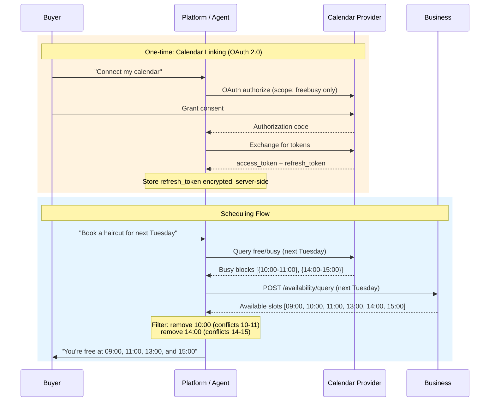

#### 11.2.8 Caching

Buyer calendar data changes frequently. Platforms **SHOULD** apply short cache
TTLs:

| Query Range        | Recommended TTL | Rationale                                    |
|--------------------|-----------------|----------------------------------------------|
| Same-day queries   | 5 minutes       | Buyer's schedule may change on short notice  |
| Future dates (1d+) | 30 minutes      | Longer horizon tolerates slightly stale data |

Platforms **SHOULD** re-fetch free/busy data before committing to a hold or
booking to minimize the risk of conflicts arising from stale cached data.

#### 11.2.9 Security and Privacy

| Requirement                        | Level          | Description                                                                                                   |
|------------------------------------|----------------|---------------------------------------------------------------------------------------------------------------|
| Narrowest OAuth scope              | **MUST**       | Use free/busy-only scopes. Never request full calendar read access for this feature.                          |
| No event details                   | **MUST NOT**   | Store, transmit, or log event details (titles, descriptions, attendees, locations).                           |
| Token encryption                   | **MUST**       | Encrypt stored refresh tokens at rest.                                                                        |
| Buyer revocation                   | **MUST**       | Support buyer-initiated revocation of calendar access at any time.                                            |
| No sharing with business           | **MUST NOT**   | Send buyer free/busy data to the business or any third party.                                                 |
| Short-lived access tokens          | **SHOULD**     | Use short-lived access tokens and refresh as needed.                                                          |
| Audit logging                      | **SHOULD**     | Log calendar access events (timestamp, buyer\_ref, provider, date range).                                     |
| Data minimization                  | **MUST**       | Comply with GDPR / CCPA data minimization principles. Only store what is necessary for the free/busy feature. |

---

## 12. Operation Reference

This table covers all REST and MCP operations defined by USP. Webhook delivery
URLs are not managed via dedicated endpoints — they are configured via the
platform profile's `webhook_url` field ([Section 8.2.3](#823-platform-profile))
or per-subscription via `POST /services/feed/subscriptions`
([Section 3.12](#312-feed-subscriptions)). ESP messages
([Section 9.5](#95-embedded-scheduling-protocol-esp)) use inter-frame
`MessageChannel` communication and are not included in this table.

**Catalog Operations:**

| Operation                | Method   | Path                                                    | Capability              |
|--------------------------|----------|---------------------------------------------------------|-------------------------|
| List Services            | `POST`   | `/services/list`                                        | catalog                 |
| Get Service              | `GET`    | `/services/{service_id}`                                | catalog                 |
| Lookup Services          | `POST`   | `/services/lookup`                                      | catalog                 |
| Service Feed             | `GET`    | `/services/feed`                                        | catalog                 |
| Create Feed Subscription | `POST`   | `/services/feed/subscriptions`                          | catalog (subscriptions) |
| Get Feed Subscription    | `GET`    | `/services/feed/subscriptions/{subscription_id}`        | catalog (subscriptions) |
| Pause Feed Subscription  | `POST`   | `/services/feed/subscriptions/{subscription_id}/pause`  | catalog (subscriptions) |
| Resume Feed Subscription | `POST`   | `/services/feed/subscriptions/{subscription_id}/resume` | catalog (subscriptions) |
| Cancel Feed Subscription | `DELETE` | `/services/feed/subscriptions/{subscription_id}`        | catalog (subscriptions) |

**Availability Operations:**

| Operation          | Method   | Path                             | Capability                   |
|--------------------|----------|----------------------------------|------------------------------|
| Query Availability | `POST`   | `/availability/query`            | availability                 |
| Hold Slot          | `POST`   | `/availability/holds`            | availability (`holds: true`) |
| Release Slot       | `DELETE` | `/availability/holds/{hold_id}`  | availability (`holds: true`) |

**Booking Operations:**

| Operation       | Method   | Path                                         | Capability |
|-----------------|----------|----------------------------------------------|------------|
| Create Booking  | `POST`   | `/bookings`                                  | bookings   |
| Get Booking     | `GET`    | `/bookings/{booking_id}`                     | bookings   |
| Update Booking  | `PUT`    | `/bookings/{booking_id}`                     | bookings   |
| Confirm Booking | `POST`   | `/bookings/{booking_id}/confirm`             | bookings   |
| Cancel Booking  | `POST`   | `/bookings/{booking_id}/cancel`              | bookings   |
| Reschedule Booking | `POST` | `/bookings/{booking_id}/reschedule`         | bookings   |
| Confirm Payment | `POST`   | `/bookings/{booking_id}/confirm-payment`     | bookings   |

**Extension Operations (Waitlist):**

| Operation             | Method   | Path                           | Capability |
|-----------------------|----------|--------------------------------|------------|
| Join Waitlist         | `POST`   | `/waitlist`                    | waitlist   |
| List Waitlist Entries | `POST`   | `/waitlist/list`               | waitlist   |
| Get Waitlist Entry    | `GET`    | `/waitlist/{entry_id}`         | waitlist   |
| Leave Waitlist        | `DELETE` | `/waitlist/{entry_id}`         | waitlist   |
| Accept Waitlist Offer | `POST`   | `/waitlist/{entry_id}/accept`  | waitlist   |
| Decline Waitlist Offer| `POST`   | `/waitlist/{entry_id}/decline` | waitlist   |

**Discovery Operations (Optional):**

| Operation         | Method | Path                         | Capability           |
|-------------------|--------|------------------------------|----------------------|
| Register Business | `POST` | `/registry/businesses`       | discovery (optional) |
| Search Businesses | `POST` | `/registry/search_business`  | discovery (optional) |
| Search Services   | `POST` | `/registry/search_services`  | discovery (optional) |

---

## 13. IANA Considerations

This document has no IANA actions at this time.

USP uses reverse-domain notation for namespace governance (
see [Section 2.5](#25-namespace-governance)), which does not require IANA
registry allocation. The `dev.usp.*` namespace is governed by the USP body.
Vendor namespaces are self-allocated via domain ownership.

If USP advances to Standards Track, future versions may request IANA
registration of:

- The `/.well-known/usp` well-known URI (per [RFC 8615])
- The `USP-Agent` HTTP header field
- A USP capability namespace registry

---

## 14. References

### 14.1 Normative References

- **[RFC 2119]** Bradner, S., "Key words for use in RFCs to Indicate Requirement
  Levels", BCP 14, RFC 2119, DOI 10.17487/RFC2119, March
  1997. https://www.rfc-editor.org/rfc/rfc2119
- **[RFC 3339]** Klyne, G. and C. Newman, "Date and Time on the Internet:
  Timestamps", RFC 3339, DOI 10.17487/RFC3339, July
  2002. https://www.rfc-editor.org/rfc/rfc3339
- **[RFC 5246]** Dierks, T. and E. Rescorla, "The Transport Layer Security (TLS)
  Protocol Version 1.2", RFC 5246, DOI 10.17487/RFC5246, August
  2008. https://www.rfc-editor.org/rfc/rfc5246
- **[RFC 6890]** Cotton, M., Vegoda, L., Bonica, R., Ed., and B. Haberman,
  "Special-Purpose IP Address Registries", BCP 153, RFC 6890, DOI
  10.17487/RFC6890, April 2013. https://www.rfc-editor.org/rfc/rfc6890
- **[RFC 6749]** Hardt, D., Ed., "The OAuth 2.0 Authorization Framework", RFC
  6749, DOI 10.17487/RFC6749, October
  2012. https://www.rfc-editor.org/rfc/rfc6749
- **[RFC 6750]** Jones, M. and D. Hardt, "The OAuth 2.0 Authorization Framework:
  Bearer Token Usage", RFC 6750, DOI 10.17487/RFC6750, October
  2012. https://www.rfc-editor.org/rfc/rfc6750
- **[RFC 7009]** Lodderstedt, T., Ed., Dronia, S., and M. Scurtescu, "OAuth 2.0
  Token Revocation", RFC 7009, DOI 10.17487/RFC7009, August
  2013. https://www.rfc-editor.org/rfc/rfc7009
- **[RFC 7517]** Jones, M., "JSON Web Key (JWK)", RFC 7517, DOI
  10.17487/RFC7517, May 2015. https://www.rfc-editor.org/rfc/rfc7517
- **[RFC 7617]** Reschke, J., "The 'Basic' HTTP Authentication Scheme", RFC
  7617, DOI 10.17487/RFC7617, September
  2015. https://www.rfc-editor.org/rfc/rfc7617
- **[RFC 7636]** Sakimura, N., Ed., Bradley, J., and N. Agarwal, "Proof Key for
  Code Exchange by OAuth Public Clients", RFC 7636, DOI 10.17487/RFC7636,
  September 2015. https://www.rfc-editor.org/rfc/rfc7636
- **[RFC 8174]** Leiba, B., "Ambiguity of Uppercase vs Lowercase in RFC 2119 Key
  Words", BCP 14, RFC 8174, DOI 10.17487/RFC8174, May
  2017. https://www.rfc-editor.org/rfc/rfc8174
- **[RFC 8414]** Jones, M., Sakimura, N., and J. Bradley, "OAuth 2.0
  Authorization Server Metadata", RFC 8414, DOI 10.17487/RFC8414, June
  2018. https://www.rfc-editor.org/rfc/rfc8414
- **[RFC 8446]** Rescorla, E., "The Transport Layer Security (TLS) Protocol
  Version 1.3", RFC 8446, DOI 10.17487/RFC8446, August
  2018. https://www.rfc-editor.org/rfc/rfc8446
- **[RFC 8615]** Nottingham, M., "Well-Known Uniform Resource Identifiers (
  URIs)", RFC 8615, DOI 10.17487/RFC8615, May
  2019. https://www.rfc-editor.org/rfc/rfc8615
- **[RFC 8941]** Nottingham, M. and P-H. Kamp, "Structured Field Values for
  HTTP", RFC 8941, DOI 10.17487/RFC8941, February
  2021. https://www.rfc-editor.org/rfc/rfc8941
- **[RFC 9110]** Fielding, R., Ed., Nottingham, M., Ed., and J. Reschke, Ed., "
  HTTP Semantics", STD 97, RFC 9110, DOI 10.17487/RFC9110, June
  2022. https://www.rfc-editor.org/rfc/rfc9110
- **[RFC 9207]** Meyer zu Selhausen, K. and D. Fett, "OAuth 2.0 Authorization
  Server Issuer Identification", RFC 9207, DOI 10.17487/RFC9207, March
  2022. https://www.rfc-editor.org/rfc/rfc9207
- **[RFC 9421]** Backman, A., Ed., Richer, J., Ed., and M. Sporny, "HTTP Message
  Signatures", RFC 9421, DOI 10.17487/RFC9421, February
  2024. https://www.rfc-editor.org/rfc/rfc9421
- **[RFC 9449]** Fett, D., Campbell, B., Bradley, J., Lodderstedt, T., Jones,
  M., and D. Waite, "OAuth 2.0 Demonstrating Proof of Possession (DPoP)", RFC
  9449, DOI 10.17487/RFC9449, September
  2023. https://www.rfc-editor.org/rfc/rfc9449
- **[RFC 9457]** Nottingham, M., Wilde, E., and S. Dalal, "Problem Details for
  HTTP APIs", RFC 9457, DOI 10.17487/RFC9457, July
  2023. https://www.rfc-editor.org/rfc/rfc9457
- **[RFC 9530]** Polli, R. and L. Pardue, "Digest Fields", RFC 9530, DOI
  10.17487/RFC9530, February 2024. https://www.rfc-editor.org/rfc/rfc9530
- **[ISO 8601]** International Organization for Standardization, "Date and
  time - Representations for information interchange", ISO 8601:
  2019. https://www.iso.org/standard/70907.html
- **[draft-ietf-httpapi-idempotency-key-header]** Dalal, S. and J. Desrosiers, "
  The Idempotency-Key HTTP Header Field",
  Internet-Draft. https://datatracker.ietf.org/doc/draft-ietf-httpapi-idempotency-key-header/
- **[draft-ietf-httpapi-ratelimit-headers]** Polli, R. and A. Martinez, "
  RateLimit Fields for HTTP",
  Internet-Draft. https://datatracker.ietf.org/doc/draft-ietf-httpapi-ratelimit-headers/

### 14.2 Informative References

- **[RFC 5545]** Desruisseaux, B., Ed., "Internet Calendaring and Scheduling
  Core Object Specification (iCalendar)", RFC 5545, DOI 10.17487/RFC5545,
  September 2009. https://www.rfc-editor.org/rfc/rfc5545
- **[RFC 5546]** Daboo, C., Ed., "iCalendar Transport-Independent
  Interoperability Protocol (iTIP)", RFC 5546, DOI 10.17487/RFC5546, December
  2009. https://www.rfc-editor.org/rfc/rfc5546
- **[RFC 6638]** Daboo, C. and B. Desruisseaux, "Scheduling Extensions to
  CalDAV", RFC 6638, DOI 10.17487/RFC6638, June
  2012. https://www.rfc-editor.org/rfc/rfc6638
- **[RFC 7986]** Daboo, C., "New Properties for iCalendar", RFC 7986, DOI
  10.17487/RFC7986, October 2016. https://www.rfc-editor.org/rfc/rfc7986
- **[OpenActive]** OpenActive Community Group, "Open Booking API 1.0 CR3", W3C
  Community Group
  Report. https://openactive.io/open-booking-api/EditorsDraft/1.0CR3/
- **[A2A]** Agent-to-Agent Protocol. https://a2a-protocol.org/latest/
- **[MCP]** Model Context
  Protocol. https://modelcontextprotocol.io/docs/getting-started/intro
- **[schema.org/Service]** schema.org, "Service
  Type". https://schema.org/Service
- **[UCP]** Universal Commerce Protocol, "UCP Specification", Version
  2026-01-11. https://ucp.dev/latest/specification/overview/
- **[RFC 4791]** Daboo, C., Desruisseaux, B., and L. Dusseault, "Calendaring
  Extensions to WebDAV (CalDAV)", RFC 4791, DOI 10.17487/RFC4791, March
  2007. https://www.rfc-editor.org/rfc/rfc4791
- **[Google Calendar FreeBusy API]** Google, "Freebusy: query", Google Calendar
  API
  Reference. https://developers.google.com/calendar/api/v3/reference/freebusy/query
- **[Microsoft Graph getSchedule]** Microsoft, "Get free/busy schedule of
  users and resources", Microsoft Graph API
  Reference. https://learn.microsoft.com/en-us/graph/api/calendar-getschedule

---

## Appendix A. Future Vertical Considerations (Informative)

This appendix is non-normative.

The core verticals defined in [Section 1.3.1](#131-core-verticals) cover the
most common scheduling domains. The following additional domains have been
identified as candidates for future standardization. They are documented here to
guide vendors defining custom verticals ([Section 1.3.2](#132-custom-verticals))
and to promote namespace convergence across the ecosystem.

Vendors implementing services in these domains **SHOULD** use the custom
vertical mechanism (reverse-domain notation) until these verticals are promoted
to core status. Platforms encountering services with these verticals **SHOULD**
fall back to treating the service as an `appointment` type for basic scheduling
operations, as described in [Section 1.3.2](#132-custom-verticals).

### A.1 Candidate Verticals

| Vertical       | Description                                                                                                                   | Examples                                                         | Key Differences from Core                                          |
|----------------|-------------------------------------------------------------------------------------------------------------------------------|------------------------------------------------------------------|--------------------------------------------------------------------|
| `event`        | A ticketed one-time event with complex capacity models (tiers, seating maps, general admission).                              | Concerts, conferences, theater, sporting events                  | Ticket tiers, seating maps, general admission vs. reserved seating |
| `course`       | A multi-session educational or training program spanning multiple dates with enrollment, progression, and completion.         | University courses, certification programs, multi-week workshops | Series management, enrollment caps, session progression            |
| `healthcare`   | A clinical appointment with domain-specific requirements such as insurance verification, referrals, and intake forms.         | Doctor visits, telehealth, lab work, dental procedures           | Insurance, referrals, HIPAA compliance, intake workflows           |
| `tour`         | A time-bound guided experience combining group capacity with location, route, and potentially weather-dependent availability. | City tours, wine tastings, adventure activities, museum tours    | Route/location, equipment, weather dependencies                    |

> `home_service` was promoted to the core `field_service` vertical ([Section 1.3.1](#131-core-verticals)); see [#40](https://github.com/wix-private/universal-scheduling-protocol-spec/issues/40).

### A.2 Promotion Criteria

A vertical **MAY** be promoted from this appendix to core status in a future
version of USP when:

1. At least two independent implementations exist using the vertical via the
   custom vertical mechanism ([Section 1.3.2](#132-custom-verticals)).
2. The additional schema fields and behavioral semantics are documented in a
   published specification.
3. The scheduling semantics cannot be adequately modeled by one of the existing
   core verticals with category differentiation alone.

---

## Authors' Addresses

*To be determined.*

[UCP]: https://ucp.dev/latest/specification/overview/

[RFC 2119]: https://www.rfc-editor.org/rfc/rfc2119

[RFC 3339]: https://www.rfc-editor.org/rfc/rfc3339

[RFC 5246]: https://www.rfc-editor.org/rfc/rfc5246

[RFC 6749]: https://www.rfc-editor.org/rfc/rfc6749

[RFC 6749 §10.12]: https://www.rfc-editor.org/rfc/rfc6749#section-10.12

[RFC 6750]: https://www.rfc-editor.org/rfc/rfc6750
[RFC 6890]: https://www.rfc-editor.org/rfc/rfc6890

[RFC 7009]: https://www.rfc-editor.org/rfc/rfc7009

[RFC 7517]: https://www.rfc-editor.org/rfc/rfc7517

[RFC 7617]: https://www.rfc-editor.org/rfc/rfc7617

[RFC 7636]: https://www.rfc-editor.org/rfc/rfc7636

[RFC 8174]: https://www.rfc-editor.org/rfc/rfc8174

[RFC 8414]: https://www.rfc-editor.org/rfc/rfc8414

[RFC 8414 §3.3]: https://www.rfc-editor.org/rfc/rfc8414#section-3.3

[RFC 8446]: https://www.rfc-editor.org/rfc/rfc8446

[RFC 8615]: https://www.rfc-editor.org/rfc/rfc8615

[RFC 8941]: https://www.rfc-editor.org/rfc/rfc8941

[RFC 9110]: https://www.rfc-editor.org/rfc/rfc9110

[RFC 9207]: https://www.rfc-editor.org/rfc/rfc9207

[RFC 9421]: https://www.rfc-editor.org/rfc/rfc9421

[RFC 9449]: https://www.rfc-editor.org/rfc/rfc9449

[RFC 9457]: https://www.rfc-editor.org/rfc/rfc9457

[RFC 9530]: https://www.rfc-editor.org/rfc/rfc9530

[ISO 8601]: https://www.iso.org/standard/70907.html

[UCP]: https://ucp.dev/latest/specification/overview/

[RFC 2119]: https://www.rfc-editor.org/rfc/rfc2119

[RFC 3339]: https://www.rfc-editor.org/rfc/rfc3339

[RFC 5246]: https://www.rfc-editor.org/rfc/rfc5246

[RFC 6749]: https://www.rfc-editor.org/rfc/rfc6749

[RFC 6749 §10.12]: https://www.rfc-editor.org/rfc/rfc6749#section-10.12

[RFC 6750]: https://www.rfc-editor.org/rfc/rfc6750
[RFC 6890]: https://www.rfc-editor.org/rfc/rfc6890

[RFC 7009]: https://www.rfc-editor.org/rfc/rfc7009

[RFC 7517]: https://www.rfc-editor.org/rfc/rfc7517

[RFC 7617]: https://www.rfc-editor.org/rfc/rfc7617

[RFC 7636]: https://www.rfc-editor.org/rfc/rfc7636

[RFC 8174]: https://www.rfc-editor.org/rfc/rfc8174

[RFC 8414]: https://www.rfc-editor.org/rfc/rfc8414

[RFC 8414 §3.3]: https://www.rfc-editor.org/rfc/rfc8414#section-3.3

[RFC 8446]: https://www.rfc-editor.org/rfc/rfc8446

[RFC 8615]: https://www.rfc-editor.org/rfc/rfc8615

[RFC 8941]: https://www.rfc-editor.org/rfc/rfc8941

[RFC 9110]: https://www.rfc-editor.org/rfc/rfc9110

[RFC 9207]: https://www.rfc-editor.org/rfc/rfc9207

[RFC 9421]: https://www.rfc-editor.org/rfc/rfc9421

[RFC 9449]: https://www.rfc-editor.org/rfc/rfc9449

[RFC 9457]: https://www.rfc-editor.org/rfc/rfc9457

[RFC 9530]: https://www.rfc-editor.org/rfc/rfc9530

[ISO 8601]: https://www.iso.org/standard/70907.html
